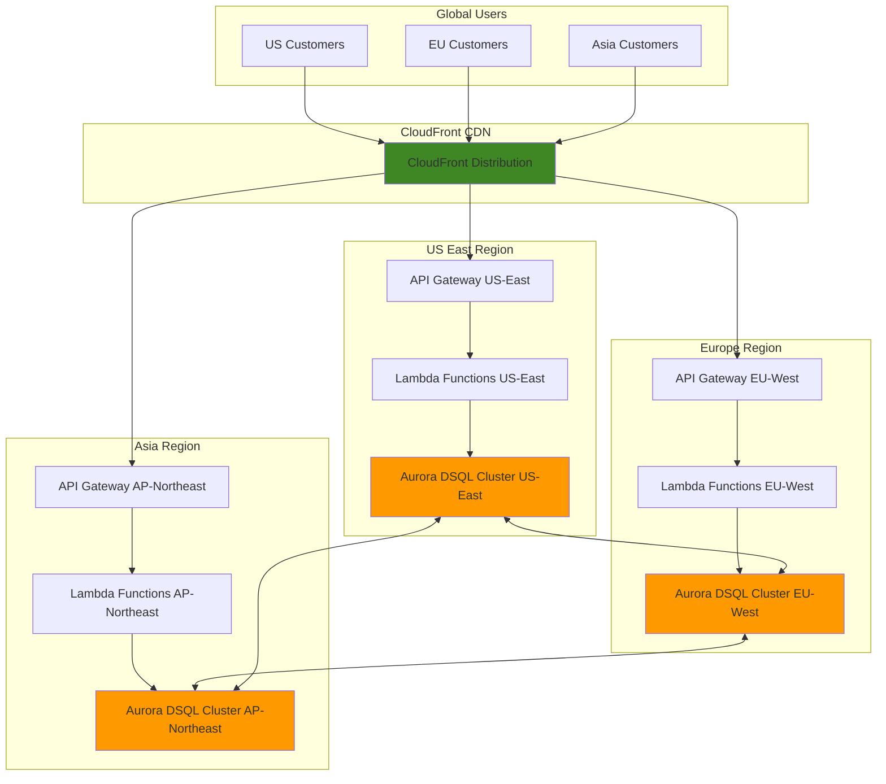

# Global E-commerce Platform with Aurora DSQL

## Problem

Modern e-commerce platforms face the challenge of serving millions of customers across multiple regions with sub-second response times while maintaining strong data consistency for transactions. Traditional databases struggle with global distribution, requiring complex sharding strategies and eventual consistency trade-offs that can lead to inventory inconsistencies, payment failures, and poor customer experiences during peak shopping periods.

## Solution

Aurora DSQL provides a serverless, distributed SQL database that enables active-active multi-region deployments with strong consistency and automatic scaling. By combining Aurora DSQL with API Gateway, Lambda, and CloudFront, we create a globally distributed e-commerce platform that scales automatically, maintains ACID transaction guarantees, and delivers low-latency responses to customers worldwide.

## Architecture Diagram



## Prerequisites

1. AWS account with appropriate permissions for Aurora DSQL, API Gateway, Lambda, and CloudFront
2. AWS CLI installed and configured (v2.0 or later)
3. Basic knowledge of SQL, REST APIs, and serverless architectures
4. Understanding of e-commerce transaction patterns and data consistency requirements
5. PostgreSQL client (psql 14+) for database operations
6. Estimated cost: $200-400/month for development environment (scales with usage)

> **Note**: Aurora DSQL is available in US East (N. Virginia), US East (Ohio), US West (Oregon), Europe (Ireland), Europe (London), Europe (Paris), and Asia Pacific regions. Multi-region clusters must be within the same region set.

## Preparation

```bash
# Set environment variables
export AWS_REGION=$(aws configure get region)
export AWS_ACCOUNT_ID=$(aws sts get-caller-identity \
    --query Account --output text)

# Generate unique identifiers for resources
RANDOM_SUFFIX=$(aws secretsmanager get-random-password \
    --exclude-punctuation --exclude-uppercase \
    --password-length 6 --require-each-included-type \
    --output text --query RandomPassword)

# Set Aurora DSQL cluster name
export DSQL_CLUSTER_NAME="ecommerce-cluster-${RANDOM_SUFFIX}"

# Create IAM role for Lambda functions
aws iam create-role \
    --role-name ecommerce-lambda-role-${RANDOM_SUFFIX} \
    --assume-role-policy-document '{
        "Version": "2012-10-17",
        "Statement": [
            {
                "Effect": "Allow",
                "Principal": {
                    "Service": "lambda.amazonaws.com"
                },
                "Action": "sts:AssumeRole"
            }
        ]
    }'

# Attach necessary policies to Lambda role
aws iam attach-role-policy \
    --role-name ecommerce-lambda-role-${RANDOM_SUFFIX} \
    --policy-arn arn:aws:iam::aws:policy/service-role/AWSLambdaBasicExecutionRole

# Create Aurora DSQL access policy
aws iam create-policy \
    --policy-name aurora-dsql-access-${RANDOM_SUFFIX} \
    --policy-document '{
        "Version": "2012-10-17",
        "Statement": [
            {
                "Effect": "Allow",
                "Action": [
                    "dsql:DbConnect",
                    "dsql:DbConnectAdmin"
                ],
                "Resource": "*"
            }
        ]
    }'

# Attach Aurora DSQL policy to Lambda role
aws iam attach-role-policy \
    --role-name ecommerce-lambda-role-${RANDOM_SUFFIX} \
    --policy-arn arn:aws:iam::${AWS_ACCOUNT_ID}:policy/aurora-dsql-access-${RANDOM_SUFFIX}

export LAMBDA_ROLE_ARN="arn:aws:iam::${AWS_ACCOUNT_ID}:role/ecommerce-lambda-role-${RANDOM_SUFFIX}"

echo "✅ AWS environment configured and IAM roles created"
```

## Steps

1. **Create Aurora DSQL Multi-Region Cluster**:

   Aurora DSQL's distributed architecture eliminates the need for traditional database sharding while providing active-active multi-region capabilities. This serverless database automatically scales compute, I/O, and storage independently, ensuring your e-commerce platform can handle traffic spikes during peak shopping seasons without manual intervention or capacity planning.

   ```bash
   # Create Aurora DSQL cluster in primary region
   aws dsql create-cluster \
       --deletion-protection-enabled \
       --tags Environment=Development,Application=Ecommerce
   
   # Wait for cluster to be active (this may take several minutes)
   aws dsql wait cluster-available \
       --cluster-identifier ${DSQL_CLUSTER_NAME}
   
   # Get cluster endpoint for PostgreSQL connections
   export DSQL_ENDPOINT=$(aws dsql describe-clusters \
       --cluster-identifier ${DSQL_CLUSTER_NAME} \
       --query 'Clusters[0].Endpoint' \
       --output text)
   
   echo "✅ Aurora DSQL cluster created: ${DSQL_ENDPOINT}"
   ```

   The cluster now provides a single logical database accessible through PostgreSQL-compatible connections. Aurora DSQL's active-active design ensures that all regions can perform read and write operations simultaneously while maintaining strong consistency through its distributed transaction coordinator, eliminating the complexity of master-slave replication patterns.

2. **Create E-commerce Database Schema**:

   Aurora DSQL uses PostgreSQL-compatible SQL with distributed transaction support. The schema design leverages DSQL's ability to handle high-concurrency transactional workloads while maintaining ACID properties across multiple regions without requiring application-level conflict resolution.

   ```bash
   # Create database schema file optimized for distributed architecture
   cat > ecommerce-schema.sql << 'EOF'
   -- Create core e-commerce tables with UUIDs for global uniqueness
   CREATE TABLE customers (
       customer_id UUID PRIMARY KEY DEFAULT gen_random_uuid(),
       email VARCHAR(255) UNIQUE NOT NULL,
       first_name VARCHAR(100) NOT NULL,
       last_name VARCHAR(100) NOT NULL,
       created_at TIMESTAMP DEFAULT CURRENT_TIMESTAMP,
       updated_at TIMESTAMP DEFAULT CURRENT_TIMESTAMP
   );
   
   CREATE TABLE products (
       product_id UUID PRIMARY KEY DEFAULT gen_random_uuid(),
       name VARCHAR(255) NOT NULL,
       description TEXT,
       price DECIMAL(10,2) NOT NULL,
       stock_quantity INTEGER NOT NULL DEFAULT 0,
       category VARCHAR(100),
       created_at TIMESTAMP DEFAULT CURRENT_TIMESTAMP,
       updated_at TIMESTAMP DEFAULT CURRENT_TIMESTAMP
   );
   
   CREATE TABLE orders (
       order_id UUID PRIMARY KEY DEFAULT gen_random_uuid(),
       customer_id UUID NOT NULL REFERENCES customers(customer_id),
       total_amount DECIMAL(10,2) NOT NULL,
       status VARCHAR(50) DEFAULT 'pending',
       created_at TIMESTAMP DEFAULT CURRENT_TIMESTAMP,
       updated_at TIMESTAMP DEFAULT CURRENT_TIMESTAMP
   );
   
   CREATE TABLE order_items (
       order_item_id UUID PRIMARY KEY DEFAULT gen_random_uuid(),
       order_id UUID NOT NULL REFERENCES orders(order_id),
       product_id UUID NOT NULL REFERENCES products(product_id),
       quantity INTEGER NOT NULL,
       unit_price DECIMAL(10,2) NOT NULL,
       created_at TIMESTAMP DEFAULT CURRENT_TIMESTAMP
   );
   
   -- Create indexes optimized for distributed queries
   CREATE INDEX idx_customers_email ON customers(email);
   CREATE INDEX idx_orders_customer_id ON orders(customer_id);
   CREATE INDEX idx_orders_status ON orders(status);
   CREATE INDEX idx_order_items_order_id ON order_items(order_id);
   CREATE INDEX idx_order_items_product_id ON order_items(product_id);
   CREATE INDEX idx_products_category ON products(category);
   
   -- Insert sample data for testing
   INSERT INTO customers (email, first_name, last_name) VALUES
   ('john.doe@example.com', 'John', 'Doe'),
   ('jane.smith@example.com', 'Jane', 'Smith');
   
   INSERT INTO products (name, description, price, stock_quantity, category) VALUES
   ('Wireless Headphones', 'High-quality wireless headphones', 199.99, 100, 'Electronics'),
   ('Coffee Mug', 'Ceramic coffee mug', 12.99, 500, 'Home'),
   ('Laptop Stand', 'Adjustable laptop stand', 49.99, 50, 'Electronics');
   EOF
   
   # Get authentication token for PostgreSQL connection
   DSQL_TOKEN=$(aws dsql generate-db-connect-admin-auth-token \
       --hostname ${DSQL_ENDPOINT} \
       --region ${AWS_REGION})
   
   # Execute schema using psql with IAM authentication
   PGPASSWORD="${DSQL_TOKEN}" psql \
       -h ${DSQL_ENDPOINT} \
       -U ${AWS_ACCOUNT_ID} \
       -d postgres \
       -f ecommerce-schema.sql
   
   echo "✅ E-commerce database schema created with sample data"
   ```

   This schema design optimizes for Aurora DSQL's distributed architecture by using UUIDs for primary keys, avoiding sequences that could create contention across regions. The transactional design ensures inventory consistency during concurrent order processing while the distributed indexes enable efficient queries across the global dataset.

3. **Create Lambda Functions for API Operations**:

   Lambda functions provide serverless compute that scales automatically with your e-commerce traffic. Each function handles specific business logic while maintaining transaction integrity through Aurora DSQL's distributed transaction support and PostgreSQL-compatible connection pooling.

   ```bash
   # Create Lambda function for product operations with PostgreSQL driver
   mkdir -p lambda-layers/python/lib/python3.12/site-packages
   
   # Install PostgreSQL driver in layer
   pip install psycopg2-binary boto3 -t lambda-layers/python/lib/python3.12/site-packages/
   
   cd lambda-layers
   zip -r ../psycopg2-layer.zip .
   cd ..
   
   # Create Lambda layer for PostgreSQL connectivity
   export LAYER_ARN=$(aws lambda publish-layer-version \
       --layer-name psycopg2-${RANDOM_SUFFIX} \
       --zip-file fileb://psycopg2-layer.zip \
       --compatible-runtimes python3.12 \
       --query 'LayerVersionArn' --output text)
   
   # Create Lambda function for product operations
   cat > product-handler.py << 'EOF'
   import json
   import boto3
   import os
   import psycopg2
   from decimal import Decimal
   
   def get_db_connection():
       """Establish connection to Aurora DSQL using IAM authentication"""
       dsql_client = boto3.client('dsql')
       token = dsql_client.generate_db_connect_admin_auth_token(
           hostname=os.environ['DSQL_ENDPOINT'],
           region=os.environ['AWS_REGION']
       )
       
       return psycopg2.connect(
           host=os.environ['DSQL_ENDPOINT'],
           database='postgres',
           user=os.environ['AWS_ACCOUNT_ID'],
           password=token,
           port=5432,
           sslmode='require'
       )
   
   def lambda_handler(event, context):
       try:
           http_method = event['httpMethod']
           
           if http_method == 'GET':
               # Retrieve all products with connection pooling optimization
               with get_db_connection() as conn:
                   with conn.cursor() as cursor:
                       cursor.execute("""
                           SELECT product_id, name, description, price, stock_quantity, category
                           FROM products
                           ORDER BY created_at DESC
                       """)
                       
                       products = []
                       for row in cursor.fetchall():
                           products.append({
                               'product_id': str(row[0]),
                               'name': row[1],
                               'description': row[2],
                               'price': float(row[3]),
                               'stock_quantity': row[4],
                               'category': row[5]
                           })
               
               return {
                   'statusCode': 200,
                   'headers': {
                       'Content-Type': 'application/json',
                       'Access-Control-Allow-Origin': '*'
                   },
                   'body': json.dumps(products)
               }
           
           elif http_method == 'POST':
               # Create new product with distributed transaction support
               body = json.loads(event['body'])
               
               with get_db_connection() as conn:
                   with conn.cursor() as cursor:
                       cursor.execute("""
                           INSERT INTO products (name, description, price, stock_quantity, category)
                           VALUES (%s, %s, %s, %s, %s)
                           RETURNING product_id
                       """, (
                           body['name'],
                           body['description'],
                           body['price'],
                           body['stock_quantity'],
                           body['category']
                       ))
                       
                       product_id = cursor.fetchone()[0]
                       conn.commit()
               
               return {
                   'statusCode': 201,
                   'headers': {
                       'Content-Type': 'application/json',
                       'Access-Control-Allow-Origin': '*'
                   },
                   'body': json.dumps({'product_id': str(product_id)})
               }
               
       except Exception as e:
           return {
               'statusCode': 500,
               'headers': {'Access-Control-Allow-Origin': '*'},
               'body': json.dumps({'error': str(e)})
           }
   EOF
   
   # Create deployment package
   mkdir -p lambda-package
   cp product-handler.py lambda-package/
   cd lambda-package
   zip -r ../product-handler.zip .
   cd ..
   
   # Deploy Lambda function with updated runtime and layer
   aws lambda create-function \
       --function-name ecommerce-products-${RANDOM_SUFFIX} \
       --runtime python3.12 \
       --role ${LAMBDA_ROLE_ARN} \
       --handler product-handler.lambda_handler \
       --zip-file fileb://product-handler.zip \
       --timeout 30 \
       --memory-size 256 \
       --layers ${LAYER_ARN} \
       --environment Variables="{DSQL_ENDPOINT=${DSQL_ENDPOINT},AWS_ACCOUNT_ID=${AWS_ACCOUNT_ID}}"
   
   echo "✅ Product Lambda function deployed with PostgreSQL connectivity"
   ```

   The Lambda function leverages Aurora DSQL's PostgreSQL-compatible interface through proper database connection pooling and IAM authentication, eliminating the need for credential management while benefiting from the distributed architecture's automatic scaling and high availability across regions.

4. **Create Order Processing Lambda Function**:

   Order processing requires complex transactional logic to ensure inventory consistency and payment processing integrity. Aurora DSQL's distributed transaction support enables atomic operations across multiple tables while maintaining performance at scale through optimistic concurrency control and distributed coordination.

   ```bash
   # Create order processing function with transaction management
   cat > order-handler.py << 'EOF'
   import json
   import boto3
   import os
   import psycopg2
   from decimal import Decimal
   
   def get_db_connection():
       """Establish connection to Aurora DSQL using IAM authentication"""
       dsql_client = boto3.client('dsql')
       token = dsql_client.generate_db_connect_admin_auth_token(
           hostname=os.environ['DSQL_ENDPOINT'],
           region=os.environ['AWS_REGION']
       )
       
       return psycopg2.connect(
           host=os.environ['DSQL_ENDPOINT'],
           database='postgres',
           user=os.environ['AWS_ACCOUNT_ID'],
           password=token,
           port=5432,
           sslmode='require'
       )
   
   def lambda_handler(event, context):
       try:
           http_method = event['httpMethod']
           
           if http_method == 'POST':
               # Process new order with distributed transaction integrity
               body = json.loads(event['body'])
               customer_id = body['customer_id']
               items = body['items']
               
               with get_db_connection() as conn:
                   with conn.cursor() as cursor:
                       try:
                           # Begin distributed transaction
                           cursor.execute("BEGIN")
                           
                           # Create order record with initial status
                           cursor.execute("""
                               INSERT INTO orders (customer_id, total_amount, status)
                               VALUES (%s, %s, %s)
                               RETURNING order_id
                           """, (customer_id, Decimal('0.00'), 'processing'))
                           
                           order_id = cursor.fetchone()[0]
                           total_amount = Decimal('0.00')
                           
                           # Process each item with inventory validation
                           for item in items:
                               product_id = item['product_id']
                               quantity = item['quantity']
                               
                               # Check stock and get price with row-level locking
                               cursor.execute("""
                                   SELECT price, stock_quantity
                                   FROM products
                                   WHERE product_id = %s
                                   FOR UPDATE
                               """, (product_id,))
                               
                               result = cursor.fetchone()
                               if not result:
                                   raise Exception(f"Product {product_id} not found")
                               
                               price, stock = result
                               
                               if stock < quantity:
                                   raise Exception(f"Insufficient stock for product {product_id}")
                               
                               # Update inventory atomically
                               cursor.execute("""
                                   UPDATE products
                                   SET stock_quantity = stock_quantity - %s
                                   WHERE product_id = %s
                               """, (quantity, product_id))
                               
                               # Add order item
                               cursor.execute("""
                                   INSERT INTO order_items (order_id, product_id, quantity, unit_price)
                                   VALUES (%s, %s, %s, %s)
                               """, (order_id, product_id, quantity, price))
                               
                               total_amount += price * quantity
                           
                           # Update order total and mark as completed
                           cursor.execute("""
                               UPDATE orders
                               SET total_amount = %s, status = %s
                               WHERE order_id = %s
                           """, (total_amount, 'completed', order_id))
                           
                           # Commit distributed transaction
                           conn.commit()
                           
                           return {
                               'statusCode': 201,
                               'headers': {
                                   'Content-Type': 'application/json',
                                   'Access-Control-Allow-Origin': '*'
                               },
                               'body': json.dumps({
                                   'order_id': str(order_id),
                                   'total_amount': float(total_amount)
                               })
                           }
                           
                       except Exception as e:
                           # Rollback transaction on any error
                           conn.rollback()
                           raise e
                           
       except Exception as e:
           return {
               'statusCode': 400,
               'headers': {'Access-Control-Allow-Origin': '*'},
               'body': json.dumps({'error': str(e)})
           }
   EOF
   
   # Create deployment package
   cp order-handler.py lambda-package/
   cd lambda-package
   zip -r ../order-handler.zip .
   cd ..
   
   # Deploy Lambda function
   aws lambda create-function \
       --function-name ecommerce-orders-${RANDOM_SUFFIX} \
       --runtime python3.12 \
       --role ${LAMBDA_ROLE_ARN} \
       --handler order-handler.lambda_handler \
       --zip-file fileb://order-handler.zip \
       --timeout 30 \
       --memory-size 256 \
       --layers ${LAYER_ARN} \
       --environment Variables="{DSQL_ENDPOINT=${DSQL_ENDPOINT},AWS_ACCOUNT_ID=${AWS_ACCOUNT_ID}}"
   
   echo "✅ Order processing Lambda function deployed with transaction support"
   ```

   This function demonstrates Aurora DSQL's distributed transaction capabilities through PostgreSQL's standard transaction interface, performing atomic operations across multiple tables while maintaining strong consistency. The row-level locking and transaction management ensure proper isolation and consistency in the distributed environment.

5. **Create API Gateway REST API**:

   API Gateway provides a managed REST API that integrates seamlessly with Lambda functions. The gateway handles request routing, authentication, and provides built-in features like rate limiting and caching to protect your backend services while maintaining the scalability needed for global e-commerce operations.

   ```bash
   # Create API Gateway with comprehensive configuration
   export API_ID=$(aws apigateway create-rest-api \
       --name ecommerce-api-${RANDOM_SUFFIX} \
       --description "E-commerce API with Aurora DSQL backend" \
       --endpoint-configuration types=REGIONAL \
       --query 'id' --output text)
   
   # Get root resource ID
   export ROOT_RESOURCE_ID=$(aws apigateway get-resources \
       --rest-api-id ${API_ID} \
       --query 'items[0].id' --output text)
   
   # Create products resource
   export PRODUCTS_RESOURCE_ID=$(aws apigateway create-resource \
       --rest-api-id ${API_ID} \
       --parent-id ${ROOT_RESOURCE_ID} \
       --path-part products \
       --query 'id' --output text)
   
   # Create orders resource
   export ORDERS_RESOURCE_ID=$(aws apigateway create-resource \
       --rest-api-id ${API_ID} \
       --parent-id ${ROOT_RESOURCE_ID} \
       --path-part orders \
       --query 'id' --output text)
   
   # Get Lambda function ARNs for integration
   export PRODUCTS_LAMBDA_ARN=$(aws lambda get-function \
       --function-name ecommerce-products-${RANDOM_SUFFIX} \
       --query 'Configuration.FunctionArn' --output text)
   
   export ORDERS_LAMBDA_ARN=$(aws lambda get-function \
       --function-name ecommerce-orders-${RANDOM_SUFFIX} \
       --query 'Configuration.FunctionArn' --output text)
   
   echo "✅ API Gateway resources created with regional endpoints"
   ```

   API Gateway acts as the entry point for your global e-commerce platform, providing a unified interface that can be distributed through CloudFront to edge locations worldwide for optimal performance while maintaining centralized management and monitoring capabilities.

6. **Configure API Gateway Methods and Integrations**:

   Each API method requires specific integration configuration to properly route requests to Lambda functions. This setup enables Lambda proxy integration, which provides the full HTTP request context to your functions while maintaining optimal performance through connection pooling and request optimization.

   ```bash
   # Configure HTTP methods with proper request validation
   aws apigateway put-method \
       --rest-api-id ${API_ID} \
       --resource-id ${PRODUCTS_RESOURCE_ID} \
       --http-method GET \
       --authorization-type NONE \
       --no-api-key-required
   
   aws apigateway put-method \
       --rest-api-id ${API_ID} \
       --resource-id ${PRODUCTS_RESOURCE_ID} \
       --http-method POST \
       --authorization-type NONE \
       --no-api-key-required
   
   aws apigateway put-method \
       --rest-api-id ${API_ID} \
       --resource-id ${ORDERS_RESOURCE_ID} \
       --http-method POST \
       --authorization-type NONE \
       --no-api-key-required
   
   # Configure Lambda proxy integrations for seamless request handling
   aws apigateway put-integration \
       --rest-api-id ${API_ID} \
       --resource-id ${PRODUCTS_RESOURCE_ID} \
       --http-method GET \
       --type AWS_PROXY \
       --integration-http-method POST \
       --uri arn:aws:apigateway:${AWS_REGION}:lambda:path/2015-03-31/functions/${PRODUCTS_LAMBDA_ARN}/invocations
   
   aws apigateway put-integration \
       --rest-api-id ${API_ID} \
       --resource-id ${PRODUCTS_RESOURCE_ID} \
       --http-method POST \
       --type AWS_PROXY \
       --integration-http-method POST \
       --uri arn:aws:apigateway:${AWS_REGION}:lambda:path/2015-03-31/functions/${PRODUCTS_LAMBDA_ARN}/invocations
   
   aws apigateway put-integration \
       --rest-api-id ${API_ID} \
       --resource-id ${ORDERS_RESOURCE_ID} \
       --http-method POST \
       --type AWS_PROXY \
       --integration-http-method POST \
       --uri arn:aws:apigateway:${AWS_REGION}:lambda:path/2015-03-31/functions/${ORDERS_LAMBDA_ARN}/invocations
   
   echo "✅ API Gateway methods and integrations configured"
   ```

   These integrations enable API Gateway to forward HTTP requests directly to Lambda functions using the AWS_PROXY integration type, which provides the most flexibility for handling different request patterns while maintaining low latency and high throughput for your e-commerce operations.

7. **Grant API Gateway Permission to Invoke Lambda Functions**:

   API Gateway requires explicit permission to invoke Lambda functions. These permissions are managed through Lambda's resource-based policy system, ensuring secure access control while enabling the seamless integration between API Gateway and your serverless backend functions.

   ```bash
   # Grant API Gateway permission to invoke products Lambda
   aws lambda add-permission \
       --function-name ecommerce-products-${RANDOM_SUFFIX} \
       --statement-id apigateway-invoke-products \
       --action lambda:InvokeFunction \
       --principal apigateway.amazonaws.com \
       --source-arn "arn:aws:execute-api:${AWS_REGION}:${AWS_ACCOUNT_ID}:${API_ID}/*/*"
   
   # Grant API Gateway permission to invoke orders Lambda
   aws lambda add-permission \
       --function-name ecommerce-orders-${RANDOM_SUFFIX} \
       --statement-id apigateway-invoke-orders \
       --action lambda:InvokeFunction \
       --principal apigateway.amazonaws.com \
       --source-arn "arn:aws:execute-api:${AWS_REGION}:${AWS_ACCOUNT_ID}:${API_ID}/*/*"
   
   # Deploy API to production stage with monitoring enabled
   aws apigateway create-deployment \
       --rest-api-id ${API_ID} \
       --stage-name prod \
       --stage-description "Production deployment" \
       --description "E-commerce API deployment"
   
   # Enable CloudWatch logging for API monitoring
   aws apigateway update-stage \
       --rest-api-id ${API_ID} \
       --stage-name prod \
       --patch-ops \
           op=replace,path=/accessLogSettings/destinationArn,value=arn:aws:logs:${AWS_REGION}:${AWS_ACCOUNT_ID}:log-group:API-Gateway-Execution-Logs_${API_ID}/prod \
           op=replace,path=/*/logging/loglevel,value=INFO \
           op=replace,path=/*/logging/dataTrace,value=true
   
   # Get API endpoint URL
   export API_URL="https://${API_ID}.execute-api.${AWS_REGION}.amazonaws.com/prod"
   
   echo "✅ API deployed at: ${API_URL}"
   ```

   The API is now deployed and accessible through a dedicated HTTPS endpoint that can handle production traffic with built-in security, monitoring, and logging features enabled for comprehensive observability of your e-commerce platform.

8. **Create CloudFront Distribution for Global Delivery**:

   CloudFront provides global content delivery through edge locations worldwide, reducing latency by serving API responses from the nearest edge location. This integration significantly improves performance for international customers while providing DDoS protection and SSL termination at the edge.

   ```bash
   # Create CloudFront distribution configuration for API caching
   cat > cloudfront-config.json << EOF
   {
       "CallerReference": "ecommerce-${RANDOM_SUFFIX}-$(date +%s)",
       "Comment": "E-commerce API distribution with global edge caching",
       "DefaultCacheBehavior": {
           "TargetOriginId": "api-origin",
           "ViewerProtocolPolicy": "redirect-to-https",
           "TrustedSigners": {
               "Enabled": false,
               "Quantity": 0
           },
           "ForwardedValues": {
               "QueryString": true,
               "Cookies": {
                   "Forward": "all"
               },
               "Headers": {
                   "Quantity": 4,
                   "Items": ["Authorization", "Content-Type", "Accept", "Origin"]
               }
           },
           "MinTTL": 0,
           "DefaultTTL": 0,
           "MaxTTL": 86400,
           "Compress": true
       },
       "Origins": {
           "Quantity": 1,
           "Items": [
               {
                   "Id": "api-origin",
                   "DomainName": "${API_ID}.execute-api.${AWS_REGION}.amazonaws.com",
                   "OriginPath": "/prod",
                   "CustomOriginConfig": {
                       "HTTPPort": 443,
                       "HTTPSPort": 443,
                       "OriginProtocolPolicy": "https-only",
                       "OriginSslProtocols": {
                           "Quantity": 1,
                           "Items": ["TLSv1.2"]
                       }
                   }
               }
           ]
       },
       "Enabled": true,
       "PriceClass": "PriceClass_All",
       "WebACLId": ""
   }
   EOF
   
   # Create CloudFront distribution with enhanced security
   export DISTRIBUTION_ID=$(aws cloudfront create-distribution \
       --distribution-config file://cloudfront-config.json \
       --query 'Distribution.Id' --output text)
   
   # Get CloudFront domain name
   export CLOUDFRONT_DOMAIN=$(aws cloudfront get-distribution \
       --id ${DISTRIBUTION_ID} \
       --query 'Distribution.DomainName' --output text)
   
   echo "✅ CloudFront distribution created: https://${CLOUDFRONT_DOMAIN}"
   echo "✅ Distribution is deploying globally (this may take 10-15 minutes)"
   ```

   CloudFront now caches API responses at edge locations worldwide, reducing latency for global customers while maintaining the ability to serve dynamic content from your Aurora DSQL backend. The distribution includes compression and security headers for optimal performance and protection.

## Validation & Testing

1. **Verify Aurora DSQL Cluster Status**:

   ```bash
   # Check cluster status and connectivity
   aws dsql describe-clusters \
       --cluster-identifier ${DSQL_CLUSTER_NAME} \
       --query 'Clusters[0].Status' --output text
   
   # Test PostgreSQL connectivity
   DSQL_TOKEN=$(aws dsql generate-db-connect-admin-auth-token \
       --hostname ${DSQL_ENDPOINT} \
       --region ${AWS_REGION})
   
   PGPASSWORD="${DSQL_TOKEN}" psql \
       -h ${DSQL_ENDPOINT} \
       -U ${AWS_ACCOUNT_ID} \
       -d postgres \
       -c "SELECT COUNT(*) FROM products;"
   ```

   Expected output: `ACTIVE` status and successful product count query

2. **Test Product API Endpoints**:

   ```bash
   # Test GET products endpoint
   curl -X GET "${API_URL}/products" \
       -H "Content-Type: application/json" \
       -w "Response time: %{time_total}s\n"
   
   # Test POST product creation
   curl -X POST "${API_URL}/products" \
       -H "Content-Type: application/json" \
       -d '{
           "name": "Test Product",
           "description": "Automated test product",
           "price": 29.99,
           "stock_quantity": 10,
           "category": "Test"
       }' \
       -w "Response time: %{time_total}s\n"
   ```

   Expected output: JSON array of products for GET, product_id for POST with sub-second response times

3. **Test Order Processing with Transaction Validation**:

   ```bash
   # Get customer and product IDs for testing
   DSQL_TOKEN=$(aws dsql generate-db-connect-admin-auth-token \
       --hostname ${DSQL_ENDPOINT} \
       --region ${AWS_REGION})
   
   CUSTOMER_ID=$(PGPASSWORD="${DSQL_TOKEN}" psql \
       -h ${DSQL_ENDPOINT} \
       -U ${AWS_ACCOUNT_ID} \
       -d postgres \
       -t -c "SELECT customer_id FROM customers LIMIT 1;" | xargs)
   
   PRODUCT_ID=$(PGPASSWORD="${DSQL_TOKEN}" psql \
       -h ${DSQL_ENDPOINT} \
       -U ${AWS_ACCOUNT_ID} \
       -d postgres \
       -t -c "SELECT product_id FROM products LIMIT 1;" | xargs)
   
   # Test order creation with inventory validation
   curl -X POST "${API_URL}/orders" \
       -H "Content-Type: application/json" \
       -d "{
           \"customer_id\": \"${CUSTOMER_ID}\",
           \"items\": [
               {
                   \"product_id\": \"${PRODUCT_ID}\",
                   \"quantity\": 2
               }
           ]
       }" \
       -w "Response time: %{time_total}s\n"
   ```

   Expected output: JSON with order_id and total_amount, demonstrating successful distributed transaction processing

4. **Test CloudFront Global Distribution**:

   ```bash
   # Test CloudFront endpoint performance (wait 10-15 minutes after creation)
   curl -X GET "https://${CLOUDFRONT_DOMAIN}/products" \
       -H "Content-Type: application/json" \
       -w "Total time: %{time_total}s, TTFB: %{time_starttransfer}s\n" \
       -H "CloudFront-Viewer-Country: US"
   
   # Verify caching headers
   curl -I "https://${CLOUDFRONT_DOMAIN}/products"
   ```

   Expected output: Same product data with improved global response times and CloudFront caching headers

## Cleanup

1. **Delete CloudFront Distribution**:

   ```bash
   # Disable distribution first (required before deletion)
   aws cloudfront get-distribution-config \
       --id ${DISTRIBUTION_ID} \
       --output json > dist-config.json
   
   # Update enabled status to false
   jq '.DistributionConfig.Enabled = false' dist-config.json > dist-config-disabled.json
   
   # Update distribution configuration
   aws cloudfront update-distribution \
       --id ${DISTRIBUTION_ID} \
       --if-match $(jq -r '.ETag' dist-config.json) \
       --distribution-config file://dist-config-disabled.json
   
   # Wait for distribution to be deployed
   aws cloudfront wait distribution-deployed \
       --id ${DISTRIBUTION_ID}
   
   # Delete distribution
   aws cloudfront delete-distribution \
       --id ${DISTRIBUTION_ID} \
       --if-match $(aws cloudfront get-distribution \
           --id ${DISTRIBUTION_ID} \
           --query 'ETag' --output text)
   
   echo "✅ CloudFront distribution deleted"
   ```

2. **Delete API Gateway**:

   ```bash
   # Delete API Gateway and all associated resources
   aws apigateway delete-rest-api \
       --rest-api-id ${API_ID}
   
   echo "✅ API Gateway deleted"
   ```

3. **Delete Lambda Functions and Layer**:

   ```bash
   # Delete Lambda functions
   aws lambda delete-function \
       --function-name ecommerce-products-${RANDOM_SUFFIX}
   
   aws lambda delete-function \
       --function-name ecommerce-orders-${RANDOM_SUFFIX}
   
   # Delete Lambda layer
   aws lambda delete-layer-version \
       --layer-name psycopg2-${RANDOM_SUFFIX} \
       --version-number 1
   
   echo "✅ Lambda functions and layer deleted"
   ```

4. **Delete Aurora DSQL Cluster**:

   ```bash
   # Disable deletion protection first
   aws dsql modify-cluster \
       --cluster-identifier ${DSQL_CLUSTER_NAME} \
       --no-deletion-protection-enabled
   
   # Delete Aurora DSQL cluster
   aws dsql delete-cluster \
       --cluster-identifier ${DSQL_CLUSTER_NAME} \
       --final-cluster-snapshot-identifier ${DSQL_CLUSTER_NAME}-final-snapshot
   
   echo "✅ Aurora DSQL cluster deleted"
   ```

5. **Delete IAM Resources**:

   ```bash
   # Detach policies and delete role
   aws iam detach-role-policy \
       --role-name ecommerce-lambda-role-${RANDOM_SUFFIX} \
       --policy-arn arn:aws:iam::aws:policy/service-role/AWSLambdaBasicExecutionRole
   
   aws iam detach-role-policy \
       --role-name ecommerce-lambda-role-${RANDOM_SUFFIX} \
       --policy-arn arn:aws:iam::${AWS_ACCOUNT_ID}:policy/aurora-dsql-access-${RANDOM_SUFFIX}
   
   aws iam delete-policy \
       --policy-arn arn:aws:iam::${AWS_ACCOUNT_ID}:policy/aurora-dsql-access-${RANDOM_SUFFIX}
   
   aws iam delete-role \
       --role-name ecommerce-lambda-role-${RANDOM_SUFFIX}
   
   echo "✅ IAM resources deleted"
   ```

## Discussion

Aurora DSQL represents a significant advancement in distributed database technology, combining the familiar PostgreSQL interface with a serverless, multi-region architecture that automatically handles the complexities of distributed systems. Unlike traditional databases that require manual sharding and complex replication strategies, Aurora DSQL provides a single logical database that spans multiple regions with active-active write capabilities and strong consistency guarantees.

The architecture demonstrated in this recipe leverages Aurora DSQL's unique strengths for e-commerce workloads, which require strong consistency for inventory management and financial transactions. The distributed design ensures that customer orders processed in different regions maintain data integrity without the eventual consistency challenges common in traditional distributed systems. This is particularly important for e-commerce platforms where overselling inventory or double-charging customers can have serious business consequences and regulatory implications.

The integration with serverless technologies like Lambda and API Gateway creates a highly scalable architecture that can handle traffic spikes during peak shopping periods without pre-provisioning resources. CloudFront's global edge network further enhances performance by caching API responses and reducing latency for international customers. This combination provides a cost-effective solution that scales automatically while maintaining enterprise-grade reliability and global consistency.

The recipe demonstrates best practices for distributed transaction processing using Aurora DSQL's PostgreSQL-compatible interface, including proper connection management, transaction isolation, and atomic operations across multiple tables. Aurora DSQL's optimistic concurrency control and distributed transaction coordinator ensure that these operations maintain ACID properties even when spanning multiple regions. For comprehensive information on Aurora DSQL's transaction model and PostgreSQL compatibility, see the [Aurora DSQL User Guide](https://docs.aws.amazon.com/aurora-dsql/latest/userguide/what-is-aurora-dsql.html).

> **Tip**: Monitor your Aurora DSQL cluster's performance using CloudWatch metrics and set up alerts for high transaction rates or latency spikes to ensure optimal customer experience during peak traffic periods.

For production deployments, consider implementing additional security measures such as API Gateway authorizers for authentication, Lambda layers for shared dependencies and improved cold start performance, and AWS WAF for protecting against common web application attacks and DDoS attempts. The [AWS Well-Architected Framework](https://docs.aws.amazon.com/wellarchitected/latest/framework/welcome.html) provides comprehensive guidance on building secure, reliable, and cost-effective systems. Additionally, review the [API Gateway security best practices](https://docs.aws.amazon.com/apigateway/latest/developerguide/security.html) and [Lambda security documentation](https://docs.aws.amazon.com/lambda/latest/dg/lambda-security.html) for implementing defense-in-depth strategies appropriate for financial transaction processing.

## Challenge

Extend this global e-commerce platform by implementing these advanced features:

1. **Multi-Region Disaster Recovery**: Configure Aurora DSQL multi-region clusters across different region sets and implement automated failover mechanisms using Route 53 health checks and CloudFront origin groups for comprehensive business continuity.

2. **Real-time Inventory Synchronization**: Implement EventBridge integration to broadcast inventory changes across regions in real-time, ensuring customers see accurate stock levels regardless of their location while maintaining strong consistency guarantees.

3. **Advanced API Security**: Add Cognito user pools for customer authentication, implement API Gateway request validation with JSON schemas, and configure AWS WAF rules to protect against common e-commerce attack patterns including SQL injection and cross-site scripting.

4. **Performance Optimization**: Implement API Gateway caching strategies with custom cache keys, optimize Lambda function cold starts using provisioned concurrency, and add comprehensive CloudWatch dashboards for monitoring key performance metrics and business KPIs.

5. **Event-Driven Order Processing**: Extend the order processing system using Step Functions to orchestrate complex workflows including payment processing, inventory reservation, fulfillment tracking, and customer notifications with proper error handling, retry mechanisms, and dead letter queues.

## Infrastructure Code

### Available Infrastructure as Code:

- [Infrastructure Code Overview](code/README.md) - Detailed description of all infrastructure components
- [AWS CDK (Python)](code/cdk-python/) - AWS CDK Python implementation
- [AWS CDK (TypeScript)](code/cdk-typescript/) - AWS CDK TypeScript implementation
- [CloudFormation](code/cloudformation.yaml) - AWS CloudFormation template
- [Bash CLI Scripts](code/scripts/) - Example bash scripts using AWS CLI commands to deploy infrastructure
- [Terraform](code/terraform/) - Terraform configuration files