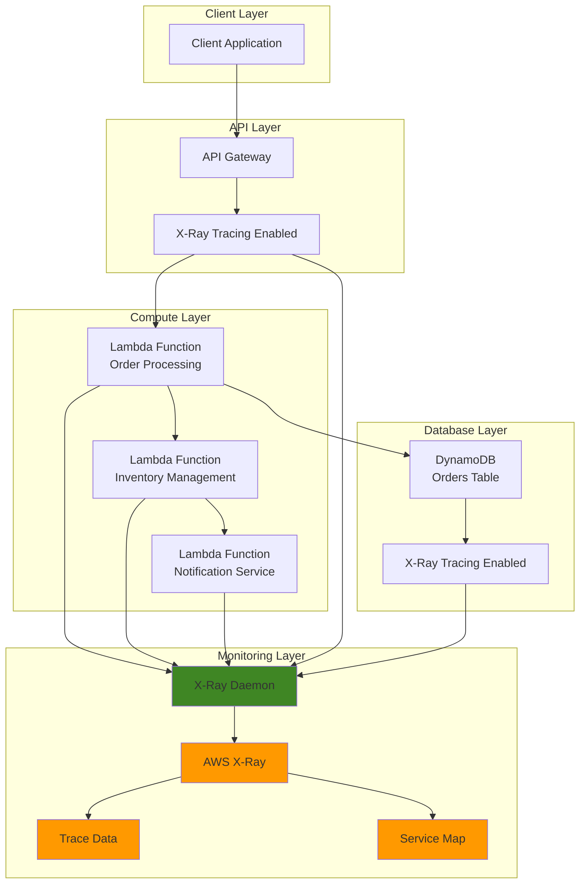

# Application Monitoring with X-Ray Distributed Tracing


## Problem

Modern distributed applications consist of multiple microservices across various AWS services, making it extremely difficult to understand performance bottlenecks, trace request paths, and identify the root cause of latency issues. Development teams struggle to monitor complex service interactions, troubleshoot failed requests, and optimize application performance without visibility into the complete request flow. Traditional monitoring approaches provide service-level metrics but fail to show the complete picture of how requests propagate through distributed systems, leading to prolonged debugging sessions and poor user experience.

## Solution

AWS X-Ray provides distributed tracing capabilities that track requests as they flow through your application's components, creating a comprehensive service map and detailed trace information. This solution implements X-Ray tracing across a serverless application architecture including API Gateway, Lambda functions, and DynamoDB, enabling complete observability of request flows, performance metrics, and error tracking. The implementation includes custom sampling rules, trace annotations, and automated trace analysis to provide actionable insights for performance optimization.

## Architecture Diagram



## Prerequisites

1. AWS account with appropriate permissions for X-Ray, Lambda, API Gateway, and DynamoDB
2. AWS CLI v2 installed and configured (or AWS CloudShell)
3. Understanding of distributed systems and application monitoring concepts
4. Basic knowledge of serverless architectures and AWS services
5. Estimated cost: $10-15 for X-Ray traces, Lambda execution, API Gateway requests, and DynamoDB usage

> **Note**: X-Ray charges $5.00 per 1 million traces recorded and $0.50 per 1 million traces retrieved or scanned.

## Preparation

```bash
# Set environment variables
export AWS_REGION=$(aws configure get region)
export AWS_ACCOUNT_ID=$(aws sts get-caller-identity \
    --query Account --output text)

# Generate unique identifiers for resources
RANDOM_SUFFIX=$(aws secretsmanager get-random-password \
    --exclude-punctuation --exclude-uppercase \
    --password-length 6 --require-each-included-type \
    --output text --query RandomPassword)

export PROJECT_NAME="xray-monitoring-${RANDOM_SUFFIX}"
export ORDERS_TABLE_NAME="${PROJECT_NAME}-orders"
export LAMBDA_ROLE_NAME="${PROJECT_NAME}-lambda-role"
export API_GATEWAY_NAME="${PROJECT_NAME}-api"

# Create foundational IAM role for Lambda functions
aws iam create-role \
    --role-name ${LAMBDA_ROLE_NAME} \
    --assume-role-policy-document '{
        "Version": "2012-10-17",
        "Statement": [
            {
                "Effect": "Allow",
                "Principal": {
                    "Service": "lambda.amazonaws.com"
                },
                "Action": "sts:AssumeRole"
            }
        ]
    }'

# Attach necessary policies to the Lambda role
aws iam attach-role-policy \
    --role-name ${LAMBDA_ROLE_NAME} \
    --policy-arn arn:aws:iam::aws:policy/service-role/AWSLambdaBasicExecutionRole

aws iam attach-role-policy \
    --role-name ${LAMBDA_ROLE_NAME} \
    --policy-arn arn:aws:iam::aws:policy/AWSXRayDaemonWriteAccess

aws iam attach-role-policy \
    --role-name ${LAMBDA_ROLE_NAME} \
    --policy-arn arn:aws:iam::aws:policy/AmazonDynamoDBFullAccess

# Attach policies for CloudWatch and EventBridge
aws iam attach-role-policy \
    --role-name ${LAMBDA_ROLE_NAME} \
    --policy-arn arn:aws:iam::aws:policy/CloudWatchFullAccess

echo "✅ IAM role created and policies attached"
```

## Steps

1. **Create DynamoDB Table with X-Ray Tracing**:

   DynamoDB serves as the foundational data layer for our distributed application, providing highly available NoSQL storage with automatic scaling capabilities. Creating the table first establishes the persistent storage component that will be accessed by our Lambda functions, enabling us to track database operations through X-Ray tracing.

   ```bash
   # Create DynamoDB table for orders
   aws dynamodb create-table \
       --table-name ${ORDERS_TABLE_NAME} \
       --attribute-definitions \
           AttributeName=orderId,AttributeType=S \
       --key-schema \
           AttributeName=orderId,KeyType=HASH \
       --provisioned-throughput \
           ReadCapacityUnits=5,WriteCapacityUnits=5 \
       --tags Key=Project,Value=${PROJECT_NAME}
   
   # Wait for table to be active
   aws dynamodb wait table-exists \
       --table-name ${ORDERS_TABLE_NAME}
   
   echo "✅ DynamoDB table created: ${ORDERS_TABLE_NAME}"
   ```

   The DynamoDB table is now ready to store order data and will automatically generate X-Ray traces for all database operations. This foundational component enables our serverless application to persist data while providing complete observability into database performance.

2. **Create Lambda Function for Order Processing**:

   Lambda functions provide serverless compute capability that automatically scales based on demand while integrating seamlessly with X-Ray for distributed tracing. This order processing function demonstrates key X-Ray instrumentation patterns including custom annotations, metadata capture, and subsegment creation for detailed performance analysis.

   ```bash
   # Create Lambda function code
   cat > /tmp/order-processor.py << 'EOF'
   import json
   import boto3
   import uuid
   from datetime import datetime
   from aws_xray_sdk.core import xray_recorder
   from aws_xray_sdk.core import patch_all
   import os
   
   # Patch AWS SDK calls for X-Ray tracing
   patch_all()
   
   dynamodb = boto3.resource('dynamodb')
   table = dynamodb.Table(os.environ['ORDERS_TABLE'])
   
   @xray_recorder.capture('process_order')
   def lambda_handler(event, context):
       try:
           # Add custom annotations for filtering
           xray_recorder.put_annotation('service', 'order-processor')
           xray_recorder.put_annotation('operation', 'create_order')
           
           # Extract order details
           body = json.loads(event['body']) if isinstance(event['body'], str) else event['body']
           
           order_id = str(uuid.uuid4())
           order_data = {
               'orderId': order_id,
               'customerId': body.get('customerId'),
               'productId': body.get('productId'),
               'quantity': body.get('quantity', 1),
               'timestamp': datetime.utcnow().isoformat(),
               'status': 'pending'
           }
           
           # Add custom metadata
           xray_recorder.put_metadata('order_details', {
               'order_id': order_id,
               'customer_id': body.get('customerId'),
               'product_id': body.get('productId')
           })
           
           # Store order in DynamoDB
           with xray_recorder.in_subsegment('dynamodb_put_item'):
               table.put_item(Item=order_data)
           
           # Simulate calling inventory service
           inventory_response = check_inventory(body.get('productId'))
           
           # Simulate calling notification service
           notification_response = send_notification(order_id, body.get('customerId'))
           
           return {
               'statusCode': 200,
               'headers': {
                   'Content-Type': 'application/json',
                   'Access-Control-Allow-Origin': '*'
               },
               'body': json.dumps({
                   'orderId': order_id,
                   'status': 'processed',
                   'inventory': inventory_response,
                   'notification': notification_response
               })
           }
           
       except Exception as e:
           xray_recorder.put_annotation('error', str(e))
           return {
               'statusCode': 500,
               'headers': {
                   'Content-Type': 'application/json',
                   'Access-Control-Allow-Origin': '*'
               },
               'body': json.dumps({'error': str(e)})
           }
   
   @xray_recorder.capture('check_inventory')
   def check_inventory(product_id):
       # Simulate inventory check with artificial delay
       import time
       time.sleep(0.1)
       
       xray_recorder.put_annotation('inventory_check', 'completed')
       return {'status': 'available', 'quantity': 100}
   
   @xray_recorder.capture('send_notification')
   def send_notification(order_id, customer_id):
       # Simulate notification sending
       import time
       time.sleep(0.05)
       
       xray_recorder.put_annotation('notification_sent', 'true')
       return {'status': 'sent', 'channel': 'email'}
   EOF
   
   # Create deployment package
   cd /tmp
   pip install aws-xray-sdk -t . --quiet
   zip -r order-processor.zip . -x "*.pyc" "__pycache__/*" > /dev/null
   
   # Create Lambda function
   aws lambda create-function \
       --function-name ${PROJECT_NAME}-order-processor \
       --runtime python3.12 \
       --role arn:aws:iam::${AWS_ACCOUNT_ID}:role/${LAMBDA_ROLE_NAME} \
       --handler order-processor.lambda_handler \
       --zip-file fileb://order-processor.zip \
       --environment Variables="{ORDERS_TABLE=${ORDERS_TABLE_NAME}}" \
       --tracing-config Mode=Active \
       --timeout 30 \
       --tags Project=${PROJECT_NAME}
   
   echo "✅ Order processor Lambda function created"
   ```

   The Lambda function now includes comprehensive X-Ray instrumentation with custom annotations for filtering, metadata for detailed analysis, and subsegments for tracking specific operations. This enables precise monitoring of business operations and performance optimization based on actual usage patterns.

3. **Create Lambda Function for Inventory Management**:

   This secondary Lambda function simulates a microservices architecture where different business functions are handled by separate, independently deployable services. The inventory management service demonstrates how X-Ray traces flow between services, providing complete visibility into inter-service communication patterns and dependencies.

   ```bash
   # Create inventory management function
   cat > /tmp/inventory-manager.py << 'EOF'
   import json
   import boto3
   from aws_xray_sdk.core import xray_recorder
   from aws_xray_sdk.core import patch_all
   import time
   
   # Patch AWS SDK calls for X-Ray tracing
   patch_all()
   
   @xray_recorder.capture('inventory_manager')
   def lambda_handler(event, context):
       try:
           xray_recorder.put_annotation('service', 'inventory-manager')
           xray_recorder.put_annotation('operation', 'update_inventory')
           
           # Simulate inventory processing
           with xray_recorder.in_subsegment('inventory_validation'):
               product_id = event.get('productId')
               quantity = event.get('quantity', 1)
               
               # Simulate database lookup
               time.sleep(0.1)
               
               xray_recorder.put_metadata('inventory_check', {
                   'product_id': product_id,
                   'requested_quantity': quantity,
                   'available_quantity': 100
               })
           
           # Simulate inventory update
           with xray_recorder.in_subsegment('inventory_update'):
               time.sleep(0.05)
               xray_recorder.put_annotation('inventory_updated', 'true')
           
           return {
               'statusCode': 200,
               'body': json.dumps({
                   'productId': product_id,
                   'status': 'reserved',
                   'availableQuantity': 100 - quantity
               })
           }
           
       except Exception as e:
           xray_recorder.put_annotation('error', str(e))
           return {
               'statusCode': 500,
               'body': json.dumps({'error': str(e)})
           }
   EOF
   
   # Create deployment package
   cd /tmp
   zip -r inventory-manager.zip inventory-manager.py aws_xray_sdk/ > /dev/null
   
   # Create Lambda function
   aws lambda create-function \
       --function-name ${PROJECT_NAME}-inventory-manager \
       --runtime python3.12 \
       --role arn:aws:iam::${AWS_ACCOUNT_ID}:role/${LAMBDA_ROLE_NAME} \
       --handler inventory-manager.lambda_handler \
       --zip-file fileb://inventory-manager.zip \
       --tracing-config Mode=Active \
       --timeout 30 \
       --tags Project=${PROJECT_NAME}
   
   echo "✅ Inventory manager Lambda function created"
   ```

   The inventory management service is now operational with X-Ray tracing enabled, creating a distributed system that can be monitored and analyzed through the X-Ray service map. This architecture pattern scales effectively as you add more microservices to your application.

4. **Create API Gateway with X-Ray Tracing**:

   API Gateway serves as the entry point for client requests, providing managed API hosting with built-in features like throttling, caching, and security. Enabling X-Ray tracing on API Gateway captures the complete request lifecycle from initial client connection through to backend service invocation, providing end-to-end visibility.

   ```bash
   # Create REST API
   API_ID=$(aws apigateway create-rest-api \
       --name ${API_GATEWAY_NAME} \
       --description "API for X-Ray monitoring demo" \
       --query 'id' --output text)
   
   # Get root resource ID
   ROOT_RESOURCE_ID=$(aws apigateway get-resources \
       --rest-api-id ${API_ID} \
       --query 'items[0].id' --output text)
   
   # Create orders resource
   ORDERS_RESOURCE_ID=$(aws apigateway create-resource \
       --rest-api-id ${API_ID} \
       --parent-id ${ROOT_RESOURCE_ID} \
       --path-part orders \
       --query 'id' --output text)
   
   # Create POST method for orders
   aws apigateway put-method \
       --rest-api-id ${API_ID} \
       --resource-id ${ORDERS_RESOURCE_ID} \
       --http-method POST \
       --authorization-type NONE
   
   # Configure method integration
   aws apigateway put-integration \
       --rest-api-id ${API_ID} \
       --resource-id ${ORDERS_RESOURCE_ID} \
       --http-method POST \
       --type AWS_PROXY \
       --integration-http-method POST \
       --uri arn:aws:apigateway:${AWS_REGION}:lambda:path/2015-03-31/functions/arn:aws:lambda:${AWS_REGION}:${AWS_ACCOUNT_ID}:function:${PROJECT_NAME}-order-processor/invocations
   
   # Grant API Gateway permission to invoke Lambda
   aws lambda add-permission \
       --function-name ${PROJECT_NAME}-order-processor \
       --statement-id api-gateway-invoke \
       --action lambda:InvokeFunction \
       --principal apigateway.amazonaws.com \
       --source-arn arn:aws:execute-api:${AWS_REGION}:${AWS_ACCOUNT_ID}:${API_ID}/*
   
   echo "✅ API Gateway created with ID: ${API_ID}"
   ```

   The API Gateway is now configured with Lambda proxy integration, enabling seamless request forwarding to our order processing function. This setup provides a RESTful API interface while maintaining complete traceability through X-Ray for performance monitoring and troubleshooting.

5. **Deploy API Gateway with X-Ray Tracing**:

   Deploying the API Gateway creates a production stage that can handle real traffic while X-Ray tracing captures detailed request information. This deployment step makes the API publicly accessible and enables comprehensive monitoring of client interactions, API performance, and backend service health.

   ```bash
   # Create deployment
   aws apigateway create-deployment \
       --rest-api-id ${API_ID} \
       --stage-name prod
   
   # Enable X-Ray tracing on the stage
   aws apigateway update-stage \
       --rest-api-id ${API_ID} \
       --stage-name prod \
       --patch-ops op=replace,path=/tracingEnabled,value=true
   
   # Store API endpoint
   export API_ENDPOINT="https://${API_ID}.execute-api.${AWS_REGION}.amazonaws.com/prod"
   
   echo "✅ API Gateway deployed with X-Ray tracing enabled"
   echo "API Endpoint: ${API_ENDPOINT}"
   ```

   The API Gateway is now live with X-Ray tracing actively collecting request data. Every API call will generate trace information that can be analyzed for performance optimization and error detection, providing complete visibility into your application's behavior.

6. **Create Custom X-Ray Sampling Rules**:

   Sampling rules control which requests are traced by X-Ray, enabling cost optimization while maintaining observability for critical operations. Custom sampling rules allow you to prioritize high-value traces like error conditions or specific service operations while reducing trace volume for routine requests.

   ```bash
   # Create sampling rule for high-priority requests
   cat > /tmp/high-priority-sampling.json << EOF
   {
       "SamplingRule": {
           "RuleName": "high-priority-requests",
           "ResourceARN": "*",
           "Priority": 100,
           "FixedRate": 1.0,
           "ReservoirSize": 10,
           "ServiceName": "order-processor",
           "ServiceType": "*",
           "Host": "*",
           "HTTPMethod": "*",
           "URLPath": "*",
           "Version": 1
       }
   }
   EOF
   
   # Create sampling rule for error traces
   cat > /tmp/error-sampling.json << EOF
   {
       "SamplingRule": {
           "RuleName": "error-traces",
           "ResourceARN": "*",
           "Priority": 50,
           "FixedRate": 1.0,
           "ReservoirSize": 5,
           "ServiceName": "*",
           "ServiceType": "*",
           "Host": "*",
           "HTTPMethod": "*",
           "URLPath": "*",
           "Version": 1
       }
   }
   EOF
   
   # Create sampling rules
   aws xray create-sampling-rule \
       --cli-input-json file:///tmp/high-priority-sampling.json
   
   aws xray create-sampling-rule \
       --cli-input-json file:///tmp/error-sampling.json
   
   echo "✅ Custom X-Ray sampling rules created"
   ```

   The sampling rules are now active and will intelligently control trace collection based on your defined priorities. This configuration balances comprehensive monitoring with cost efficiency, ensuring critical traces are always captured while managing overall X-Ray usage.

   > **Warning**: Sampling rules take several minutes to propagate and become active across all services in your application.

7. **Create X-Ray Filter Groups**:

   Filter groups enable focused analysis of trace data by creating logical groupings based on specific criteria like latency thresholds, error conditions, or service names. These groups streamline troubleshooting workflows by automatically organizing traces into meaningful categories for faster problem identification.

   ```bash
   # Create filter group for high-latency requests
   aws xray create-group \
       --group-name "high-latency-requests" \
       --filter-expression "responsetime > 2"
   
   # Create filter group for error traces
   aws xray create-group \
       --group-name "error-traces" \
       --filter-expression "error = true OR fault = true"
   
   # Create filter group for specific service
   aws xray create-group \
       --group-name "order-processor-service" \
       --filter-expression "service(\"order-processor\")"
   
   echo "✅ X-Ray filter groups created"
   ```

   The filter groups provide organized views into your trace data, enabling rapid identification of performance issues and error patterns. These logical groupings accelerate troubleshooting and help teams focus on the most critical application performance metrics.

8. **Generate Test Traffic and Traces**:

   Generating test traffic creates trace data that demonstrates X-Ray's capabilities and populates the service map with realistic application behavior. This step simulates both successful operations and error conditions to showcase how X-Ray captures and analyzes different types of application events.

   ```bash
   # Generate successful requests
   for i in {1..10}; do
       curl -X POST ${API_ENDPOINT}/orders \
           -H "Content-Type: application/json" \
           -d "{
               \"customerId\": \"customer-${i}\",
               \"productId\": \"product-${i}\",
               \"quantity\": ${i}
           }"
       sleep 1
   done
   
   # Generate some error requests
   for i in {1..3}; do
       curl -X POST ${API_ENDPOINT}/orders \
           -H "Content-Type: application/json" \
           -d "{
               \"invalid\": \"data\"
           }"
       sleep 1
   done
   
   echo "✅ Test traffic generated - traces should appear in X-Ray console"
   ```

   The test requests have generated trace data that will appear in the X-Ray console within 2-3 minutes. This data enables you to explore the service map, analyze trace timelines, and validate that your monitoring setup is capturing comprehensive application behavior.

9. **Create CloudWatch Dashboard for X-Ray Metrics**:

   CloudWatch dashboards provide centralized visualization of X-Ray metrics alongside other AWS service metrics, enabling comprehensive application monitoring from a single interface. This dashboard combines trace metrics with Lambda and API Gateway performance data for complete operational visibility.

   ```bash
   # Create CloudWatch dashboard
   cat > /tmp/xray-dashboard.json << EOF
   {
       "widgets": [
           {
               "type": "metric",
               "width": 12,
               "height": 6,
               "properties": {
                   "metrics": [
                       ["AWS/X-Ray", "TracesReceived"],
                       ["AWS/X-Ray", "TracesScanned"],
                       ["AWS/X-Ray", "LatencyHigh"]
                   ],
                   "period": 300,
                   "stat": "Sum",
                   "region": "${AWS_REGION}",
                   "title": "X-Ray Trace Metrics"
               }
           },
           {
               "type": "metric",
               "width": 12,
               "height": 6,
               "properties": {
                   "metrics": [
                       ["AWS/Lambda", "Duration", "FunctionName", "${PROJECT_NAME}-order-processor"],
                       ["AWS/Lambda", "Errors", "FunctionName", "${PROJECT_NAME}-order-processor"],
                       ["AWS/Lambda", "Throttles", "FunctionName", "${PROJECT_NAME}-order-processor"]
                   ],
                   "period": 300,
                   "stat": "Average",
                   "region": "${AWS_REGION}",
                   "title": "Lambda Function Metrics"
               }
           }
       ]
   }
   EOF
   
   # Create dashboard
   aws cloudwatch put-dashboard \
       --dashboard-name "${PROJECT_NAME}-xray-monitoring" \
       --dashboard-body file:///tmp/xray-dashboard.json
   
   echo "✅ CloudWatch dashboard created"
   ```

   The dashboard provides real-time visibility into application performance through combined X-Ray and service metrics. This centralized monitoring interface enables rapid identification of performance trends and operational issues across your entire application stack.

10. **Set Up X-Ray Insights and Analytics**:

    X-Ray Insights uses machine learning to automatically detect performance anomalies and response time issues in your application traces. This advanced analytics capability provides proactive notification of performance degradation and helps identify optimization opportunities without manual trace analysis.

    ```bash
    # Enable X-Ray insights (requires traces to be generated first)
    aws xray put-insight-selectors \
        --insight-selectors 'InsightType=ResponseTimeRoot' \
        'InsightType=ResponseTimeUser'
    
    # Create trace analysis queries
    cat > /tmp/trace-queries.txt << EOF
    # Query for high-latency traces
    service("order-processor") AND responsetime > 1
    
    # Query for error traces
    service("order-processor") AND (error = true OR fault = true)
    
    # Query for DynamoDB operations
    service("order-processor") AND annotation.operation = "create_order"
    
    # Query for specific time range
    service("order-processor") AND responsetime > 0.5
    EOF
    
    echo "✅ X-Ray insights enabled and query examples created"
    echo "Use these queries in the X-Ray console to analyze traces"
    ```

    X-Ray Insights is now monitoring your application for performance anomalies and will provide automatic alerts when unusual patterns are detected. The query examples enable sophisticated trace analysis for troubleshooting and optimization efforts.

11. **Configure Automated Trace Analysis**:

    Automated trace analysis provides continuous monitoring of application health by programmatically analyzing trace data and generating custom metrics. This Lambda-based solution demonstrates how to build custom observability workflows that automatically process trace information and alert on specific conditions.

    ```bash
    # Create Lambda function for automated trace analysis
    cat > /tmp/trace-analyzer.py << 'EOF'
    import json
    import boto3
    from datetime import datetime, timedelta
    
    xray_client = boto3.client('xray')
    cloudwatch = boto3.client('cloudwatch')
    
    def lambda_handler(event, context):
        try:
            # Get traces from last hour
            end_time = datetime.utcnow()
            start_time = end_time - timedelta(hours=1)
            
            # Get trace summaries
            response = xray_client.get_trace_summaries(
                TimeRangeType='TimeStamp',
                StartTime=start_time,
                EndTime=end_time,
                FilterExpression='service("order-processor")'
            )
            
            # Analyze traces
            total_traces = len(response['TraceSummaries'])
            error_traces = len([t for t in response['TraceSummaries'] if t.get('IsError')])
            high_latency_traces = len([t for t in response['TraceSummaries'] if t.get('ResponseTime', 0) > 2])
            
            # Send custom metrics to CloudWatch
            cloudwatch.put_metric_data(
                Namespace='XRay/Analysis',
                MetricData=[
                    {
                        'MetricName': 'TotalTraces',
                        'Value': total_traces,
                        'Unit': 'Count'
                    },
                    {
                        'MetricName': 'ErrorTraces',
                        'Value': error_traces,
                        'Unit': 'Count'
                    },
                    {
                        'MetricName': 'HighLatencyTraces',
                        'Value': high_latency_traces,
                        'Unit': 'Count'
                    }
                ]
            )
            
            return {
                'statusCode': 200,
                'body': json.dumps({
                    'total_traces': total_traces,
                    'error_traces': error_traces,
                    'high_latency_traces': high_latency_traces
                })
            }
            
        except Exception as e:
            return {
                'statusCode': 500,
                'body': json.dumps({'error': str(e)})
            }
    EOF
    
    # Create deployment package
    cd /tmp
    zip -r trace-analyzer.zip trace-analyzer.py > /dev/null
    
    # Create Lambda function
    aws lambda create-function \
        --function-name ${PROJECT_NAME}-trace-analyzer \
        --runtime python3.12 \
        --role arn:aws:iam::${AWS_ACCOUNT_ID}:role/${LAMBDA_ROLE_NAME} \
        --handler trace-analyzer.lambda_handler \
        --zip-file fileb://trace-analyzer.zip \
        --timeout 60 \
        --tags Project=${PROJECT_NAME}
    
    # Create EventBridge rule to run analyzer every hour
    aws events put-rule \
        --name ${PROJECT_NAME}-trace-analysis \
        --schedule-expression "rate(1 hour)" \
        --state ENABLED
    
    # Add Lambda as target
    aws events put-targets \
        --rule ${PROJECT_NAME}-trace-analysis \
        --targets "Id"="1","Arn"="arn:aws:lambda:${AWS_REGION}:${AWS_ACCOUNT_ID}:function:${PROJECT_NAME}-trace-analyzer"
    
    # Grant EventBridge permission to invoke Lambda
    aws lambda add-permission \
        --function-name ${PROJECT_NAME}-trace-analyzer \
        --statement-id eventbridge-invoke \
        --action lambda:InvokeFunction \
        --principal events.amazonaws.com \
        --source-arn arn:aws:events:${AWS_REGION}:${AWS_ACCOUNT_ID}:rule/${PROJECT_NAME}-trace-analysis
    
    echo "✅ Automated trace analysis configured"
    ```

    The automated analysis system now continuously monitors trace data and publishes custom metrics to CloudWatch. This enables proactive monitoring and alerting based on your specific business requirements and performance thresholds.

12. **Create Performance Alerts**:

    CloudWatch alarms provide automated notification when application performance exceeds defined thresholds, enabling rapid response to performance issues. These alerts leverage the custom metrics generated from trace analysis to provide business-relevant notifications about application health.

    ```bash
    # Create CloudWatch alarm for high error rate
    aws cloudwatch put-metric-alarm \
        --alarm-name "${PROJECT_NAME}-high-error-rate" \
        --alarm-description "High error rate detected in X-Ray traces" \
        --metric-name ErrorTraces \
        --namespace XRay/Analysis \
        --statistic Sum \
        --period 300 \
        --threshold 5 \
        --comparison-operator GreaterThanThreshold \
        --evaluation-periods 2
    
    # Create alarm for high latency
    aws cloudwatch put-metric-alarm \
        --alarm-name "${PROJECT_NAME}-high-latency" \
        --alarm-description "High latency detected in X-Ray traces" \
        --metric-name HighLatencyTraces \
        --namespace XRay/Analysis \
        --statistic Sum \
        --period 300 \
        --threshold 3 \
        --comparison-operator GreaterThanThreshold \
        --evaluation-periods 1
    
    echo "✅ Performance alerts configured"
    ```

    The performance alerting system is now active and will notify stakeholders when error rates or latency exceed acceptable thresholds. This proactive monitoring enables rapid response to performance degradation and helps maintain optimal user experience.

## Validation & Testing

1. **Verify X-Ray service map generation**:

   ```bash
   # Check if X-Ray is receiving traces
   aws xray get-service-graph \
       --start-time $(date -u -d '1 hour ago' +%Y-%m-%dT%H:%M:%S) \
       --end-time $(date -u +%Y-%m-%dT%H:%M:%S)
   ```

   Expected output: JSON response showing services and their relationships

2. **Test trace retrieval and analysis**:

   ```bash
   # Get trace summaries
   aws xray get-trace-summaries \
       --time-range-type TimeStamp \
       --start-time $(date -u -d '1 hour ago' +%Y-%m-%dT%H:%M:%S) \
       --end-time $(date -u +%Y-%m-%dT%H:%M:%S) \
       --filter-expression 'service("order-processor")' \
       --max-items 5
   ```

   Expected output: List of trace summaries with latency and error information

3. **Validate sampling rules**:

   ```bash
   # Check active sampling rules
   aws xray get-sampling-rules
   ```

   Expected output: List including the custom sampling rules created

4. **Test filter groups**:

   ```bash
   # List all filter groups
   aws xray get-groups
   ```

   Expected output: List of filter groups including high-latency and error groups

5. **Verify API Gateway tracing**:

   ```bash
   # Make a test request and check response headers
   curl -v -X POST ${API_ENDPOINT}/orders \
       -H "Content-Type: application/json" \
       -d '{"customerId": "test-customer", "productId": "test-product", "quantity": 1}'
   ```

   Expected output: Response should include X-Ray trace headers

## Cleanup

1. **Remove CloudWatch alarms and dashboard**:

   ```bash
   # Delete CloudWatch alarms
   aws cloudwatch delete-alarms \
       --alarm-names "${PROJECT_NAME}-high-error-rate" \
                    "${PROJECT_NAME}-high-latency"
   
   # Delete CloudWatch dashboard
   aws cloudwatch delete-dashboards \
       --dashboard-names "${PROJECT_NAME}-xray-monitoring"
   
   echo "✅ CloudWatch resources deleted"
   ```

2. **Remove EventBridge rule and targets**:

   ```bash
   # Remove targets from EventBridge rule
   aws events remove-targets \
       --rule ${PROJECT_NAME}-trace-analysis \
       --ids "1"
   
   # Delete EventBridge rule
   aws events delete-rule \
       --name ${PROJECT_NAME}-trace-analysis
   
   echo "✅ EventBridge rule deleted"
   ```

3. **Delete Lambda functions**:

   ```bash
   # Delete Lambda functions
   aws lambda delete-function \
       --function-name ${PROJECT_NAME}-order-processor
   
   aws lambda delete-function \
       --function-name ${PROJECT_NAME}-inventory-manager
   
   aws lambda delete-function \
       --function-name ${PROJECT_NAME}-trace-analyzer
   
   echo "✅ Lambda functions deleted"
   ```

4. **Delete API Gateway**:

   ```bash
   # Delete API Gateway
   aws apigateway delete-rest-api \
       --rest-api-id ${API_ID}
   
   echo "✅ API Gateway deleted"
   ```

5. **Delete X-Ray resources**:

   ```bash
   # Delete filter groups
   aws xray delete-group \
       --group-name "high-latency-requests"
   
   aws xray delete-group \
       --group-name "error-traces"
   
   aws xray delete-group \
       --group-name "order-processor-service"
   
   # Delete sampling rules
   aws xray delete-sampling-rule \
       --rule-name "high-priority-requests"
   
   aws xray delete-sampling-rule \
       --rule-name "error-traces"
   
   echo "✅ X-Ray resources deleted"
   ```

6. **Delete DynamoDB table and IAM role**:

   ```bash
   # Delete DynamoDB table
   aws dynamodb delete-table \
       --table-name ${ORDERS_TABLE_NAME}
   
   # Detach policies from IAM role
   aws iam detach-role-policy \
       --role-name ${LAMBDA_ROLE_NAME} \
       --policy-arn arn:aws:iam::aws:policy/service-role/AWSLambdaBasicExecutionRole
   
   aws iam detach-role-policy \
       --role-name ${LAMBDA_ROLE_NAME} \
       --policy-arn arn:aws:iam::aws:policy/AWSXRayDaemonWriteAccess
   
   aws iam detach-role-policy \
       --role-name ${LAMBDA_ROLE_NAME} \
       --policy-arn arn:aws:iam::aws:policy/AmazonDynamoDBFullAccess
   
   aws iam detach-role-policy \
       --role-name ${LAMBDA_ROLE_NAME} \
       --policy-arn arn:aws:iam::aws:policy/CloudWatchFullAccess
   
   # Delete IAM role
   aws iam delete-role \
       --role-name ${LAMBDA_ROLE_NAME}
   
   echo "✅ DynamoDB table and IAM role deleted"
   ```

## Discussion

AWS X-Ray provides comprehensive distributed tracing capabilities that enable deep visibility into application performance across complex serverless architectures. The implementation demonstrates key X-Ray concepts including trace collection, service map generation, custom sampling rules, and automated trace analysis. By instrumenting applications with X-Ray SDKs and enabling tracing on AWS services, organizations can identify performance bottlenecks, understand request flows, and optimize application behavior.

The sampling rules configuration allows precise control over which requests are traced, balancing observability needs with cost considerations. Custom filter groups enable focused analysis of specific trace characteristics, while automated trace analysis provides continuous monitoring of application health. The integration with CloudWatch enables alerting on performance thresholds and operational metrics derived from trace data.

This architecture scales effectively as applications grow in complexity, providing consistent observability across microservices, API gateways, and data stores. The service map visualization helps teams understand dependencies and identify optimization opportunities, while trace timelines provide detailed request flow analysis for troubleshooting.

For comprehensive monitoring implementations, consider integrating X-Ray with other AWS observability services like [CloudWatch Application Insights](https://docs.aws.amazon.com/AmazonCloudWatch/latest/monitoring/appinsights-what-is.html), [AWS CloudTrail](https://docs.aws.amazon.com/awscloudtrail/latest/userguide/cloudtrail-user-guide.html) for audit logging, and [AWS Config](https://docs.aws.amazon.com/config/latest/developerguide/WhatIsConfig.html) for configuration monitoring. The combination provides end-to-end visibility into application behavior, infrastructure changes, and security events. Learn more about AWS observability best practices in the [AWS Well-Architected Observability Lens](https://docs.aws.amazon.com/wellarchitected/latest/observability-lens/observability-lens.html).

> **Tip**: Use X-Ray trace annotations strategically to enable efficient filtering and analysis of specific request types or business operations. See [AWS X-Ray Developer Guide](https://docs.aws.amazon.com/xray/latest/devguide/xray-concepts.html) for detailed annotation best practices.

## Challenge

Extend this solution by implementing these enhancements:

1. **Implement distributed tracing across multiple AWS accounts** using [X-Ray cross-account tracing](https://docs.aws.amazon.com/xray/latest/devguide/xray-console-cross-account.html) with IAM roles and resource sharing
2. **Create custom X-Ray subsegments** for detailed timing analysis using [X-Ray SDK subsegments](https://docs.aws.amazon.com/xray/latest/devguide/xray-sdk-python-subsegments.html)
3. **Build automated performance regression detection** using [Amazon CloudWatch Anomaly Detection](https://docs.aws.amazon.com/AmazonCloudWatch/latest/monitoring/CloudWatch_Anomaly_Detection.html) with X-Ray metrics
4. **Integrate with third-party APM tools** using X-Ray trace export to [Zipkin](https://zipkin.io/) or [Jaeger](https://www.jaegertracing.io/) for hybrid monitoring strategies
5. **Implement trace-based alerting** using [X-Ray Insights](https://docs.aws.amazon.com/xray/latest/devguide/xray-insights.html) to automatically detect and alert on performance degradation patterns

## Infrastructure Code

### Available Infrastructure as Code:

- [Infrastructure Code Overview](code/README.md) - Detailed description of all infrastructure components
- [AWS CDK (Python)](code/cdk-python/) - AWS CDK Python implementation
- [AWS CDK (TypeScript)](code/cdk-typescript/) - AWS CDK TypeScript implementation
- [CloudFormation](code/cloudformation.yaml) - AWS CloudFormation template
- [Bash CLI Scripts](code/scripts/) - Example bash scripts using AWS CLI commands to deploy infrastructure
- [Terraform](code/terraform/) - Terraform configuration files