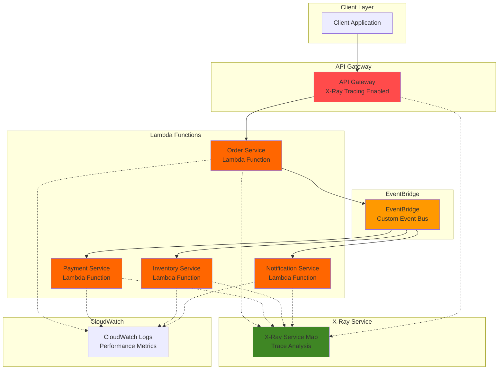

# Implementing Distributed Tracing with X-Ray and EventBridge

## Problem

Modern microservices architectures rely heavily on event-driven communication patterns through message brokers like Amazon EventBridge. However, as these systems scale, tracking requests across multiple services becomes increasingly complex. Development teams struggle to understand end-to-end request flows, identify performance bottlenecks, and debug failures that span multiple services. Without proper distributed tracing, troubleshooting production issues can take hours or days, directly impacting customer satisfaction and business operations.

## Solution

This recipe implements comprehensive distributed tracing using AWS X-Ray integrated with Amazon EventBridge to provide end-to-end visibility across event-driven microservices. We'll create a distributed system with multiple Lambda functions communicating through EventBridge events, instrument each service with X-Ray tracing, and configure trace propagation to maintain request context throughout the entire workflow. This approach enables teams to visualize service dependencies, analyze performance metrics, and quickly identify root causes of failures.

## Architecture Diagram



## Prerequisites

1. AWS account with appropriate permissions for X-Ray, EventBridge, Lambda, API Gateway, and IAM
2. AWS CLI v2 installed and configured (or AWS CloudShell)
3. Basic understanding of serverless architectures and event-driven patterns
4. Familiarity with distributed systems concepts and tracing fundamentals
5. Estimated cost: $5-10 for testing resources (Lambda invocations, X-Ray traces, API Gateway requests)

> **Note**: X-Ray charges $5.00 per 1 million traces recorded and $0.50 per 1 million traces retrieved. EventBridge custom events are $1.00 per million events.

> **Tip**: Use X-Ray sampling rules to control trace collection costs while maintaining adequate visibility. Start with 10% sampling for high-volume applications and adjust based on your debugging needs.

> **Warning**: Be careful not to include sensitive data in X-Ray trace annotations or metadata. X-Ray traces are stored for 30 days and may be accessed by multiple team members with X-Ray permissions.

## Preparation

```bash
# Set environment variables
export AWS_REGION=$(aws configure get region)
export AWS_ACCOUNT_ID=$(aws sts get-caller-identity \
    --query Account --output text)

# Generate unique identifiers for resources
RANDOM_SUFFIX=$(aws secretsmanager get-random-password \
    --exclude-punctuation --exclude-uppercase \
    --password-length 6 --require-each-included-type \
    --output text --query RandomPassword)

export EVENT_BUS_NAME="distributed-tracing-bus-${RANDOM_SUFFIX}"
export LAMBDA_ROLE_NAME="distributed-tracing-lambda-role-${RANDOM_SUFFIX}"
export API_GATEWAY_NAME="distributed-tracing-api-${RANDOM_SUFFIX}"

# Create IAM role for Lambda functions with X-Ray permissions
aws iam create-role \
    --role-name $LAMBDA_ROLE_NAME \
    --assume-role-policy-document '{
        "Version": "2012-10-17",
        "Statement": [
            {
                "Effect": "Allow",
                "Principal": {
                    "Service": "lambda.amazonaws.com"
                },
                "Action": "sts:AssumeRole"
            }
        ]
    }'

# Attach required policies for Lambda, X-Ray, and EventBridge
aws iam attach-role-policy \
    --role-name $LAMBDA_ROLE_NAME \
    --policy-arn arn:aws:iam::aws:policy/service-role/AWSLambdaBasicExecutionRole

aws iam attach-role-policy \
    --role-name $LAMBDA_ROLE_NAME \
    --policy-arn arn:aws:iam::aws:policy/AWSXRayDaemonWriteAccess

aws iam attach-role-policy \
    --role-name $LAMBDA_ROLE_NAME \
    --policy-arn arn:aws:iam::aws:policy/AmazonEventBridgeFullAccess

# Wait for role propagation
sleep 10

export LAMBDA_ROLE_ARN=$(aws iam get-role \
    --role-name $LAMBDA_ROLE_NAME \
    --query Role.Arn --output text)

echo "✅ Created IAM role: $LAMBDA_ROLE_ARN"
```

## Steps

1. **Create Custom EventBridge Bus**:

   Amazon EventBridge custom event buses provide isolated event routing environments that enable secure multi-tenant architectures. Unlike the default event bus, custom buses allow you to implement fine-grained access controls and separate event streams by application or business domain. This isolation is crucial for distributed tracing as it ensures that trace context remains within specific application boundaries while enabling comprehensive observability.

   ```bash
   # Create custom event bus for distributed tracing
   aws events create-event-bus \
       --name $EVENT_BUS_NAME
   
   export EVENT_BUS_ARN=$(aws events describe-event-bus \
       --name $EVENT_BUS_NAME \
       --query EventBus.Arn --output text)
   
   echo "✅ Created EventBridge custom bus: $EVENT_BUS_NAME"
   ```

   The custom event bus is now established and ready to route events between our microservices. This foundation enables event-driven communication patterns while maintaining trace context propagation across service boundaries. Learn more about [EventBridge event patterns](https://docs.aws.amazon.com/eventbridge/latest/userguide/eb-event-patterns.html) for advanced routing configurations.

2. **Create Order Service Lambda Function**:

   The order service acts as the entry point for our distributed workflow, receiving requests from API Gateway and initiating the event-driven cascade. AWS Lambda with X-Ray tracing enabled automatically captures service performance metrics, dependency relationships, and error conditions. The X-Ray SDK instruments AWS service calls and provides detailed insights into function execution patterns, making it essential for understanding distributed system behavior.

   ```bash
   # Create order service function code
   cat > order-service.py << 'EOF'
import json
import boto3
import os
from aws_xray_sdk.core import xray_recorder
from aws_xray_sdk.core import patch_all
from datetime import datetime

# Patch AWS SDK calls for X-Ray tracing
patch_all()

eventbridge = boto3.client('events')

@xray_recorder.capture('order_service_handler')
def lambda_handler(event, context):
    # Extract trace context from API Gateway
    trace_header = event.get('headers', {}).get('X-Amzn-Trace-Id', '')
    
    # Create subsegment for order processing
    subsegment = xray_recorder.begin_subsegment('process_order')
    
    try:
        # Simulate order processing
        order_id = f"order-{datetime.now().strftime('%Y%m%d%H%M%S')}"
        customer_id = event.get('pathParameters', {}).get('customerId', 'anonymous')
        
        # Add metadata to trace
        subsegment.put_metadata('order_details', {
            'order_id': order_id,
            'customer_id': customer_id,
            'timestamp': datetime.now().isoformat()
        })
        
        # Publish event to EventBridge with trace context
        event_detail = {
            'orderId': order_id,
            'customerId': customer_id,
            'amount': 99.99,
            'status': 'created'
        }
        
        response = eventbridge.put_events(
            Entries=[
                {
                    'Source': 'order.service',
                    'DetailType': 'Order Created',
                    'Detail': json.dumps(event_detail),
                    'EventBusName': os.environ['EVENT_BUS_NAME']
                }
            ]
        )
        
        # Add annotation for filtering
        xray_recorder.put_annotation('order_id', order_id)
        xray_recorder.put_annotation('service_name', 'order-service')
        
        return {
            'statusCode': 200,
            'headers': {
                'Content-Type': 'application/json',
                'X-Amzn-Trace-Id': trace_header
            },
            'body': json.dumps({
                'orderId': order_id,
                'status': 'created',
                'message': 'Order created successfully'
            })
        }
        
    except Exception as e:
        xray_recorder.put_annotation('error', str(e))
        raise e
    finally:
        xray_recorder.end_subsegment()
EOF
   
   # Create deployment package
   zip order-service.zip order-service.py
   
   # Create Lambda function with X-Ray tracing enabled
   aws lambda create-function \
       --function-name order-service-${RANDOM_SUFFIX} \
       --runtime python3.12 \
       --role $LAMBDA_ROLE_ARN \
       --handler order-service.lambda_handler \
       --zip-file fileb://order-service.zip \
       --environment Variables="{EVENT_BUS_NAME=$EVENT_BUS_NAME}" \
       --tracing-config Mode=Active \
       --timeout 30
   
   export ORDER_SERVICE_ARN=$(aws lambda get-function \
       --function-name order-service-${RANDOM_SUFFIX} \
       --query Configuration.FunctionArn --output text)
   
   echo "✅ Created order service Lambda function"
   ```

   The order service is now deployed with active X-Ray tracing enabled. This configuration automatically instruments AWS SDK calls and HTTP requests, providing comprehensive visibility into function execution. The `--tracing-config Mode=Active` flag enables X-Ray tracing for Lambda functions, allowing you to visualize service interactions and identify performance bottlenecks. Learn more about [Lambda X-Ray tracing](https://docs.aws.amazon.com/lambda/latest/dg/services-xray.html).

3. **Create Payment Service Lambda Function**:

   The payment service demonstrates asynchronous event processing patterns where EventBridge delivers events to Lambda functions. This architecture enables loose coupling between services while maintaining trace context propagation. The X-Ray SDK's `patch_all()` function automatically instruments all AWS service calls, ensuring that every EventBridge interaction and external API call is captured in the distributed trace.

   ```bash
   # Create payment service function code
   cat > payment-service.py << 'EOF'
import json
import boto3
import os
import time
from aws_xray_sdk.core import xray_recorder
from aws_xray_sdk.core import patch_all

# Patch AWS SDK calls for X-Ray tracing
patch_all()

eventbridge = boto3.client('events')

@xray_recorder.capture('payment_service_handler')
def lambda_handler(event, context):
    # Process EventBridge event directly (not SQS)
    if 'source' in event and event['source'] == 'order.service':
        detail = event['detail']
        
        # Create subsegment for payment processing
        subsegment = xray_recorder.begin_subsegment('process_payment')
        
        try:
            order_id = detail['orderId']
            amount = detail['amount']
            
            # Add metadata to trace
            subsegment.put_metadata('payment_details', {
                'order_id': order_id,
                'amount': amount,
                'processor': 'stripe'
            })
            
            # Simulate payment processing delay
            time.sleep(0.5)
            
            # Publish payment processed event
            payment_event = {
                'orderId': order_id,
                'amount': amount,
                'paymentId': f"pay-{order_id}",
                'status': 'processed'
            }
            
            eventbridge.put_events(
                Entries=[
                    {
                        'Source': 'payment.service',
                        'DetailType': 'Payment Processed',
                        'Detail': json.dumps(payment_event),
                        'EventBusName': os.environ['EVENT_BUS_NAME']
                    }
                ]
            )
            
            # Add annotations for filtering
            xray_recorder.put_annotation('order_id', order_id)
            xray_recorder.put_annotation('service_name', 'payment-service')
            xray_recorder.put_annotation('payment_amount', amount)
            
        except Exception as e:
            xray_recorder.put_annotation('error', str(e))
            raise e
        finally:
            xray_recorder.end_subsegment()
    
    return {'statusCode': 200}
EOF
   
   # Create deployment package
   zip payment-service.zip payment-service.py
   
   # Create Lambda function
   aws lambda create-function \
       --function-name payment-service-${RANDOM_SUFFIX} \
       --runtime python3.12 \
       --role $LAMBDA_ROLE_ARN \
       --handler payment-service.lambda_handler \
       --zip-file fileb://payment-service.zip \
       --environment Variables="{EVENT_BUS_NAME=$EVENT_BUS_NAME}" \
       --tracing-config Mode=Active \
       --timeout 30
   
   export PAYMENT_SERVICE_ARN=$(aws lambda get-function \
       --function-name payment-service-${RANDOM_SUFFIX} \
       --query Configuration.FunctionArn --output text)
   
   echo "✅ Created payment service Lambda function"
   ```

   The payment service is now configured to process EventBridge events while maintaining trace context from the originating request. This service demonstrates how X-Ray subsegments can be used to track specific business operations within a larger distributed workflow. The trace annotations enable filtering and analysis of payment-specific metrics across your entire system.

4. **Create Inventory and Notification Services**:

   These services complete our microservices architecture by handling inventory management and customer notifications. Each service follows the same X-Ray instrumentation pattern, ensuring comprehensive trace coverage across all system components. The inventory service demonstrates how to track resource state changes, while the notification service shows how to trace external communication patterns. Together, they provide a complete picture of end-to-end request processing.

   ```bash
   # Create inventory service function code
   cat > inventory-service.py << 'EOF'
import json
import boto3
import os
from aws_xray_sdk.core import xray_recorder
from aws_xray_sdk.core import patch_all

# Patch AWS SDK calls for X-Ray tracing
patch_all()

eventbridge = boto3.client('events')

@xray_recorder.capture('inventory_service_handler')
def lambda_handler(event, context):
    # Process EventBridge event directly
    if 'source' in event and event['source'] == 'order.service':
        detail = event['detail']
        
        subsegment = xray_recorder.begin_subsegment('update_inventory')
        
        try:
            order_id = detail['orderId']
            
            # Add metadata to trace
            subsegment.put_metadata('inventory_update', {
                'order_id': order_id,
                'items_reserved': 1,
                'warehouse': 'east-coast'
            })
            
            # Publish inventory updated event
            inventory_event = {
                'orderId': order_id,
                'status': 'reserved',
                'warehouse': 'east-coast'
            }
            
            eventbridge.put_events(
                Entries=[
                    {
                        'Source': 'inventory.service',
                        'DetailType': 'Inventory Updated',
                        'Detail': json.dumps(inventory_event),
                        'EventBusName': os.environ['EVENT_BUS_NAME']
                    }
                ]
            )
            
            xray_recorder.put_annotation('order_id', order_id)
            xray_recorder.put_annotation('service_name', 'inventory-service')
            
        except Exception as e:
            xray_recorder.put_annotation('error', str(e))
            raise e
        finally:
            xray_recorder.end_subsegment()
    
    return {'statusCode': 200}
EOF
   
   # Create notification service function code
   cat > notification-service.py << 'EOF'
import json
import boto3
import os
from aws_xray_sdk.core import xray_recorder
from aws_xray_sdk.core import patch_all

# Patch AWS SDK calls for X-Ray tracing
patch_all()

@xray_recorder.capture('notification_service_handler')
def lambda_handler(event, context):
    # Process EventBridge event directly
    if 'source' in event and event['source'] in ['payment.service', 'inventory.service']:
        detail = event['detail']
        
        subsegment = xray_recorder.begin_subsegment('send_notification')
        
        try:
            order_id = detail['orderId']
            event_type = event['detail-type']
            
            # Add metadata to trace
            subsegment.put_metadata('notification_sent', {
                'order_id': order_id,
                'event_type': event_type,
                'channel': 'email'
            })
            
            xray_recorder.put_annotation('order_id', order_id)
            xray_recorder.put_annotation('service_name', 'notification-service')
            xray_recorder.put_annotation('notification_type', event_type)
            
        except Exception as e:
            xray_recorder.put_annotation('error', str(e))
            raise e
        finally:
            xray_recorder.end_subsegment()
    
    return {'statusCode': 200}
EOF
   
   # Create deployment packages and functions
   zip inventory-service.zip inventory-service.py
   zip notification-service.zip notification-service.py
   
   # Create inventory service
   aws lambda create-function \
       --function-name inventory-service-${RANDOM_SUFFIX} \
       --runtime python3.12 \
       --role $LAMBDA_ROLE_ARN \
       --handler inventory-service.lambda_handler \
       --zip-file fileb://inventory-service.zip \
       --environment Variables="{EVENT_BUS_NAME=$EVENT_BUS_NAME}" \
       --tracing-config Mode=Active \
       --timeout 30
   
   # Create notification service
   aws lambda create-function \
       --function-name notification-service-${RANDOM_SUFFIX} \
       --runtime python3.12 \
       --role $LAMBDA_ROLE_ARN \
       --handler notification-service.lambda_handler \
       --zip-file fileb://notification-service.zip \
       --environment Variables="{EVENT_BUS_NAME=$EVENT_BUS_NAME}" \
       --tracing-config Mode=Active \
       --timeout 30
   
   echo "✅ Created inventory and notification services"
   ```

   Both services are now deployed with X-Ray tracing enabled. The inventory service will track resource allocation and warehouse operations, while the notification service monitors customer communication patterns. This completes our instrumented microservices architecture, providing comprehensive visibility into all business process components.

5. **Create EventBridge Rules and Targets**:

   EventBridge rules define the event routing logic that connects our microservices. Each rule specifies an event pattern that determines which events trigger specific Lambda functions. This declarative approach to event routing enables complex workflow orchestration while maintaining clear service boundaries. The event patterns use source and detail-type fields to ensure precise event matching and prevent unwanted cross-service dependencies.

   ```bash
   # Create rule for payment processing
   aws events put-rule \
       --name payment-processing-rule-${RANDOM_SUFFIX} \
       --event-pattern '{
           "source": ["order.service"],
           "detail-type": ["Order Created"]
       }' \
       --state ENABLED \
       --event-bus-name $EVENT_BUS_NAME
   
   # Create rule for inventory updates
   aws events put-rule \
       --name inventory-update-rule-${RANDOM_SUFFIX} \
       --event-pattern '{
           "source": ["order.service"],
           "detail-type": ["Order Created"]
       }' \
       --state ENABLED \
       --event-bus-name $EVENT_BUS_NAME
   
   # Create rule for notifications
   aws events put-rule \
       --name notification-rule-${RANDOM_SUFFIX} \
       --event-pattern '{
           "source": ["payment.service", "inventory.service"],
           "detail-type": ["Payment Processed", "Inventory Updated"]
       }' \
       --state ENABLED \
       --event-bus-name $EVENT_BUS_NAME
   
   echo "✅ Created EventBridge rules"
   ```

   The EventBridge rules are now configured to route events between our microservices based on event patterns. These rules ensure that order creation events trigger both payment processing and inventory updates, while completion events from these services trigger customer notifications. This event-driven architecture enables loose coupling and independent service scaling.

6. **Configure Lambda Targets for EventBridge Rules**:

   EventBridge targets define the destination services for matched events. By configuring Lambda functions as targets, we establish the event delivery mechanism that enables asynchronous communication between services. Each target configuration specifies the exact Lambda function ARN and ensures that events are delivered reliably with built-in retry mechanisms and dead letter queue support.

   ```bash
   # Add payment service as target
   aws events put-targets \
       --rule payment-processing-rule-${RANDOM_SUFFIX} \
       --event-bus-name $EVENT_BUS_NAME \
       --targets "Id=1,Arn=${PAYMENT_SERVICE_ARN}"
   
   # Add inventory service as target
   aws events put-targets \
       --rule inventory-update-rule-${RANDOM_SUFFIX} \
       --event-bus-name $EVENT_BUS_NAME \
       --targets "Id=1,Arn=$(aws lambda get-function \
           --function-name inventory-service-${RANDOM_SUFFIX} \
           --query Configuration.FunctionArn --output text)"
   
   # Add notification service as target
   aws events put-targets \
       --rule notification-rule-${RANDOM_SUFFIX} \
       --event-bus-name $EVENT_BUS_NAME \
       --targets "Id=1,Arn=$(aws lambda get-function \
           --function-name notification-service-${RANDOM_SUFFIX} \
           --query Configuration.FunctionArn --output text)"
   
   echo "✅ Configured EventBridge targets"
   ```

   The EventBridge targets are now linked to our Lambda functions, establishing the event delivery pathways. This configuration ensures that events are routed to the appropriate services based on the defined patterns. EventBridge automatically manages event delivery with built-in retry logic and error handling, ensuring reliable message processing across your distributed system.

7. **Create API Gateway with X-Ray Tracing**:

   API Gateway serves as the entry point for external requests and the origin of distributed traces. Enabling X-Ray tracing on API Gateway captures request routing, authorization, and transformation latencies. This visibility is crucial for understanding end-to-end request performance and identifying bottlenecks at the API layer. The `TracingEnabled=true` configuration ensures that trace context is automatically propagated to downstream Lambda functions.

   ```bash
   # Create REST API
   API_ID=$(aws apigateway create-rest-api \
       --name $API_GATEWAY_NAME \
       --description "Distributed tracing demo API" \
       --query id --output text)
   
   # Get root resource ID
   ROOT_ID=$(aws apigateway get-resources \
       --rest-api-id $API_ID \
       --query 'items[0].id' --output text)
   
   # Create orders resource
   ORDERS_ID=$(aws apigateway create-resource \
       --rest-api-id $API_ID \
       --parent-id $ROOT_ID \
       --path-part orders \
       --query id --output text)
   
   # Create customer resource
   CUSTOMER_ID=$(aws apigateway create-resource \
       --rest-api-id $API_ID \
       --parent-id $ORDERS_ID \
       --path-part '{customerId}' \
       --query id --output text)
   
   # Create POST method
   aws apigateway put-method \
       --rest-api-id $API_ID \
       --resource-id $CUSTOMER_ID \
       --http-method POST \
       --authorization-type NONE
   
   # Configure Lambda integration
   aws apigateway put-integration \
       --rest-api-id $API_ID \
       --resource-id $CUSTOMER_ID \
       --http-method POST \
       --type AWS_PROXY \
       --integration-http-method POST \
       --uri "arn:aws:apigateway:${AWS_REGION}:lambda:path/2015-03-31/functions/${ORDER_SERVICE_ARN}/invocations"
   
   # Create deployment first
   DEPLOYMENT_ID=$(aws apigateway create-deployment \
       --rest-api-id $API_ID \
       --stage-name prod \
       --query id --output text)
   
   # Enable X-Ray tracing on the stage
   aws apigateway update-stage \
       --rest-api-id $API_ID \
       --stage-name prod \
       --patch-ops op=replace,path=/tracingEnabled,value=true
   
   # Grant API Gateway permission to invoke Lambda
   aws lambda add-permission \
       --function-name order-service-${RANDOM_SUFFIX} \
       --statement-id apigateway-invoke \
       --action lambda:InvokeFunction \
       --principal apigateway.amazonaws.com \
       --source-arn "arn:aws:execute-api:${AWS_REGION}:${AWS_ACCOUNT_ID}:${API_ID}/*/*/*"
   
   export API_ENDPOINT="https://${API_ID}.execute-api.${AWS_REGION}.amazonaws.com/prod"
   
   echo "✅ Created API Gateway with X-Ray tracing enabled"
   echo "API Endpoint: $API_ENDPOINT"
   ```

   The API Gateway is now configured with X-Ray tracing enabled, serving as the entry point for distributed traces. This setup automatically captures API request performance metrics and propagates trace context to downstream services. The REST API provides the `/orders/{customerId}` endpoint that initiates our distributed workflow. Learn more about [API Gateway X-Ray tracing](https://docs.aws.amazon.com/xray/latest/devguide/xray-services-apigateway.html).

8. **Grant EventBridge Permissions to Invoke Lambda Functions**:

   AWS IAM resource-based policies control cross-service access in event-driven architectures. These permissions enable EventBridge to invoke Lambda functions when events match defined rules. Without proper permissions, events would be lost, breaking the distributed workflow. The source ARN restrictions ensure that only specific EventBridge rules can invoke each function, implementing the principle of least privilege for enhanced security.

   ```bash
   # Grant EventBridge permission to invoke payment service
   aws lambda add-permission \
       --function-name payment-service-${RANDOM_SUFFIX} \
       --statement-id eventbridge-invoke-payment \
       --action lambda:InvokeFunction \
       --principal events.amazonaws.com \
       --source-arn "arn:aws:events:${AWS_REGION}:${AWS_ACCOUNT_ID}:rule/${EVENT_BUS_NAME}/payment-processing-rule-${RANDOM_SUFFIX}"
   
   # Grant EventBridge permission to invoke inventory service
   aws lambda add-permission \
       --function-name inventory-service-${RANDOM_SUFFIX} \
       --statement-id eventbridge-invoke-inventory \
       --action lambda:InvokeFunction \
       --principal events.amazonaws.com \
       --source-arn "arn:aws:events:${AWS_REGION}:${AWS_ACCOUNT_ID}:rule/${EVENT_BUS_NAME}/inventory-update-rule-${RANDOM_SUFFIX}"
   
   # Grant EventBridge permission to invoke notification service
   aws lambda add-permission \
       --function-name notification-service-${RANDOM_SUFFIX} \
       --statement-id eventbridge-invoke-notification \
       --action lambda:InvokeFunction \
       --principal events.amazonaws.com \
       --source-arn "arn:aws:events:${AWS_REGION}:${AWS_ACCOUNT_ID}:rule/${EVENT_BUS_NAME}/notification-rule-${RANDOM_SUFFIX}"
   
   echo "✅ Granted EventBridge permissions to invoke Lambda functions"
   ```

   The Lambda function permissions are now configured to allow EventBridge rule invocations. These resource-based policies ensure secure event delivery while maintaining the principle of least privilege. Each function can only be invoked by its specific EventBridge rule, preventing unauthorized access and ensuring proper event routing throughout the distributed system.

## Validation & Testing

1. **Test the distributed tracing flow**:

   ```bash
   # Send a test request to trigger the distributed flow
   curl -X POST \
       -H "Content-Type: application/json" \
       -d '{"productId": "12345", "quantity": 1}' \
       "${API_ENDPOINT}/orders/customer123"
   ```

   Expected output: JSON response with order creation confirmation

2. **Verify X-Ray traces are being generated**:

   ```bash
   # Wait for traces to be processed (1-2 minutes)
   sleep 120
   
   # Get trace summaries from X-Ray
   aws xray get-trace-summaries \
       --time-range-type TimeRangeByStartTime \
       --start-time $(date -u -d '10 minutes ago' +%Y-%m-%dT%H:%M:%S) \
       --end-time $(date -u +%Y-%m-%dT%H:%M:%S) \
       --query 'TraceSummaries[*].[Id,Duration,ResponseTime,HasError,HasFault]' \
       --output table
   ```

3. **View detailed trace information**:

   ```bash
   # Get the latest trace ID
   TRACE_ID=$(aws xray get-trace-summaries \
       --time-range-type TimeRangeByStartTime \
       --start-time $(date -u -d '10 minutes ago' +%Y-%m-%dT%H:%M:%S) \
       --end-time $(date -u +%Y-%m-%dT%H:%M:%S) \
       --query 'TraceSummaries[0].Id' --output text)
   
   # Get detailed trace information
   aws xray batch-get-traces \
       --trace-ids $TRACE_ID \
       --query 'Traces[0].Segments[*].[Id,Name,StartTime,EndTime]' \
       --output table
   ```

4. **Check service map in X-Ray console**:

   ```bash
   echo "✅ Open X-Ray console to view service map:"
   echo "https://console.aws.amazon.com/xray/home?region=${AWS_REGION}#/service-map"
   ```

## Cleanup

1. **Delete API Gateway**:

   ```bash
   # Delete API Gateway
   aws apigateway delete-rest-api \
       --rest-api-id $API_ID
   
   echo "✅ Deleted API Gateway"
   ```

2. **Delete EventBridge rules and targets**:

   ```bash
   # Remove targets first
   aws events remove-targets \
       --rule payment-processing-rule-${RANDOM_SUFFIX} \
       --event-bus-name $EVENT_BUS_NAME \
       --ids 1
   
   aws events remove-targets \
       --rule inventory-update-rule-${RANDOM_SUFFIX} \
       --event-bus-name $EVENT_BUS_NAME \
       --ids 1
   
   aws events remove-targets \
       --rule notification-rule-${RANDOM_SUFFIX} \
       --event-bus-name $EVENT_BUS_NAME \
       --ids 1
   
   # Delete rules
   aws events delete-rule \
       --name payment-processing-rule-${RANDOM_SUFFIX} \
       --event-bus-name $EVENT_BUS_NAME
   
   aws events delete-rule \
       --name inventory-update-rule-${RANDOM_SUFFIX} \
       --event-bus-name $EVENT_BUS_NAME
   
   aws events delete-rule \
       --name notification-rule-${RANDOM_SUFFIX} \
       --event-bus-name $EVENT_BUS_NAME
   
   echo "✅ Deleted EventBridge rules and targets"
   ```

3. **Delete Lambda functions**:

   ```bash
   # Delete all Lambda functions
   aws lambda delete-function \
       --function-name order-service-${RANDOM_SUFFIX}
   
   aws lambda delete-function \
       --function-name payment-service-${RANDOM_SUFFIX}
   
   aws lambda delete-function \
       --function-name inventory-service-${RANDOM_SUFFIX}
   
   aws lambda delete-function \
       --function-name notification-service-${RANDOM_SUFFIX}
   
   echo "✅ Deleted Lambda functions"
   ```

4. **Delete EventBridge custom bus and IAM role**:

   ```bash
   # Delete custom event bus
   aws events delete-event-bus \
       --name $EVENT_BUS_NAME
   
   # Detach policies from IAM role
   aws iam detach-role-policy \
       --role-name $LAMBDA_ROLE_NAME \
       --policy-arn arn:aws:iam::aws:policy/service-role/AWSLambdaBasicExecutionRole
   
   aws iam detach-role-policy \
       --role-name $LAMBDA_ROLE_NAME \
       --policy-arn arn:aws:iam::aws:policy/AWSXRayDaemonWriteAccess
   
   aws iam detach-role-policy \
       --role-name $LAMBDA_ROLE_NAME \
       --policy-arn arn:aws:iam::aws:policy/AmazonEventBridgeFullAccess
   
   # Delete IAM role
   aws iam delete-role \
       --role-name $LAMBDA_ROLE_NAME
   
   # Clean up local files
   rm -f *.py *.zip
   
   echo "✅ Cleaned up all resources"
   ```

## Discussion

This implementation demonstrates how AWS X-Ray integrates seamlessly with Amazon EventBridge to provide comprehensive distributed tracing across event-driven microservices architectures. The key to effective distributed tracing lies in understanding how trace context propagates through asynchronous event flows and how to properly instrument each service component.

The X-Ray service map provides a visual representation of your entire system, automatically discovering service dependencies and highlighting performance bottlenecks. By enabling active tracing on API Gateway and all Lambda functions, we ensure that trace context is maintained throughout the entire request lifecycle. The annotations and metadata added to each trace segment enable powerful filtering and analysis capabilities, allowing teams to quickly identify specific transactions or error conditions.

One of the most valuable aspects of this setup is the ability to correlate events across multiple services. When a request fails in the notification service, teams can trace back through the payment and inventory services to understand the root cause. This end-to-end visibility is crucial for maintaining complex distributed systems at scale.

> **Tip**: Use X-Ray annotations strategically to create filterable dimensions for your traces. Common annotation patterns include user_id, order_id, and service_name for business context filtering.

The EventBridge integration with X-Ray is particularly powerful because it automatically propagates trace headers through event routing. This means that even complex event-driven workflows maintain their tracing context without requiring manual header management. The trace map clearly shows EventBridge as a central hub connecting your microservices, making it easy to understand data flow patterns and identify potential scaling bottlenecks.

For production environments, consider implementing trace sampling strategies to balance observability with cost. X-Ray's default sampling rules capture 1 request per second and 5% of additional requests, but you can customize these rules based on your specific needs. Learn more about [X-Ray sampling rules](https://docs.aws.amazon.com/xray/latest/devguide/xray-console-sampling.html) for cost optimization strategies. Additionally, leverage CloudWatch Logs integration to correlate application logs with X-Ray traces for comprehensive debugging capabilities.

## Challenge

Extend this solution by implementing these enhancements:

1. **Add custom sampling rules** to reduce costs while maintaining coverage for high-value transactions like payments over $1000 using [X-Ray sampling configuration](https://docs.aws.amazon.com/xray/latest/devguide/xray-console-sampling.html)
2. **Implement trace-based alerting** using CloudWatch alarms triggered by X-Ray service map metrics for automated incident response
3. **Create a dead letter queue pattern** with EventBridge to handle failed events while maintaining trace context throughout retry mechanisms
4. **Build a custom dashboard** that combines X-Ray analytics with business metrics to show both technical and business KPIs in a single view
5. **Add distributed tracing for external API calls** by instrumenting HTTP clients and propagating trace context to third-party services using the [X-Ray SDK](https://docs.aws.amazon.com/xray/latest/devguide/xray-sdk-python.html)

## Infrastructure Code

### Available Infrastructure as Code:

- [Infrastructure Code Overview](code/README.md) - Detailed description of all infrastructure components
- [AWS CDK (Python)](code/cdk-python/) - AWS CDK Python implementation
- [AWS CDK (TypeScript)](code/cdk-typescript/) - AWS CDK TypeScript implementation
- [CloudFormation](code/cloudformation.yaml) - AWS CloudFormation template
- [Bash CLI Scripts](code/scripts/) - Example bash scripts using AWS CLI commands to deploy infrastructure
- [Terraform](code/terraform/) - Terraform configuration files