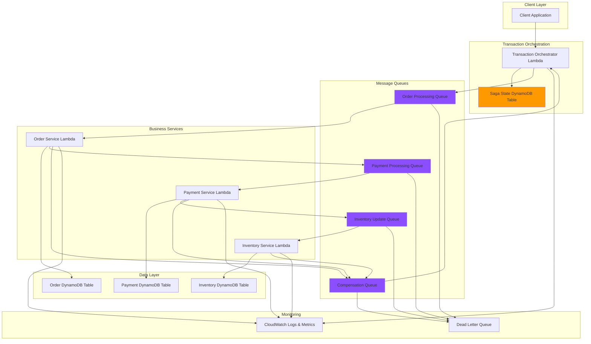

# Building Distributed Transaction Processing with SQS and DynamoDB

## Problem

E-commerce platforms and financial services require distributed transaction processing across multiple microservices to ensure data consistency when handling complex business operations like order processing, payment validation, and inventory management. Traditional two-phase commit protocols create tight coupling between services and can lead to cascading failures when one service becomes unavailable. Without proper transaction coordination, businesses face data inconsistencies, lost revenue from incomplete transactions, and compliance issues that can damage customer trust and regulatory standing.

## Solution

This solution implements the Saga pattern using [Amazon SQS](https://docs.aws.amazon.com/AWSSimpleQueueService/latest/SQSDeveloperGuide/sqs-fifo-queues.html) for event-driven transaction coordination and [Amazon DynamoDB](https://docs.aws.amazon.com/amazondynamodb/latest/developerguide/transaction-apis.html) for reliable state management with built-in transaction support. The architecture uses SQS FIFO queues to ensure ordered message processing while DynamoDB transactions provide atomic operations within each microservice. Lambda functions orchestrate the transaction flow, implementing compensation patterns for rollback scenarios and maintaining transaction state across distributed services.

## Architecture Diagram



## Prerequisites

1. AWS account with permissions for DynamoDB, SQS, Lambda, IAM, and CloudWatch
2. AWS CLI v2 installed and configured (or AWS CloudShell)
3. Understanding of distributed systems and transaction patterns
4. Familiarity with DynamoDB transactions and SQS FIFO queues
5. Basic knowledge of Lambda functions and event-driven architecture
6. Estimated cost: $15-25 per day for testing (includes DynamoDB RCU/WCU, SQS requests, and Lambda executions)

> **Note**: This recipe creates multiple Lambda functions and DynamoDB tables. Monitor your costs during testing and ensure cleanup completion.

## Preparation

```bash
# Set environment variables
export AWS_REGION=$(aws configure get region)
export AWS_ACCOUNT_ID=$(aws sts get-caller-identity \
    --query Account --output text)

# Generate unique identifiers for resources
RANDOM_SUFFIX=$(aws secretsmanager get-random-password \
    --exclude-punctuation --exclude-uppercase \
    --password-length 6 --require-each-included-type \
    --output text --query RandomPassword)

export STACK_NAME="distributed-tx-${RANDOM_SUFFIX}"
export SAGA_STATE_TABLE="${STACK_NAME}-saga-state"
export ORDER_TABLE="${STACK_NAME}-orders"
export PAYMENT_TABLE="${STACK_NAME}-payments"
export INVENTORY_TABLE="${STACK_NAME}-inventory"

# Create IAM role for Lambda functions
aws iam create-role \
    --role-name "${STACK_NAME}-lambda-role" \
    --assume-role-policy-document '{
        "Version": "2012-10-17",
        "Statement": [
            {
                "Effect": "Allow",
                "Principal": {
                    "Service": "lambda.amazonaws.com"
                },
                "Action": "sts:AssumeRole"
            }
        ]
    }'

# Attach necessary policies to the role
aws iam attach-role-policy \
    --role-name "${STACK_NAME}-lambda-role" \
    --policy-arn "arn:aws:iam::aws:policy/service-role/AWSLambdaBasicExecutionRole"

aws iam attach-role-policy \
    --role-name "${STACK_NAME}-lambda-role" \
    --policy-arn "arn:aws:iam::aws:policy/AmazonDynamoDBFullAccess"

aws iam attach-role-policy \
    --role-name "${STACK_NAME}-lambda-role" \
    --policy-arn "arn:aws:iam::aws:policy/AmazonSQSFullAccess"

# Wait for role to be available
sleep 10

export LAMBDA_ROLE_ARN="arn:aws:iam::${AWS_ACCOUNT_ID}:role/${STACK_NAME}-lambda-role"

echo "✅ Environment prepared with stack name: ${STACK_NAME}"
```

## Steps

1. **Create DynamoDB Tables for Transaction State and Business Data**:

   This step establishes the foundational data layer for our distributed transaction system. We create separate tables for different concerns - the saga state table tracks transaction progress across services, while business tables store domain-specific data. The saga state table uses DynamoDB Streams to enable real-time monitoring of transaction state changes.

   ```bash
   # Create saga state table for transaction coordination
   aws dynamodb create-table \
       --table-name "${SAGA_STATE_TABLE}" \
       --attribute-definitions \
           AttributeName=TransactionId,AttributeType=S \
       --key-schema \
           AttributeName=TransactionId,KeyType=HASH \
       --billing-mode PAY_PER_REQUEST \
       --stream-specification StreamEnabled=true,StreamViewType=NEW_AND_OLD_IMAGES
   
   # Create orders table
   aws dynamodb create-table \
       --table-name "${ORDER_TABLE}" \
       --attribute-definitions \
           AttributeName=OrderId,AttributeType=S \
       --key-schema \
           AttributeName=OrderId,KeyType=HASH \
       --billing-mode PAY_PER_REQUEST
   
   # Create payments table
   aws dynamodb create-table \
       --table-name "${PAYMENT_TABLE}" \
       --attribute-definitions \
           AttributeName=PaymentId,AttributeType=S \
       --key-schema \
           AttributeName=PaymentId,KeyType=HASH \
       --billing-mode PAY_PER_REQUEST
   
   # Create inventory table
   aws dynamodb create-table \
       --table-name "${INVENTORY_TABLE}" \
       --attribute-definitions \
           AttributeName=ProductId,AttributeType=S \
       --key-schema \
           AttributeName=ProductId,KeyType=HASH \
       --billing-mode PAY_PER_REQUEST
   
   # Wait for tables to be created
   aws dynamodb wait table-exists --table-name "${SAGA_STATE_TABLE}"
   aws dynamodb wait table-exists --table-name "${ORDER_TABLE}"
   aws dynamodb wait table-exists --table-name "${PAYMENT_TABLE}"
   aws dynamodb wait table-exists --table-name "${INVENTORY_TABLE}"
   
   echo "✅ DynamoDB tables created successfully"
   ```

2. **Create SQS FIFO Queues for Transaction Coordination**:

   SQS FIFO queues provide the event-driven communication backbone between our microservices. Each queue represents a specific step in the transaction flow, ensuring exactly-once processing and maintaining message ordering. The FIFO characteristics prevent duplicate transactions while the dead letter queue handles permanent failures.

   ```bash
   # Create order processing queue
   aws sqs create-queue \
       --queue-name "${STACK_NAME}-order-processing.fifo" \
       --attributes '{
           "FifoQueue": "true",
           "ContentBasedDeduplication": "true",
           "MessageRetentionPeriod": "1209600",
           "VisibilityTimeoutSeconds": "300"
       }'
   
   # Create payment processing queue
   aws sqs create-queue \
       --queue-name "${STACK_NAME}-payment-processing.fifo" \
       --attributes '{
           "FifoQueue": "true",
           "ContentBasedDeduplication": "true",
           "MessageRetentionPeriod": "1209600",
           "VisibilityTimeoutSeconds": "300"
       }'
   
   # Create inventory update queue
   aws sqs create-queue \
       --queue-name "${STACK_NAME}-inventory-update.fifo" \
       --attributes '{
           "FifoQueue": "true",
           "ContentBasedDeduplication": "true",
           "MessageRetentionPeriod": "1209600",
           "VisibilityTimeoutSeconds": "300"
       }'
   
   # Create compensation queue for rollback operations
   aws sqs create-queue \
       --queue-name "${STACK_NAME}-compensation.fifo" \
       --attributes '{
           "FifoQueue": "true",
           "ContentBasedDeduplication": "true",
           "MessageRetentionPeriod": "1209600",
           "VisibilityTimeoutSeconds": "300"
       }'
   
   # Create dead letter queue for failed messages
   aws sqs create-queue \
       --queue-name "${STACK_NAME}-dlq.fifo" \
       --attributes '{
           "FifoQueue": "true",
           "ContentBasedDeduplication": "true",
           "MessageRetentionPeriod": "1209600"
       }'
   
   # Get queue URLs
   export ORDER_QUEUE_URL=$(aws sqs get-queue-url \
       --queue-name "${STACK_NAME}-order-processing.fifo" \
       --query QueueUrl --output text)
   
   export PAYMENT_QUEUE_URL=$(aws sqs get-queue-url \
       --queue-name "${STACK_NAME}-payment-processing.fifo" \
       --query QueueUrl --output text)
   
   export INVENTORY_QUEUE_URL=$(aws sqs get-queue-url \
       --queue-name "${STACK_NAME}-inventory-update.fifo" \
       --query QueueUrl --output text)
   
   export COMPENSATION_QUEUE_URL=$(aws sqs get-queue-url \
       --queue-name "${STACK_NAME}-compensation.fifo" \
       --query QueueUrl --output text)
   
   export DLQ_URL=$(aws sqs get-queue-url \
       --queue-name "${STACK_NAME}-dlq.fifo" \
       --query QueueUrl --output text)
   
   echo "✅ SQS FIFO queues created successfully"
   ```

3. **Create Transaction Orchestrator Lambda Function**:

   The orchestrator acts as the central coordinator for all distributed transactions. It initiates saga transactions by creating state records and publishing initial events. This function also handles compensation logic when transactions fail, ensuring proper rollback across all participating services.

   ```bash
   # Create the orchestrator function code
   cat > orchestrator.py << 'EOF'
   import json
   import boto3
   import uuid
   import os
   from datetime import datetime
   
   dynamodb = boto3.resource('dynamodb')
   sqs = boto3.client('sqs')
   
   SAGA_STATE_TABLE = os.environ['SAGA_STATE_TABLE']
   ORDER_QUEUE_URL = os.environ['ORDER_QUEUE_URL']
   COMPENSATION_QUEUE_URL = os.environ['COMPENSATION_QUEUE_URL']
   
   def lambda_handler(event, context):
       try:
           # Initialize transaction
           transaction_id = str(uuid.uuid4())
           order_data = json.loads(event['body'])
           
           # Create saga state record
           saga_table = dynamodb.Table(SAGA_STATE_TABLE)
           saga_table.put_item(
               Item={
                   'TransactionId': transaction_id,
                   'Status': 'STARTED',
                   'CurrentStep': 'ORDER_PROCESSING',
                   'Steps': ['ORDER_PROCESSING', 'PAYMENT_PROCESSING', 'INVENTORY_UPDATE'],
                   'CompletedSteps': [],
                   'OrderData': order_data,
                   'Timestamp': datetime.utcnow().isoformat(),
                   'TTL': int(datetime.utcnow().timestamp()) + 86400  # 24 hours TTL
               }
           )
           
           # Start transaction by sending to order queue
           message_body = {
               'transactionId': transaction_id,
               'step': 'ORDER_PROCESSING',
               'data': order_data
           }
           
           sqs.send_message(
               QueueUrl=ORDER_QUEUE_URL,
               MessageBody=json.dumps(message_body),
               MessageGroupId=transaction_id
           )
           
           return {
               'statusCode': 200,
               'body': json.dumps({
                   'transactionId': transaction_id,
                   'status': 'STARTED',
                   'message': 'Transaction initiated successfully'
               })
           }
           
       except Exception as e:
           print(f"Error in orchestrator: {str(e)}")
           return {
               'statusCode': 500,
               'body': json.dumps({
                   'error': str(e)
               })
           }
   
   def handle_compensation(event, context):
       try:
           # Process compensation messages
           for record in event['Records']:
               message_body = json.loads(record['body'])
               transaction_id = message_body['transactionId']
               failed_step = message_body['failedStep']
               
               # Update saga state to failed
               saga_table = dynamodb.Table(SAGA_STATE_TABLE)
               saga_table.update_item(
                   Key={'TransactionId': transaction_id},
                   UpdateExpression='SET #status = :status, FailedStep = :failed_step',
                   ExpressionAttributeNames={'#status': 'Status'},
                   ExpressionAttributeValues={
                       ':status': 'FAILED',
                       ':failed_step': failed_step
                   }
               )
               
               print(f"Transaction {transaction_id} failed at step {failed_step}")
               
       except Exception as e:
           print(f"Error in compensation handler: {str(e)}")
           raise
   EOF
   
   # Create deployment package
   zip -r orchestrator.zip orchestrator.py
   
   # Create Lambda function
   aws lambda create-function \
       --function-name "${STACK_NAME}-orchestrator" \
       --runtime python3.9 \
       --role "${LAMBDA_ROLE_ARN}" \
       --handler orchestrator.lambda_handler \
       --zip-file fileb://orchestrator.zip \
       --timeout 300 \
       --environment Variables="{
           SAGA_STATE_TABLE=${SAGA_STATE_TABLE},
           ORDER_QUEUE_URL=${ORDER_QUEUE_URL},
           COMPENSATION_QUEUE_URL=${COMPENSATION_QUEUE_URL}
       }"
   
   # Create compensation handler function
   aws lambda create-function \
       --function-name "${STACK_NAME}-compensation-handler" \
       --runtime python3.9 \
       --role "${LAMBDA_ROLE_ARN}" \
       --handler orchestrator.handle_compensation \
       --zip-file fileb://orchestrator.zip \
       --timeout 300 \
       --environment Variables="{
           SAGA_STATE_TABLE=${SAGA_STATE_TABLE}
       }"
   
   echo "✅ Transaction orchestrator functions created"
   ```

4. **Create Order Processing Service Lambda**:

   The order service handles the first step of our transaction flow, creating order records and advancing the saga state. It demonstrates how each microservice participates in the distributed transaction by updating its local data and forwarding the transaction to the next step. Error handling triggers compensation workflows when order creation fails.

   ```bash
   # Create order service function code
   cat > order_service.py << 'EOF'
   import json
   import boto3
   import uuid
   import os
   from datetime import datetime
   
   dynamodb = boto3.resource('dynamodb')
   sqs = boto3.client('sqs')
   
   ORDER_TABLE = os.environ['ORDER_TABLE']
   SAGA_STATE_TABLE = os.environ['SAGA_STATE_TABLE']
   PAYMENT_QUEUE_URL = os.environ['PAYMENT_QUEUE_URL']
   COMPENSATION_QUEUE_URL = os.environ['COMPENSATION_QUEUE_URL']
   
   def lambda_handler(event, context):
       try:
           for record in event['Records']:
               message_body = json.loads(record['body'])
               transaction_id = message_body['transactionId']
               order_data = message_body['data']
               
               # Generate order ID
               order_id = str(uuid.uuid4())
               
               # Create order record using DynamoDB transaction
               order_table = dynamodb.Table(ORDER_TABLE)
               saga_table = dynamodb.Table(SAGA_STATE_TABLE)
               
               # Use DynamoDB transaction to ensure atomicity
               with order_table.batch_writer() as batch:
                   # Create order
                   order_table.put_item(
                       Item={
                           'OrderId': order_id,
                           'TransactionId': transaction_id,
                           'CustomerId': order_data['customerId'],
                           'ProductId': order_data['productId'],
                           'Quantity': order_data['quantity'],
                           'Amount': order_data['amount'],
                           'Status': 'PENDING',
                           'Timestamp': datetime.utcnow().isoformat()
                       }
                   )
               
               # Update saga state
               saga_table.update_item(
                   Key={'TransactionId': transaction_id},
                   UpdateExpression='SET CompletedSteps = list_append(CompletedSteps, :step), CurrentStep = :next_step',
                   ExpressionAttributeValues={
                       ':step': ['ORDER_PROCESSING'],
                       ':next_step': 'PAYMENT_PROCESSING'
                   }
               )
               
               # Send message to payment queue
               payment_message = {
                   'transactionId': transaction_id,
                   'step': 'PAYMENT_PROCESSING',
                   'data': {
                       'orderId': order_id,
                       'customerId': order_data['customerId'],
                       'amount': order_data['amount']
                   }
               }
               
               sqs.send_message(
                   QueueUrl=PAYMENT_QUEUE_URL,
                   MessageBody=json.dumps(payment_message),
                   MessageGroupId=transaction_id
               )
               
               print(f"Order {order_id} created for transaction {transaction_id}")
               
       except Exception as e:
           print(f"Error in order service: {str(e)}")
           # Send compensation message
           compensation_message = {
               'transactionId': transaction_id,
               'failedStep': 'ORDER_PROCESSING',
               'error': str(e)
           }
           
           sqs.send_message(
               QueueUrl=COMPENSATION_QUEUE_URL,
               MessageBody=json.dumps(compensation_message),
               MessageGroupId=transaction_id
           )
           
           raise
   EOF
   
   # Create deployment package
   zip -r order_service.zip order_service.py
   
   # Create Lambda function
   aws lambda create-function \
       --function-name "${STACK_NAME}-order-service" \
       --runtime python3.9 \
       --role "${LAMBDA_ROLE_ARN}" \
       --handler order_service.lambda_handler \
       --zip-file fileb://order_service.zip \
       --timeout 300 \
       --environment Variables="{
           ORDER_TABLE=${ORDER_TABLE},
           SAGA_STATE_TABLE=${SAGA_STATE_TABLE},
           PAYMENT_QUEUE_URL=${PAYMENT_QUEUE_URL},
           COMPENSATION_QUEUE_URL=${COMPENSATION_QUEUE_URL}
       }"
   
   echo "✅ Order processing service created"
   ```

5. **Create Payment Processing Service Lambda**:

   The payment service simulates financial transaction processing with built-in failure scenarios for testing purposes. This service demonstrates how external payment providers can be integrated into the saga pattern, with proper error handling and compensation messaging when payment processing fails.

   ```bash
   # Create payment service function code
   cat > payment_service.py << 'EOF'
   import json
   import boto3
   import uuid
   import os
   import random
   from datetime import datetime
   
   dynamodb = boto3.resource('dynamodb')
   sqs = boto3.client('sqs')
   
   PAYMENT_TABLE = os.environ['PAYMENT_TABLE']
   SAGA_STATE_TABLE = os.environ['SAGA_STATE_TABLE']
   INVENTORY_QUEUE_URL = os.environ['INVENTORY_QUEUE_URL']
   COMPENSATION_QUEUE_URL = os.environ['COMPENSATION_QUEUE_URL']
   
   def lambda_handler(event, context):
       try:
           for record in event['Records']:
               message_body = json.loads(record['body'])
               transaction_id = message_body['transactionId']
               payment_data = message_body['data']
               
               # Simulate payment processing (90% success rate)
               if random.random() < 0.1:
                   raise Exception("Payment processing failed - insufficient funds")
               
               # Generate payment ID
               payment_id = str(uuid.uuid4())
               
               # Create payment record
               payment_table = dynamodb.Table(PAYMENT_TABLE)
               saga_table = dynamodb.Table(SAGA_STATE_TABLE)
               
               payment_table.put_item(
                   Item={
                       'PaymentId': payment_id,
                       'TransactionId': transaction_id,
                       'OrderId': payment_data['orderId'],
                       'CustomerId': payment_data['customerId'],
                       'Amount': payment_data['amount'],
                       'Status': 'PROCESSED',
                       'Timestamp': datetime.utcnow().isoformat()
                   }
               )
               
               # Update saga state
               saga_table.update_item(
                   Key={'TransactionId': transaction_id},
                   UpdateExpression='SET CompletedSteps = list_append(CompletedSteps, :step), CurrentStep = :next_step',
                   ExpressionAttributeValues={
                       ':step': ['PAYMENT_PROCESSING'],
                       ':next_step': 'INVENTORY_UPDATE'
                   }
               )
               
               # Get original order data for inventory update
               saga_response = saga_table.get_item(
                   Key={'TransactionId': transaction_id}
               )
               order_data = saga_response['Item']['OrderData']
               
               # Send message to inventory queue
               inventory_message = {
                   'transactionId': transaction_id,
                   'step': 'INVENTORY_UPDATE',
                   'data': {
                       'orderId': payment_data['orderId'],
                       'paymentId': payment_id,
                       'productId': order_data['productId'],
                       'quantity': order_data['quantity']
                   }
               }
               
               sqs.send_message(
                   QueueUrl=INVENTORY_QUEUE_URL,
                   MessageBody=json.dumps(inventory_message),
                   MessageGroupId=transaction_id
               )
               
               print(f"Payment {payment_id} processed for transaction {transaction_id}")
               
       except Exception as e:
           print(f"Error in payment service: {str(e)}")
           # Send compensation message
           compensation_message = {
               'transactionId': transaction_id,
               'failedStep': 'PAYMENT_PROCESSING',
               'error': str(e)
           }
           
           sqs.send_message(
               QueueUrl=COMPENSATION_QUEUE_URL,
               MessageBody=json.dumps(compensation_message),
               MessageGroupId=transaction_id
           )
           
           raise
   EOF
   
   # Create deployment package
   zip -r payment_service.zip payment_service.py
   
   # Create Lambda function
   aws lambda create-function \
       --function-name "${STACK_NAME}-payment-service" \
       --runtime python3.9 \
       --role "${LAMBDA_ROLE_ARN}" \
       --handler payment_service.lambda_handler \
       --zip-file fileb://payment_service.zip \
       --timeout 300 \
       --environment Variables="{
           PAYMENT_TABLE=${PAYMENT_TABLE},
           SAGA_STATE_TABLE=${SAGA_STATE_TABLE},
           INVENTORY_QUEUE_URL=${INVENTORY_QUEUE_URL},
           COMPENSATION_QUEUE_URL=${COMPENSATION_QUEUE_URL}
       }"
   
   echo "✅ Payment processing service created"
   ```

6. **Create Inventory Management Service Lambda**:

   The inventory service performs the final step in our transaction, updating product quantities using DynamoDB conditional updates to prevent overselling. This service demonstrates atomic inventory operations and proper saga completion, marking the entire distributed transaction as successful when inventory is successfully reserved.

   ```bash
   # Create inventory service function code
   cat > inventory_service.py << 'EOF'
   import json
   import boto3
   import os
   import random
   from datetime import datetime
   
   dynamodb = boto3.resource('dynamodb')
   sqs = boto3.client('sqs')
   
   INVENTORY_TABLE = os.environ['INVENTORY_TABLE']
   SAGA_STATE_TABLE = os.environ['SAGA_STATE_TABLE']
   COMPENSATION_QUEUE_URL = os.environ['COMPENSATION_QUEUE_URL']
   
   def lambda_handler(event, context):
       try:
           for record in event['Records']:
               message_body = json.loads(record['body'])
               transaction_id = message_body['transactionId']
               inventory_data = message_body['data']
               
               # Simulate inventory check (85% success rate)
               if random.random() < 0.15:
                   raise Exception("Insufficient inventory available")
               
               # Update inventory using DynamoDB transaction
               inventory_table = dynamodb.Table(INVENTORY_TABLE)
               saga_table = dynamodb.Table(SAGA_STATE_TABLE)
               
               # Try to update inventory atomically
               try:
                   inventory_table.update_item(
                       Key={'ProductId': inventory_data['productId']},
                       UpdateExpression='SET QuantityAvailable = QuantityAvailable - :quantity, LastUpdated = :timestamp',
                       ConditionExpression='QuantityAvailable >= :quantity',
                       ExpressionAttributeValues={
                           ':quantity': inventory_data['quantity'],
                           ':timestamp': datetime.utcnow().isoformat()
                       }
                   )
               except dynamodb.meta.client.exceptions.ConditionalCheckFailedException:
                   raise Exception("Insufficient inventory - conditional check failed")
               
               # Update saga state to completed
               saga_table.update_item(
                   Key={'TransactionId': transaction_id},
                   UpdateExpression='SET CompletedSteps = list_append(CompletedSteps, :step), CurrentStep = :next_step, #status = :status',
                   ExpressionAttributeNames={'#status': 'Status'},
                   ExpressionAttributeValues={
                       ':step': ['INVENTORY_UPDATE'],
                       ':next_step': 'COMPLETED',
                       ':status': 'COMPLETED'
                   }
               )
               
               print(f"Inventory updated for transaction {transaction_id}, product {inventory_data['productId']}")
               
       except Exception as e:
           print(f"Error in inventory service: {str(e)}")
           # Send compensation message
           compensation_message = {
               'transactionId': transaction_id,
               'failedStep': 'INVENTORY_UPDATE',
               'error': str(e)
           }
           
           sqs.send_message(
               QueueUrl=COMPENSATION_QUEUE_URL,
               MessageBody=json.dumps(compensation_message),
               MessageGroupId=transaction_id
           )
           
           raise
   EOF
   
   # Create deployment package
   zip -r inventory_service.zip inventory_service.py
   
   # Create Lambda function
   aws lambda create-function \
       --function-name "${STACK_NAME}-inventory-service" \
       --runtime python3.9 \
       --role "${LAMBDA_ROLE_ARN}" \
       --handler inventory_service.lambda_handler \
       --zip-file fileb://inventory_service.zip \
       --timeout 300 \
       --environment Variables="{
           INVENTORY_TABLE=${INVENTORY_TABLE},
           SAGA_STATE_TABLE=${SAGA_STATE_TABLE},
           COMPENSATION_QUEUE_URL=${COMPENSATION_QUEUE_URL}
       }"
   
   echo "✅ Inventory management service created"
   ```

7. **Configure SQS Event Sources for Lambda Functions**:

   Event source mappings establish the connection between SQS queues and Lambda functions, enabling automatic invocation when messages arrive. This configuration implements the [Lambda-SQS integration pattern](https://docs.aws.amazon.com/lambda/latest/dg/with-sqs.html) that enables event-driven processing while maintaining exactly-once delivery guarantees through proper batch handling and error management.

   ```bash
   # Create event source mapping for order processing
   aws lambda create-event-source-mapping \
       --event-source-arn $(aws sqs get-queue-attributes \
           --queue-url "${ORDER_QUEUE_URL}" \
           --attribute-names QueueArn \
           --query 'Attributes.QueueArn' --output text) \
       --function-name "${STACK_NAME}-order-service" \
       --batch-size 1 \
       --maximum-batching-window-in-seconds 5
   
   # Create event source mapping for payment processing
   aws lambda create-event-source-mapping \
       --event-source-arn $(aws sqs get-queue-attributes \
           --queue-url "${PAYMENT_QUEUE_URL}" \
           --attribute-names QueueArn \
           --query 'Attributes.QueueArn' --output text) \
       --function-name "${STACK_NAME}-payment-service" \
       --batch-size 1 \
       --maximum-batching-window-in-seconds 5
   
   # Create event source mapping for inventory update
   aws lambda create-event-source-mapping \
       --event-source-arn $(aws sqs get-queue-attributes \
           --queue-url "${INVENTORY_QUEUE_URL}" \
           --attribute-names QueueArn \
           --query 'Attributes.QueueArn' --output text) \
       --function-name "${STACK_NAME}-inventory-service" \
       --batch-size 1 \
       --maximum-batching-window-in-seconds 5
   
   # Create event source mapping for compensation handling
   aws lambda create-event-source-mapping \
       --event-source-arn $(aws sqs get-queue-attributes \
           --queue-url "${COMPENSATION_QUEUE_URL}" \
           --attribute-names QueueArn \
           --query 'Attributes.QueueArn' --output text) \
       --function-name "${STACK_NAME}-compensation-handler" \
       --batch-size 1 \
       --maximum-batching-window-in-seconds 5
   
   echo "✅ Event source mappings configured"
   ```

   The event source mappings are now active and will automatically invoke the corresponding Lambda functions when messages arrive in their respective queues. This completes the event-driven architecture, enabling seamless message processing flow throughout the saga transaction lifecycle.

8. **Initialize Sample Inventory Data**:

   Populating the inventory table with sample data creates a realistic testing environment for our distributed transaction system. This step demonstrates DynamoDB's item creation capabilities and establishes the product catalog that will be used throughout our transaction validation process. The sample data includes various product types with different quantity levels to test both successful and failed transaction scenarios.

   ```bash
   # Add sample products to inventory
   aws dynamodb put-item \
       --table-name "${INVENTORY_TABLE}" \
       --item '{
           "ProductId": {"S": "PROD-001"},
           "ProductName": {"S": "Premium Laptop"},
           "QuantityAvailable": {"N": "50"},
           "Price": {"N": "1299.99"},
           "LastUpdated": {"S": "'$(date -u +%Y-%m-%dT%H:%M:%S)'"}
       }'
   
   aws dynamodb put-item \
       --table-name "${INVENTORY_TABLE}" \
       --item '{
           "ProductId": {"S": "PROD-002"},
           "ProductName": {"S": "Wireless Headphones"},
           "QuantityAvailable": {"N": "100"},
           "Price": {"N": "199.99"},
           "LastUpdated": {"S": "'$(date -u +%Y-%m-%dT%H:%M:%S)'"}
       }'
   
   aws dynamodb put-item \
       --table-name "${INVENTORY_TABLE}" \
       --item '{
           "ProductId": {"S": "PROD-003"},
           "ProductName": {"S": "Smartphone"},
           "QuantityAvailable": {"N": "25"},
           "Price": {"N": "799.99"},
           "LastUpdated": {"S": "'$(date -u +%Y-%m-%dT%H:%M:%S)'"}
       }'
   
   echo "✅ Sample inventory data initialized"
   ```

   The inventory table now contains sample products with realistic quantities and pricing. This test data enables comprehensive validation of our distributed transaction system, including scenarios for both successful purchases and inventory-constrained failures.

9. **Create API Gateway for Transaction Initiation**:

   API Gateway provides the external interface for initiating distributed transactions, acting as the entry point for client applications. This step creates a [REST API with Lambda proxy integration](https://docs.aws.amazon.com/lambda/latest/dg/services-apigateway.html), enabling HTTP requests to trigger our saga orchestrator. The proxy integration passes the complete request context to Lambda, allowing flexible request handling and response formatting.

   ```bash
   # Create API Gateway REST API
   API_ID=$(aws apigateway create-rest-api \
       --name "${STACK_NAME}-transaction-api" \
       --description "Distributed Transaction Processing API" \
       --query 'id' --output text)
   
   # Get root resource ID
   ROOT_RESOURCE_ID=$(aws apigateway get-resources \
       --rest-api-id "${API_ID}" \
       --query 'items[?path==`/`].id' --output text)
   
   # Create transactions resource
   TRANSACTIONS_RESOURCE_ID=$(aws apigateway create-resource \
       --rest-api-id "${API_ID}" \
       --parent-id "${ROOT_RESOURCE_ID}" \
       --path-part "transactions" \
       --query 'id' --output text)
   
   # Create POST method
   aws apigateway put-method \
       --rest-api-id "${API_ID}" \
       --resource-id "${TRANSACTIONS_RESOURCE_ID}" \
       --http-method POST \
       --authorization-type "NONE"
   
   # Create Lambda integration
   aws apigateway put-integration \
       --rest-api-id "${API_ID}" \
       --resource-id "${TRANSACTIONS_RESOURCE_ID}" \
       --http-method POST \
       --type AWS_PROXY \
       --integration-http-method POST \
       --uri "arn:aws:apigateway:${AWS_REGION}:lambda:path/2015-03-31/functions/arn:aws:lambda:${AWS_REGION}:${AWS_ACCOUNT_ID}:function:${STACK_NAME}-orchestrator/invocations"
   
   # Grant API Gateway permission to invoke Lambda
   aws lambda add-permission \
       --function-name "${STACK_NAME}-orchestrator" \
       --statement-id "allow-api-gateway-invoke" \
       --action "lambda:InvokeFunction" \
       --principal "apigateway.amazonaws.com" \
       --source-arn "arn:aws:execute-api:${AWS_REGION}:${AWS_ACCOUNT_ID}:${API_ID}/*/*"
   
   # Deploy API
   aws apigateway create-deployment \
       --rest-api-id "${API_ID}" \
       --stage-name "prod"
   
   export API_ENDPOINT="https://${API_ID}.execute-api.${AWS_REGION}.amazonaws.com/prod"
   
   echo "✅ API Gateway created: ${API_ENDPOINT}"
   ```

   The API Gateway is now deployed and ready to accept transaction requests. Client applications can POST transaction data to the `/transactions` endpoint, which will trigger the saga orchestrator and initiate the distributed transaction flow across all microservices.

10. **Configure CloudWatch Monitoring and Alarms**:

    CloudWatch alarms provide proactive monitoring for our distributed transaction system, alerting on critical failure conditions that could indicate system degradation. These alarms monitor key metrics such as Lambda function errors and SQS message age, enabling rapid response to operational issues. Proper monitoring is essential for maintaining system reliability and meeting SLA requirements in production environments.

    ```bash
    # Create CloudWatch alarm for failed transactions
    aws cloudwatch put-metric-alarm \
        --alarm-name "${STACK_NAME}-failed-transactions" \
        --alarm-description "Alert when transactions fail" \
        --metric-name "Errors" \
        --namespace "AWS/Lambda" \
        --statistic "Sum" \
        --period 300 \
        --threshold 5 \
        --comparison-operator "GreaterThanThreshold" \
        --evaluation-periods 2 \
        --dimensions Name=FunctionName,Value="${STACK_NAME}-orchestrator"
    
    # Create CloudWatch alarm for SQS message age
    aws cloudwatch put-metric-alarm \
        --alarm-name "${STACK_NAME}-message-age" \
        --alarm-description "Alert when messages age in queue" \
        --metric-name "ApproximateAgeOfOldestMessage" \
        --namespace "AWS/SQS" \
        --statistic "Maximum" \
        --period 300 \
        --threshold 600 \
        --comparison-operator "GreaterThanThreshold" \
        --evaluation-periods 2 \
        --dimensions Name=QueueName,Value="${STACK_NAME}-order-processing.fifo"
    
    echo "✅ CloudWatch monitoring configured"
    ```

    CloudWatch alarms are now actively monitoring the system for critical failure conditions. These alarms will trigger when error rates exceed acceptable thresholds or when message processing delays indicate potential system bottlenecks, enabling proactive operational response.

11. **Create CloudWatch Dashboard for Transaction Monitoring**:

    CloudWatch dashboards provide centralized visualization of transaction system performance metrics, enabling real-time monitoring and troubleshooting capabilities. This dashboard consolidates Lambda function metrics, SQS queue statistics, and transaction flow indicators into a single view, supporting operational teams in maintaining system health and identifying performance bottlenecks quickly.

    ```bash
    # Create CloudWatch dashboard
    aws cloudwatch put-dashboard \
        --dashboard-name "${STACK_NAME}-transactions" \
        --dashboard-body '{
            "widgets": [
                {
                    "type": "metric",
                    "x": 0,
                    "y": 0,
                    "width": 12,
                    "height": 6,
                    "properties": {
                        "metrics": [
                            [ "AWS/Lambda", "Invocations", "FunctionName", "'${STACK_NAME}'-orchestrator" ],
                            [ ".", "Errors", ".", "." ],
                            [ ".", "Duration", ".", "." ]
                        ],
                        "period": 300,
                        "stat": "Sum",
                        "region": "'${AWS_REGION}'",
                        "title": "Transaction Orchestrator Metrics"
                    }
                },
                {
                    "type": "metric",
                    "x": 12,
                    "y": 0,
                    "width": 12,
                    "height": 6,
                    "properties": {
                        "metrics": [
                            [ "AWS/SQS", "NumberOfMessagesSent", "QueueName", "'${STACK_NAME}'-order-processing.fifo" ],
                            [ ".", "NumberOfMessagesReceived", ".", "." ],
                            [ ".", "ApproximateNumberOfMessagesVisible", ".", "." ]
                        ],
                        "period": 300,
                        "stat": "Sum",
                        "region": "'${AWS_REGION}'",
                        "title": "SQS Queue Metrics"
                    }
                }
            ]
        }'
    
    echo "✅ CloudWatch dashboard created"
    ```

    The CloudWatch dashboard is now available in the AWS console, providing real-time visibility into transaction system performance. Operations teams can use this dashboard to monitor transaction throughput, identify bottlenecks, and track system health metrics across the entire distributed architecture.

## Validation & Testing

1. **Verify all resources were created successfully**:

   ```bash
   # Check DynamoDB tables
   aws dynamodb list-tables --query "TableNames[?contains(@, '${STACK_NAME}')]"
   
   # Check SQS queues
   aws sqs list-queues --queue-name-prefix "${STACK_NAME}"
   
   # Check Lambda functions
   aws lambda list-functions --query "Functions[?contains(FunctionName, '${STACK_NAME}')].FunctionName"
   ```

   Expected output: Lists of all created resources with stack name prefix.

2. **Test successful transaction processing**:

   ```bash
   # Test successful transaction
   TRANSACTION_RESPONSE=$(curl -X POST \
       -H "Content-Type: application/json" \
       -d '{
           "customerId": "CUST-001",
           "productId": "PROD-001",
           "quantity": 2,
           "amount": 2599.98
       }' \
       "${API_ENDPOINT}/transactions")
   
   echo "Transaction Response: ${TRANSACTION_RESPONSE}"
   
   # Extract transaction ID from response
   TRANSACTION_ID=$(echo "${TRANSACTION_RESPONSE}" | jq -r '.transactionId')
   
   # Wait for transaction to complete
   sleep 10
   
   # Check transaction status
   aws dynamodb get-item \
       --table-name "${SAGA_STATE_TABLE}" \
       --key '{"TransactionId": {"S": "'${TRANSACTION_ID}'"}}' \
       --query 'Item.Status.S'
   ```

3. **Test transaction failure and compensation**:

   ```bash
   # Test transaction with high quantity to trigger inventory failure
   FAILED_TRANSACTION_RESPONSE=$(curl -X POST \
       -H "Content-Type: application/json" \
       -d '{
           "customerId": "CUST-002",
           "productId": "PROD-003",
           "quantity": 100,
           "amount": 79999.00
       }' \
       "${API_ENDPOINT}/transactions")
   
   echo "Failed Transaction Response: ${FAILED_TRANSACTION_RESPONSE}"
   
   # Extract failed transaction ID
   FAILED_TRANSACTION_ID=$(echo "${FAILED_TRANSACTION_RESPONSE}" | jq -r '.transactionId')
   
   # Wait for compensation to complete
   sleep 15
   
   # Check failed transaction status
   aws dynamodb get-item \
       --table-name "${SAGA_STATE_TABLE}" \
       --key '{"TransactionId": {"S": "'${FAILED_TRANSACTION_ID}'"}}' \
       --query 'Item.Status.S'
   ```

4. **Verify inventory levels after transactions**:

   ```bash
   # Check inventory levels
   aws dynamodb scan \
       --table-name "${INVENTORY_TABLE}" \
       --projection-expression "ProductId, QuantityAvailable" \
       --query 'Items[*].[ProductId.S, QuantityAvailable.N]' \
       --output table
   ```

5. **Monitor transaction metrics**:

   ```bash
   # Check Lambda function metrics
   aws cloudwatch get-metric-statistics \
       --namespace "AWS/Lambda" \
       --metric-name "Invocations" \
       --dimensions Name=FunctionName,Value="${STACK_NAME}-orchestrator" \
       --start-time $(date -u -d '1 hour ago' +%Y-%m-%dT%H:%M:%S) \
       --end-time $(date -u +%Y-%m-%dT%H:%M:%S) \
       --period 300 \
       --statistics Sum
   ```

## Cleanup

1. **Delete API Gateway and Lambda functions**:

   ```bash
   # Delete API Gateway
   aws apigateway delete-rest-api --rest-api-id "${API_ID}"
   
   # Delete Lambda functions
   aws lambda delete-function --function-name "${STACK_NAME}-orchestrator"
   aws lambda delete-function --function-name "${STACK_NAME}-compensation-handler"
   aws lambda delete-function --function-name "${STACK_NAME}-order-service"
   aws lambda delete-function --function-name "${STACK_NAME}-payment-service"
   aws lambda delete-function --function-name "${STACK_NAME}-inventory-service"
   
   echo "✅ Lambda functions and API Gateway deleted"
   ```

2. **Delete SQS queues**:

   ```bash
   # Delete all SQS queues
   aws sqs delete-queue --queue-url "${ORDER_QUEUE_URL}"
   aws sqs delete-queue --queue-url "${PAYMENT_QUEUE_URL}"
   aws sqs delete-queue --queue-url "${INVENTORY_QUEUE_URL}"
   aws sqs delete-queue --queue-url "${COMPENSATION_QUEUE_URL}"
   aws sqs delete-queue --queue-url "${DLQ_URL}"
   
   echo "✅ SQS queues deleted"
   ```

3. **Delete DynamoDB tables**:

   ```bash
   # Delete DynamoDB tables
   aws dynamodb delete-table --table-name "${SAGA_STATE_TABLE}"
   aws dynamodb delete-table --table-name "${ORDER_TABLE}"
   aws dynamodb delete-table --table-name "${PAYMENT_TABLE}"
   aws dynamodb delete-table --table-name "${INVENTORY_TABLE}"
   
   echo "✅ DynamoDB tables deleted"
   ```

4. **Delete CloudWatch resources**:

   ```bash
   # Delete CloudWatch alarms
   aws cloudwatch delete-alarms \
       --alarm-names "${STACK_NAME}-failed-transactions" \
                    "${STACK_NAME}-message-age"
   
   # Delete CloudWatch dashboard
   aws cloudwatch delete-dashboards \
       --dashboard-names "${STACK_NAME}-transactions"
   
   echo "✅ CloudWatch resources deleted"
   ```

5. **Delete IAM role and cleanup local files**:

   ```bash
   # Detach policies from role
   aws iam detach-role-policy \
       --role-name "${STACK_NAME}-lambda-role" \
       --policy-arn "arn:aws:iam::aws:policy/service-role/AWSLambdaBasicExecutionRole"
   
   aws iam detach-role-policy \
       --role-name "${STACK_NAME}-lambda-role" \
       --policy-arn "arn:aws:iam::aws:policy/AmazonDynamoDBFullAccess"
   
   aws iam detach-role-policy \
       --role-name "${STACK_NAME}-lambda-role" \
       --policy-arn "arn:aws:iam::aws:policy/AmazonSQSFullAccess"
   
   # Delete IAM role
   aws iam delete-role --role-name "${STACK_NAME}-lambda-role"
   
   # Clean up local files
   rm -f orchestrator.py orchestrator.zip
   rm -f order_service.py order_service.zip
   rm -f payment_service.py payment_service.zip
   rm -f inventory_service.py inventory_service.zip
   
   # Clear environment variables
   unset STACK_NAME SAGA_STATE_TABLE ORDER_TABLE PAYMENT_TABLE INVENTORY_TABLE
   unset LAMBDA_ROLE_ARN ORDER_QUEUE_URL PAYMENT_QUEUE_URL INVENTORY_QUEUE_URL
   unset COMPENSATION_QUEUE_URL DLQ_URL API_ENDPOINT API_ID
   
   echo "✅ Complete cleanup finished"
   ```

## Discussion

This distributed transaction processing solution demonstrates the Saga pattern implementation using AWS managed services to achieve eventual consistency across microservices without the complexity of traditional two-phase commit protocols. The architecture leverages Amazon SQS FIFO queues to ensure ordered message processing and prevent duplicate transactions, while DynamoDB provides fast, scalable storage with built-in transaction support for atomic operations within each service boundary.

The saga orchestration pattern used here provides several key advantages over choreography-based approaches. By centralizing transaction coordination in the orchestrator Lambda function, we gain better observability into transaction state and can implement sophisticated compensation logic when failures occur. The saga state table in DynamoDB acts as a single source of truth for transaction progress, enabling recovery from partial failures and providing audit trails for compliance requirements.

Error handling and compensation strategies are critical components of this architecture. Each service is designed to publish compensation events when failures occur, allowing the system to gracefully rollback completed operations. The use of SQS dead letter queues ensures that failed messages are preserved for analysis and potential retry, while CloudWatch monitoring provides real-time visibility into transaction health and performance metrics.

The solution scales horizontally by design, as each Lambda function can process multiple concurrent transactions, and DynamoDB automatically scales based on demand. SQS FIFO queues provide exactly-once processing guarantees while maintaining message ordering within each transaction, preventing race conditions that could lead to data inconsistency.

> **Note**: This architecture demonstrates the [Saga pattern for distributed transactions](https://docs.aws.amazon.com/prescriptive-guidance/latest/modernization-data-persistence/saga-pattern.html), providing strong consistency guarantees without the complexity of two-phase commit protocols.

> **Warning**: This implementation uses simulated failure rates in the payment and inventory services for testing purposes. In production, replace these with actual business logic and proper error handling for external service calls.

## Challenge

Extend this solution by implementing these enhancements:

1. **Implement timeout-based compensation** - Add Step Functions for long-running transaction coordination with automatic timeout and compensation triggers after configurable time limits.

2. **Add retry mechanisms with exponential backoff** - Enhance each service with configurable retry policies and circuit breaker patterns to handle transient failures more gracefully.

3. **Implement transaction history and audit trails** - Create a comprehensive audit logging system using DynamoDB Streams and Kinesis Data Streams to track all transaction events for compliance and debugging.

4. **Add support for partial compensation** - Modify the compensation logic to handle scenarios where some operations can be partially rolled back, such as partial inventory adjustments or payment refunds.

5. **Implement distributed tracing** - Integrate AWS X-Ray to provide end-to-end tracing across all microservices, enabling better debugging and performance analysis of complex transaction flows.

## Infrastructure Code

*Infrastructure code will be generated after recipe approval.*