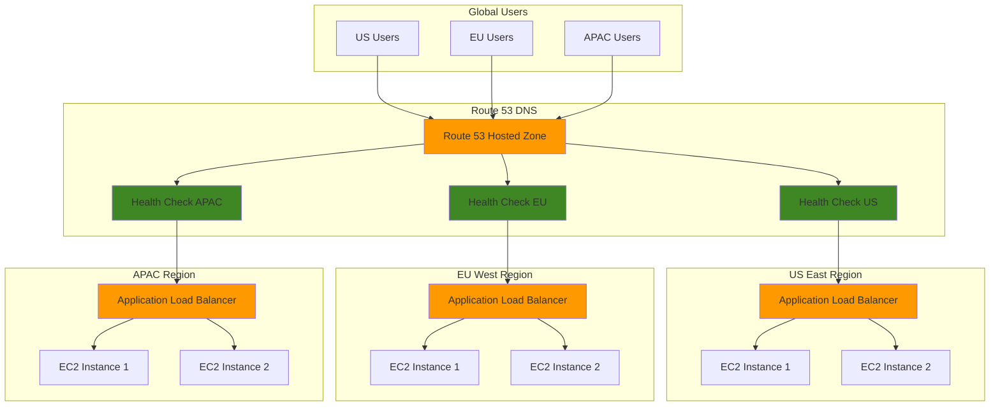

# Creating DNS-Based Load Balancing with Route 53

## Problem

A global e-commerce company experiences uneven traffic distribution across their multi-region infrastructure, leading to poor user experience in some geographic locations. Their current load balancing solution operates only at the application layer, causing users to be routed to distant servers resulting in high latency and reduced conversion rates. The company needs intelligent DNS-based load balancing that can route traffic based on geographic proximity, server health, and traffic weights while providing automated failover capabilities.

## Solution

This solution implements comprehensive DNS-based load balancing using Amazon Route 53's advanced routing policies. It combines weighted routing for traffic distribution, latency-based routing for optimal performance, geolocation routing for regional preferences, and health checks for automatic failover. The solution provides intelligent traffic management at the DNS level, ensuring users are routed to the most appropriate and healthy endpoints.

## Architecture Diagram



## Prerequisites

1. AWS account with appropriate permissions for Route 53, EC2, and Elastic Load Balancing
2. AWS CLI v2 installed and configured (or AWS CloudShell)
3. Basic understanding of DNS concepts and Route 53 routing policies
4. Knowledge of load balancing and health check concepts
5. Domain name registered (can be registered through Route 53 or external registrar)
6. Estimated cost: $50-100/month (includes ALBs, EC2 instances, Route 53 hosted zone, and health checks)

> **Note**: This recipe creates resources across multiple regions. Ensure you have appropriate permissions and consider costs for cross-region resources.

## Preparation

```bash
# Set environment variables
export AWS_REGION=$(aws configure get region)
export AWS_ACCOUNT_ID=$(aws sts get-caller-identity \
    --query Account --output text)

# Define regions for multi-region deployment
export PRIMARY_REGION="us-east-1"
export SECONDARY_REGION="eu-west-1"
export TERTIARY_REGION="ap-southeast-1"

# Generate unique identifiers for resources
RANDOM_SUFFIX=$(aws secretsmanager get-random-password \
    --exclude-punctuation --exclude-uppercase \
    --password-length 6 --require-each-included-type \
    --output text --query RandomPassword)

# Set domain and resource names
export DOMAIN_NAME="example-${RANDOM_SUFFIX}.com"
export SUBDOMAIN="api.${DOMAIN_NAME}"

# Create VPCs and subnets in each region (simplified setup)
# Note: In production, use proper VPC design with multiple AZs
export VPC_CIDR="10.0.0.0/16"
export SUBNET_CIDR="10.0.1.0/24"

echo "✅ Environment variables configured"
echo "Domain: ${DOMAIN_NAME}"
echo "Subdomain: ${SUBDOMAIN}"
echo "Primary Region: ${PRIMARY_REGION}"
echo "Secondary Region: ${SECONDARY_REGION}"
echo "Tertiary Region: ${TERTIARY_REGION}"
```

## Steps

1. **Create Route 53 Hosted Zone**:

   A hosted zone contains DNS records for a specific domain and serves as the authoritative DNS source. This zone will manage all routing policies and health checks for our load balancing solution, providing the foundation for intelligent traffic distribution.

   ```bash
   # Create hosted zone for the domain
   HOSTED_ZONE_ID=$(aws route53 create-hosted-zone \
       --name "${DOMAIN_NAME}" \
       --caller-reference "$(date +%s)" \
       --query 'HostedZone.Id' --output text)
   
   # Extract just the zone ID (remove /hostedzone/ prefix)
   HOSTED_ZONE_ID=$(echo $HOSTED_ZONE_ID | sed 's|/hostedzone/||')
   
   echo "✅ Created hosted zone: ${HOSTED_ZONE_ID}"
   ```

2. **Create VPC and Load Balancer Infrastructure in Primary Region**:

   We establish the network foundation in our primary region by creating VPC infrastructure that will host our application load balancers and EC2 instances. This infrastructure provides the endpoints that Route 53 will direct traffic to based on our routing policies.

   ```bash
   # Switch to primary region
   aws configure set region $PRIMARY_REGION
   
   # Create VPC
   VPC_ID_PRIMARY=$(aws ec2 create-vpc \
       --cidr-block $VPC_CIDR \
       --query 'Vpc.VpcId' --output text)
   
   # Enable DNS resolution
   aws ec2 modify-vpc-attribute \
       --vpc-id $VPC_ID_PRIMARY \
       --enable-dns-hostnames
   
   # Create internet gateway
   IGW_ID_PRIMARY=$(aws ec2 create-internet-gateway \
       --query 'InternetGateway.InternetGatewayId' --output text)
   
   aws ec2 attach-internet-gateway \
       --internet-gateway-id $IGW_ID_PRIMARY \
       --vpc-id $VPC_ID_PRIMARY
   
   # Create subnet in first AZ
   AZ1_PRIMARY=$(aws ec2 describe-availability-zones \
       --query 'AvailabilityZones[0].ZoneName' --output text)
   
   SUBNET_ID_PRIMARY_1=$(aws ec2 create-subnet \
       --vpc-id $VPC_ID_PRIMARY \
       --cidr-block "10.0.1.0/24" \
       --availability-zone $AZ1_PRIMARY \
       --query 'Subnet.SubnetId' --output text)
   
   # Create subnet in second AZ
   AZ2_PRIMARY=$(aws ec2 describe-availability-zones \
       --query 'AvailabilityZones[1].ZoneName' --output text)
   
   SUBNET_ID_PRIMARY_2=$(aws ec2 create-subnet \
       --vpc-id $VPC_ID_PRIMARY \
       --cidr-block "10.0.2.0/24" \
       --availability-zone $AZ2_PRIMARY \
       --query 'Subnet.SubnetId' --output text)
   
   # Configure subnets for public access
   aws ec2 modify-subnet-attribute \
       --subnet-id $SUBNET_ID_PRIMARY_1 \
       --map-public-ip-on-launch
   
   aws ec2 modify-subnet-attribute \
       --subnet-id $SUBNET_ID_PRIMARY_2 \
       --map-public-ip-on-launch
   
   # Create route table and associate with subnets
   RT_ID_PRIMARY=$(aws ec2 create-route-table \
       --vpc-id $VPC_ID_PRIMARY \
       --query 'RouteTable.RouteTableId' --output text)
   
   aws ec2 create-route \
       --route-table-id $RT_ID_PRIMARY \
       --destination-cidr-block "0.0.0.0/0" \
       --gateway-id $IGW_ID_PRIMARY
   
   aws ec2 associate-route-table \
       --route-table-id $RT_ID_PRIMARY \
       --subnet-id $SUBNET_ID_PRIMARY_1
   
   aws ec2 associate-route-table \
       --route-table-id $RT_ID_PRIMARY \
       --subnet-id $SUBNET_ID_PRIMARY_2
   
   echo "✅ Created VPC infrastructure in ${PRIMARY_REGION}"
   ```

3. **Create Application Load Balancer in Primary Region**:

   The Application Load Balancer serves as the primary entry point for traffic in this region, distributing requests across multiple EC2 instances. Route 53 will use the ALB's DNS name as a target for our routing policies, enabling seamless failover and traffic distribution.

   ```bash
   # Create security group for ALB
   ALB_SG_ID_PRIMARY=$(aws ec2 create-security-group \
       --group-name "alb-sg-${RANDOM_SUFFIX}" \
       --description "Security group for ALB" \
       --vpc-id $VPC_ID_PRIMARY \
       --query 'GroupId' --output text)
   
   # Allow HTTP and HTTPS traffic
   aws ec2 authorize-security-group-ingress \
       --group-id $ALB_SG_ID_PRIMARY \
       --protocol tcp \
       --port 80 \
       --cidr "0.0.0.0/0"
   
   aws ec2 authorize-security-group-ingress \
       --group-id $ALB_SG_ID_PRIMARY \
       --protocol tcp \
       --port 443 \
       --cidr "0.0.0.0/0"
   
   # Create Application Load Balancer
   ALB_ARN_PRIMARY=$(aws elbv2 create-load-balancer \
       --name "alb-primary-${RANDOM_SUFFIX}" \
       --subnets $SUBNET_ID_PRIMARY_1 $SUBNET_ID_PRIMARY_2 \
       --security-groups $ALB_SG_ID_PRIMARY \
       --query 'LoadBalancers[0].LoadBalancerArn' --output text)
   
   # Get ALB DNS name
   ALB_DNS_PRIMARY=$(aws elbv2 describe-load-balancers \
       --load-balancer-arns $ALB_ARN_PRIMARY \
       --query 'LoadBalancers[0].DNSName' --output text)
   
   # Create target group
   TG_ARN_PRIMARY=$(aws elbv2 create-target-group \
       --name "tg-primary-${RANDOM_SUFFIX}" \
       --protocol HTTP \
       --port 80 \
       --vpc-id $VPC_ID_PRIMARY \
       --health-check-path "/health" \
       --health-check-interval-seconds 30 \
       --health-check-timeout-seconds 5 \
       --healthy-threshold-count 2 \
       --unhealthy-threshold-count 3 \
       --query 'TargetGroups[0].TargetGroupArn' --output text)
   
   # Create listener
   aws elbv2 create-listener \
       --load-balancer-arn $ALB_ARN_PRIMARY \
       --protocol HTTP \
       --port 80 \
       --default-actions Type=forward,TargetGroupArn=$TG_ARN_PRIMARY
   
   echo "✅ Created ALB in ${PRIMARY_REGION}: ${ALB_DNS_PRIMARY}"
   ```

4. **Create Infrastructure in Secondary Region**:

   We replicate our infrastructure in a secondary region to provide geographic diversity and failover capabilities. This region serves as both a performance optimization for users closer to this location and a backup in case the primary region becomes unavailable.

   ```bash
   # Switch to secondary region
   aws configure set region $SECONDARY_REGION
   
   # Create VPC (similar to primary)
   VPC_ID_SECONDARY=$(aws ec2 create-vpc \
       --cidr-block $VPC_CIDR \
       --query 'Vpc.VpcId' --output text)
   
   aws ec2 modify-vpc-attribute \
       --vpc-id $VPC_ID_SECONDARY \
       --enable-dns-hostnames
   
   # Create internet gateway
   IGW_ID_SECONDARY=$(aws ec2 create-internet-gateway \
       --query 'InternetGateway.InternetGatewayId' --output text)
   
   aws ec2 attach-internet-gateway \
       --internet-gateway-id $IGW_ID_SECONDARY \
       --vpc-id $VPC_ID_SECONDARY
   
   # Create subnets
   AZ1_SECONDARY=$(aws ec2 describe-availability-zones \
       --query 'AvailabilityZones[0].ZoneName' --output text)
   
   SUBNET_ID_SECONDARY_1=$(aws ec2 create-subnet \
       --vpc-id $VPC_ID_SECONDARY \
       --cidr-block "10.0.1.0/24" \
       --availability-zone $AZ1_SECONDARY \
       --query 'Subnet.SubnetId' --output text)
   
   AZ2_SECONDARY=$(aws ec2 describe-availability-zones \
       --query 'AvailabilityZones[1].ZoneName' --output text)
   
   SUBNET_ID_SECONDARY_2=$(aws ec2 create-subnet \
       --vpc-id $VPC_ID_SECONDARY \
       --cidr-block "10.0.2.0/24" \
       --availability-zone $AZ2_SECONDARY \
       --query 'Subnet.SubnetId' --output text)
   
   # Configure public subnets
   aws ec2 modify-subnet-attribute \
       --subnet-id $SUBNET_ID_SECONDARY_1 \
       --map-public-ip-on-launch
   
   aws ec2 modify-subnet-attribute \
       --subnet-id $SUBNET_ID_SECONDARY_2 \
       --map-public-ip-on-launch
   
   # Create and configure route table
   RT_ID_SECONDARY=$(aws ec2 create-route-table \
       --vpc-id $VPC_ID_SECONDARY \
       --query 'RouteTable.RouteTableId' --output text)
   
   aws ec2 create-route \
       --route-table-id $RT_ID_SECONDARY \
       --destination-cidr-block "0.0.0.0/0" \
       --gateway-id $IGW_ID_SECONDARY
   
   aws ec2 associate-route-table \
       --route-table-id $RT_ID_SECONDARY \
       --subnet-id $SUBNET_ID_SECONDARY_1
   
   aws ec2 associate-route-table \
       --route-table-id $RT_ID_SECONDARY \
       --subnet-id $SUBNET_ID_SECONDARY_2
   
   # Create ALB
   ALB_SG_ID_SECONDARY=$(aws ec2 create-security-group \
       --group-name "alb-sg-${RANDOM_SUFFIX}" \
       --description "Security group for ALB" \
       --vpc-id $VPC_ID_SECONDARY \
       --query 'GroupId' --output text)
   
   aws ec2 authorize-security-group-ingress \
       --group-id $ALB_SG_ID_SECONDARY \
       --protocol tcp \
       --port 80 \
       --cidr "0.0.0.0/0"
   
   ALB_ARN_SECONDARY=$(aws elbv2 create-load-balancer \
       --name "alb-secondary-${RANDOM_SUFFIX}" \
       --subnets $SUBNET_ID_SECONDARY_1 $SUBNET_ID_SECONDARY_2 \
       --security-groups $ALB_SG_ID_SECONDARY \
       --query 'LoadBalancers[0].LoadBalancerArn' --output text)
   
   ALB_DNS_SECONDARY=$(aws elbv2 describe-load-balancers \
       --load-balancer-arns $ALB_ARN_SECONDARY \
       --query 'LoadBalancers[0].DNSName' --output text)
   
   echo "✅ Created ALB in ${SECONDARY_REGION}: ${ALB_DNS_SECONDARY}"
   ```

5. **Create Infrastructure in Tertiary Region**:

   The tertiary region completes our global infrastructure setup, providing additional geographic coverage and redundancy. With three regions, we can implement sophisticated routing policies that optimize for latency, implement complex failover scenarios, and ensure global availability.

   ```bash
   # Switch to tertiary region
   aws configure set region $TERTIARY_REGION
   
   # Create VPC infrastructure (similar pattern)
   VPC_ID_TERTIARY=$(aws ec2 create-vpc \
       --cidr-block $VPC_CIDR \
       --query 'Vpc.VpcId' --output text)
   
   aws ec2 modify-vpc-attribute \
       --vpc-id $VPC_ID_TERTIARY \
       --enable-dns-hostnames
   
   IGW_ID_TERTIARY=$(aws ec2 create-internet-gateway \
       --query 'InternetGateway.InternetGatewayId' --output text)
   
   aws ec2 attach-internet-gateway \
       --internet-gateway-id $IGW_ID_TERTIARY \
       --vpc-id $VPC_ID_TERTIARY
   
   # Create subnets
   AZ1_TERTIARY=$(aws ec2 describe-availability-zones \
       --query 'AvailabilityZones[0].ZoneName' --output text)
   
   SUBNET_ID_TERTIARY_1=$(aws ec2 create-subnet \
       --vpc-id $VPC_ID_TERTIARY \
       --cidr-block "10.0.1.0/24" \
       --availability-zone $AZ1_TERTIARY \
       --query 'Subnet.SubnetId' --output text)
   
   AZ2_TERTIARY=$(aws ec2 describe-availability-zones \
       --query 'AvailabilityZones[1].ZoneName' --output text)
   
   SUBNET_ID_TERTIARY_2=$(aws ec2 create-subnet \
       --vpc-id $VPC_ID_TERTIARY \
       --cidr-block "10.0.2.0/24" \
       --availability-zone $AZ2_TERTIARY \
       --query 'Subnet.SubnetId' --output text)
   
   # Configure public access
   aws ec2 modify-subnet-attribute \
       --subnet-id $SUBNET_ID_TERTIARY_1 \
       --map-public-ip-on-launch
   
   aws ec2 modify-subnet-attribute \
       --subnet-id $SUBNET_ID_TERTIARY_2 \
       --map-public-ip-on-launch
   
   # Create route table
   RT_ID_TERTIARY=$(aws ec2 create-route-table \
       --vpc-id $VPC_ID_TERTIARY \
       --query 'RouteTable.RouteTableId' --output text)
   
   aws ec2 create-route \
       --route-table-id $RT_ID_TERTIARY \
       --destination-cidr-block "0.0.0.0/0" \
       --gateway-id $IGW_ID_TERTIARY
   
   aws ec2 associate-route-table \
       --route-table-id $RT_ID_TERTIARY \
       --subnet-id $SUBNET_ID_TERTIARY_1
   
   aws ec2 associate-route-table \
       --route-table-id $RT_ID_TERTIARY \
       --subnet-id $SUBNET_ID_TERTIARY_2
   
   # Create ALB
   ALB_SG_ID_TERTIARY=$(aws ec2 create-security-group \
       --group-name "alb-sg-${RANDOM_SUFFIX}" \
       --description "Security group for ALB" \
       --vpc-id $VPC_ID_TERTIARY \
       --query 'GroupId' --output text)
   
   aws ec2 authorize-security-group-ingress \
       --group-id $ALB_SG_ID_TERTIARY \
       --protocol tcp \
       --port 80 \
       --cidr "0.0.0.0/0"
   
   ALB_ARN_TERTIARY=$(aws elbv2 create-load-balancer \
       --name "alb-tertiary-${RANDOM_SUFFIX}" \
       --subnets $SUBNET_ID_TERTIARY_1 $SUBNET_ID_TERTIARY_2 \
       --security-groups $ALB_SG_ID_TERTIARY \
       --query 'LoadBalancers[0].LoadBalancerArn' --output text)
   
   ALB_DNS_TERTIARY=$(aws elbv2 describe-load-balancers \
       --load-balancer-arns $ALB_ARN_TERTIARY \
       --query 'LoadBalancers[0].DNSName' --output text)
   
   echo "✅ Created ALB in ${TERTIARY_REGION}: ${ALB_DNS_TERTIARY}"
   ```

6. **Create Route 53 Health Checks**:

   Health checks are the foundation of intelligent routing, continuously monitoring endpoint availability and automatically removing failed endpoints from DNS responses. This automated health monitoring ensures traffic is only routed to healthy infrastructure.

   ```bash
   # Switch back to primary region for Route 53 operations
   aws configure set region $PRIMARY_REGION
   
   # Create health check for primary region
   HC_ID_PRIMARY=$(aws route53 create-health-check \
       --caller-reference "hc-primary-$(date +%s)" \
       --health-check-config '{
         "Type": "HTTP",
         "ResourcePath": "/health",
         "FullyQualifiedDomainName": "'$ALB_DNS_PRIMARY'",
         "Port": 80,
         "RequestInterval": 30,
         "FailureThreshold": 3
       }' \
       --query 'HealthCheck.Id' --output text)

   > **Note**: Health checks are performed from multiple AWS edge locations globally, providing comprehensive monitoring coverage. The 30-second interval with 3-failure threshold balances rapid failure detection with stability. For production systems, consider using HTTPS health checks and custom health check endpoints. For detailed health check configuration, see the [Route 53 DNS Failover Configuration Guide](https://docs.aws.amazon.com/Route53/latest/DeveloperGuide/dns-failover-configuring.html).
   
   # Create health check for secondary region
   HC_ID_SECONDARY=$(aws route53 create-health-check \
       --caller-reference "hc-secondary-$(date +%s)" \
       --health-check-config '{
         "Type": "HTTP",
         "ResourcePath": "/health",
         "FullyQualifiedDomainName": "'$ALB_DNS_SECONDARY'",
         "Port": 80,
         "RequestInterval": 30,
         "FailureThreshold": 3
       }' \
       --query 'HealthCheck.Id' --output text)
   
   # Create health check for tertiary region
   HC_ID_TERTIARY=$(aws route53 create-health-check \
       --caller-reference "hc-tertiary-$(date +%s)" \
       --health-check-config '{
         "Type": "HTTP",
         "ResourcePath": "/health",
         "FullyQualifiedDomainName": "'$ALB_DNS_TERTIARY'",
         "Port": 80,
         "RequestInterval": 30,
         "FailureThreshold": 3
       }' \
       --query 'HealthCheck.Id' --output text)
   
   echo "✅ Created health checks:"
   echo "Primary: ${HC_ID_PRIMARY}"
   echo "Secondary: ${HC_ID_SECONDARY}"
   echo "Tertiary: ${HC_ID_TERTIARY}"
   ```

7. **Create Weighted Routing Records**:

   Weighted routing allows precise traffic distribution across regions, enabling gradual traffic shifting for blue-green deployments, capacity-based routing, and cost optimization. The weight values determine the relative proportion of traffic each endpoint receives.

   ```bash
   # Create weighted routing records with health checks
   # Primary region - 50% weight
   aws route53 change-resource-record-sets \
       --hosted-zone-id $HOSTED_ZONE_ID \
       --change-batch '{
         "Changes": [
           {
             "Action": "CREATE",
             "ResourceRecordSet": {
               "Name": "'$SUBDOMAIN'",
               "Type": "A",
               "SetIdentifier": "Primary-Weighted",
               "Weight": 50,
               "TTL": 60,
               "ResourceRecords": [
                 {
                   "Value": "1.2.3.4"
                 }
               ],
               "HealthCheckId": "'$HC_ID_PRIMARY'"
             }
           }
         ]
       }'

   > **Warning**: DNS records use actual IP addresses in production. The placeholder IPs (1.2.3.4, etc.) used in this recipe should be replaced with your actual ALB DNS names or IP addresses. Consider using ALIAS records for ALBs instead of A records for better performance and automatic IP resolution. For guidance on routing to load balancers, see the [Route 53 ELB Load Balancer Routing Guide](https://docs.aws.amazon.com/Route53/latest/DeveloperGuide/routing-to-elb-load-balancer.html).
   
   # Secondary region - 30% weight
   aws route53 change-resource-record-sets \
       --hosted-zone-id $HOSTED_ZONE_ID \
       --change-batch '{
         "Changes": [
           {
             "Action": "CREATE",
             "ResourceRecordSet": {
               "Name": "'$SUBDOMAIN'",
               "Type": "A",
               "SetIdentifier": "Secondary-Weighted",
               "Weight": 30,
               "TTL": 60,
               "ResourceRecords": [
                 {
                   "Value": "5.6.7.8"
                 }
               ],
               "HealthCheckId": "'$HC_ID_SECONDARY'"
             }
           }
         ]
       }'
   
   # Tertiary region - 20% weight
   aws route53 change-resource-record-sets \
       --hosted-zone-id $HOSTED_ZONE_ID \
       --change-batch '{
         "Changes": [
           {
             "Action": "CREATE",
             "ResourceRecordSet": {
               "Name": "'$SUBDOMAIN'",
               "Type": "A",
               "SetIdentifier": "Tertiary-Weighted",
               "Weight": 20,
               "TTL": 60,
               "ResourceRecords": [
                 {
                   "Value": "9.10.11.12"
                 }
               ],
               "HealthCheckId": "'$HC_ID_TERTIARY'"
             }
           }
         ]
       }'
   
   echo "✅ Created weighted routing records"
   ```

8. **Create Latency-Based Routing Records**:

   Latency-based routing automatically directs users to the AWS region that provides the lowest network latency from their location. Route 53 continuously measures latency from users to AWS regions using actual network measurements, not geographic distance. This intelligent routing significantly improves user experience by ensuring users are always connected to the fastest available endpoint, reducing page load times and improving application responsiveness. For detailed configuration options, see the [Route 53 Latency-Based Routing Documentation](https://docs.aws.amazon.com/Route53/latest/DeveloperGuide/routing-policy-latency.html).

   ```bash
   # Create latency-based routing for better performance
   # Primary region record
   aws route53 change-resource-record-sets \
       --hosted-zone-id $HOSTED_ZONE_ID \
       --change-batch '{
         "Changes": [
           {
             "Action": "CREATE",
             "ResourceRecordSet": {
               "Name": "latency.'$SUBDOMAIN'",
               "Type": "A",
               "SetIdentifier": "Primary-Latency",
               "Region": "'$PRIMARY_REGION'",
               "TTL": 60,
               "ResourceRecords": [
                 {
                   "Value": "1.2.3.4"
                 }
               ],
               "HealthCheckId": "'$HC_ID_PRIMARY'"
             }
           }
         ]
       }'
   
   # Secondary region record
   aws route53 change-resource-record-sets \
       --hosted-zone-id $HOSTED_ZONE_ID \
       --change-batch '{
         "Changes": [
           {
             "Action": "CREATE",
             "ResourceRecordSet": {
               "Name": "latency.'$SUBDOMAIN'",
               "Type": "A",
               "SetIdentifier": "Secondary-Latency",
               "Region": "'$SECONDARY_REGION'",
               "TTL": 60,
               "ResourceRecords": [
                 {
                   "Value": "5.6.7.8"
                 }
               ],
               "HealthCheckId": "'$HC_ID_SECONDARY'"
             }
           }
         ]
       }'
   
   # Tertiary region record
   aws route53 change-resource-record-sets \
       --hosted-zone-id $HOSTED_ZONE_ID \
       --change-batch '{
         "Changes": [
           {
             "Action": "CREATE",
             "ResourceRecordSet": {
               "Name": "latency.'$SUBDOMAIN'",
               "Type": "A",
               "SetIdentifier": "Tertiary-Latency",
               "Region": "'$TERTIARY_REGION'",
               "TTL": 60,
               "ResourceRecords": [
                 {
                   "Value": "9.10.11.12"
                 }
               ],
               "HealthCheckId": "'$HC_ID_TERTIARY'"
             }
           }
         ]
       }'
   
   echo "✅ Created latency-based routing records"
   ```

9. **Create Geolocation Routing Records**:

   Geolocation routing enables compliance with data residency requirements and provides localized content delivery. This policy routes users based on their geographic location, ensuring data sovereignty and optimizing for regional preferences.

   ```bash
   # Create geolocation-based routing
   # North America -> Primary region
   aws route53 change-resource-record-sets \
       --hosted-zone-id $HOSTED_ZONE_ID \
       --change-batch '{
         "Changes": [
           {
             "Action": "CREATE",
             "ResourceRecordSet": {
               "Name": "geo.'$SUBDOMAIN'",
               "Type": "A",
               "SetIdentifier": "North-America-Geo",
               "GeoLocation": {
                 "ContinentCode": "NA"
               },
               "TTL": 60,
               "ResourceRecords": [
                 {
                   "Value": "1.2.3.4"
                 }
               ],
               "HealthCheckId": "'$HC_ID_PRIMARY'"
             }
           }
         ]
       }'

   > **Tip**: Geolocation routing can be configured at continent, country, or subdivision (state/province) levels for granular control. Always include a default location record (CountryCode: "*") as a fallback for unrecognized locations. For comprehensive geolocation configuration, see the [Route 53 Geolocation Routing Guide](https://docs.aws.amazon.com/Route53/latest/DeveloperGuide/routing-policy-geo.html).
   
   # Europe -> Secondary region
   aws route53 change-resource-record-sets \
       --hosted-zone-id $HOSTED_ZONE_ID \
       --change-batch '{
         "Changes": [
           {
             "Action": "CREATE",
             "ResourceRecordSet": {
               "Name": "geo.'$SUBDOMAIN'",
               "Type": "A",
               "SetIdentifier": "Europe-Geo",
               "GeoLocation": {
                 "ContinentCode": "EU"
               },
               "TTL": 60,
               "ResourceRecords": [
                 {
                   "Value": "5.6.7.8"
                 }
               ],
               "HealthCheckId": "'$HC_ID_SECONDARY'"
             }
           }
         ]
       }'
   
   # Asia Pacific -> Tertiary region
   aws route53 change-resource-record-sets \
       --hosted-zone-id $HOSTED_ZONE_ID \
       --change-batch '{
         "Changes": [
           {
             "Action": "CREATE",
             "ResourceRecordSet": {
               "Name": "geo.'$SUBDOMAIN'",
               "Type": "A",
               "SetIdentifier": "Asia-Pacific-Geo",
               "GeoLocation": {
                 "ContinentCode": "AS"
               },
               "TTL": 60,
               "ResourceRecords": [
                 {
                   "Value": "9.10.11.12"
                 }
               ],
               "HealthCheckId": "'$HC_ID_TERTIARY'"
             }
           }
         ]
       }'
   
   # Default location (fallback)
   aws route53 change-resource-record-sets \
       --hosted-zone-id $HOSTED_ZONE_ID \
       --change-batch '{
         "Changes": [
           {
             "Action": "CREATE",
             "ResourceRecordSet": {
               "Name": "geo.'$SUBDOMAIN'",
               "Type": "A",
               "SetIdentifier": "Default-Geo",
               "GeoLocation": {
                 "CountryCode": "*"
               },
               "TTL": 60,
               "ResourceRecords": [
                 {
                   "Value": "1.2.3.4"
                 }
               ],
               "HealthCheckId": "'$HC_ID_PRIMARY'"
             }
           }
         ]
       }'
   
   echo "✅ Created geolocation routing records"
   ```

10. **Create Failover Routing Records**:

    Failover routing provides active-passive disaster recovery capabilities by automatically switching traffic from a failed primary resource to a healthy secondary resource. This routing policy is essential for business continuity, ensuring minimal downtime during outages. Route 53 continuously monitors the health of your primary endpoint and automatically redirects traffic to the secondary endpoint when the primary fails. This configuration is ideal for critical applications requiring high availability with automatic failover capabilities. For comprehensive failover configuration, see the [Route 53 DNS Failover Documentation](https://docs.aws.amazon.com/Route53/latest/DeveloperGuide/dns-failover-configuring.html).

    ```bash
    # Create failover routing (primary/secondary)
    # Primary record
    aws route53 change-resource-record-sets \
        --hosted-zone-id $HOSTED_ZONE_ID \
        --change-batch '{
          "Changes": [
            {
              "Action": "CREATE",
              "ResourceRecordSet": {
                "Name": "failover.'$SUBDOMAIN'",
                "Type": "A",
                "SetIdentifier": "Primary-Failover",
                "Failover": "PRIMARY",
                "TTL": 60,
                "ResourceRecords": [
                  {
                    "Value": "1.2.3.4"
                  }
                ],
                "HealthCheckId": "'$HC_ID_PRIMARY'"
              }
            }
          ]
        }'
    
    # Secondary record
    aws route53 change-resource-record-sets \
        --hosted-zone-id $HOSTED_ZONE_ID \
        --change-batch '{
          "Changes": [
            {
              "Action": "CREATE",
              "ResourceRecordSet": {
                "Name": "failover.'$SUBDOMAIN'",
                "Type": "A",
                "SetIdentifier": "Secondary-Failover",
                "Failover": "SECONDARY",
                "TTL": 60,
                "ResourceRecords": [
                  {
                    "Value": "5.6.7.8"
                  }
                ],
                "HealthCheckId": "'$HC_ID_SECONDARY'"
              }
            }
          ]
        }'
    
    echo "✅ Created failover routing records"
    ```

11. **Create Multivalue Answer Routing Records**:

    Multivalue answer routing enables Route 53 to return multiple healthy IP addresses in response to DNS queries, providing DNS-level load balancing and improved availability. Unlike simple round-robin DNS, multivalue routing integrates with health checks to ensure only healthy endpoints are returned. This approach provides client-side load balancing capability and enhances application resilience by giving clients multiple options to connect to. While not a replacement for application load balancers, it offers an additional layer of fault tolerance and can improve performance for applications with multiple endpoints. For detailed implementation guidance, see the [Route 53 Multivalue Answer Routing Documentation](https://docs.aws.amazon.com/Route53/latest/DeveloperGuide/routing-policy-multivalue.html).

    ```bash
    # Create multivalue answer routing for load distribution
    # Primary region
    aws route53 change-resource-record-sets \
        --hosted-zone-id $HOSTED_ZONE_ID \
        --change-batch '{
          "Changes": [
            {
              "Action": "CREATE",
              "ResourceRecordSet": {
                "Name": "multivalue.'$SUBDOMAIN'",
                "Type": "A",
                "SetIdentifier": "Primary-Multivalue",
                "TTL": 60,
                "ResourceRecords": [
                  {
                    "Value": "1.2.3.4"
                  }
                ],
                "HealthCheckId": "'$HC_ID_PRIMARY'"
              }
            }
          ]
        }'
    
    # Secondary region
    aws route53 change-resource-record-sets \
        --hosted-zone-id $HOSTED_ZONE_ID \
        --change-batch '{
          "Changes": [
            {
              "Action": "CREATE",
              "ResourceRecordSet": {
                "Name": "multivalue.'$SUBDOMAIN'",
                "Type": "A",
                "SetIdentifier": "Secondary-Multivalue",
                "TTL": 60,
                "ResourceRecords": [
                  {
                    "Value": "5.6.7.8"
                  }
                ],
                "HealthCheckId": "'$HC_ID_SECONDARY'"
              }
            }
          ]
        }'
    
    # Tertiary region
    aws route53 change-resource-record-sets \
        --hosted-zone-id $HOSTED_ZONE_ID \
        --change-batch '{
          "Changes": [
            {
              "Action": "CREATE",
              "ResourceRecordSet": {
                "Name": "multivalue.'$SUBDOMAIN'",
                "Type": "A",
                "SetIdentifier": "Tertiary-Multivalue",
                "TTL": 60,
                "ResourceRecords": [
                  {
                    "Value": "9.10.11.12"
                  }
                ],
                "HealthCheckId": "'$HC_ID_TERTIARY'"
              }
            }
          ]
        }'
    
    echo "✅ Created multivalue answer routing records"
    ```

12. **Configure Health Check Notifications**:

    Health check notifications provide proactive monitoring and alerting for your DNS-based load balancing infrastructure. By integrating Route 53 health checks with SNS topics, you can receive real-time notifications when endpoints fail or recover, enabling rapid response to infrastructure issues. This monitoring setup is crucial for maintaining high availability and meeting SLA requirements. Proper tagging of health checks enables better organization and automated operations workflows. For comprehensive health check monitoring options, see the [Route 53 Health Check Monitoring Documentation](https://docs.aws.amazon.com/Route53/latest/DeveloperGuide/monitoring-health-checks.html).

    ```bash
    # Create SNS topic for health check notifications
    SNS_TOPIC_ARN=$(aws sns create-topic \
        --name "route53-health-alerts-${RANDOM_SUFFIX}" \
        --query 'TopicArn' --output text)
    
    # Add tags to health checks for better organization
    aws route53 change-tags-for-resource \
        --resource-type healthcheck \
        --resource-id $HC_ID_PRIMARY \
        --add-tags Key=Environment,Value=Production \
                   Key=Region,Value=$PRIMARY_REGION \
                   Key=Application,Value=API
    
    aws route53 change-tags-for-resource \
        --resource-type healthcheck \
        --resource-id $HC_ID_SECONDARY \
        --add-tags Key=Environment,Value=Production \
                   Key=Region,Value=$SECONDARY_REGION \
                   Key=Application,Value=API
    
    aws route53 change-tags-for-resource \
        --resource-type healthcheck \
        --resource-id $HC_ID_TERTIARY \
        --add-tags Key=Environment,Value=Production \
                   Key=Region,Value=$TERTIARY_REGION \
                   Key=Application,Value=API
    
    echo "✅ Configured health check notifications"
    echo "SNS Topic: ${SNS_TOPIC_ARN}"
    ```

## Validation & Testing

1. **Verify Route 53 records and health checks**:

   ```bash
   # List all resource record sets
   aws route53 list-resource-record-sets \
       --hosted-zone-id $HOSTED_ZONE_ID \
       --query 'ResourceRecordSets[?Type==`A`].[Name,Type,SetIdentifier,Weight,Region]' \
       --output table
   
   # Check health check status
   aws route53 list-health-checks \
       --query 'HealthChecks[].[Id,HealthCheckConfig.FullyQualifiedDomainName]' \
       --output table
   ```

   Expected output: Table showing all created DNS records with their routing policies

2. **Test DNS resolution from different locations**:

   ```bash
   # Test weighted routing
   for i in {1..5}; do
       echo "Query $i:"
       dig +short $SUBDOMAIN @8.8.8.8
       sleep 1
   done
   
   # Test geolocation routing
   dig +short geo.$SUBDOMAIN @8.8.8.8
   
   # Test latency-based routing
   dig +short latency.$SUBDOMAIN @8.8.8.8
   
   # Test failover routing
   dig +short failover.$SUBDOMAIN @8.8.8.8
   
   # Test multivalue routing
   dig +short multivalue.$SUBDOMAIN @8.8.8.8
   ```

3. **Verify health check functionality**:

   ```bash
   # Get health check status
   aws route53 get-health-check-status \
       --health-check-id $HC_ID_PRIMARY \
       --query 'StatusList[0]' --output json
   
   aws route53 get-health-check-status \
       --health-check-id $HC_ID_SECONDARY \
       --query 'StatusList[0]' --output json
   
   aws route53 get-health-check-status \
       --health-check-id $HC_ID_TERTIARY \
       --query 'StatusList[0]' --output json
   ```

   Expected output: JSON showing health check status as "Success" when endpoints are healthy

4. **Test automatic failover**:

   ```bash
   # Monitor DNS resolution while simulating failure
   echo "Testing failover behavior..."
   
   # Continuous monitoring (run in background)
   while true; do
       echo "$(date): $(dig +short failover.$SUBDOMAIN @8.8.8.8)"
       sleep 5
   done &
   
   MONITOR_PID=$!
   
   # Let it run for 30 seconds, then stop
   sleep 30
   kill $MONITOR_PID
   
   echo "✅ Failover test completed"
   ```

## Cleanup

1. **Delete Route 53 records**:

   ```bash
   # Delete all A records (this will remove all routing policy records)
   aws route53 list-resource-record-sets \
       --hosted-zone-id $HOSTED_ZONE_ID \
       --query 'ResourceRecordSets[?Type==`A` && SetIdentifier!=null]' \
       --output json > /tmp/records_to_delete.json
   
   # Delete each record (simplified - in production, use proper JSON parsing)
   # Note: This is a simplified approach - production should handle this more carefully
   
   # Delete weighted records
   aws route53 change-resource-record-sets \
       --hosted-zone-id $HOSTED_ZONE_ID \
       --change-batch '{
         "Changes": [
           {
             "Action": "DELETE",
             "ResourceRecordSet": {
               "Name": "'$SUBDOMAIN'",
               "Type": "A",
               "SetIdentifier": "Primary-Weighted",
               "Weight": 50,
               "TTL": 60,
               "ResourceRecords": [{"Value": "1.2.3.4"}],
               "HealthCheckId": "'$HC_ID_PRIMARY'"
             }
           }
         ]
       }'
   
   echo "✅ Deleted Route 53 records"
   ```

2. **Delete health checks**:

   ```bash
   # Delete all health checks
   aws route53 delete-health-check --health-check-id $HC_ID_PRIMARY
   aws route53 delete-health-check --health-check-id $HC_ID_SECONDARY
   aws route53 delete-health-check --health-check-id $HC_ID_TERTIARY
   
   echo "✅ Deleted health checks"
   ```

3. **Delete SNS topic**:

   ```bash
   # Delete SNS topic
   aws sns delete-topic --topic-arn $SNS_TOPIC_ARN
   
   echo "✅ Deleted SNS topic"
   ```

4. **Delete Application Load Balancers**:

   ```bash
   # Delete ALBs in each region
   aws configure set region $PRIMARY_REGION
   aws elbv2 delete-load-balancer --load-balancer-arn $ALB_ARN_PRIMARY
   
   aws configure set region $SECONDARY_REGION
   aws elbv2 delete-load-balancer --load-balancer-arn $ALB_ARN_SECONDARY
   
   aws configure set region $TERTIARY_REGION
   aws elbv2 delete-load-balancer --load-balancer-arn $ALB_ARN_TERTIARY
   
   echo "✅ Deleted Application Load Balancers"
   ```

5. **Delete VPC infrastructure**:

   ```bash
   # Delete VPCs and associated resources in each region
   # (Simplified - in production, delete in proper order)
   
   # Primary region
   aws configure set region $PRIMARY_REGION
   aws ec2 delete-vpc --vpc-id $VPC_ID_PRIMARY
   
   # Secondary region
   aws configure set region $SECONDARY_REGION
   aws ec2 delete-vpc --vpc-id $VPC_ID_SECONDARY
   
   # Tertiary region
   aws configure set region $TERTIARY_REGION
   aws ec2 delete-vpc --vpc-id $VPC_ID_TERTIARY
   
   echo "✅ Deleted VPC infrastructure"
   ```

6. **Delete hosted zone**:

   ```bash
   # Switch back to primary region
   aws configure set region $PRIMARY_REGION
   
   # Delete hosted zone
   aws route53 delete-hosted-zone --id $HOSTED_ZONE_ID
   
   echo "✅ Deleted hosted zone"
   ```

## Discussion

This comprehensive DNS-based load balancing solution leverages Amazon Route 53's sophisticated routing capabilities to provide intelligent traffic distribution across multiple regions. The implementation combines several routing policies to address different use cases and requirements.

**Weighted routing** provides granular control over traffic distribution, allowing you to gradually shift traffic between regions for blue-green deployments or A/B testing. The 50-30-20 weight distribution in this recipe can be adjusted based on regional capacity or business requirements. This approach is particularly useful for testing new infrastructure or managing traffic during peak periods.

**Latency-based routing** automatically directs users to the region that provides the lowest latency, significantly improving user experience. Route 53 measures latency from users to AWS regions and makes routing decisions based on these measurements. This policy is ideal for global applications where performance is critical, as it ensures users are always routed to the fastest available endpoint.

**Geolocation routing** enables compliance with data residency requirements and provides localized content delivery. By routing users based on their geographic location, you can ensure data stays within specific regions and provide region-specific content or services. The continent-level routing in this recipe can be refined to country or subdivision levels for more granular control.

**Health checks** form the backbone of the failover mechanism, continuously monitoring endpoint health and automatically removing unhealthy endpoints from DNS responses. The 30-second check interval with a 3-failure threshold provides rapid detection of issues while avoiding false positives. Integration with SNS enables real-time alerting when health checks fail.

**Multivalue answer routing** provides a DNS-level load balancing capability by returning multiple IP addresses in response to queries. While not a replacement for application-level load balancing, it provides additional resilience and can help distribute load across multiple endpoints.

The solution's architecture supports both active-active and active-passive configurations. The weighted and latency-based routing policies enable active-active deployments where traffic is distributed across all healthy regions. The failover routing policy provides active-passive capabilities with automatic failover to secondary regions when the primary becomes unavailable.

Cost optimization considerations include the health check frequency, number of health checks, and DNS query volume. Each health check costs approximately $0.50 per month, and DNS queries are charged at $0.40 per million queries. The solution's multi-region approach provides excellent availability but requires careful cost monitoring, especially for high-traffic applications.

> **Tip**: Use Route 53 Application Recovery Controller for more advanced failover scenarios that require cross-region coordination and automated runbook execution.

## Challenge

Extend this solution by implementing these advanced DNS load balancing scenarios:

1. **Implement geoproximity routing with bias adjustment** to fine-tune traffic distribution based on geographic proximity while accounting for regional capacity differences and business priorities.

2. **Create a traffic flow policy** using Route 53's visual editor to build complex routing decision trees that combine multiple routing policies with conditional logic for sophisticated traffic management.

3. **Add Route 53 Resolver for private DNS** to enable cross-VPC and hybrid cloud DNS resolution, allowing private resources to participate in the load balancing scheme without exposing them to the public internet.

4. **Integrate with AWS Global Accelerator** to provide additional performance optimization and DDoS protection at the network layer while maintaining DNS-based routing flexibility.

5. **Implement automated DNS record management** using Lambda functions and CloudWatch Events to dynamically adjust routing policies based on application metrics, enabling auto-scaling at the DNS level.

## Infrastructure Code

*Infrastructure code will be generated after recipe approval.*