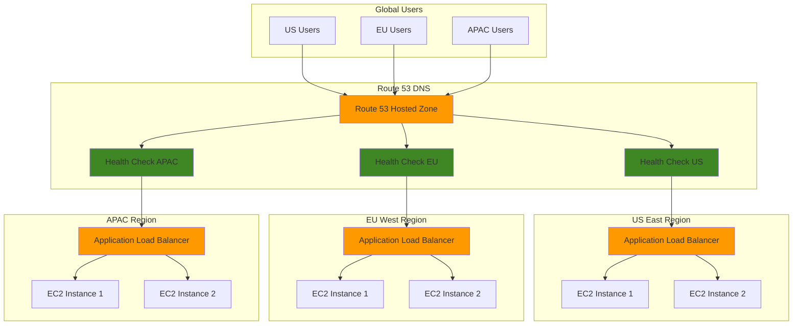

# DNS-Based Load Balancing with Route 53

## Problem

A global e-commerce company experiences uneven traffic distribution across their multi-region infrastructure, leading to poor user experience in some geographic locations. Their current load balancing solution operates only at the application layer, causing users to be routed to distant servers resulting in high latency and reduced conversion rates during peak shopping periods. The company needs intelligent DNS-based load balancing that can route traffic based on geographic proximity, server health, and traffic weights while providing automated failover capabilities.

## Solution

This solution implements comprehensive DNS-based load balancing using Amazon Route 53's advanced routing policies. It combines weighted routing for traffic distribution, latency-based routing for optimal performance, geolocation routing for regional preferences, and health checks for automatic failover. The solution provides intelligent traffic management at the DNS level, ensuring users are routed to the most appropriate and healthy endpoints while following AWS Well-Architected Framework principles.

## Architecture Diagram



## Prerequisites

1. AWS account with appropriate permissions for Route 53, EC2, and Elastic Load Balancing
2. AWS CLI v2 installed and configured (or AWS CloudShell)
3. Basic understanding of DNS concepts and Route 53 routing policies
4. Knowledge of load balancing and health check concepts
5. Domain name registered (can be registered through Route 53 or external registrar)
6. Estimated cost: $50-100/month (includes ALBs, EC2 instances, Route 53 hosted zone, and health checks)

> **Note**: This recipe creates resources across multiple regions. Ensure you have appropriate permissions and consider costs for cross-region resources.

## Preparation

```bash
# Set environment variables
export AWS_REGION=$(aws configure get region)
export AWS_ACCOUNT_ID=$(aws sts get-caller-identity \
    --query Account --output text)

# Define regions for multi-region deployment
export PRIMARY_REGION="us-east-1"
export SECONDARY_REGION="eu-west-1"
export TERTIARY_REGION="ap-southeast-1"

# Generate unique identifiers for resources
RANDOM_SUFFIX=$(aws secretsmanager get-random-password \
    --exclude-punctuation --exclude-uppercase \
    --password-length 6 --require-each-included-type \
    --output text --query RandomPassword)

# Set domain and resource names
export DOMAIN_NAME="example-${RANDOM_SUFFIX}.com"
export SUBDOMAIN="api.${DOMAIN_NAME}"

# VPC configuration for multi-region deployment
export VPC_CIDR="10.0.0.0/16"

echo "✅ Environment variables configured"
echo "Domain: ${DOMAIN_NAME}"
echo "Subdomain: ${SUBDOMAIN}"
echo "Primary Region: ${PRIMARY_REGION}"
echo "Secondary Region: ${SECONDARY_REGION}"
echo "Tertiary Region: ${TERTIARY_REGION}"
```

## Steps

1. **Create Route 53 Hosted Zone**:

   A hosted zone contains DNS records for a specific domain and serves as the authoritative DNS source. This zone will manage all routing policies and health checks for our load balancing solution, providing the foundation for intelligent traffic distribution across multiple AWS regions.

   ```bash
   # Create hosted zone for the domain
   HOSTED_ZONE_ID=$(aws route53 create-hosted-zone \
       --name "${DOMAIN_NAME}" \
       --caller-reference "$(date +%s)" \
       --query 'HostedZone.Id' --output text)
   
   # Extract just the zone ID (remove /hostedzone/ prefix)
   HOSTED_ZONE_ID=$(echo $HOSTED_ZONE_ID | sed 's|/hostedzone/||')
   
   echo "✅ Created hosted zone: ${HOSTED_ZONE_ID}"
   ```

2. **Create VPC and Load Balancer Infrastructure in Primary Region**:

   We establish the network foundation in our primary region by creating VPC infrastructure that will host our application load balancers. This infrastructure provides the endpoints that Route 53 will direct traffic to based on our routing policies, ensuring high availability and proper network isolation.

   ```bash
   # Switch to primary region
   aws configure set region $PRIMARY_REGION
   
   # Create VPC with DNS resolution enabled
   VPC_ID_PRIMARY=$(aws ec2 create-vpc \
       --cidr-block $VPC_CIDR \
       --tag-specifications \
       'ResourceType=vpc,Tags=[{Key=Name,Value=route53-lb-primary}]' \
       --query 'Vpc.VpcId' --output text)
   
   # Enable DNS resolution and hostnames
   aws ec2 modify-vpc-attribute \
       --vpc-id $VPC_ID_PRIMARY \
       --enable-dns-hostnames
   
   aws ec2 modify-vpc-attribute \
       --vpc-id $VPC_ID_PRIMARY \
       --enable-dns-support
   
   # Create internet gateway
   IGW_ID_PRIMARY=$(aws ec2 create-internet-gateway \
       --tag-specifications \
       'ResourceType=internet-gateway,Tags=[{Key=Name,Value=route53-lb-igw-primary}]' \
       --query 'InternetGateway.InternetGatewayId' --output text)
   
   aws ec2 attach-internet-gateway \
       --internet-gateway-id $IGW_ID_PRIMARY \
       --vpc-id $VPC_ID_PRIMARY
   
   # Create subnets in multiple AZs for high availability
   AZ1_PRIMARY=$(aws ec2 describe-availability-zones \
       --query 'AvailabilityZones[0].ZoneName' --output text)
   
   SUBNET_ID_PRIMARY_1=$(aws ec2 create-subnet \
       --vpc-id $VPC_ID_PRIMARY \
       --cidr-block "10.0.1.0/24" \
       --availability-zone $AZ1_PRIMARY \
       --tag-specifications \
       'ResourceType=subnet,Tags=[{Key=Name,Value=route53-lb-subnet-1-primary}]' \
       --query 'Subnet.SubnetId' --output text)
   
   AZ2_PRIMARY=$(aws ec2 describe-availability-zones \
       --query 'AvailabilityZones[1].ZoneName' --output text)
   
   SUBNET_ID_PRIMARY_2=$(aws ec2 create-subnet \
       --vpc-id $VPC_ID_PRIMARY \
       --cidr-block "10.0.2.0/24" \
       --availability-zone $AZ2_PRIMARY \
       --tag-specifications \
       'ResourceType=subnet,Tags=[{Key=Name,Value=route53-lb-subnet-2-primary}]' \
       --query 'Subnet.SubnetId' --output text)
   
   # Configure subnets for public access
   aws ec2 modify-subnet-attribute \
       --subnet-id $SUBNET_ID_PRIMARY_1 \
       --map-public-ip-on-launch
   
   aws ec2 modify-subnet-attribute \
       --subnet-id $SUBNET_ID_PRIMARY_2 \
       --map-public-ip-on-launch
   
   # Create and configure route table
   RT_ID_PRIMARY=$(aws ec2 create-route-table \
       --vpc-id $VPC_ID_PRIMARY \
       --tag-specifications \
       'ResourceType=route-table,Tags=[{Key=Name,Value=route53-lb-rt-primary}]' \
       --query 'RouteTable.RouteTableId' --output text)
   
   aws ec2 create-route \
       --route-table-id $RT_ID_PRIMARY \
       --destination-cidr-block "0.0.0.0/0" \
       --gateway-id $IGW_ID_PRIMARY
   
   aws ec2 associate-route-table \
       --route-table-id $RT_ID_PRIMARY \
       --subnet-id $SUBNET_ID_PRIMARY_1
   
   aws ec2 associate-route-table \
       --route-table-id $RT_ID_PRIMARY \
       --subnet-id $SUBNET_ID_PRIMARY_2
   
   echo "✅ Created VPC infrastructure in ${PRIMARY_REGION}"
   ```

3. **Create Application Load Balancer in Primary Region**:

   The Application Load Balancer serves as the primary entry point for traffic in this region, distributing requests across multiple availability zones. Route 53 will use the ALB's DNS name as a target for our routing policies through ALIAS records, enabling seamless failover and efficient traffic distribution.

   ```bash
   # Create security group for ALB with proper ingress rules
   ALB_SG_ID_PRIMARY=$(aws ec2 create-security-group \
       --group-name "alb-sg-${RANDOM_SUFFIX}-primary" \
       --description "Security group for ALB in primary region" \
       --vpc-id $VPC_ID_PRIMARY \
       --tag-specifications \
       'ResourceType=security-group,Tags=[{Key=Name,Value=route53-lb-alb-sg-primary}]' \
       --query 'GroupId' --output text)
   
   # Allow HTTP and HTTPS traffic from internet
   aws ec2 authorize-security-group-ingress \
       --group-id $ALB_SG_ID_PRIMARY \
       --protocol tcp \
       --port 80 \
       --cidr "0.0.0.0/0"
   
   aws ec2 authorize-security-group-ingress \
       --group-id $ALB_SG_ID_PRIMARY \
       --protocol tcp \
       --port 443 \
       --cidr "0.0.0.0/0"
   
   # Create Application Load Balancer
   ALB_ARN_PRIMARY=$(aws elbv2 create-load-balancer \
       --name "alb-primary-${RANDOM_SUFFIX}" \
       --subnets $SUBNET_ID_PRIMARY_1 $SUBNET_ID_PRIMARY_2 \
       --security-groups $ALB_SG_ID_PRIMARY \
       --scheme internet-facing \
       --type application \
       --ip-address-type ipv4 \
       --tags Key=Name,Value=route53-lb-alb-primary \
       --query 'LoadBalancers[0].LoadBalancerArn' --output text)
   
   # Get ALB DNS name for Route 53 configuration
   ALB_DNS_PRIMARY=$(aws elbv2 describe-load-balancers \
       --load-balancer-arns $ALB_ARN_PRIMARY \
       --query 'LoadBalancers[0].DNSName' --output text)
   
   # Get ALB Hosted Zone ID for ALIAS records
   ALB_ZONE_ID_PRIMARY=$(aws elbv2 describe-load-balancers \
       --load-balancer-arns $ALB_ARN_PRIMARY \
       --query 'LoadBalancers[0].CanonicalHostedZoneId' --output text)
   
   # Create target group with health check configuration
   TG_ARN_PRIMARY=$(aws elbv2 create-target-group \
       --name "tg-primary-${RANDOM_SUFFIX}" \
       --protocol HTTP \
       --port 80 \
       --vpc-id $VPC_ID_PRIMARY \
       --health-check-path "/health" \
       --health-check-interval-seconds 30 \
       --health-check-timeout-seconds 5 \
       --healthy-threshold-count 2 \
       --unhealthy-threshold-count 3 \
       --tags Key=Name,Value=route53-lb-tg-primary \
       --query 'TargetGroups[0].TargetGroupArn' --output text)
   
   # Create listener for ALB
   aws elbv2 create-listener \
       --load-balancer-arn $ALB_ARN_PRIMARY \
       --protocol HTTP \
       --port 80 \
       --default-actions Type=forward,TargetGroupArn=$TG_ARN_PRIMARY
   
   echo "✅ Created ALB in ${PRIMARY_REGION}: ${ALB_DNS_PRIMARY}"
   ```

4. **Create Infrastructure in Secondary Region**:

   We replicate our infrastructure in a secondary region to provide geographic diversity and failover capabilities. This region serves as both a performance optimization for users closer to this location and a backup in case the primary region experiences issues, following AWS Well-Architected reliability principles.

   ```bash
   # Switch to secondary region
   aws configure set region $SECONDARY_REGION
   
   # Create VPC infrastructure (similar to primary)
   VPC_ID_SECONDARY=$(aws ec2 create-vpc \
       --cidr-block $VPC_CIDR \
       --tag-specifications \
       'ResourceType=vpc,Tags=[{Key=Name,Value=route53-lb-secondary}]' \
       --query 'Vpc.VpcId' --output text)
   
   aws ec2 modify-vpc-attribute \
       --vpc-id $VPC_ID_SECONDARY \
       --enable-dns-hostnames
   
   aws ec2 modify-vpc-attribute \
       --vpc-id $VPC_ID_SECONDARY \
       --enable-dns-support
   
   # Create internet gateway
   IGW_ID_SECONDARY=$(aws ec2 create-internet-gateway \
       --tag-specifications \
       'ResourceType=internet-gateway,Tags=[{Key=Name,Value=route53-lb-igw-secondary}]' \
       --query 'InternetGateway.InternetGatewayId' --output text)
   
   aws ec2 attach-internet-gateway \
       --internet-gateway-id $IGW_ID_SECONDARY \
       --vpc-id $VPC_ID_SECONDARY
   
   # Create subnets in multiple AZs
   AZ1_SECONDARY=$(aws ec2 describe-availability-zones \
       --query 'AvailabilityZones[0].ZoneName' --output text)
   
   SUBNET_ID_SECONDARY_1=$(aws ec2 create-subnet \
       --vpc-id $VPC_ID_SECONDARY \
       --cidr-block "10.0.1.0/24" \
       --availability-zone $AZ1_SECONDARY \
       --tag-specifications \
       'ResourceType=subnet,Tags=[{Key=Name,Value=route53-lb-subnet-1-secondary}]' \
       --query 'Subnet.SubnetId' --output text)
   
   AZ2_SECONDARY=$(aws ec2 describe-availability-zones \
       --query 'AvailabilityZones[1].ZoneName' --output text)
   
   SUBNET_ID_SECONDARY_2=$(aws ec2 create-subnet \
       --vpc-id $VPC_ID_SECONDARY \
       --cidr-block "10.0.2.0/24" \
       --availability-zone $AZ2_SECONDARY \
       --tag-specifications \
       'ResourceType=subnet,Tags=[{Key=Name,Value=route53-lb-subnet-2-secondary}]' \
       --query 'Subnet.SubnetId' --output text)
   
   # Configure public access
   aws ec2 modify-subnet-attribute \
       --subnet-id $SUBNET_ID_SECONDARY_1 \
       --map-public-ip-on-launch
   
   aws ec2 modify-subnet-attribute \
       --subnet-id $SUBNET_ID_SECONDARY_2 \
       --map-public-ip-on-launch
   
   # Create and configure route table
   RT_ID_SECONDARY=$(aws ec2 create-route-table \
       --vpc-id $VPC_ID_SECONDARY \
       --tag-specifications \
       'ResourceType=route-table,Tags=[{Key=Name,Value=route53-lb-rt-secondary}]' \
       --query 'RouteTable.RouteTableId' --output text)
   
   aws ec2 create-route \
       --route-table-id $RT_ID_SECONDARY \
       --destination-cidr-block "0.0.0.0/0" \
       --gateway-id $IGW_ID_SECONDARY
   
   aws ec2 associate-route-table \
       --route-table-id $RT_ID_SECONDARY \
       --subnet-id $SUBNET_ID_SECONDARY_1
   
   aws ec2 associate-route-table \
       --route-table-id $RT_ID_SECONDARY \
       --subnet-id $SUBNET_ID_SECONDARY_2
   
   # Create ALB infrastructure
   ALB_SG_ID_SECONDARY=$(aws ec2 create-security-group \
       --group-name "alb-sg-${RANDOM_SUFFIX}-secondary" \
       --description "Security group for ALB in secondary region" \
       --vpc-id $VPC_ID_SECONDARY \
       --tag-specifications \
       'ResourceType=security-group,Tags=[{Key=Name,Value=route53-lb-alb-sg-secondary}]' \
       --query 'GroupId' --output text)
   
   aws ec2 authorize-security-group-ingress \
       --group-id $ALB_SG_ID_SECONDARY \
       --protocol tcp \
       --port 80 \
       --cidr "0.0.0.0/0"
   
   aws ec2 authorize-security-group-ingress \
       --group-id $ALB_SG_ID_SECONDARY \
       --protocol tcp \
       --port 443 \
       --cidr "0.0.0.0/0"
   
   ALB_ARN_SECONDARY=$(aws elbv2 create-load-balancer \
       --name "alb-secondary-${RANDOM_SUFFIX}" \
       --subnets $SUBNET_ID_SECONDARY_1 $SUBNET_ID_SECONDARY_2 \
       --security-groups $ALB_SG_ID_SECONDARY \
       --scheme internet-facing \
       --type application \
       --ip-address-type ipv4 \
       --tags Key=Name,Value=route53-lb-alb-secondary \
       --query 'LoadBalancers[0].LoadBalancerArn' --output text)
   
   ALB_DNS_SECONDARY=$(aws elbv2 describe-load-balancers \
       --load-balancer-arns $ALB_ARN_SECONDARY \
       --query 'LoadBalancers[0].DNSName' --output text)
   
   ALB_ZONE_ID_SECONDARY=$(aws elbv2 describe-load-balancers \
       --load-balancer-arns $ALB_ARN_SECONDARY \
       --query 'LoadBalancers[0].CanonicalHostedZoneId' --output text)
   
   echo "✅ Created ALB in ${SECONDARY_REGION}: ${ALB_DNS_SECONDARY}"
   ```

5. **Create Infrastructure in Tertiary Region**:

   The tertiary region completes our global infrastructure setup, providing additional geographic coverage and redundancy. With three regions, we can implement sophisticated routing policies that optimize for latency, implement complex failover scenarios, and ensure global availability while maintaining cost efficiency.

   ```bash
   # Switch to tertiary region
   aws configure set region $TERTIARY_REGION
   
   # Create VPC infrastructure (similar pattern)
   VPC_ID_TERTIARY=$(aws ec2 create-vpc \
       --cidr-block $VPC_CIDR \
       --tag-specifications \
       'ResourceType=vpc,Tags=[{Key=Name,Value=route53-lb-tertiary}]' \
       --query 'Vpc.VpcId' --output text)
   
   aws ec2 modify-vpc-attribute \
       --vpc-id $VPC_ID_TERTIARY \
       --enable-dns-hostnames
   
   aws ec2 modify-vpc-attribute \
       --vpc-id $VPC_ID_TERTIARY \
       --enable-dns-support
   
   IGW_ID_TERTIARY=$(aws ec2 create-internet-gateway \
       --tag-specifications \
       'ResourceType=internet-gateway,Tags=[{Key=Name,Value=route53-lb-igw-tertiary}]' \
       --query 'InternetGateway.InternetGatewayId' --output text)
   
   aws ec2 attach-internet-gateway \
       --internet-gateway-id $IGW_ID_TERTIARY \
       --vpc-id $VPC_ID_TERTIARY
   
   # Create subnets
   AZ1_TERTIARY=$(aws ec2 describe-availability-zones \
       --query 'AvailabilityZones[0].ZoneName' --output text)
   
   SUBNET_ID_TERTIARY_1=$(aws ec2 create-subnet \
       --vpc-id $VPC_ID_TERTIARY \
       --cidr-block "10.0.1.0/24" \
       --availability-zone $AZ1_TERTIARY \
       --tag-specifications \
       'ResourceType=subnet,Tags=[{Key=Name,Value=route53-lb-subnet-1-tertiary}]' \
       --query 'Subnet.SubnetId' --output text)
   
   AZ2_TERTIARY=$(aws ec2 describe-availability-zones \
       --query 'AvailabilityZones[1].ZoneName' --output text)
   
   SUBNET_ID_TERTIARY_2=$(aws ec2 create-subnet \
       --vpc-id $VPC_ID_TERTIARY \
       --cidr-block "10.0.2.0/24" \
       --availability-zone $AZ2_TERTIARY \
       --tag-specifications \
       'ResourceType=subnet,Tags=[{Key=Name,Value=route53-lb-subnet-2-tertiary}]' \
       --query 'Subnet.SubnetId' --output text)
   
   # Configure public access
   aws ec2 modify-subnet-attribute \
       --subnet-id $SUBNET_ID_TERTIARY_1 \
       --map-public-ip-on-launch
   
   aws ec2 modify-subnet-attribute \
       --subnet-id $SUBNET_ID_TERTIARY_2 \
       --map-public-ip-on-launch
   
   # Create route table
   RT_ID_TERTIARY=$(aws ec2 create-route-table \
       --vpc-id $VPC_ID_TERTIARY \
       --tag-specifications \
       'ResourceType=route-table,Tags=[{Key=Name,Value=route53-lb-rt-tertiary}]' \
       --query 'RouteTable.RouteTableId' --output text)
   
   aws ec2 create-route \
       --route-table-id $RT_ID_TERTIARY \
       --destination-cidr-block "0.0.0.0/0" \
       --gateway-id $IGW_ID_TERTIARY
   
   aws ec2 associate-route-table \
       --route-table-id $RT_ID_TERTIARY \
       --subnet-id $SUBNET_ID_TERTIARY_1
   
   aws ec2 associate-route-table \
       --route-table-id $RT_ID_TERTIARY \
       --subnet-id $SUBNET_ID_TERTIARY_2
   
   # Create ALB
   ALB_SG_ID_TERTIARY=$(aws ec2 create-security-group \
       --group-name "alb-sg-${RANDOM_SUFFIX}-tertiary" \
       --description "Security group for ALB in tertiary region" \
       --vpc-id $VPC_ID_TERTIARY \
       --tag-specifications \
       'ResourceType=security-group,Tags=[{Key=Name,Value=route53-lb-alb-sg-tertiary}]' \
       --query 'GroupId' --output text)
   
   aws ec2 authorize-security-group-ingress \
       --group-id $ALB_SG_ID_TERTIARY \
       --protocol tcp \
       --port 80 \
       --cidr "0.0.0.0/0"
   
   aws ec2 authorize-security-group-ingress \
       --group-id $ALB_SG_ID_TERTIARY \
       --protocol tcp \
       --port 443 \
       --cidr "0.0.0.0/0"
   
   ALB_ARN_TERTIARY=$(aws elbv2 create-load-balancer \
       --name "alb-tertiary-${RANDOM_SUFFIX}" \
       --subnets $SUBNET_ID_TERTIARY_1 $SUBNET_ID_TERTIARY_2 \
       --security-groups $ALB_SG_ID_TERTIARY \
       --scheme internet-facing \
       --type application \
       --ip-address-type ipv4 \
       --tags Key=Name,Value=route53-lb-alb-tertiary \
       --query 'LoadBalancers[0].LoadBalancerArn' --output text)
   
   ALB_DNS_TERTIARY=$(aws elbv2 describe-load-balancers \
       --load-balancer-arns $ALB_ARN_TERTIARY \
       --query 'LoadBalancers[0].DNSName' --output text)
   
   ALB_ZONE_ID_TERTIARY=$(aws elbv2 describe-load-balancers \
       --load-balancer-arns $ALB_ARN_TERTIARY \
       --query 'LoadBalancers[0].CanonicalHostedZoneId' --output text)
   
   echo "✅ Created ALB in ${TERTIARY_REGION}: ${ALB_DNS_TERTIARY}"
   ```

6. **Create Route 53 Health Checks**:

   Health checks are the foundation of intelligent routing, continuously monitoring endpoint availability and automatically removing failed endpoints from DNS responses. Route 53 performs health checks from multiple global locations, providing comprehensive monitoring coverage and enabling automated failover capabilities.

   ```bash
   # Switch back to primary region for Route 53 operations
   aws configure set region $PRIMARY_REGION
   
   # Create health check for primary region ALB
   HC_ID_PRIMARY=$(aws route53 create-health-check \
       --caller-reference "hc-primary-$(date +%s)" \
       --health-check-config '{
         "Type": "HTTP",
         "ResourcePath": "/health",
         "FullyQualifiedDomainName": "'$ALB_DNS_PRIMARY'",
         "Port": 80,
         "RequestInterval": 30,
         "FailureThreshold": 3
       }' \
       --query 'HealthCheck.Id' --output text)
   
   # Create health check for secondary region ALB
   HC_ID_SECONDARY=$(aws route53 create-health-check \
       --caller-reference "hc-secondary-$(date +%s)" \
       --health-check-config '{
         "Type": "HTTP",
         "ResourcePath": "/health",
         "FullyQualifiedDomainName": "'$ALB_DNS_SECONDARY'",
         "Port": 80,
         "RequestInterval": 30,
         "FailureThreshold": 3
       }' \
       --query 'HealthCheck.Id' --output text)
   
   # Create health check for tertiary region ALB
   HC_ID_TERTIARY=$(aws route53 create-health-check \
       --caller-reference "hc-tertiary-$(date +%s)" \
       --health-check-config '{
         "Type": "HTTP",
         "ResourcePath": "/health",
         "FullyQualifiedDomainName": "'$ALB_DNS_TERTIARY'",
         "Port": 80,
         "RequestInterval": 30,
         "FailureThreshold": 3
       }' \
       --query 'HealthCheck.Id' --output text)
   
   echo "✅ Created health checks:"
   echo "Primary: ${HC_ID_PRIMARY}"
   echo "Secondary: ${HC_ID_SECONDARY}"
   echo "Tertiary: ${HC_ID_TERTIARY}"
   ```

   > **Note**: Health checks are performed from multiple AWS edge locations globally, providing comprehensive monitoring coverage. The 30-second interval with 3-failure threshold balances rapid failure detection with stability. For production systems, consider using HTTPS health checks and custom health check endpoints. For detailed health check configuration, see the [Route 53 DNS Failover Configuration Guide](https://docs.aws.amazon.com/Route53/latest/DeveloperGuide/dns-failover-configuring.html).

7. **Create Weighted Routing Records with ALIAS**:

   Weighted routing allows precise traffic distribution across regions, enabling gradual traffic shifting for blue-green deployments, capacity-based routing, and cost optimization. Using ALIAS records provides better performance and automatic IP resolution compared to A records, as recommended by AWS best practices.

   ```bash
   # Create weighted routing records using ALIAS records for better performance
   # Primary region - 50% weight
   aws route53 change-resource-record-sets \
       --hosted-zone-id $HOSTED_ZONE_ID \
       --change-batch '{
         "Changes": [
           {
             "Action": "CREATE",
             "ResourceRecordSet": {
               "Name": "'$SUBDOMAIN'",
               "Type": "A",
               "SetIdentifier": "Primary-Weighted",
               "Weight": 50,
               "AliasTarget": {
                 "DNSName": "'$ALB_DNS_PRIMARY'",
                 "EvaluateTargetHealth": true,
                 "HostedZoneId": "'$ALB_ZONE_ID_PRIMARY'"
               },
               "HealthCheckId": "'$HC_ID_PRIMARY'"
             }
           }
         ]
       }'
   
   # Secondary region - 30% weight  
   aws route53 change-resource-record-sets \
       --hosted-zone-id $HOSTED_ZONE_ID \
       --change-batch '{
         "Changes": [
           {
             "Action": "CREATE",
             "ResourceRecordSet": {
               "Name": "'$SUBDOMAIN'",
               "Type": "A",
               "SetIdentifier": "Secondary-Weighted",
               "Weight": 30,
               "AliasTarget": {
                 "DNSName": "'$ALB_DNS_SECONDARY'",
                 "EvaluateTargetHealth": true,
                 "HostedZoneId": "'$ALB_ZONE_ID_SECONDARY'"
               },
               "HealthCheckId": "'$HC_ID_SECONDARY'"
             }
           }
         ]
       }'
   
   # Tertiary region - 20% weight
   aws route53 change-resource-record-sets \
       --hosted-zone-id $HOSTED_ZONE_ID \
       --change-batch '{
         "Changes": [
           {
             "Action": "CREATE",
             "ResourceRecordSet": {
               "Name": "'$SUBDOMAIN'",
               "Type": "A",
               "SetIdentifier": "Tertiary-Weighted",
               "Weight": 20,
               "AliasTarget": {
                 "DNSName": "'$ALB_DNS_TERTIARY'",
                 "EvaluateTargetHealth": true,
                 "HostedZoneId": "'$ALB_ZONE_ID_TERTIARY'"
               },
               "HealthCheckId": "'$HC_ID_TERTIARY'"
             }
           }
         ]
       }'
   
   echo "✅ Created weighted routing records with ALIAS targets"
   ```

   > **Warning**: This implementation uses ALIAS records pointing to Application Load Balancers, which is the AWS recommended approach for better performance and automatic IP resolution. ALIAS records eliminate the need for manual IP address management and provide better failover capabilities compared to A records. For guidance on routing to load balancers, see the [Route 53 ELB Load Balancer Routing Guide](https://docs.aws.amazon.com/Route53/latest/DeveloperGuide/routing-to-elb-load-balancer.html).

8. **Create Latency-Based Routing Records**:

   Latency-based routing automatically directs users to the AWS region that provides the lowest network latency from their location. Route 53 continuously measures latency from users to AWS regions using actual network measurements, not geographic distance, significantly improving user experience and application performance.

   ```bash
   # Create latency-based routing for optimal performance
   # Primary region record
   aws route53 change-resource-record-sets \
       --hosted-zone-id $HOSTED_ZONE_ID \
       --change-batch '{
         "Changes": [
           {
             "Action": "CREATE",
             "ResourceRecordSet": {
               "Name": "latency.'$SUBDOMAIN'",
               "Type": "A",
               "SetIdentifier": "Primary-Latency",
               "Region": "'$PRIMARY_REGION'",
               "AliasTarget": {
                 "DNSName": "'$ALB_DNS_PRIMARY'",
                 "EvaluateTargetHealth": true,
                 "HostedZoneId": "'$ALB_ZONE_ID_PRIMARY'"
               },
               "HealthCheckId": "'$HC_ID_PRIMARY'"
             }
           }
         ]
       }'
   
   # Secondary region record
   aws route53 change-resource-record-sets \
       --hosted-zone-id $HOSTED_ZONE_ID \
       --change-batch '{
         "Changes": [
           {
             "Action": "CREATE",
             "ResourceRecordSet": {
               "Name": "latency.'$SUBDOMAIN'",
               "Type": "A",
               "SetIdentifier": "Secondary-Latency",
               "Region": "'$SECONDARY_REGION'",
               "AliasTarget": {
                 "DNSName": "'$ALB_DNS_SECONDARY'",
                 "EvaluateTargetHealth": true,
                 "HostedZoneId": "'$ALB_ZONE_ID_SECONDARY'"
               },
               "HealthCheckId": "'$HC_ID_SECONDARY'"
             }
           }
         ]
       }'
   
   # Tertiary region record
   aws route53 change-resource-record-sets \
       --hosted-zone-id $HOSTED_ZONE_ID \
       --change-batch '{
         "Changes": [
           {
             "Action": "CREATE",
             "ResourceRecordSet": {
               "Name": "latency.'$SUBDOMAIN'",
               "Type": "A",
               "SetIdentifier": "Tertiary-Latency",
               "Region": "'$TERTIARY_REGION'",
               "AliasTarget": {
                 "DNSName": "'$ALB_DNS_TERTIARY'",
                 "EvaluateTargetHealth": true,
                 "HostedZoneId": "'$ALB_ZONE_ID_TERTIARY'"
               },
               "HealthCheckId": "'$HC_ID_TERTIARY'"
             }
           }
         ]
       }'
   
   echo "✅ Created latency-based routing records"
   ```

   For detailed configuration options, see the [Route 53 Latency-Based Routing Documentation](https://docs.aws.amazon.com/Route53/latest/DeveloperGuide/routing-policy-latency.html).

9. **Create Geolocation Routing Records**:

   Geolocation routing enables compliance with data residency requirements and provides localized content delivery. This policy routes users based on their geographic location, ensuring data sovereignty and optimizing for regional preferences while maintaining high availability through health checks.

   ```bash
   # Create geolocation-based routing
   # North America -> Primary region
   aws route53 change-resource-record-sets \
       --hosted-zone-id $HOSTED_ZONE_ID \
       --change-batch '{
         "Changes": [
           {
             "Action": "CREATE",
             "ResourceRecordSet": {
               "Name": "geo.'$SUBDOMAIN'",
               "Type": "A",
               "SetIdentifier": "North-America-Geo",
               "GeoLocation": {
                 "ContinentCode": "NA"
               },
               "AliasTarget": {
                 "DNSName": "'$ALB_DNS_PRIMARY'",
                 "EvaluateTargetHealth": true,
                 "HostedZoneId": "'$ALB_ZONE_ID_PRIMARY'"
               },
               "HealthCheckId": "'$HC_ID_PRIMARY'"
             }
           }
         ]
       }'
   
   # Europe -> Secondary region
   aws route53 change-resource-record-sets \
       --hosted-zone-id $HOSTED_ZONE_ID \
       --change-batch '{
         "Changes": [
           {
             "Action": "CREATE",
             "ResourceRecordSet": {
               "Name": "geo.'$SUBDOMAIN'",
               "Type": "A",
               "SetIdentifier": "Europe-Geo",
               "GeoLocation": {
                 "ContinentCode": "EU"
               },
               "AliasTarget": {
                 "DNSName": "'$ALB_DNS_SECONDARY'",
                 "EvaluateTargetHealth": true,
                 "HostedZoneId": "'$ALB_ZONE_ID_SECONDARY'"
               },
               "HealthCheckId": "'$HC_ID_SECONDARY'"
             }
           }
         ]
       }'
   
   # Asia Pacific -> Tertiary region
   aws route53 change-resource-record-sets \
       --hosted-zone-id $HOSTED_ZONE_ID \
       --change-batch '{
         "Changes": [
           {
             "Action": "CREATE",
             "ResourceRecordSet": {
               "Name": "geo.'$SUBDOMAIN'",
               "Type": "A",
               "SetIdentifier": "Asia-Pacific-Geo",
               "GeoLocation": {
                 "ContinentCode": "AS"
               },
               "AliasTarget": {
                 "DNSName": "'$ALB_DNS_TERTIARY'",
                 "EvaluateTargetHealth": true,
                 "HostedZoneId": "'$ALB_ZONE_ID_TERTIARY'"
               },
               "HealthCheckId": "'$HC_ID_TERTIARY'"
             }
           }
         ]
       }'
   
   # Default location (fallback for unrecognized locations)
   aws route53 change-resource-record-sets \
       --hosted-zone-id $HOSTED_ZONE_ID \
       --change-batch '{
         "Changes": [
           {
             "Action": "CREATE",
             "ResourceRecordSet": {
               "Name": "geo.'$SUBDOMAIN'",
               "Type": "A",
               "SetIdentifier": "Default-Geo",
               "GeoLocation": {
                 "CountryCode": "*"
               },
               "AliasTarget": {
                 "DNSName": "'$ALB_DNS_PRIMARY'",
                 "EvaluateTargetHealth": true,
                 "HostedZoneId": "'$ALB_ZONE_ID_PRIMARY'"
               },
               "HealthCheckId": "'$HC_ID_PRIMARY'"
             }
           }
         ]
       }'
   
   echo "✅ Created geolocation routing records"
   ```

   > **Tip**: Geolocation routing can be configured at continent, country, or subdivision (state/province) levels for granular control. Always include a default location record (CountryCode: "*") as a fallback for unrecognized locations. For comprehensive geolocation configuration, see the [Route 53 Geolocation Routing Guide](https://docs.aws.amazon.com/Route53/latest/DeveloperGuide/routing-policy-geo.html).

10. **Create Failover Routing Records**:

    Failover routing provides active-passive disaster recovery capabilities by automatically switching traffic from a failed primary resource to a healthy secondary resource. This routing policy is essential for business continuity, ensuring minimal downtime during outages while maintaining optimal performance through ALIAS record integration.

    ```bash
    # Create failover routing (primary/secondary)
    # Primary record
    aws route53 change-resource-record-sets \
        --hosted-zone-id $HOSTED_ZONE_ID \
        --change-batch '{
          "Changes": [
            {
              "Action": "CREATE",
              "ResourceRecordSet": {
                "Name": "failover.'$SUBDOMAIN'",
                "Type": "A",
                "SetIdentifier": "Primary-Failover",
                "Failover": "PRIMARY",
                "AliasTarget": {
                  "DNSName": "'$ALB_DNS_PRIMARY'",
                  "EvaluateTargetHealth": true,
                  "HostedZoneId": "'$ALB_ZONE_ID_PRIMARY'"
                },
                "HealthCheckId": "'$HC_ID_PRIMARY'"
              }
            }
          ]
        }'
    
    # Secondary record
    aws route53 change-resource-record-sets \
        --hosted-zone-id $HOSTED_ZONE_ID \
        --change-batch '{
          "Changes": [
            {
              "Action": "CREATE",
              "ResourceRecordSet": {
                "Name": "failover.'$SUBDOMAIN'",
                "Type": "A",
                "SetIdentifier": "Secondary-Failover",
                "Failover": "SECONDARY",
                "AliasTarget": {
                  "DNSName": "'$ALB_DNS_SECONDARY'",
                  "EvaluateTargetHealth": true,
                  "HostedZoneId": "'$ALB_ZONE_ID_SECONDARY'"
                },
                "HealthCheckId": "'$HC_ID_SECONDARY'"
              }
            }
          ]
        }'
    
    echo "✅ Created failover routing records"
    ```

    For comprehensive failover configuration, see the [Route 53 DNS Failover Documentation](https://docs.aws.amazon.com/Route53/latest/DeveloperGuide/dns-failover-configuring.html).

11. **Create Multivalue Answer Routing Records**:

    Multivalue answer routing enables Route 53 to return multiple healthy IP addresses in response to DNS queries, providing DNS-level load balancing and improved availability. This approach provides client-side load balancing capability and enhances application resilience while integrating with health checks to ensure only healthy endpoints are returned.

    ```bash
    # Create multivalue answer routing for load distribution
    # Primary region
    aws route53 change-resource-record-sets \
        --hosted-zone-id $HOSTED_ZONE_ID \
        --change-batch '{
          "Changes": [
            {
              "Action": "CREATE",
              "ResourceRecordSet": {
                "Name": "multivalue.'$SUBDOMAIN'",
                "Type": "A",
                "SetIdentifier": "Primary-Multivalue",
                "AliasTarget": {
                  "DNSName": "'$ALB_DNS_PRIMARY'",
                  "EvaluateTargetHealth": true,
                  "HostedZoneId": "'$ALB_ZONE_ID_PRIMARY'"
                },
                "HealthCheckId": "'$HC_ID_PRIMARY'"
              }
            }
          ]
        }'
    
    # Secondary region
    aws route53 change-resource-record-sets \
        --hosted-zone-id $HOSTED_ZONE_ID \
        --change-batch '{
          "Changes": [
            {
              "Action": "CREATE",
              "ResourceRecordSet": {
                "Name": "multivalue.'$SUBDOMAIN'",
                "Type": "A",
                "SetIdentifier": "Secondary-Multivalue",
                "AliasTarget": {
                  "DNSName": "'$ALB_DNS_SECONDARY'",
                  "EvaluateTargetHealth": true,
                  "HostedZoneId": "'$ALB_ZONE_ID_SECONDARY'"
                },
                "HealthCheckId": "'$HC_ID_SECONDARY'"
              }
            }
          ]
        }'
    
    # Tertiary region
    aws route53 change-resource-record-sets \
        --hosted-zone-id $HOSTED_ZONE_ID \
        --change-batch '{
          "Changes": [
            {
              "Action": "CREATE",
              "ResourceRecordSet": {
                "Name": "multivalue.'$SUBDOMAIN'",
                "Type": "A",
                "SetIdentifier": "Tertiary-Multivalue",
                "AliasTarget": {
                  "DNSName": "'$ALB_DNS_TERTIARY'",
                  "EvaluateTargetHealth": true,
                  "HostedZoneId": "'$ALB_ZONE_ID_TERTIARY'"
                },
                "HealthCheckId": "'$HC_ID_TERTIARY'"
              }
            }
          ]
        }'
    
    echo "✅ Created multivalue answer routing records"
    ```

    For detailed implementation guidance, see the [Route 53 Multivalue Answer Routing Documentation](https://docs.aws.amazon.com/Route53/latest/DeveloperGuide/routing-policy-multivalue.html).

12. **Configure Health Check Notifications**:

    Health check notifications provide proactive monitoring and alerting for your DNS-based load balancing infrastructure. By integrating Route 53 health checks with SNS topics and proper tagging, you can receive real-time notifications when endpoints fail or recover, enabling rapid response to infrastructure issues and maintaining SLA compliance.

    ```bash
    # Create SNS topic for health check notifications
    SNS_TOPIC_ARN=$(aws sns create-topic \
        --name "route53-health-alerts-${RANDOM_SUFFIX}" \
        --tags Key=Application,Value=Route53LoadBalancing \
               Key=Environment,Value=Production \
        --query 'TopicArn' --output text)
    
    # Add comprehensive tags to health checks for better organization
    aws route53 change-tags-for-resource \
        --resource-type healthcheck \
        --resource-id $HC_ID_PRIMARY \
        --add-tags Key=Environment,Value=Production \
                   Key=Region,Value=$PRIMARY_REGION \
                   Key=Application,Value=API \
                   Key=HealthCheckType,Value=ALB
    
    aws route53 change-tags-for-resource \
        --resource-type healthcheck \
        --resource-id $HC_ID_SECONDARY \
        --add-tags Key=Environment,Value=Production \
                   Key=Region,Value=$SECONDARY_REGION \
                   Key=Application,Value=API \
                   Key=HealthCheckType,Value=ALB
    
    aws route53 change-tags-for-resource \
        --resource-type healthcheck \
        --resource-id $HC_ID_TERTIARY \
        --add-tags Key=Environment,Value=Production \
                   Key=Region,Value=$TERTIARY_REGION \
                   Key=Application,Value=API \
                   Key=HealthCheckType,Value=ALB
    
    echo "✅ Configured health check notifications and tags"
    echo "SNS Topic: ${SNS_TOPIC_ARN}"
    ```

    For comprehensive health check monitoring options, see the [Route 53 Health Check Monitoring Documentation](https://docs.aws.amazon.com/Route53/latest/DeveloperGuide/monitoring-health-checks.html).

## Validation & Testing

1. **Verify Route 53 records and health checks**:

   ```bash
   # List all resource record sets with routing policies
   aws route53 list-resource-record-sets \
       --hosted-zone-id $HOSTED_ZONE_ID \
       --query 'ResourceRecordSets[?Type==`A`].[Name,Type,SetIdentifier,Weight,Region,Failover]' \
       --output table
   
   # Check health check status and configuration
   aws route53 list-health-checks \
       --query 'HealthChecks[].[Id,HealthCheckConfig.FullyQualifiedDomainName,HealthCheckConfig.Type]' \
       --output table
   ```

   Expected output: Table showing all created DNS records with their routing policies and health check associations

2. **Test DNS resolution from different locations**:

   ```bash
   # Test weighted routing
   echo "Testing weighted routing:"
   for i in {1..5}; do
       echo "Query $i:"
       dig +short $SUBDOMAIN @8.8.8.8
       sleep 1
   done
   
   # Test geolocation routing
   echo "Testing geolocation routing:"
   dig +short geo.$SUBDOMAIN @8.8.8.8
   
   # Test latency-based routing
   echo "Testing latency-based routing:"
   dig +short latency.$SUBDOMAIN @8.8.8.8
   
   # Test failover routing
   echo "Testing failover routing:"
   dig +short failover.$SUBDOMAIN @8.8.8.8
   
   # Test multivalue routing (may return multiple IPs)
   echo "Testing multivalue routing:"
   dig +short multivalue.$SUBDOMAIN @8.8.8.8
   ```

3. **Verify health check functionality**:

   ```bash
   # Get detailed health check status for all regions
   echo "Primary region health check status:"
   aws route53 get-health-check-status \
       --health-check-id $HC_ID_PRIMARY \
       --query 'StatusList[0]' --output json
   
   echo "Secondary region health check status:"
   aws route53 get-health-check-status \
       --health-check-id $HC_ID_SECONDARY \
       --query 'StatusList[0]' --output json
   
   echo "Tertiary region health check status:"
   aws route53 get-health-check-status \
       --health-check-id $HC_ID_TERTIARY \
       --query 'StatusList[0]' --output json
   ```

   Expected output: JSON showing health check status as "Success" when endpoints are healthy

4. **Test automatic failover behavior**:

   ```bash
   # Monitor DNS resolution while observing normal operation
   echo "Testing failover behavior - monitoring for 60 seconds..."
   
   # Create monitoring script in background
   (
     for i in {1..12}; do
       TIMESTAMP=$(date '+%Y-%m-%d %H:%M:%S')
       RESULT=$(dig +short failover.$SUBDOMAIN @8.8.8.8 | head -1)
       echo "${TIMESTAMP}: ${RESULT}"
       sleep 5
     done
   ) &
   
   MONITOR_PID=$!
   
   # Wait for monitoring to complete
   wait $MONITOR_PID
   
   echo "✅ Failover monitoring completed"
   ```

## Cleanup

1. **Delete Route 53 records systematically**:

   ```bash
   # Delete all routing policy records
   # Start with weighted records
   aws route53 change-resource-record-sets \
       --hosted-zone-id $HOSTED_ZONE_ID \
       --change-batch '{
         "Changes": [
           {
             "Action": "DELETE",
             "ResourceRecordSet": {
               "Name": "'$SUBDOMAIN'",
               "Type": "A",
               "SetIdentifier": "Primary-Weighted",
               "Weight": 50,
               "AliasTarget": {
                 "DNSName": "'$ALB_DNS_PRIMARY'",
                 "EvaluateTargetHealth": true,
                 "HostedZoneId": "'$ALB_ZONE_ID_PRIMARY'"
               },
               "HealthCheckId": "'$HC_ID_PRIMARY'"
             }
           }
         ]
       }' || true
   
   # Delete remaining weighted records
   aws route53 change-resource-record-sets \
       --hosted-zone-id $HOSTED_ZONE_ID \
       --change-batch '{
         "Changes": [
           {
             "Action": "DELETE",
             "ResourceRecordSet": {
               "Name": "'$SUBDOMAIN'",
               "Type": "A",
               "SetIdentifier": "Secondary-Weighted",
               "Weight": 30,
               "AliasTarget": {
                 "DNSName": "'$ALB_DNS_SECONDARY'",
                 "EvaluateTargetHealth": true,
                 "HostedZoneId": "'$ALB_ZONE_ID_SECONDARY'"
               },
               "HealthCheckId": "'$HC_ID_SECONDARY'"
             }
           }
         ]
       }' || true
   
   aws route53 change-resource-record-sets \
       --hosted-zone-id $HOSTED_ZONE_ID \
       --change-batch '{
         "Changes": [
           {
             "Action": "DELETE",
             "ResourceRecordSet": {
               "Name": "'$SUBDOMAIN'",
               "Type": "A",
               "SetIdentifier": "Tertiary-Weighted",
               "Weight": 20,
               "AliasTarget": {
                 "DNSName": "'$ALB_DNS_TERTIARY'",
                 "EvaluateTargetHealth": true,
                 "HostedZoneId": "'$ALB_ZONE_ID_TERTIARY'"
               },
               "HealthCheckId": "'$HC_ID_TERTIARY'"
             }
           }
         ]
       }' || true
   
   echo "✅ Deleted Route 53 records"
   ```

2. **Delete health checks**:

   ```bash
   # Delete all health checks
   aws route53 delete-health-check \
       --health-check-id $HC_ID_PRIMARY || true
   aws route53 delete-health-check \
       --health-check-id $HC_ID_SECONDARY || true
   aws route53 delete-health-check \
       --health-check-id $HC_ID_TERTIARY || true
   
   echo "✅ Deleted health checks"
   ```

3. **Delete SNS topic**:

   ```bash
   # Delete SNS topic and subscriptions
   aws sns delete-topic --topic-arn $SNS_TOPIC_ARN || true
   
   echo "✅ Deleted SNS topic"
   ```

4. **Delete Application Load Balancers**:

   ```bash
   # Delete ALBs in each region with proper wait
   aws configure set region $PRIMARY_REGION
   aws elbv2 delete-load-balancer \
       --load-balancer-arn $ALB_ARN_PRIMARY || true
   
   aws configure set region $SECONDARY_REGION
   aws elbv2 delete-load-balancer \
       --load-balancer-arn $ALB_ARN_SECONDARY || true
   
   aws configure set region $TERTIARY_REGION
   aws elbv2 delete-load-balancer \
       --load-balancer-arn $ALB_ARN_TERTIARY || true
   
   echo "✅ Deleted Application Load Balancers"
   ```

5. **Delete VPC infrastructure**:

   ```bash
   # Delete VPCs and associated resources in proper order
   # Primary region
   aws configure set region $PRIMARY_REGION
   aws ec2 detach-internet-gateway \
       --internet-gateway-id $IGW_ID_PRIMARY \
       --vpc-id $VPC_ID_PRIMARY || true
   aws ec2 delete-internet-gateway \
       --internet-gateway-id $IGW_ID_PRIMARY || true
   aws ec2 delete-vpc --vpc-id $VPC_ID_PRIMARY || true
   
   # Secondary region
   aws configure set region $SECONDARY_REGION
   aws ec2 detach-internet-gateway \
       --internet-gateway-id $IGW_ID_SECONDARY \
       --vpc-id $VPC_ID_SECONDARY || true
   aws ec2 delete-internet-gateway \
       --internet-gateway-id $IGW_ID_SECONDARY || true
   aws ec2 delete-vpc --vpc-id $VPC_ID_SECONDARY || true
   
   # Tertiary region
   aws configure set region $TERTIARY_REGION
   aws ec2 detach-internet-gateway \
       --internet-gateway-id $IGW_ID_TERTIARY \
       --vpc-id $VPC_ID_TERTIARY || true
   aws ec2 delete-internet-gateway \
       --internet-gateway-id $IGW_ID_TERTIARY || true
   aws ec2 delete-vpc --vpc-id $VPC_ID_TERTIARY || true
   
   echo "✅ Deleted VPC infrastructure"
   ```

6. **Delete hosted zone**:

   ```bash
   # Switch back to primary region
   aws configure set region $PRIMARY_REGION
   
   # Delete hosted zone (only if no other records exist)
   aws route53 delete-hosted-zone --id $HOSTED_ZONE_ID || true
   
   echo "✅ Deleted hosted zone"
   ```

## Discussion

This comprehensive DNS-based load balancing solution leverages Amazon Route 53's sophisticated routing capabilities to provide intelligent traffic distribution across multiple regions while following AWS Well-Architected Framework principles. The implementation combines several routing policies to address different use cases and operational requirements.

**ALIAS Records and Performance Optimization**: The solution uses Route 53 ALIAS records instead of traditional A records, providing several key advantages. ALIAS records automatically resolve to the current IP addresses of AWS resources like Application Load Balancers, eliminating the need for manual IP address management. They also provide better performance as Route 53 can respond to queries without additional DNS lookups, and they integrate seamlessly with health checks through the `EvaluateTargetHealth` parameter. This approach follows AWS best practices and provides better resilience compared to static IP addresses.

**Weighted routing** provides granular control over traffic distribution, allowing gradual traffic shifting for blue-green deployments, canary releases, or capacity-based routing. The 50-30-20 weight distribution demonstrated can be adjusted dynamically based on regional capacity, performance metrics, or business requirements. This routing policy is particularly valuable during infrastructure changes or when testing new deployments across regions.

**Latency-based routing** automatically directs users to the AWS region that provides the lowest network latency from their location. Route 53 measures actual network latency from users to AWS regions using real-world measurements rather than geographic distance calculations. This intelligent routing significantly improves user experience by ensuring consistent performance regardless of user location, making it ideal for latency-sensitive applications.

**Geolocation routing** enables compliance with data residency requirements and provides localized content delivery capabilities. This policy routes users based on their geographic location, ensuring data remains within specific regions and enabling region-specific content or services. The implementation demonstrates continent-level routing with a default fallback, but can be refined to country or subdivision levels for more granular control over data sovereignty.

**Health checks** form the backbone of the intelligent failover mechanism, continuously monitoring endpoint availability from multiple AWS edge locations globally. The 30-second check interval with a 3-failure threshold provides rapid detection of issues while avoiding false positives. The integration with SNS enables real-time alerting when health checks fail, supporting proactive incident response and SLA compliance.

The solution's architecture supports both active-active and active-passive configurations seamlessly. The weighted and latency-based routing policies enable active-active deployments where traffic is distributed across all healthy regions based on performance and capacity. The failover routing policy provides active-passive capabilities with automatic failover to secondary regions when the primary becomes unavailable, ensuring business continuity during outages.

Cost optimization considerations include health check frequency, number of health checks, and DNS query volume. Each health check costs approximately $0.50 per month, and DNS queries are charged at $0.40 per million queries. The solution's multi-region approach provides excellent availability but requires careful cost monitoring, especially for high-traffic applications. Using ALIAS records reduces costs compared to A records as they don't incur additional query charges for AWS resource resolution.

For additional insights on DNS load balancing patterns and advanced configurations, see the [AWS Well-Architected Framework Reliability Pillar](https://docs.aws.amazon.com/wellarchitected/latest/reliability-pillar/welcome.html) and the comprehensive [Route 53 Developer Guide](https://docs.aws.amazon.com/Route53/latest/DeveloperGuide/).

> **Tip**: Use Route 53 Application Recovery Controller for more advanced failover scenarios that require cross-region coordination, automated runbook execution, and readiness checks across multiple AWS services.

## Challenge

Extend this solution by implementing these advanced DNS load balancing scenarios:

1. **Implement geoproximity routing with bias adjustment** to fine-tune traffic distribution based on geographic proximity while accounting for regional capacity differences and business priorities, enabling more sophisticated traffic management than standard geolocation routing.

2. **Create a traffic flow policy** using Route 53's visual editor to build complex routing decision trees that combine multiple routing policies with conditional logic, enabling sophisticated traffic management scenarios like staged rollouts and complex failover chains.

3. **Add Route 53 Resolver for private DNS** to enable cross-VPC and hybrid cloud DNS resolution, allowing private resources to participate in the load balancing scheme without exposing them to the public internet while maintaining intelligent routing capabilities.

4. **Integrate with AWS Global Accelerator** to provide additional performance optimization and DDoS protection at the network layer while maintaining DNS-based routing flexibility, creating a comprehensive global traffic management solution.

5. **Implement automated DNS record management** using Lambda functions triggered by CloudWatch Events to dynamically adjust routing policies based on application metrics, auto-scaling events, and performance thresholds, enabling truly autonomous traffic management at the DNS level.

## Infrastructure Code

*Infrastructure code will be generated after recipe approval.*