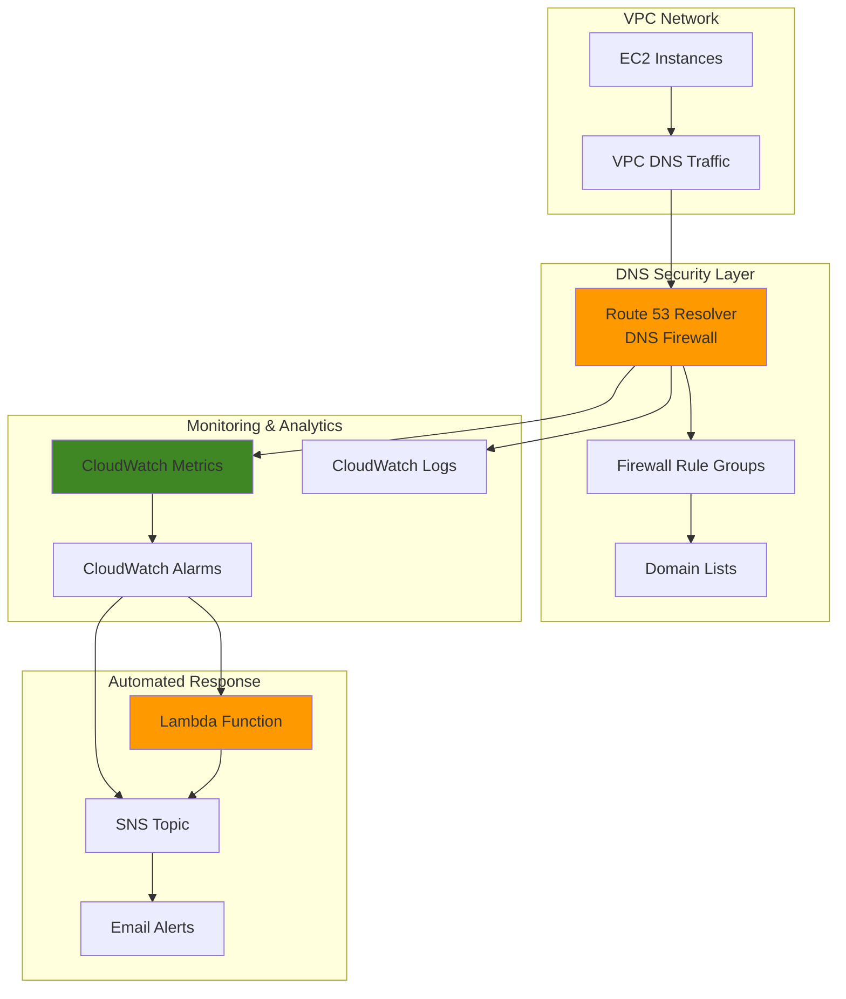

# Automated DNS Security Monitoring

## Problem

Organizations face increasing DNS-based security threats including domain generation algorithms (DGA), DNS tunneling, and malicious domain access that traditional blocklists cannot catch. Without automated monitoring and response capabilities, security teams struggle to detect suspicious DNS patterns in real-time, leaving networks vulnerable to command-and-control communications and data exfiltration attempts that use DNS as a covert channel.

## Solution

Build a comprehensive DNS security monitoring solution using Route 53 Resolver DNS Firewall for threat filtering, CloudWatch for metrics analysis and alerting, and Lambda for automated response actions. This architecture provides proactive DNS threat detection with real-time monitoring capabilities that automatically identify suspicious domain access patterns and trigger remediation workflows through SNS notifications.

## Architecture Diagram



## Prerequisites

1. AWS account with appropriate permissions for Route 53 Resolver, CloudWatch, Lambda, and SNS
2. AWS CLI v2 installed and configured (or AWS CloudShell)
3. Existing VPC with EC2 instances for testing DNS queries
4. Basic knowledge of DNS security concepts and threat detection
5. Estimated cost: $15-25/month for moderate DNS traffic volumes (includes firewall rules, CloudWatch metrics, Lambda executions, and SNS notifications)

> **Note**: Route 53 Resolver DNS Firewall charges are based on the number of VPCs associated with rule groups and DNS queries processed. Review the [Route 53 pricing page](https://aws.amazon.com/route53/pricing/) for detailed cost information.

## Preparation

```bash
# Set environment variables
export AWS_REGION=$(aws configure get region)
export AWS_ACCOUNT_ID=$(aws sts get-caller-identity \
    --query Account --output text)

# Generate unique identifiers for resources
RANDOM_SUFFIX=$(aws secretsmanager get-random-password \
    --exclude-punctuation --exclude-uppercase \
    --password-length 6 --require-each-included-type \
    --output text --query RandomPassword)

export VPC_ID=$(aws ec2 describe-vpcs \
    --filters "Name=is-default,Values=true" \
    --query "Vpcs[0].VpcId" --output text)

# Create foundational SNS topic for security alerts
aws sns create-topic \
    --name dns-security-alerts-${RANDOM_SUFFIX}

export SNS_TOPIC_ARN=$(aws sns list-topics \
    --query "Topics[?contains(TopicArn, 'dns-security-alerts-${RANDOM_SUFFIX}')].TopicArn" \
    --output text)

echo "✅ Preparation complete - VPC: ${VPC_ID}, SNS Topic: ${SNS_TOPIC_ARN}"
```

## Steps

1. **Create DNS Firewall Domain List for Malicious Domains**:

   Route 53 Resolver DNS Firewall uses domain lists to define which domains should be blocked or monitored. Creating a comprehensive domain list establishes the foundation for threat detection by including known malicious domains, suspicious TLDs, and patterns commonly associated with domain generation algorithms (DGA). This proactive approach helps protect against both known threats and emerging attack patterns.

   ```bash
   # Create DNS Firewall domain list for malicious domains
   aws route53resolver create-firewall-domain-list \
       --creator-request-id dns-security-${RANDOM_SUFFIX} \
       --name "malicious-domains-${RANDOM_SUFFIX}"
   
   export DOMAIN_LIST_ID=$(aws route53resolver list-firewall-domain-lists \
       --query "FirewallDomainLists[?Name=='malicious-domains-${RANDOM_SUFFIX}'].Id" \
       --output text)
   
   # Add sample malicious domains for demonstration
   aws route53resolver update-firewall-domains \
       --firewall-domain-list-id ${DOMAIN_LIST_ID} \
       --operation ADD \
       --domains malware.example suspicious.tk phishing.com \
           badactor.ru cryptominer.xyz botnet.info
   
   echo "✅ Domain list created with ID: ${DOMAIN_LIST_ID}"
   ```

   The domain list now contains sample malicious domains and serves as the security policy foundation. In production environments, you would populate this list with threat intelligence feeds, known bad domains from security vendors, and domains identified through your organization's incident response activities.

2. **Create DNS Firewall Rule Group with Security Rules**:

   DNS Firewall rule groups organize filtering rules and define actions for different threat categories. Creating a comprehensive rule group enables granular control over DNS security responses, allowing you to block high-confidence threats immediately while monitoring suspicious activity for analysis. This layered approach balances security effectiveness with operational requirements.

   ```bash
   # Create DNS Firewall rule group
   aws route53resolver create-firewall-rule-group \
       --creator-request-id rule-group-${RANDOM_SUFFIX} \
       --name "dns-security-rules-${RANDOM_SUFFIX}"
   
   export RULE_GROUP_ID=$(aws route53resolver list-firewall-rule-groups \
       --query "FirewallRuleGroups[?Name=='dns-security-rules-${RANDOM_SUFFIX}'].Id" \
       --output text)
   
   # Create blocking rule for confirmed malicious domains
   aws route53resolver create-firewall-rule \
       --name "block-malicious-domains" \
       --firewall-rule-group-id ${RULE_GROUP_ID} \
       --firewall-domain-list-id ${DOMAIN_LIST_ID} \
       --priority 100 \
       --action BLOCK \
       --block-response NXDOMAIN
   
   echo "✅ DNS Firewall rule group created: ${RULE_GROUP_ID}"
   ```

   The rule group is now configured with blocking capabilities for malicious domains. The NXDOMAIN response makes blocked queries appear as non-existent domains, preventing applications from falling back to alternative resolution methods while maintaining compatibility with standard DNS behavior.

3. **Associate Firewall Rule Group with VPC**:

   Associating the DNS Firewall rule group with your VPC enables real-time DNS query filtering for all resources within that network. This integration creates a security perimeter at the DNS layer, ensuring that all outbound DNS queries from EC2 instances, Lambda functions, and other VPC resources are evaluated against your security policies before resolution.

   ```bash
   # Associate DNS Firewall rule group with VPC
   aws route53resolver associate-firewall-rule-group \
       --name "vpc-dns-security-${RANDOM_SUFFIX}" \
       --firewall-rule-group-id ${RULE_GROUP_ID} \
       --vpc-id ${VPC_ID} \
       --priority 101
   
   export ASSOCIATION_ID=$(aws route53resolver list-firewall-rule-group-associations \
       --query "FirewallRuleGroupAssociations[?VpcId=='${VPC_ID}'].Id" \
       --output text)
   
   echo "✅ DNS Firewall associated with VPC: ${ASSOCIATION_ID}"
   ```

   DNS traffic from your VPC is now protected by the firewall rules. The association enables all DNS queries from resources in this VPC to be evaluated against your security policies before resolution occurs.

4. **Create CloudWatch Log Group for DNS Query Analysis**:

   CloudWatch Logs provides centralized storage and analysis capabilities for DNS query data generated by Route 53 Resolver. Creating a dedicated log group with appropriate retention policies ensures comprehensive logging while managing storage costs. This logging foundation enables both real-time monitoring and historical analysis of DNS security events.

   ```bash
   # Create CloudWatch log group for DNS queries
   aws logs create-log-group \
       --log-group-name "/aws/route53resolver/dns-security-${RANDOM_SUFFIX}" \
       --retention-in-days 30
   
   # Create log stream for current monitoring
   aws logs create-log-stream \
       --log-group-name "/aws/route53resolver/dns-security-${RANDOM_SUFFIX}" \
       --log-stream-name "dns-firewall-queries-$(date +%Y%m%d)"
   
   export LOG_GROUP_NAME="/aws/route53resolver/dns-security-${RANDOM_SUFFIX}"
   
   echo "✅ CloudWatch log group created: ${LOG_GROUP_NAME}"
   ```

   The log group is now ready to receive DNS query data with 30-day retention. This retention period balances security analysis needs with cost optimization, providing sufficient time for incident investigation while automatically managing log lifecycle.

5. **Enable DNS Query Logging Configuration**:

   Query logging provides detailed visibility into all DNS queries processed by Route 53 Resolver, including information about blocked queries and firewall actions. This comprehensive logging enables security teams to identify attack patterns, tune rules based on actual traffic, and conduct forensic analysis when security incidents occur.

   ```bash
   # Create query log configuration for DNS monitoring
   aws route53resolver put-resolver-query-log-config \
       --name "dns-security-logs-${RANDOM_SUFFIX}" \
       --destination-arn "arn:aws:logs:${AWS_REGION}:${AWS_ACCOUNT_ID}:log-group:${LOG_GROUP_NAME}"
   
   export QUERY_LOG_CONFIG_ID=$(aws route53resolver list-resolver-query-log-configs \
       --query "ResolverQueryLogConfigs[?Name=='dns-security-logs-${RANDOM_SUFFIX}'].Id" \
       --output text)
   
   # Associate query logging with VPC
   aws route53resolver associate-resolver-query-log-config \
       --resolver-query-log-config-id ${QUERY_LOG_CONFIG_ID} \
       --resource-id ${VPC_ID}
   
   echo "✅ DNS query logging enabled for VPC: ${VPC_ID}"
   ```

   DNS query logging is now active for your VPC, providing detailed audit trails of all DNS activity including blocked queries and security events. This enables comprehensive forensic analysis and helps identify patterns in DNS-based attacks.

6. **Create Lambda Function for Automated Threat Response**:

   AWS Lambda enables automated response to DNS security events, providing immediate remediation capabilities that scale automatically with threat volume. The Lambda function processes CloudWatch alarms and executes predefined response actions such as updating security groups, notifying administrators, or triggering additional security workflows based on detected threats.

   ```bash
   # Create Lambda execution role
   aws iam create-role \
       --role-name dns-security-lambda-role-${RANDOM_SUFFIX} \
       --assume-role-policy-document '{
           "Version": "2012-10-17",
           "Statement": [
               {
                   "Effect": "Allow",
                   "Principal": {
                       "Service": "lambda.amazonaws.com"
                   },
                   "Action": "sts:AssumeRole"
               }
           ]
       }'
   
   # Attach basic Lambda execution policy
   aws iam attach-role-policy \
       --role-name dns-security-lambda-role-${RANDOM_SUFFIX} \
       --policy-arn arn:aws:iam::aws:policy/service-role/AWSLambdaBasicExecutionRole
   
   # Create DNS security response function
   cat > dns-security-function.py << 'EOF'
import json
import boto3
import logging
from datetime import datetime

logger = logging.getLogger()
logger.setLevel(logging.INFO)

sns = boto3.client('sns')
cloudwatch = boto3.client('cloudwatch')

def lambda_handler(event, context):
    try:
        # Parse CloudWatch alarm data
        message = json.loads(event['Records'][0]['Sns']['Message'])
        alarm_name = message['AlarmName']
        alarm_description = message['AlarmDescription']
        metric_name = message['Trigger']['MetricName']
        
        # Create detailed alert message
        alert_message = f"""
DNS Security Alert Triggered

Alarm: {alarm_name}
Description: {alarm_description}
Metric: {metric_name}
Timestamp: {datetime.now().isoformat()}
Account: {context.invoked_function_arn.split(':')[4]}
Region: {context.invoked_function_arn.split(':')[3]}

Recommended Actions:
1. Review DNS query logs for suspicious patterns
2. Investigate source IP addresses and instances
3. Update DNS Firewall rules if needed
4. Consider blocking additional domains or IP ranges

This alert was generated automatically by the DNS Security Monitoring system.
"""
        
        # Log the event for audit trail
        logger.info(f"DNS security event processed: {alarm_name}")
        
        return {
            'statusCode': 200,
            'body': json.dumps({
                'message': 'DNS security alert processed successfully',
                'alarm': alarm_name
            })
        }
        
    except Exception as e:
        logger.error(f"Error processing DNS security alert: {str(e)}")
        return {
            'statusCode': 500,
            'body': json.dumps({'error': str(e)})
        }
EOF
   
   # Package Lambda function
   zip dns-security-function.zip dns-security-function.py
   
   # Create Lambda function
   aws lambda create-function \
       --function-name dns-security-response-${RANDOM_SUFFIX} \
       --runtime python3.9 \
       --role arn:aws:iam::${AWS_ACCOUNT_ID}:role/dns-security-lambda-role-${RANDOM_SUFFIX} \
       --handler dns-security-function.lambda_handler \
       --zip-file fileb://dns-security-function.zip \
       --timeout 60 \
       --memory-size 256
   
   export LAMBDA_FUNCTION_ARN=$(aws lambda get-function \
       --function-name dns-security-response-${RANDOM_SUFFIX} \
       --query "Configuration.FunctionArn" --output text)
   
   echo "✅ Lambda function created: ${LAMBDA_FUNCTION_ARN}"
   ```

   The Lambda function is now deployed and ready to process DNS security alerts. This serverless approach ensures immediate response to threats while maintaining cost efficiency through pay-per-execution pricing and automatic scaling based on alert volume.

7. **Configure CloudWatch Alarms for DNS Threat Detection**:

   CloudWatch alarms monitor DNS Firewall metrics to detect suspicious activity patterns such as high block rates, unusual query volumes, or potential DGA traffic. These alarms provide early warning capabilities for security incidents and trigger automated response workflows through SNS and Lambda integration.

   ```bash
   # Create alarm for blocked DNS queries (potential attacks)
   aws cloudwatch put-metric-alarm \
       --alarm-name "DNS-High-Block-Rate-${RANDOM_SUFFIX}" \
       --alarm-description "High rate of blocked DNS queries detected" \
       --metric-name "QueryCount" \
       --namespace "AWS/Route53Resolver" \
       --statistic "Sum" \
       --period 300 \
       --threshold 50 \
       --comparison-operator "GreaterThanThreshold" \
       --evaluation-periods 2 \
       --alarm-actions ${SNS_TOPIC_ARN} \
       --dimensions Name=FirewallRuleGroupId,Value=${RULE_GROUP_ID}
   
   # Create alarm for unusual query volume patterns
   aws cloudwatch put-metric-alarm \
       --alarm-name "DNS-Unusual-Volume-${RANDOM_SUFFIX}" \
       --alarm-description "Unusual DNS query volume detected" \
       --metric-name "QueryCount" \
       --namespace "AWS/Route53Resolver" \
       --statistic "Sum" \
       --period 900 \
       --threshold 1000 \
       --comparison-operator "GreaterThanThreshold" \
       --evaluation-periods 1 \
       --alarm-actions ${SNS_TOPIC_ARN} \
       --dimensions Name=VpcId,Value=${VPC_ID}
   
   echo "✅ CloudWatch alarms configured for DNS threat detection"
   ```

   The alarms are now monitoring DNS activity for security threats with configurable thresholds. These metrics provide real-time visibility into potential attacks while minimizing false positives through statistical analysis and multiple evaluation periods.

8. **Set Up SNS Email Notifications for Security Alerts**:

   Amazon SNS provides reliable, scalable notification delivery for DNS security events, ensuring that security teams receive immediate alerts when threats are detected. Email notifications enable rapid response to security incidents while maintaining detailed audit trails for compliance and incident analysis.

   ```bash
   # Subscribe email address to SNS topic (replace with your email)
   read -p "Enter your email address for DNS security alerts: " EMAIL_ADDRESS
   
   aws sns subscribe \
       --topic-arn ${SNS_TOPIC_ARN} \
       --protocol email \
       --notification-endpoint ${EMAIL_ADDRESS}
   
   # Create subscription for Lambda function
   aws sns subscribe \
       --topic-arn ${SNS_TOPIC_ARN} \
       --protocol lambda \
       --notification-endpoint ${LAMBDA_FUNCTION_ARN}
   
   # Grant SNS permission to invoke Lambda function
   aws lambda add-permission \
       --function-name dns-security-response-${RANDOM_SUFFIX} \
       --statement-id allow-sns-invoke \
       --action lambda:InvokeFunction \
       --principal sns.amazonaws.com \
       --source-arn ${SNS_TOPIC_ARN}
   
   echo "✅ SNS notifications configured - check email for confirmation"
   echo "⚠️  You must confirm the email subscription to receive alerts"
   ```

   SNS is now configured to deliver DNS security alerts to both email recipients and the Lambda function. This dual notification approach ensures human awareness while enabling automated response capabilities for immediate threat mitigation.

## Validation & Testing

1. **Verify DNS Firewall Configuration**:

   ```bash
   # Check DNS Firewall rule group status
   aws route53resolver get-firewall-rule-group \
       --firewall-rule-group-id ${RULE_GROUP_ID}
   
   # Verify VPC association
   aws route53resolver list-firewall-rule-group-associations \
       --query "FirewallRuleGroupAssociations[?VpcId=='${VPC_ID}']"
   ```

   Expected output: Rule group status should be "COMPLETE" and association status should be "COMPLETE"

2. **Test DNS Firewall Blocking Functionality**:

   ```bash
   # Test from an EC2 instance in the protected VPC
   # This should be blocked and return NXDOMAIN
   dig malware.example
   
   # Verify blocking in CloudWatch metrics
   aws cloudwatch get-metric-statistics \
       --namespace "AWS/Route53Resolver" \
       --metric-name "QueryCount" \
       --start-time $(date -u -d '10 minutes ago' +%Y-%m-%dT%H:%M:%S) \
       --end-time $(date -u +%Y-%m-%dT%H:%M:%S) \
       --period 300 \
       --statistics Sum \
       --dimensions Name=FirewallRuleGroupId,Value=${RULE_GROUP_ID}
   ```

   Expected output: DNS queries to blocked domains should fail with NXDOMAIN response

3. **Validate CloudWatch Alarms and Notifications**:

   ```bash
   # Check alarm status
   aws cloudwatch describe-alarms \
       --alarm-names "DNS-High-Block-Rate-${RANDOM_SUFFIX}"
   
   # Test SNS topic
   aws sns publish \
       --topic-arn ${SNS_TOPIC_ARN} \
       --message "Test DNS security alert notification"
   ```

   Expected output: Alarms should be in "OK" state, test message should be delivered to email

4. **Monitor DNS Query Logs**:

   ```bash
   # Check recent DNS query logs
   aws logs filter-log-events \
       --log-group-name ${LOG_GROUP_NAME} \
       --start-time $(date -d '1 hour ago' +%s)000 \
       --filter-pattern "BLOCK"
   ```

   Expected output: Blocked queries should appear in logs with detailed information

## Cleanup

1. **Remove DNS Query Logging Configuration**:

   ```bash
   # Get query log association ID
   export QUERY_LOG_ASSOCIATION_ID=$(aws route53resolver list-resolver-query-log-config-associations \
       --query "ResolverQueryLogConfigAssociations[?ResourceId=='${VPC_ID}'].Id" \
       --output text)
   
   # Disassociate query logging from VPC
   aws route53resolver disassociate-resolver-query-log-config \
       --resolver-query-log-config-association-id ${QUERY_LOG_ASSOCIATION_ID}
   
   # Wait for disassociation to complete
   sleep 30
   
   # Delete query log configuration
   aws route53resolver delete-resolver-query-log-config \
       --resolver-query-log-config-id ${QUERY_LOG_CONFIG_ID}
   
   echo "✅ DNS query logging configuration deleted"
   ```

2. **Remove CloudWatch Alarms**:

   ```bash
   # Delete CloudWatch alarms
   aws cloudwatch delete-alarms \
       --alarm-names "DNS-High-Block-Rate-${RANDOM_SUFFIX}" \
           "DNS-Unusual-Volume-${RANDOM_SUFFIX}"
   
   echo "✅ CloudWatch alarms deleted"
   ```

3. **Remove Lambda Function and IAM Role**:

   ```bash
   # Delete Lambda function
   aws lambda delete-function \
       --function-name dns-security-response-${RANDOM_SUFFIX}
   
   # Detach and delete IAM role
   aws iam detach-role-policy \
       --role-name dns-security-lambda-role-${RANDOM_SUFFIX} \
       --policy-arn arn:aws:iam::aws:policy/service-role/AWSLambdaBasicExecutionRole
   
   aws iam delete-role \
       --role-name dns-security-lambda-role-${RANDOM_SUFFIX}
   
   # Clean up local files
   rm -f dns-security-function.py dns-security-function.zip
   
   echo "✅ Lambda resources deleted"
   ```

4. **Remove DNS Firewall Configuration**:

   ```bash
   # Disassociate firewall rule group from VPC
   aws route53resolver disassociate-firewall-rule-group \
       --firewall-rule-group-association-id ${ASSOCIATION_ID}
   
   # Wait for disassociation to complete
   sleep 60
   
   # List and delete all firewall rules in the rule group
   RULE_IDS=$(aws route53resolver list-firewall-rules \
       --firewall-rule-group-id ${RULE_GROUP_ID} \
       --query "FirewallRules[].Name" --output text)
   
   for rule_name in $RULE_IDS; do
       aws route53resolver delete-firewall-rule \
           --firewall-rule-group-id ${RULE_GROUP_ID} \
           --name ${rule_name}
   done
   
   # Delete rule group and domain list
   aws route53resolver delete-firewall-rule-group \
       --firewall-rule-group-id ${RULE_GROUP_ID}
   
   aws route53resolver delete-firewall-domain-list \
       --firewall-domain-list-id ${DOMAIN_LIST_ID}
   
   echo "✅ DNS Firewall resources deleted"
   ```

5. **Remove Logging and Notification Resources**:

   ```bash
   # Delete CloudWatch log group
   aws logs delete-log-group \
       --log-group-name ${LOG_GROUP_NAME}
   
   # Delete SNS topic
   aws sns delete-topic \
       --topic-arn ${SNS_TOPIC_ARN}
   
   echo "✅ Logging and notification resources deleted"
   ```

## Discussion

This DNS security monitoring solution demonstrates the power of combining AWS native services to create a comprehensive threat detection and response system. Route 53 Resolver DNS Firewall provides the first line of defense against DNS-based attacks, while CloudWatch delivers the monitoring and alerting capabilities necessary for security operations. The integration with Lambda enables automated response workflows that can scale to handle high-volume security events without manual intervention.

The architecture follows AWS Well-Architected Framework security principles by implementing defense in depth, automated monitoring, and incident response capabilities. For detailed security guidance, refer to the [AWS Security Pillar](https://docs.aws.amazon.com/wellarchitected/latest/security-pillar/welcome.html) and [Route 53 Resolver DNS Firewall documentation](https://docs.aws.amazon.com/Route53/latest/DeveloperGuide/resolver-dns-firewall.html). The use of CloudWatch for metrics and logging provides the observability foundation recommended in the [Operational Excellence Pillar](https://docs.aws.amazon.com/wellarchitected/latest/operational-excellence-pillar/welcome.html).

DNS security threats have evolved beyond traditional domain blocklists to include sophisticated attacks such as domain generation algorithms (DGA) and DNS tunneling. This solution provides a foundation for detecting these advanced threats through comprehensive logging and metrics analysis. For enhanced threat detection capabilities, consider integrating with AWS Security Hub for centralized security findings management, as detailed in the [Security Hub documentation](https://docs.aws.amazon.com/securityhub/latest/userguide/what-is-securityhub.html).

From a cost optimization perspective, this solution leverages serverless technologies and pay-per-use pricing models to deliver enterprise-grade security capabilities without the overhead of traditional security appliances. CloudWatch metrics retention and Lambda execution costs scale with actual usage, while SNS provides reliable notification delivery at minimal cost. For detailed cost analysis, consult the [AWS pricing documentation](https://aws.amazon.com/pricing/) for each service component and implement CloudWatch billing alarms to monitor usage patterns.

> **Tip**: Implement log analysis automation using CloudWatch Insights queries to identify patterns in DNS traffic and continuously improve your threat detection rules. The [CloudWatch Logs Insights documentation](https://docs.aws.amazon.com/AmazonCloudWatch/latest/logs/AnalyzingLogData.html) provides query examples for security analysis and pattern recognition.

## Challenge

Extend this DNS security monitoring solution by implementing these enhancements:

1. **Automated Threat Intelligence Integration**: Build Lambda functions that automatically update DNS Firewall domain lists with threat intelligence feeds from security vendors and open source threat databases, ensuring your protection remains current against emerging threats.

2. **Advanced Analytics with Amazon OpenSearch**: Deploy OpenSearch Service to perform complex analysis of DNS query patterns, enabling detection of sophisticated attack campaigns and providing security teams with rich visualization and search capabilities for incident investigation.

3. **Machine Learning-Based Anomaly Detection**: Implement Amazon SageMaker models that analyze DNS query patterns to identify anomalous behavior that might indicate compromised instances or insider threats, going beyond rule-based detection to behavioral analysis.

4. **Multi-Account Security Orchestration**: Extend the solution across multiple AWS accounts using AWS Organizations and AWS Security Hub, providing centralized DNS security monitoring and response capabilities for enterprise environments with complex account structures.

5. **Integration with AWS WAF and Shield**: Connect DNS security events with AWS WAF rules and Shield Advanced protections, creating a comprehensive security ecosystem that correlates DNS threats with application-layer attacks for enhanced threat context and response automation.

## Infrastructure Code

*Infrastructure code will be generated after recipe approval.*