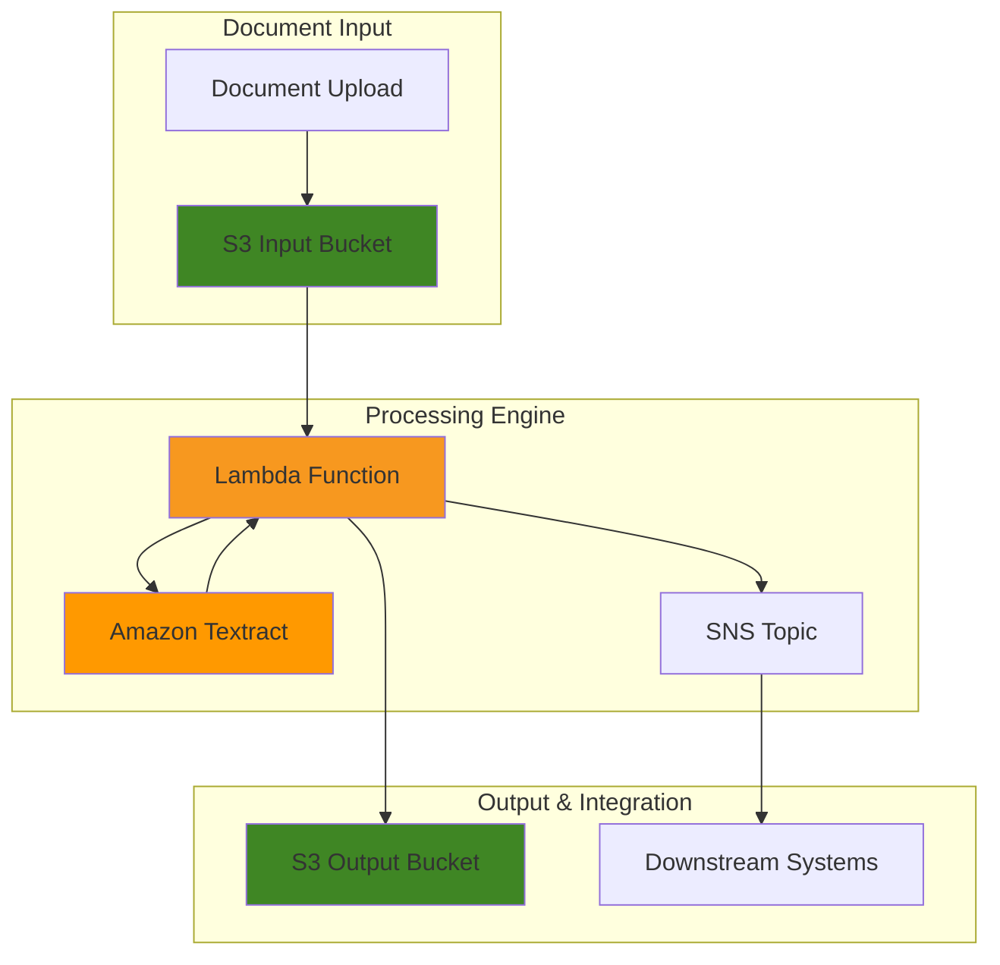

# Creating Document Analysis Solutions with Amazon Textract

## Problem

Financial services organizations process thousands of documents daily, including loan applications, insurance claims, and compliance reports. Manual document processing is time-consuming, error-prone, and costs organizations up to $30,000 per employee annually. Traditional optical character recognition (OCR) solutions struggle with complex layouts, handwritten text, and structured data extraction from forms and tables, resulting in processing delays and accuracy issues that impact business decisions.

## Solution

Amazon Textract provides machine learning-powered document analysis that automatically extracts text, forms, and tables from documents with high accuracy. This solution demonstrates building an intelligent document processing pipeline using event-driven architecture that can handle various document types, extract structured data, and integrate with downstream business processes through automated workflows and real-time notifications.

## Architecture Diagram



## Prerequisites

1. AWS account with appropriate permissions for Textract, S3, Lambda, and SNS services
2. AWS CLI v2 installed and configured (or AWS CloudShell access)
3. Basic understanding of document processing and OCR concepts
4. Familiarity with JSON data structures and event-driven architectures
5. Estimated cost: $10-25 for processing 1,000 document pages (varies by feature usage)

> **Note**: Amazon Textract pricing as of 2025: Text detection costs $0.0015 per page, while analyze document with forms costs $0.05 per page, tables cost $0.015 per page, and queries cost $0.015 per page. Processing with multiple features combines the costs.

## Preparation

```bash
# Set environment variables
export AWS_REGION=$(aws configure get region)
export AWS_ACCOUNT_ID=$(aws sts get-caller-identity \
    --query Account --output text)

# Generate unique identifiers for resources
RANDOM_SUFFIX=$(aws secretsmanager get-random-password \
    --exclude-punctuation --exclude-uppercase \
    --password-length 6 --require-each-included-type \
    --output text --query RandomPassword)

export BUCKET_INPUT="textract-input-${RANDOM_SUFFIX}"
export BUCKET_OUTPUT="textract-output-${RANDOM_SUFFIX}"
export LAMBDA_FUNCTION="textract-processor-${RANDOM_SUFFIX}"
export SNS_TOPIC="textract-notifications-${RANDOM_SUFFIX}"
export IAM_ROLE="textract-lambda-role-${RANDOM_SUFFIX}"

# Create S3 buckets for input and output
aws s3 mb s3://${BUCKET_INPUT} --region ${AWS_REGION}
aws s3 mb s3://${BUCKET_OUTPUT} --region ${AWS_REGION}

# Enable S3 bucket versioning for audit trail
aws s3api put-bucket-versioning \
    --bucket ${BUCKET_INPUT} \
    --versioning-configuration Status=Enabled

aws s3api put-bucket-versioning \
    --bucket ${BUCKET_OUTPUT} \
    --versioning-configuration Status=Enabled

echo "✅ Created S3 buckets: ${BUCKET_INPUT} and ${BUCKET_OUTPUT}"
```

## Steps

1. **Create IAM Role for Lambda Function**:

   IAM roles enable secure, temporary credential delegation without hardcoding access keys in your application code. This security foundation follows AWS best practices by implementing the principle of least privilege, ensuring your Lambda function can only access the specific AWS services required for document processing. The role establishes trust relationships between AWS services and defines precise permissions for Textract analysis, S3 storage operations, and SNS notifications, creating a secure processing environment that meets enterprise security requirements.

   ```bash
   # Create trust policy for Lambda service
   cat > trust-policy.json << EOF
   {
       "Version": "2012-10-17",
       "Statement": [
           {
               "Effect": "Allow",
               "Principal": {
                   "Service": "lambda.amazonaws.com"
               },
               "Action": "sts:AssumeRole"
           }
       ]
   }
   EOF
   
   # Create IAM role with trust policy
   aws iam create-role \
       --role-name ${IAM_ROLE} \
       --assume-role-policy-document file://trust-policy.json
   
   # Attach AWS managed policies for Lambda execution
   aws iam attach-role-policy \
       --role-name ${IAM_ROLE} \
       --policy-arn arn:aws:iam::aws:policy/service-role/AWSLambdaBasicExecutionRole
   
   aws iam attach-role-policy \
       --role-name ${IAM_ROLE} \
       --policy-arn arn:aws:iam::aws:policy/AmazonTextractFullAccess
   
   # Create custom policy for S3 and SNS access
   cat > lambda-policy.json << EOF
   {
       "Version": "2012-10-17",
       "Statement": [
           {
               "Effect": "Allow",
               "Action": [
                   "s3:GetObject",
                   "s3:PutObject",
                   "s3:DeleteObject"
               ],
               "Resource": [
                   "arn:aws:s3:::${BUCKET_INPUT}/*",
                   "arn:aws:s3:::${BUCKET_OUTPUT}/*"
               ]
           },
           {
               "Effect": "Allow",
               "Action": [
                   "sns:Publish"
               ],
               "Resource": "arn:aws:sns:${AWS_REGION}:${AWS_ACCOUNT_ID}:${SNS_TOPIC}"
           }
       ]
   }
   EOF
   
   # Apply custom policy to the role
   aws iam put-role-policy \
       --role-name ${IAM_ROLE} \
       --policy-name CustomTextractPolicy \
       --policy-document file://lambda-policy.json
   
   echo "✅ Created IAM role: ${IAM_ROLE}"
   ```

2. **Create SNS Topic for Notifications**:

   Amazon SNS provides a fully managed pub/sub messaging service that enables real-time notifications about document processing completion and errors. This integration creates operational visibility into the document analysis pipeline, allowing downstream systems to react immediately to processing events. SNS supports multiple protocol types including email, SMS, SQS, and HTTP endpoints, making it ideal for integrating with existing business workflows and monitoring systems.

   ```bash
   # Create SNS topic for processing notifications
   aws sns create-topic --name ${SNS_TOPIC}
   
   # Get topic ARN for use in Lambda environment variables
   export SNS_TOPIC_ARN=$(aws sns get-topic-attributes \
       --topic-arn arn:aws:sns:${AWS_REGION}:${AWS_ACCOUNT_ID}:${SNS_TOPIC} \
       --query 'Attributes.TopicArn' --output text)
   
   # Optional: Subscribe your email for notifications
   # Uncomment and replace with your email address
   # aws sns subscribe \
   #     --topic-arn ${SNS_TOPIC_ARN} \
   #     --protocol email \
   #     --notification-endpoint your-email@example.com
   
   echo "✅ Created SNS topic: ${SNS_TOPIC}"
   ```

3. **Create Lambda Function for Document Processing**:

   AWS Lambda provides serverless compute that automatically scales based on document processing demand, eliminating the need for server management and capacity planning. This function serves as the core processing engine that orchestrates Textract analysis, handles various document formats, and manages the complete document lifecycle from ingestion to output storage. The serverless architecture ensures cost-effective processing with pay-per-execution pricing and automatic scaling from zero to thousands of concurrent document processing requests, making it ideal for variable document processing workloads.

   ```bash
   # Create Lambda function code with comprehensive error handling
   cat > textract_processor.py << 'EOF'
   import json
   import boto3
   import os
   from datetime import datetime
   import logging
   from botocore.exceptions import ClientError
   
   # Configure logging
   logger = logging.getLogger()
   logger.setLevel(logging.INFO)
   
   # Initialize AWS service clients
   textract = boto3.client('textract')
   s3 = boto3.client('s3')
   sns = boto3.client('sns')
   
   def lambda_handler(event, context):
       """
       Main Lambda handler for processing documents with Amazon Textract
       """
       try:
           # Parse S3 event notification
           s3_event = event['Records'][0]['s3']
           bucket_name = s3_event['bucket']['name']
           object_key = s3_event['object']['key']
           
           logger.info(f"Processing document: {object_key} from bucket: {bucket_name}")
           
           # Validate file type (PDF, PNG, JPG, TIFF supported)
           if not is_supported_file_type(object_key):
               raise ValueError(f"Unsupported file type: {object_key}")
           
           # Analyze document with Textract using multiple features
           response = textract.analyze_document(
               Document={
                   'S3Object': {
                       'Bucket': bucket_name,
                       'Name': object_key
                   }
               },
               FeatureTypes=['TABLES', 'FORMS', 'QUERIES'],
               QueriesConfig={
                   'Queries': [
                       {'Text': 'What is the document type?'},
                       {'Text': 'What is the total amount?'},
                       {'Text': 'What is the date?'},
                       {'Text': 'Who is the document addressed to?'}
                   ]
               }
           )
           
           # Extract and structure the analysis results
           extracted_data = {
               'document_name': object_key,
               'processed_at': datetime.now().isoformat(),
               'source_bucket': bucket_name,
               'blocks': response['Blocks'],
               'document_metadata': response['DocumentMetadata'],
               'processing_status': 'SUCCESS'
           }
           
           # Save processed results to output bucket
           output_key = f"processed/{object_key.split('/')[-1]}.json"
           s3.put_object(
               Bucket=os.environ['OUTPUT_BUCKET'],
               Key=output_key,
               Body=json.dumps(extracted_data, indent=2),
               ContentType='application/json',
               ServerSideEncryption='AES256'
           )
           
           # Send success notification via SNS
           success_message = {
               'status': 'SUCCESS',
               'document': object_key,
               'output_location': f"s3://{os.environ['OUTPUT_BUCKET']}/{output_key}",
               'pages_processed': response['DocumentMetadata'].get('Pages', 1),
               'timestamp': datetime.now().isoformat()
           }
           
           sns.publish(
               TopicArn=os.environ['SNS_TOPIC_ARN'],
               Message=json.dumps(success_message, indent=2),
               Subject='Textract Processing Complete'
           )
           
           logger.info(f"Successfully processed document: {object_key}")
           
           return {
               'statusCode': 200,
               'body': json.dumps({
                   'message': 'Document processed successfully',
                   'output_location': f"s3://{os.environ['OUTPUT_BUCKET']}/{output_key}",
                   'pages_processed': response['DocumentMetadata'].get('Pages', 1)
               })
           }
           
       except ClientError as e:
           error_code = e.response['Error']['Code']
           error_message = e.response['Error']['Message']
           logger.error(f"AWS service error: {error_code} - {error_message}")
           
           # Send error notification
           send_error_notification(object_key, f"AWS Error: {error_code} - {error_message}")
           
           return {
               'statusCode': 500,
               'body': json.dumps({
                   'error': f"AWS service error: {error_code}",
                   'message': error_message
               })
           }
           
       except Exception as e:
           logger.error(f"Unexpected error processing document: {str(e)}")
           
           # Send error notification for unexpected errors
           send_error_notification(object_key, f"Processing error: {str(e)}")
           
           return {
               'statusCode': 500,
               'body': json.dumps({
                   'error': 'Processing failed',
                   'message': str(e)
               })
           }
   
   def is_supported_file_type(file_key):
       """Check if the file type is supported by Textract"""
       supported_extensions = ['.pdf', '.png', '.jpg', '.jpeg', '.tiff', '.tif']
       return any(file_key.lower().endswith(ext) for ext in supported_extensions)
   
   def send_error_notification(document_name, error_details):
       """Send error notification via SNS"""
       try:
           error_message = {
               'status': 'ERROR',
               'document': document_name,
               'error': error_details,
               'timestamp': datetime.now().isoformat()
           }
           
           sns.publish(
               TopicArn=os.environ['SNS_TOPIC_ARN'],
               Message=json.dumps(error_message, indent=2),
               Subject='Textract Processing Error'
           )
       except Exception as notification_error:
           logger.error(f"Failed to send error notification: {notification_error}")
   EOF
   
   # Create deployment package
   zip textract_processor.zip textract_processor.py
   
   # Wait for IAM role propagation
   sleep 10
   
   # Create Lambda function with enhanced configuration
   aws lambda create-function \
       --function-name ${LAMBDA_FUNCTION} \
       --runtime python3.11 \
       --role arn:aws:iam::${AWS_ACCOUNT_ID}:role/${IAM_ROLE} \
       --handler textract_processor.lambda_handler \
       --zip-file fileb://textract_processor.zip \
       --timeout 300 \
       --memory-size 1024 \
       --environment Variables="{OUTPUT_BUCKET=${BUCKET_OUTPUT},SNS_TOPIC_ARN=${SNS_TOPIC_ARN}}" \
       --description "Processes documents using Amazon Textract"
   
   echo "✅ Created Lambda function: ${LAMBDA_FUNCTION}"
   ```

4. **Configure S3 Event Notification**:

   S3 event notifications create an event-driven architecture that automatically triggers document processing when files are uploaded, eliminating the need for manual intervention or batch processing schedules. This real-time processing capability ensures documents are analyzed immediately upon arrival, reducing processing latency and enabling faster business decision-making. The event-driven pattern scales seamlessly with document volume and provides a foundation for building responsive, automated document workflows that can handle thousands of documents per hour.

   ```bash
   # Wait for Lambda function to be fully created
   sleep 30
   
   # Get Lambda function ARN for S3 notification configuration
   export LAMBDA_ARN=$(aws lambda get-function \
       --function-name ${LAMBDA_FUNCTION} \
       --query 'Configuration.FunctionArn' --output text)
   
   # Add permission for S3 service to invoke Lambda function
   aws lambda add-permission \
       --function-name ${LAMBDA_FUNCTION} \
       --principal s3.amazonaws.com \
       --action lambda:InvokeFunction \
       --source-arn arn:aws:s3:::${BUCKET_INPUT} \
       --statement-id s3-invoke-permission
   
   # Create S3 notification configuration for multiple file types
   cat > notification-config.json << EOF
   {
       "LambdaConfigurations": [
           {
               "Id": "textract-processor-trigger",
               "LambdaFunctionArn": "${LAMBDA_ARN}",
               "Events": ["s3:ObjectCreated:*"],
               "Filter": {
                   "Key": {
                       "FilterRules": [
                           {
                               "Name": "suffix",
                               "Value": ".pdf"
                           }
                       ]
                   }
               }
           },
           {
               "Id": "textract-processor-trigger-png",
               "LambdaFunctionArn": "${LAMBDA_ARN}",
               "Events": ["s3:ObjectCreated:*"],
               "Filter": {
                   "Key": {
                       "FilterRules": [
                           {
                               "Name": "suffix",
                               "Value": ".png"
                           }
                       ]
                   }
               }
           }
       ]
   }
   EOF
   
   # Configure S3 bucket notifications
   aws s3api put-bucket-notification-configuration \
       --bucket ${BUCKET_INPUT} \
       --notification-configuration file://notification-config.json
   
   echo "✅ Configured S3 event notifications for PDF and PNG files"
   ```

5. **Create Sample Documents for Testing**:

   Testing with representative document samples validates the complete processing pipeline and ensures Textract can handle your specific document types and formats. This validation step is crucial for understanding extraction accuracy, processing performance, and identifying any format-specific optimizations needed before deploying to production. Sample documents help establish confidence baselines and validate the integration between S3 triggers, Lambda processing, and Textract analysis, providing insights into real-world processing capabilities.

   ```bash
   # Create a sample invoice document for testing
   cat > sample-invoice.txt << 'EOF'
   INVOICE

   Invoice Number: INV-2025-001
   Date: 2025-01-15
   Due Date: 2025-02-15

   Bill To:
   Acme Corporation
   123 Business Street
   Enterprise City, ST 12345

   Service Description           Quantity    Unit Price      Total
   Document Processing Service        100        $0.50      $50.00
   Data Analysis Consultation          5       $150.00     $750.00
   System Integration Support          8        $200.00   $1,600.00

   Subtotal:                                              $2,400.00
   Tax (8.5%):                                             $204.00
   Total Amount Due:                                     $2,604.00

   Payment Terms: Net 30 days
   Thank you for your business!
   EOF
   
   # Create a sample form document
   cat > sample-form.txt << 'EOF'
   APPLICATION FORM

   Personal Information:
   Name: John Smith
   Email: john.smith@example.com
   Phone: (555) 123-4567
   Address: 456 Main Avenue, Hometown, CA 90210

   Application Details:
   Application Type: Business License
   Business Name: Smith Consulting LLC
   Industry: Technology Consulting
   Expected Revenue: $500,000
   Number of Employees: 5

   Signature: ________________    Date: 2025-01-15
   EOF
   
   echo "✅ Created sample documents for testing"
   ```

6. **Test Document Processing Pipeline**:

   End-to-end testing validates the complete document processing workflow from upload to analysis completion, ensuring all components work together seamlessly. This testing phase verifies the S3 event trigger activation, Lambda function execution, Textract analysis accuracy, and result storage in the output bucket. Successful processing confirms the architecture is ready for production workloads and provides baseline performance metrics for monitoring and optimization of the document processing pipeline.

   ```bash
   # Upload sample documents to trigger processing
   aws s3 cp sample-invoice.txt s3://${BUCKET_INPUT}/test-documents/invoice.pdf
   aws s3 cp sample-form.txt s3://${BUCKET_INPUT}/test-documents/form.pdf
   
   echo "✅ Uploaded sample documents for processing"
   
   # Wait for processing to complete
   echo "Waiting for document processing to complete..."
   sleep 60
   
   # Check if processed results are available
   echo "Checking for processed results..."
   aws s3 ls s3://${BUCKET_OUTPUT}/processed/ --recursive
   ```

7. **Monitor Processing with CloudWatch Logs**:

   CloudWatch Logs provides comprehensive observability into your document processing pipeline, enabling real-time monitoring of Lambda function execution, error tracking, and performance analysis. This monitoring capability is essential for production operations, helping identify processing bottlenecks, track success rates, and diagnose issues quickly. Effective logging and monitoring ensure reliable document processing and provide the visibility needed for continuous optimization and troubleshooting in enterprise environments.

   ```bash
   # Get the log group name for the Lambda function
   LOG_GROUP="/aws/lambda/${LAMBDA_FUNCTION}"
   
   # Check if log group exists and get recent log streams
   aws logs describe-log-groups \
       --log-group-name-prefix ${LOG_GROUP} \
       --query 'logGroups[0].logGroupName' --output text
   
   # Get the most recent log stream
   LATEST_STREAM=$(aws logs describe-log-streams \
       --log-group-name ${LOG_GROUP} \
       --order-by LastEventTime \
       --descending \
       --max-items 1 \
       --query 'logStreams[0].logStreamName' --output text)
   
   # Display recent log events
   if [ "$LATEST_STREAM" != "None" ]; then
       aws logs get-log-events \
           --log-group-name ${LOG_GROUP} \
           --log-stream-name ${LATEST_STREAM} \
           --limit 20 \
           --query 'events[*].[timestamp,message]' \
           --output table
   fi
   
   echo "✅ Check CloudWatch logs for detailed processing information"
   ```

8. **Validate Textract Analysis Results**:

   Validating analysis results ensures the extracted data meets quality standards and business requirements for downstream processing. This validation step includes checking confidence scores, verifying extracted key-value pairs, and ensuring table data is properly structured. Understanding result quality helps establish processing thresholds and identify documents that may require manual review, ensuring reliable automated workflows.

   ```bash
   # Download and examine a processed document
   PROCESSED_FILES=$(aws s3 ls s3://${BUCKET_OUTPUT}/processed/ --recursive \
       --query 'Contents[?contains(Key, `json`)].[Key]' --output text)
   
   if [ -n "$PROCESSED_FILES" ]; then
       # Get the first processed file
       FIRST_FILE=$(echo "$PROCESSED_FILES" | head -n 1)
       
       # Download the processed result
       aws s3 cp s3://${BUCKET_OUTPUT}/${FIRST_FILE} processed-result.json
       
       # Extract key information using jq (if available)
       if command -v jq &> /dev/null; then
           echo "Document processing summary:"
           echo "Processing timestamp: $(jq -r '.processed_at' processed-result.json)"
           echo "Pages processed: $(jq -r '.document_metadata.Pages' processed-result.json)"
           echo "Total blocks detected: $(jq '.blocks | length' processed-result.json)"
       else
           echo "✅ Downloaded processed result: processed-result.json"
           echo "Install 'jq' command for JSON parsing or examine the file manually"
       fi
   else
       echo "No processed files found yet. Check processing status."
   fi
   ```

9. **Test Query-based Data Extraction**:

   Query-based extraction demonstrates Textract's advanced capability to extract specific information from documents using natural language questions. This feature enables targeted data retrieval without complex parsing logic, making it ideal for extracting business-critical information like amounts, dates, and names from various document types. Testing queries validates the accuracy of information extraction and helps optimize query formulation for production use.

   ```bash
   # Test specific document queries directly with Textract
   if aws s3 ls s3://${BUCKET_INPUT}/test-documents/invoice.pdf &>/dev/null; then
       echo "Testing query-based extraction on invoice document..."
       
       aws textract analyze-document \
           --document "{\"S3Object\":{\"Bucket\":\"${BUCKET_INPUT}\",\"Name\":\"test-documents/invoice.pdf\"}}" \
           --feature-types '["QUERIES"]' \
           --queries-config '{
               "Queries": [
                   {"Text": "What is the total amount?"},
                   {"Text": "What is the invoice number?"},
                   {"Text": "Who is the bill to?"},
                   {"Text": "What is the due date?"}
               ]
           }' \
           --query 'Blocks[?BlockType==`QUERY_RESULT`].[Query.Text,Text]' \
           --output table
       
       echo "✅ Completed query-based extraction test"
   else
       echo "Invoice document not found. Upload a document first."
   fi
   ```

10. **Set Up Processing Analytics Dashboard**:

    A comprehensive analytics capability provides operational visibility into document processing performance, accuracy metrics, and business insights extracted from processed documents. This monitoring and reporting functionality enables data-driven optimization of processing workflows, identification of document quality issues, and measurement of business value delivered through automated document analysis. The analytics serve as a foundation for continuous improvement and scaling decisions.

    ```bash
    # Create analysis script for processing metrics
    cat > analyze_processing_metrics.py << 'EOF'
    import json
    import boto3
    from collections import defaultdict
    from datetime import datetime
    import statistics
    
    s3 = boto3.client('s3')
    
    def analyze_processing_results(bucket_name, prefix='processed/'):
        """Analyze all processed documents and generate metrics"""
        
        try:
            # List all processed files
            response = s3.list_objects_v2(Bucket=bucket_name, Prefix=prefix)
            
            if 'Contents' not in response:
                print("No processed documents found")
                return None
            
            # Initialize analysis metrics
            metrics = {
                'total_documents': 0,
                'total_pages': 0,
                'processing_dates': [],
                'confidence_scores': [],
                'document_types': defaultdict(int),
                'processing_errors': 0,
                'average_blocks_per_document': 0
            }
            
            total_blocks = 0
            
            # Analyze each processed document
            for obj in response['Contents']:
                if obj['Key'].endswith('.json'):
                    try:
                        # Download and parse document data
                        result = s3.get_object(Bucket=bucket_name, Key=obj['Key'])
                        data = json.loads(result['Body'].read())
                        
                        metrics['total_documents'] += 1
                        
                        # Extract document metadata
                        if 'document_metadata' in data:
                            pages = data['document_metadata'].get('Pages', 1)
                            metrics['total_pages'] += pages
                        
                        # Process blocks and calculate confidence
                        blocks = data.get('blocks', [])
                        total_blocks += len(blocks)
                        
                        # Calculate document confidence scores
                        doc_confidences = [
                            block.get('Confidence', 0) 
                            for block in blocks 
                            if 'Confidence' in block and block.get('Confidence', 0) > 0
                        ]
                        
                        if doc_confidences:
                            avg_confidence = statistics.mean(doc_confidences)
                            metrics['confidence_scores'].append(avg_confidence)
                        
                        # Track processing timestamp
                        if 'processed_at' in data:
                            metrics['processing_dates'].append(data['processed_at'])
                        
                        # Identify document type based on content
                        document_type = classify_document_type(blocks)
                        metrics['document_types'][document_type] += 1
                        
                    except Exception as e:
                        metrics['processing_errors'] += 1
                        print(f"Error processing {obj['Key']}: {e}")
            
            # Calculate derived metrics
            if metrics['total_documents'] > 0:
                metrics['average_blocks_per_document'] = total_blocks / metrics['total_documents']
                
                if metrics['confidence_scores']:
                    metrics['average_confidence'] = statistics.mean(metrics['confidence_scores'])
                    metrics['min_confidence'] = min(metrics['confidence_scores'])
                    metrics['max_confidence'] = max(metrics['confidence_scores'])
                else:
                    metrics['average_confidence'] = 0
                    metrics['min_confidence'] = 0
                    metrics['max_confidence'] = 0
            
            return metrics
            
        except Exception as e:
            print(f"Error analyzing processing results: {e}")
            return None
    
    def classify_document_type(blocks):
        """Simple document classification based on detected text"""
        text_content = " ".join([
            block.get('Text', '').lower() 
            for block in blocks 
            if block.get('BlockType') == 'LINE' and 'Text' in block
        ])
        
        if 'invoice' in text_content or 'bill to' in text_content:
            return 'invoice'
        elif 'application' in text_content or 'form' in text_content:
            return 'form'
        elif 'contract' in text_content or 'agreement' in text_content:
            return 'contract'
        else:
            return 'general_document'
    
    def print_metrics_report(metrics):
        """Print formatted metrics report"""
        if not metrics:
            print("No metrics available")
            return
        
        print("\n" + "="*50)
        print("DOCUMENT PROCESSING ANALYTICS REPORT")
        print("="*50)
        
        print(f"\nProcessing Volume:")
        print(f"  Total Documents Processed: {metrics['total_documents']}")
        print(f"  Total Pages Processed: {metrics['total_pages']}")
        print(f"  Processing Errors: {metrics['processing_errors']}")
        
        print(f"\nQuality Metrics:")
        print(f"  Average Confidence Score: {metrics.get('average_confidence', 0):.2f}%")
        print(f"  Min Confidence: {metrics.get('min_confidence', 0):.2f}%")
        print(f"  Max Confidence: {metrics.get('max_confidence', 0):.2f}%")
        print(f"  Average Blocks per Document: {metrics['average_blocks_per_document']:.1f}")
        
        print(f"\nDocument Types:")
        for doc_type, count in metrics['document_types'].items():
            print(f"  {doc_type.replace('_', ' ').title()}: {count}")
        
        if metrics['processing_dates']:
            print(f"\nProcessing Timeline:")
            print(f"  First Processed: {metrics['processing_dates'][0]}")
            print(f"  Last Processed: {metrics['processing_dates'][-1]}")
        
        print("\n" + "="*50)
    
    if __name__ == "__main__":
        import sys
        if len(sys.argv) > 1:
            bucket = sys.argv[1]
            metrics = analyze_processing_results(bucket)
            print_metrics_report(metrics)
        else:
            print("Usage: python analyze_processing_metrics.py <output-bucket-name>")
    EOF
    
    # Make the analysis script executable
    chmod +x analyze_processing_metrics.py
    
    echo "✅ Created document processing analytics script"
    ```

## Validation & Testing

1. **Verify Document Processing Pipeline**:

   ```bash
   # Check processed documents in output bucket
   aws s3 ls s3://${BUCKET_OUTPUT}/processed/ --recursive
   
   # Verify document processing completed successfully
   PROCESSED_COUNT=$(aws s3 ls s3://${BUCKET_OUTPUT}/processed/ \
       --recursive | grep -c ".json" || echo 0)
   
   echo "Total processed documents: ${PROCESSED_COUNT}"
   
   # Download first processed document for inspection
   FIRST_PROCESSED=$(aws s3 ls s3://${BUCKET_OUTPUT}/processed/ \
       --recursive | head -n 1 | awk '{print $4}')
   
   if [ -n "$FIRST_PROCESSED" ]; then
       aws s3 cp s3://${BUCKET_OUTPUT}/${FIRST_PROCESSED} \
           sample-processed-result.json
       echo "✅ Downloaded sample result: sample-processed-result.json"
   fi
   ```

2. **Test Processing Performance**:

   ```bash
   # Check Lambda function performance metrics
   aws cloudwatch get-metric-statistics \
       --namespace AWS/Lambda \
       --metric-name Duration \
       --dimensions Name=FunctionName,Value=${LAMBDA_FUNCTION} \
       --start-time $(date -u -d '1 hour ago' +%Y-%m-%dT%H:%M:%S) \
       --end-time $(date -u +%Y-%m-%dT%H:%M:%S) \
       --period 300 \
       --statistics Average,Maximum \
       --query 'Datapoints[*].[Timestamp,Average,Maximum]' \
       --output table
   
   # Check for any Lambda errors
   aws cloudwatch get-metric-statistics \
       --namespace AWS/Lambda \
       --metric-name Errors \
       --dimensions Name=FunctionName,Value=${LAMBDA_FUNCTION} \
       --start-time $(date -u -d '1 hour ago' +%Y-%m-%dT%H:%M:%S) \
       --end-time $(date -u +%Y-%m-%dT%H:%M:%S) \
       --period 300 \
       --statistics Sum \
       --query 'Datapoints[*].[Timestamp,Sum]' \
       --output table
   
   echo "✅ Retrieved Lambda performance metrics"
   ```

3. **Validate Textract Feature Extraction**:

   ```bash
   # Test comprehensive feature extraction
   if aws s3 ls s3://${BUCKET_INPUT}/test-documents/invoice.pdf &>/dev/null; then
       echo "Testing comprehensive Textract features..."
       
       # Test forms and tables extraction
       aws textract analyze-document \
           --document "{\"S3Object\":{\"Bucket\":\"${BUCKET_INPUT}\",\"Name\":\"test-documents/invoice.pdf\"}}" \
           --feature-types '["FORMS", "TABLES", "QUERIES"]' \
           --queries-config '{
               "Queries": [
                   {"Text": "What is the invoice total?"},
                   {"Text": "What is the tax amount?"}
               ]
           }' \
           --query 'DocumentMetadata' \
           --output json
       
       echo "✅ Tested comprehensive feature extraction"
   fi
   ```

4. **Run Processing Analytics**:

   ```bash
   # Run the analytics script if Python is available
   if command -v python3 &> /dev/null; then
       echo "Generating processing analytics report..."
       python3 analyze_processing_metrics.py ${BUCKET_OUTPUT}
   else
       echo "Python3 not available. Install Python to run analytics."
   fi
   
   echo "✅ Analytics validation completed"
   ```

## Cleanup

1. **Remove Lambda Function and IAM Resources**:

   ```bash
   # Delete Lambda function
   aws lambda delete-function --function-name ${LAMBDA_FUNCTION}
   
   # Detach managed policies from IAM role
   aws iam detach-role-policy \
       --role-name ${IAM_ROLE} \
       --policy-arn arn:aws:iam::aws:policy/service-role/AWSLambdaBasicExecutionRole
   
   aws iam detach-role-policy \
       --role-name ${IAM_ROLE} \
       --policy-arn arn:aws:iam::aws:policy/AmazonTextractFullAccess
   
   # Delete custom policy and IAM role
   aws iam delete-role-policy \
       --role-name ${IAM_ROLE} \
       --policy-name CustomTextractPolicy
   
   aws iam delete-role --role-name ${IAM_ROLE}
   
   echo "✅ Deleted Lambda function and IAM resources"
   ```

2. **Remove SNS Topic and Subscriptions**:

   ```bash
   # Delete SNS topic (this also removes all subscriptions)
   aws sns delete-topic --topic-arn ${SNS_TOPIC_ARN}
   
   echo "✅ Deleted SNS topic and subscriptions"
   ```

3. **Remove S3 Buckets and Contents**:

   ```bash
   # Empty S3 buckets completely (including versioned objects)
   aws s3api delete-objects \
       --bucket ${BUCKET_INPUT} \
       --delete "$(aws s3api list-object-versions \
           --bucket ${BUCKET_INPUT} \
           --query '{Objects: Versions[].{Key:Key,VersionId:VersionId}}')"
   
   aws s3api delete-objects \
       --bucket ${BUCKET_OUTPUT} \
       --delete "$(aws s3api list-object-versions \
           --bucket ${BUCKET_OUTPUT} \
           --query '{Objects: Versions[].{Key:Key,VersionId:VersionId}}')"
   
   # Remove remaining objects and delete buckets
   aws s3 rm s3://${BUCKET_INPUT} --recursive
   aws s3 rb s3://${BUCKET_INPUT}
   
   aws s3 rm s3://${BUCKET_OUTPUT} --recursive
   aws s3 rb s3://${BUCKET_OUTPUT}
   
   echo "✅ Deleted S3 buckets and all contents"
   ```

4. **Clean Up Local Files and Environment**:

   ```bash
   # Remove all local configuration and temporary files
   rm -f trust-policy.json lambda-policy.json notification-config.json
   rm -f textract_processor.py textract_processor.zip
   rm -f sample-invoice.txt sample-form.txt
   rm -f analyze_processing_metrics.py
   rm -f processed-result.json sample-processed-result.json
   
   # Clean up environment variables
   unset BUCKET_INPUT BUCKET_OUTPUT LAMBDA_FUNCTION SNS_TOPIC IAM_ROLE
   unset SNS_TOPIC_ARN LAMBDA_ARN RANDOM_SUFFIX
   
   echo "✅ Cleaned up local files and environment variables"
   ```

## Discussion

Amazon Textract transforms document processing by leveraging advanced machine learning models to extract text, forms, and tables with high accuracy. Unlike traditional OCR solutions, Textract understands document structure and context, making it ideal for processing financial documents, medical records, and legal forms where precision is critical. The service uses [pre-trained machine learning models](https://docs.aws.amazon.com/textract/latest/dg/what-is.html) that can identify and extract data from complex document layouts without requiring custom training or configuration, enabling organizations to automate document-intensive workflows immediately.

The solution architecture demonstrates several key patterns for production document processing following AWS Well-Architected Framework principles. The event-driven design using S3 triggers implements [serverless event-driven architectures](https://docs.aws.amazon.com/lambda/latest/dg/lambda-services.html) that scale automatically with document volume. The Lambda function provides cost-effective serverless compute that adjusts processing capacity based on demand, while SNS integration enables real-time notifications and downstream system integration. This architecture pattern supports both high-volume batch processing and real-time document analysis scenarios.

Key advantages include cost-effectiveness through pay-per-use pricing (processing costs only when documents are analyzed), horizontal scalability (handles document volumes from hundreds to millions without infrastructure changes), and high accuracy through machine learning models trained on diverse document types. The solution supports synchronous processing for real-time applications and asynchronous processing for batch workloads. For optimal results, follow [Amazon Textract best practices](https://docs.aws.amazon.com/textract/latest/dg/textract-best-practices.html) including document quality optimization, appropriate feature selection, and confidence score validation for production workflows.

> **Tip**: For high-volume document processing exceeding 1,000 documents per hour, consider implementing Amazon Textract's asynchronous operations with SQS and Step Functions for better cost optimization and throughput handling as described in the [asynchronous processing documentation](https://docs.aws.amazon.com/textract/latest/dg/async.html).

## Challenge

Extend this solution by implementing these enhancements:

1. **Multi-format Document Support**: Add support for additional document formats (DOCX, TIFF, JPEG) and implement format-specific processing logic with different Textract feature configurations based on document type detection.

2. **Custom Document Classification**: Integrate Amazon Comprehend to automatically classify documents by type (invoices, contracts, forms, receipts) and route them to specialized processing workflows with type-specific extraction rules.

3. **Data Validation and Quality Assurance**: Implement confidence score thresholds, data validation rules, and human review workflows for low-confidence extractions using Amazon A2I (Augmented AI) for quality control.

4. **Real-time Processing Dashboard**: Build a comprehensive web dashboard using Amazon QuickSight and API Gateway to visualize processing metrics, document types, extraction accuracy trends, and operational insights over time.

5. **Advanced Table Processing with Database Integration**: Implement complex table analysis with relationship detection, header identification, data normalization, and direct integration with Amazon RDS or DynamoDB for structured data storage and querying.

## Infrastructure Code

### Available Infrastructure as Code:

- [Infrastructure Code Overview](code/README.md) - Detailed description of all infrastructure components
- [AWS CDK (Python)](code/cdk-python/) - AWS CDK Python implementation
- [AWS CDK (TypeScript)](code/cdk-typescript/) - AWS CDK TypeScript implementation
- [CloudFormation](code/cloudformation.yaml) - AWS CloudFormation template
- [Bash CLI Scripts](code/scripts/) - Example bash scripts using AWS CLI commands to deploy infrastructure
- [Terraform](code/terraform/) - Terraform configuration files