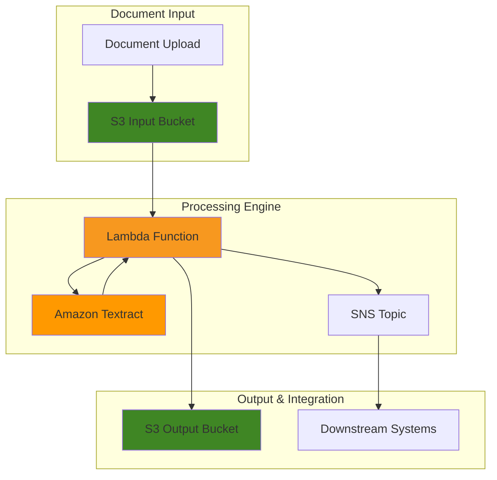

# Creating Document Analysis Solutions with Amazon Textract


## Problem

Financial services organizations process thousands of documents daily, including loan applications, insurance claims, and compliance reports. Manual document processing is time-consuming, error-prone, and costs organizations up to $30,000 per employee annually. Traditional optical character recognition (OCR) solutions struggle with complex layouts, handwritten text, and structured data extraction from forms and tables.

## Solution

Amazon Textract provides machine learning-powered document analysis that automatically extracts text, forms, and tables from documents. This solution demonstrates building an intelligent document processing pipeline that can handle various document types, extract structured data, and integrate with downstream business processes through automated workflows.

## Architecture Diagram



## Prerequisites

1. AWS account with appropriate permissions for Textract, S3, Lambda, and SNS
2. AWS CLI v2 installed and configured (or AWS CloudShell)
3. Basic understanding of document processing and OCR concepts
4. Familiarity with JSON data structures
5. Estimated cost: $5-15 for processing 1,000 document pages (varies by feature usage)

> **Note**: Amazon Textract charges per page processed. Text detection costs $0.0015 per page, while form/table analysis costs $0.015-0.05 per page depending on features used.

## Preparation

```bash
# Set environment variables
export AWS_REGION=$(aws configure get region)
export AWS_ACCOUNT_ID=$(aws sts get-caller-identity \
    --query Account --output text)

# Generate unique identifiers for resources
RANDOM_SUFFIX=$(aws secretsmanager get-random-password \
    --exclude-punctuation --exclude-uppercase \
    --password-length 6 --require-each-included-type \
    --output text --query RandomPassword)

export BUCKET_INPUT="textract-input-${RANDOM_SUFFIX}"
export BUCKET_OUTPUT="textract-output-${RANDOM_SUFFIX}"
export LAMBDA_FUNCTION="textract-processor-${RANDOM_SUFFIX}"
export SNS_TOPIC="textract-notifications-${RANDOM_SUFFIX}"
export IAM_ROLE="textract-lambda-role-${RANDOM_SUFFIX}"

# Create S3 buckets for input and output
aws s3 mb s3://${BUCKET_INPUT} --region ${AWS_REGION}
aws s3 mb s3://${BUCKET_OUTPUT} --region ${AWS_REGION}

echo "✅ Created S3 buckets: ${BUCKET_INPUT} and ${BUCKET_OUTPUT}"
```

## Steps

1. **Create IAM Role for Lambda Function**:

   IAM roles enable secure, temporary credential delegation without hardcoding access keys in your application code. This security foundation follows AWS best practices by implementing the principle of least privilege, ensuring your Lambda function can only access the specific AWS services required for document processing. The role establishes trust relationships between AWS services and defines precise permissions for Textract analysis, S3 storage operations, and SNS notifications.

   ```bash
   # Create trust policy for Lambda
   cat > trust-policy.json << EOF
   {
       "Version": "2012-10-17",
       "Statement": [
           {
               "Effect": "Allow",
               "Principal": {
                   "Service": "lambda.amazonaws.com"
               },
               "Action": "sts:AssumeRole"
           }
       ]
   }
   EOF
   
   # Create IAM role
   aws iam create-role \
       --role-name ${IAM_ROLE} \
       --assume-role-policy-document file://trust-policy.json
   
   # Attach managed policies
   aws iam attach-role-policy \
       --role-name ${IAM_ROLE} \
       --policy-arn arn:aws:iam::aws:policy/service-role/AWSLambdaBasicExecutionRole
   
   aws iam attach-role-policy \
       --role-name ${IAM_ROLE} \
       --policy-arn arn:aws:iam::aws:policy/AmazonTextractFullAccess
   
   # Create custom policy for S3 and SNS access
   cat > lambda-policy.json << EOF
   {
       "Version": "2012-10-17",
       "Statement": [
           {
               "Effect": "Allow",
               "Action": [
                   "s3:GetObject",
                   "s3:PutObject",
                   "s3:DeleteObject"
               ],
               "Resource": [
                   "arn:aws:s3:::${BUCKET_INPUT}/*",
                   "arn:aws:s3:::${BUCKET_OUTPUT}/*"
               ]
           },
           {
               "Effect": "Allow",
               "Action": [
                   "sns:Publish"
               ],
               "Resource": "arn:aws:sns:${AWS_REGION}:${AWS_ACCOUNT_ID}:${SNS_TOPIC}"
           }
       ]
   }
   EOF
   
   aws iam put-role-policy \
       --role-name ${IAM_ROLE} \
       --policy-name CustomTextractPolicy \
       --policy-document file://lambda-policy.json
   
   echo "✅ Created IAM role: ${IAM_ROLE}"
   ```

2. **Create SNS Topic for Notifications**:

   The SNS topic provides real-time notifications about document processing completion and errors. This enables integration with downstream systems and provides operational visibility into the document analysis pipeline.

   ```bash
   # Create SNS topic
   aws sns create-topic --name ${SNS_TOPIC}
   
   # Get topic ARN
   export SNS_TOPIC_ARN=$(aws sns get-topic-attributes \
       --topic-arn arn:aws:sns:${AWS_REGION}:${AWS_ACCOUNT_ID}:${SNS_TOPIC} \
       --query 'Attributes.TopicArn' --output text)
   
   # Subscribe your email (optional - replace with your email)
   # aws sns subscribe \
   #     --topic-arn ${SNS_TOPIC_ARN} \
   #     --protocol email \
   #     --notification-endpoint your-email@example.com
   
   echo "✅ Created SNS topic: ${SNS_TOPIC}"
   ```

3. **Create Lambda Function for Document Processing**:

   AWS Lambda provides serverless compute that automatically scales based on document processing demand, eliminating the need for server management and capacity planning. This function serves as the core processing engine that orchestrates Textract analysis, handles various document formats, and manages the complete document lifecycle from ingestion to output storage. The serverless architecture ensures cost-effective processing with pay-per-execution pricing and automatic scaling from zero to thousands of concurrent document processing requests.

   ```bash
   # Create Lambda function code
   cat > textract_processor.py << 'EOF'
   import json
   import boto3
   import os
   from datetime import datetime
   
   textract = boto3.client('textract')
   s3 = boto3.client('s3')
   sns = boto3.client('sns')
   
   def lambda_handler(event, context):
       try:
           # Parse S3 event
           s3_event = event['Records'][0]['s3']
           bucket_name = s3_event['bucket']['name']
           object_key = s3_event['object']['key']
           
           print(f"Processing document: {object_key} from bucket: {bucket_name}")
           
           # Analyze document with Textract
           response = textract.analyze_document(
               Document={
                   'S3Object': {
                       'Bucket': bucket_name,
                       'Name': object_key
                   }
               },
               FeatureTypes=['TABLES', 'FORMS', 'QUERIES'],
               QueriesConfig={
                   'Queries': [
                       {'Text': 'What is the document type?'},
                       {'Text': 'What is the total amount?'},
                       {'Text': 'What is the date?'}
                   ]
               }
           )
           
           # Extract structured data
           extracted_data = {
               'document_name': object_key,
               'processed_at': datetime.now().isoformat(),
               'blocks': response['Blocks'],
               'document_metadata': response['DocumentMetadata']
           }
           
           # Save results to output bucket
           output_key = f"processed/{object_key.split('/')[-1]}.json"
           s3.put_object(
               Bucket=os.environ['OUTPUT_BUCKET'],
               Key=output_key,
               Body=json.dumps(extracted_data, indent=2),
               ContentType='application/json'
           )
           
           # Send notification
           message = f"Document processed successfully: {object_key}"
           sns.publish(
               TopicArn=os.environ['SNS_TOPIC_ARN'],
               Message=message,
               Subject='Textract Processing Complete'
           )
           
           return {
               'statusCode': 200,
               'body': json.dumps({
                   'message': 'Document processed successfully',
                   'output_location': f"s3://{os.environ['OUTPUT_BUCKET']}/{output_key}"
               })
           }
           
       except Exception as e:
           print(f"Error processing document: {str(e)}")
           
           # Send error notification
           error_message = f"Error processing {object_key}: {str(e)}"
           sns.publish(
               TopicArn=os.environ['SNS_TOPIC_ARN'],
               Message=error_message,
               Subject='Textract Processing Error'
           )
           
           return {
               'statusCode': 500,
               'body': json.dumps({
                   'error': str(e)
               })
           }
   EOF
   
   # Create deployment package
   zip textract_processor.zip textract_processor.py
   
   # Create Lambda function
   aws lambda create-function \
       --function-name ${LAMBDA_FUNCTION} \
       --runtime python3.9 \
       --role arn:aws:iam::${AWS_ACCOUNT_ID}:role/${IAM_ROLE} \
       --handler textract_processor.lambda_handler \
       --zip-file fileb://textract_processor.zip \
       --timeout 300 \
       --memory-size 512 \
       --environment Variables="{OUTPUT_BUCKET=${BUCKET_OUTPUT},SNS_TOPIC_ARN=${SNS_TOPIC_ARN}}"
   
   echo "✅ Created Lambda function: ${LAMBDA_FUNCTION}"
   ```

4. **Configure S3 Event Notification**:

   S3 event notifications create an event-driven architecture that automatically triggers document processing when files are uploaded, eliminating the need for manual intervention or batch processing schedules. This real-time processing capability ensures documents are analyzed immediately upon arrival, reducing processing latency and enabling faster business decision-making. The event-driven pattern scales seamlessly with document volume and provides a foundation for building responsive, automated document workflows.

   ```bash
   # Wait for IAM role to propagate
   sleep 30
   
   # Get Lambda function ARN
   export LAMBDA_ARN=$(aws lambda get-function \
       --function-name ${LAMBDA_FUNCTION} \
       --query 'Configuration.FunctionArn' --output text)
   
   # Add permission for S3 to invoke Lambda
   aws lambda add-permission \
       --function-name ${LAMBDA_FUNCTION} \
       --principal s3.amazonaws.com \
       --action lambda:InvokeFunction \
       --source-arn arn:aws:s3:::${BUCKET_INPUT} \
       --statement-id s3-invoke-permission
   
   # Create S3 notification configuration
   cat > notification-config.json << EOF
   {
       "LambdaConfigurations": [
           {
               "Id": "textract-processor-trigger",
               "LambdaFunctionArn": "${LAMBDA_ARN}",
               "Events": ["s3:ObjectCreated:*"],
               "Filter": {
                   "Key": {
                       "FilterRules": [
                           {
                               "Name": "suffix",
                               "Value": ".pdf"
                           }
                       ]
                   }
               }
           }
       ]
   }
   EOF
   
   # Configure S3 event notification
   aws s3api put-bucket-notification-configuration \
       --bucket ${BUCKET_INPUT} \
       --notification-configuration file://notification-config.json
   
   echo "✅ Configured S3 event notification for PDF files"
   ```

5. **Create Sample Documents for Testing**:

   Testing with representative document samples validates the complete processing pipeline and ensures Textract can handle your specific document types and formats. This validation step is crucial for understanding extraction accuracy, processing performance, and identifying any format-specific optimizations needed before deploying to production. Sample documents help establish confidence baselines and validate the integration between S3 triggers, Lambda processing, and Textract analysis.

   ```bash
   # Download sample documents for testing
   curl -o sample-form.pdf \
       "https://www.w3.org/WAI/ER/tests/xhtml/testfiles/resources/pdf/dummy.pdf"
   
   # Create a simple text file to convert to PDF (if curl fails)
   if [ ! -f sample-form.pdf ]; then
       echo "Sample Document
       Name: John Doe
       Date: $(date +%Y-%m-%d)
       Amount: $1,234.56
       
       This is a sample document for testing Amazon Textract
       document analysis capabilities." > sample-document.txt
       
       echo "✅ Created sample text document for testing"
   fi
   ```

6. **Test Document Processing**:

   End-to-end testing validates the complete document processing workflow from upload to analysis completion, ensuring all components work together seamlessly. This testing phase verifies the S3 event trigger activation, Lambda function execution, Textract analysis accuracy, and result storage in the output bucket. Successful processing confirms the architecture is ready for production workloads and provides baseline performance metrics for monitoring and optimization.

   ```bash
   # Upload test document to trigger processing
   if [ -f sample-form.pdf ]; then
       aws s3 cp sample-form.pdf s3://${BUCKET_INPUT}/test-documents/
       echo "✅ Uploaded PDF document for processing"
   else
       aws s3 cp sample-document.txt s3://${BUCKET_INPUT}/test-documents/sample.pdf
       echo "✅ Uploaded sample document for processing"
   fi
   
   # Wait for processing
   echo "Waiting for document processing..."
   sleep 45
   ```

7. **Monitor Processing with CloudWatch Logs**:

   CloudWatch Logs provides comprehensive observability into your document processing pipeline, enabling real-time monitoring of Lambda function execution, error tracking, and performance analysis. This monitoring capability is essential for production operations, helping identify processing bottlenecks, track success rates, and diagnose issues quickly. Effective logging and monitoring ensure reliable document processing and provide the visibility needed for continuous optimization and troubleshooting.

   ```bash
   # Check Lambda function logs
   aws logs describe-log-groups \
       --log-group-name-prefix /aws/lambda/${LAMBDA_FUNCTION} \
       --query 'logGroups[0].logGroupName' --output text
   
   # Get recent log events
   LOG_GROUP="/aws/lambda/${LAMBDA_FUNCTION}"
   aws logs describe-log-streams \
       --log-group-name ${LOG_GROUP} \
       --order-by LastEventTime \
       --descending \
       --max-items 1 \
       --query 'logStreams[0].logStreamName' --output text
   
   echo "✅ Check CloudWatch logs for processing details"
   ```

8. **Set Up Advanced Document Analysis**:

   Advanced document analysis capabilities enable sophisticated data extraction beyond basic text recognition, including form field relationships, table structure analysis, and query-based information retrieval. This enhanced processing layer transforms raw document content into structured business data, enabling automated workflow integration and intelligent document understanding. Advanced analysis provides the foundation for building intelligent document management systems that can automatically categorize, route, and process documents based on their content.

   ```bash
   # Create enhanced Lambda function for advanced analysis
   cat > enhanced_textract.py << 'EOF'
   import json
   import boto3
   import os
   from datetime import datetime
   
   textract = boto3.client('textract')
   s3 = boto3.client('s3')
   
   def extract_key_value_pairs(blocks):
       """Extract form key-value pairs from Textract blocks"""
       key_map = {}
       value_map = {}
       block_map = {}
       
       for block in blocks:
           block_id = block['Id']
           block_map[block_id] = block
           
           if block['BlockType'] == "KEY_VALUE_SET":
               if 'KEY' in block['EntityTypes']:
                   key_map[block_id] = block
               else:
                   value_map[block_id] = block
       
       key_value_pairs = {}
       for key_block_id, key_block in key_map.items():
           value_block = find_value_block(key_block, value_map)
           key = get_text(key_block, block_map)
           value = get_text(value_block, block_map) if value_block else ""
           key_value_pairs[key] = value
       
       return key_value_pairs
   
   def find_value_block(key_block, value_map):
       """Find the value block associated with a key block"""
       for relationship in key_block.get('Relationships', []):
           if relationship['Type'] == 'VALUE':
               for value_id in relationship['Ids']:
                   if value_id in value_map:
                       return value_map[value_id]
       return None
   
   def get_text(result, blocks_map):
       """Extract text from a block"""
       text = ''
       if 'Relationships' in result:
           for relationship in result['Relationships']:
               if relationship['Type'] == 'CHILD':
                   for child_id in relationship['Ids']:
                       word = blocks_map[child_id]
                       if word['BlockType'] == 'WORD':
                           text += word['Text'] + ' '
       return text.strip()
   
   def lambda_handler(event, context):
       # Your enhanced processing logic here
       return {'statusCode': 200, 'body': 'Enhanced processing complete'}
   EOF
   
   echo "✅ Created enhanced analysis function template"
   ```

9. **Implement Table Data Extraction**:

   Table data extraction transforms complex tabular information into structured, machine-readable formats that can be directly integrated with business systems and databases. This capability is essential for processing financial reports, invoices, and operational documents where tabular data contains critical business metrics. Accurate table extraction enables automated data validation, calculation verification, and seamless integration with downstream analytics and reporting systems.

   ```bash
   # Create table extraction utility
   cat > table_extractor.py << 'EOF'
   def extract_tables(blocks):
       """Extract table data from Textract blocks"""
       tables = []
       
       for block in blocks:
           if block['BlockType'] == 'TABLE':
               table_data = {
                   'table_id': block['Id'],
                   'rows': [],
                   'confidence': block.get('Confidence', 0)
               }
               
               # Extract table structure
               if 'Relationships' in block:
                   for relationship in block['Relationships']:
                       if relationship['Type'] == 'CHILD':
                           cell_blocks = get_cell_blocks(relationship['Ids'], blocks)
                           rows = organize_cells_into_rows(cell_blocks)
                           table_data['rows'] = rows
               
               tables.append(table_data)
       
       return tables
   
   def get_cell_blocks(cell_ids, blocks):
       """Get cell blocks by IDs"""
       block_map = {block['Id']: block for block in blocks}
       return [block_map[cell_id] for cell_id in cell_ids if cell_id in block_map]
   
   def organize_cells_into_rows(cell_blocks):
       """Organize cells into rows based on row index"""
       rows = {}
       
       for cell in cell_blocks:
           if cell['BlockType'] == 'CELL':
               row_index = cell['RowIndex']
               col_index = cell['ColumnIndex']
               
               if row_index not in rows:
                   rows[row_index] = {}
               
               rows[row_index][col_index] = get_cell_text(cell)
       
       # Convert to ordered list
       ordered_rows = []
       for row_index in sorted(rows.keys()):
           row_data = []
           for col_index in sorted(rows[row_index].keys()):
               row_data.append(rows[row_index][col_index])
           ordered_rows.append(row_data)
       
       return ordered_rows
   
   def get_cell_text(cell):
       """Extract text from a cell"""
       text = ''
       if 'Relationships' in cell:
           for relationship in cell['Relationships']:
               if relationship['Type'] == 'CHILD':
                   # Implementation for extracting text from child blocks
                   pass
       return text
   EOF
   
   echo "✅ Created table extraction utilities"
   ```

10. **Create Document Analysis Dashboard**:

    A comprehensive analytics dashboard provides operational visibility into document processing performance, accuracy metrics, and business insights extracted from processed documents. This monitoring and reporting capability enables data-driven optimization of processing workflows, identification of document quality issues, and measurement of business value delivered through automated document analysis. The dashboard serves as a central control point for managing document processing operations at scale.

    ```bash
    # Create a simple analysis script
    cat > analyze_results.py << 'EOF'
    import json
    import boto3
    from collections import defaultdict
    
    s3 = boto3.client('s3')
    
    def analyze_processing_results(bucket_name, prefix='processed/'):
        """Analyze all processed documents in the output bucket"""
        
        # List all processed files
        response = s3.list_objects_v2(Bucket=bucket_name, Prefix=prefix)
        
        if 'Contents' not in response:
            print("No processed documents found")
            return
        
        analysis_summary = {
            'total_documents': 0,
            'document_types': defaultdict(int),
            'average_confidence': 0,
            'processing_errors': 0
        }
        
        total_confidence = 0
        
        for obj in response['Contents']:
            if obj['Key'].endswith('.json'):
                # Download and analyze document
                result = s3.get_object(Bucket=bucket_name, Key=obj['Key'])
                data = json.loads(result['Body'].read())
                
                analysis_summary['total_documents'] += 1
                
                # Analyze document metadata
                if 'document_metadata' in data:
                    pages = data['document_metadata'].get('Pages', 0)
                    analysis_summary['total_pages'] = analysis_summary.get('total_pages', 0) + pages
                
                # Calculate average confidence
                blocks = data.get('blocks', [])
                doc_confidence = calculate_document_confidence(blocks)
                total_confidence += doc_confidence
        
        if analysis_summary['total_documents'] > 0:
            analysis_summary['average_confidence'] = total_confidence / analysis_summary['total_documents']
        
        return analysis_summary
    
    def calculate_document_confidence(blocks):
        """Calculate average confidence for a document"""
        confidences = [block.get('Confidence', 0) for block in blocks if 'Confidence' in block]
        return sum(confidences) / len(confidences) if confidences else 0
    
    if __name__ == "__main__":
        import sys
        if len(sys.argv) > 1:
            bucket = sys.argv[1]
            summary = analyze_processing_results(bucket)
            print(json.dumps(summary, indent=2))
        else:
            print("Usage: python analyze_results.py <output-bucket-name>")
    EOF
    
    echo "✅ Created document analysis dashboard script"
    ```

## Validation & Testing

1. **Verify Document Processing**:

   ```bash
   # Check processed documents in output bucket
   aws s3 ls s3://${BUCKET_OUTPUT}/processed/ --recursive
   
   # Download a processed document for inspection
   PROCESSED_FILE=$(aws s3 ls s3://${BUCKET_OUTPUT}/processed/ \
       --query 'Contents[0].Key' --output text)
   
   if [ "$PROCESSED_FILE" != "None" ]; then
       aws s3 cp s3://${BUCKET_OUTPUT}/${PROCESSED_FILE} \
           processed-result.json
       echo "✅ Downloaded processed document: processed-result.json"
   fi
   ```

2. **Test Different Document Types**:

   ```bash
   # Test with different file types (if available)
   echo "Testing document analysis with various formats..."
   
   # Create test invoice
   cat > test-invoice.txt << 'EOF'
   INVOICE
   
   Invoice Number: INV-2024-001
   Date: 2024-01-15
   Due Date: 2024-02-15
   
   Bill To:
   John Doe
   123 Main Street
   Anytown, ST 12345
   
   Description          Quantity    Unit Price    Total
   Consulting Services      10        $150.00    $1,500.00
   Software License          1        $500.00      $500.00
   
   Subtotal:                                    $2,000.00
   Tax (8%):                                      $160.00
   Total:                                       $2,160.00
   EOF
   
   # Upload test invoice
   aws s3 cp test-invoice.txt s3://${BUCKET_INPUT}/test-documents/invoice.pdf
   
   echo "✅ Uploaded test invoice for processing"
   ```

3. **Validate Lambda Function Performance**:

   ```bash
   # Check Lambda function metrics
   aws cloudwatch get-metric-statistics \
       --namespace AWS/Lambda \
       --metric-name Duration \
       --dimensions Name=FunctionName,Value=${LAMBDA_FUNCTION} \
       --start-time $(date -u -d '1 hour ago' +%Y-%m-%dT%H:%M:%S) \
       --end-time $(date -u +%Y-%m-%dT%H:%M:%S) \
       --period 300 \
       --statistics Average,Maximum \
       --query 'Datapoints[0].[Average,Maximum]' --output text
   
   echo "✅ Retrieved Lambda performance metrics"
   ```

4. **Test Query-based Extraction**:

   ```bash
   # Test specific document queries
   aws textract analyze-document \
       --document "{\"S3Object\":{\"Bucket\":\"${BUCKET_INPUT}\",\"Name\":\"test-documents/invoice.pdf\"}}" \
       --feature-types '["QUERIES"]' \
       --queries-config '{"Queries":[{"Text":"What is the total amount?"},{"Text":"What is the invoice number?"}]}' \
       --query 'Blocks[?BlockType==`QUERY_RESULT`].[Query.Text,Text]' \
       --output table
   
   echo "✅ Tested query-based data extraction"
   ```

## Cleanup

1. **Remove Lambda Function and Related Resources**:

   ```bash
   # Delete Lambda function
   aws lambda delete-function --function-name ${LAMBDA_FUNCTION}
   
   # Delete IAM role and policies
   aws iam detach-role-policy \
       --role-name ${IAM_ROLE} \
       --policy-arn arn:aws:iam::aws:policy/service-role/AWSLambdaBasicExecutionRole
   
   aws iam detach-role-policy \
       --role-name ${IAM_ROLE} \
       --policy-arn arn:aws:iam::aws:policy/AmazonTextractFullAccess
   
   aws iam delete-role-policy \
       --role-name ${IAM_ROLE} \
       --policy-name CustomTextractPolicy
   
   aws iam delete-role --role-name ${IAM_ROLE}
   
   echo "✅ Deleted Lambda function and IAM role"
   ```

2. **Remove SNS Topic**:

   ```bash
   # Delete SNS topic
   aws sns delete-topic --topic-arn ${SNS_TOPIC_ARN}
   
   echo "✅ Deleted SNS topic"
   ```

3. **Remove S3 Buckets and Contents**:

   ```bash
   # Empty and delete S3 buckets
   aws s3 rm s3://${BUCKET_INPUT} --recursive
   aws s3 rb s3://${BUCKET_INPUT}
   
   aws s3 rm s3://${BUCKET_OUTPUT} --recursive
   aws s3 rb s3://${BUCKET_OUTPUT}
   
   echo "✅ Deleted S3 buckets and contents"
   ```

4. **Clean Up Local Files**:

   ```bash
   # Remove local files
   rm -f trust-policy.json lambda-policy.json notification-config.json
   rm -f textract_processor.py textract_processor.zip
   rm -f enhanced_textract.py table_extractor.py analyze_results.py
   rm -f sample-form.pdf sample-document.txt test-invoice.txt
   rm -f processed-result.json
   
   # Clean up environment variables
   unset BUCKET_INPUT BUCKET_OUTPUT LAMBDA_FUNCTION SNS_TOPIC IAM_ROLE
   unset SNS_TOPIC_ARN LAMBDA_ARN
   
   echo "✅ Cleaned up local files and environment variables"
   ```

## Discussion

Amazon Textract transforms document processing by leveraging advanced machine learning models to extract text, forms, and tables with high accuracy. Unlike traditional OCR solutions, Textract understands document structure and context, making it ideal for processing financial documents, medical records, and legal forms where precision is critical. The service uses [pre-trained machine learning models](https://docs.aws.amazon.com/textract/latest/dg/what-is.html) that can identify and extract data from complex document layouts without requiring custom training or configuration.

The solution architecture demonstrates several key patterns for production document processing. The event-driven design using S3 triggers ensures automatic processing when documents are uploaded, implementing [event-driven architectures](https://docs.aws.amazon.com/lambda/latest/dg/concepts-event-driven-architectures.html) that scale seamlessly with document volume. The Lambda function provides serverless scalability that adjusts to document volume, while the integration with SNS enables real-time notifications and downstream system integration, creating a complete document processing pipeline.

Key advantages of this approach include cost-effectiveness (pay-per-use pricing), scalability (handles document volumes from hundreds to millions), and accuracy (machine learning models trained on diverse document types). The solution supports both synchronous processing for real-time applications and asynchronous processing for batch workloads, making it suitable for various business requirements. For optimal results, follow [Amazon Textract best practices](https://docs.aws.amazon.com/textract/latest/dg/textract-best-practices.html) for document preparation and processing optimization.

> **Tip**: For high-volume document processing, consider implementing Amazon Textract's asynchronous operations with Amazon SQS for better cost optimization and throughput handling as described in the [S3 event processing documentation](https://docs.aws.amazon.com/lambda/latest/dg/with-s3.html).

## Challenge

Extend this solution by implementing these enhancements:

1. **Multi-format Document Support**: Add support for additional document formats (DOCX, TIFF, PNG) and implement format-specific processing logic with different Textract feature configurations.

2. **Custom Document Classification**: Integrate Amazon Comprehend to automatically classify documents by type (invoices, contracts, forms) and route them to specialized processing workflows.

3. **Data Validation and Quality Checks**: Implement confidence scoring, data validation rules, and human review workflows for low-confidence extractions using Amazon Mechanical Turk.

4. **Real-time Processing Dashboard**: Build a web dashboard using Amazon QuickSight to visualize processing metrics, document types, and extraction accuracy over time.

5. **Advanced Table Processing**: Implement complex table analysis with relationship detection, header identification, and data normalization for structured data integration with databases.

## Infrastructure Code

*Infrastructure code will be generated after recipe approval.*