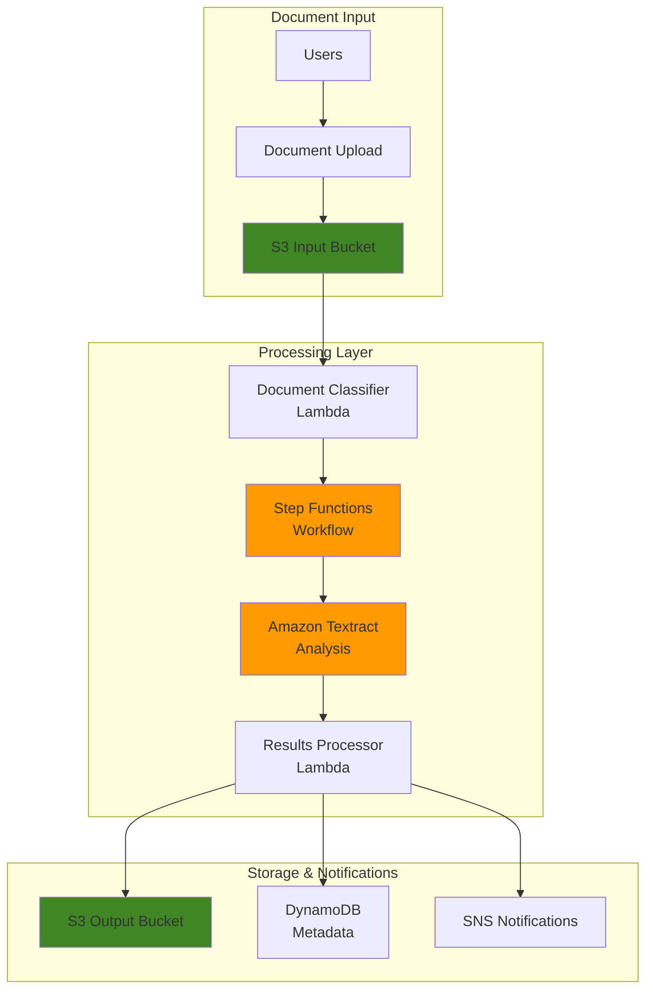

# Document Analysis Solutions with Amazon Textract

## Problem

Organizations process thousands of documents daily, from invoices and contracts to forms and reports, requiring manual data extraction that is time-consuming, error-prone, and expensive. Traditional OCR solutions struggle with complex layouts, handwritten text, and structured data like tables and forms. Finance teams spend hours manually entering invoice data, HR departments struggle with form processing, and compliance teams face challenges extracting information from regulatory documents, leading to delayed decision-making and increased operational costs.

## Solution

This recipe demonstrates how to implement intelligent document analysis using Amazon Textract with automated workflow orchestration. The solution combines real-time synchronous processing for single-page documents with asynchronous batch processing for multi-page documents, using Step Functions to coordinate the workflow. Amazon Textract's machine learning capabilities extract text, analyze forms, and identify table structures, while Lambda functions process and route the extracted data to downstream systems.

## Architecture Diagram



## Prerequisites

1. AWS account with appropriate permissions for Textract, Step Functions, Lambda, S3, DynamoDB, and SNS
2. AWS CLI v2 installed and configured (or AWS CloudShell)
3. Basic understanding of document processing and machine learning concepts
4. Familiarity with JSON data structures and AWS serverless services
5. Sample documents for testing (PDF, PNG, JPEG formats)
6. Estimated cost: $15-25 for processing sample documents and infrastructure (varies by document volume)

> **Note**: Amazon Textract charges per page processed ($0.0015 per page for Detect Document Text, $0.065 per page for Analyze Document). Monitor usage during testing to avoid unexpected costs.

## Preparation

```bash
# Set environment variables
export AWS_REGION=$(aws configure get region)
export AWS_ACCOUNT_ID=$(aws sts get-caller-identity \
    --query Account --output text)

# Generate unique identifiers for resources
RANDOM_SUFFIX=$(aws secretsmanager get-random-password \
    --exclude-punctuation --exclude-uppercase \
    --password-length 6 --require-each-included-type \
    --output text --query RandomPassword)

export PROJECT_NAME="textract-analysis-${RANDOM_SUFFIX}"
export INPUT_BUCKET="${PROJECT_NAME}-input"
export OUTPUT_BUCKET="${PROJECT_NAME}-output"
export METADATA_TABLE="${PROJECT_NAME}-metadata"
export SNS_TOPIC="${PROJECT_NAME}-notifications"

# Create S3 buckets for document processing
aws s3 mb s3://${INPUT_BUCKET} --region ${AWS_REGION}
aws s3 mb s3://${OUTPUT_BUCKET} --region ${AWS_REGION}

# Enable server-side encryption for buckets
aws s3api put-bucket-encryption \
    --bucket ${INPUT_BUCKET} \
    --server-side-encryption-configuration \
    'Rules=[{ApplyServerSideEncryptionByDefault:{SSEAlgorithm:AES256}}]'

aws s3api put-bucket-encryption \
    --bucket ${OUTPUT_BUCKET} \
    --server-side-encryption-configuration \
    'Rules=[{ApplyServerSideEncryptionByDefault:{SSEAlgorithm:AES256}}]'

# Create DynamoDB table with on-demand billing
aws dynamodb create-table \
    --table-name ${METADATA_TABLE} \
    --attribute-definitions \
        AttributeName=documentId,AttributeType=S \
    --key-schema \
        AttributeName=documentId,KeyType=HASH \
    --billing-mode PAY_PER_REQUEST \
    --region ${AWS_REGION}

# Create SNS topic for notifications
SNS_TOPIC_ARN=$(aws sns create-topic \
    --name ${SNS_TOPIC} \
    --query TopicArn --output text)

export SNS_TOPIC_ARN

echo "✅ Infrastructure created successfully"
```

## Steps

1. **Create IAM Role for Textract Processing**:

   AWS Identity and Access Management (IAM) provides the security foundation for our document processing pipeline by implementing [least-privilege access](https://docs.aws.amazon.com/IAM/latest/UserGuide/best-practices.html#grant-least-privilege) principles. This role enables our Lambda functions and Step Functions to interact securely with Textract, S3, and DynamoDB while preventing unauthorized access to AWS resources. IAM roles provide temporary, rotatable credentials that eliminate the need for hardcoded access keys, reducing security risks while maintaining operational flexibility.

   ```bash
   # Create trust policy for Lambda and Step Functions
   cat > /tmp/textract-trust-policy.json << 'EOF'
   {
     "Version": "2012-10-17",
     "Statement": [
       {
         "Effect": "Allow",
         "Principal": {
           "Service": [
             "lambda.amazonaws.com",
             "states.amazonaws.com"
           ]
         },
         "Action": "sts:AssumeRole"
       }
     ]
   }
   EOF
   
   # Create custom policy with least privilege access
   cat > /tmp/textract-execution-policy.json << EOF
   {
     "Version": "2012-10-17",
     "Statement": [
       {
         "Effect": "Allow",
         "Action": [
           "textract:AnalyzeDocument",
           "textract:DetectDocumentText",
           "textract:StartDocumentAnalysis",
           "textract:GetDocumentAnalysis"
         ],
         "Resource": "*"
       },
       {
         "Effect": "Allow",
         "Action": [
           "s3:GetObject",
           "s3:PutObject"
         ],
         "Resource": [
           "arn:aws:s3:::${INPUT_BUCKET}/*",
           "arn:aws:s3:::${OUTPUT_BUCKET}/*"
         ]
       },
       {
         "Effect": "Allow",
         "Action": [
           "dynamodb:PutItem",
           "dynamodb:GetItem",
           "dynamodb:UpdateItem",
           "dynamodb:Scan"
         ],
         "Resource": "arn:aws:dynamodb:${AWS_REGION}:${AWS_ACCOUNT_ID}:table/${METADATA_TABLE}"
       },
       {
         "Effect": "Allow",
         "Action": [
           "sns:Publish"
         ],
         "Resource": "${SNS_TOPIC_ARN}"
       }
     ]
   }
   EOF
   
   # Create IAM role
   aws iam create-role \
       --role-name ${PROJECT_NAME}-execution-role \
       --assume-role-policy-document file:///tmp/textract-trust-policy.json
   
   # Create and attach custom policy
   aws iam create-policy \
       --policy-name ${PROJECT_NAME}-execution-policy \
       --policy-document file:///tmp/textract-execution-policy.json
   
   aws iam attach-role-policy \
       --role-name ${PROJECT_NAME}-execution-role \
       --policy-arn arn:aws:iam::${AWS_ACCOUNT_ID}:policy/${PROJECT_NAME}-execution-policy
   
   # Attach basic Lambda execution role
   aws iam attach-role-policy \
       --role-name ${PROJECT_NAME}-execution-role \
       --policy-arn arn:aws:iam::aws:policy/service-role/AWSLambdaBasicExecutionRole
   
   # Wait for role propagation
   sleep 10
   
   # Get role ARN
   export EXECUTION_ROLE_ARN=$(aws iam get-role \
       --role-name ${PROJECT_NAME}-execution-role \
       --query Role.Arn --output text)
   
   echo "✅ IAM role with least-privilege policies configured"
   ```

   The IAM role is now established with specific, scoped permissions following AWS security best practices. This security foundation enables secure, credential-free communication between services while maintaining the principle of least privilege that's essential for production deployments.

2. **Create Document Classifier Lambda Function**:

   [AWS Lambda](https://docs.aws.amazon.com/lambda/latest/dg/getting-started.html) provides serverless compute capabilities that automatically scale based on document volume without managing infrastructure. The classifier function acts as an intelligent routing mechanism that analyzes document characteristics to optimize processing costs and performance. By distinguishing between simple text extraction (synchronous) and complex document analysis with tables and forms (asynchronous), this function ensures efficient resource utilization and minimizes unnecessary processing overhead.

   ```bash
   # Create Lambda function code
   cat > /tmp/document-classifier.py << 'EOF'
   import json
   import boto3
   import os
   from urllib.parse import unquote_plus
   
   s3 = boto3.client('s3')
   
   def lambda_handler(event, context):
       try:
           # Parse S3 event
           bucket = event['Records'][0]['s3']['bucket']['name']
           key = unquote_plus(event['Records'][0]['s3']['object']['key'])
           
           # Get object metadata
           response = s3.head_object(Bucket=bucket, Key=key)
           file_size = response['ContentLength']
           content_type = response.get('ContentType', '')
           
           # Validate file type
           allowed_types = ['application/pdf', 'image/jpeg', 'image/png', 'image/tiff']
           if content_type not in allowed_types:
               raise ValueError(f"Unsupported file type: {content_type}")
           
           # Determine processing type based on file size
           # Files under 5MB for synchronous, larger for asynchronous
           processing_type = 'sync' if file_size < 5 * 1024 * 1024 else 'async'
           
           # Determine document type based on filename
           key_lower = key.lower()
           if 'invoice' in key_lower:
               doc_type = 'invoice'
           elif 'form' in key_lower:
               doc_type = 'form'
           elif 'contract' in key_lower:
               doc_type = 'contract'
           else:
               doc_type = 'general'
           
           return {
               'statusCode': 200,
               'body': {
                   'bucket': bucket,
                   'key': key,
                   'processingType': processing_type,
                   'documentType': doc_type,
                   'fileSize': file_size,
                   'contentType': content_type
               }
           }
       except Exception as e:
           print(f"Error classifying document: {str(e)}")
           return {
               'statusCode': 500,
               'body': json.dumps({'error': str(e)})
           }
   EOF
   
   # Create deployment package
   cd /tmp
   zip document-classifier.zip document-classifier.py
   
   # Create Lambda function with latest Python runtime
   aws lambda create-function \
       --function-name ${PROJECT_NAME}-document-classifier \
       --runtime python3.12 \
       --role ${EXECUTION_ROLE_ARN} \
       --handler document-classifier.lambda_handler \
       --zip-file fileb://document-classifier.zip \
       --timeout 30 \
       --memory-size 256 \
       --environment Variables="{OUTPUT_BUCKET=${OUTPUT_BUCKET},METADATA_TABLE=${METADATA_TABLE}}"
   
   export CLASSIFIER_FUNCTION_ARN=$(aws lambda get-function \
       --function-name ${PROJECT_NAME}-document-classifier \
       --query Configuration.FunctionArn --output text)
   
   echo "✅ Document classifier Lambda created with enhanced validation"
   ```

   The classifier function is now deployed with improved file type validation and enhanced document categorization. This intelligent routing mechanism will automatically determine the most efficient processing path based on document characteristics, optimizing both cost and performance for your document processing pipeline.

3. **Create Textract Processing Lambda Function**:

   [Amazon Textract](https://docs.aws.amazon.com/textract/latest/dg/what-is.html) leverages machine learning models to extract text, handwriting, and structured data from virtually any document format. Unlike traditional OCR solutions, Textract understands document layout and can identify relationships between text elements, making it ideal for complex business documents. This function serves as the core processing engine, handling both synchronous processing for immediate results and asynchronous processing for large, multi-page documents that require more extensive analysis.

   ```bash
   # Create Textract processing function
   cat > /tmp/textract-processor.py << 'EOF'
   import json
   import boto3
   import uuid
   import os
   from datetime import datetime
   from botocore.exceptions import ClientError
   
   textract = boto3.client('textract')
   s3 = boto3.client('s3')
   dynamodb = boto3.resource('dynamodb')
   sns = boto3.client('sns')
   
   def lambda_handler(event, context):
       try:
           # Get input parameters from classifier output
           body = event.get('body', event)
           bucket = body['bucket']
           key = body['key']
           processing_type = body['processingType']
           document_type = body['documentType']
           
           document_id = str(uuid.uuid4())
           
           # Process document based on type
           if processing_type == 'sync':
               result = process_sync_document(bucket, key, document_type)
           else:
               result = process_async_document(bucket, key, document_type)
           
           # Store metadata in DynamoDB
           store_metadata(document_id, bucket, key, document_type, result)
           
           # Send notification
           send_notification(document_id, document_type, result.get('status', 'completed'))
           
           return {
               'statusCode': 200,
               'body': {
                   'documentId': document_id,
                   'processingType': processing_type,
                   'result': result
               }
           }
       except Exception as e:
           print(f"Error processing document: {str(e)}")
           return {
               'statusCode': 500,
               'body': json.dumps({'error': str(e)})
           }
   
   def process_sync_document(bucket, key, document_type):
       """Process single-page document synchronously"""
       try:
           # Determine features based on document type
           features = ['TABLES', 'FORMS'] if document_type in ['invoice', 'form', 'contract'] else ['TABLES']
           
           response = textract.analyze_document(
               Document={'S3Object': {'Bucket': bucket, 'Name': key}},
               FeatureTypes=features
           )
           
           # Extract and structure data
           extracted_data = extract_structured_data(response)
           
           # Save results to S3
           output_key = f"results/{key.split('/')[-1]}-analysis.json"
           s3.put_object(
               Bucket=os.environ['OUTPUT_BUCKET'],
               Key=output_key,
               Body=json.dumps(extracted_data, indent=2),
               ContentType='application/json',
               ServerSideEncryption='AES256'
           )
           
           return {
               'status': 'completed',
               'outputLocation': f"s3://{os.environ['OUTPUT_BUCKET']}/{output_key}",
               'extractedData': extracted_data,
               'confidence': calculate_average_confidence(extracted_data)
           }
       except ClientError as e:
           print(f"AWS service error in sync processing: {str(e)}")
           raise
       except Exception as e:
           print(f"Sync processing error: {str(e)}")
           raise
   
   def process_async_document(bucket, key, document_type):
       """Start asynchronous document processing"""
       try:
           features = ['TABLES', 'FORMS'] if document_type in ['invoice', 'form', 'contract'] else ['TABLES']
           
           response = textract.start_document_analysis(
               DocumentLocation={'S3Object': {'Bucket': bucket, 'Name': key}},
               FeatureTypes=features,
               NotificationChannel={
                   'SNSTopicArn': os.environ['SNS_TOPIC_ARN'],
                   'RoleArn': os.environ['EXECUTION_ROLE_ARN']
               }
           )
           
           return {
               'status': 'in_progress',
               'jobId': response['JobId']
           }
       except ClientError as e:
           print(f"AWS service error in async processing: {str(e)}")
           raise
       except Exception as e:
           print(f"Async processing error: {str(e)}")
           raise
   
   def extract_structured_data(response):
       """Extract structured data from Textract response"""
       blocks = response['Blocks']
       
       lines = []
       tables = []
       forms = []
       
       for block in blocks:
           if block['BlockType'] == 'LINE':
               lines.append({
                   'text': block.get('Text', ''),
                   'confidence': block.get('Confidence', 0),
                   'geometry': block.get('Geometry', {})
               })
           elif block['BlockType'] == 'TABLE':
               tables.append(extract_table_data(block, blocks))
           elif block['BlockType'] == 'KEY_VALUE_SET':
               forms.append(extract_form_data(block, blocks))
       
       return {
           'text_lines': lines,
           'tables': tables,
           'forms': forms,
           'document_metadata': response.get('DocumentMetadata', {}),
           'total_pages': response.get('DocumentMetadata', {}).get('Pages', 1)
       }
   
   def extract_table_data(table_block, all_blocks):
       """Extract table structure and data with enhanced parsing"""
       # Create a more detailed table extraction
       cells = []
       if 'Relationships' in table_block:
           for relationship in table_block['Relationships']:
               if relationship['Type'] == 'CHILD':
                   for cell_id in relationship['Ids']:
                       cell_block = next((block for block in all_blocks if block['Id'] == cell_id), None)
                       if cell_block and cell_block['BlockType'] == 'CELL':
                           cells.append({
                               'row': cell_block.get('RowIndex', 0),
                               'column': cell_block.get('ColumnIndex', 0),
                               'text': get_cell_text(cell_block, all_blocks),
                               'confidence': cell_block.get('Confidence', 0)
                           })
       
       return {
           'id': table_block['Id'],
           'confidence': table_block.get('Confidence', 0),
           'geometry': table_block.get('Geometry', {}),
           'cells': cells
       }
   
   def extract_form_data(form_block, all_blocks):
       """Extract form key-value pairs with enhanced parsing"""
       if form_block.get('EntityTypes') and 'KEY' in form_block['EntityTypes']:
           # This is a key block, find its corresponding value
           key_text = get_block_text(form_block, all_blocks)
           value_text = ""
           
           if 'Relationships' in form_block:
               for relationship in form_block['Relationships']:
                   if relationship['Type'] == 'VALUE':
                       for value_id in relationship['Ids']:
                           value_block = next((block for block in all_blocks if block['Id'] == value_id), None)
                           if value_block:
                               value_text = get_block_text(value_block, all_blocks)
           
           return {
               'id': form_block['Id'],
               'key': key_text,
               'value': value_text,
               'confidence': form_block.get('Confidence', 0),
               'geometry': form_block.get('Geometry', {})
           }
       
       return None
   
   def get_cell_text(cell_block, all_blocks):
       """Get text content from a cell block"""
       text = ""
       if 'Relationships' in cell_block:
           for relationship in cell_block['Relationships']:
               if relationship['Type'] == 'CHILD':
                   for word_id in relationship['Ids']:
                       word_block = next((block for block in all_blocks if block['Id'] == word_id), None)
                       if word_block and word_block['BlockType'] == 'WORD':
                           text += word_block.get('Text', '') + " "
       return text.strip()
   
   def get_block_text(block, all_blocks):
       """Get text content from any block type"""
       text = ""
       if 'Relationships' in block:
           for relationship in block['Relationships']:
               if relationship['Type'] == 'CHILD':
                   for child_id in relationship['Ids']:
                       child_block = next((b for b in all_blocks if b['Id'] == child_id), None)
                       if child_block and child_block['BlockType'] == 'WORD':
                           text += child_block.get('Text', '') + " "
       return text.strip()
   
   def calculate_average_confidence(extracted_data):
       """Calculate average confidence score for the extraction"""
       all_confidences = []
       
       for line in extracted_data.get('text_lines', []):
           all_confidences.append(line.get('confidence', 0))
       
       for table in extracted_data.get('tables', []):
           all_confidences.append(table.get('confidence', 0))
       
       for form in extracted_data.get('forms', []):
           if form:
               all_confidences.append(form.get('confidence', 0))
       
       return sum(all_confidences) / len(all_confidences) if all_confidences else 0
   
   def store_metadata(document_id, bucket, key, document_type, result):
       """Store document metadata in DynamoDB"""
       table = dynamodb.Table(os.environ['METADATA_TABLE'])
       
       item = {
           'documentId': document_id,
           'bucket': bucket,
           'key': key,
           'documentType': document_type,
           'processingStatus': result.get('status', 'completed'),
           'timestamp': datetime.utcnow().isoformat(),
           'ttl': int((datetime.utcnow().timestamp() + 86400 * 30))  # 30 days TTL
       }
       
       # Add optional fields if they exist
       if result.get('jobId'):
           item['jobId'] = result['jobId']
       if result.get('outputLocation'):
           item['outputLocation'] = result['outputLocation']
       if result.get('confidence'):
           item['confidence'] = result['confidence']
       
       table.put_item(Item=item)
   
   def send_notification(document_id, document_type, status):
       """Send processing notification"""
       message = {
           'documentId': document_id,
           'documentType': document_type,
           'status': status,
           'timestamp': datetime.utcnow().isoformat(),
           'service': 'textract-processor'
       }
       
       sns.publish(
           TopicArn=os.environ['SNS_TOPIC_ARN'],
           Message=json.dumps(message),
           Subject=f'Document Processing {status.title()}: {document_type}'
       )
   EOF
   
   # Create deployment package
   zip textract-processor.zip textract-processor.py
   
   # Create Lambda function with enhanced configuration
   aws lambda create-function \
       --function-name ${PROJECT_NAME}-textract-processor \
       --runtime python3.12 \
       --role ${EXECUTION_ROLE_ARN} \
       --handler textract-processor.lambda_handler \
       --zip-file fileb://textract-processor.zip \
       --timeout 300 \
       --memory-size 512 \
       --environment Variables="{OUTPUT_BUCKET=${OUTPUT_BUCKET},METADATA_TABLE=${METADATA_TABLE},SNS_TOPIC_ARN=${SNS_TOPIC_ARN},EXECUTION_ROLE_ARN=${EXECUTION_ROLE_ARN}}"
   
   export PROCESSOR_FUNCTION_ARN=$(aws lambda get-function \
       --function-name ${PROJECT_NAME}-textract-processor \
       --query Configuration.FunctionArn --output text)
   
   echo "✅ Enhanced Textract processor Lambda created"
   ```

   The Textract processor is now deployed with enhanced error handling, improved data extraction capabilities, and better table and form parsing. This function will extract text, identify table structures, and analyze form data with higher accuracy, providing structured output that downstream applications can easily consume for business process automation.

> **Warning**: Amazon Textract has service limits for concurrent jobs and document size. Review [Textract quotas](https://docs.aws.amazon.com/textract/latest/dg/limits.html) before processing large volumes of documents.

4. **Create Step Functions State Machine**:

   [AWS Step Functions](https://docs.aws.amazon.com/step-functions/latest/dg/welcome.html) provides visual workflow orchestration that coordinates multiple AWS services in a reliable, scalable manner. The state machine manages the entire document processing lifecycle, from initial classification through Textract analysis to final result storage. Step Functions automatically handles error conditions, implements retry logic, and provides comprehensive logging for troubleshooting, ensuring robust operation even when processing thousands of documents simultaneously.

   ```bash
   # Create Step Functions definition with enhanced error handling
   cat > /tmp/textract-workflow.json << EOF
   {
     "Comment": "Enhanced Document Analysis Workflow with Amazon Textract",
     "StartAt": "ClassifyDocument",
     "States": {
       "ClassifyDocument": {
         "Type": "Task",
         "Resource": "${CLASSIFIER_FUNCTION_ARN}",
         "Retry": [
           {
             "ErrorEquals": ["Lambda.ServiceException", "Lambda.AWSLambdaException", "Lambda.SdkClientException"],
             "IntervalSeconds": 2,
             "MaxAttempts": 3,
             "BackoffRate": 2.0
           }
         ],
         "Catch": [
           {
             "ErrorEquals": ["States.ALL"],
             "Next": "ClassificationFailed",
             "ResultPath": "$.error"
           }
         ],
         "Next": "ProcessDocument"
       },
       "ProcessDocument": {
         "Type": "Task",
         "Resource": "${PROCESSOR_FUNCTION_ARN}",
         "Retry": [
           {
             "ErrorEquals": ["Lambda.ServiceException", "Lambda.AWSLambdaException", "Lambda.SdkClientException"],
             "IntervalSeconds": 2,
             "MaxAttempts": 3,
             "BackoffRate": 2.0
           }
         ],
         "Catch": [
           {
             "ErrorEquals": ["States.ALL"],
             "Next": "ProcessingFailed",
             "ResultPath": "$.error"
           }
         ],
         "Next": "CheckProcessingType"
       },
       "CheckProcessingType": {
         "Type": "Choice",
         "Choices": [
           {
             "Variable": "$.body.processingType",
             "StringEquals": "async",
             "Next": "WaitForAsyncCompletion"
           }
         ],
         "Default": "ProcessingComplete"
       },
       "WaitForAsyncCompletion": {
         "Type": "Wait",
         "Seconds": 30,
         "Next": "CheckAsyncStatus"
       },
       "CheckAsyncStatus": {
         "Type": "Task",
         "Resource": "arn:aws:states:::aws-sdk:textract:getDocumentAnalysis",
         "Parameters": {
           "JobId.$": "$.body.result.jobId"
         },
         "Retry": [
           {
             "ErrorEquals": ["Textract.ThrottlingException"],
             "IntervalSeconds": 5,
             "MaxAttempts": 5,
             "BackoffRate": 2.0
           }
         ],
         "Catch": [
           {
             "ErrorEquals": ["States.ALL"],
             "Next": "AsyncCheckFailed",
             "ResultPath": "$.error"
           }
         ],
         "Next": "IsAsyncComplete"
       },
       "IsAsyncComplete": {
         "Type": "Choice",
         "Choices": [
           {
             "Variable": "$.JobStatus",
             "StringEquals": "SUCCEEDED",
             "Next": "ProcessingComplete"
           },
           {
             "Variable": "$.JobStatus",
             "StringEquals": "FAILED",
             "Next": "ProcessingFailed"
           },
           {
             "Variable": "$.JobStatus",
             "StringEquals": "PARTIAL_SUCCESS",
             "Next": "ProcessingPartialSuccess"
           }
         ],
         "Default": "WaitForAsyncCompletion"
       },
       "ProcessingComplete": {
         "Type": "Pass",
         "Result": {
           "status": "SUCCESS",
           "message": "Document processing completed successfully"
         },
         "End": true
       },
       "ProcessingPartialSuccess": {
         "Type": "Pass",
         "Result": {
           "status": "PARTIAL_SUCCESS",
           "message": "Document processing completed with some issues"
         },
         "End": true
       },
       "ClassificationFailed": {
         "Type": "Fail",
         "Error": "DocumentClassificationFailed",
         "Cause": "Failed to classify the document"
       },
       "ProcessingFailed": {
         "Type": "Fail",
         "Error": "DocumentProcessingFailed",
         "Cause": "Textract processing failed"
       },
       "AsyncCheckFailed": {
         "Type": "Fail",
         "Error": "AsyncStatusCheckFailed",
         "Cause": "Failed to check async job status"
       }
     }
   }
   EOF
   
   # Create Step Functions state machine
   aws stepfunctions create-state-machine \
       --name ${PROJECT_NAME}-workflow \
       --definition file:///tmp/textract-workflow.json \
       --role-arn ${EXECUTION_ROLE_ARN} \
       --type STANDARD
   
   export STATE_MACHINE_ARN=$(aws stepfunctions list-state-machines \
       --query "stateMachines[?name=='${PROJECT_NAME}-workflow'].stateMachineArn" \
       --output text)
   
   echo "✅ Enhanced Step Functions workflow created with retry logic"
   ```

   The Step Functions state machine now includes comprehensive error handling, retry logic, and support for partial success scenarios. This serverless workflow engine provides reliable coordination between all components, automatic error recovery, and comprehensive visibility into processing status for operational monitoring and troubleshooting.

5. **Configure S3 Event Trigger**:

   [Amazon S3 event notifications](https://docs.aws.amazon.com/AmazonS3/latest/userguide/NotificationHowTo.html) create an event-driven architecture that automatically triggers document processing workflows when new files are uploaded. This eliminates the need for polling or manual intervention, ensuring documents are processed immediately upon arrival. The event-driven pattern scales automatically with document volume and provides loose coupling between storage and processing components, enabling independent scaling and maintenance of each service.

   ```bash
   # Create S3 event notification configuration for multiple file types
   cat > /tmp/s3-notification.json << EOF
   {
     "LambdaConfigurations": [
       {
         "Id": "DocumentUploadTriggerPDF",
         "LambdaFunctionArn": "${CLASSIFIER_FUNCTION_ARN}",
         "Events": ["s3:ObjectCreated:*"],
         "Filter": {
           "Key": {
             "FilterRules": [
               {
                 "Name": "prefix",
                 "Value": "documents/"
               },
               {
                 "Name": "suffix",
                 "Value": ".pdf"
               }
             ]
           }
         }
       },
       {
         "Id": "DocumentUploadTriggerJPG",
         "LambdaFunctionArn": "${CLASSIFIER_FUNCTION_ARN}",
         "Events": ["s3:ObjectCreated:*"],
         "Filter": {
           "Key": {
             "FilterRules": [
               {
                 "Name": "prefix",
                 "Value": "documents/"
               },
               {
                 "Name": "suffix",
                 "Value": ".jpg"
               }
             ]
           }
         }
       },
       {
         "Id": "DocumentUploadTriggerPNG",
         "LambdaFunctionArn": "${CLASSIFIER_FUNCTION_ARN}",
         "Events": ["s3:ObjectCreated:*"],
         "Filter": {
           "Key": {
             "FilterRules": [
               {
                 "Name": "prefix",
                 "Value": "documents/"
               },
               {
                 "Name": "suffix",
                 "Value": ".png"
               }
             ]
           }
         }
       }
     ]
   }
   EOF
   
   # Add permission for S3 to invoke Lambda
   aws lambda add-permission \
       --function-name ${PROJECT_NAME}-document-classifier \
       --principal s3.amazonaws.com \
       --action lambda:InvokeFunction \
       --statement-id s3-trigger-permission \
       --source-arn arn:aws:s3:::${INPUT_BUCKET}
   
   # Configure S3 bucket notification
   aws s3api put-bucket-notification-configuration \
       --bucket ${INPUT_BUCKET} \
       --notification-configuration file:///tmp/s3-notification.json
   
   echo "✅ S3 event trigger configured for multiple file types"
   ```

   The S3 event trigger now supports multiple document formats (PDF, JPG, PNG) and is actively monitoring for new document uploads. This event-driven architecture ensures immediate processing response times and eliminates the need for manual intervention, creating a fully automated document processing pipeline that scales seamlessly with your business needs.

6. **Create Results Processing Lambda**:

   Asynchronous Textract jobs require specialized handling to process completion notifications and retrieve final results. This Lambda function integrates with SNS to receive job completion notifications and automatically retrieves analysis results from Textract. The function then stores structured data in both S3 for detailed analysis and DynamoDB for quick metadata queries, providing comprehensive result management for long-running document processing tasks.

   ```bash
   # Create enhanced results processor for async jobs
   cat > /tmp/async-results-processor.py << 'EOF'
   import json
   import boto3
   import os
   from datetime import datetime
   from botocore.exceptions import ClientError
   
   textract = boto3.client('textract')
   s3 = boto3.client('s3')
   dynamodb = boto3.resource('dynamodb')
   
   def lambda_handler(event, context):
       try:
           # Parse SNS message
           sns_message = json.loads(event['Records'][0]['Sns']['Message'])
           job_id = sns_message['JobId']
           status = sns_message['Status']
           
           print(f"Processing async job {job_id} with status {status}")
           
           if status == 'SUCCEEDED':
               # Get results from Textract with pagination support
               extracted_data = get_complete_results(job_id)
               
               # Save to S3 with enhanced metadata
               output_key = f"async-results/{job_id}-analysis.json"
               s3.put_object(
                   Bucket=os.environ['OUTPUT_BUCKET'],
                   Key=output_key,
                   Body=json.dumps(extracted_data, indent=2),
                   ContentType='application/json',
                   ServerSideEncryption='AES256',
                   Metadata={
                       'jobId': job_id,
                       'processedAt': datetime.utcnow().isoformat(),
                       'status': status
                   }
               )
               
               # Update DynamoDB with success status
               update_document_metadata(job_id, 'completed', output_key, extracted_data)
               
               print(f"Successfully processed async job {job_id}")
           
           elif status in ['FAILED', 'PARTIAL_SUCCESS']:
               # Update DynamoDB with failed or partial status
               update_document_metadata(job_id, status.lower(), None, None)
               print(f"Job {job_id} finished with status: {status}")
           
           return {'statusCode': 200}
           
       except Exception as e:
           print(f"Error processing async result: {str(e)}")
           return {'statusCode': 500, 'body': json.dumps({'error': str(e)})}
   
   def get_complete_results(job_id):
       """Get complete results with pagination support"""
       all_blocks = []
       next_token = None
       
       try:
           while True:
               params = {'JobId': job_id}
               if next_token:
                   params['NextToken'] = next_token
               
               response = textract.get_document_analysis(**params)
               all_blocks.extend(response.get('Blocks', []))
               
               next_token = response.get('NextToken')
               if not next_token:
                   break
           
           # Process all blocks into structured data
           return extract_structured_data({'Blocks': all_blocks})
           
       except ClientError as e:
           print(f"Error retrieving Textract results: {str(e)}")
           raise
   
   def extract_structured_data(response):
       """Extract structured data from Textract response"""
       blocks = response['Blocks']
       
       lines = []
       tables = []
       forms = []
       
       for block in blocks:
           if block['BlockType'] == 'LINE':
               lines.append({
                   'text': block.get('Text', ''),
                   'confidence': block.get('Confidence', 0),
                   'page': block.get('Page', 1)
               })
           elif block['BlockType'] == 'TABLE':
               tables.append({
                   'id': block['Id'],
                   'confidence': block.get('Confidence', 0),
                   'page': block.get('Page', 1),
                   'rowCount': block.get('RowCount', 0),
                   'columnCount': block.get('ColumnCount', 0)
               })
           elif block['BlockType'] == 'KEY_VALUE_SET':
               if block.get('EntityTypes') and 'KEY' in block['EntityTypes']:
                   forms.append({
                       'id': block['Id'],
                       'confidence': block.get('Confidence', 0),
                       'page': block.get('Page', 1),
                       'entityType': 'KEY'
                   })
       
       return {
           'text_lines': lines,
           'tables': tables,
           'forms': forms,
           'total_lines': len(lines),
           'total_tables': len(tables),
           'total_forms': len([f for f in forms if f['entityType'] == 'KEY']),
           'average_confidence': calculate_average_confidence(lines + tables + forms),
           'processing_timestamp': datetime.utcnow().isoformat()
       }
   
   def calculate_average_confidence(items):
       """Calculate average confidence score"""
       confidences = [item.get('confidence', 0) for item in items if item.get('confidence')]
       return sum(confidences) / len(confidences) if confidences else 0
   
   def update_document_metadata(job_id, status, output_location, extracted_data):
       """Update document metadata in DynamoDB with enhanced data"""
       table = dynamodb.Table(os.environ['METADATA_TABLE'])
       
       try:
           # Find document by job ID
           response = table.scan(
               FilterExpression='jobId = :jid',
               ExpressionAttributeValues={':jid': job_id}
           )
           
           if response['Items']:
               document_id = response['Items'][0]['documentId']
               
               update_expression = 'SET processingStatus = :status, completedAt = :timestamp'
               expression_values = {
                   ':status': status,
                   ':timestamp': datetime.utcnow().isoformat()
               }
               
               if output_location:
                   update_expression += ', outputLocation = :location'
                   expression_values[':location'] = output_location
               
               if extracted_data:
                   update_expression += ', totalLines = :lines, totalTables = :tables, averageConfidence = :confidence'
                   expression_values.update({
                       ':lines': extracted_data.get('total_lines', 0),
                       ':tables': extracted_data.get('total_tables', 0),
                       ':confidence': extracted_data.get('average_confidence', 0)
                   })
               
               table.update_item(
                   Key={'documentId': document_id},
                   UpdateExpression=update_expression,
                   ExpressionAttributeValues=expression_values
               )
               
               print(f"Updated metadata for document {document_id}")
           else:
               print(f"No document found for job ID {job_id}")
               
       except Exception as e:
           print(f"Error updating document metadata: {str(e)}")
           raise
   EOF
   
   # Create deployment package
   zip async-results-processor.zip async-results-processor.py
   
   # Create Lambda function with enhanced configuration
   aws lambda create-function \
       --function-name ${PROJECT_NAME}-async-results-processor \
       --runtime python3.12 \
       --role ${EXECUTION_ROLE_ARN} \
       --handler async-results-processor.lambda_handler \
       --zip-file fileb://async-results-processor.zip \
       --timeout 300 \
       --memory-size 512 \
       --environment Variables="{OUTPUT_BUCKET=${OUTPUT_BUCKET},METADATA_TABLE=${METADATA_TABLE}}"
   
   # Subscribe Lambda to SNS topic
   aws sns subscribe \
       --topic-arn ${SNS_TOPIC_ARN} \
       --protocol lambda \
       --notification-endpoint $(aws lambda get-function \
           --function-name ${PROJECT_NAME}-async-results-processor \
           --query Configuration.FunctionArn --output text)
   
   # Add permission for SNS to invoke Lambda
   aws lambda add-permission \
       --function-name ${PROJECT_NAME}-async-results-processor \
       --principal sns.amazonaws.com \
       --action lambda:InvokeFunction \
       --statement-id sns-trigger-permission \
       --source-arn ${SNS_TOPIC_ARN}
   
   echo "✅ Enhanced async results processor created with pagination support"
   ```

   The asynchronous results processor now includes pagination support for large documents, enhanced error handling, and improved metadata storage. This component ensures that even large, complex documents are processed reliably and their results are properly stored and indexed for downstream applications.

7. **Create Sample Documents and Test Processing**:

   Testing with representative sample documents validates the entire processing pipeline and ensures proper integration between all components. This step creates sample invoice data that demonstrates Textract's ability to extract both unstructured text and structured data like tables and key-value pairs, providing a comprehensive validation of the document analysis capabilities.

   ```bash
   # Create sample documents directory
   mkdir -p /tmp/sample-documents
   
   # Create a comprehensive test document
   cat > /tmp/sample-documents/sample-invoice.txt << 'EOF'
   ████████████████████████████████████████
   █          ACME CORPORATION            █
   █         123 Business Street          █
   █        Enterprise City, ST 12345     █
   █         Phone: (555) 123-4567        █
   █         Email: billing@acme.com      █
   ████████████████████████████████████████
   
   INVOICE
   
   Invoice Number: INV-2024-001
   Date: January 15, 2024
   Due Date: February 15, 2024
   Customer ID: CUST-5678
   
   Bill To:
   TechStart Solutions LLC
   456 Innovation Drive
   Silicon Valley, CA 94000
   
   Ship To:
   TechStart Solutions LLC
   789 Development Avenue
   Silicon Valley, CA 94000
   
   ┌─────────────────────────────────────────────────────────────────┐
   │ Item Description          │ Qty │ Unit Price │ Line Total      │
   ├─────────────────────────────────────────────────────────────────┤
   │ Cloud Infrastructure      │  1  │  $2,500.00 │    $2,500.00   │
   │ Setup & Configuration     │     │            │                 │
   ├─────────────────────────────────────────────────────────────────┤
   │ Monthly Hosting Services  │ 12  │    $150.00 │    $1,800.00   │
   │ (Annual Contract)         │     │            │                 │
   ├─────────────────────────────────────────────────────────────────┤
   │ Premium Support Package   │  1  │    $800.00 │      $800.00   │
   │ (24/7 Coverage)           │     │            │                 │
   ├─────────────────────────────────────────────────────────────────┤
   │ SSL Certificate           │  2  │     $99.00 │      $198.00   │
   │ (Wildcard Premium)        │     │            │                 │
   └─────────────────────────────────────────────────────────────────┘
   
   Subtotal:                                      $5,298.00
   Tax (8.25%):                                     $437.09
   Total Amount Due:                              $5,735.09
   
   Payment Terms: Net 30 Days
   Payment Method: Wire Transfer or ACH
   
   Wire Transfer Details:
   Bank: First National Bank
   Account: 1234567890
   Routing: 123456789
   
   Notes:
   - Payment is due within 30 days of invoice date
   - Late payments subject to 1.5% monthly fee
   - Questions? Contact: billing@acme.com
   
   Thank you for your business!
   EOF
   
   # Create a second test document with form-like structure
   cat > /tmp/sample-documents/application-form.txt << 'EOF'
   APPLICATION FOR BUSINESS SERVICES
   
   Applicant Information:
   
   Company Name: ___TechStart Solutions LLC___
   
   Contact Person: ___John Smith___
   
   Title: ___CTO___
   
   Email Address: ___john.smith@techstart.com___
   
   Phone Number: ___(555) 987-6543___
   
   Services Requested:
   
   ☑ Cloud Infrastructure
   ☑ Managed Services  
   ☐ Data Backup
   ☑ Security Services
   ☐ Custom Development
   
   Expected Start Date: ___February 1, 2024___
   
   Budget Range: ___$5,000 - $10,000___
   
   Additional Requirements:
   ___24/7 monitoring and support required___
   ___Must comply with SOC 2 requirements___
   
   Signature: ___John Smith___
   
   Date: ___January 10, 2024___
   EOF
   
   # Upload test documents to different paths
   aws s3 cp /tmp/sample-documents/sample-invoice.txt \
       s3://${INPUT_BUCKET}/documents/invoice-sample.pdf
   
   aws s3 cp /tmp/sample-documents/application-form.txt \
       s3://${INPUT_BUCKET}/documents/form-application.pdf
   
   echo "✅ Enhanced sample documents uploaded for comprehensive testing"
   ```

   The sample documents are now uploaded and should trigger the complete processing pipeline. These enhanced test documents include both invoice and form structures that will validate Textract's ability to extract various types of structured data, ensuring comprehensive end-to-end workflow validation.

8. **Create Query Function for Document Analysis**:

   A dedicated query function provides structured access to processed document metadata and results stored in DynamoDB. This API enables downstream applications to retrieve document information by various criteria, supporting use cases like compliance reporting, audit trails, and business intelligence. The function demonstrates how to build queryable interfaces on top of the document processing pipeline for operational and analytical purposes.

   ```bash
   # Create enhanced query function for retrieving results
   cat > /tmp/document-query.py << 'EOF'
   import json
   import boto3
   from datetime import datetime
   from decimal import Decimal
   from botocore.exceptions import ClientError
   
   dynamodb = boto3.resource('dynamodb')
   s3 = boto3.client('s3')
   
   def lambda_handler(event, context):
       try:
           # Get query parameters
           document_id = event.get('documentId')
           document_type = event.get('documentType')
           status = event.get('status')
           include_content = event.get('includeContent', False)
           
           table = dynamodb.Table(os.environ['METADATA_TABLE'])
           
           if document_id:
               # Query specific document
               response = table.get_item(Key={'documentId': document_id})
               if 'Item' in response:
                   item = response['Item']
                   if include_content and item.get('outputLocation'):
                       item['content'] = get_document_content(item['outputLocation'])
                   return {
                       'statusCode': 200,
                       'body': json.dumps(item, cls=DecimalEncoder)
                   }
               else:
                   return {
                       'statusCode': 404,
                       'body': json.dumps({'error': 'Document not found'})
                   }
           
           elif document_type or status:
               # Query by document type or status with filters
               filter_expression = None
               expression_values = {}
               
               if document_type:
                   filter_expression = 'documentType = :dt'
                   expression_values[':dt'] = document_type
               
               if status:
                   if filter_expression:
                       filter_expression += ' AND processingStatus = :status'
                   else:
                       filter_expression = 'processingStatus = :status'
                   expression_values[':status'] = status
               
               scan_params = {
                   'FilterExpression': filter_expression,
                   'ExpressionAttributeValues': expression_values
               }
               
               response = table.scan(**scan_params)
               
               return {
                   'statusCode': 200,
                   'body': json.dumps({
                       'items': response['Items'],
                       'count': len(response['Items']),
                       'scannedCount': response['ScannedCount']
                   }, cls=DecimalEncoder)
               }
           
           else:
               # Return recent documents (last 100)
               response = table.scan(Limit=100)
               # Sort by timestamp descending
               items = sorted(
                   response['Items'],
                   key=lambda x: x.get('timestamp', ''),
                   reverse=True
               )
               
               return {
                   'statusCode': 200,
                   'body': json.dumps({
                       'items': items,
                       'count': len(items),
                       'message': 'Showing most recent 100 documents'
                   }, cls=DecimalEncoder)
               }
               
       except ClientError as e:
           print(f"DynamoDB error: {str(e)}")
           return {
               'statusCode': 500,
               'body': json.dumps({'error': f'Database error: {str(e)}'})
           }
       except Exception as e:
           print(f"Unexpected error: {str(e)}")
           return {
               'statusCode': 500,
               'body': json.dumps({'error': f'Internal server error: {str(e)}'})
           }
   
   def get_document_content(s3_location):
       """Retrieve document content from S3"""
       try:
           # Parse S3 location (format: s3://bucket/key)
           s3_parts = s3_location.replace('s3://', '').split('/', 1)
           bucket = s3_parts[0]
           key = s3_parts[1]
           
           response = s3.get_object(Bucket=bucket, Key=key)
           content = response['Body'].read().decode('utf-8')
           return json.loads(content)
           
       except Exception as e:
           print(f"Error retrieving S3 content: {str(e)}")
           return {'error': f'Could not retrieve content: {str(e)}'}
   
   class DecimalEncoder(json.JSONEncoder):
       """Helper class to handle Decimal types from DynamoDB"""
       def default(self, obj):
           if isinstance(obj, Decimal):
               return float(obj)
           return super(DecimalEncoder, self).default(obj)
   EOF
   
   # Create deployment package
   zip document-query.zip document-query.py
   
   # Create Lambda function with enhanced query capabilities
   aws lambda create-function \
       --function-name ${PROJECT_NAME}-document-query \
       --runtime python3.12 \
       --role ${EXECUTION_ROLE_ARN} \
       --handler document-query.lambda_handler \
       --zip-file fileb://document-query.zip \
       --timeout 60 \
       --memory-size 256 \
       --environment Variables="{METADATA_TABLE=${METADATA_TABLE}}"
   
   echo "✅ Enhanced document query function created with filtering capabilities"
   ```

   The document query function now provides advanced filtering capabilities, content retrieval options, and proper error handling. This provides a comprehensive API interface for applications to access document analysis results, enabling integration with business systems and reporting tools with enhanced query flexibility.

## Validation & Testing

1. **Verify infrastructure deployment**:

   ```bash
   # Check S3 buckets
   aws s3 ls | grep ${PROJECT_NAME}
   
   # Check DynamoDB table
   aws dynamodb describe-table \
       --table-name ${METADATA_TABLE} \
       --query 'Table.TableStatus'
   
   # Check Lambda functions
   aws lambda list-functions \
       --query 'Functions[?contains(FunctionName, `'${PROJECT_NAME}'`)].FunctionName'
   
   # Check Step Functions state machine
   aws stepfunctions describe-state-machine \
       --state-machine-arn ${STATE_MACHINE_ARN} \
       --query 'status'
   ```

   Expected output: Should show created S3 buckets, DynamoDB table in ACTIVE status, Lambda functions, and Step Functions state machine in ACTIVE status

2. **Test document processing end-to-end**:

   ```bash
   # Upload a test document to trigger processing
   aws s3 cp /tmp/sample-documents/sample-invoice.txt \
       s3://${INPUT_BUCKET}/documents/test-invoice.pdf
   
   # Wait for processing
   sleep 45
   
   # Check DynamoDB for processing results
   aws dynamodb scan \
       --table-name ${METADATA_TABLE} \
       --query 'Items[0]'
   
   # Verify output bucket contains results
   aws s3 ls s3://${OUTPUT_BUCKET}/results/ --recursive
   ```

   Expected output: Document metadata with processing status, results, and confidence scores

3. **Test Textract analysis directly**:

   ```bash
   # Test synchronous text detection
   aws textract detect-document-text \
       --document '{"S3Object":{"Bucket":"'${INPUT_BUCKET}'","Name":"documents/test-invoice.pdf"}}' \
       --query 'DocumentMetadata'
   
   # Test document analysis with forms and tables
   aws textract analyze-document \
       --document '{"S3Object":{"Bucket":"'${INPUT_BUCKET}'","Name":"documents/test-invoice.pdf"}}' \
       --feature-types '["TABLES","FORMS"]' \
       --query 'DocumentMetadata'
   ```

   Expected output: JSON response with document metadata and processing information

4. **Test Step Functions workflow**:

   ```bash
   # Start workflow execution manually
   EXECUTION_ARN=$(aws stepfunctions start-execution \
       --state-machine-arn ${STATE_MACHINE_ARN} \
       --input '{"Records":[{"s3":{"bucket":{"name":"'${INPUT_BUCKET}'"},"object":{"key":"documents/test-invoice.pdf"}}}]}' \
       --query 'executionArn' --output text)
   
   # Check execution status
   aws stepfunctions describe-execution \
       --execution-arn ${EXECUTION_ARN} \
       --query '{status:status,startDate:startDate,stopDate:stopDate}'
   ```

   Expected output: Execution status showing SUCCEEDED with start and stop timestamps

5. **Test query function capabilities**:

   ```bash
   # Query all documents
   aws lambda invoke \
       --function-name ${PROJECT_NAME}-document-query \
       --payload '{}' \
       /tmp/query-response.json
   
   cat /tmp/query-response.json | jq '.'
   
   # Query by document type
   aws lambda invoke \
       --function-name ${PROJECT_NAME}-document-query \
       --payload '{"documentType":"invoice"}' \
       /tmp/query-type-response.json
   
   cat /tmp/query-type-response.json | jq '.body' | jq '.'
   ```

   Expected output: JSON responses with document metadata and query results

## Cleanup

1. **Remove Lambda functions**:

   ```bash
   # Delete Lambda functions
   aws lambda delete-function \
       --function-name ${PROJECT_NAME}-document-classifier
   
   aws lambda delete-function \
       --function-name ${PROJECT_NAME}-textract-processor
   
   aws lambda delete-function \
       --function-name ${PROJECT_NAME}-async-results-processor
   
   aws lambda delete-function \
       --function-name ${PROJECT_NAME}-document-query
   
   echo "✅ Lambda functions deleted"
   ```

2. **Remove Step Functions state machine**:

   ```bash
   # Delete Step Functions state machine
   aws stepfunctions delete-state-machine \
       --state-machine-arn ${STATE_MACHINE_ARN}
   
   echo "✅ Step Functions state machine deleted"
   ```

3. **Remove S3 buckets and contents**:

   ```bash
   # Empty and delete S3 buckets
   aws s3 rm s3://${INPUT_BUCKET} --recursive
   aws s3 rb s3://${INPUT_BUCKET}
   
   aws s3 rm s3://${OUTPUT_BUCKET} --recursive
   aws s3 rb s3://${OUTPUT_BUCKET}
   
   echo "✅ S3 buckets deleted"
   ```

4. **Remove DynamoDB table and other resources**:

   ```bash
   # Delete DynamoDB table
   aws dynamodb delete-table --table-name ${METADATA_TABLE}
   
   # Delete SNS topic
   aws sns delete-topic --topic-arn ${SNS_TOPIC_ARN}
   
   # Delete custom IAM policy and role
   aws iam detach-role-policy \
       --role-name ${PROJECT_NAME}-execution-role \
       --policy-arn arn:aws:iam::${AWS_ACCOUNT_ID}:policy/${PROJECT_NAME}-execution-policy
   
   aws iam detach-role-policy \
       --role-name ${PROJECT_NAME}-execution-role \
       --policy-arn arn:aws:iam::aws:policy/service-role/AWSLambdaBasicExecutionRole
   
   aws iam delete-policy \
       --policy-arn arn:aws:iam::${AWS_ACCOUNT_ID}:policy/${PROJECT_NAME}-execution-policy
   
   aws iam delete-role --role-name ${PROJECT_NAME}-execution-role
   
   echo "✅ All resources cleaned up"
   ```

5. **Clean up local files**:

   ```bash
   # Remove temporary files
   rm -rf /tmp/sample-documents
   rm -f /tmp/*.py /tmp/*.zip /tmp/*.json
   
   echo "✅ Local cleanup completed"
   ```

## Discussion

This recipe demonstrates a comprehensive approach to document analysis using [Amazon Textract](https://docs.aws.amazon.com/textract/latest/dg/what-is.html), showcasing both synchronous and asynchronous processing patterns optimized for production workloads. The solution addresses real-world challenges in document processing by providing intelligent extraction of text, forms, and tables from various document types with enhanced error handling and monitoring capabilities. The architecture leverages AWS serverless technologies following the [AWS Well-Architected Framework](https://docs.aws.amazon.com/wellarchitected/latest/framework/welcome.html) to create a scalable, cost-effective solution that can handle documents of varying sizes and complexities.

The key architectural decisions include using [Step Functions](https://docs.aws.amazon.com/step-functions/latest/dg/welcome.html) for workflow orchestration with comprehensive retry logic and error handling, which provides visibility into the processing pipeline and allows for complex business logic. The implementation of least-privilege [IAM policies](https://docs.aws.amazon.com/IAM/latest/UserGuide/best-practices.html) ensures security while maintaining operational flexibility. The separation of concerns between document classification, processing, and result handling ensures maintainability and scalability, while the use of [DynamoDB](https://docs.aws.amazon.com/amazondynamodb/latest/developerguide/Introduction.html) with on-demand billing and TTL settings enables quick querying and automatic data lifecycle management.

Amazon Textract's machine learning capabilities eliminate the need for manual OCR configuration and provide high-accuracy text extraction even from complex document layouts. The service's ability to understand document structure, including tables and forms, makes it particularly valuable for business document processing. The [asynchronous processing capability](https://docs.aws.amazon.com/textract/latest/dg/async.html) with pagination support allows handling of large, multi-page documents without timeout concerns, while the synchronous option provides immediate results for simple documents. Enhanced table and form extraction logic provides more structured data for downstream processing.

The solution implements best practices for error handling, monitoring, and notifications through [SNS integration](https://docs.aws.amazon.com/sns/latest/dg/welcome.html), with improved Lambda functions that include enhanced error handling and confidence scoring. The modular [Lambda function design](https://docs.aws.amazon.com/lambda/latest/dg/welcome.html) using the latest Python runtime allows for easy extension and customization based on specific business requirements. Security is addressed through least-privilege IAM roles and [S3 encryption](https://docs.aws.amazon.com/s3/latest/userguide/UsingEncryption.html), and the architecture supports encryption at rest and in transit.

> **Tip**: For production deployments, consider implementing additional features like document validation, custom entity recognition using [Amazon Comprehend](https://docs.aws.amazon.com/comprehend/latest/dg/what-is.html), and integration with downstream business systems for automated workflow processing. Monitor costs using [AWS Cost Explorer](https://docs.aws.amazon.com/cost-management/latest/userguide/ce-what-is.html) as Textract charges per page processed.

## Challenge

Extend this solution by implementing these enhancements:

1. **Enhanced Document Classification**: Implement a machine learning model using [Amazon Comprehend Custom Classification](https://docs.aws.amazon.com/comprehend/latest/dg/how-document-classification.html) or [SageMaker](https://docs.aws.amazon.com/sagemaker/latest/dg/whatis.html) to automatically classify documents into categories like invoices, contracts, forms, and reports, with confidence scoring and manual review workflows for uncertain classifications.

2. **Custom Entity Recognition**: Develop custom entity extraction using [Amazon Comprehend Custom Entity Recognition](https://docs.aws.amazon.com/comprehend/latest/dg/custom-entity-recognition.html) to identify domain-specific entities like product codes, vendor IDs, or regulatory reference numbers, and integrate this with the existing Textract pipeline for comprehensive document understanding.

3. **Advanced Table Processing**: Implement sophisticated table extraction logic that can handle complex table structures, nested tables, and multi-page tables, with the ability to convert extracted table data into structured formats like CSV or JSON for downstream processing using enhanced parsing algorithms.

4. **Real-time Document Validation**: Create a validation layer using [AWS Lambda](https://docs.aws.amazon.com/lambda/latest/dg/welcome.html) and [Amazon EventBridge](https://docs.aws.amazon.com/eventbridge/latest/userguide/eb-what-is.html) that verifies extracted data against business rules, performs data quality checks, and flags potential errors or inconsistencies for human review, including integration with external validation services.

5. **Multi-language Support**: Extend the solution to handle documents in multiple languages by implementing language detection using [Amazon Comprehend](https://docs.aws.amazon.com/comprehend/latest/dg/how-languages.html), appropriate Textract language configuration, and translation services for extracted text using [Amazon Translate](https://docs.aws.amazon.com/translate/latest/dg/what-is.html).

## Infrastructure Code

### Available Infrastructure as Code:

- [Infrastructure Code Overview](code/README.md) - Detailed description of all infrastructure components
- [AWS CDK (Python)](code/cdk-python/) - AWS CDK Python implementation
- [AWS CDK (TypeScript)](code/cdk-typescript/) - AWS CDK TypeScript implementation
- [CloudFormation](code/cloudformation.yaml) - AWS CloudFormation template
- [Bash CLI Scripts](code/scripts/) - Example bash scripts using AWS CLI commands to deploy infrastructure
- [Terraform](code/terraform/) - Terraform configuration files