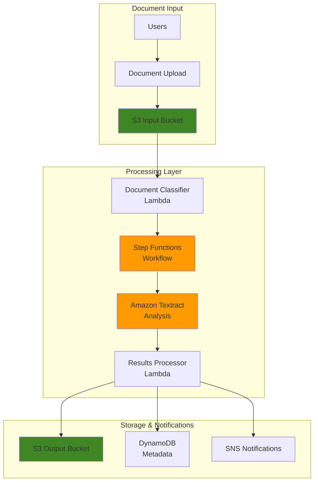

# Implementing Document Analysis with Amazon Textract

## Problem

Organizations process thousands of documents daily, from invoices and contracts to forms and reports, requiring manual data extraction that is time-consuming, error-prone, and expensive. Traditional OCR solutions struggle with complex layouts, handwritten text, and structured data like tables and forms. Finance teams spend hours manually entering invoice data, HR departments struggle with form processing, and compliance teams face challenges extracting information from regulatory documents, leading to delayed decision-making and increased operational costs.

## Solution

This recipe demonstrates how to implement intelligent document analysis using Amazon Textract with automated workflow orchestration. The solution combines real-time synchronous processing for single-page documents with asynchronous batch processing for multi-page documents, using Step Functions to coordinate the workflow. Amazon Textract's machine learning capabilities extract text, analyze forms, and identify table structures, while Lambda functions process and route the extracted data to downstream systems.

## Architecture Diagram



## Prerequisites

1. AWS account with appropriate permissions for Textract, Step Functions, Lambda, S3, DynamoDB, and SNS
2. AWS CLI v2 installed and configured (or AWS CloudShell)
3. Basic understanding of document processing and machine learning concepts
4. Familiarity with JSON data structures and AWS serverless services
5. Sample documents for testing (PDF, PNG, JPEG formats)
6. Estimated cost: $10-15 for processing sample documents and infrastructure (varies by document volume)

> **Note**: Amazon Textract charges per page processed. Monitor usage during testing to avoid unexpected costs.

## Preparation

```bash
# Set environment variables
export AWS_REGION=$(aws configure get region)
export AWS_ACCOUNT_ID=$(aws sts get-caller-identity \
    --query Account --output text)

# Generate unique identifiers for resources
RANDOM_SUFFIX=$(aws secretsmanager get-random-password \
    --exclude-punctuation --exclude-uppercase \
    --password-length 6 --require-each-included-type \
    --output text --query RandomPassword)

export PROJECT_NAME="textract-analysis-${RANDOM_SUFFIX}"
export INPUT_BUCKET="${PROJECT_NAME}-input"
export OUTPUT_BUCKET="${PROJECT_NAME}-output"
export METADATA_TABLE="${PROJECT_NAME}-metadata"
export SNS_TOPIC="${PROJECT_NAME}-notifications"

# Create S3 buckets for document processing
aws s3 mb s3://${INPUT_BUCKET} --region ${AWS_REGION}
aws s3 mb s3://${OUTPUT_BUCKET} --region ${AWS_REGION}

# Create DynamoDB table for document metadata
aws dynamodb create-table \
    --table-name ${METADATA_TABLE} \
    --attribute-definitions \
        AttributeName=documentId,AttributeType=S \
    --key-schema \
        AttributeName=documentId,KeyType=HASH \
    --provisioned-throughput \
        ReadCapacityUnits=5,WriteCapacityUnits=5 \
    --region ${AWS_REGION}

# Create SNS topic for notifications
SNS_TOPIC_ARN=$(aws sns create-topic \
    --name ${SNS_TOPIC} \
    --query TopicArn --output text)

export SNS_TOPIC_ARN

echo "✅ Infrastructure created successfully"
```

## Steps

1. **Create IAM Role for Textract Processing**:

   AWS Identity and Access Management (IAM) provides the security foundation for our document processing pipeline by implementing [least-privilege access](https://docs.aws.amazon.com/IAM/latest/UserGuide/best-practices.html#grant-least-privilege) principles. This role enables our Lambda functions and Step Functions to interact securely with Textract, S3, and DynamoDB while preventing unauthorized access to AWS resources. IAM roles provide temporary, rotatable credentials that eliminate the need for hardcoded access keys, reducing security risks while maintaining operational flexibility.

   ```bash
   # Create trust policy for Lambda and Step Functions
   cat > /tmp/textract-trust-policy.json << 'EOF'
   {
     "Version": "2012-10-17",
     "Statement": [
       {
         "Effect": "Allow",
         "Principal": {
           "Service": ["lambda.amazonaws.com", "states.amazonaws.com"]
         },
         "Action": "sts:AssumeRole"
       }
     ]
   }
   EOF
   
   # Create IAM role
   aws iam create-role \
       --role-name ${PROJECT_NAME}-execution-role \
       --assume-role-policy-document file:///tmp/textract-trust-policy.json
   
   # Attach necessary policies
   aws iam attach-role-policy \
       --role-name ${PROJECT_NAME}-execution-role \
       --policy-arn arn:aws:iam::aws:policy/service-role/AWSLambdaBasicExecutionRole
   
   aws iam attach-role-policy \
       --role-name ${PROJECT_NAME}-execution-role \
       --policy-arn arn:aws:iam::aws:policy/AmazonTextractFullAccess
   
   aws iam attach-role-policy \
       --role-name ${PROJECT_NAME}-execution-role \
       --policy-arn arn:aws:iam::aws:policy/AmazonS3FullAccess
   
   aws iam attach-role-policy \
       --role-name ${PROJECT_NAME}-execution-role \
       --policy-arn arn:aws:iam::aws:policy/AmazonDynamoDBFullAccess
   
   aws iam attach-role-policy \
       --role-name ${PROJECT_NAME}-execution-role \
       --policy-arn arn:aws:iam::aws:policy/AmazonSNSFullAccess
   
   # Get role ARN
   export EXECUTION_ROLE_ARN=$(aws iam get-role \
       --role-name ${PROJECT_NAME}-execution-role \
       --query Role.Arn --output text)
   
   
   echo "✅ IAM role and policies configured for Textract operations"
   ```

   The IAM role is now established with appropriate permissions for all AWS services in our pipeline. This security foundation enables secure, credential-free communication between services while maintaining the principle of least privilege that's essential for production deployments.

2. **Create Document Classifier Lambda Function**:

   [AWS Lambda](https://docs.aws.amazon.com/lambda/latest/dg/getting-started.html) provides serverless compute capabilities that automatically scale based on document volume without managing infrastructure. The classifier function acts as an intelligent routing mechanism that analyzes document characteristics to optimize processing costs and performance. By distinguishing between simple text extraction (synchronous) and complex document analysis with tables and forms (asynchronous), this function ensures efficient resource utilization and minimizes unnecessary processing overhead.

   ```bash
   # Create Lambda function code
   cat > /tmp/document-classifier.py << 'EOF'
   import json
   import boto3
   import os
   from urllib.parse import unquote_plus
   
   s3 = boto3.client('s3')
   
   def lambda_handler(event, context):
       try:
           # Parse S3 event
           bucket = event['Records'][0]['s3']['bucket']['name']
           key = unquote_plus(event['Records'][0]['s3']['object']['key'])
           
           # Get object metadata
           response = s3.head_object(Bucket=bucket, Key=key)
           file_size = response['ContentLength']
           
           # Determine processing type based on file size and type
           # Files under 5MB for synchronous, larger for asynchronous
           processing_type = 'sync' if file_size < 5 * 1024 * 1024 else 'async'
           
           # Determine document type based on filename
           doc_type = 'invoice' if 'invoice' in key.lower() else 'form' if 'form' in key.lower() else 'general'
           
           return {
               'statusCode': 200,
               'body': {
                   'bucket': bucket,
                   'key': key,
                   'processingType': processing_type,
                   'documentType': doc_type,
                   'fileSize': file_size
               }
           }
       except Exception as e:
           print(f"Error: {str(e)}")
           return {
               'statusCode': 500,
               'body': json.dumps({'error': str(e)})
           }
   EOF
   
   # Create deployment package
   cd /tmp
   zip document-classifier.zip document-classifier.py
   
   # Create Lambda function
   aws lambda create-function \
       --function-name ${PROJECT_NAME}-document-classifier \
       --runtime python3.9 \
       --role ${EXECUTION_ROLE_ARN} \
       --handler document-classifier.lambda_handler \
       --zip-file fileb://document-classifier.zip \
       --timeout 30 \
       --environment Variables="{OUTPUT_BUCKET=${OUTPUT_BUCKET},METADATA_TABLE=${METADATA_TABLE}}"
   
   export CLASSIFIER_FUNCTION_ARN=$(aws lambda get-function \
       --function-name ${PROJECT_NAME}-document-classifier \
       --query Configuration.FunctionArn --output text)
   
   echo "✅ Document classifier Lambda created"
   ```

   The classifier function is now deployed and ready to analyze incoming documents. This intelligent routing mechanism will automatically determine the most efficient processing path based on document characteristics, optimizing both cost and performance for your document processing pipeline.

3. **Create Textract Processing Lambda Function**:

   [Amazon Textract](https://docs.aws.amazon.com/textract/latest/dg/what-is.html) leverages machine learning models to extract text, handwriting, and structured data from virtually any document format. Unlike traditional OCR solutions, Textract understands document layout and can identify relationships between text elements, making it ideal for complex business documents. This function serves as the core processing engine, handling both synchronous processing for immediate results and asynchronous processing for large, multi-page documents that require more extensive analysis.

   ```bash
   # Create Textract processing function
   cat > /tmp/textract-processor.py << 'EOF'
   import json
   import boto3
   import uuid
   import os
   from datetime import datetime
   
   textract = boto3.client('textract')
   s3 = boto3.client('s3')
   dynamodb = boto3.resource('dynamodb')
   sns = boto3.client('sns')
   
   def lambda_handler(event, context):
       try:
           # Get input parameters
           bucket = event['bucket']
           key = event['key']
           processing_type = event['processingType']
           document_type = event['documentType']
           
           document_id = str(uuid.uuid4())
           
           # Process document based on type
           if processing_type == 'sync':
               result = process_sync_document(bucket, key, document_type)
           else:
               result = process_async_document(bucket, key, document_type)
           
           # Store metadata in DynamoDB
           store_metadata(document_id, bucket, key, document_type, result)
           
           # Send notification
           send_notification(document_id, document_type, result.get('status', 'completed'))
           
           return {
               'statusCode': 200,
               'body': {
                   'documentId': document_id,
                   'processingType': processing_type,
                   'result': result
               }
           }
       except Exception as e:
           print(f"Error: {str(e)}")
           return {
               'statusCode': 500,
               'body': json.dumps({'error': str(e)})
           }
   
   def process_sync_document(bucket, key, document_type):
       """Process single-page document synchronously"""
       try:
           # Determine features based on document type
           features = ['TABLES', 'FORMS'] if document_type in ['invoice', 'form'] else ['TABLES']
           
           response = textract.analyze_document(
               Document={'S3Object': {'Bucket': bucket, 'Name': key}},
               FeatureTypes=features
           )
           
           # Extract and structure data
           extracted_data = extract_structured_data(response)
           
           # Save results to S3
           output_key = f"results/{key.split('/')[-1]}-analysis.json"
           s3.put_object(
               Bucket=os.environ['OUTPUT_BUCKET'],
               Key=output_key,
               Body=json.dumps(extracted_data, indent=2),
               ContentType='application/json'
           )
           
           return {
               'status': 'completed',
               'outputLocation': f"s3://{os.environ['OUTPUT_BUCKET']}/{output_key}",
               'extractedData': extracted_data
           }
       except Exception as e:
           print(f"Sync processing error: {str(e)}")
           raise
   
   def process_async_document(bucket, key, document_type):
       """Start asynchronous document processing"""
       try:
           features = ['TABLES', 'FORMS'] if document_type in ['invoice', 'form'] else ['TABLES']
           
           response = textract.start_document_analysis(
               DocumentLocation={'S3Object': {'Bucket': bucket, 'Name': key}},
               FeatureTypes=features,
               NotificationChannel={
                   'SNSTopicArn': os.environ['SNS_TOPIC_ARN'],
                   'RoleArn': os.environ['EXECUTION_ROLE_ARN']
               }
           )
           
           return {
               'status': 'in_progress',
               'jobId': response['JobId']
           }
       except Exception as e:
           print(f"Async processing error: {str(e)}")
           raise
   
   def extract_structured_data(response):
       """Extract structured data from Textract response"""
       blocks = response['Blocks']
       
       # Extract text lines
       lines = []
       tables = []
       forms = []
       
       for block in blocks:
           if block['BlockType'] == 'LINE':
               lines.append({
                   'text': block.get('Text', ''),
                   'confidence': block.get('Confidence', 0)
               })
           elif block['BlockType'] == 'TABLE':
               tables.append(extract_table_data(block, blocks))
           elif block['BlockType'] == 'KEY_VALUE_SET':
               forms.append(extract_form_data(block, blocks))
       
       return {
           'text_lines': lines,
           'tables': tables,
           'forms': forms,
           'document_metadata': response.get('DocumentMetadata', {})
       }
   
   def extract_table_data(table_block, all_blocks):
       """Extract table structure and data"""
       # This is a simplified table extraction
       # In production, you'd implement more sophisticated table parsing
       return {
           'id': table_block['Id'],
           'confidence': table_block.get('Confidence', 0),
           'geometry': table_block.get('Geometry', {})
       }
   
   def extract_form_data(form_block, all_blocks):
       """Extract form key-value pairs"""
       # This is a simplified form extraction
       # In production, you'd implement more sophisticated form parsing
       return {
           'id': form_block['Id'],
           'confidence': form_block.get('Confidence', 0),
           'entity_types': form_block.get('EntityTypes', [])
       }
   
   def store_metadata(document_id, bucket, key, document_type, result):
       """Store document metadata in DynamoDB"""
       table = dynamodb.Table(os.environ['METADATA_TABLE'])
       
       table.put_item(
           Item={
               'documentId': document_id,
               'bucket': bucket,
               'key': key,
               'documentType': document_type,
               'processingStatus': result.get('status', 'completed'),
               'jobId': result.get('jobId'),
               'outputLocation': result.get('outputLocation'),
               'timestamp': datetime.utcnow().isoformat(),
               'extractedData': result.get('extractedData')
           }
       )
   
   def send_notification(document_id, document_type, status):
       """Send processing notification"""
       message = {
           'documentId': document_id,
           'documentType': document_type,
           'status': status,
           'timestamp': datetime.utcnow().isoformat()
       }
       
       sns.publish(
           TopicArn=os.environ['SNS_TOPIC_ARN'],
           Message=json.dumps(message),
           Subject=f'Document Processing {status.title()}'
       )
   EOF
   
   # Create deployment package
   zip textract-processor.zip textract-processor.py
   
   # Create Lambda function
   aws lambda create-function \
       --function-name ${PROJECT_NAME}-textract-processor \
       --runtime python3.9 \
       --role ${EXECUTION_ROLE_ARN} \
       --handler textract-processor.lambda_handler \
       --zip-file fileb://textract-processor.zip \
       --timeout 300 \
       --environment Variables="{OUTPUT_BUCKET=${OUTPUT_BUCKET},METADATA_TABLE=${METADATA_TABLE},SNS_TOPIC_ARN=${SNS_TOPIC_ARN},EXECUTION_ROLE_ARN=${EXECUTION_ROLE_ARN}}"
   
   export PROCESSOR_FUNCTION_ARN=$(aws lambda get-function \
       --function-name ${PROJECT_NAME}-textract-processor \
       --query Configuration.FunctionArn --output text)
   
   echo "✅ Textract processor Lambda created"
   ```

   The Textract processor is now deployed and configured to handle both synchronous and asynchronous document analysis patterns. This function will extract text, identify table structures, and analyze form data, providing structured output that downstream applications can easily consume for business process automation.

> **Warning**: Amazon Textract has service limits for concurrent jobs and document size. Review [Textract quotas](https://docs.aws.amazon.com/textract/latest/dg/limits.html) before processing large volumes of documents.

4. **Create Step Functions State Machine**:

   [AWS Step Functions](https://docs.aws.amazon.com/step-functions/latest/dg/welcome.html) provides visual workflow orchestration that coordinates multiple AWS services in a reliable, scalable manner. The state machine manages the entire document processing lifecycle, from initial classification through Textract analysis to final result storage. Step Functions automatically handles error conditions, implements retry logic, and provides comprehensive logging for troubleshooting, ensuring robust operation even when processing thousands of documents simultaneously.

   ```bash
   # Create Step Functions definition
   cat > /tmp/textract-workflow.json << EOF
   {
     "Comment": "Document Analysis Workflow with Amazon Textract",
     "StartAt": "ClassifyDocument",
     "States": {
       "ClassifyDocument": {
         "Type": "Task",
         "Resource": "${CLASSIFIER_FUNCTION_ARN}",
         "Next": "ProcessDocument"
       },
       "ProcessDocument": {
         "Type": "Task",
         "Resource": "${PROCESSOR_FUNCTION_ARN}",
         "Next": "CheckProcessingType"
       },
       "CheckProcessingType": {
         "Type": "Choice",
         "Choices": [
           {
             "Variable": "$.body.processingType",
             "StringEquals": "async",
             "Next": "WaitForAsyncCompletion"
           }
         ],
         "Default": "ProcessingComplete"
       },
       "WaitForAsyncCompletion": {
         "Type": "Wait",
         "Seconds": 30,
         "Next": "CheckAsyncStatus"
       },
       "CheckAsyncStatus": {
         "Type": "Task",
         "Resource": "arn:aws:states:::aws-sdk:textract:getDocumentAnalysis",
         "Parameters": {
           "JobId.$": "$.body.result.jobId"
         },
         "Next": "IsAsyncComplete"
       },
       "IsAsyncComplete": {
         "Type": "Choice",
         "Choices": [
           {
             "Variable": "$.JobStatus",
             "StringEquals": "SUCCEEDED",
             "Next": "ProcessingComplete"
           },
           {
             "Variable": "$.JobStatus",
             "StringEquals": "FAILED",
             "Next": "ProcessingFailed"
           }
         ],
         "Default": "WaitForAsyncCompletion"
       },
       "ProcessingComplete": {
         "Type": "Pass",
         "Result": "Document processing completed successfully",
         "End": true
       },
       "ProcessingFailed": {
         "Type": "Fail",
         "Error": "DocumentProcessingFailed",
         "Cause": "Textract processing failed"
       }
     }
   }
   EOF
   
   # Create Step Functions state machine
   aws stepfunctions create-state-machine \
       --name ${PROJECT_NAME}-workflow \
       --definition file:///tmp/textract-workflow.json \
       --role-arn ${EXECUTION_ROLE_ARN}
   
   export STATE_MACHINE_ARN=$(aws stepfunctions list-state-machines \
       --query "stateMachines[?name=='${PROJECT_NAME}-workflow'].stateMachineArn" \
       --output text)
   
   echo "✅ Step Functions workflow created"
   ```

   The Step Functions state machine is now orchestrating your document processing workflow. This serverless workflow engine provides reliable coordination between all components, automatic error handling, and comprehensive visibility into processing status for operational monitoring and troubleshooting.

5. **Configure S3 Event Trigger**:

   [Amazon S3 event notifications](https://docs.aws.amazon.com/AmazonS3/latest/userguide/NotificationHowTo.html) create an event-driven architecture that automatically triggers document processing workflows when new files are uploaded. This eliminates the need for polling or manual intervention, ensuring documents are processed immediately upon arrival. The event-driven pattern scales automatically with document volume and provides loose coupling between storage and processing components, enabling independent scaling and maintenance of each service.

   ```bash
   # Create S3 event notification configuration
   cat > /tmp/s3-notification.json << EOF
   {
     "LambdaConfigurations": [
       {
         "Id": "DocumentUploadTrigger",
         "LambdaFunctionArn": "${CLASSIFIER_FUNCTION_ARN}",
         "Events": ["s3:ObjectCreated:*"],
         "Filter": {
           "Key": {
             "FilterRules": [
               {
                 "Name": "prefix",
                 "Value": "documents/"
               },
               {
                 "Name": "suffix",
                 "Value": ".pdf"
               }
             ]
           }
         }
       }
     ]
   }
   EOF
   
   # Add permission for S3 to invoke Lambda
   aws lambda add-permission \
       --function-name ${PROJECT_NAME}-document-classifier \
       --principal s3.amazonaws.com \
       --action lambda:InvokeFunction \
       --statement-id s3-trigger-permission \
       --source-arn arn:aws:s3:::${INPUT_BUCKET}
   
   # Configure S3 bucket notification
   aws s3api put-bucket-notification-configuration \
       --bucket ${INPUT_BUCKET} \
       --notification-configuration file:///tmp/s3-notification.json
   
   echo "✅ S3 event trigger configured"
   ```

   The S3 event trigger is now active and monitoring for new document uploads. This event-driven architecture ensures immediate processing response times and eliminates the need for manual intervention, creating a fully automated document processing pipeline that scales seamlessly with your business needs.

6. **Create Results Processing Lambda**:

   Asynchronous Textract jobs require specialized handling to process completion notifications and retrieve final results. This Lambda function integrates with SNS to receive job completion notifications and automatically retrieves analysis results from Textract. The function then stores structured data in both S3 for detailed analysis and DynamoDB for quick metadata queries, providing comprehensive result management for long-running document processing tasks.

   ```bash
   # Create results processor for async jobs
   cat > /tmp/async-results-processor.py << 'EOF'
   import json
   import boto3
   import os
   from datetime import datetime
   
   textract = boto3.client('textract')
   s3 = boto3.client('s3')
   dynamodb = boto3.resource('dynamodb')
   
   def lambda_handler(event, context):
       try:
           # Parse SNS message
           sns_message = json.loads(event['Records'][0]['Sns']['Message'])
           job_id = sns_message['JobId']
           status = sns_message['Status']
           
           if status == 'SUCCEEDED':
               # Get results from Textract
               response = textract.get_document_analysis(JobId=job_id)
               
               # Process results
               extracted_data = extract_structured_data(response)
               
               # Save to S3
               output_key = f"async-results/{job_id}-analysis.json"
               s3.put_object(
                   Bucket=os.environ['OUTPUT_BUCKET'],
                   Key=output_key,
                   Body=json.dumps(extracted_data, indent=2),
                   ContentType='application/json'
               )
               
               # Update DynamoDB
               update_document_metadata(job_id, 'completed', output_key)
               
               print(f"Successfully processed job {job_id}")
           else:
               # Update DynamoDB with failed status
               update_document_metadata(job_id, 'failed', None)
               print(f"Job {job_id} failed")
               
           return {'statusCode': 200}
       except Exception as e:
           print(f"Error: {str(e)}")
           return {'statusCode': 500}
   
   def extract_structured_data(response):
       """Extract structured data from Textract response"""
       blocks = response['Blocks']
       
       lines = []
       tables = []
       forms = []
       
       for block in blocks:
           if block['BlockType'] == 'LINE':
               lines.append({
                   'text': block.get('Text', ''),
                   'confidence': block.get('Confidence', 0)
               })
           elif block['BlockType'] == 'TABLE':
               tables.append({
                   'id': block['Id'],
                   'confidence': block.get('Confidence', 0)
               })
           elif block['BlockType'] == 'KEY_VALUE_SET':
               forms.append({
                   'id': block['Id'],
                   'confidence': block.get('Confidence', 0)
               })
       
       return {
           'text_lines': lines,
           'tables': tables,
           'forms': forms,
           'document_metadata': response.get('DocumentMetadata', {})
       }
   
   def update_document_metadata(job_id, status, output_location):
       """Update document metadata in DynamoDB"""
       table = dynamodb.Table(os.environ['METADATA_TABLE'])
       
       # Find document by job ID
       response = table.scan(
           FilterExpression='jobId = :jid',
           ExpressionAttributeValues={':jid': job_id}
       )
       
       if response['Items']:
           document_id = response['Items'][0]['documentId']
           
           table.update_item(
               Key={'documentId': document_id},
               UpdateExpression='SET processingStatus = :status, outputLocation = :location, completedAt = :timestamp',
               ExpressionAttributeValues={
                   ':status': status,
                   ':location': output_location,
                   ':timestamp': datetime.utcnow().isoformat()
               }
           )
   EOF
   
   # Create deployment package
   zip async-results-processor.zip async-results-processor.py
   
   # Create Lambda function
   aws lambda create-function \
       --function-name ${PROJECT_NAME}-async-results-processor \
       --runtime python3.9 \
       --role ${EXECUTION_ROLE_ARN} \
       --handler async-results-processor.lambda_handler \
       --zip-file fileb://async-results-processor.zip \
       --timeout 300 \
       --environment Variables="{OUTPUT_BUCKET=${OUTPUT_BUCKET},METADATA_TABLE=${METADATA_TABLE}}"
   
   # Subscribe Lambda to SNS topic
   aws sns subscribe \
       --topic-arn ${SNS_TOPIC_ARN} \
       --protocol lambda \
       --notification-endpoint $(aws lambda get-function \
           --function-name ${PROJECT_NAME}-async-results-processor \
           --query Configuration.FunctionArn --output text)
   
   # Add permission for SNS to invoke Lambda
   aws lambda add-permission \
       --function-name ${PROJECT_NAME}-async-results-processor \
       --principal sns.amazonaws.com \
       --action lambda:InvokeFunction \
       --statement-id sns-trigger-permission \
       --source-arn ${SNS_TOPIC_ARN}
   
   echo "✅ Async results processor created"
   ```

   The asynchronous results processor is now configured to handle completion notifications from Textract jobs. This component ensures that even large, complex documents are processed reliably and their results are properly stored and indexed for downstream applications.

7. **Create Sample Documents and Test Processing**:

   Testing with representative sample documents validates the entire processing pipeline and ensures proper integration between all components. This step creates sample invoice data that demonstrates Textract's ability to extract both unstructured text and structured data like tables and key-value pairs, providing a comprehensive validation of the document analysis capabilities.

   ```bash
   # Create sample documents directory
   mkdir -p /tmp/sample-documents
   
   # Create a simple test document (text file for demo)
   cat > /tmp/sample-documents/sample-invoice.txt << 'EOF'
   INVOICE
   
   Invoice Number: INV-2024-001
   Date: January 15, 2024
   
   Bill To:
   John Doe
   123 Main Street
   Anytown, ST 12345
   
   Item                    Quantity    Price    Total
   Website Development         1      $5000    $5000
   Hosting Services           12       $100    $1200
   
   Subtotal:                                   $6200
   Tax (8%):                                    $496
   Total:                                      $6696
   EOF
   
   # Convert to PDF (or use actual PDF if available)
   # Note: For actual implementation, upload real PDF/image files
   
   # Upload test document
   aws s3 cp /tmp/sample-documents/sample-invoice.txt \
       s3://${INPUT_BUCKET}/documents/sample-invoice.pdf
   
   echo "✅ Sample document uploaded for testing"
   ```

   The sample document is now uploaded and should trigger the complete processing pipeline. This test validates the end-to-end workflow from document upload through classification, Textract analysis, and results storage, ensuring all components work together properly.

8. **Create Query Function for Document Analysis**:

   A dedicated query function provides structured access to processed document metadata and results stored in DynamoDB. This API enables downstream applications to retrieve document information by various criteria, supporting use cases like compliance reporting, audit trails, and business intelligence. The function demonstrates how to build queryable interfaces on top of the document processing pipeline for operational and analytical purposes.

   ```bash
   # Create query function for retrieving results
   cat > /tmp/document-query.py << 'EOF'
   import json
   import boto3
   from datetime import datetime
   
   dynamodb = boto3.resource('dynamodb')
   s3 = boto3.client('s3')
   
   def lambda_handler(event, context):
       try:
           # Get query parameters
           document_id = event.get('documentId')
           document_type = event.get('documentType')
           
           table = dynamodb.Table(os.environ['METADATA_TABLE'])
           
           if document_id:
               # Query specific document
               response = table.get_item(Key={'documentId': document_id})
               if 'Item' in response:
                   return {
                       'statusCode': 200,
                       'body': json.dumps(response['Item'], default=str)
                   }
               else:
                   return {
                       'statusCode': 404,
                       'body': json.dumps({'error': 'Document not found'})
                   }
           
           elif document_type:
               # Query by document type
               response = table.scan(
                   FilterExpression='documentType = :dt',
                   ExpressionAttributeValues={':dt': document_type}
               )
               return {
                   'statusCode': 200,
                   'body': json.dumps(response['Items'], default=str)
               }
           
           else:
               # Return all documents
               response = table.scan()
               return {
                   'statusCode': 200,
                   'body': json.dumps(response['Items'], default=str)
               }
               
       except Exception as e:
           return {
               'statusCode': 500,
               'body': json.dumps({'error': str(e)})
           }
   EOF
   
   # Create deployment package
   zip document-query.zip document-query.py
   
   # Create Lambda function
   aws lambda create-function \
       --function-name ${PROJECT_NAME}-document-query \
       --runtime python3.9 \
       --role ${EXECUTION_ROLE_ARN} \
       --handler document-query.lambda_handler \
       --zip-file fileb://document-query.zip \
       --timeout 30 \
       --environment Variables="{METADATA_TABLE=${METADATA_TABLE}}"
   
   echo "✅ Document query function created"
   ```

   The document query function is now available to retrieve processing results and metadata. This provides a structured API interface for applications to access document analysis results, enabling integration with business systems and reporting tools.

## Validation & Testing

1. **Verify infrastructure deployment**:

   ```bash
   # Check S3 buckets
   aws s3 ls | grep ${PROJECT_NAME}
   
   # Check DynamoDB table
   aws dynamodb describe-table \
       --table-name ${METADATA_TABLE} \
       --query 'Table.TableStatus'
   
   # Check Lambda functions
   aws lambda list-functions \
       --query 'Functions[?contains(FunctionName, `'${PROJECT_NAME}'`)].FunctionName'
   ```

   Expected output: Should show created S3 buckets, DynamoDB table in ACTIVE status, and Lambda functions

2. **Test document processing**:

   ```bash
   # Upload a test document to trigger processing
   aws s3 cp /tmp/sample-documents/sample-invoice.txt \
       s3://${INPUT_BUCKET}/documents/test-invoice.pdf
   
   # Wait for processing
   sleep 30
   
   # Check DynamoDB for processing results
   aws dynamodb scan \
       --table-name ${METADATA_TABLE} \
       --query 'Items[0]'
   ```

   Expected output: Document metadata with processing status and results

3. **Test Textract analysis directly**:

   ```bash
   # Test synchronous text detection
   aws textract detect-document-text \
       --document '{"S3Object":{"Bucket":"'${INPUT_BUCKET}'","Name":"documents/test-invoice.pdf"}}'
   
   # Test document analysis with forms and tables
   aws textract analyze-document \
       --document '{"S3Object":{"Bucket":"'${INPUT_BUCKET}'","Name":"documents/test-invoice.pdf"}}' \
       --feature-types '["TABLES","FORMS"]'
   ```

   Expected output: JSON response with detected text, tables, and forms

4. **Test Step Functions workflow**:

   ```bash
   # Start workflow execution
   aws stepfunctions start-execution \
       --state-machine-arn ${STATE_MACHINE_ARN} \
       --input '{"Records":[{"s3":{"bucket":{"name":"'${INPUT_BUCKET}'"},"object":{"key":"documents/test-invoice.pdf"}}}]}'
   
   # Check execution status
   aws stepfunctions list-executions \
       --state-machine-arn ${STATE_MACHINE_ARN} \
       --query 'executions[0].status'
   ```

   Expected output: Execution status showing SUCCEEDED

5. **Verify results storage**:

   ```bash
   # Check output bucket for results
   aws s3 ls s3://${OUTPUT_BUCKET}/results/ --recursive
   
   # Download and examine results
   aws s3 cp s3://${OUTPUT_BUCKET}/results/ /tmp/results/ --recursive
   
   # View extracted data
   cat /tmp/results/*.json | jq '.text_lines[].text'
   ```

   Expected output: Extracted text and structured data from the processed document

## Cleanup

1. **Remove Lambda functions**:

   ```bash
   # Delete Lambda functions
   aws lambda delete-function \
       --function-name ${PROJECT_NAME}-document-classifier
   
   aws lambda delete-function \
       --function-name ${PROJECT_NAME}-textract-processor
   
   aws lambda delete-function \
       --function-name ${PROJECT_NAME}-async-results-processor
   
   aws lambda delete-function \
       --function-name ${PROJECT_NAME}-document-query
   
   echo "✅ Lambda functions deleted"
   ```

2. **Remove Step Functions state machine**:

   ```bash
   # Delete Step Functions state machine
   aws stepfunctions delete-state-machine \
       --state-machine-arn ${STATE_MACHINE_ARN}
   
   echo "✅ Step Functions state machine deleted"
   ```

3. **Remove S3 buckets and contents**:

   ```bash
   # Empty and delete S3 buckets
   aws s3 rm s3://${INPUT_BUCKET} --recursive
   aws s3 rb s3://${INPUT_BUCKET}
   
   aws s3 rm s3://${OUTPUT_BUCKET} --recursive
   aws s3 rb s3://${OUTPUT_BUCKET}
   
   echo "✅ S3 buckets deleted"
   ```

4. **Remove DynamoDB table and other resources**:

   ```bash
   # Delete DynamoDB table
   aws dynamodb delete-table --table-name ${METADATA_TABLE}
   
   # Delete SNS topic
   aws sns delete-topic --topic-arn ${SNS_TOPIC_ARN}
   
   # Delete IAM role and policies
   aws iam detach-role-policy \
       --role-name ${PROJECT_NAME}-execution-role \
       --policy-arn arn:aws:iam::aws:policy/service-role/AWSLambdaBasicExecutionRole
   
   aws iam detach-role-policy \
       --role-name ${PROJECT_NAME}-execution-role \
       --policy-arn arn:aws:iam::aws:policy/AmazonTextractFullAccess
   
   aws iam detach-role-policy \
       --role-name ${PROJECT_NAME}-execution-role \
       --policy-arn arn:aws:iam::aws:policy/AmazonS3FullAccess
   
   aws iam detach-role-policy \
       --role-name ${PROJECT_NAME}-execution-role \
       --policy-arn arn:aws:iam::aws:policy/AmazonDynamoDBFullAccess
   
   aws iam detach-role-policy \
       --role-name ${PROJECT_NAME}-execution-role \
       --policy-arn arn:aws:iam::aws:policy/AmazonSNSFullAccess
   
   aws iam delete-role --role-name ${PROJECT_NAME}-execution-role
   
   echo "✅ All resources cleaned up"
   ```

5. **Clean up local files**:

   ```bash
   # Remove temporary files
   rm -rf /tmp/sample-documents
   rm -f /tmp/*.py /tmp/*.zip /tmp/*.json
   
   echo "✅ Local cleanup completed"
   ```

## Discussion

This recipe demonstrates a comprehensive approach to document analysis using [Amazon Textract](https://docs.aws.amazon.com/textract/latest/dg/what-is.html), showcasing both synchronous and asynchronous processing patterns. The solution addresses real-world challenges in document processing by providing intelligent extraction of text, forms, and tables from various document types. The architecture leverages AWS serverless technologies to create a scalable, cost-effective solution that can handle documents of varying sizes and complexities.

The key architectural decisions include using [Step Functions](https://docs.aws.amazon.com/step-functions/latest/dg/welcome.html) for workflow orchestration, which provides visibility into the processing pipeline and allows for complex business logic. The separation of concerns between document classification, processing, and result handling ensures maintainability and scalability. The use of [DynamoDB](https://docs.aws.amazon.com/amazondynamodb/latest/developerguide/Introduction.html) for metadata storage enables quick querying and tracking of document processing status, while [S3](https://docs.aws.amazon.com/s3/index.html) serves as both input and output storage for documents and results.

Amazon Textract's machine learning capabilities eliminate the need for manual OCR configuration and provide high-accuracy text extraction even from complex document layouts. The service's ability to understand document structure, including tables and forms, makes it particularly valuable for business document processing. The [asynchronous processing capability](https://docs.aws.amazon.com/textract/latest/dg/async.html) allows handling of large, multi-page documents without timeout concerns, while the synchronous option provides immediate results for simple documents.

The solution implements best practices for error handling, monitoring, and notifications through [SNS integration](https://docs.aws.amazon.com/sns/latest/dg/welcome.html). The modular [Lambda function design](https://docs.aws.amazon.com/lambda/latest/dg/welcome.html) allows for easy extension and customization based on specific business requirements. Security is addressed through [IAM roles with least privilege access](https://docs.aws.amazon.com/IAM/latest/UserGuide/best-practices.html), and the architecture supports encryption at rest and in transit.

> **Tip**: For production deployments, consider implementing additional features like document validation, custom entity recognition, and integration with downstream business systems for automated workflow processing.

## Challenge

Extend this solution by implementing these enhancements:

1. **Enhanced Document Classification**: Implement a machine learning model using Amazon Comprehend or SageMaker to automatically classify documents into categories like invoices, contracts, forms, and reports, with confidence scoring and manual review workflows for uncertain classifications.

2. **Custom Entity Recognition**: Develop custom entity extraction using Amazon Comprehend Custom Entity Recognition to identify domain-specific entities like product codes, vendor IDs, or regulatory reference numbers, and integrate this with the existing Textract pipeline for comprehensive document understanding.

3. **Advanced Table Processing**: Implement sophisticated table extraction logic that can handle complex table structures, nested tables, and multi-page tables, with the ability to convert extracted table data into structured formats like CSV or JSON for downstream processing.

4. **Real-time Document Validation**: Create a validation layer that verifies extracted data against business rules, performs data quality checks, and flags potential errors or inconsistencies for human review, including integration with external validation services.

5. **Multi-language Support**: Extend the solution to handle documents in multiple languages by implementing language detection, appropriate Textract language configuration, and translation services for extracted text using Amazon Translate.

## Infrastructure Code

*Infrastructure code will be generated after recipe approval.*