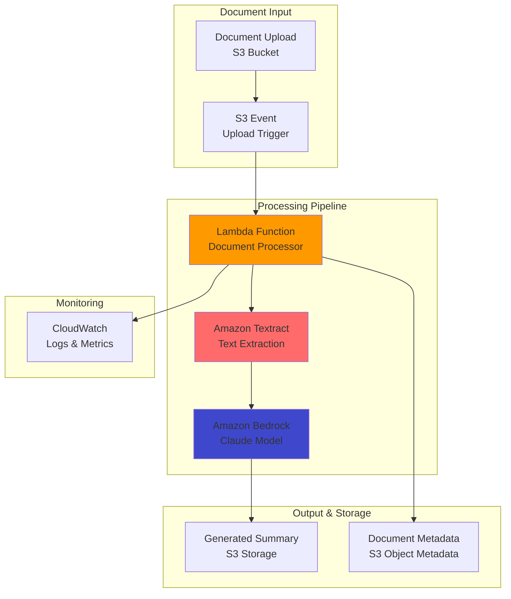

# Document Auto-Summarization with Bedrock

## Problem

Your organization receives hundreds of documents daily including contracts, reports, and research papers that require manual review and summarization. Teams spend hours reading through lengthy documents to extract key insights and create executive summaries. You need an automated solution that can intelligently analyze document content, extract important information, and generate concise summaries while maintaining accuracy and context, saving time and ensuring consistent analysis across your organization.

## Solution

Create an automated document summarization system using Amazon Bedrock's Claude model and AWS Lambda for serverless processing. The solution automatically processes documents uploaded to S3, extracts text content, generates intelligent summaries using advanced AI models, and stores results for easy access. This system provides consistent, high-quality document analysis while reducing manual effort and enabling teams to focus on decision-making rather than document review.

## Architecture Diagram



## Prerequisites

1. AWS account with permissions for Bedrock, Lambda, S3, and Textract
2. AWS CLI v2 installed and configured
3. Access to Amazon Bedrock Claude models (requires model access approval)
4. Sample documents (PDFs, images, text files) for testing
5. Basic understanding of serverless architecture and AWS IAM
6. Estimated cost: $20-100/month depending on document volume and processing frequency

> **Note**: Amazon Bedrock Claude models have usage-based pricing. Monitor costs during development and implement appropriate throttling for production use. See [Amazon Bedrock pricing](https://aws.amazon.com/bedrock/pricing/) for current rates.

## Preparation

```bash
# Set environment variables
export AWS_REGION=$(aws configure get region)
export AWS_ACCOUNT_ID=$(aws sts get-caller-identity \
    --query Account --output text)

# Generate unique identifiers for resources
RANDOM_SUFFIX=$(aws secretsmanager get-random-password \
    --exclude-punctuation --exclude-uppercase \
    --password-length 6 --require-each-included-type \
    --output text --query RandomPassword)

export INPUT_BUCKET="documents-input-${RANDOM_SUFFIX}"
export OUTPUT_BUCKET="summaries-output-${RANDOM_SUFFIX}"
export LAMBDA_FUNCTION_NAME="doc-summarizer-${RANDOM_SUFFIX}"

# Create S3 buckets with encryption enabled
aws s3 mb s3://${INPUT_BUCKET} --region ${AWS_REGION}
aws s3 mb s3://${OUTPUT_BUCKET} --region ${AWS_REGION}

# Enable server-side encryption for both buckets
aws s3api put-bucket-encryption \
    --bucket ${INPUT_BUCKET} \
    --server-side-encryption-configuration \
    'Rules=[{ApplyServerSideEncryptionByDefault:{SSEAlgorithm:AES256}}]'

aws s3api put-bucket-encryption \
    --bucket ${OUTPUT_BUCKET} \
    --server-side-encryption-configuration \
    'Rules=[{ApplyServerSideEncryptionByDefault:{SSEAlgorithm:AES256}}]'

echo "✅ Storage resources created with encryption enabled"
```

## Steps

1. **Create Document Processing Lambda Function**:

   AWS Lambda provides serverless compute that automatically scales based on document processing demand. The function orchestrates the entire summarization workflow, handling document text extraction with Amazon Textract, AI-powered summarization with Amazon Bedrock, and result storage. This serverless approach eliminates server management while maintaining cost efficiency through pay-per-invocation pricing.

   ```bash
   # Create Lambda deployment package
   mkdir doc-summarizer && cd doc-summarizer

   cat > lambda_function.py << 'EOF'
   import json
   import boto3
   import os
   from urllib.parse import unquote_plus
   import logging
   from datetime import datetime

   logger = logging.getLogger()
   logger.setLevel(logging.INFO)

   s3 = boto3.client('s3')
   textract = boto3.client('textract')
   bedrock = boto3.client('bedrock-runtime')

   def lambda_handler(event, context):
       try:
           # Parse S3 event
           bucket = event['Records'][0]['s3']['bucket']['name']
           key = unquote_plus(event['Records'][0]['s3']['object']['key'])
           
           logger.info(f"Processing document: {key} from bucket: {bucket}")
           
           # Extract text from document
           text_content = extract_text(bucket, key)
           
           # Generate summary using Bedrock
           summary = generate_summary(text_content)
           
           # Store summary with metadata
           store_summary(key, summary, text_content)
           
           return {
               'statusCode': 200,
               'body': json.dumps({
                   'message': 'Document processed successfully',
                   'document': key,
                   'summary_length': len(summary),
                   'original_length': len(text_content)
               })
           }
           
       except Exception as e:
           logger.error(f"Error processing document: {str(e)}")
           raise

   def extract_text(bucket, key):
       """Extract text from document using Amazon Textract"""
       try:
           response = textract.detect_document_text(
               Document={'S3Object': {'Bucket': bucket, 'Name': key}}
           )
           
           text_blocks = []
           for block in response['Blocks']:
               if block['BlockType'] == 'LINE':
                   text_blocks.append(block['Text'])
           
           extracted_text = '\n'.join(text_blocks)
           logger.info(f"Extracted {len(extracted_text)} characters from document")
           return extracted_text
           
       except Exception as e:
           logger.error(f"Text extraction failed: {str(e)}")
           raise

   def generate_summary(text_content):
       """Generate summary using Amazon Bedrock Claude model"""
       try:
           # Truncate text if too long for model context
           max_length = 15000
           if len(text_content) > max_length:
               text_content = text_content[:max_length] + "..."
               logger.info(f"Text truncated to {max_length} characters")
           
           prompt = f"""Please provide a comprehensive summary of the following document. Include:
           
   1. Main topics and key points
   2. Important facts, figures, and conclusions
   3. Actionable insights or recommendations
   4. Any critical deadlines or dates mentioned

   Document content:
   {text_content}

   Summary:"""
           
           response = bedrock.invoke_model(
               modelId='anthropic.claude-3-sonnet-20240229-v1:0',
               body=json.dumps({
                   'anthropic_version': 'bedrock-2023-05-31',
                   'max_tokens': 1000,
                   'temperature': 0.3,
                   'messages': [{'role': 'user', 'content': prompt}]
               })
           )
           
           response_body = json.loads(response['body'].read())
           summary = response_body['content'][0]['text']
           logger.info(f"Generated summary with {len(summary)} characters")
           return summary
           
       except Exception as e:
           logger.error(f"Summary generation failed: {str(e)}")
           raise

   def store_summary(original_key, summary, full_text):
       """Store summary and metadata in S3"""
       try:
           output_bucket = os.environ['OUTPUT_BUCKET']
           summary_key = f"summaries/{original_key}.summary.txt"
           
           # Store summary with comprehensive metadata
           s3.put_object(
               Bucket=output_bucket,
               Key=summary_key,
               Body=summary,
               ContentType='text/plain',
               Metadata={
                   'original-document': original_key,
                   'processing-date': datetime.utcnow().isoformat(),
                   'original-text-length': str(len(full_text)),
                   'summary-length': str(len(summary)),
                   'compression-ratio': str(round(len(summary) / len(full_text), 2))
               }
           )
           
           logger.info(f"Summary stored: {summary_key}")
           
       except Exception as e:
           logger.error(f"Failed to store summary: {str(e)}")
           raise
   EOF

   # Create requirements file
   cat > requirements.txt << 'EOF'
   boto3>=1.26.0
   EOF

   # Package Lambda function
   pip install -r requirements.txt -t .
   zip -r doc-summarizer.zip .

   cd ..
   echo "✅ Lambda function package created"
   ```

   The Lambda function uses Amazon Textract for accurate text extraction from various document formats including PDFs, images, and scanned documents. Textract automatically handles complex layouts and both printed and handwritten text with high accuracy, making it ideal for enterprise document processing workflows.

2. **Deploy Lambda Function with Proper IAM Permissions**:

   Proper IAM configuration ensures secure access to AWS services while following the principle of least privilege. The Lambda execution role grants only the minimum permissions needed for S3 access, Textract operations, and Bedrock model invocation, enhancing security posture while enabling full functionality.

   ```bash
   # Create IAM role for Lambda execution
   cat > lambda-trust-policy.json << 'EOF'
   {
       "Version": "2012-10-17",
       "Statement": [
           {
               "Effect": "Allow",
               "Principal": {
                   "Service": "lambda.amazonaws.com"
               },
               "Action": "sts:AssumeRole"
           }
       ]
   }
   EOF

   LAMBDA_ROLE_ARN=$(aws iam create-role \
       --role-name DocumentSummarizerRole-${RANDOM_SUFFIX} \
       --assume-role-policy-document file://lambda-trust-policy.json \
       --query 'Role.Arn' --output text)

   # Create comprehensive permissions policy
   cat > lambda-permissions-policy.json << EOF
   {
       "Version": "2012-10-17",
       "Statement": [
           {
               "Effect": "Allow",
               "Action": [
                   "logs:CreateLogGroup",
                   "logs:CreateLogStream",
                   "logs:PutLogEvents"
               ],
               "Resource": "arn:aws:logs:${AWS_REGION}:${AWS_ACCOUNT_ID}:*"
           },
           {
               "Effect": "Allow",
               "Action": [
                   "s3:GetObject"
               ],
               "Resource": "arn:aws:s3:::${INPUT_BUCKET}/*"
           },
           {
               "Effect": "Allow",
               "Action": [
                   "s3:PutObject"
               ],
               "Resource": "arn:aws:s3:::${OUTPUT_BUCKET}/*"
           },
           {
               "Effect": "Allow",
               "Action": [
                   "textract:DetectDocumentText"
               ],
               "Resource": "*"
           },
           {
               "Effect": "Allow",
               "Action": [
                   "bedrock:InvokeModel"
               ],
               "Resource": "arn:aws:bedrock:${AWS_REGION}::foundation-model/anthropic.claude-3-sonnet-20240229-v1:0"
           }
       ]
   }
   EOF

   aws iam put-role-policy \
       --role-name DocumentSummarizerRole-${RANDOM_SUFFIX} \
       --policy-name DocumentSummarizerPolicy \
       --policy-document file://lambda-permissions-policy.json

   # Wait for IAM role propagation
   sleep 15

   # Create Lambda function with latest Python runtime
   aws lambda create-function \
       --function-name $LAMBDA_FUNCTION_NAME \
       --runtime python3.12 \
       --role $LAMBDA_ROLE_ARN \
       --handler lambda_function.lambda_handler \
       --zip-file fileb://doc-summarizer/doc-summarizer.zip \
       --environment Variables="{OUTPUT_BUCKET=${OUTPUT_BUCKET}}" \
       --timeout 300 \
       --memory-size 512 \
       --description "Automated document summarization using Bedrock"

   echo "✅ Lambda function deployed with secure IAM permissions"
   ```

   The function is configured with 512MB memory and 5-minute timeout to handle large documents efficiently. These settings provide sufficient resources for text extraction and AI model invocation while maintaining cost optimization through appropriate resource allocation.

3. **Configure S3 Event Trigger for Automated Processing**:

   S3 event notifications create a fully automated, event-driven architecture that triggers document processing immediately upon upload. This eliminates manual intervention while providing scalable, reliable document processing that responds instantly to new content.

   ```bash
   # Configure S3 event notification for automated triggering
   cat > s3-notification-config.json << EOF
   {
       "LambdaConfigurations": [
           {
               "Id": "DocumentUploadTrigger",
               "LambdaFunctionArn": "arn:aws:lambda:${AWS_REGION}:${AWS_ACCOUNT_ID}:function:${LAMBDA_FUNCTION_NAME}",
               "Events": ["s3:ObjectCreated:*"],
               "Filter": {
                   "Key": {
                       "FilterRules": [
                           {
                               "Name": "prefix",
                               "Value": "documents/"
                           }
                       ]
                   }
               }
           }
       ]
   }
   EOF

   # Grant S3 permission to invoke Lambda function
   aws lambda add-permission \
       --function-name $LAMBDA_FUNCTION_NAME \
       --principal s3.amazonaws.com \
       --action lambda:InvokeFunction \
       --statement-id s3-trigger-permission \
       --source-arn arn:aws:s3:::${INPUT_BUCKET}

   # Apply notification configuration to S3 bucket
   aws s3api put-bucket-notification-configuration \
       --bucket $INPUT_BUCKET \
       --notification-configuration file://s3-notification-config.json

   echo "✅ S3 event trigger configured for automated processing"
   ```

   The event trigger is configured with a "documents/" prefix filter, enabling organized document management and selective processing. This allows for different processing rules based on document categories or types uploaded to specific prefixes within the bucket.

   > **Tip**: Use S3 object prefixes to organize different types of documents and apply different processing rules. For example, contracts/ vs reports/ prefixes can trigger different summarization strategies or route to different processing workflows.

## Validation & Testing

1. **Test document upload and processing workflow**:

   ```bash
   # Create comprehensive test document
   cat > test-document.txt << 'EOF'
   EXECUTIVE SUMMARY - Q3 2024 PERFORMANCE REPORT

   This quarterly report presents the financial performance and strategic initiatives of XYZ Corporation for Q3 2024. 

   KEY FINDINGS:
   - Revenue increased 15% year-over-year to $2.3M
   - Customer acquisition cost reduced by 8% to $120 per customer
   - New product line launched successfully in European markets
   - Digital transformation initiative completed ahead of schedule
   - Employee satisfaction scores improved to 4.2/5.0

   FINANCIAL METRICS:
   - Gross margin: 42% (up from 38% in Q2)
   - Operating expenses: $890K (within budget)
   - Net income: $340K (25% increase YoY)
   - Cash flow: Positive $280K for the quarter

   RECOMMENDATIONS:
   - Expand marketing budget for Q4 holiday season by 20%
   - Invest in additional customer service capacity
   - Explore partnership opportunities in Asian markets
   - Continue focus on operational efficiency improvements
   - Implement advanced analytics for customer insights

   RISK FACTORS:
   - Supply chain disruptions may impact Q4 delivery
   - Increased competition in core markets
   - Currency fluctuations affecting international operations

   The outlook for Q4 remains positive with projected growth of 12-18%.
   Next board meeting scheduled for January 15, 2025.
   EOF

   # Upload document to trigger automated processing
   aws s3 cp test-document.txt \
       s3://${INPUT_BUCKET}/documents/quarterly-report-q3-2024.txt

   echo "✅ Test document uploaded - processing initiated"
   ```

2. **Monitor processing execution and retrieve results**:

   ```bash
   # Check Lambda function logs for processing status
   LATEST_LOG_STREAM=$(aws logs describe-log-streams \
       --log-group-name "/aws/lambda/${LAMBDA_FUNCTION_NAME}" \
       --order-by LastEventTime --descending \
       --max-items 1 --query 'logStreams[0].logStreamName' \
       --output text)

   echo "Latest log stream: ${LATEST_LOG_STREAM}"

   # Wait for processing to complete
   echo "Waiting for document processing..."
   sleep 45

   # Verify summary generation
   aws s3 ls s3://${OUTPUT_BUCKET}/summaries/ --recursive

   # Download and display generated summary
   if aws s3 ls s3://${OUTPUT_BUCKET}/summaries/documents/quarterly-report-q3-2024.txt.summary.txt > /dev/null 2>&1; then
       aws s3 cp s3://${OUTPUT_BUCKET}/summaries/documents/quarterly-report-q3-2024.txt.summary.txt summary.txt
       echo "Generated Summary:"
       echo "=================="
       cat summary.txt
       echo -e "\n✅ Document successfully processed and summarized"
   else
       echo "⚠️ Summary not yet available - check CloudWatch logs"
   fi
   ```

3. **Verify system performance metrics**:

   ```bash
   # Check Lambda function invocation metrics
   aws cloudwatch get-metric-statistics \
       --namespace AWS/Lambda \
       --metric-name Invocations \
       --dimensions Name=FunctionName,Value=$LAMBDA_FUNCTION_NAME \
       --start-time $(date -u -d '1 hour ago' +%Y-%m-%dT%H:%M:%S) \
       --end-time $(date -u +%Y-%m-%dT%H:%M:%S) \
       --period 3600 \
       --statistics Sum

   # Check for any errors or throttling
   aws cloudwatch get-metric-statistics \
       --namespace AWS/Lambda \
       --metric-name Errors \
       --dimensions Name=FunctionName,Value=$LAMBDA_FUNCTION_NAME \
       --start-time $(date -u -d '1 hour ago' +%Y-%m-%dT%H:%M:%S) \
       --end-time $(date -u +%Y-%m-%dT%H:%M:%S) \
       --period 3600 \
       --statistics Sum
   ```

   Expected output: Successful invocation count of 1 with zero errors, indicating proper system functionality and reliable document processing.

   > **Warning**: Monitor Bedrock usage costs carefully, especially during initial testing. Consider implementing rate limiting and cost alerts to prevent unexpected charges from high-volume processing. Use [AWS Budgets](https://aws.amazon.com/aws-cost-management/aws-budgets/) to set spending thresholds.

## Cleanup

1. **Remove S3 event notification configuration**:

   ```bash
   # Disable S3 event notifications
   aws s3api put-bucket-notification-configuration \
       --bucket $INPUT_BUCKET \
       --notification-configuration '{}'
   
   echo "✅ S3 event notifications disabled"
   ```

2. **Delete Lambda function and IAM resources**:

   ```bash
   # Remove Lambda function
   aws lambda delete-function --function-name $LAMBDA_FUNCTION_NAME

   # Delete IAM role and policies
   aws iam delete-role-policy \
       --role-name DocumentSummarizerRole-${RANDOM_SUFFIX} \
       --policy-name DocumentSummarizerPolicy

   aws iam delete-role \
       --role-name DocumentSummarizerRole-${RANDOM_SUFFIX}

   echo "✅ Lambda function and IAM resources removed"
   ```

3. **Clean up S3 buckets and contents**:

   ```bash
   # Remove all objects and delete buckets
   aws s3 rb s3://${INPUT_BUCKET} --force
   aws s3 rb s3://${OUTPUT_BUCKET} --force

   echo "✅ S3 buckets and contents removed"
   ```

4. **Remove local files and directories**:

   ```bash
   # Clean up local files
   rm -rf doc-summarizer
   rm -f *.json *.txt summary.txt

   # Unset environment variables
   unset INPUT_BUCKET OUTPUT_BUCKET LAMBDA_FUNCTION_NAME RANDOM_SUFFIX

   echo "✅ Local cleanup completed"
   ```

## Discussion

This serverless document summarization system demonstrates the power of combining AWS's managed AI services with event-driven architecture. Amazon Textract provides enterprise-grade text extraction capabilities that handle various document formats, layouts, and even handwritten content with high accuracy, eliminating the need for complex document parsing logic. Amazon Bedrock's Claude model offers sophisticated natural language understanding and generation capabilities that create meaningful, contextual summaries while maintaining accuracy and relevance.

The serverless approach using AWS Lambda ensures cost efficiency by charging only for actual processing time, automatic scaling to handle varying document volumes, and minimal operational overhead. The event-driven design creates a responsive system that processes documents immediately upon upload while maintaining reliability through AWS's managed services and built-in error handling. This architecture follows the [AWS Well-Architected Framework](https://aws.amazon.com/architecture/well-architected/) principles, particularly focusing on operational excellence and cost optimization.

The solution's security posture follows AWS best practices with least-privilege IAM permissions, S3 bucket encryption, and VPC isolation capabilities. For production deployments, consider implementing additional security measures such as S3 bucket policies, CloudTrail logging, and AWS Config rules for compliance monitoring. The system's scalability allows processing from single documents to thousands of concurrent uploads without infrastructure changes, making it suitable for both small businesses and enterprise deployments.

> **Note**: Consider implementing document classification and routing logic to apply different summarization strategies based on document type, source, or content classification for more tailored results. Use [Amazon Comprehend](https://aws.amazon.com/comprehend/) for document classification and entity extraction to enhance summarization accuracy.

## Challenge

Enhance this system by implementing these progressive improvements:

1. **Multi-format document support**: Add processing for Word documents, PowerPoint presentations, and Excel files using additional AWS services or libraries
2. **Custom summarization templates**: Create different summary formats based on document type (contracts, reports, emails) with specialized prompts and output structures
3. **Web interface development**: Build a React-based web application with S3 pre-signed URLs for secure document upload and summary retrieval
4. **Advanced analytics integration**: Add sentiment analysis using Amazon Comprehend and key entity extraction to provide deeper document insights beyond basic summarization
5. **Enterprise dashboard**: Implement real-time analytics dashboards using Amazon QuickSight to track processing metrics, summary quality scores, and usage patterns over time

## Infrastructure Code

*Infrastructure code will be generated after recipe approval.*