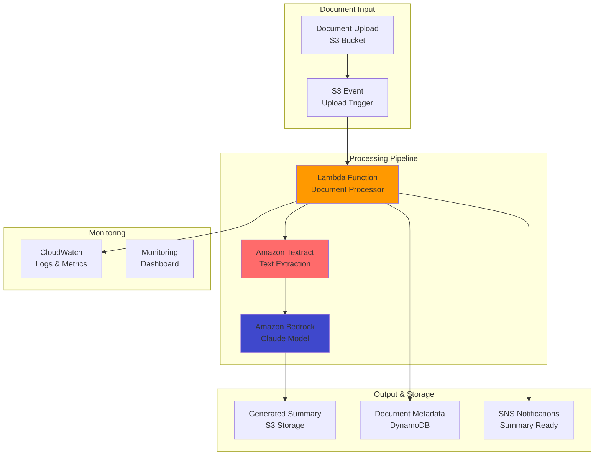

# Document Auto-Summarization with Bedrock

## Problem

Your organization receives hundreds of documents daily including contracts, reports, and research papers that require manual review and summarization. Teams spend hours reading through lengthy documents to extract key insights and create executive summaries. You need an automated solution that can intelligently analyze document content, extract important information, and generate concise summaries while maintaining accuracy and context, saving time and ensuring consistent analysis across your organization.

## Solution

Create an automated document summarization system using Amazon Bedrock's Claude model and AWS Lambda for serverless processing. The solution automatically processes documents uploaded to S3, extracts text content, generates intelligent summaries using advanced AI models, and stores results for easy access. This system provides consistent, high-quality document analysis while reducing manual effort and enabling teams to focus on decision-making rather than document review.

## Architecture Diagram



## Prerequisites

1. AWS account with permissions for Bedrock, Lambda, S3, and Textract
2. AWS CLI v2 installed and configured
3. Access to Amazon Bedrock Claude models
4. Sample documents (PDFs, images, text files) for testing
5. Basic understanding of serverless architecture
6. Estimated cost: $20-100/month depending on document volume and processing frequency

> **Note**: Amazon Bedrock Claude models have usage-based pricing. Monitor costs during development and implement appropriate throttling for production use.

## Preparation

```bash
# Set environment variables
export AWS_REGION=$(aws configure get region)
export AWS_ACCOUNT_ID=$(aws sts get-caller-identity \
    --query Account --output text)

# Generate unique identifiers
RANDOM_SUFFIX=$(aws secretsmanager get-random-password \
    --exclude-punctuation --exclude-uppercase \
    --password-length 6 --require-each-included-type \
    --output text --query RandomPassword)

export INPUT_BUCKET="documents-input-${RANDOM_SUFFIX}"
export OUTPUT_BUCKET="summaries-output-${RANDOM_SUFFIX}"
export LAMBDA_FUNCTION_NAME="doc-summarizer-${RANDOM_SUFFIX}"

# Create S3 buckets
aws s3 mb s3://${INPUT_BUCKET}
aws s3 mb s3://${OUTPUT_BUCKET}

echo "✅ Storage resources created"
```

## Steps

1. **Create Document Processing Lambda Function**:

   The Lambda function orchestrates the entire summarization workflow, handling document text extraction, AI-powered summarization, and result storage. It automatically scales to handle multiple documents concurrently while maintaining cost efficiency through serverless execution.

   ```bash
   # Create Lambda deployment package
   mkdir doc-summarizer && cd doc-summarizer

   cat > lambda_function.py << 'EOF'
   import json
   import boto3
   import os
   from urllib.parse import unquote_plus
   import logging

   logger = logging.getLogger()
   logger.setLevel(logging.INFO)

   s3 = boto3.client('s3')
   textract = boto3.client('textract')
   bedrock = boto3.client('bedrock-runtime')

   def lambda_handler(event, context):
       try:
           # Parse S3 event
           bucket = event['Records'][0]['s3']['bucket']['name']
           key = unquote_plus(event['Records'][0]['s3']['object']['key'])
           
           logger.info(f"Processing document: {key} from bucket: {bucket}")
           
           # Extract text from document
           text_content = extract_text(bucket, key)
           
           # Generate summary using Bedrock
           summary = generate_summary(text_content)
           
           # Store summary
           store_summary(key, summary, text_content)
           
           return {
               'statusCode': 200,
               'body': json.dumps({
                   'message': 'Document processed successfully',
                   'document': key,
                   'summary_length': len(summary)
               })
           }
           
       except Exception as e:
           logger.error(f"Error processing document: {str(e)}")
           raise

   def extract_text(bucket, key):
       """Extract text from document using Textract"""
       try:
           response = textract.detect_document_text(
               Document={'S3Object': {'Bucket': bucket, 'Name': key}}
           )
           
           text_blocks = []
           for block in response['Blocks']:
               if block['BlockType'] == 'LINE':
                   text_blocks.append(block['Text'])
           
           return '\n'.join(text_blocks)
           
       except Exception as e:
           logger.error(f"Text extraction failed: {str(e)}")
           raise

   def generate_summary(text_content):
       """Generate summary using Bedrock Claude"""
       try:
           # Truncate text if too long
           max_length = 10000
           if len(text_content) > max_length:
               text_content = text_content[:max_length] + "..."
           
           prompt = f"""Please provide a comprehensive summary of the following document. Include:
           
   1. Main topics and key points
   2. Important facts, figures, and conclusions
   3. Actionable insights or recommendations
   4. Any critical deadlines or dates mentioned

   Document content:
   {text_content}

   Summary:"""
           
           response = bedrock.invoke_model(
               modelId='anthropic.claude-3-sonnet-20240229-v1:0',
               body=json.dumps({
                   'anthropic_version': 'bedrock-2023-05-31',
                   'max_tokens': 1000,
                   'messages': [{'role': 'user', 'content': prompt}]
               })
           )
           
           response_body = json.loads(response['body'].read())
           return response_body['content'][0]['text']
           
       except Exception as e:
           logger.error(f"Summary generation failed: {str(e)}")
           raise

   def store_summary(original_key, summary, full_text):
       """Store summary and metadata in S3"""
       try:
           output_bucket = os.environ['OUTPUT_BUCKET']
           summary_key = f"summaries/{original_key}.summary.txt"
           
           # Store summary
           s3.put_object(
               Bucket=output_bucket,
               Key=summary_key,
               Body=summary,
               ContentType='text/plain',
               Metadata={
                   'original-document': original_key,
                   'summary-generated': 'true',
                   'text-length': str(len(full_text)),
                   'summary-length': str(len(summary))
               }
           )
           
           logger.info(f"Summary stored: {summary_key}")
           
       except Exception as e:
           logger.error(f"Failed to store summary: {str(e)}")
           raise
   EOF

   # Create requirements file
   cat > requirements.txt << 'EOF'
   boto3
   EOF

   # Package Lambda function
   pip install -r requirements.txt -t .
   zip -r doc-summarizer.zip .

   cd ..
   echo "✅ Lambda function package created"
   ```

   > **Note**: Amazon Textract supports various document formats including PDFs, images, and scanned documents. The service automatically handles text extraction with high accuracy for both printed and handwritten text.

2. **Deploy Lambda Function with Proper IAM Permissions**:

   The Lambda function requires specific permissions to access S3, Textract, and Bedrock services. Proper IAM configuration ensures secure access while following the principle of least privilege.

   ```bash
   # Create IAM role for Lambda
   cat > lambda-trust-policy.json << 'EOF'
   {
       "Version": "2012-10-17",
       "Statement": [
           {
               "Effect": "Allow",
               "Principal": {
                   "Service": "lambda.amazonaws.com"
               },
               "Action": "sts:AssumeRole"
           }
       ]
   }
   EOF

   LAMBDA_ROLE_ARN=$(aws iam create-role \
       --role-name DocumentSummarizerRole-${RANDOM_SUFFIX} \
       --assume-role-policy-document file://lambda-trust-policy.json \
       --query 'Role.Arn' --output text)

   # Create and attach custom policy
   cat > lambda-permissions-policy.json << EOF
   {
       "Version": "2012-10-17",
       "Statement": [
           {
               "Effect": "Allow",
               "Action": [
                   "logs:CreateLogGroup",
                   "logs:CreateLogStream",
                   "logs:PutLogEvents"
               ],
               "Resource": "arn:aws:logs:*:*:*"
           },
           {
               "Effect": "Allow",
               "Action": [
                   "s3:GetObject",
                   "s3:PutObject"
               ],
               "Resource": [
                   "arn:aws:s3:::${INPUT_BUCKET}/*",
                   "arn:aws:s3:::${OUTPUT_BUCKET}/*"
               ]
           },
           {
               "Effect": "Allow",
               "Action": [
                   "textract:DetectDocumentText"
               ],
               "Resource": "*"
           },
           {
               "Effect": "Allow",
               "Action": [
                   "bedrock:InvokeModel"
               ],
               "Resource": "arn:aws:bedrock:${AWS_REGION}::foundation-model/anthropic.claude-3-sonnet-20240229-v1:0"
           }
       ]
   }
   EOF

   aws iam put-role-policy \
       --role-name DocumentSummarizerRole-${RANDOM_SUFFIX} \
       --policy-name DocumentSummarizerPolicy \
       --policy-document file://lambda-permissions-policy.json

   # Wait for role propagation
   sleep 10

   # Create Lambda function
   aws lambda create-function \
       --function-name $LAMBDA_FUNCTION_NAME \
       --runtime python3.9 \
       --role $LAMBDA_ROLE_ARN \
       --handler lambda_function.lambda_handler \
       --zip-file fileb://doc-summarizer/doc-summarizer.zip \
       --environment Variables="{OUTPUT_BUCKET=${OUTPUT_BUCKET}}" \
       --timeout 300 \
       --memory-size 512

   echo "✅ Lambda function deployed"
   ```

3. **Configure S3 Event Trigger**:

   S3 event notifications automatically trigger the summarization process when new documents are uploaded. This creates a fully automated workflow that requires no manual intervention while maintaining scalability and reliability.

   ```bash
   # Configure S3 event notification
   cat > s3-notification-config.json << EOF
   {
       "LambdaConfiguration": {
           "Id": "DocumentUploadTrigger",
           "LambdaFunctionArn": "arn:aws:lambda:${AWS_REGION}:${AWS_ACCOUNT_ID}:function:${LAMBDA_FUNCTION_NAME}",
           "Events": ["s3:ObjectCreated:*"],
           "Filter": {
               "Key": {
                   "FilterRules": [
                       {
                           "Name": "prefix",
                           "Value": "documents/"
                       }
                   ]
               }
           }
       }
   }
   EOF

   # Add Lambda permission for S3
   aws lambda add-permission \
       --function-name $LAMBDA_FUNCTION_NAME \
       --principal s3.amazonaws.com \
       --action lambda:InvokeFunction \
       --statement-id s3-trigger \
       --source-arn arn:aws:s3:::${INPUT_BUCKET}

   # Configure S3 bucket notification
   aws s3api put-bucket-notification-configuration \
       --bucket $INPUT_BUCKET \
       --notification-configuration file://s3-notification-config.json

   echo "✅ S3 event trigger configured"
   ```

   > **Tip**: Use S3 object prefixes to organize different types of documents and apply different processing rules. For example, contracts/ vs reports/ prefixes can trigger different summarization strategies.

## Validation & Testing

1. Test document upload and processing:

   ```bash
   # Create test document
   cat > test-document.txt << 'EOF'
   EXECUTIVE SUMMARY

   This quarterly report presents the financial performance and strategic initiatives of XYZ Corporation for Q3 2024. 

   KEY FINDINGS:
   - Revenue increased 15% year-over-year to $2.3M
   - Customer acquisition cost reduced by 8%
   - New product line launched successfully in European markets
   - Digital transformation initiative completed ahead of schedule

   RECOMMENDATIONS:
   - Expand marketing budget for Q4 holiday season
   - Invest in additional customer service capacity
   - Explore partnership opportunities in Asian markets
   - Continue focus on operational efficiency improvements

   The outlook for Q4 remains positive with projected growth of 12-18%.
   EOF

   # Upload document to trigger processing
   aws s3 cp test-document.txt s3://${INPUT_BUCKET}/documents/

   echo "✅ Test document uploaded"
   ```

2. Monitor processing and retrieve summary:

   ```bash
   # Check Lambda execution logs
   aws logs describe-log-groups \
       --log-group-name-prefix "/aws/lambda/${LAMBDA_FUNCTION_NAME}"

   # Wait for processing to complete
   sleep 30

   # Check for generated summary
   aws s3 ls s3://${OUTPUT_BUCKET}/summaries/

   # Download and view summary
   aws s3 cp s3://${OUTPUT_BUCKET}/summaries/documents/test-document.txt.summary.txt summary.txt
   cat summary.txt
   ```

3. Verify system metrics:

   ```bash
   # Check Lambda function metrics
   aws cloudwatch get-metric-statistics \
       --namespace AWS/Lambda \
       --metric-name Invocations \
       --dimensions Name=FunctionName,Value=$LAMBDA_FUNCTION_NAME \
       --start-time $(date -u -d '1 hour ago' +%Y-%m-%dT%H:%M:%S) \
       --end-time $(date -u +%Y-%m-%dT%H:%M:%S) \
       --period 3600 \
       --statistics Sum
   ```

   > **Warning**: Monitor Bedrock usage costs carefully, especially during initial testing. Consider implementing rate limiting and cost alerts to prevent unexpected charges from high-volume processing.

## Cleanup

1. Remove S3 event notification:

   ```bash
   aws s3api put-bucket-notification-configuration \
       --bucket $INPUT_BUCKET \
       --notification-configuration '{}'
   ```

2. Delete Lambda function and role:

   ```bash
   aws lambda delete-function --function-name $LAMBDA_FUNCTION_NAME

   aws iam delete-role-policy \
       --role-name DocumentSummarizerRole-${RANDOM_SUFFIX} \
       --policy-name DocumentSummarizerPolicy

   aws iam delete-role --role-name DocumentSummarizerRole-${RANDOM_SUFFIX}
   ```

3. Clean up S3 buckets:

   ```bash
   aws s3 rb s3://${INPUT_BUCKET} --force
   aws s3 rb s3://${OUTPUT_BUCKET} --force
   ```

4. Remove local files:

   ```bash
   rm -rf doc-summarizer
   rm -f *.json *.txt
   ```

## Discussion

This serverless document summarization system demonstrates the power of combining AWS's managed AI services with event-driven architecture. Amazon Textract provides robust text extraction capabilities that handle various document formats and layouts, while Bedrock's Claude model offers sophisticated natural language understanding and generation capabilities that can create meaningful, contextual summaries.

The serverless approach ensures cost efficiency by only charging for actual processing time, automatic scaling to handle varying document volumes, and minimal operational overhead. The event-driven design creates a responsive system that processes documents immediately upon upload while maintaining reliability through AWS's managed services.

> **Note**: Consider implementing document classification and routing logic to apply different summarization strategies based on document type, source, or content classification for more tailored results.

## Challenge

Enhance this system by adding multi-format document support (Word, PowerPoint, Excel), implementing custom summarization templates for different document types, creating a web interface for document upload and summary retrieval, adding sentiment analysis and key entity extraction, and building analytics dashboards to track processing metrics and summary quality over time.

## Infrastructure Code

*Infrastructure code will be generated after recipe approval.*