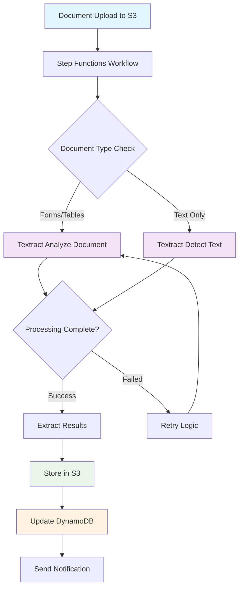

# Building Document Processing Pipelines with Amazon Textract and Step Functions

## Problem

Your organization processes thousands of documents daily including invoices, forms, receipts, and contracts. Manual data entry is time-consuming, error-prone, and doesn't scale. You need an automated solution that can extract structured data from various document formats, handle processing failures gracefully, and integrate with downstream business systems.

## Solution

Build an automated document processing pipeline using Amazon Textract for intelligent document analysis and AWS Step Functions for workflow orchestration, as shown in Figure 1. This solution processes documents uploaded to S3, extracts text and structured data, handles errors with retry logic, and stores results for further processing.



## Prerequisites

- AWS account with administrator access
- AWS CLI version 2 installed and configured
- Basic understanding of JSON and workflow concepts
- Sample documents (PDF, PNG, JPEG) for testing
- Estimated cost: $5-10 for testing with sample documents

## Steps

### Preparation

1. **Set up environment variables for consistent resource naming**:

   Environment variables ensure consistent naming across all resources and prevent conflicts with existing infrastructure. AWS Secrets Manager's random password generation creates unique identifiers that follow naming conventions while maintaining security.

   ```bash
   export AWS_ACCOUNT_ID=$(aws sts get-caller-identity \
   	--query Account --output text)
   export AWS_REGION=$(aws configure get region)
   export BUCKET_SUFFIX=$(aws secretsmanager get-random-password \
   	--exclude-punctuation --exclude-uppercase \
   	--password-length 6 --require-each-included-type \
   	--output text --query RandomPassword)
   export DOCUMENT_BUCKET="document-processing-$BUCKET_SUFFIX"
   export RESULTS_BUCKET="processing-results-$BUCKET_SUFFIX"
   ```

   These environment variables establish the foundation for all subsequent resource creation and ensure consistent naming throughout the pipeline.

2. **Create S3 buckets for document storage and results**:

   Amazon S3 provides the durable, scalable storage foundation for our document processing pipeline. S3 offers 99.999999999% (11 9's) durability and serves as both the input trigger and output destination for our workflow.

   ```bash
   aws s3api create-bucket --bucket $DOCUMENT_BUCKET \
   	--region $AWS_REGION
   ```

   ```bash
   aws s3api create-bucket --bucket $RESULTS_BUCKET \
   	--region $AWS_REGION
   ```

   The document bucket triggers processing workflows when files are uploaded, while the results bucket stores extracted text and metadata. This separation ensures clean organization and supports different access patterns for input and output data.

3. **Create a DynamoDB table to track processing status**:

   DynamoDB provides fast, scalable NoSQL database capabilities for tracking job metadata and processing status. The pay-per-request billing mode automatically scales with your workload without pre-provisioning capacity.

   ```bash
   aws dynamodb create-table \
   	--table-name DocumentProcessingJobs \
   	--attribute-definitions \
   		AttributeName=JobId,AttributeType=S \
   	--key-schema AttributeName=JobId,KeyType=HASH \
   	--billing-mode PAY_PER_REQUEST
   ```

   This table serves as the central audit log for all document processing activities, enabling monitoring, troubleshooting, and compliance reporting. The JobId key ensures fast lookups and updates throughout the processing lifecycle.

4. **Create an IAM role for Step Functions execution**:

   IAM roles provide secure, temporary credentials for AWS services to access other resources on your behalf. This role enables Step Functions to orchestrate Textract operations, S3 access, and DynamoDB updates without storing permanent credentials.

   ```bash
   cat > step-functions-trust-policy.json << 'EOF'
   {
     "Version": "2012-10-17",
     "Statement": [
       {
         "Effect": "Allow",
         "Principal": {
           "Service": "states.amazonaws.com"
         },
         "Action": "sts:AssumeRole"
       }
     ]
   }
   EOF
   ```

   ```bash
   aws iam create-role \
   	--role-name DocumentProcessingStepFunctionsRole \
   	--assume-role-policy-document \
   	file://step-functions-trust-policy.json
   ```

   The trust policy allows only the Step Functions service to assume this role, following the principle of least privilege. This ensures secure access to AWS resources while maintaining proper isolation between services.

5. Create and attach IAM policy for Step Functions:

```bash
cat > step-functions-policy.json << 'EOF'
{
  "Version": "2012-10-17",
  "Statement": [
    {
      "Effect": "Allow",
      "Action": [
        "textract:AnalyzeDocument",
        "textract:DetectDocumentText",
        "textract:GetDocumentAnalysis",
        "textract:GetDocumentTextDetection",
        "textract:StartDocumentAnalysis",
        "textract:StartDocumentTextDetection"
      ],
      "Resource": "*"
    },
    {
      "Effect": "Allow",
      "Action": [
        "s3:GetObject",
        "s3:PutObject"
      ],
      "Resource": [
        "arn:aws:s3:::document-processing-*/*",
        "arn:aws:s3:::processing-results-*/*"
      ]
    },
    {
      "Effect": "Allow",
      "Action": [
        "dynamodb:PutItem",
        "dynamodb:UpdateItem",
        "dynamodb:GetItem"
      ],
      "Resource": "arn:aws:dynamodb:*:*:table/DocumentProcessingJobs"
    },
    {
      "Effect": "Allow",
      "Action": [
        "sns:Publish"
      ],
      "Resource": "*"
    }
  ]
}
EOF
```

```bash
aws iam put-role-policy \
	--role-name DocumentProcessingStepFunctionsRole \
	--policy-name DocumentProcessingPolicy \
	--policy-document file://step-functions-policy.json
```

6. Create SNS topic for notifications:

```bash
NOTIFICATION_TOPIC_ARN=$(aws sns create-topic \
	--name DocumentProcessingNotifications \
	--query TopicArn --output text)
export NOTIFICATION_TOPIC_ARN
```

### Step 1: Create the Step Functions State Machine

1. **Create the state machine definition**:

   Step Functions state machines define workflows using Amazon States Language (ASL), a JSON-based language for describing state transitions, error handling, and parallel execution. This workflow implements intelligent document routing based on content type and provides robust error recovery.

   The state machine uses a Choice state to determine the appropriate Textract API based on document characteristics. Forms and tables require the more advanced [AnalyzeDocument API](https://docs.aws.amazon.com/textract/latest/dg/API_AnalyzeDocument.html), while simple text documents use the faster [DetectDocumentText API](https://docs.aws.amazon.com/textract/latest/dg/API_DetectDocumentText.html).

```bash
cat > document-processing-workflow.json << 'EOF'
{
  "Comment": "Document processing pipeline with Textract",
  "StartAt": "ProcessDocument",
  "States": {
    "ProcessDocument": {
      "Type": "Choice",
      "Choices": [
        {
          "Variable": "$.requiresAnalysis",
          "BooleanEquals": true,
          "Next": "AnalyzeDocument"
        }
      ],
      "Default": "DetectText"
    },
    "AnalyzeDocument": {
      "Type": "Task",
      "Resource": "arn:aws:states:::aws-sdk:textract:analyzeDocument",
      "Parameters": {
        "Document": {
          "S3Object": {
            "Bucket.$": "$.bucket",
            "Name.$": "$.key"
          }
        },
        "FeatureTypes": ["TABLES", "FORMS", "SIGNATURES"]
      },
      "Retry": [
        {
          "ErrorEquals": ["States.TaskFailed"],
          "IntervalSeconds": 5,
          "MaxAttempts": 3,
          "BackoffRate": 2.0
        }
      ],
      "Catch": [
        {
          "ErrorEquals": ["States.ALL"],
          "Next": "ProcessingFailed"
        }
      ],
      "Next": "StoreResults"
    },
    "DetectText": {
      "Type": "Task",
      "Resource": "arn:aws:states:::aws-sdk:textract:detectDocumentText",
      "Parameters": {
        "Document": {
          "S3Object": {
            "Bucket.$": "$.bucket",
            "Name.$": "$.key"
          }
        }
      },
      "Retry": [
        {
          "ErrorEquals": ["States.TaskFailed"],
          "IntervalSeconds": 5,
          "MaxAttempts": 3,
          "BackoffRate": 2.0
        }
      ],
      "Catch": [
        {
          "ErrorEquals": ["States.ALL"],
          "Next": "ProcessingFailed"
        }
      ],
      "Next": "StoreResults"
    },
    "StoreResults": {
      "Type": "Task",
      "Resource": "arn:aws:states:::aws-sdk:s3:putObject",
      "Parameters": {
        "Bucket": "processing-results-BUCKET_SUFFIX",
        "Key.$": "States.Format('{}/results.json', $.jobId)",
        "Body.$": "$"
      },
      "Next": "UpdateJobStatus"
    },
    "UpdateJobStatus": {
      "Type": "Task",
      "Resource": "arn:aws:states:::aws-sdk:dynamodb:putItem",
      "Parameters": {
        "TableName": "DocumentProcessingJobs",
        "Item": {
          "JobId": {
            "S.$": "$.jobId"
          },
          "Status": {
            "S": "COMPLETED"
          },
          "ProcessedAt": {
            "S.$": "$$.State.EnteredTime"
          },
          "ResultsLocation": {
            "S.$": "States.Format('s3://processing-results-BUCKET_SUFFIX/{}/results.json', $.jobId)"
          }
        }
      },
      "Next": "SendNotification"
    },
    "SendNotification": {
      "Type": "Task",
      "Resource": "arn:aws:states:::aws-sdk:sns:publish",
      "Parameters": {
        "TopicArn": "NOTIFICATION_TOPIC_ARN",
        "Message.$": "States.Format('Document processing completed for job {}', $.jobId)",
        "Subject": "Document Processing Complete"
      },
      "End": true
    },
    "ProcessingFailed": {
      "Type": "Task",
      "Resource": "arn:aws:states:::aws-sdk:dynamodb:putItem",
      "Parameters": {
        "TableName": "DocumentProcessingJobs",
        "Item": {
          "JobId": {
            "S.$": "$.jobId"
          },
          "Status": {
            "S": "FAILED"
          },
          "FailedAt": {
            "S.$": "$$.State.EnteredTime"
          },
          "Error": {
            "S.$": "$.Error"
          }
        }
      },
      "Next": "NotifyFailure"
    },
    "NotifyFailure": {
      "Type": "Task",
      "Resource": "arn:aws:states:::aws-sdk:sns:publish",
      "Parameters": {
        "TopicArn": "NOTIFICATION_TOPIC_ARN",
        "Message.$": "States.Format('Document processing failed for job {}', $.jobId)",
        "Subject": "Document Processing Failed"
      },
      "End": true
    }
  }
}
EOF
```

2. **Replace placeholders in the workflow definition**:

   Dynamic configuration allows the same state machine definition to work across different environments and AWS accounts. This templating approach supports Infrastructure as Code practices and deployment automation.

   ```bash
   sed -e "s/BUCKET_SUFFIX/${BUCKET_SUFFIX}/g" \
   	-e "s|NOTIFICATION_TOPIC_ARN|${NOTIFICATION_TOPIC_ARN}|g" \
   	document-processing-workflow.json > \
   	document-processing-workflow-final.json
   ```

   The sed command substitutes environment-specific values into the state machine definition, ensuring the workflow references the correct resources created in your AWS account.

> **Tip**: Step Functions supports both Standard and Express workflows. For document processing with auditing requirements, Standard workflows are recommended as they provide complete execution history and visual debugging capabilities.

3. **Create the Step Functions state machine**:

   Creating the state machine establishes the workflow engine that will orchestrate document processing. Step Functions provides visual workflow monitoring, automatic error handling, and integration with over 200 AWS services through optimized connectors.

   ```bash
   STEP_FUNCTIONS_ROLE_ARN="arn:aws:iam::${AWS_ACCOUNT_ID}:role/DocumentProcessingStepFunctionsRole"
   
   STATE_MACHINE_ARN=$(aws stepfunctions create-state-machine \
   	--name DocumentProcessingPipeline \
   	--definition file://document-processing-workflow-final.json \
   	--role-arn $STEP_FUNCTIONS_ROLE_ARN \
   	--query stateMachineArn --output text)
   
   export STATE_MACHINE_ARN
   ```

   The state machine is now ready to receive execution requests and will automatically handle document processing workflows with built-in retry logic and error handling as defined in the workflow definition.

### Step 2: Create a Lambda Function for Workflow Triggering

1. **Create a Lambda function to trigger the workflow when documents are uploaded**:

   AWS Lambda provides serverless compute capabilities that automatically scale with your workload. This function acts as the bridge between S3 events and Step Functions executions, analyzing document characteristics to determine the appropriate processing path.

   The function examines file extensions and naming patterns to decide whether documents require advanced analysis (forms, tables) or simple text extraction. This intelligent routing optimizes both performance and cost by using the most appropriate Textract API for each document type.

```bash
cat > lambda-trigger.py << 'EOF'
import json
import boto3
import uuid
from urllib.parse import unquote_plus

stepfunctions = boto3.client('stepfunctions')

def lambda_handler(event, context):
    for record in event['Records']:
        bucket = record['s3']['bucket']['name']
        key = unquote_plus(record['s3']['object']['key'])
        
        # Determine if document requires advanced analysis
        requires_analysis = key.lower().endswith(('.pdf', '.tiff')) or 'form' in key.lower()
        
        # Generate unique job ID
        job_id = str(uuid.uuid4())
        
        # Prepare input for Step Functions
        input_data = {
            'bucket': bucket,
            'key': key,
            'jobId': job_id,
            'requiresAnalysis': requires_analysis
        }
        
        # Start Step Functions execution
        response = stepfunctions.start_execution(
            stateMachineArn=os.environ['STATE_MACHINE_ARN'],
            name=f'doc-processing-{job_id}',
            input=json.dumps(input_data)
        )
        
        print(f'Started processing job {job_id} for document {key}')
    
    return {'statusCode': 200}
EOF
```

2. **Create deployment package and Lambda function**:

   Lambda functions are deployed as ZIP packages containing your code and dependencies. The function runtime environment includes the AWS SDK, enabling direct integration with Step Functions without additional dependencies.

   ```bash
   zip lambda-trigger.zip lambda-trigger.py
   
   aws lambda create-function \
   	--function-name DocumentProcessingTrigger \
   	--runtime python3.9 \
   	--role arn:aws:iam::${AWS_ACCOUNT_ID}:role/DocumentProcessingStepFunctionsRole \
   	--handler lambda-trigger.lambda_handler \
   	--zip-file fileb://lambda-trigger.zip \
   	--environment Variables="{STATE_MACHINE_ARN=${STATE_MACHINE_ARN}}"
   ```

   The function is now deployed and ready to respond to S3 events. Environment variables provide secure access to the state machine ARN without hardcoding values in the function code.

> **Warning**: Ensure your Lambda function has the necessary IAM permissions to execute Step Functions workflows. The function should have the `states:StartExecution` permission for your state machine.

### Step 3: Configure S3 Event Notifications

1. **Add S3 trigger permission for Lambda**:

   Resource-based policies control which AWS services can invoke your Lambda function. This permission allows S3 to trigger the Lambda function when objects are created in the document bucket, establishing the event-driven processing pipeline.

   ```bash
   aws lambda add-permission \
   	--function-name DocumentProcessingTrigger \
   	--principal s3.amazonaws.com \
   	--action lambda:InvokeFunction \
   	--source-arn arn:aws:s3:::${DOCUMENT_BUCKET} \
   	--statement-id s3-trigger-permission
   ```

   This permission follows the principle of least privilege by limiting S3 access to only the specific bucket containing documents for processing.

2. **Configure S3 bucket notification**:

   S3 event notifications enable real-time processing by triggering Lambda functions when objects are created, modified, or deleted. The notification configuration includes filters to process only relevant file types, reducing unnecessary function invocations and costs.

   ```bash
   cat > s3-notification.json << 'EOF'
   {
     "LambdaConfigurations": [
       {
         "Id": "DocumentProcessingTrigger",
         "LambdaFunctionArn": "LAMBDA_FUNCTION_ARN",
         "Events": ["s3:ObjectCreated:*"],
         "Filter": {
           "Key": {
             "FilterRules": [
               {
                 "Name": "suffix",
                 "Value": ".pdf"
               }
             ]
           }
         }
       }
     ]
   }
   EOF
   ```

   ```bash
   LAMBDA_FUNCTION_ARN="arn:aws:lambda:${AWS_REGION}:${AWS_ACCOUNT_ID}:function:DocumentProcessingTrigger"
   
   sed "s|LAMBDA_FUNCTION_ARN|${LAMBDA_FUNCTION_ARN}|g" \
   	s3-notification.json > s3-notification-final.json
   
   aws s3api put-bucket-notification-configuration \
   	--bucket $DOCUMENT_BUCKET \
   	--notification-configuration \
   	file://s3-notification-final.json
   ```

   The bucket notification is now configured to automatically trigger document processing when PDF files are uploaded. This completes the event-driven architecture that connects S3 uploads to Step Functions workflows.

## Validation & Testing

### Test Document Processing

1. Upload a sample document to trigger the pipeline:

```bash
# Download a sample PDF for testing
curl -o sample-invoice.pdf \
	"https://www.w3.org/WAI/ER/tests/xhtml/testfiles/resources/pdf/dummy.pdf"

aws s3 cp sample-invoice.pdf s3://${DOCUMENT_BUCKET}/
```

2. Monitor the Step Functions execution:

```bash
# List recent executions
aws stepfunctions list-executions \
	--state-machine-arn $STATE_MACHINE_ARN \
	--max-items 5
```

3. Check the processing results:

```bash
# List objects in results bucket
aws s3 ls s3://${RESULTS_BUCKET}/ --recursive
```

4. Verify DynamoDB records:

```bash
aws dynamodb scan --table-name DocumentProcessingJobs \
	--select "ALL_ATTRIBUTES" --max-items 5
```

### Expected Results

- Step Functions execution should complete successfully
- Results JSON file should appear in the results S3 bucket
- DynamoDB table should contain job status record
- SNS notification should be sent upon completion

> **Note**: Processing time varies based on document complexity. Simple text documents process in seconds, while complex forms with tables may take 1-2 minutes.

## Cleanup

1. Delete the Step Functions state machine:

```bash
aws stepfunctions delete-state-machine \
	--state-machine-arn $STATE_MACHINE_ARN
```

2. Delete Lambda function:

```bash
aws lambda delete-function \
	--function-name DocumentProcessingTrigger
```

3. Delete DynamoDB table:

```bash
aws dynamodb delete-table \
	--table-name DocumentProcessingJobs
```

4. Delete S3 buckets and contents:

```bash
aws s3 rm s3://${DOCUMENT_BUCKET} --recursive
aws s3api delete-bucket --bucket $DOCUMENT_BUCKET

aws s3 rm s3://${RESULTS_BUCKET} --recursive
aws s3api delete-bucket --bucket $RESULTS_BUCKET
```

5. Delete SNS topic:

```bash
aws sns delete-topic --topic-arn $NOTIFICATION_TOPIC_ARN
```

6. Delete IAM role and policies:

```bash
aws iam delete-role-policy \
	--role-name DocumentProcessingStepFunctionsRole \
	--policy-name DocumentProcessingPolicy

aws iam delete-role \
	--role-name DocumentProcessingStepFunctionsRole
```

7. Clean up local files:

```bash
rm -f *.json *.py *.zip *.pdf
```

## Discussion

This document processing pipeline demonstrates the power of combining Amazon Textract's intelligent document analysis with Step Functions' workflow orchestration capabilities. Amazon Textract goes beyond simple OCR by understanding document structure, extracting key-value pairs from forms, and preserving table relationships. When integrated with Step Functions, you create a resilient, scalable processing pipeline that can handle various document types and processing requirements.

The choice between Textract's `DetectDocumentText` and `AnalyzeDocument` APIs depends on your specific needs. Simple text extraction is faster and more cost-effective for basic documents, while document analysis provides rich structured data extraction from forms and tables. The pipeline automatically determines which approach to use based on document characteristics.

Step Functions provides several key benefits for document processing workflows: built-in error handling and retry logic, visual workflow monitoring, state management between processing steps, and integration with other AWS services without custom code. The service's pay-per-use model makes it cost-effective for variable workloads, while its durability ensures processing continues even if individual components fail.

For production deployments, consider implementing additional features such as document classification to route different document types to specialized processing paths, integration with Amazon Comprehend for entity extraction and sentiment analysis, or connection to Amazon A2I (Augmented AI) for human review of low-confidence results.

Sources:
- [Amazon Textract Developer Guide](https://docs.aws.amazon.com/textract/latest/dg/what-is.html)
- [AWS Step Functions Developer Guide](https://docs.aws.amazon.com/step-functions/latest/dg/welcome.html)
- [Textract Best Practices](https://docs.aws.amazon.com/textract/latest/dg/textract-best-practices.html)
- [Step Functions Best Practices](https://docs.aws.amazon.com/step-functions/latest/dg/sfn-best-practices.html)
- [DetectDocumentText API Reference](https://docs.aws.amazon.com/textract/latest/dg/API_DetectDocumentText.html)
- [AnalyzeDocument API Reference](https://docs.aws.amazon.com/textract/latest/dg/API_AnalyzeDocument.html)

## Challenge

Extend this pipeline to handle multi-page documents using Textract's asynchronous APIs. Implement a mechanism to track long-running jobs and aggregate results from multiple pages. Consider adding document classification using Amazon Comprehend to automatically route different document types to specialized processing workflows.

## Infrastructure Code

*Infrastructure code will be generated after recipe approval.*