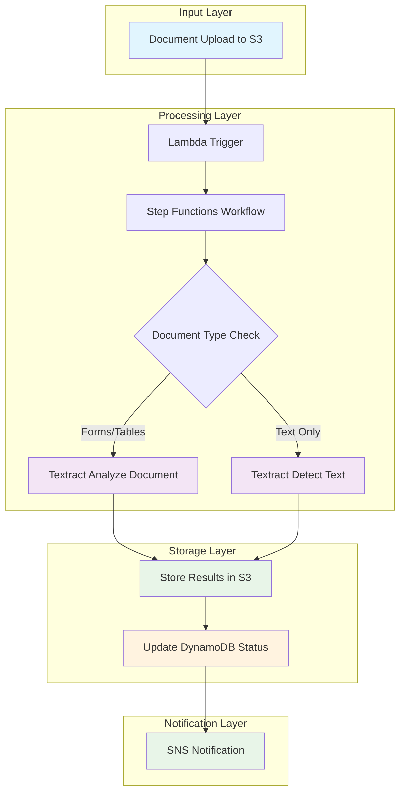

# Building Document Processing Pipelines with Amazon Textract and Step Functions

## Problem

Your organization processes thousands of documents daily including invoices, forms, receipts, and contracts. Manual data entry is time-consuming, error-prone, and doesn't scale. You need an automated solution that can extract structured data from various document formats, handle processing failures gracefully, and integrate with downstream business systems.

## Solution

Build an automated document processing pipeline using Amazon Textract for intelligent document analysis and AWS Step Functions for workflow orchestration. This solution processes documents uploaded to S3, extracts text and structured data, handles errors with retry logic, and stores results for further processing.

## Architecture Diagram



## Prerequisites

1. AWS account with administrator access or the following permissions:
   - IAM: CreateRole, AttachRolePolicy, PassRole
   - S3: CreateBucket, PutObject, GetObject
   - Lambda: CreateFunction, InvokeFunction
   - Step Functions: CreateStateMachine, StartExecution
   - Textract: AnalyzeDocument, DetectDocumentText
   - DynamoDB: CreateTable, PutItem, UpdateItem
   - SNS: CreateTopic, Publish
2. AWS CLI version 2.0 or later installed and configured
3. Basic understanding of JSON, IAM policies, and serverless architecture
4. Sample documents (PDF, PNG, JPEG) for testing
5. Estimated cost: $5-15 for testing with sample documents (varies by document complexity and processing volume)

> **Note**: Textract pricing varies by document complexity and API used. AnalyzeDocument costs more than DetectDocumentText but provides richer structured data extraction capabilities.

## Preparation

1. **Set up environment variables for consistent resource naming**:

   Environment variables ensure consistent naming across all resources and prevent conflicts with existing infrastructure. AWS Secrets Manager's random password generation creates unique identifiers that follow naming conventions while maintaining security.

   ```bash
   export AWS_ACCOUNT_ID=$(aws sts get-caller-identity \
       --query Account --output text)
   export AWS_REGION=$(aws configure get region)
   export BUCKET_SUFFIX=$(aws secretsmanager get-random-password \
       --exclude-punctuation --exclude-uppercase \
       --password-length 6 --require-each-included-type \
       --output text --query RandomPassword)
   export DOCUMENT_BUCKET="document-processing-$BUCKET_SUFFIX"
   export RESULTS_BUCKET="processing-results-$BUCKET_SUFFIX"
   
   echo "✅ Environment variables configured"
   ```

   These environment variables establish the foundation for all subsequent resource creation and ensure consistent naming throughout the pipeline.

2. **Create S3 buckets for document storage and results**:

   Amazon S3 provides the durable, scalable storage foundation for our document processing pipeline. S3 offers 99.999999999% (11 9's) durability and serves as both the input trigger and output destination for our workflow.

   ```bash
   # Create document bucket (input)
   if [ "$AWS_REGION" = "us-east-1" ]; then
       aws s3api create-bucket --bucket $DOCUMENT_BUCKET
   else
       aws s3api create-bucket --bucket $DOCUMENT_BUCKET \
           --region $AWS_REGION \
           --create-bucket-configuration \
           LocationConstraint=$AWS_REGION
   fi
   
   # Create results bucket (output)
   if [ "$AWS_REGION" = "us-east-1" ]; then
       aws s3api create-bucket --bucket $RESULTS_BUCKET
   else
       aws s3api create-bucket --bucket $RESULTS_BUCKET \
           --region $AWS_REGION \
           --create-bucket-configuration \
           LocationConstraint=$AWS_REGION
   fi
   
   # Enable versioning for better data protection
   aws s3api put-bucket-versioning \
       --bucket $DOCUMENT_BUCKET \
       --versioning-configuration Status=Enabled
       
   aws s3api put-bucket-versioning \
       --bucket $RESULTS_BUCKET \
       --versioning-configuration Status=Enabled
   
   echo "✅ S3 buckets created with versioning enabled"
   ```

   The document bucket triggers processing workflows when files are uploaded, while the results bucket stores extracted text and metadata. This separation ensures clean organization and supports different access patterns for input and output data.

3. **Create a DynamoDB table to track processing status**:

   DynamoDB provides fast, scalable NoSQL database capabilities for tracking job metadata and processing status. The pay-per-request billing mode automatically scales with your workload without pre-provisioning capacity.

   ```bash
   aws dynamodb create-table \
       --table-name DocumentProcessingJobs \
       --attribute-definitions \
           AttributeName=JobId,AttributeType=S \
       --key-schema AttributeName=JobId,KeyType=HASH \
       --billing-mode PAY_PER_REQUEST \
       --tags Key=Project,Value=DocumentProcessing
   
   echo "✅ DynamoDB table created"
   ```

   This table serves as the central audit log for all document processing activities, enabling monitoring, troubleshooting, and compliance reporting. The JobId key ensures fast lookups and updates throughout the processing lifecycle.

4. **Create SNS topic for notifications**:

   Amazon SNS provides reliable, scalable messaging for real-time notifications about processing status, enabling integration with downstream systems and alerting mechanisms.

   ```bash
   NOTIFICATION_TOPIC_ARN=$(aws sns create-topic \
       --name DocumentProcessingNotifications \
       --query TopicArn --output text)
   export NOTIFICATION_TOPIC_ARN
   
   echo "✅ SNS topic created: $NOTIFICATION_TOPIC_ARN"
   ```

   The SNS topic enables flexible notification distribution to multiple endpoints including email, SMS, SQS queues, or Lambda functions for further processing automation.

5. **Create an IAM role for Step Functions execution**:

   IAM roles provide secure, temporary credentials for AWS services to access other resources on your behalf. This role enables Step Functions to orchestrate Textract operations, S3 access, and DynamoDB updates without storing permanent credentials.

   ```bash
   cat > step-functions-trust-policy.json << 'EOF'
   {
     "Version": "2012-10-17",
     "Statement": [
       {
         "Effect": "Allow",
         "Principal": {
           "Service": "states.amazonaws.com"
         },
         "Action": "sts:AssumeRole"
       }
     ]
   }
   EOF
   
   aws iam create-role \
       --role-name DocumentProcessingStepFunctionsRole \
       --assume-role-policy-document \
       file://step-functions-trust-policy.json \
       --tags Key=Project,Value=DocumentProcessing
   
   echo "✅ IAM role created"
   ```

   The trust policy allows only the Step Functions service to assume this role, following the principle of least privilege. This ensures secure access to AWS resources while maintaining proper isolation between services.

6. **Create and attach IAM policy for Step Functions**:

   This comprehensive policy grants the Step Functions state machine the minimum required permissions to execute Textract operations, manage S3 objects, update DynamoDB records, and send SNS notifications.

   ```bash
   cat > step-functions-policy.json << 'EOF'
   {
     "Version": "2012-10-17",
     "Statement": [
       {
         "Effect": "Allow",
         "Action": [
           "textract:AnalyzeDocument",
           "textract:DetectDocumentText"
         ],
         "Resource": "*"
       },
       {
         "Effect": "Allow",
         "Action": [
           "s3:GetObject",
           "s3:PutObject"
         ],
         "Resource": [
           "arn:aws:s3:::document-processing-*/*",
           "arn:aws:s3:::processing-results-*/*"
         ]
       },
       {
         "Effect": "Allow",
         "Action": [
           "dynamodb:PutItem",
           "dynamodb:UpdateItem",
           "dynamodb:GetItem"
         ],
         "Resource": [
           "arn:aws:dynamodb:*:*:table/DocumentProcessingJobs"
         ]
       },
       {
         "Effect": "Allow",
         "Action": [
           "sns:Publish"
         ],
         "Resource": "*"
       }
     ]
   }
   EOF
   
   aws iam put-role-policy \
       --role-name DocumentProcessingStepFunctionsRole \
       --policy-name DocumentProcessingPolicy \
       --policy-document file://step-functions-policy.json
   
   echo "✅ IAM policy attached to role"
   ```

   This policy follows AWS security best practices by granting only the minimum permissions required for the workflow to function, with resource-level restrictions where possible.

7. **Create IAM role for Lambda function**:

   The Lambda function requires its own IAM role with permissions to start Step Functions executions and write CloudWatch logs for monitoring and debugging.

   ```bash
   cat > lambda-trust-policy.json << 'EOF'
   {
     "Version": "2012-10-17",
     "Statement": [
       {
         "Effect": "Allow",
         "Principal": {
           "Service": "lambda.amazonaws.com"
         },
         "Action": "sts:AssumeRole"
       }
     ]
   }
   EOF
   
   aws iam create-role \
       --role-name DocumentProcessingLambdaRole \
       --assume-role-policy-document \
       file://lambda-trust-policy.json \
       --tags Key=Project,Value=DocumentProcessing
   
   # Attach basic Lambda execution policy
   aws iam attach-role-policy \
       --role-name DocumentProcessingLambdaRole \
       --policy-arn \
       arn:aws:iam::aws:policy/service-role/AWSLambdaBasicExecutionRole
   
   # Create and attach Step Functions execution policy
   cat > lambda-stepfunctions-policy.json << 'EOF'
   {
     "Version": "2012-10-17",
     "Statement": [
       {
         "Effect": "Allow",
         "Action": [
           "states:StartExecution"
         ],
         "Resource": "arn:aws:states:*:*:stateMachine:DocumentProcessingPipeline"
       }
     ]
   }
   EOF
   
   aws iam put-role-policy \
       --role-name DocumentProcessingLambdaRole \
       --policy-name StepFunctionsExecutionPolicy \
       --policy-document file://lambda-stepfunctions-policy.json
   
   echo "✅ Lambda IAM role and policies created"
   ```

## Steps

### Step 1: Create the Step Functions State Machine

1. **Create the state machine definition**:

   Step Functions state machines define workflows using Amazon States Language (ASL), a JSON-based language for describing state transitions, error handling, and parallel execution. This workflow implements intelligent document routing based on content type and provides robust error recovery.

   The state machine uses a Choice state to determine the appropriate Textract API based on document characteristics. Forms and tables require the more advanced [AnalyzeDocument API](https://docs.aws.amazon.com/textract/latest/dg/API_AnalyzeDocument.html), while simple text documents use the faster [DetectDocumentText API](https://docs.aws.amazon.com/textract/latest/dg/API_DetectDocumentText.html).

   ```bash
   cat > document-processing-workflow.json << 'EOF'
   {
     "Comment": "Document processing pipeline with Textract",
     "StartAt": "ProcessDocument",
     "States": {
       "ProcessDocument": {
         "Type": "Choice",
         "Choices": [
           {
             "Variable": "$.requiresAnalysis",
             "BooleanEquals": true,
             "Next": "AnalyzeDocument"
           }
         ],
         "Default": "DetectText"
       },
       "AnalyzeDocument": {
         "Type": "Task",
         "Resource": "arn:aws:states:::aws-sdk:textract:analyzeDocument",
         "Parameters": {
           "Document": {
             "S3Object": {
               "Bucket.$": "$.bucket",
               "Name.$": "$.key"
             }
           },
           "FeatureTypes": ["TABLES", "FORMS", "SIGNATURES"]
         },
         "Retry": [
           {
             "ErrorEquals": ["States.TaskFailed"],
             "IntervalSeconds": 5,
             "MaxAttempts": 3,
             "BackoffRate": 2.0
           }
         ],
         "Catch": [
           {
             "ErrorEquals": ["States.ALL"],
             "Next": "ProcessingFailed",
             "ResultPath": "$.error"
           }
         ],
         "Next": "StoreResults"
       },
       "DetectText": {
         "Type": "Task",
         "Resource": "arn:aws:states:::aws-sdk:textract:detectDocumentText",
         "Parameters": {
           "Document": {
             "S3Object": {
               "Bucket.$": "$.bucket",
               "Name.$": "$.key"
             }
           }
         },
         "Retry": [
           {
             "ErrorEquals": ["States.TaskFailed"],
             "IntervalSeconds": 5,
             "MaxAttempts": 3,
             "BackoffRate": 2.0
           }
         ],
         "Catch": [
           {
             "ErrorEquals": ["States.ALL"],
             "Next": "ProcessingFailed",
             "ResultPath": "$.error"
           }
         ],
         "Next": "StoreResults"
       },
       "StoreResults": {
         "Type": "Task",
         "Resource": "arn:aws:states:::aws-sdk:s3:putObject",
         "Parameters": {
           "Bucket": "RESULTS_BUCKET_PLACEHOLDER",
           "Key.$": "States.Format('{}/results.json', $.jobId)",
           "Body.$": "States.JsonToString($)"
         },
         "Next": "UpdateJobStatus"
       },
       "UpdateJobStatus": {
         "Type": "Task",
         "Resource": "arn:aws:states:::aws-sdk:dynamodb:putItem",
         "Parameters": {
           "TableName": "DocumentProcessingJobs",
           "Item": {
             "JobId": {
               "S.$": "$.jobId"
             },
             "Status": {
               "S": "COMPLETED"
             },
             "ProcessedAt": {
               "S.$": "$$.State.EnteredTime"
             },
             "ResultsLocation": {
               "S.$": "States.Format('s3://RESULTS_BUCKET_PLACEHOLDER/{}/results.json', $.jobId)"
             },
             "DocumentKey": {
               "S.$": "$.key"
             },
             "DocumentBucket": {
               "S.$": "$.bucket"
             }
           }
         },
         "Next": "SendNotification"
       },
       "SendNotification": {
         "Type": "Task",
         "Resource": "arn:aws:states:::aws-sdk:sns:publish",
         "Parameters": {
           "TopicArn": "NOTIFICATION_TOPIC_ARN_PLACEHOLDER",
           "Message.$": "States.Format('Document processing completed successfully for job {}. Results available at s3://RESULTS_BUCKET_PLACEHOLDER/{}/results.json', $.jobId, $.jobId)",
           "Subject": "Document Processing Complete"
         },
         "End": true
       },
       "ProcessingFailed": {
         "Type": "Task",
         "Resource": "arn:aws:states:::aws-sdk:dynamodb:putItem",
         "Parameters": {
           "TableName": "DocumentProcessingJobs",
           "Item": {
             "JobId": {
               "S.$": "$.jobId"
             },
             "Status": {
               "S": "FAILED"
             },
             "FailedAt": {
               "S.$": "$$.State.EnteredTime"
             },
             "Error": {
               "S.$": "$.error.Cause"
             },
             "DocumentKey": {
               "S.$": "$.key"
             },
             "DocumentBucket": {
               "S.$": "$.bucket"
             }
           }
         },
         "Next": "NotifyFailure"
       },
       "NotifyFailure": {
         "Type": "Task",
         "Resource": "arn:aws:states:::aws-sdk:sns:publish",
         "Parameters": {
           "TopicArn": "NOTIFICATION_TOPIC_ARN_PLACEHOLDER",
           "Message.$": "States.Format('Document processing failed for job {}. Error: {}', $.jobId, $.error.Cause)",
           "Subject": "Document Processing Failed"
         },
         "End": true
       }
     }
   }
   EOF
   ```

2. **Replace placeholders in the workflow definition**:

   Dynamic configuration allows the same state machine definition to work across different environments and AWS accounts. This templating approach supports Infrastructure as Code practices and deployment automation.

   ```bash
   sed -e "s/RESULTS_BUCKET_PLACEHOLDER/${RESULTS_BUCKET}/g" \
       -e "s|NOTIFICATION_TOPIC_ARN_PLACEHOLDER|${NOTIFICATION_TOPIC_ARN}|g" \
       document-processing-workflow.json > \
       document-processing-workflow-final.json
   
   echo "✅ Workflow definition customized for environment"
   ```

   The sed command substitutes environment-specific values into the state machine definition, ensuring the workflow references the correct resources created in your AWS account.

> **Tip**: Step Functions supports both Standard and Express workflows. For document processing with auditing requirements, Standard workflows are recommended as they provide complete execution history and visual debugging capabilities.

3. **Create the Step Functions state machine**:

   Creating the state machine establishes the workflow engine that will orchestrate document processing. Step Functions provides visual workflow monitoring, automatic error handling, and integration with over 200 AWS services through optimized connectors.

   ```bash
   STEP_FUNCTIONS_ROLE_ARN="arn:aws:iam::${AWS_ACCOUNT_ID}:role/DocumentProcessingStepFunctionsRole"
   
   STATE_MACHINE_ARN=$(aws stepfunctions create-state-machine \
       --name DocumentProcessingPipeline \
       --definition file://document-processing-workflow-final.json \
       --role-arn $STEP_FUNCTIONS_ROLE_ARN \
       --query stateMachineArn --output text)
   
   export STATE_MACHINE_ARN
   
   echo "✅ Step Functions state machine created: $STATE_MACHINE_ARN"
   ```

   The state machine is now ready to receive execution requests and will automatically handle document processing workflows with built-in retry logic and error handling as defined in the workflow definition.

### Step 2: Create a Lambda Function for Workflow Triggering

1. **Create a Lambda function to trigger the workflow when documents are uploaded**:

   AWS Lambda provides serverless compute capabilities that automatically scale with your workload. This function acts as the bridge between S3 events and Step Functions executions, analyzing document characteristics to determine the appropriate processing path.

   The function examines file extensions and naming patterns to decide whether documents require advanced analysis (forms, tables) or simple text extraction. This intelligent routing optimizes both performance and cost by using the most appropriate Textract API for each document type.

   ```bash
   cat > lambda-trigger.py << 'EOF'
   import json
   import boto3
   import uuid
   import os
   from urllib.parse import unquote_plus
   
   stepfunctions = boto3.client('stepfunctions')
   
   def lambda_handler(event, context):
       """
       Process S3 events and trigger Step Functions workflows for document processing.
       
       This function analyzes uploaded documents to determine the appropriate
       Textract API (AnalyzeDocument vs DetectDocumentText) based on file
       characteristics and triggers the Step Functions workflow.
       """
       
       for record in event['Records']:
           try:
               bucket = record['s3']['bucket']['name']
               key = unquote_plus(record['s3']['object']['key'])
               
               # Skip processing if file is in results bucket
               if 'processing-results' in bucket:
                   print(f'Skipping file in results bucket: {key}')
                   continue
               
               # Determine if document requires advanced analysis
               # PDF and TIFF files often contain forms/tables
               # Files with 'form' or 'invoice' in name likely need analysis
               file_extension = key.lower().split('.')[-1] if '.' in key else ''
               requires_analysis = (
                   file_extension in ['pdf', 'tiff', 'tif'] or
                   any(keyword in key.lower() for keyword in ['form', 'invoice', 'receipt', 'contract'])
               )
               
               # Generate unique job ID
               job_id = str(uuid.uuid4())
               
               # Prepare input for Step Functions
               input_data = {
                   'bucket': bucket,
                   'key': key,
                   'jobId': job_id,
                   'requiresAnalysis': requires_analysis,
                   'timestamp': context.aws_request_id
               }
               
               # Start Step Functions execution
               response = stepfunctions.start_execution(
                   stateMachineArn=os.environ['STATE_MACHINE_ARN'],
                   name=f'doc-processing-{job_id}',
                   input=json.dumps(input_data)
               )
               
               print(f'Started processing job {job_id} for document {key} (analysis required: {requires_analysis})')
               
           except Exception as e:
               print(f'Error processing record: {str(e)}')
               # Don't re-raise to avoid Lambda retries for malformed records
               continue
       
       return {
           'statusCode': 200,
           'body': json.dumps('Processing completed')
       }
   EOF
   ```

2. **Create deployment package and Lambda function**:

   Lambda functions are deployed as ZIP packages containing your code and dependencies. The function runtime environment includes the AWS SDK, enabling direct integration with Step Functions without additional dependencies.

   ```bash
   zip lambda-trigger.zip lambda-trigger.py
   
   LAMBDA_ROLE_ARN="arn:aws:iam::${AWS_ACCOUNT_ID}:role/DocumentProcessingLambdaRole"
   
   aws lambda create-function \
       --function-name DocumentProcessingTrigger \
       --runtime python3.12 \
       --role $LAMBDA_ROLE_ARN \
       --handler lambda-trigger.lambda_handler \
       --zip-file fileb://lambda-trigger.zip \
       --timeout 60 \
       --memory-size 256 \
       --environment Variables="{STATE_MACHINE_ARN=${STATE_MACHINE_ARN}}" \
       --tags Project=DocumentProcessing
   
   echo "✅ Lambda function created and configured"
   ```

   The function is now deployed and ready to respond to S3 events. Environment variables provide secure access to the state machine ARN without hardcoding values in the function code.

> **Warning**: Ensure your Lambda function has the necessary IAM permissions to execute Step Functions workflows. The function should have the `states:StartExecution` permission for your state machine.

### Step 3: Configure S3 Event Notifications

1. **Add S3 trigger permission for Lambda**:

   Resource-based policies control which AWS services can invoke your Lambda function. This permission allows S3 to trigger the Lambda function when objects are created in the document bucket, establishing the event-driven processing pipeline.

   ```bash
   aws lambda add-permission \
       --function-name DocumentProcessingTrigger \
       --principal s3.amazonaws.com \
       --action lambda:InvokeFunction \
       --source-arn arn:aws:s3:::${DOCUMENT_BUCKET} \
       --statement-id s3-trigger-permission
   
   echo "✅ Lambda permission granted for S3 triggers"
   ```

   This permission follows the principle of least privilege by limiting S3 access to only the specific bucket containing documents for processing.

2. **Configure S3 bucket notification**:

   S3 event notifications enable real-time processing by triggering Lambda functions when objects are created, modified, or deleted. The notification configuration includes filters to process multiple file types while reducing unnecessary function invocations.

   ```bash
   LAMBDA_FUNCTION_ARN="arn:aws:lambda:${AWS_REGION}:${AWS_ACCOUNT_ID}:function:DocumentProcessingTrigger"
   
   cat > s3-notification.json << EOF
   {
     "LambdaConfigurations": [
       {
         "Id": "DocumentProcessingTrigger",
         "LambdaFunctionArn": "${LAMBDA_FUNCTION_ARN}",
         "Events": ["s3:ObjectCreated:*"],
         "Filter": {
           "Key": {
             "FilterRules": [
               {
                 "Name": "suffix",
                 "Value": ".pdf"
               }
             ]
           }
         }
       },
       {
         "Id": "DocumentProcessingTriggerImages",
         "LambdaFunctionArn": "${LAMBDA_FUNCTION_ARN}",
         "Events": ["s3:ObjectCreated:*"],
         "Filter": {
           "Key": {
             "FilterRules": [
               {
                 "Name": "suffix",
                 "Value": ".png"
               }
             ]
           }
         }
       },
       {
         "Id": "DocumentProcessingTriggerJPEG",
         "LambdaFunctionArn": "${LAMBDA_FUNCTION_ARN}",
         "Events": ["s3:ObjectCreated:*"],
         "Filter": {
           "Key": {
             "FilterRules": [
               {
                 "Name": "suffix",
                 "Value": ".jpg"
               }
             ]
           }
         }
       }
     ]
   }
   EOF
   
   aws s3api put-bucket-notification-configuration \
       --bucket $DOCUMENT_BUCKET \
       --notification-configuration \
       file://s3-notification.json
   
   echo "✅ S3 event notifications configured for multiple file types"
   ```

   The bucket notification is now configured to automatically trigger document processing when supported document files are uploaded. This completes the event-driven architecture that connects S3 uploads to Step Functions workflows.

## Validation & Testing

1. **Upload a sample document to trigger the pipeline**:

   ```bash
   # Create a simple test document
   echo "This is a test document for processing." > test-document.txt
   
   # Convert to PDF using available tools or upload directly
   aws s3 cp test-document.txt s3://${DOCUMENT_BUCKET}/test-document.pdf
   
   echo "✅ Test document uploaded"
   ```

2. **Monitor the Step Functions execution**:

   ```bash
   # List recent executions
   aws stepfunctions list-executions \
       --state-machine-arn $STATE_MACHINE_ARN \
       --max-items 5
   
   # Get execution details
   EXECUTION_ARN=$(aws stepfunctions list-executions \
       --state-machine-arn $STATE_MACHINE_ARN \
       --max-items 1 \
       --query 'executions[0].executionArn' \
       --output text)
   
   if [ "$EXECUTION_ARN" != "None" ]; then
       aws stepfunctions describe-execution \
           --execution-arn $EXECUTION_ARN
   fi
   ```

3. **Check the processing results**:

   ```bash
   # List objects in results bucket
   echo "Results in bucket:"
   aws s3 ls s3://${RESULTS_BUCKET}/ --recursive
   
   # Get a sample result file if available
   RESULT_FILE=$(aws s3 ls s3://${RESULTS_BUCKET}/ --recursive | \
       head -1 | awk '{print $4}')
   
   if [ ! -z "$RESULT_FILE" ]; then
       echo "Sample result content:"
       aws s3 cp s3://${RESULTS_BUCKET}/$RESULT_FILE - | head -20
   fi
   ```

4. **Verify DynamoDB records**:

   ```bash
   aws dynamodb scan --table-name DocumentProcessingJobs \
       --select "ALL_ATTRIBUTES" --max-items 5
   ```

### Expected Results

- Step Functions execution should complete successfully within 30-60 seconds
- Results JSON file should appear in the results S3 bucket containing extracted text
- DynamoDB table should contain job status record with COMPLETED status
- SNS notification should be sent upon completion
- CloudWatch logs should show Lambda function execution details

> **Note**: Processing time varies based on document complexity. Simple text documents process in seconds, while complex forms with tables may take 1-2 minutes. Large documents may require asynchronous processing APIs for production use.

## Cleanup

1. **Delete the Step Functions state machine**:

   ```bash
   aws stepfunctions delete-state-machine \
       --state-machine-arn $STATE_MACHINE_ARN
   
   echo "✅ Step Functions state machine deleted"
   ```

2. **Delete Lambda function**:

   ```bash
   aws lambda delete-function \
       --function-name DocumentProcessingTrigger
   
   echo "✅ Lambda function deleted"
   ```

3. **Delete DynamoDB table**:

   ```bash
   aws dynamodb delete-table \
       --table-name DocumentProcessingJobs
   
   echo "✅ DynamoDB table deleted"
   ```

4. **Delete S3 buckets and contents**:

   ```bash
   # Remove all objects and versions
   aws s3 rm s3://${DOCUMENT_BUCKET} --recursive
   aws s3api delete-bucket --bucket $DOCUMENT_BUCKET
   
   aws s3 rm s3://${RESULTS_BUCKET} --recursive
   aws s3api delete-bucket --bucket $RESULTS_BUCKET
   
   echo "✅ S3 buckets and contents deleted"
   ```

5. **Delete SNS topic**:

   ```bash
   aws sns delete-topic --topic-arn $NOTIFICATION_TOPIC_ARN
   
   echo "✅ SNS topic deleted"
   ```

6. **Delete IAM roles and policies**:

   ```bash
   # Delete Step Functions role
   aws iam delete-role-policy \
       --role-name DocumentProcessingStepFunctionsRole \
       --policy-name DocumentProcessingPolicy
   
   aws iam delete-role \
       --role-name DocumentProcessingStepFunctionsRole
   
   # Delete Lambda role
   aws iam detach-role-policy \
       --role-name DocumentProcessingLambdaRole \
       --policy-arn \
       arn:aws:iam::aws:policy/service-role/AWSLambdaBasicExecutionRole
   
   aws iam delete-role-policy \
       --role-name DocumentProcessingLambdaRole \
       --policy-name StepFunctionsExecutionPolicy
   
   aws iam delete-role \
       --role-name DocumentProcessingLambdaRole
   
   echo "✅ IAM roles and policies deleted"
   ```

7. **Clean up local files**:

   ```bash
   rm -f *.json *.py *.zip *.txt *.pdf
   
   echo "✅ Local files cleaned up"
   ```

## Discussion

This document processing pipeline demonstrates the power of combining Amazon Textract's intelligent document analysis with Step Functions' workflow orchestration capabilities. Amazon Textract goes beyond simple OCR by understanding document structure, extracting key-value pairs from forms, and preserving table relationships. When integrated with Step Functions, you create a resilient, scalable processing pipeline that can handle various document types and processing requirements.

The choice between Textract's `DetectDocumentText` and `AnalyzeDocument` APIs depends on your specific needs and cost considerations. Simple text extraction using `DetectDocumentText` costs approximately $0.0015 per page, while document analysis with `AnalyzeDocument` costs around $0.05 per page but provides rich structured data extraction from forms and tables. The pipeline automatically determines which approach to use based on document characteristics, optimizing both cost and functionality.

Step Functions provides several key benefits for document processing workflows: built-in error handling and retry logic with exponential backoff, visual workflow monitoring through the AWS console, state management between processing steps, and integration with over 200 AWS services through optimized connectors. The service's pay-per-use model makes it cost-effective for variable workloads, charging approximately $0.025 for every 1,000 state transitions, while its durability ensures processing continues even if individual components fail.

For production deployments, consider implementing additional features such as document classification using Amazon Comprehend to route different document types to specialized processing paths, integration with Amazon A2I (Augmented AI) for human review of low-confidence results, or implementing batch processing capabilities for high-volume scenarios. You might also want to add dead letter queues for failed processing attempts and implement more sophisticated monitoring using CloudWatch alarms and dashboards.

Sources:
- [Amazon Textract Developer Guide](https://docs.aws.amazon.com/textract/latest/dg/what-is.html)
- [AWS Step Functions Developer Guide](https://docs.aws.amazon.com/step-functions/latest/dg/welcome.html)
- [Textract Best Practices](https://docs.aws.amazon.com/textract/latest/dg/textract-best-practices.html)
- [Step Functions Best Practices](https://docs.aws.amazon.com/step-functions/latest/dg/sfn-best-practices.html)
- [DetectDocumentText API Reference](https://docs.aws.amazon.com/textract/latest/dg/API_DetectDocumentText.html)
- [AnalyzeDocument API Reference](https://docs.aws.amazon.com/textract/latest/dg/API_AnalyzeDocument.html)
- [AWS Step Functions Pricing](https://aws.amazon.com/step-functions/pricing/)
- [Amazon Textract Pricing](https://aws.amazon.com/textract/pricing/)

## Challenge

Extend this pipeline to handle multi-page documents using Textract's asynchronous APIs (`StartDocumentAnalysis` and `StartDocumentTextDetection`). Implement a callback pattern in Step Functions to handle long-running jobs and aggregate results from multiple pages. Consider adding document classification using Amazon Comprehend to automatically route different document types to specialized processing workflows, and implement a human-in-the-loop review process using Amazon A2I for documents with low confidence scores.

## Infrastructure Code

### Available Infrastructure as Code:

- [Infrastructure Code Overview](code/README.md) - Detailed description of all infrastructure components
- [AWS CDK (Python)](code/cdk-python/) - AWS CDK Python implementation
- [AWS CDK (TypeScript)](code/cdk-typescript/) - AWS CDK TypeScript implementation
- [CloudFormation](code/cloudformation.yaml) - AWS CloudFormation template
- [Bash CLI Scripts](code/scripts/) - Example bash scripts using AWS CLI commands to deploy infrastructure
- [Terraform](code/terraform/) - Terraform configuration files