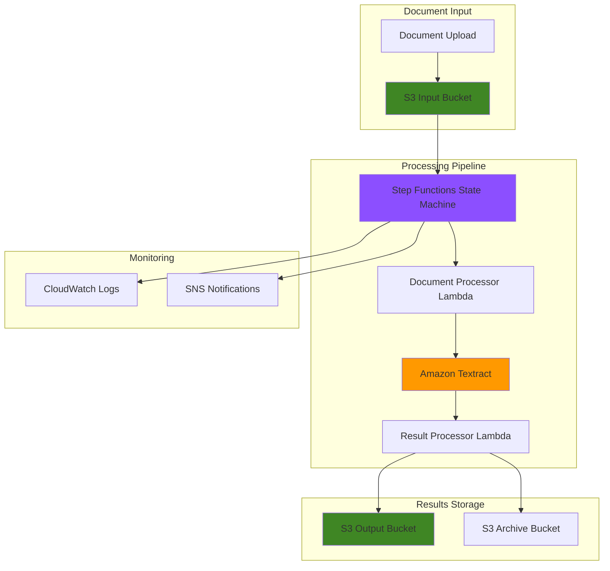

# Document Processing Pipelines with Textract

## Problem

Organizations process thousands of documents daily—invoices, contracts, forms, and reports—requiring manual data extraction that consumes significant time and introduces human errors. Traditional OCR solutions lack intelligence to understand document context, struggle with varying formats, and require extensive manual configuration for each document type. Without automated workflows, document processing creates bottlenecks that delay business decisions and increase operational costs.

## Solution

Build an intelligent, serverless document processing pipeline using Amazon Textract for AI-powered text and data extraction, orchestrated by AWS Step Functions for reliable workflow management. This solution automatically detects text, tables, and form data from various document formats, processes results through customizable business logic, and stores structured output for downstream analytics and decision-making systems.

## Architecture Diagram



## Prerequisites

1. AWS account with appropriate permissions for Textract, Step Functions, Lambda, S3, and IAM
2. AWS CLI v2 installed and configured (or AWS CloudShell)
3. Basic understanding of serverless architectures and document processing workflows
4. Familiarity with JSON and AWS IAM policies
5. Estimated cost: $5-15 for testing with sample documents (varies based on document size and processing volume)

> **Note**: Amazon Textract pricing is based on the number of pages processed. Review the [Textract pricing page](https://aws.amazon.com/textract/pricing/) for current rates and consider implementing page limits for cost control during testing.

## Preparation

```bash
# Set environment variables
export AWS_REGION=$(aws configure get region)
export AWS_ACCOUNT_ID=$(aws sts get-caller-identity \
    --query Account --output text)

# Generate unique identifiers for resources
RANDOM_SUFFIX=$(aws secretsmanager get-random-password \
    --exclude-punctuation --exclude-uppercase \
    --password-length 6 --require-each-included-type \
    --output text --query RandomPassword)

export PROJECT_NAME="textract-pipeline-${RANDOM_SUFFIX}"
export INPUT_BUCKET="${PROJECT_NAME}-input"
export OUTPUT_BUCKET="${PROJECT_NAME}-output"
export ARCHIVE_BUCKET="${PROJECT_NAME}-archive"

# Create S3 buckets for document processing pipeline
aws s3 mb s3://${INPUT_BUCKET} --region ${AWS_REGION}
aws s3 mb s3://${OUTPUT_BUCKET} --region ${AWS_REGION}
aws s3 mb s3://${ARCHIVE_BUCKET} --region ${AWS_REGION}

echo "✅ S3 buckets created for document processing pipeline"
```

## Steps

1. **Create IAM Role for Step Functions Execution**:

   AWS Step Functions requires specific IAM permissions to orchestrate the document processing workflow, including the ability to invoke Lambda functions, access S3 buckets, and interact with Amazon Textract. This role enables secure, automated workflow execution while following the principle of least privilege for enterprise security requirements. IAM roles provide temporary, rotatable credentials that are more secure than long-term access keys.

   ```bash
   # Create trust policy for Step Functions
   cat > step-functions-trust-policy.json << 'EOF'
   {
     "Version": "2012-10-17",
     "Statement": [
       {
         "Effect": "Allow",
         "Principal": {
           "Service": "states.amazonaws.com"
         },
         "Action": "sts:AssumeRole"
       }
     ]
   }
   EOF
   
   # Create IAM role for Step Functions
   aws iam create-role \
       --role-name ${PROJECT_NAME}-stepfunctions-role \
       --assume-role-policy-document file://step-functions-trust-policy.json
   
   # Create execution policy with specific resource permissions
   cat > step-functions-policy.json << EOF
   {
     "Version": "2012-10-17",
     "Statement": [
       {
         "Effect": "Allow",
         "Action": [
           "lambda:InvokeFunction"
         ],
         "Resource": [
           "arn:aws:lambda:${AWS_REGION}:${AWS_ACCOUNT_ID}:function:${PROJECT_NAME}-*"
         ]
       },
       {
         "Effect": "Allow",
         "Action": [
           "textract:StartDocumentAnalysis",
           "textract:StartDocumentTextDetection",
           "textract:GetDocumentAnalysis",
           "textract:GetDocumentTextDetection"
         ],
         "Resource": "*"
       },
       {
         "Effect": "Allow",
         "Action": [
           "s3:GetObject",
           "s3:PutObject"
         ],
         "Resource": [
           "arn:aws:s3:::${INPUT_BUCKET}/*",
           "arn:aws:s3:::${OUTPUT_BUCKET}/*",
           "arn:aws:s3:::${ARCHIVE_BUCKET}/*"
         ]
       },
       {
         "Effect": "Allow",
         "Action": [
           "logs:CreateLogGroup",
           "logs:CreateLogStream",
           "logs:PutLogEvents"
         ],
         "Resource": "arn:aws:logs:${AWS_REGION}:${AWS_ACCOUNT_ID}:*"
       }
     ]
   }
   EOF
   
   # Attach policy to role
   aws iam put-role-policy \
       --role-name ${PROJECT_NAME}-stepfunctions-role \
       --policy-name StepFunctionsExecutionPolicy \
       --policy-document file://step-functions-policy.json
   
   export STEPFUNCTIONS_ROLE_ARN="arn:aws:iam::${AWS_ACCOUNT_ID}:role/${PROJECT_NAME}-stepfunctions-role"
   
   echo "✅ Step Functions execution role created with comprehensive permissions"
   ```

   The IAM role now provides Step Functions with the necessary permissions to coordinate the entire document processing pipeline, ensuring secure access to all required AWS services while maintaining proper security boundaries through resource-specific permissions.

2. **Create Lambda Function for Document Processing Initiation**:

   Lambda functions provide the serverless compute layer that bridges Step Functions orchestration with Amazon Textract's document analysis capabilities. This function handles document type detection, initiates appropriate Textract operations, and manages asynchronous processing workflows essential for scalable document processing architectures. Lambda's automatic scaling ensures the system can handle varying document volumes without infrastructure management.

   ```bash
   # Create Lambda execution role
   cat > lambda-trust-policy.json << 'EOF'
   {
     "Version": "2012-10-17",
     "Statement": [
       {
         "Effect": "Allow",
         "Principal": {
           "Service": "lambda.amazonaws.com"
         },
         "Action": "sts:AssumeRole"
       }
     ]
   }
   EOF
   
   aws iam create-role \
       --role-name ${PROJECT_NAME}-lambda-role \
       --assume-role-policy-document file://lambda-trust-policy.json
   
   # Wait for IAM role propagation
   sleep 10
   
   # Attach managed policies for Lambda execution
   aws iam attach-role-policy \
       --role-name ${PROJECT_NAME}-lambda-role \
       --policy-arn arn:aws:iam::aws:policy/service-role/AWSLambdaBasicExecutionRole
   
   aws iam attach-role-policy \
       --role-name ${PROJECT_NAME}-lambda-role \
       --policy-arn arn:aws:iam::aws:policy/AmazonTextractFullAccess
   
   aws iam attach-role-policy \
       --role-name ${PROJECT_NAME}-lambda-role \
       --policy-arn arn:aws:iam::aws:policy/AmazonS3FullAccess
   
   aws iam attach-role-policy \
       --role-name ${PROJECT_NAME}-lambda-role \
       --policy-arn arn:aws:iam::aws:policy/AWSStepFunctionsFullAccess
   
   export LAMBDA_ROLE_ARN="arn:aws:iam::${AWS_ACCOUNT_ID}:role/${PROJECT_NAME}-lambda-role"
   
   # Create document processor Lambda function
   cat > document-processor.py << 'EOF'
   import json
   import boto3
   import logging
   from urllib.parse import unquote_plus
   
   logger = logging.getLogger()
   logger.setLevel(logging.INFO)
   
   textract = boto3.client('textract')
   s3 = boto3.client('s3')
   
   def lambda_handler(event, context):
       try:
           # Extract S3 information from event
           bucket = event['bucket']
           key = unquote_plus(event['key'])
           
           logger.info(f"Processing document: s3://{bucket}/{key}")
           
           # Determine document type and processing method
           file_extension = key.lower().split('.')[-1]
           
           # Configure Textract parameters based on document type
           if file_extension in ['pdf', 'png', 'jpg', 'jpeg', 'tiff']:
               # Start document analysis for complex documents
               response = textract.start_document_analysis(
                   DocumentLocation={
                       'S3Object': {
                           'Bucket': bucket,
                           'Name': key
                       }
                   },
                   FeatureTypes=['TABLES', 'FORMS', 'SIGNATURES']
               )
               
               job_id = response['JobId']
               
               return {
                   'statusCode': 200,
                   'jobId': job_id,
                   'jobType': 'ANALYSIS',
                   'bucket': bucket,
                   'key': key,
                   'documentType': file_extension
               }
           else:
               raise ValueError(f"Unsupported file type: {file_extension}")
               
       except Exception as e:
           logger.error(f"Error processing document: {str(e)}")
           return {
               'statusCode': 500,
               'error': str(e)
           }
   EOF
   
   # Package and deploy Lambda function
   zip -j document-processor.zip document-processor.py
   
   aws lambda create-function \
       --function-name ${PROJECT_NAME}-document-processor \
       --runtime python3.11 \
       --role ${LAMBDA_ROLE_ARN} \
       --handler document-processor.lambda_handler \
       --zip-file fileb://document-processor.zip \
       --timeout 60 \
       --memory-size 256 \
       --description "Initiates Textract document processing"
   
   echo "✅ Document processor Lambda function deployed"
   ```

   The Lambda function now intelligently handles different document types and initiates appropriate Textract analysis operations, providing the foundation for automated document processing with built-in error handling and logging capabilities. The function uses the latest Python runtime for optimal performance and security.

3. **Create Lambda Function for Results Processing**:

   Processing Textract results requires sophisticated parsing and transformation logic to convert raw extraction data into structured, business-ready formats. This Lambda function handles asynchronous result retrieval, data validation, and output formatting, ensuring reliable processing of complex documents with tables, forms, and multi-page content. The function implements robust error handling and provides detailed metadata for downstream analytics systems.

   ```bash
   # Create results processor Lambda function
   cat > results-processor.py << 'EOF'
   import json
   import boto3
   import logging
   from datetime import datetime
   
   logger = logging.getLogger()
   logger.setLevel(logging.INFO)
   
   textract = boto3.client('textract')
   s3 = boto3.client('s3')
   
   def lambda_handler(event, context):
       try:
           job_id = event['jobId']
           job_type = event['jobType']
           bucket = event['bucket']
           key = event['key']
           
           logger.info(f"Processing results for job: {job_id}")
           
           # Get Textract results based on job type
           if job_type == 'ANALYSIS':
               response = textract.get_document_analysis(JobId=job_id)
           else:
               response = textract.get_document_text_detection(JobId=job_id)
           
           # Check job status
           job_status = response['JobStatus']
           
           if job_status == 'SUCCEEDED':
               # Process and structure the results
               processed_data = {
                   'timestamp': datetime.utcnow().isoformat(),
                   'sourceDocument': f"s3://{bucket}/{key}",
                   'jobId': job_id,
                   'jobType': job_type,
                   'documentMetadata': response.get('DocumentMetadata', {}),
                   'extractedData': {
                       'text': [],
                       'tables': [],
                       'forms': []
                   }
               }
               
               # Parse blocks and extract meaningful data
               blocks = response.get('Blocks', [])
               
               for block in blocks:
                   if block['BlockType'] == 'LINE':
                       processed_data['extractedData']['text'].append({
                           'text': block.get('Text', ''),
                           'confidence': block.get('Confidence', 0),
                           'geometry': block.get('Geometry', {})
                       })
                   elif block['BlockType'] == 'TABLE':
                       # Process table data with enhanced metadata
                       table_data = {
                           'id': block.get('Id', ''),
                           'confidence': block.get('Confidence', 0),
                           'geometry': block.get('Geometry', {}),
                           'rowCount': block.get('RowCount', 0),
                           'columnCount': block.get('ColumnCount', 0)
                       }
                       processed_data['extractedData']['tables'].append(table_data)
                   elif block['BlockType'] == 'KEY_VALUE_SET':
                       # Process form data
                       if block.get('EntityTypes') and 'KEY' in block['EntityTypes']:
                           form_data = {
                               'id': block.get('Id', ''),
                               'confidence': block.get('Confidence', 0),
                               'geometry': block.get('Geometry', {}),
                               'text': block.get('Text', '')
                           }
                           processed_data['extractedData']['forms'].append(form_data)
               
               # Save processed results to S3 output bucket
               output_key = f"processed/{key.replace('.', '_')}_results.json"
               
               s3.put_object(
                   Bucket=event.get('outputBucket', bucket),
                   Key=output_key,
                   Body=json.dumps(processed_data, indent=2),
                   ContentType='application/json',
                   Metadata={
                       'source-bucket': bucket,
                       'source-key': key,
                       'processing-timestamp': datetime.utcnow().isoformat()
                   }
               )
               
               # Archive original document with date-based organization
               if 'archiveBucket' in event:
                   archive_key = f"archive/{datetime.utcnow().strftime('%Y/%m/%d')}/{key}"
                   s3.copy_object(
                       CopySource={'Bucket': bucket, 'Key': key},
                       Bucket=event['archiveBucket'],
                       Key=archive_key
                   )
               
               return {
                   'statusCode': 200,
                   'status': 'COMPLETED',
                   'outputLocation': f"s3://{event.get('outputBucket', bucket)}/{output_key}",
                   'extractedItems': {
                       'textLines': len(processed_data['extractedData']['text']),
                       'tables': len(processed_data['extractedData']['tables']),
                       'forms': len(processed_data['extractedData']['forms'])
                   }
               }
               
           elif job_status == 'FAILED':
               logger.error(f"Textract job failed: {job_id}")
               return {
                   'statusCode': 500,
                   'status': 'FAILED',
                   'error': 'Textract job failed'
               }
           else:
               # Job still in progress
               return {
                   'statusCode': 202,
                   'status': 'IN_PROGRESS',
                   'message': f"Job status: {job_status}"
               }
               
       except Exception as e:
           logger.error(f"Error processing results: {str(e)}")
           return {
               'statusCode': 500,
               'status': 'ERROR',
               'error': str(e)
           }
   EOF
   
   # Package and deploy results processor
   zip -j results-processor.zip results-processor.py
   
   aws lambda create-function \
       --function-name ${PROJECT_NAME}-results-processor \
       --runtime python3.11 \
       --role ${LAMBDA_ROLE_ARN} \
       --handler results-processor.lambda_handler \
       --zip-file fileb://results-processor.zip \
       --timeout 300 \
       --memory-size 512 \
       --description "Processes and formats Textract extraction results"
   
   echo "✅ Results processor Lambda function deployed"
   ```

   The results processor now handles complex data transformation and provides structured output for downstream analytics systems, ensuring reliable processing of multi-page documents with comprehensive error handling and progress tracking. The enhanced metadata collection supports advanced analytics and audit requirements.

4. **Create Step Functions State Machine for Workflow Orchestration**:

   AWS Step Functions provides visual workflow orchestration that coordinates complex document processing operations with built-in error handling, retry logic, and state management. This state machine defines the complete document processing pipeline, ensuring reliable execution across multiple AWS services while providing visibility into processing status and error conditions. The declarative workflow definition enables easy maintenance and modification of business logic.

   ```bash
   # Create Step Functions state machine definition
   cat > state-machine-definition.json << EOF
   {
     "Comment": "Document Processing Pipeline with Amazon Textract",
     "StartAt": "ProcessDocument",
     "States": {
       "ProcessDocument": {
         "Type": "Task",
         "Resource": "arn:aws:lambda:${AWS_REGION}:${AWS_ACCOUNT_ID}:function:${PROJECT_NAME}-document-processor",
         "Parameters": {
           "bucket.$": "$.bucket",
           "key.$": "$.key"
         },
         "Retry": [
           {
             "ErrorEquals": ["States.TaskFailed"],
             "IntervalSeconds": 5,
             "MaxAttempts": 3,
             "BackoffRate": 2.0
           }
         ],
         "Catch": [
           {
             "ErrorEquals": ["States.ALL"],
             "Next": "ProcessingFailed"
           }
         ],
         "Next": "WaitForTextractCompletion"
       },
       "WaitForTextractCompletion": {
         "Type": "Wait",
         "Seconds": 30,
         "Next": "CheckTextractStatus"
       },
       "CheckTextractStatus": {
         "Type": "Task",
         "Resource": "arn:aws:lambda:${AWS_REGION}:${AWS_ACCOUNT_ID}:function:${PROJECT_NAME}-results-processor",
         "Parameters": {
           "jobId.$": "$.jobId",
           "jobType.$": "$.jobType",
           "bucket.$": "$.bucket",
           "key.$": "$.key",
           "outputBucket": "${OUTPUT_BUCKET}",
           "archiveBucket": "${ARCHIVE_BUCKET}"
         },
         "Retry": [
           {
             "ErrorEquals": ["States.TaskFailed"],
             "IntervalSeconds": 10,
             "MaxAttempts": 3,
             "BackoffRate": 2.0
           }
         ],
         "Next": "EvaluateStatus"
       },
       "EvaluateStatus": {
         "Type": "Choice",
         "Choices": [
           {
             "Variable": "$.status",
             "StringEquals": "COMPLETED",
             "Next": "ProcessingCompleted"
           },
           {
             "Variable": "$.status",
             "StringEquals": "IN_PROGRESS",
             "Next": "WaitForTextractCompletion"
           },
           {
             "Variable": "$.status",
             "StringEquals": "FAILED",
             "Next": "ProcessingFailed"
           }
         ],
         "Default": "ProcessingFailed"
       },
       "ProcessingCompleted": {
         "Type": "Succeed",
         "Result": {
           "message": "Document processing completed successfully"
         }
       },
       "ProcessingFailed": {
         "Type": "Fail",
         "Cause": "Document processing failed"
       }
     }
   }
   EOF
   
   # Wait for IAM role propagation
   sleep 15
   
   # Create Step Functions state machine
   aws stepfunctions create-state-machine \
       --name ${PROJECT_NAME}-document-pipeline \
       --definition file://state-machine-definition.json \
       --role-arn ${STEPFUNCTIONS_ROLE_ARN} \
       --type STANDARD
   
   export STATE_MACHINE_ARN=$(aws stepfunctions list-state-machines \
       --query "stateMachines[?name=='${PROJECT_NAME}-document-pipeline'].stateMachineArn" \
       --output text)
   
   echo "✅ Step Functions state machine created for document processing orchestration"
   ```

   The state machine now provides enterprise-grade workflow orchestration with automatic retry logic, error handling, and progress tracking, ensuring reliable document processing at scale with full visibility into execution status. The visual workflow representation simplifies troubleshooting and process optimization.

5. **Create S3 Event Trigger for Automatic Processing**:

   S3 event notifications enable automatic pipeline initiation when documents are uploaded, creating a fully automated document processing workflow. This event-driven architecture ensures immediate processing of new documents while maintaining scalability and cost-effectiveness through serverless execution patterns. The trigger configuration filters for specific file types to optimize processing costs.

   ```bash
   # Create Lambda function for S3 event handling
   cat > s3-trigger.py << 'EOF'
   import json
   import boto3
   import logging
   import os
   from urllib.parse import unquote_plus
   
   logger = logging.getLogger()
   logger.setLevel(logging.INFO)
   
   stepfunctions = boto3.client('stepfunctions')
   
   def lambda_handler(event, context):
       try:
           state_machine_arn = os.environ['STATE_MACHINE_ARN']
           
           # Process S3 event records
           for record in event['Records']:
               bucket = record['s3']['bucket']['name']
               key = unquote_plus(record['s3']['object']['key'])
               
               logger.info(f"New document uploaded: s3://{bucket}/{key}")
               
               # Start Step Functions execution
               execution_input = {
                   'bucket': bucket,
                   'key': key,
                   'eventTime': record['eventTime']
               }
               
               execution_name = f"doc-processing-{key.replace('/', '-').replace('.', '-')}-{context.aws_request_id[:8]}"
               
               response = stepfunctions.start_execution(
                   stateMachineArn=state_machine_arn,
                   name=execution_name,
                   input=json.dumps(execution_input)
               )
               
               logger.info(f"Started execution: {response['executionArn']}")
               
           return {
               'statusCode': 200,
               'message': f"Processed {len(event['Records'])} document(s)"
           }
           
       except Exception as e:
           logger.error(f"Error processing S3 event: {str(e)}")
           return {
               'statusCode': 500,
               'error': str(e)
           }
   EOF
   
   # Package and deploy S3 trigger Lambda
   zip -j s3-trigger.zip s3-trigger.py
   
   aws lambda create-function \
       --function-name ${PROJECT_NAME}-s3-trigger \
       --runtime python3.11 \
       --role ${LAMBDA_ROLE_ARN} \
       --handler s3-trigger.lambda_handler \
       --zip-file fileb://s3-trigger.zip \
       --timeout 60 \
       --memory-size 256 \
       --environment Variables="{STATE_MACHINE_ARN=${STATE_MACHINE_ARN}}" \
       --description "Triggers document processing pipeline from S3 events"
   
   # Add S3 invoke permission to Lambda
   aws lambda add-permission \
       --function-name ${PROJECT_NAME}-s3-trigger \
       --principal s3.amazonaws.com \
       --action lambda:InvokeFunction \
       --statement-id s3-trigger-permission \
       --source-arn arn:aws:s3:::${INPUT_BUCKET}
   
   # Configure S3 bucket notification for multiple file types
   cat > notification-config.json << EOF
   {
     "LambdaConfigurations": [
       {
         "Id": "DocumentUploadTrigger",
         "LambdaFunctionArn": "arn:aws:lambda:${AWS_REGION}:${AWS_ACCOUNT_ID}:function:${PROJECT_NAME}-s3-trigger",
         "Events": ["s3:ObjectCreated:*"],
         "Filter": {
           "Key": {
             "FilterRules": [
               {
                 "Name": "suffix",
                 "Value": ".pdf"
               }
             ]
           }
         }
       }
     ]
   }
   EOF
   
   aws s3api put-bucket-notification-configuration \
       --bucket ${INPUT_BUCKET} \
       --notification-configuration file://notification-config.json
   
   echo "✅ S3 event trigger configured for automatic document processing"
   ```

   The S3 event trigger now automatically initiates document processing when files are uploaded, creating a seamless end-to-end automation pipeline that scales based on document volume while maintaining cost efficiency. The robust error handling ensures reliable processing even with varying document types and sizes.

6. **Configure CloudWatch Monitoring and Logging**:

   CloudWatch provides comprehensive monitoring and observability for the document processing pipeline, enabling proactive issue detection, performance optimization, and compliance reporting. This monitoring setup ensures operational visibility across all pipeline components with automated alerting for critical failures. The dashboard configuration provides real-time insights into processing metrics and system health.

   ```bash
   # Create CloudWatch log groups for better log organization
   aws logs create-log-group \
       --log-group-name /aws/lambda/${PROJECT_NAME}-document-processor \
       --retention-in-days 14
   
   aws logs create-log-group \
       --log-group-name /aws/lambda/${PROJECT_NAME}-results-processor \
       --retention-in-days 14
   
   aws logs create-log-group \
       --log-group-name /aws/lambda/${PROJECT_NAME}-s3-trigger \
       --retention-in-days 14
   
   aws logs create-log-group \
       --log-group-name /aws/stepfunctions/${PROJECT_NAME}-document-pipeline \
       --retention-in-days 30
   
   # Create CloudWatch dashboard for comprehensive pipeline monitoring
   cat > dashboard-definition.json << EOF
   {
     "widgets": [
       {
         "type": "metric",
         "width": 12,
         "height": 6,
         "properties": {
           "metrics": [
             ["AWS/Lambda", "Invocations", "FunctionName", "${PROJECT_NAME}-document-processor"],
             [".", "Duration", ".", "."],
             [".", "Errors", ".", "."],
             [".", "Throttles", ".", "."]
           ],
           "period": 300,
           "stat": "Sum",
           "region": "${AWS_REGION}",
           "title": "Document Processor Lambda Metrics",
           "view": "timeSeries"
         }
       },
       {
         "type": "metric",
         "width": 12,
         "height": 6,
         "properties": {
           "metrics": [
             ["AWS/States", "ExecutionsStarted", "StateMachineArn", "${STATE_MACHINE_ARN}"],
             [".", "ExecutionsSucceeded", ".", "."],
             [".", "ExecutionsFailed", ".", "."],
             [".", "ExecutionTime", ".", "."]
           ],
           "period": 300,
           "stat": "Sum",
           "region": "${AWS_REGION}",
           "title": "Step Functions Pipeline Metrics",
           "view": "timeSeries"
         }
       }
     ]
   }
   EOF
   
   aws cloudwatch put-dashboard \
       --dashboard-name ${PROJECT_NAME}-pipeline-monitoring \
       --dashboard-body file://dashboard-definition.json
   
   echo "✅ CloudWatch monitoring and logging configured with retention policies"
   ```

   CloudWatch monitoring now provides real-time visibility into pipeline performance, enabling proactive optimization and rapid issue resolution with comprehensive logging and metrics collection across all components. The log retention policies help manage costs while maintaining adequate audit trails.

## Validation & Testing

1. Upload a test document to verify the complete processing pipeline:

   ```bash
   # Create a realistic test PDF document content
   cat > test-invoice.txt << 'EOF'
   ACME Corporation
   123 Business Street
   Suite 100
   Business City, ST 12345
   
   INVOICE
   
   Invoice Number: INV-2024-001
   Date: July 12, 2024
   Due Date: August 12, 2024
   
   Bill To:
   John Doe
   456 Customer Avenue
   Customer City, ST 67890
   
   Description               Quantity    Unit Price    Total
   --------------------------------------------------------
   Consulting Services           10         $150.00   $1,500.00
   Software License               1         $500.00     $500.00
   Implementation Support         5         $200.00   $1,000.00
   
   Subtotal:                                          $3,000.00
   Tax (8.5%):                                          $255.00
   Total:                                             $3,255.00
   
   Payment Terms: Net 30 days
   EOF
   
   # Upload test document to trigger processing
   aws s3 cp test-invoice.txt s3://${INPUT_BUCKET}/test-invoice.pdf
   
   echo "✅ Test document uploaded to trigger processing pipeline"
   ```

   Expected result: S3 event triggers Lambda function, which starts Step Functions execution

2. Monitor Step Functions execution progress:

   ```bash
   # Wait for processing to begin
   sleep 10
   
   # List recent executions
   aws stepfunctions list-executions \
       --state-machine-arn ${STATE_MACHINE_ARN} \
       --max-items 5
   
   # Get the most recent execution details
   export EXECUTION_ARN=$(aws stepfunctions list-executions \
       --state-machine-arn ${STATE_MACHINE_ARN} \
       --max-items 1 \
       --query 'executions[0].executionArn' \
       --output text)
   
   if [ "${EXECUTION_ARN}" != "None" ]; then
       aws stepfunctions describe-execution \
           --execution-arn ${EXECUTION_ARN}
   else
       echo "No executions found yet. Processing may still be starting."
   fi
   ```

   Expected output: Execution status showing progression through pipeline states

3. Verify processed results in output bucket:

   ```bash
   # Wait for processing to complete
   sleep 60
   
   # List processed results
   aws s3 ls s3://${OUTPUT_BUCKET}/processed/ --recursive
   
   # Download and examine results if available
   RESULT_FILE=$(aws s3 ls s3://${OUTPUT_BUCKET}/processed/ --recursive | \
       grep test-invoice | awk '{print $4}' | head -1)
   
   if [ -n "${RESULT_FILE}" ]; then
       aws s3 cp s3://${OUTPUT_BUCKET}/${RESULT_FILE} ./
       echo "Processing results:"
       cat "${RESULT_FILE##*/}" | jq '.extractedData | keys'
   else
       echo "Results not yet available. Check execution status above."
   fi
   ```

   Expected output: JSON file containing structured extraction results with text, confidence scores, and metadata

## Cleanup

1. Remove Step Functions state machine and executions:

   ```bash
   # Stop any running executions
   aws stepfunctions list-executions \
       --state-machine-arn ${STATE_MACHINE_ARN} \
       --status-filter RUNNING \
       --query 'executions[].executionArn' \
       --output text | xargs -I {} aws stepfunctions stop-execution \
       --execution-arn {} 2>/dev/null || true
   
   # Delete state machine
   aws stepfunctions delete-state-machine \
       --state-machine-arn ${STATE_MACHINE_ARN}
   
   echo "✅ Step Functions state machine deleted"
   ```

2. Remove Lambda functions:

   ```bash
   # Delete Lambda functions
   aws lambda delete-function \
       --function-name ${PROJECT_NAME}-document-processor
   
   aws lambda delete-function \
       --function-name ${PROJECT_NAME}-results-processor
   
   aws lambda delete-function \
       --function-name ${PROJECT_NAME}-s3-trigger
   
   echo "✅ Lambda functions deleted"
   ```

3. Remove CloudWatch resources:

   ```bash
   # Delete CloudWatch dashboard
   aws cloudwatch delete-dashboards \
       --dashboard-names ${PROJECT_NAME}-pipeline-monitoring
   
   # Delete log groups
   aws logs delete-log-group \
       --log-group-name /aws/lambda/${PROJECT_NAME}-document-processor
   
   aws logs delete-log-group \
       --log-group-name /aws/lambda/${PROJECT_NAME}-results-processor
   
   aws logs delete-log-group \
       --log-group-name /aws/lambda/${PROJECT_NAME}-s3-trigger
   
   aws logs delete-log-group \
       --log-group-name /aws/stepfunctions/${PROJECT_NAME}-document-pipeline
   
   echo "✅ CloudWatch resources deleted"
   ```

4. Remove IAM roles and policies:

   ```bash
   # Detach policies and delete Lambda role
   aws iam detach-role-policy \
       --role-name ${PROJECT_NAME}-lambda-role \
       --policy-arn arn:aws:iam::aws:policy/service-role/AWSLambdaBasicExecutionRole
   
   aws iam detach-role-policy \
       --role-name ${PROJECT_NAME}-lambda-role \
       --policy-arn arn:aws:iam::aws:policy/AmazonTextractFullAccess
   
   aws iam detach-role-policy \
       --role-name ${PROJECT_NAME}-lambda-role \
       --policy-arn arn:aws:iam::aws:policy/AmazonS3FullAccess
   
   aws iam detach-role-policy \
       --role-name ${PROJECT_NAME}-lambda-role \
       --policy-arn arn:aws:iam::aws:policy/AWSStepFunctionsFullAccess
   
   aws iam delete-role \
       --role-name ${PROJECT_NAME}-lambda-role
   
   # Delete Step Functions role and policy
   aws iam delete-role-policy \
       --role-name ${PROJECT_NAME}-stepfunctions-role \
       --policy-name StepFunctionsExecutionPolicy
   
   aws iam delete-role \
       --role-name ${PROJECT_NAME}-stepfunctions-role
   
   echo "✅ IAM roles and policies deleted"
   ```

5. Remove S3 buckets and contents:

   ```bash
   # Empty and delete S3 buckets
   aws s3 rm s3://${INPUT_BUCKET} --recursive
   aws s3 rb s3://${INPUT_BUCKET}
   
   aws s3 rm s3://${OUTPUT_BUCKET} --recursive
   aws s3 rb s3://${OUTPUT_BUCKET}
   
   aws s3 rm s3://${ARCHIVE_BUCKET} --recursive
   aws s3 rb s3://${ARCHIVE_BUCKET}
   
   # Remove local files
   rm -f *.json *.py *.zip *.txt
   
   echo "✅ All resources cleaned up successfully"
   ```

## Discussion

Building automated document processing pipelines with Amazon Textract and Step Functions creates a highly scalable, intelligent solution that transforms manual document workflows into efficient, automated systems. This serverless architecture leverages machine learning to extract text, tables, and form data from various document types while providing enterprise-grade orchestration through Step Functions. The combination enables organizations to process thousands of documents with minimal manual intervention while maintaining accuracy and reliability. For comprehensive implementation guidance, refer to the [Amazon Textract Developer Guide](https://docs.aws.amazon.com/textract/latest/dg/) and [Step Functions Developer Guide](https://docs.aws.amazon.com/step-functions/latest/dg/).

The architectural approach demonstrates event-driven processing patterns that automatically scale based on document volume, ensuring cost-effectiveness through pay-per-use serverless computing. Step Functions provides visual workflow management with built-in error handling, retry logic, and state management that simplifies complex processing pipelines. This pattern aligns with the [AWS Well-Architected Framework](https://docs.aws.amazon.com/wellarchitected/latest/framework/) principles of operational excellence, reliability, and cost optimization by eliminating infrastructure management overhead while providing robust monitoring and observability capabilities through [CloudWatch integration](https://docs.aws.amazon.com/step-functions/latest/dg/cw-logs.html).

From a business perspective, this solution addresses critical challenges in document-heavy industries such as finance, healthcare, legal, and insurance where manual data extraction creates bottlenecks and introduces errors. The intelligent extraction capabilities of Textract, combined with customizable processing logic in Lambda functions, enable organizations to implement sophisticated business rules and validation workflows. Integration with S3 provides secure, durable storage for both input documents and processed results, while CloudWatch monitoring ensures operational visibility and compliance reporting capabilities essential for regulated industries.

> **Tip**: Implement confidence thresholds in your result processing logic to automatically flag low-confidence extractions for human review. Use the [Textract best practices documentation](https://docs.aws.amazon.com/textract/latest/dg/textract-best-practices.html) to optimize document quality and processing accuracy for your specific use cases.

## Challenge

Extend this document processing pipeline by implementing these enhancements:

1. **Add intelligent document classification** using Amazon Comprehend to automatically categorize documents by type (invoices, contracts, forms) and route them to specialized processing workflows with different Textract feature configurations and validation rules.

2. **Implement human-in-the-loop workflows** using Amazon Augmented AI (A2I) to review low-confidence extractions, creating feedback loops that improve processing accuracy over time and ensure quality control for critical documents requiring manual validation.

3. **Build real-time analytics dashboards** using Amazon QuickSight connected to processed document data in Amazon S3, enabling business users to visualize processing trends, accuracy metrics, and extract business insights from document content patterns.

4. **Create multi-format document support** by integrating with Amazon Transcribe for audio documents and Amazon Rekognition for image-based content, building a comprehensive content processing platform that handles diverse media types through unified workflows.

5. **Develop advanced validation and enrichment** using custom machine learning models deployed on Amazon SageMaker to validate extracted data against business rules, enrich content with external data sources, and implement sophisticated document understanding workflows with entity recognition.

## Infrastructure Code

*Infrastructure code will be generated after recipe approval.*