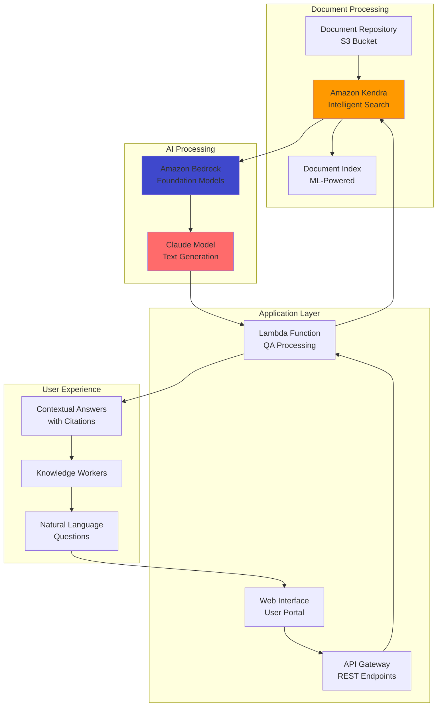

# Document QA System with Bedrock and Kendra

## Problem

Organizations struggle to efficiently extract insights from their vast document repositories. Knowledge workers spend excessive time searching through documents like technical manuals, policy documentation, research papers, and legal contracts to find specific information. Traditional keyword search solutions often return irrelevant results requiring manual filtering, while simple chatbots lack contextual understanding of proprietary documents. This creates bottlenecks in decision-making, reduces productivity, and impacts customer service quality when accurate information can't be quickly retrieved.

## Solution

Build an intelligent document question-answering system that combines Amazon Kendra's machine learning-powered search capabilities with AWS Bedrock's generative AI models. This solution automatically indexes your document repository, understands natural language questions, retrieves relevant document passages, and generates human-like answers with proper citations. The system provides contextual answers rather than just document links, dramatically improving information discovery and user experience while maintaining accuracy and traceability.

## Architecture Diagram



## Prerequisites

1. AWS account with permissions for Bedrock, Kendra, Lambda, S3, and IAM
2. AWS CLI v2 installed and configured
3. Access to Amazon Bedrock Claude models (request access if needed)
4. Sample documents (PDFs, Word docs, text files) for testing
5. Basic understanding of machine learning and natural language processing
6. Estimated cost: $50-200/month depending on usage and document volume

> **Note**: Amazon Kendra requires a paid tier for production use. Review [Kendra pricing](https://aws.amazon.com/kendra/pricing/) to understand costs.

## Preparation

```bash
# Set environment variables
export AWS_REGION=$(aws configure get region)
export AWS_ACCOUNT_ID=$(aws sts get-caller-identity \
    --query Account --output text)

# Generate unique identifiers
RANDOM_SUFFIX=$(aws secretsmanager get-random-password \
    --exclude-punctuation --exclude-uppercase \
    --password-length 6 --require-each-included-type \
    --output text --query RandomPassword)

export KENDRA_INDEX_NAME="qa-system-${RANDOM_SUFFIX}"
export S3_BUCKET_NAME="documents-${RANDOM_SUFFIX}"
export LAMBDA_FUNCTION_NAME="qa-processor-${RANDOM_SUFFIX}"

# Create S3 bucket for documents
aws s3 mb s3://${S3_BUCKET_NAME} --region ${AWS_REGION}

# Enable versioning and encryption for security
aws s3api put-bucket-versioning \
    --bucket ${S3_BUCKET_NAME} \
    --versioning-configuration Status=Enabled

aws s3api put-bucket-encryption \
    --bucket ${S3_BUCKET_NAME} \
    --server-side-encryption-configuration \
    'Rules=[{ApplyServerSideEncryptionByDefault:{SSEAlgorithm:AES256}}]'

echo "✅ Environment prepared for QA system"
```

## Steps

1. **Create and Configure Amazon Kendra Index**:

   Amazon Kendra uses machine learning to understand document content and user intent, providing more accurate search results than traditional keyword-based systems. The indexing process analyzes document structure, content relationships, and semantic meaning to enable natural language queries. We start by creating the necessary IAM roles and then establish the Kendra index that will serve as the foundation for our intelligent search capabilities.

   ```bash
   # Create IAM role for Kendra
   cat > kendra-trust-policy.json << 'EOF'
   {
     "Version": "2012-10-17",
     "Statement": [
       {
         "Effect": "Allow",
         "Principal": {
           "Service": "kendra.amazonaws.com"
         },
         "Action": "sts:AssumeRole"
       }
     ]
   }
   EOF

   KENDRA_ROLE_ARN=$(aws iam create-role \
       --role-name KendraServiceRole-${RANDOM_SUFFIX} \
       --assume-role-policy-document file://kendra-trust-policy.json \
       --query 'Role.Arn' --output text)

   # Create Kendra service policy with proper CloudWatch permissions
   cat > kendra-service-policy.json << EOF
   {
     "Version": "2012-10-17",
     "Statement": [
       {
         "Effect": "Allow",
         "Action": "cloudwatch:PutMetricData",
         "Resource": "*",
         "Condition": {
           "StringEquals": {
             "cloudwatch:namespace": "AWS/Kendra"
           }
         }
       },
       {
         "Effect": "Allow",
         "Action": "logs:DescribeLogGroups",
         "Resource": "*"
       },
       {
         "Effect": "Allow",
         "Action": "logs:CreateLogGroup",
         "Resource": "arn:aws:logs:${AWS_REGION}:${AWS_ACCOUNT_ID}:log-group:/aws/kendra/*"
       },
       {
         "Effect": "Allow",
         "Action": [
           "logs:DescribeLogStreams",
           "logs:CreateLogStream",
           "logs:PutLogEvents"
         ],
         "Resource": "arn:aws:logs:${AWS_REGION}:${AWS_ACCOUNT_ID}:log-group:/aws/kendra/*:log-stream:*"
       }
     ]
   }
   EOF

   aws iam put-role-policy \
       --role-name KendraServiceRole-${RANDOM_SUFFIX} \
       --policy-name KendraCloudWatchPolicy \
       --policy-document file://kendra-service-policy.json

   # Wait for IAM role propagation
   echo "Waiting for IAM role propagation..."
   sleep 10

   # Create Kendra index
   KENDRA_INDEX_ID=$(aws kendra create-index \
       --name ${KENDRA_INDEX_NAME} \
       --role-arn ${KENDRA_ROLE_ARN} \
       --query 'Id' --output text)

   export KENDRA_INDEX_ID
   echo "✅ Kendra index created: ${KENDRA_INDEX_ID}"
   ```

   The Kendra index is now being created with appropriate logging and monitoring capabilities. This establishes the intelligent search foundation that will enable natural language queries against your document repository.

   > **Note**: Kendra index creation takes 30-45 minutes. You can monitor progress in the AWS console while proceeding with other setup steps.

2. **Configure Document Data Source**:

   Kendra data sources act as automated content crawlers that continuously monitor and index documents from various repositories. The S3 connector provides enterprise-grade document management by understanding file hierarchies, metadata schemas, and access patterns. This creates a foundation for semantic search where documents are analyzed not just for keywords, but for conceptual meaning and relationships, enabling more intelligent retrieval for our QA system.

   ```bash
   # Add S3 permissions to Kendra role
   cat > kendra-s3-policy.json << EOF
   {
     "Version": "2012-10-17",
     "Statement": [
       {
         "Effect": "Allow",
         "Action": [
           "s3:GetObject",
           "s3:ListBucket"
         ],
         "Resource": [
           "arn:aws:s3:::${S3_BUCKET_NAME}",
           "arn:aws:s3:::${S3_BUCKET_NAME}/*"
         ]
       }
     ]
   }
   EOF

   aws iam put-role-policy \
       --role-name KendraServiceRole-${RANDOM_SUFFIX} \
       --policy-name KendraS3Policy \
       --policy-document file://kendra-s3-policy.json

   # Create S3 data source configuration
   cat > s3-data-source-config.json << EOF
   {
     "S3Configuration": {
       "BucketName": "${S3_BUCKET_NAME}",
       "InclusionPrefixes": ["documents/"],
       "DocumentsMetadataConfiguration": {
         "S3Prefix": "metadata/"
       }
     }
   }
   EOF

   # Wait for index to be active
   echo "Waiting for Kendra index to be active..."
   aws kendra wait index-active --index-id ${KENDRA_INDEX_ID}

   # Create data source
   DATA_SOURCE_ID=$(aws kendra create-data-source \
       --index-id ${KENDRA_INDEX_ID} \
       --name "S3DocumentSource" \
       --type "S3" \
       --configuration file://s3-data-source-config.json \
       --role-arn ${KENDRA_ROLE_ARN} \
       --query 'Id' --output text)

   export DATA_SOURCE_ID
   echo "✅ Data source created: ${DATA_SOURCE_ID}"
   ```

   The data source is now configured to automatically discover and index documents placed in the S3 bucket. This establishes the content pipeline that feeds our intelligent search system, ensuring that new documents are automatically incorporated into the searchable knowledge base without manual intervention.

3. **Create IAM Role for Lambda Function**:

   Lambda functions require specific IAM permissions to interact with other AWS services securely. This role follows the principle of least privilege, granting only the necessary permissions to query Kendra indexes and invoke Bedrock models. Proper IAM configuration ensures your QA system operates securely while maintaining the ability to access required resources for processing user questions.

   ```bash
   # Create Lambda execution role
   cat > lambda-trust-policy.json << 'EOF'
   {
     "Version": "2012-10-17",
     "Statement": [
       {
         "Effect": "Allow",
         "Principal": {
           "Service": "lambda.amazonaws.com"
         },
         "Action": "sts:AssumeRole"
       }
     ]
   }
   EOF

   LAMBDA_ROLE_ARN=$(aws iam create-role \
       --role-name LambdaQARole-${RANDOM_SUFFIX} \
       --assume-role-policy-document file://lambda-trust-policy.json \
       --query 'Role.Arn' --output text)

   # Create custom policy for Kendra and Bedrock access
   cat > lambda-permissions-policy.json << EOF
   {
     "Version": "2012-10-17",
     "Statement": [
       {
         "Effect": "Allow",
         "Action": [
           "kendra:Query",
           "kendra:DescribeIndex"
         ],
         "Resource": "arn:aws:kendra:${AWS_REGION}:${AWS_ACCOUNT_ID}:index/${KENDRA_INDEX_ID}"
       },
       {
         "Effect": "Allow",
         "Action": [
           "bedrock:InvokeModel"
         ],
         "Resource": "arn:aws:bedrock:${AWS_REGION}::foundation-model/anthropic.claude-3-5-sonnet-20241022-v2:0"
       }
     ]
   }
   EOF

   aws iam put-role-policy \
       --role-name LambdaQARole-${RANDOM_SUFFIX} \
       --policy-name QAPermissions \
       --policy-document file://lambda-permissions-policy.json

   # Attach basic Lambda execution policy
   aws iam attach-role-policy \
       --role-name LambdaQARole-${RANDOM_SUFFIX} \
       --policy-arn arn:aws:iam::aws:policy/service-role/AWSLambdaBasicExecutionRole

   echo "✅ Lambda IAM role created: ${LAMBDA_ROLE_ARN}"
   ```

   The IAM role is now configured with precisely the permissions needed for secure operation. This establishes the security foundation that enables the Lambda function to orchestrate between Kendra and Bedrock while maintaining strict access controls.

4. **Deploy QA Processing Lambda Function**:

   The Lambda function implements the core RAG (Retrieval-Augmented Generation) pattern by orchestrating between document retrieval and answer generation. This serverless approach provides automatic scaling, cost efficiency, and seamless integration with AWS AI services. The function processes natural language questions, retrieves relevant document passages from Kendra, and uses Bedrock's foundation models to synthesize coherent, contextual answers that are grounded in your organization's actual documents.

   ```bash
   # Create Lambda function code
   mkdir qa-lambda && cd qa-lambda
   cat > index.py << 'EOF'
   import json
   import boto3
   import os
   import logging
   
   # Set up logging
   logger = logging.getLogger()
   logger.setLevel(logging.INFO)
   
   kendra = boto3.client('kendra')
   bedrock = boto3.client('bedrock-runtime')
   
   def lambda_handler(event, context):
       try:
           question = event.get('question', '')
           if not question:
               return {
                   'statusCode': 400,
                   'body': json.dumps({'error': 'Question is required'})
               }
           
           index_id = os.environ['KENDRA_INDEX_ID']
           
           # Query Kendra for relevant documents
           logger.info(f"Querying Kendra with question: {question}")
           kendra_response = kendra.query(
               IndexId=index_id,
               QueryText=question,
               PageSize=5
           )
           
           # Extract relevant passages
           passages = []
           for item in kendra_response.get('ResultItems', []):
               if item.get('Type') == 'DOCUMENT':
                   passages.append({
                       'text': item.get('DocumentExcerpt', {}).get('Text', ''),
                       'title': item.get('DocumentTitle', {}).get('Text', ''),
                       'uri': item.get('DocumentURI', ''),
                       'score': item.get('ScoreAttributes', {}).get('ScoreConfidence', 'MEDIUM')
                   })
           
           if not passages:
               return {
                   'statusCode': 200,
                   'body': json.dumps({
                       'question': question,
                       'answer': 'I could not find relevant information in the documents to answer your question.',
                       'sources': []
                   })
               }
           
           # Generate answer using Bedrock Claude
           context_text = '\n\n'.join([f"Document: {p['title']}\n{p['text']}" for p in passages])
           
           prompt = f"""Based on the following document excerpts, please answer this question: {question}

Document excerpts:
{context_text}

Please provide a comprehensive answer based only on the information in the documents. If the documents don't contain enough information to answer the question, please say so. Include relevant citations by referencing the document titles.

Answer:"""
           
           logger.info("Invoking Bedrock Claude model")
           bedrock_response = bedrock.invoke_model(
               modelId='anthropic.claude-3-5-sonnet-20241022-v2:0',
               body=json.dumps({
                   'anthropic_version': 'bedrock-2023-05-31',
                   'max_tokens': 1000,
                   'messages': [{'role': 'user', 'content': prompt}]
               })
           )
           
           response_body = json.loads(bedrock_response['body'].read())
           answer = response_body['content'][0]['text']
           
           return {
               'statusCode': 200,
               'headers': {
                   'Content-Type': 'application/json'
               },
               'body': json.dumps({
                   'question': question,
                   'answer': answer,
                   'sources': [{'title': p['title'], 'uri': p['uri'], 'score': p['score']} for p in passages]
               })
           }
           
       except Exception as e:
           logger.error(f"Error processing question: {str(e)}")
           return {
               'statusCode': 500,
               'body': json.dumps({'error': f'Internal server error: {str(e)}'})
           }
   EOF

   # Package Lambda function
   zip -r qa-function.zip index.py

   # Wait for IAM role to propagate
   echo "Waiting for IAM role propagation..."
   sleep 30

   # Create Lambda function
   aws lambda create-function \
       --function-name ${LAMBDA_FUNCTION_NAME} \
       --runtime python3.12 \
       --role ${LAMBDA_ROLE_ARN} \
       --handler index.lambda_handler \
       --zip-file fileb://qa-function.zip \
       --environment Variables="{KENDRA_INDEX_ID=${KENDRA_INDEX_ID}}" \
       --timeout 60 \
       --memory-size 256

   cd ..
   echo "✅ Lambda function deployed"
   ```

   The Lambda function is now deployed and ready to process QA requests. This establishes the intelligent orchestration layer that transforms natural language questions into precise, contextual answers by leveraging both the search capabilities of Kendra and the language understanding of Bedrock's foundation models.

   > **Tip**: Consider implementing response caching and rate limiting for production deployments to manage costs and improve performance for frequently asked questions.

## Validation & Testing

1. Upload test documents and wait for indexing:

   ```bash
   # Create sample documents with relevant content
   mkdir test-docs && cd test-docs
   
   echo "AWS Lambda is a serverless computing service that lets you run code without provisioning or managing servers. Lambda automatically scales your application by running code in response to each trigger." > aws-lambda-guide.txt
   
   echo "Amazon Kendra is an intelligent search service powered by machine learning. It allows you to search across different content repositories with natural language processing capabilities." > kendra-overview.txt
   
   # Upload documents to S3
   aws s3 cp aws-lambda-guide.txt s3://${S3_BUCKET_NAME}/documents/
   aws s3 cp kendra-overview.txt s3://${S3_BUCKET_NAME}/documents/
   
   cd ..
   
   # Trigger Kendra synchronization
   aws kendra start-data-source-sync-job \
       --index-id ${KENDRA_INDEX_ID} \
       --id ${DATA_SOURCE_ID}
   
   echo "Waiting for document indexing (this may take 5-10 minutes)..."
   sleep 300
   ```

2. Test the QA system with various questions:

   ```bash
   # Test with Lambda question
   aws lambda invoke \
       --function-name ${LAMBDA_FUNCTION_NAME} \
       --payload '{"question": "What is AWS Lambda and how does it work?"}' \
       response1.json
   
   echo "Response 1:"
   cat response1.json | python3 -m json.tool
   
   # Test with Kendra question
   aws lambda invoke \
       --function-name ${LAMBDA_FUNCTION_NAME} \
       --payload '{"question": "What capabilities does Amazon Kendra provide?"}' \
       response2.json
   
   echo "Response 2:"
   cat response2.json | python3 -m json.tool
   ```

   Expected output: The responses should contain relevant answers with proper citations from the uploaded documents.

3. Monitor system performance and usage:

   ```bash
   # Check Kendra query metrics
   aws cloudwatch get-metric-statistics \
       --namespace AWS/Kendra \
       --metric-name IndexUtilization \
       --dimensions Name=IndexId,Value=${KENDRA_INDEX_ID} \
       --start-time $(date -u -d '1 hour ago' +%Y-%m-%dT%H:%M:%S) \
       --end-time $(date -u +%Y-%m-%dT%H:%M:%S) \
       --period 3600 \
       --statistics Average
   
   # Check Lambda function metrics
   aws cloudwatch get-metric-statistics \
       --namespace AWS/Lambda \
       --metric-name Duration \
       --dimensions Name=FunctionName,Value=${LAMBDA_FUNCTION_NAME} \
       --start-time $(date -u -d '1 hour ago' +%Y-%m-%dT%H:%M:%S) \
       --end-time $(date -u +%Y-%m-%dT%H:%M:%S) \
       --period 3600 \
       --statistics Average
   ```

## Cleanup

1. Delete Kendra resources:

   ```bash
   # Delete data source first
   aws kendra delete-data-source \
       --index-id ${KENDRA_INDEX_ID} \
       --id ${DATA_SOURCE_ID}
   
   # Wait for data source deletion
   echo "Waiting for data source deletion..."
   sleep 30
   
   # Delete Kendra index
   aws kendra delete-index --id ${KENDRA_INDEX_ID}
   
   echo "✅ Kendra resources deleted"
   ```

2. Remove Lambda function and S3 bucket:

   ```bash
   # Delete Lambda function
   aws lambda delete-function --function-name ${LAMBDA_FUNCTION_NAME}
   
   # Empty and delete S3 bucket
   aws s3 rm s3://${S3_BUCKET_NAME} --recursive
   aws s3 rb s3://${S3_BUCKET_NAME}
   
   echo "✅ Lambda and S3 resources deleted"
   ```

3. Clean up IAM resources:

   ```bash
   # Remove Lambda IAM role
   aws iam detach-role-policy \
       --role-name LambdaQARole-${RANDOM_SUFFIX} \
       --policy-arn arn:aws:iam::aws:policy/service-role/AWSLambdaBasicExecutionRole
   
   aws iam delete-role-policy \
       --role-name LambdaQARole-${RANDOM_SUFFIX} \
       --policy-name QAPermissions
   
   aws iam delete-role --role-name LambdaQARole-${RANDOM_SUFFIX}
   
   # Remove Kendra IAM role
   aws iam delete-role-policy \
       --role-name KendraServiceRole-${RANDOM_SUFFIX} \
       --policy-name KendraCloudWatchPolicy
   
   aws iam delete-role-policy \
       --role-name KendraServiceRole-${RANDOM_SUFFIX} \
       --policy-name KendraS3Policy
   
   aws iam delete-role --role-name KendraServiceRole-${RANDOM_SUFFIX}
   
   # Clean up temporary files
   rm -f *.json qa-function.zip
   rm -rf qa-lambda test-docs
   
   echo "✅ All resources cleaned up"
   ```

## Discussion

The combination of Amazon Kendra and AWS Bedrock creates a powerful knowledge management system that bridges the gap between document search and conversational AI. Kendra's machine learning algorithms understand document semantics and user intent, while Bedrock's foundation models provide natural language generation capabilities that can synthesize information from multiple sources into coherent, contextual answers.

This architecture demonstrates the value of Retrieval-Augmented Generation (RAG), where large language models are enhanced with domain-specific knowledge through intelligent document retrieval. This approach ensures that AI-generated responses are grounded in factual, up-to-date information from your organization's documents while maintaining the conversational capabilities that make AI assistants user-friendly. The system follows AWS Well-Architected principles by implementing proper security controls, monitoring, and cost optimization strategies.

The solution provides several advantages over traditional search systems: natural language understanding eliminates the need for precise keyword matching, semantic search captures conceptual relationships between documents, and generative AI creates comprehensive answers rather than just returning document links. For production deployments, consider implementing additional features like user authentication, response caching, and fine-tuned access controls based on document sensitivity levels.

> **Warning**: Implement appropriate access controls and audit logging to ensure sensitive documents are only accessible to authorized users and that all interactions are properly tracked for compliance purposes. See the [AWS Security Best Practices](https://docs.aws.amazon.com/security/latest/userguide/security-best-practices.html) for comprehensive guidance.

## Challenge

Enhance this system by implementing these advanced features:

1. **Multi-language Support**: Configure Kendra to handle documents in multiple languages and adapt the Bedrock prompts accordingly
2. **Advanced Filtering**: Add metadata-based filtering and faceted search capabilities to narrow results by document type, department, or date ranges  
3. **Real-time Analytics**: Build a dashboard using Amazon QuickSight to visualize usage patterns, popular queries, and knowledge gaps
4. **Feedback Loop**: Implement user rating systems and automated model fine-tuning based on answer quality feedback
5. **Enterprise Integration**: Connect additional data sources like SharePoint, Confluence, or database systems for comprehensive knowledge coverage

## Infrastructure Code

### Available Infrastructure as Code:

- [Infrastructure Code Overview](code/README.md) - Detailed description of all infrastructure components
- [AWS CDK (Python)](code/cdk-python/) - AWS CDK Python implementation
- [AWS CDK (TypeScript)](code/cdk-typescript/) - AWS CDK TypeScript implementation
- [CloudFormation](code/cloudformation.yaml) - AWS CloudFormation template
- [Bash CLI Scripts](code/scripts/) - Example bash scripts using AWS CLI commands to deploy infrastructure
- [Terraform](code/terraform/) - Terraform configuration files