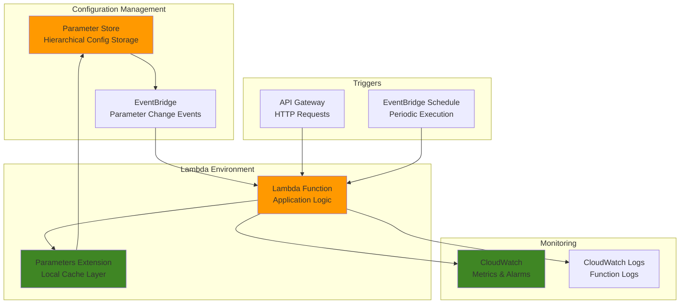

# Implementing Dynamic Configuration Management with Parameter Store and Lambda

## Problem

Modern applications require flexible configuration management that adapts to changing business requirements without requiring code deployments or service restarts. Traditional configuration management approaches involve hardcoded values, manual updates, or complex restart procedures that create operational overhead and potential downtime. Development teams need a way to dynamically update application configurations while maintaining performance, security, and cost efficiency across distributed serverless architectures.

## Solution

Build a serverless configuration management system using AWS Systems Manager Parameter Store for centralized parameter storage, Lambda functions with the AWS Parameters and Secrets Extension for cached parameter retrieval, and EventBridge for automatic configuration invalidation. This solution provides real-time configuration updates, intelligent caching to reduce API calls and improve performance, and automated monitoring through CloudWatch metrics and alarms.

## Architecture Diagram



## Prerequisites

1. AWS account with administrative permissions for Systems Manager, Lambda, EventBridge, and CloudWatch
2. AWS CLI v2 installed and configured (or AWS CloudShell)
3. Basic knowledge of serverless architectures and AWS Lambda
4. Understanding of JSON and Python programming
5. Estimated cost: $5-10 per month for moderate usage (Parameter Store requests, Lambda invocations, CloudWatch monitoring)

> **Note**: This solution follows AWS Well-Architected Framework principles for operational excellence, security, and cost optimization. See the [AWS Well-Architected Framework](https://docs.aws.amazon.com/wellarchitected/latest/framework/welcome.html) for additional guidance.

## Preparation

```bash
# Set environment variables
export AWS_REGION=$(aws configure get region)
export AWS_ACCOUNT_ID=$(aws sts get-caller-identity \
    --query Account --output text)

# Generate unique identifiers for resources
RANDOM_SUFFIX=$(aws secretsmanager get-random-password \
    --exclude-punctuation --exclude-uppercase \
    --password-length 6 --require-each-included-type \
    --output text --query RandomPassword)

# Set resource names
export FUNCTION_NAME="config-manager-${RANDOM_SUFFIX}"
export ROLE_NAME="config-manager-role-${RANDOM_SUFFIX}"
export PARAMETER_PREFIX="/myapp/config"
export EVENTBRIDGE_RULE_NAME="parameter-change-rule-${RANDOM_SUFFIX}"

echo "✅ AWS environment configured for region: ${AWS_REGION}"
echo "✅ Function name: ${FUNCTION_NAME}"
```

## Steps

1. **Create IAM Role for Lambda Function**:

   AWS Lambda requires an execution role with permissions to access Parameter Store, CloudWatch, and EventBridge. This role follows the principle of least privilege while providing necessary access for configuration management operations. The role includes permissions for Parameter Store retrieval, CloudWatch logging, and KMS decryption for SecureString parameters.

   ```bash
   # Create trust policy for Lambda service
   cat > trust-policy.json << 'EOF'
   {
       "Version": "2012-10-17",
       "Statement": [
           {
               "Effect": "Allow",
               "Principal": {
                   "Service": "lambda.amazonaws.com"
               },
               "Action": "sts:AssumeRole"
           }
       ]
   }
   EOF
   
   # Create IAM role
   aws iam create-role \
       --role-name ${ROLE_NAME} \
       --assume-role-policy-document file://trust-policy.json
   
   # Attach basic Lambda execution policy
   aws iam attach-role-policy \
       --role-name ${ROLE_NAME} \
       --policy-arn arn:aws:iam::aws:policy/service-role/AWSLambdaBasicExecutionRole
   
   echo "✅ IAM role created: ${ROLE_NAME}"
   ```

2. **Create Custom IAM Policy for Parameter Store Access**:

   Configure granular permissions for Parameter Store operations, enabling the Lambda function to retrieve configuration parameters efficiently while maintaining security boundaries. The policy includes KMS decrypt permissions for SecureString parameters and CloudWatch permissions for custom metrics.

   ```bash
   # Create custom policy for Parameter Store and monitoring
   cat > parameter-store-policy.json << 'EOF'
   {
       "Version": "2012-10-17",
       "Statement": [
           {
               "Effect": "Allow",
               "Action": [
                   "ssm:GetParameter",
                   "ssm:GetParameters",
                   "ssm:GetParametersByPath"
               ],
               "Resource": "arn:aws:ssm:*:*:parameter/myapp/config/*"
           },
           {
               "Effect": "Allow",
               "Action": [
                   "kms:Decrypt"
               ],
               "Resource": "arn:aws:kms:*:*:key/*",
               "Condition": {
                   "StringEquals": {
                       "kms:ViaService": "ssm.*.amazonaws.com"
                   }
               }
           },
           {
               "Effect": "Allow",
               "Action": [
                   "cloudwatch:PutMetricData"
               ],
               "Resource": "*"
           }
       ]
   }
   EOF
   
   # Create and attach the policy
   aws iam create-policy \
       --policy-name "ParameterStoreAccessPolicy-${RANDOM_SUFFIX}" \
       --policy-document file://parameter-store-policy.json
   
   aws iam attach-role-policy \
       --role-name ${ROLE_NAME} \
       --policy-arn "arn:aws:iam::${AWS_ACCOUNT_ID}:policy/ParameterStoreAccessPolicy-${RANDOM_SUFFIX}"
   
   echo "✅ Parameter Store access policy attached"
   ```

3. **Create Sample Configuration Parameters**:

   Establish a hierarchical parameter structure in Parameter Store to demonstrate configuration management capabilities. This includes both plain text and encrypted parameters, showcasing different parameter types and access patterns that applications commonly require.

   ```bash
   # Create application configuration parameters
   aws ssm put-parameter \
       --name "${PARAMETER_PREFIX}/database/host" \
       --value "myapp-db.cluster-xyz.us-east-1.rds.amazonaws.com" \
       --type "String" \
       --description "Database host endpoint"
   
   aws ssm put-parameter \
       --name "${PARAMETER_PREFIX}/database/port" \
       --value "5432" \
       --type "String" \
       --description "Database port number"
   
   aws ssm put-parameter \
       --name "${PARAMETER_PREFIX}/api/timeout" \
       --value "30" \
       --type "String" \
       --description "API timeout in seconds"
   
   aws ssm put-parameter \
       --name "${PARAMETER_PREFIX}/features/new-ui" \
       --value "true" \
       --type "String" \
       --description "Feature flag for new UI"
   
   # Create a SecureString parameter for sensitive data
   aws ssm put-parameter \
       --name "${PARAMETER_PREFIX}/database/password" \
       --value "supersecretpassword123" \
       --type "SecureString" \
       --description "Database password (encrypted)"
   
   echo "✅ Configuration parameters created in Parameter Store"
   ```

4. **Create Lambda Function Code**:

   Develop a Lambda function that demonstrates dynamic configuration retrieval using the AWS Parameters and Secrets Extension. The function implements caching strategies, error handling, and monitoring capabilities essential for production configuration management systems.

   ```bash
   # Create Lambda function code
   cat > lambda_function.py << 'EOF'
   import json
   import os
   import urllib3
   import boto3
   from datetime import datetime
   
   # Initialize HTTP client for extension
   http = urllib3.PoolManager()
   
   # Initialize CloudWatch client for custom metrics
   cloudwatch = boto3.client('cloudwatch')
   
   def get_parameter_from_extension(parameter_name):
       """Retrieve parameter using the Parameters and Secrets Extension"""
       try:
           # Use localhost endpoint provided by the extension
           port = os.environ.get('PARAMETERS_SECRETS_EXTENSION_HTTP_PORT', '2773')
           url = f'http://localhost:{port}/systemsmanager/parameters/get/?name={parameter_name}'
           
           response = http.request('GET', url)
           
           if response.status == 200:
               data = json.loads(response.data.decode('utf-8'))
               return data['Parameter']['Value']
           else:
               raise Exception(f"Failed to retrieve parameter: {response.status}")
               
       except Exception as e:
           print(f"Error retrieving parameter {parameter_name}: {str(e)}")
           # Fallback to direct SSM call if extension fails
           return get_parameter_direct(parameter_name)
   
   def get_parameter_direct(parameter_name):
       """Fallback method using direct SSM API call"""
       try:
           ssm = boto3.client('ssm')
           response = ssm.get_parameter(Name=parameter_name, WithDecryption=True)
           return response['Parameter']['Value']
       except Exception as e:
           print(f"Error with direct SSM call: {str(e)}")
           return None
   
   def send_custom_metric(metric_name, value, unit='Count'):
       """Send custom metric to CloudWatch"""
       try:
           cloudwatch.put_metric_data(
               Namespace='ConfigManager',
               MetricData=[
                   {
                       'MetricName': metric_name,
                       'Value': value,
                       'Unit': unit,
                       'Timestamp': datetime.utcnow()
                   }
               ]
           )
       except Exception as e:
           print(f"Error sending metric: {str(e)}")
   
   def lambda_handler(event, context):
       """Main Lambda handler function"""
       try:
           # Define parameter prefix
           parameter_prefix = os.environ.get('PARAMETER_PREFIX', '/myapp/config')
           
           # Retrieve configuration parameters
           config = {}
           parameters = [
               f"{parameter_prefix}/database/host",
               f"{parameter_prefix}/database/port",
               f"{parameter_prefix}/api/timeout",
               f"{parameter_prefix}/features/new-ui"
           ]
           
           # Track configuration retrieval metrics
           successful_retrievals = 0
           failed_retrievals = 0
           
           for param in parameters:
               value = get_parameter_from_extension(param)
               if value is not None:
                   config[param.split('/')[-1]] = value
                   successful_retrievals += 1
               else:
                   failed_retrievals += 1
           
           # Send custom metrics
           send_custom_metric('SuccessfulParameterRetrievals', successful_retrievals)
           send_custom_metric('FailedParameterRetrievals', failed_retrievals)
           
           # Log configuration status
           print(f"Configuration loaded: {len(config)} parameters")
           print(f"Configuration: {json.dumps(config, indent=2)}")
           
           # Return response
           return {
               'statusCode': 200,
               'body': json.dumps({
                   'message': 'Configuration loaded successfully',
                   'config': config,
                   'timestamp': datetime.utcnow().isoformat()
               })
           }
           
       except Exception as e:
           print(f"Error in lambda_handler: {str(e)}")
           send_custom_metric('ConfigurationErrors', 1)
           
           return {
               'statusCode': 500,
               'body': json.dumps({
                   'error': 'Configuration retrieval failed',
                   'message': str(e)
               })
           }
   EOF
   
   # Create deployment package
   zip -r function.zip lambda_function.py
   
   echo "✅ Lambda function code created and packaged"
   ```

5. **Deploy Lambda Function with Parameters Extension**:

   Deploy the Lambda function with the AWS Parameters and Secrets Extension layer, which provides local caching capabilities and improved performance for parameter retrieval operations. The extension reduces API calls to Parameter Store while maintaining fresh configuration data through configurable TTL settings.

   ```bash
   # Get the Parameters and Secrets Extension layer ARN for your region
   case ${AWS_REGION} in
       us-east-1)
           EXTENSION_ARN="arn:aws:lambda:us-east-1:177933569100:layer:AWS-Parameters-and-Secrets-Lambda-Extension:11"
           ;;
       us-west-2)
           EXTENSION_ARN="arn:aws:lambda:us-west-2:177933569100:layer:AWS-Parameters-and-Secrets-Lambda-Extension:11"
           ;;
       eu-west-1)
           EXTENSION_ARN="arn:aws:lambda:eu-west-1:177933569100:layer:AWS-Parameters-and-Secrets-Lambda-Extension:11"
           ;;
       ap-southeast-1)
           EXTENSION_ARN="arn:aws:lambda:ap-southeast-1:177933569100:layer:AWS-Parameters-and-Secrets-Lambda-Extension:11"
           ;;
       *)
           echo "Please verify the Parameters and Secrets Extension ARN for ${AWS_REGION}"
           EXTENSION_ARN="arn:aws:lambda:${AWS_REGION}:177933569100:layer:AWS-Parameters-and-Secrets-Lambda-Extension:11"
           ;;
   esac
   
   # Wait for IAM role propagation
   echo "Waiting for IAM role propagation..."
   sleep 15
   
   # Create Lambda function with extension layer
   aws lambda create-function \
       --function-name ${FUNCTION_NAME} \
       --runtime python3.9 \
       --role "arn:aws:iam::${AWS_ACCOUNT_ID}:role/${ROLE_NAME}" \
       --handler lambda_function.lambda_handler \
       --zip-file fileb://function.zip \
       --timeout 30 \
       --memory-size 256 \
       --layers ${EXTENSION_ARN} \
       --environment Variables="{PARAMETER_PREFIX=${PARAMETER_PREFIX},SSM_PARAMETER_STORE_TTL=300}"
   
   echo "✅ Lambda function deployed with Parameters Extension"
   ```

6. **Create EventBridge Rule for Parameter Change Events**:

   Configure EventBridge to capture Parameter Store change events, enabling automatic cache invalidation and real-time configuration updates. This event-driven approach ensures that Lambda functions receive fresh configuration data immediately after parameter updates without manual intervention.

   ```bash
   # Create EventBridge rule for Parameter Store events
   aws events put-rule \
       --name ${EVENTBRIDGE_RULE_NAME} \
       --event-pattern '{
           "source": ["aws.ssm"],
           "detail-type": ["Parameter Store Change"],
           "detail": {
               "name": [{"prefix": "'${PARAMETER_PREFIX}'"}]
           }
       }' \
       --state ENABLED \
       --description "Trigger on Parameter Store changes"
   
   # Add Lambda function as target
   aws events put-targets \
       --rule ${EVENTBRIDGE_RULE_NAME} \
       --targets "Id"="1","Arn"="arn:aws:lambda:${AWS_REGION}:${AWS_ACCOUNT_ID}:function:${FUNCTION_NAME}"
   
   # Grant EventBridge permission to invoke Lambda
   aws lambda add-permission \
       --function-name ${FUNCTION_NAME} \
       --statement-id "allow-eventbridge" \
       --action lambda:InvokeFunction \
       --principal events.amazonaws.com \
       --source-arn "arn:aws:events:${AWS_REGION}:${AWS_ACCOUNT_ID}:rule/${EVENTBRIDGE_RULE_NAME}"
   
   echo "✅ EventBridge rule configured for parameter change events"
   ```

7. **Create CloudWatch Alarms for Monitoring**:

   Establish comprehensive monitoring for the configuration management system using CloudWatch alarms that track function performance, error rates, and configuration retrieval success metrics. These alarms provide proactive alerting for operational issues and performance degradation.

   ```bash
   # Create alarm for Lambda function errors
   aws cloudwatch put-metric-alarm \
       --alarm-name "ConfigManager-Errors-${RANDOM_SUFFIX}" \
       --alarm-description "Monitor Lambda function errors" \
       --metric-name Errors \
       --namespace AWS/Lambda \
       --statistic Sum \
       --period 300 \
       --threshold 5 \
       --comparison-operator GreaterThanThreshold \
       --evaluation-periods 2 \
       --dimensions Name=FunctionName,Value=${FUNCTION_NAME}
   
   # Create alarm for function duration
   aws cloudwatch put-metric-alarm \
       --alarm-name "ConfigManager-Duration-${RANDOM_SUFFIX}" \
       --alarm-description "Monitor Lambda function duration" \
       --metric-name Duration \
       --namespace AWS/Lambda \
       --statistic Average \
       --period 300 \
       --threshold 10000 \
       --comparison-operator GreaterThanThreshold \
       --evaluation-periods 3 \
       --dimensions Name=FunctionName,Value=${FUNCTION_NAME}
   
   # Create alarm for configuration retrieval failures
   aws cloudwatch put-metric-alarm \
       --alarm-name "ConfigManager-RetrievalFailures-${RANDOM_SUFFIX}" \
       --alarm-description "Monitor configuration retrieval failures" \
       --metric-name FailedParameterRetrievals \
       --namespace ConfigManager \
       --statistic Sum \
       --period 300 \
       --threshold 3 \
       --comparison-operator GreaterThanThreshold \
       --evaluation-periods 2
   
   echo "✅ CloudWatch alarms configured for monitoring"
   ```

8. **Create CloudWatch Dashboard**:

   Build a comprehensive monitoring dashboard that provides real-time visibility into configuration management system performance, parameter retrieval patterns, and operational health metrics. The dashboard enables quick identification of issues and performance optimization opportunities.

   ```bash
   # Create CloudWatch dashboard
   cat > dashboard.json << 'EOF'
   {
       "widgets": [
           {
               "type": "metric",
               "x": 0,
               "y": 0,
               "width": 12,
               "height": 6,
               "properties": {
                   "metrics": [
                       [ "AWS/Lambda", "Invocations", "FunctionName", "FUNCTION_NAME" ],
                       [ ".", "Errors", ".", "." ],
                       [ ".", "Duration", ".", "." ]
                   ],
                   "period": 300,
                   "stat": "Sum",
                   "region": "AWS_REGION",
                   "title": "Lambda Function Metrics"
               }
           },
           {
               "type": "metric",
               "x": 12,
               "y": 0,
               "width": 12,
               "height": 6,
               "properties": {
                   "metrics": [
                       [ "ConfigManager", "SuccessfulParameterRetrievals" ],
                       [ ".", "FailedParameterRetrievals" ],
                       [ ".", "ConfigurationErrors" ]
                   ],
                   "period": 300,
                   "stat": "Sum",
                   "region": "AWS_REGION",
                   "title": "Configuration Management Metrics"
               }
           }
       ]
   }
   EOF
   
   # Replace placeholders and create dashboard
   sed -i "s/FUNCTION_NAME/${FUNCTION_NAME}/g" dashboard.json
   sed -i "s/AWS_REGION/${AWS_REGION}/g" dashboard.json
   
   aws cloudwatch put-dashboard \
       --dashboard-name "ConfigManager-${RANDOM_SUFFIX}" \
       --dashboard-body file://dashboard.json
   
   echo "✅ CloudWatch dashboard created"
   ```

## Validation & Testing

1. **Test Initial Configuration Retrieval**:

   ```bash
   # Invoke Lambda function to test configuration retrieval
   aws lambda invoke \
       --function-name ${FUNCTION_NAME} \
       --payload '{}' \
       response.json
   
   # Display the response
   cat response.json | jq .
   ```

   Expected output: JSON response with configuration parameters and successful status.

2. **Test Parameter Update and Cache Behavior**:

   ```bash
   # Update a parameter value
   aws ssm put-parameter \
       --name "${PARAMETER_PREFIX}/api/timeout" \
       --value "45" \
       --type "String" \
       --overwrite
   
   # Wait for cache TTL (5 minutes by default)
   echo "Waiting 30 seconds for cache test..."
   sleep 30
   
   # Test immediate retrieval (should use cached value)
   aws lambda invoke \
       --function-name ${FUNCTION_NAME} \
       --payload '{}' \
       response-cached.json
   
   echo "Configuration with potentially cached value:"
   cat response-cached.json | jq .body | jq .
   ```

3. **Monitor CloudWatch Metrics**:

   ```bash
   # Check custom metrics
   aws cloudwatch get-metric-statistics \
       --namespace ConfigManager \
       --metric-name SuccessfulParameterRetrievals \
       --start-time $(date -u -d '1 hour ago' +%Y-%m-%dT%H:%M:%S) \
       --end-time $(date -u +%Y-%m-%dT%H:%M:%S) \
       --period 300 \
       --statistics Sum
   
   # Check Lambda function metrics
   aws cloudwatch get-metric-statistics \
       --namespace AWS/Lambda \
       --metric-name Duration \
       --dimensions Name=FunctionName,Value=${FUNCTION_NAME} \
       --start-time $(date -u -d '1 hour ago' +%Y-%m-%dT%H:%M:%S) \
       --end-time $(date -u +%Y-%m-%dT%H:%M:%S) \
       --period 300 \
       --statistics Average
   ```

4. **Test Parameter Change Event Handling**:

   ```bash
   # Update a parameter to trigger EventBridge event
   aws ssm put-parameter \
       --name "${PARAMETER_PREFIX}/features/new-ui" \
       --value "false" \
       --type "String" \
       --overwrite
   
   # Check Lambda function logs for event processing
   aws logs filter-log-events \
       --log-group-name "/aws/lambda/${FUNCTION_NAME}" \
       --start-time $(date -d '5 minutes ago' +%s)000 \
       --filter-pattern "Configuration loaded"
   ```

## Cleanup

1. **Delete Lambda Function and Related Resources**:

   ```bash
   # Delete Lambda function
   aws lambda delete-function --function-name ${FUNCTION_NAME}
   
   # Delete EventBridge rule
   aws events remove-targets --rule ${EVENTBRIDGE_RULE_NAME} --ids "1"
   aws events delete-rule --name ${EVENTBRIDGE_RULE_NAME}
   
   echo "✅ Lambda function and EventBridge rule deleted"
   ```

2. **Delete CloudWatch Resources**:

   ```bash
   # Delete CloudWatch alarms
   aws cloudwatch delete-alarms \
       --alarm-names "ConfigManager-Errors-${RANDOM_SUFFIX}" \
                     "ConfigManager-Duration-${RANDOM_SUFFIX}" \
                     "ConfigManager-RetrievalFailures-${RANDOM_SUFFIX}"
   
   # Delete CloudWatch dashboard
   aws cloudwatch delete-dashboards \
       --dashboard-names "ConfigManager-${RANDOM_SUFFIX}"
   
   echo "✅ CloudWatch resources deleted"
   ```

3. **Delete IAM Role and Policies**:

   ```bash
   # Detach policies from role
   aws iam detach-role-policy \
       --role-name ${ROLE_NAME} \
       --policy-arn arn:aws:iam::aws:policy/service-role/AWSLambdaBasicExecutionRole
   
   aws iam detach-role-policy \
       --role-name ${ROLE_NAME} \
       --policy-arn "arn:aws:iam::${AWS_ACCOUNT_ID}:policy/ParameterStoreAccessPolicy-${RANDOM_SUFFIX}"
   
   # Delete custom policy
   aws iam delete-policy \
       --policy-arn "arn:aws:iam::${AWS_ACCOUNT_ID}:policy/ParameterStoreAccessPolicy-${RANDOM_SUFFIX}"
   
   # Delete IAM role
   aws iam delete-role --role-name ${ROLE_NAME}
   
   echo "✅ IAM resources deleted"
   ```

4. **Delete Parameter Store Parameters**:

   ```bash
   # Delete all parameters under the prefix
   aws ssm delete-parameters \
       --names "${PARAMETER_PREFIX}/database/host" \
               "${PARAMETER_PREFIX}/database/port" \
               "${PARAMETER_PREFIX}/database/password" \
               "${PARAMETER_PREFIX}/api/timeout" \
               "${PARAMETER_PREFIX}/features/new-ui"
   
   # Clean up local files
   rm -f function.zip lambda_function.py trust-policy.json \
         parameter-store-policy.json dashboard.json response.json \
         response-cached.json
   
   echo "✅ Parameter Store parameters and local files deleted"
   ```

## Discussion

This dynamic configuration management solution demonstrates several key architectural patterns essential for modern serverless applications. The AWS Parameters and Secrets Lambda Extension provides significant performance improvements by maintaining an in-memory cache of configuration parameters, reducing API calls to Parameter Store by up to 99% while maintaining data freshness through configurable TTL settings. This approach aligns with the AWS Well-Architected Framework's performance efficiency pillar by optimizing resource utilization and reducing latency.

The EventBridge integration enables real-time configuration updates by automatically triggering Lambda functions when parameters change, eliminating the need for manual cache invalidation or application restarts. This event-driven architecture pattern supports the operational excellence pillar by enabling automated responses to configuration changes and reducing manual operational overhead. The hierarchical parameter organization in Parameter Store provides logical separation of configuration concerns while maintaining security through IAM permissions and KMS encryption for sensitive values.

The monitoring and alerting capabilities through CloudWatch provide comprehensive observability into the configuration management system's health and performance. Custom metrics track configuration retrieval success rates, while standard Lambda metrics monitor function performance and error rates. This monitoring approach supports the reliability pillar by enabling proactive identification of issues before they impact application functionality.

Cost optimization is achieved through the intelligent caching mechanism provided by the Parameters Extension, which reduces the number of API calls to Parameter Store. The serverless architecture ensures you only pay for actual configuration retrieval operations, while the monitoring setup helps identify opportunities for further optimization. For production deployments, consider implementing parameter versioning and gradual rollout strategies to minimize risk during configuration changes.

> **Tip**: Configure different TTL values for different parameter types - use shorter TTL for frequently changing feature flags and longer TTL for stable infrastructure settings to optimize both performance and cost.

**Sources:**
- [AWS Parameters and Secrets Lambda Extension](https://docs.aws.amazon.com/systems-manager/latest/userguide/ps-integration-lambda-extensions.html)
- [AWS Lambda Best Practices](https://docs.aws.amazon.com/lambda/latest/dg/best-practices.html)
- [Parameter Store EventBridge Integration](https://docs.aws.amazon.com/systems-manager/latest/userguide/sysman-paramstore-cwe.html)
- [CloudWatch Lambda Metrics](https://docs.aws.amazon.com/lambda/latest/dg/monitoring-metrics.html)
- [AWS Well-Architected Framework](https://docs.aws.amazon.com/wellarchitected/latest/framework/welcome.html)

## Challenge

Extend this solution by implementing these enhancements:

1. **Multi-Environment Configuration Management**: Implement parameter hierarchies for different environments (dev/staging/prod) with environment-specific Lambda functions and automated deployment pipelines using AWS CodePipeline.

2. **Configuration Validation and Rollback**: Add parameter validation rules using AWS Config and implement automatic rollback mechanisms when invalid configurations are detected through CloudWatch alarms.

3. **Cross-Region Configuration Replication**: Implement cross-region parameter replication using EventBridge cross-region rules and Lambda functions to maintain configuration consistency across multiple AWS regions.

4. **Advanced Caching Strategies**: Implement intelligent cache warming, selective cache invalidation based on parameter dependencies, and cache analytics to optimize performance and reduce costs.

5. **Configuration Drift Detection**: Build automated configuration drift detection using AWS Config rules and Systems Manager Compliance to identify and alert on configuration changes that don't follow established patterns.

## Infrastructure Code

*Infrastructure code will be generated after recipe approval.*