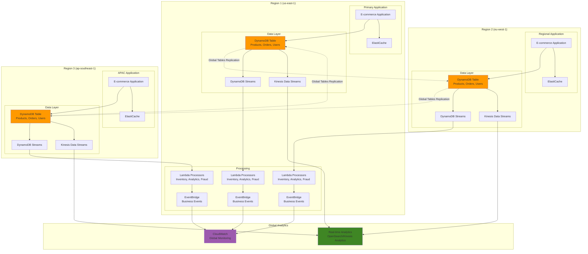

# DynamoDB Global Tables with Streaming

## Problem

E-commerce platforms operating globally need real-time data synchronization across multiple regions for inventory management, user sessions, and order processing while maintaining eventually consistent reads and immediate local writes. Traditional approaches struggle with complex event processing requirements, such as real-time analytics, fraud detection, and inventory adjustments that must be processed immediately upon data changes. Managing global data consistency while providing sub-millisecond local access times and comprehensive audit trails for compliance becomes increasingly complex as business operations scale internationally.

## Solution

Implement a sophisticated DynamoDB Global Tables architecture combined with advanced streaming capabilities using both DynamoDB Streams and Kinesis Data Streams. This solution provides multi-region, multi-active replication with comprehensive real-time event processing for analytics, monitoring, and business logic automation while maintaining strong consistency guarantees and audit capabilities.

## Architecture Diagram



## Prerequisites

1. AWS account with DynamoDB, Kinesis, Lambda, and EventBridge permissions in three regions
2. AWS CLI v2 installed and configured (or AWS CloudShell)
3. Understanding of DynamoDB Global Tables, Streams, and event-driven architectures
4. IAM roles for Lambda execution and cross-service access
5. Estimated cost: $300-500/month for multi-region setup with moderate traffic

> **Note**: Global Tables incur cross-region data transfer costs and require careful capacity planning. Monitor usage patterns using CloudWatch metrics to optimize costs and performance. Learn more about [Global Tables pricing](https://docs.aws.amazon.com/amazondynamodb/latest/developerguide/GlobalTables.html).

## Preparation

```bash
# Set environment variables for multi-region deployment
export PRIMARY_REGION="us-east-1"
export SECONDARY_REGION="eu-west-1"
export TERTIARY_REGION="ap-southeast-1"
export AWS_ACCOUNT_ID=$(aws sts get-caller-identity \
    --query Account --output text)

# Generate unique identifiers
RANDOM_SUFFIX=$(aws secretsmanager get-random-password \
    --exclude-punctuation --exclude-uppercase \
    --password-length 6 --require-each-included-type \
    --output text --query RandomPassword)

export TABLE_NAME="ecommerce-global-${RANDOM_SUFFIX}"
export STREAM_NAME="ecommerce-events-${RANDOM_SUFFIX}"
export LAMBDA_ROLE_NAME="ecommerce-lambda-role-${RANDOM_SUFFIX}"

# Create IAM role for Lambda execution
cat > lambda-trust-policy.json << EOF
{
  "Version": "2012-10-17",
  "Statement": [
    {
      "Effect": "Allow",
      "Principal": {"Service": "lambda.amazonaws.com"},
      "Action": "sts:AssumeRole"
    }
  ]
}
EOF

aws iam create-role \
    --role-name $LAMBDA_ROLE_NAME \
    --assume-role-policy-document file://lambda-trust-policy.json

# Attach necessary policies
aws iam attach-role-policy \
    --role-name $LAMBDA_ROLE_NAME \
    --policy-arn arn:aws:iam::aws:policy/service-role/AWSLambdaBasicExecutionRole

aws iam attach-role-policy \
    --role-name $LAMBDA_ROLE_NAME \
    --policy-arn arn:aws:iam::aws:policy/AmazonDynamoDBFullAccess

aws iam attach-role-policy \
    --role-name $LAMBDA_ROLE_NAME \
    --policy-arn arn:aws:iam::aws:policy/AmazonKinesisFullAccess

echo "✅ Environment variables and IAM roles configured"
```

## Steps

1. **Create Primary DynamoDB Table with Streams in Primary Region**:

   DynamoDB Streams provide real-time capture of item-level modifications, forming the foundation for event-driven architectures. This capability enables immediate business logic triggers such as inventory adjustments, audit logging, and real-time analytics. The combination of composite primary keys (PK/SK) and Global Secondary Indexes provides flexible query patterns essential for multi-entity data models in e-commerce platforms.

   ```bash
   # Create the primary table with both DynamoDB Streams and Kinesis Data Streams
   aws dynamodb create-table \
       --region $PRIMARY_REGION \
       --table-name $TABLE_NAME \
       --attribute-definitions \
           AttributeName=PK,AttributeType=S \
           AttributeName=SK,AttributeType=S \
           AttributeName=GSI1PK,AttributeType=S \
           AttributeName=GSI1SK,AttributeType=S \
       --key-schema \
           AttributeName=PK,KeyType=HASH \
           AttributeName=SK,KeyType=RANGE \
       --global-secondary-indexes \
           IndexName=GSI1,KeySchema=[{AttributeName=GSI1PK,KeyType=HASH},{AttributeName=GSI1SK,KeyType=RANGE}],Projection={ProjectionType=ALL},BillingMode=PAY_PER_REQUEST \
       --billing-mode PAY_PER_REQUEST \
       --stream-specification StreamEnabled=true,StreamViewType=NEW_AND_OLD_IMAGES \
       --point-in-time-recovery-specification PointInTimeRecoveryEnabled=true \
       --tags Key=Application,Value=ECommerce Key=Environment,Value=Production
   
   # Wait for table to be active
   aws dynamodb wait table-exists \
       --region $PRIMARY_REGION \
       --table-name $TABLE_NAME
   
   echo "✅ Primary DynamoDB table created with streams enabled"
   ```

   The table is now configured with DynamoDB Streams capturing both NEW_AND_OLD_IMAGES, providing complete before-and-after snapshots for comprehensive change tracking. Point-in-time recovery ensures data protection, while the GSI enables efficient alternate access patterns for global e-commerce queries.

2. **Create Kinesis Data Streams in All Regions**:

   Kinesis Data Streams complement DynamoDB Streams by providing extended retention periods (up to 365 days versus 24 hours), higher throughput capacity, and advanced analytics capabilities. This dual-streaming approach enables both immediate operational responses through DynamoDB Streams and comprehensive historical analysis through Kinesis. The enhanced monitoring provides detailed metrics for performance optimization and capacity planning.

   ```bash
   # Create Kinesis Data Streams in all three regions
   for region in $PRIMARY_REGION $SECONDARY_REGION $TERTIARY_REGION; do
       aws kinesis create-stream \
           --region $region \
           --stream-name $STREAM_NAME \
           --shard-count 3
       
       # Wait for stream to be active
       aws kinesis wait stream-exists \
           --region $region \
           --stream-name $STREAM_NAME
       
       # Enable enhanced monitoring
       aws kinesis enable-enhanced-monitoring \
           --region $region \
           --stream-name $STREAM_NAME \
           --shard-level-metrics ALL
       
       echo "✅ Kinesis Data Stream created in $region"
   
   done
   ```

   The parallel Kinesis streams across all regions enable regional analytics processing while maintaining data locality for compliance and performance optimization.

   > **Tip**: Kinesis Data Streams provide configurable retention periods (up to 365 days) and can scale to millions of events per second. Use them for analytics workloads while leveraging DynamoDB Streams for immediate application responses. Learn more in the [Kinesis Data Streams documentation](https://docs.aws.amazon.com/streams/latest/dev/introduction.html).

3. **Enable Kinesis Data Streams Integration for DynamoDB**:

   DynamoDB's native Kinesis Data Streams integration automatically replicates all table changes to Kinesis without additional application logic. This server-side integration ensures reliability and reduces operational overhead while enabling sophisticated stream processing architectures. The integration preserves the complete change record structure, maintaining compatibility with existing DynamoDB Streams consumers.

   ```bash
   # Get the Kinesis stream ARN for primary region
   KINESIS_ARN=$(aws kinesis describe-stream \
       --region $PRIMARY_REGION \
       --stream-name $STREAM_NAME \
       --query 'StreamDescription.StreamARN' \
       --output text)
   
   # Enable Kinesis Data Streams for DynamoDB table
   aws dynamodb enable-kinesis-streaming-destination \
       --region $PRIMARY_REGION \
       --table-name $TABLE_NAME \
       --stream-arn $KINESIS_ARN
   
   echo "✅ Kinesis Data Streams integration enabled for DynamoDB"
   ```

   The integration now automatically forwards all DynamoDB changes to Kinesis, enabling long-term analytics while maintaining the real-time capabilities of DynamoDB Streams for immediate processing needs.

4. **Create Global Tables Replicas**:

   DynamoDB Global Tables provide multi-active, multi-region replication enabling users to read and write to the nearest geographic location for optimal performance. This architecture eliminates the need for complex master-slave configurations while providing automatic conflict resolution and eventual consistency across all regions. Each replica maintains independent streams, enabling region-specific processing while ensuring data consistency.

   ```bash
   # Create replica tables in secondary and tertiary regions
   for region in $SECONDARY_REGION $TERTIARY_REGION; do
       aws dynamodb create-table \
           --region $region \
           --table-name $TABLE_NAME \
           --attribute-definitions \
               AttributeName=PK,AttributeType=S \
               AttributeName=SK,AttributeType=S \
               AttributeName=GSI1PK,AttributeType=S \
               AttributeName=GSI1SK,AttributeType=S \
           --key-schema \
               AttributeName=PK,KeyType=HASH \
               AttributeName=SK,KeyType=RANGE \
           --global-secondary-indexes \
               IndexName=GSI1,KeySchema=[{AttributeName=GSI1PK,KeyType=HASH},{AttributeName=GSI1SK,KeyType=RANGE}],Projection={ProjectionType=ALL},BillingMode=PAY_PER_REQUEST \
           --billing-mode PAY_PER_REQUEST \
           --stream-specification StreamEnabled=true,StreamViewType=NEW_AND_OLD_IMAGES \
           --point-in-time-recovery-specification PointInTimeRecoveryEnabled=true \
           --tags Key=Application,Value=ECommerce Key=Environment,Value=Production
       
       # Wait for table to be active
       aws dynamodb wait table-exists \
           --region $region \
           --table-name $TABLE_NAME
       
       echo "✅ Replica table created in $region"
   done
   
   # Create global table
   aws dynamodb create-global-table \
       --region $PRIMARY_REGION \
       --global-table-name $TABLE_NAME \
       --replication-group \
           RegionName=$PRIMARY_REGION \
           RegionName=$SECONDARY_REGION \
           RegionName=$TERTIARY_REGION
   
   echo "✅ Global table configuration completed"
   ```

   The global table configuration now provides automatic replication across all three regions, typically completing within one second. Each region operates independently while maintaining data consistency through DynamoDB's built-in conflict resolution.

5. **Create Lambda Functions for Stream Processing**:

   ```bash
   # Create Lambda function for DynamoDB Streams processing
   cat > stream-processor.py << 'EOF'
   import json
   import boto3
   import os
   from decimal import Decimal
   
   dynamodb = boto3.resource('dynamodb')
   eventbridge = boto3.client('events')
   
   def decimal_default(obj):
       if isinstance(obj, Decimal):
           return float(obj)
       raise TypeError
   
   def lambda_handler(event, context):
       for record in event['Records']:
           if record['eventName'] in ['INSERT', 'MODIFY', 'REMOVE']:
               process_record(record)
       return {'statusCode': 200}
   
   def process_record(record):
       event_name = record['eventName']
       table_name = record['eventSourceARN'].split('/')[-3]
       
       # Extract item data
       if 'NewImage' in record['dynamodb']:
           new_image = record['dynamodb']['NewImage']
           pk = new_image.get('PK', {}).get('S', '')
           
           # Process different entity types
           if pk.startswith('PRODUCT#'):
               process_product_event(event_name, new_image, record.get('dynamodb', {}).get('OldImage'))
           elif pk.startswith('ORDER#'):
               process_order_event(event_name, new_image, record.get('dynamodb', {}).get('OldImage'))
           elif pk.startswith('USER#'):
               process_user_event(event_name, new_image, record.get('dynamodb', {}).get('OldImage'))
   
   def process_product_event(event_name, new_image, old_image):
       # Inventory management logic
       if event_name == 'MODIFY' and old_image:
           old_stock = int(old_image.get('Stock', {}).get('N', '0'))
           new_stock = int(new_image.get('Stock', {}).get('N', '0'))
           
           if old_stock != new_stock:
               send_inventory_alert(new_image, old_stock, new_stock)
   
   def process_order_event(event_name, new_image, old_image):
       # Order processing logic
       if event_name == 'INSERT':
           send_order_notification(new_image)
       elif event_name == 'MODIFY':
           status_changed = check_order_status_change(new_image, old_image)
           if status_changed:
               send_status_update(new_image)
   
   def process_user_event(event_name, new_image, old_image):
       # User activity tracking
       if event_name == 'MODIFY':
           send_user_activity_event(new_image)
   
   def send_inventory_alert(product, old_stock, new_stock):
       eventbridge.put_events(
           Entries=[{
               'Source': 'ecommerce.inventory',
               'DetailType': 'Inventory Change',
               'Detail': json.dumps({
                   'productId': product.get('PK', {}).get('S', ''),
                   'oldStock': old_stock,
                   'newStock': new_stock,
                   'timestamp': product.get('UpdatedAt', {}).get('S', '')
               })
           }]
       )
   
   def send_order_notification(order):
       eventbridge.put_events(
           Entries=[{
               'Source': 'ecommerce.orders',
               'DetailType': 'New Order',
               'Detail': json.dumps({
                   'orderId': order.get('PK', {}).get('S', ''),
                   'customerId': order.get('CustomerId', {}).get('S', ''),
                   'amount': order.get('TotalAmount', {}).get('N', ''),
                   'timestamp': order.get('CreatedAt', {}).get('S', '')
               })
           }]
       )
   
   def send_status_update(order):
       eventbridge.put_events(
           Entries=[{
               'Source': 'ecommerce.orders',
               'DetailType': 'Order Status Update',
               'Detail': json.dumps({
                   'orderId': order.get('PK', {}).get('S', ''),
                   'status': order.get('Status', {}).get('S', ''),
                   'timestamp': order.get('UpdatedAt', {}).get('S', '')
               })
           }]
       )
   
   def send_user_activity_event(user):
       eventbridge.put_events(
           Entries=[{
               'Source': 'ecommerce.users',
               'DetailType': 'User Activity',
               'Detail': json.dumps({
                   'userId': user.get('PK', {}).get('S', ''),
                   'lastActive': user.get('LastActiveAt', {}).get('S', ''),
                   'timestamp': user.get('UpdatedAt', {}).get('S', '')
               })
           }]
       )
   
   def check_order_status_change(new_image, old_image):
       if not old_image:
           return False
       old_status = old_image.get('Status', {}).get('S', '')
       new_status = new_image.get('Status', {}).get('S', '')
       return old_status != new_status
   EOF
   
   # Package and deploy Lambda function in all regions
   zip stream-processor.zip stream-processor.py
   
   for region in $PRIMARY_REGION $SECONDARY_REGION $TERTIARY_REGION; do
       aws lambda create-function \
           --region $region \
           --function-name "${TABLE_NAME}-stream-processor" \
           --runtime python3.9 \
           --role arn:aws:iam::$AWS_ACCOUNT_ID:role/$LAMBDA_ROLE_NAME \
           --handler stream-processor.lambda_handler \
           --zip-file fileb://stream-processor.zip \
           --timeout 300 \
           --memory-size 512 \
           --environment Variables="{TABLE_NAME=$TABLE_NAME,REGION=$region}"
       
       echo "✅ Stream processor Lambda deployed in $region"
   done
   
   rm stream-processor.zip stream-processor.py
   ```

6. **Create Kinesis Analytics Processor**:

   ```bash
   # Create Lambda function for Kinesis Data Streams processing
   cat > kinesis-processor.py << 'EOF'
   import json
   import boto3
   import base64
   from datetime import datetime
   
   cloudwatch = boto3.client('cloudwatch')
   
   def lambda_handler(event, context):
       metrics_data = []
       
       for record in event['Records']:
           # Decode Kinesis data
           payload = json.loads(base64.b64decode(record['kinesis']['data']))
           
           # Extract metrics based on event type
           if payload.get('eventName') == 'INSERT':
               process_insert_metrics(payload, metrics_data)
           elif payload.get('eventName') == 'MODIFY':
               process_modify_metrics(payload, metrics_data)
           elif payload.get('eventName') == 'REMOVE':
               process_remove_metrics(payload, metrics_data)
       
       # Send metrics to CloudWatch
       if metrics_data:
           send_metrics(metrics_data)
       
       return {'statusCode': 200, 'body': f'Processed {len(event["Records"])} records'}
   
   def process_insert_metrics(payload, metrics_data):
       dynamodb_data = payload.get('dynamodb', {})
       new_image = dynamodb_data.get('NewImage', {})
       pk = new_image.get('PK', {}).get('S', '')
       
       if pk.startswith('ORDER#'):
           amount = float(new_image.get('TotalAmount', {}).get('N', '0'))
           metrics_data.append({
               'MetricName': 'NewOrders',
               'Value': 1,
               'Unit': 'Count',
               'Dimensions': [{'Name': 'EntityType', 'Value': 'Order'}]
           })
           metrics_data.append({
               'MetricName': 'OrderValue',
               'Value': amount,
               'Unit': 'None',
               'Dimensions': [{'Name': 'EntityType', 'Value': 'Order'}]
           })
       elif pk.startswith('PRODUCT#'):
           metrics_data.append({
               'MetricName': 'NewProducts',
               'Value': 1,
               'Unit': 'Count',
               'Dimensions': [{'Name': 'EntityType', 'Value': 'Product'}]
           })
   
   def process_modify_metrics(payload, metrics_data):
       dynamodb_data = payload.get('dynamodb', {})
       new_image = dynamodb_data.get('NewImage', {})
       old_image = dynamodb_data.get('OldImage', {})
       pk = new_image.get('PK', {}).get('S', '')
       
       if pk.startswith('PRODUCT#'):
           old_stock = int(old_image.get('Stock', {}).get('N', '0'))
           new_stock = int(new_image.get('Stock', {}).get('N', '0'))
           stock_change = new_stock - old_stock
           
           if stock_change != 0:
               metrics_data.append({
                   'MetricName': 'InventoryChange',
                   'Value': abs(stock_change),
                   'Unit': 'Count',
                   'Dimensions': [
                       {'Name': 'EntityType', 'Value': 'Product'},
                       {'Name': 'ChangeType', 'Value': 'Increase' if stock_change > 0 else 'Decrease'}
                   ]
               })
   
   def process_remove_metrics(payload, metrics_data):
       dynamodb_data = payload.get('dynamodb', {})
       old_image = dynamodb_data.get('OldImage', {})
       pk = old_image.get('PK', {}).get('S', '')
       
       if pk.startswith('ORDER#'):
           metrics_data.append({
               'MetricName': 'CancelledOrders',
               'Value': 1,
               'Unit': 'Count',
               'Dimensions': [{'Name': 'EntityType', 'Value': 'Order'}]
           })
   
   def send_metrics(metrics_data):
       cloudwatch.put_metric_data(
           Namespace='ECommerce/Global',
           MetricData=[{
               **metric,
               'Timestamp': datetime.utcnow()
           } for metric in metrics_data]
       )
   EOF
   
   # Deploy Kinesis processor
   zip kinesis-processor.zip kinesis-processor.py
   
   for region in $PRIMARY_REGION $SECONDARY_REGION $TERTIARY_REGION; do
       aws lambda create-function \
           --region $region \
           --function-name "${STREAM_NAME}-kinesis-processor" \
           --runtime python3.9 \
           --role arn:aws:iam::$AWS_ACCOUNT_ID:role/$LAMBDA_ROLE_NAME \
           --handler kinesis-processor.lambda_handler \
           --zip-file fileb://kinesis-processor.zip \
           --timeout 300 \
           --memory-size 512
       
       echo "✅ Kinesis processor Lambda deployed in $region"
   done
   
   rm kinesis-processor.zip kinesis-processor.py
   ```

7. **Configure Event Source Mappings**:

   ```bash
   # Set up DynamoDB Streams event source mappings
   for region in $PRIMARY_REGION $SECONDARY_REGION $TERTIARY_REGION; do
       # Get the DynamoDB Stream ARN
       STREAM_ARN=$(aws dynamodb describe-table \
           --region $region \
           --table-name $TABLE_NAME \
           --query 'Table.LatestStreamArn' \
           --output text)
       
       # Create event source mapping for DynamoDB Streams
       aws lambda create-event-source-mapping \
           --region $region \
           --function-name "${TABLE_NAME}-stream-processor" \
           --event-source-arn $STREAM_ARN \
           --starting-position LATEST \
           --batch-size 10 \
           --maximum-batching-window-in-seconds 5
       
       # Get the Kinesis Stream ARN
       KINESIS_STREAM_ARN=$(aws kinesis describe-stream \
           --region $region \
           --stream-name $STREAM_NAME \
           --query 'StreamDescription.StreamARN' \
           --output text)
       
       # Create event source mapping for Kinesis Data Streams
       aws lambda create-event-source-mapping \
           --region $region \
           --function-name "${STREAM_NAME}-kinesis-processor" \
           --event-source-arn $KINESIS_STREAM_ARN \
           --starting-position LATEST \
           --batch-size 100 \
           --maximum-batching-window-in-seconds 10 \
           --parallelization-factor 2
       
       echo "✅ Event source mappings configured in $region"
   done
   ```

8. **Create CloudWatch Dashboards for Global Monitoring**:

   ```bash
   # Create CloudWatch dashboard for global monitoring
   cat > dashboard-config.json << EOF
   {
     "widgets": [
       {
         "type": "metric",
         "properties": {
           "metrics": [
             ["ECommerce/Global", "NewOrders", "EntityType", "Order"],
             [".", "OrderValue", ".", "."],
             [".", "CancelledOrders", ".", "."]
           ],
           "period": 300,
           "stat": "Sum",
           "region": "$PRIMARY_REGION",
           "title": "Order Metrics - Global"
         }
       },
       {
         "type": "metric",
         "properties": {
           "metrics": [
             ["ECommerce/Global", "InventoryChange", "EntityType", "Product", "ChangeType", "Increase"],
             ["...", "Decrease"]
           ],
           "period": 300,
           "stat": "Sum",
           "region": "$PRIMARY_REGION",
           "title": "Inventory Changes - Global"
         }
       },
       {
         "type": "metric",
         "properties": {
           "metrics": [
             ["AWS/DynamoDB", "ConsumedReadCapacityUnits", "TableName", "$TABLE_NAME"],
             [".", "ConsumedWriteCapacityUnits", ".", "."]
           ],
           "period": 300,
           "stat": "Sum",
           "region": "$PRIMARY_REGION",
           "title": "DynamoDB Capacity - Primary Region"
         }
       },
       {
         "type": "metric",
         "properties": {
           "metrics": [
             ["AWS/Kinesis", "IncomingRecords", "StreamName", "$STREAM_NAME"],
             [".", "OutgoingRecords", ".", "."]
           ],
           "period": 300,
           "stat": "Sum",
           "region": "$PRIMARY_REGION",
           "title": "Kinesis Stream Metrics - Primary Region"
         }
       }
     ]
   }
   EOF
   
   aws cloudwatch put-dashboard \
       --region $PRIMARY_REGION \
       --dashboard-name "ECommerce-Global-Monitoring" \
       --dashboard-body file://dashboard-config.json
   
   echo "✅ CloudWatch dashboard created"
   ```

## Validation & Testing

1. **Test Global Tables Replication**:

   ```bash
   # Insert test data in primary region
   aws dynamodb put-item \
       --region $PRIMARY_REGION \
       --table-name $TABLE_NAME \
       --item '{
         "PK": {"S": "PRODUCT#12345"},
         "SK": {"S": "METADATA"},
         "GSI1PK": {"S": "CATEGORY#Electronics"},
         "GSI1SK": {"S": "PRODUCT#12345"},
         "Name": {"S": "Test Product"},
         "Price": {"N": "99.99"},
         "Stock": {"N": "100"},
         "CreatedAt": {"S": "'$(date -u +%Y-%m-%dT%H:%M:%SZ)'"}
       }'
   
   # Wait and verify replication in other regions
   sleep 10
   
   for region in $SECONDARY_REGION $TERTIARY_REGION; do
       echo "Checking replication in $region..."
       aws dynamodb get-item \
           --region $region \
           --table-name $TABLE_NAME \
           --key '{"PK": {"S": "PRODUCT#12345"}, "SK": {"S": "METADATA"}}' \
           --query 'Item.Name.S' \
           --output text
   done
   ```

2. **Test Stream Processing**:

   ```bash
   # Create an order to test stream processing
   aws dynamodb put-item \
       --region $PRIMARY_REGION \
       --table-name $TABLE_NAME \
       --item '{
         "PK": {"S": "ORDER#67890"},
         "SK": {"S": "METADATA"},
         "GSI1PK": {"S": "USER#user123"},
         "GSI1SK": {"S": "ORDER#67890"},
         "CustomerId": {"S": "user123"},
         "TotalAmount": {"N": "149.99"},
         "Status": {"S": "PENDING"},
         "CreatedAt": {"S": "'$(date -u +%Y-%m-%dT%H:%M:%SZ)'"}
       }'
   
   # Check CloudWatch Events
   sleep 30
   echo "Check EventBridge for new order events..."
   ```

3. **Verify Kinesis Data Streams Integration**:

   ```bash
   # Check Kinesis stream records
   SHARD_ITERATOR=$(aws kinesis get-shard-iterator \
       --region $PRIMARY_REGION \
       --stream-name $STREAM_NAME \
       --shard-id shardId-000000000000 \
       --shard-iterator-type LATEST \
       --query 'ShardIterator' \
       --output text)
   
   # Update the product to generate stream records
   aws dynamodb update-item \
       --region $PRIMARY_REGION \
       --table-name $TABLE_NAME \
       --key '{"PK": {"S": "PRODUCT#12345"}, "SK": {"S": "METADATA"}}' \
       --update-expression "SET Stock = :stock, UpdatedAt = :updated" \
       --expression-attribute-values '{
         ":stock": {"N": "95"},
         ":updated": {"S": "'$(date -u +%Y-%m-%dT%H:%M:%SZ)'"}
       }'
   
   # Wait and check for records
   sleep 10
   aws kinesis get-records \
       --region $PRIMARY_REGION \
       --shard-iterator $SHARD_ITERATOR \
       --query 'Records[*].Data' \
       --output text | head -5
   ```

4. **Test CloudWatch Metrics**:

   ```bash
   # Check custom metrics in CloudWatch
   aws cloudwatch get-metric-statistics \
       --region $PRIMARY_REGION \
       --namespace "ECommerce/Global" \
       --metric-name "NewOrders" \
       --dimensions Name=EntityType,Value=Order \
       --start-time $(date -u -d '1 hour ago' +%Y-%m-%dT%H:%M:%S) \
       --end-time $(date -u +%Y-%m-%dT%H:%M:%S) \
       --period 300 \
       --statistics Sum
   ```

## Cleanup

1. **Delete Lambda functions and event source mappings**:

   ```bash
   for region in $PRIMARY_REGION $SECONDARY_REGION $TERTIARY_REGION; do
       # Delete event source mappings
       aws lambda list-event-source-mappings \
           --region $region \
           --function-name "${TABLE_NAME}-stream-processor" \
           --query 'EventSourceMappings[*].UUID' \
           --output text | xargs -I {} aws lambda delete-event-source-mapping \
           --region $region --uuid {}
       
       aws lambda list-event-source-mappings \
           --region $region \
           --function-name "${STREAM_NAME}-kinesis-processor" \
           --query 'EventSourceMappings[*].UUID' \
           --output text | xargs -I {} aws lambda delete-event-source-mapping \
           --region $region --uuid {}
       
       # Delete Lambda functions
       aws lambda delete-function \
           --region $region \
           --function-name "${TABLE_NAME}-stream-processor"
       
       aws lambda delete-function \
           --region $region \
           --function-name "${STREAM_NAME}-kinesis-processor"
       
       echo "✅ Lambda resources cleaned up in $region"
   done
   ```

2. **Disable Kinesis Data Streams integration**:

   ```bash
   aws dynamodb disable-kinesis-streaming-destination \
       --region $PRIMARY_REGION \
       --table-name $TABLE_NAME \
       --stream-arn $(aws kinesis describe-stream \
           --region $PRIMARY_REGION \
           --stream-name $STREAM_NAME \
           --query 'StreamDescription.StreamARN' \
           --output text)
   
   echo "✅ Kinesis Data Streams integration disabled"
   ```

3. **Delete Global Tables and replicas**:

   ```bash
   # Delete replica tables (this will break the global table)
   for region in $SECONDARY_REGION $TERTIARY_REGION; do
       aws dynamodb delete-table \
           --region $region \
           --table-name $TABLE_NAME
       
       aws dynamodb wait table-not-exists \
           --region $region \
           --table-name $TABLE_NAME
       
       echo "✅ Replica table deleted in $region"
   done
   
   # Delete primary table
   aws dynamodb delete-table \
       --region $PRIMARY_REGION \
       --table-name $TABLE_NAME
   
   aws dynamodb wait table-not-exists \
       --region $PRIMARY_REGION \
       --table-name $TABLE_NAME
   
   echo "✅ Primary table deleted"
   ```

4. **Delete Kinesis Data Streams**:

   ```bash
   for region in $PRIMARY_REGION $SECONDARY_REGION $TERTIARY_REGION; do
       aws kinesis delete-stream \
           --region $region \
           --stream-name $STREAM_NAME
       
       echo "✅ Kinesis stream deleted in $region"
   done
   ```

5. **Clean up IAM resources and CloudWatch dashboard**:

   ```bash
   # Delete IAM role and policies
   aws iam detach-role-policy \
       --role-name $LAMBDA_ROLE_NAME \
       --policy-arn arn:aws:iam::aws:policy/service-role/AWSLambdaBasicExecutionRole
   
   aws iam detach-role-policy \
       --role-name $LAMBDA_ROLE_NAME \
       --policy-arn arn:aws:iam::aws:policy/AmazonDynamoDBFullAccess
   
   aws iam detach-role-policy \
       --role-name $LAMBDA_ROLE_NAME \
       --policy-arn arn:aws:iam::aws:policy/AmazonKinesisFullAccess
   
   aws iam delete-role --role-name $LAMBDA_ROLE_NAME
   
   # Delete CloudWatch dashboard
   aws cloudwatch delete-dashboards \
       --region $PRIMARY_REGION \
       --dashboard-names "ECommerce-Global-Monitoring"
   
   echo "✅ All resources cleaned up"
   ```

## Discussion

This advanced DynamoDB streaming architecture demonstrates the power of combining Global Tables with comprehensive event processing capabilities. The dual-streaming approach using both DynamoDB Streams and Kinesis Data Streams provides distinct advantages: DynamoDB Streams excel at real-time application logic triggers with guaranteed ordering and exactly-once delivery, while Kinesis Data Streams enable high-throughput analytics and complex event processing with configurable retention periods.

The Global Tables configuration ensures that data modifications in any region are automatically replicated to all other regions, typically within one second, providing users with sub-millisecond local read and write performance regardless of their geographic location. This is crucial for global e-commerce platforms where user experience directly impacts conversion rates and revenue.

The Lambda-based processing layer enables sophisticated business logic implementation, including real-time inventory management, fraud detection, and personalized recommendation updates. By processing events at the stream level, the system can react to data changes immediately, enabling features like real-time inventory alerts, automatic reorder point notifications, and immediate cache invalidation for frequently accessed products.

The integration with EventBridge provides a robust event-driven architecture foundation, enabling loose coupling between microservices and facilitating easy addition of new business logic without modifying existing systems. Custom CloudWatch metrics provide comprehensive visibility into business operations, enabling proactive monitoring and data-driven decision making.

The architecture's resilience is enhanced through point-in-time recovery, enhanced monitoring, and the ability to process events even during partial system failures. The multi-region active-active setup ensures business continuity and provides excellent disaster recovery capabilities.

> **Warning**: Global Tables replication operates on eventual consistency principles. Design your application to handle temporary inconsistencies and implement proper conflict resolution for critical business operations. Learn more about [Global Tables architecture](https://docs.aws.amazon.com/amazondynamodb/latest/developerguide/GlobalTables.html).

## Challenge

Extend this solution by implementing these advanced capabilities:

1. **Real-time Fraud Detection**: Implement ML-based fraud detection using Amazon Kinesis Data Analytics and SageMaker to analyze transaction patterns in real-time across all regions.

2. **Advanced Event Replay System**: Create an event replay mechanism using Kinesis Data Firehose to store all events in S3, with Lambda functions that can replay specific time periods for debugging or reprocessing.

3. **Cross-Region Event Ordering**: Implement vector clocks or logical timestamps to maintain causal ordering of related events across regions, particularly important for inventory management operations.

4. **Dynamic Auto-Scaling**: Create Lambda functions that automatically adjust DynamoDB capacity and Kinesis shard counts based on real-time traffic patterns and regional load distribution.

5. **Advanced Analytics Pipeline**: Integrate with Amazon OpenSearch Service and Kinesis Data Analytics to build real-time dashboards showing global sales patterns, inventory optimization recommendations, and customer behavior analysis.

## Infrastructure Code

*Infrastructure code will be generated after recipe approval.*