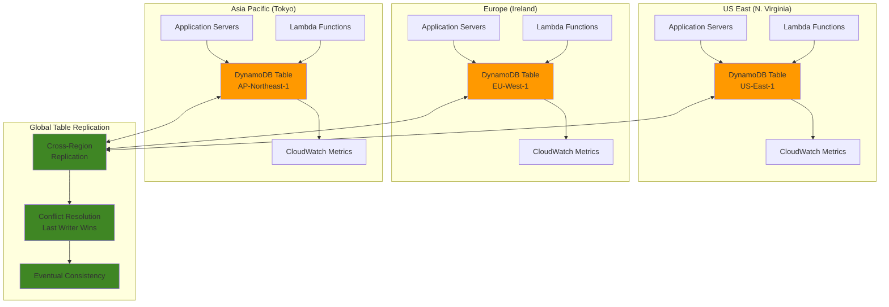

# Implementing DynamoDB Global Tables for Multi-Region Applications

## Problem

Global enterprises with distributed customer bases face critical challenges when implementing multi-region data architectures. Traditional database replication solutions require complex configuration, manual failover procedures, and often result in data consistency issues during cross-region operations. Applications serving customers across multiple continents experience high latency when accessing centralized databases, leading to poor user experience and potential business impact. Without proper multi-region data distribution, organizations risk significant downtime during regional outages and struggle to meet regulatory requirements for data locality and disaster recovery.

## Solution

Amazon DynamoDB Global Tables provide a fully managed, multi-region, multi-active database solution that automatically replicates data across AWS regions without requiring application changes. This solution leverages DynamoDB's built-in global replication capabilities to create a seamless multi-region architecture with eventual consistency, enabling applications to read and write data locally in each region while maintaining data synchronization across all replicas. The implementation includes comprehensive monitoring, conflict resolution mechanisms, and automated failover capabilities to ensure high availability and optimal performance for global applications.

## Architecture Diagram



## Prerequisites

1. AWS account with DynamoDB, CloudWatch, and IAM permissions in multiple regions
2. AWS CLI v2 installed and configured (or AWS CloudShell)
3. Understanding of NoSQL database concepts and DynamoDB architecture
4. Knowledge of AWS regions and multi-region deployment patterns
5. Familiarity with CloudWatch metrics and monitoring concepts
6. Estimated cost: $10-50/month for testing (varies by region and usage patterns)

> **Note**: Global Tables incur additional costs for cross-region replication and may require adjusting read/write capacity based on replication patterns. Learn more about [Global Tables pricing](https://docs.aws.amazon.com/amazondynamodb/latest/developerguide/GlobalTables.html) and replication considerations.

## Preparation

```bash
# Set primary region and account information
export PRIMARY_REGION="us-east-1"
export SECONDARY_REGION="eu-west-1"
export TERTIARY_REGION="ap-northeast-1"
export AWS_ACCOUNT_ID=$(aws sts get-caller-identity \
    --query Account --output text)

# Generate unique identifiers for resources
RANDOM_SUFFIX=$(aws secretsmanager get-random-password \
    --exclude-punctuation --exclude-uppercase \
    --password-length 6 --require-each-included-type \
    --output text --query RandomPassword)

# Set resource names
export TABLE_NAME="GlobalUserProfiles-${RANDOM_SUFFIX}"
export LAMBDA_FUNCTION_NAME="GlobalTableProcessor-${RANDOM_SUFFIX}"
export IAM_ROLE_NAME="GlobalTableRole-${RANDOM_SUFFIX}"

# Create IAM role for Lambda functions
aws iam create-role \
    --role-name ${IAM_ROLE_NAME} \
    --assume-role-policy-document '{
        "Version": "2012-10-17",
        "Statement": [
            {
                "Effect": "Allow",
                "Principal": {
                    "Service": "lambda.amazonaws.com"
                },
                "Action": "sts:AssumeRole"
            }
        ]
    }' \
    --region ${PRIMARY_REGION}

# Attach necessary policies to the role
aws iam attach-role-policy \
    --role-name ${IAM_ROLE_NAME} \
    --policy-arn arn:aws:iam::aws:policy/service-role/AWSLambdaBasicExecutionRole \
    --region ${PRIMARY_REGION}

aws iam attach-role-policy \
    --role-name ${IAM_ROLE_NAME} \
    --policy-arn arn:aws:iam::aws:policy/AmazonDynamoDBFullAccess \
    --region ${PRIMARY_REGION}

# Wait for IAM role to be available
sleep 30

echo "✅ Preparation complete - Primary region: ${PRIMARY_REGION}, Table: ${TABLE_NAME}"
```

## Steps

1. **Create the primary DynamoDB table with global table configuration**:

   DynamoDB Global Tables require [DynamoDB Streams](https://docs.aws.amazon.com/amazondynamodb/latest/developerguide/Streams.html) to capture item-level modifications and replicate changes across regions. This foundational step creates the primary table that will serve as the source for global replication. The composite key structure (UserId + ProfileType) enables efficient data distribution and query patterns across multiple regions while maintaining data consistency through eventual consistency mechanisms.

   ```bash
   # Create the primary table in us-east-1 with streams enabled
   # DynamoDB Streams are required for Global Tables to track changes
   aws dynamodb create-table \
       --table-name ${TABLE_NAME} \
       --attribute-definitions \
           AttributeName=UserId,AttributeType=S \
           AttributeName=ProfileType,AttributeType=S \
       --key-schema \
           AttributeName=UserId,KeyType=HASH \
           AttributeName=ProfileType,KeyType=RANGE \
       --billing-mode PAY_PER_REQUEST \
       --stream-specification StreamEnabled=true,StreamViewType=NEW_AND_OLD_IMAGES \
       --region ${PRIMARY_REGION}
   
   # Wait for table to become active
   aws dynamodb wait table-exists \
       --table-name ${TABLE_NAME} \
       --region ${PRIMARY_REGION}
   
   echo "✅ Primary table created in ${PRIMARY_REGION}"
   ```

   The table is now established with the necessary stream configuration to support global replication. The NEW_AND_OLD_IMAGES stream view type ensures that both the before and after states of modified items are captured, enabling effective conflict resolution across regions.

2. **Add replica tables to create the global table**:

   Creating replicas transforms the single-region table into a [multi-active, multi-region architecture](https://docs.aws.amazon.com/amazondynamodb/latest/developerguide/GlobalTables.html) where each region can independently handle read and write operations. This distributed approach eliminates single points of failure and reduces latency for geographically distributed applications. The replica creation process establishes bi-directional replication streams between regions, enabling near real-time data synchronization across all table replicas.

   ```bash
   # Add replica in Europe (Ireland)
   aws dynamodb update-table \
       --table-name ${TABLE_NAME} \
       --replica-updates \
           Create='{RegionName='${SECONDARY_REGION}'}' \
       --region ${PRIMARY_REGION}
   
   # Add replica in Asia Pacific (Tokyo)
   aws dynamodb update-table \
       --table-name ${TABLE_NAME} \
       --replica-updates \
           Create='{RegionName='${TERTIARY_REGION}'}' \
       --region ${PRIMARY_REGION}
   
   # Wait for replicas to be created
   sleep 120
   
   echo "✅ Global table replicas created in ${SECONDARY_REGION} and ${TERTIARY_REGION}"
   ```

   The replica creation process now configures cross-region replication infrastructure, typically completing within 2-5 minutes. Each replica maintains its own independent capacity settings while sharing the global table's stream configuration for consistent data propagation.

   > **Warning**: Global Table replication may take several minutes to complete. Monitor the replica status before proceeding with data operations to ensure all replicas are active and ready for traffic.

3. **Verify global table configuration and status**:

   ```bash
   # Check global table status
   aws dynamodb describe-table \
       --table-name ${TABLE_NAME} \
       --region ${PRIMARY_REGION} \
       --query 'Table.{TableName:TableName,TableStatus:TableStatus,Replicas:Replicas[*].{Region:RegionName,Status:ReplicaStatus}}'
   
   # Verify each replica table individually
   for region in ${PRIMARY_REGION} ${SECONDARY_REGION} ${TERTIARY_REGION}; do
       echo "Checking table in ${region}:"
       aws dynamodb describe-table \
           --table-name ${TABLE_NAME} \
           --region ${region} \
           --query 'Table.{TableName:TableName,TableStatus:TableStatus,StreamArn:LatestStreamArn}' \
           --output table
   done
   
   echo "✅ Global table configuration verified across all regions"
   ```

4. **Create Lambda functions for testing global table operations**:

   ```bash
   # Create Lambda function code
   cat > /tmp/global-table-processor.py << 'EOF'
   import json
   import boto3
   import os
   import time
   from datetime import datetime
   
   def lambda_handler(event, context):
       # Get region from environment or context
       region = os.environ.get('AWS_REGION', context.invoked_function_arn.split(':')[3])
       
       # Initialize DynamoDB client
       dynamodb = boto3.resource('dynamodb', region_name=region)
       table = dynamodb.Table(os.environ['TABLE_NAME'])
       
       # Process the operation
       operation = event.get('operation', 'put')
       
       if operation == 'put':
           # Create a test item
           user_id = event.get('userId', f'user-{int(time.time())}')
           profile_type = event.get('profileType', 'standard')
           
           response = table.put_item(
               Item={
                   'UserId': user_id,
                   'ProfileType': profile_type,
                   'Name': event.get('name', 'Test User'),
                   'Email': event.get('email', 'test@example.com'),
                   'Region': region,
                   'CreatedAt': datetime.utcnow().isoformat(),
                   'LastModified': datetime.utcnow().isoformat()
               }
           )
           
           return {
               'statusCode': 200,
               'body': json.dumps({
                   'message': f'Item created in {region}',
                   'userId': user_id,
                   'profileType': profile_type
               })
           }
       
       elif operation == 'get':
           # Retrieve an item
           user_id = event.get('userId')
           profile_type = event.get('profileType', 'standard')
           
           response = table.get_item(
               Key={
                   'UserId': user_id,
                   'ProfileType': profile_type
               }
           )
           
           return {
               'statusCode': 200,
               'body': json.dumps({
                   'message': f'Item retrieved from {region}',
                   'item': response.get('Item', 'Not found')
               })
           }
       
       elif operation == 'scan':
           # Scan for items in this region
           response = table.scan(
               ProjectionExpression='UserId, ProfileType, #r',
               ExpressionAttributeNames={'#r': 'Region'},
               Limit=10
           )
           
           return {
               'statusCode': 200,
               'body': json.dumps({
                   'message': f'Items scanned from {region}',
                   'count': response['Count'],
                   'items': response.get('Items', [])
               })
           }
   EOF
   
   # Create deployment package
   cd /tmp
   zip global-table-processor.zip global-table-processor.py
   
   echo "✅ Lambda function code prepared"
   ```

5. **Deploy Lambda functions in each region**:

   ```bash
   # Deploy Lambda function in primary region
   aws lambda create-function \
       --function-name ${LAMBDA_FUNCTION_NAME} \
       --runtime python3.9 \
       --role arn:aws:iam::${AWS_ACCOUNT_ID}:role/${IAM_ROLE_NAME} \
       --handler global-table-processor.lambda_handler \
       --zip-file fileb:///tmp/global-table-processor.zip \
       --environment Variables="{TABLE_NAME=${TABLE_NAME}}" \
       --region ${PRIMARY_REGION}
   
   # Deploy Lambda function in secondary region
   aws lambda create-function \
       --function-name ${LAMBDA_FUNCTION_NAME} \
       --runtime python3.9 \
       --role arn:aws:iam::${AWS_ACCOUNT_ID}:role/${IAM_ROLE_NAME} \
       --handler global-table-processor.lambda_handler \
       --zip-file fileb:///tmp/global-table-processor.zip \
       --environment Variables="{TABLE_NAME=${TABLE_NAME}}" \
       --region ${SECONDARY_REGION}
   
   # Deploy Lambda function in tertiary region
   aws lambda create-function \
       --function-name ${LAMBDA_FUNCTION_NAME} \
       --runtime python3.9 \
       --role arn:aws:iam::${AWS_ACCOUNT_ID}:role/${IAM_ROLE_NAME} \
       --handler global-table-processor.lambda_handler \
       --zip-file fileb:///tmp/global-table-processor.zip \
       --environment Variables="{TABLE_NAME=${TABLE_NAME}}" \
       --region ${TERTIARY_REGION}
   
   # Wait for functions to be available
   sleep 30
   
   echo "✅ Lambda functions deployed in all regions"
   ```

6. **Test cross-region data replication**:

   ```bash
   # Write data from primary region
   aws lambda invoke \
       --function-name ${LAMBDA_FUNCTION_NAME} \
       --payload '{
           "operation": "put",
           "userId": "user-001",
           "profileType": "premium",
           "name": "John Doe",
           "email": "john.doe@example.com"
       }' \
       --region ${PRIMARY_REGION} \
       /tmp/response-primary.json
   
   echo "Data written from ${PRIMARY_REGION}:"
   cat /tmp/response-primary.json
   
   # Write data from secondary region
   aws lambda invoke \
       --function-name ${LAMBDA_FUNCTION_NAME} \
       --payload '{
           "operation": "put",
           "userId": "user-002",
           "profileType": "standard",
           "name": "Jane Smith",
           "email": "jane.smith@example.com"
       }' \
       --region ${SECONDARY_REGION} \
       /tmp/response-secondary.json
   
   echo "Data written from ${SECONDARY_REGION}:"
   cat /tmp/response-secondary.json
   
   # Wait for replication
   sleep 15
   
   echo "✅ Test data written to multiple regions"
   ```

7. **Verify data consistency across regions**:

   ```bash
   # Read data from all regions to verify replication
   for region in ${PRIMARY_REGION} ${SECONDARY_REGION} ${TERTIARY_REGION}; do
       echo "Reading from ${region}:"
       aws lambda invoke \
           --function-name ${LAMBDA_FUNCTION_NAME} \
           --payload '{
               "operation": "get",
               "userId": "user-001",
               "profileType": "premium"
           }' \
           --region ${region} \
           /tmp/response-${region}.json
       
       cat /tmp/response-${region}.json
       echo ""
   done
   
   echo "✅ Data consistency verified across all regions"
   ```

8. **Set up CloudWatch monitoring for global table metrics**:

   Comprehensive monitoring is essential for maintaining the health and performance of global table architectures. [CloudWatch DynamoDB metrics](https://docs.aws.amazon.com/amazondynamodb/latest/developerguide/Monitoring-metrics-with-Amazon-CloudWatch.html) provide visibility into replication performance, error rates, and operational health across all regions. ReplicationLatency metrics help detect network issues or capacity constraints that could impact data consistency, while UserErrors metrics identify application-level issues that require attention.

   ```bash
   # Create CloudWatch alarms for replication latency
   aws cloudwatch put-metric-alarm \
       --alarm-name "GlobalTable-ReplicationLatency-${TABLE_NAME}" \
       --alarm-description "Monitor replication latency for global table" \
       --metric-name ReplicationLatency \
       --namespace AWS/DynamoDB \
       --statistic Average \
       --period 300 \
       --threshold 10000 \
       --comparison-operator GreaterThanThreshold \
       --evaluation-periods 2 \
       --dimensions Name=TableName,Value=${TABLE_NAME} \
                    Name=ReceivingRegion,Value=${SECONDARY_REGION} \
       --region ${PRIMARY_REGION}
   
   # Create alarm for user errors
   aws cloudwatch put-metric-alarm \
       --alarm-name "GlobalTable-UserErrors-${TABLE_NAME}" \
       --alarm-description "Monitor user errors for global table" \
       --metric-name UserErrors \
       --namespace AWS/DynamoDB \
       --statistic Sum \
       --period 300 \
       --threshold 5 \
       --comparison-operator GreaterThanThreshold \
       --evaluation-periods 2 \
       --dimensions Name=TableName,Value=${TABLE_NAME} \
       --region ${PRIMARY_REGION}
   
   
   echo "✅ CloudWatch monitoring configured for global table metrics"
   ```

   These monitoring configurations establish proactive alerting for global table operations. The 10-second replication latency threshold ensures rapid detection of performance degradation, while user error monitoring helps identify application issues before they impact customer experience.

9. **Test conflict resolution with concurrent writes**:

   DynamoDB Global Tables automatically handle conflicts using a "last writer wins" approach based on timestamps, ensuring [eventual consistency](https://docs.aws.amazon.com/amazondynamodb/latest/developerguide/HowItWorks.ReadConsistency.html) across all replicas. This mechanism resolves conflicts when the same item is simultaneously modified in multiple regions, maintaining data integrity without requiring manual intervention. Understanding conflict resolution behavior is crucial for designing applications that work effectively with global table architectures.

   ```bash
   # Simulate concurrent writes to the same item from different regions
   echo "Testing conflict resolution with concurrent writes..."
   
   # Write from primary region
   aws lambda invoke \
       --function-name ${LAMBDA_FUNCTION_NAME} \
       --payload '{
           "operation": "put",
           "userId": "conflict-test",
           "profileType": "standard",
           "name": "Primary Region Update",
           "email": "primary@example.com"
       }' \
       --region ${PRIMARY_REGION} \
       /tmp/conflict-primary.json &
   
   # Write from secondary region (almost simultaneously)
   aws lambda invoke \
       --function-name ${LAMBDA_FUNCTION_NAME} \
       --payload '{
           "operation": "put",
           "userId": "conflict-test",
           "profileType": "standard",
           "name": "Secondary Region Update",
           "email": "secondary@example.com"
       }' \
       --region ${SECONDARY_REGION} \
       /tmp/conflict-secondary.json &
   
   # Wait for both operations to complete
   wait
   
   # Wait for replication and conflict resolution
   sleep 20
   
   echo "✅ Conflict resolution test completed"
   ```

   The conflict resolution mechanism will automatically determine the winning write based on timestamps, ensuring all replicas converge to the same final state. This test demonstrates how Global Tables maintain consistency even under concurrent write scenarios from different regions.

10. **Create comprehensive monitoring dashboard**:

    Centralized monitoring dashboards provide operational visibility across all global table regions, enabling rapid identification of performance issues and capacity constraints. The dashboard aggregates key metrics including capacity utilization, replication latency, and error rates, providing a unified view of global table health. This operational foundation supports proactive management and ensures consistent application performance across all regions.

    ```bash
    # Create CloudWatch dashboard for global table monitoring
    cat > /tmp/dashboard-body.json << EOF
    {
        "widgets": [
            {
                "type": "metric",
                "properties": {
                    "metrics": [
                        ["AWS/DynamoDB", "ConsumedReadCapacityUnits", "TableName", "${TABLE_NAME}"],
                        [".", "ConsumedWriteCapacityUnits", ".", "."]
                    ],
                    "period": 300,
                    "stat": "Sum",
                    "region": "${PRIMARY_REGION}",
                    "title": "Read/Write Capacity"
                }
            },
            {
                "type": "metric",
                "properties": {
                    "metrics": [
                        ["AWS/DynamoDB", "ReplicationLatency", "TableName", "${TABLE_NAME}", "ReceivingRegion", "${SECONDARY_REGION}"],
                        [".", ".", ".", ".", ".", "${TERTIARY_REGION}"]
                    ],
                    "period": 300,
                    "stat": "Average",
                    "region": "${PRIMARY_REGION}",
                    "title": "Replication Latency"
                }
            }
        ]
    }
    EOF
    
    aws cloudwatch put-dashboard \
        --dashboard-name "GlobalTable-${TABLE_NAME}" \
        --dashboard-body file:///tmp/dashboard-body.json \
        --region ${PRIMARY_REGION}
    
    echo "✅ CloudWatch dashboard created for global table monitoring"
    ```

    The monitoring dashboard is now configured to provide real-time visibility into global table performance, enabling operations teams to quickly identify and respond to capacity or latency issues across all regions.

11. **Test regional failover capabilities**:

    Regional failover capabilities are fundamental to global table architecture, enabling applications to seamlessly redirect traffic from unhealthy regions to available replicas. This multi-active design ensures continuous service availability even during regional outages or maintenance windows. Testing failover scenarios validates the application's resilience and helps establish operational procedures for handling regional failures in production environments.

    ```bash
    # Simulate regional failover by routing traffic to different regions
    echo "Testing regional failover capabilities..."
    
    # Test reading from each region during normal operations
    for region in ${PRIMARY_REGION} ${SECONDARY_REGION} ${TERTIARY_REGION}; do
        echo "Testing failover - Reading from ${region}:"
        aws lambda invoke \
            --function-name ${LAMBDA_FUNCTION_NAME} \
            --payload '{
                "operation": "scan"
            }' \
            --region ${region} \
            /tmp/failover-${region}.json
        
        cat /tmp/failover-${region}.json
        echo ""
    done
    
    echo "✅ Regional failover testing completed"
    ```

    The failover testing demonstrates that applications can successfully read from any available region, providing the foundation for implementing automated failover logic in production environments. This capability ensures business continuity during regional disruptions.

12. **Configure Global Secondary Index (GSI) for optimized queries**:

    Global Secondary Indexes automatically replicate across all global table regions, providing consistent query capabilities and maintaining the same performance characteristics as the primary table. This feature enables applications to efficiently query data using different access patterns while preserving the global table's multi-region architecture. The GSI configuration demonstrates how complex query requirements can be satisfied without compromising the global distribution benefits.

    ```bash
    # Add a Global Secondary Index to the table
    aws dynamodb update-table \
        --table-name ${TABLE_NAME} \
        --attribute-definitions \
            AttributeName=Email,AttributeType=S \
        --global-secondary-index-updates \
            '[{
                "Create": {
                    "IndexName": "EmailIndex",
                    "KeySchema": [
                        {
                            "AttributeName": "Email",
                            "KeyType": "HASH"
                        }
                    ],
                    "Projection": {
                        "ProjectionType": "ALL"
                    },
                    "BillingMode": "PAY_PER_REQUEST"
                }
            }]' \
        --region ${PRIMARY_REGION}
    
    # Wait for GSI to be created and active
    sleep 180
    
    echo "✅ Global Secondary Index configured for optimized email queries"
    ```

    The Global Secondary Index is now available across all regions, enabling efficient email-based queries while maintaining the global table's consistency and replication characteristics. This configuration supports diverse application query patterns without requiring additional infrastructure management.

## Validation & Testing

1. **Verify global table replication status**:

   ```bash
   # Check replication status across all regions
   aws dynamodb describe-table \
       --table-name ${TABLE_NAME} \
       --region ${PRIMARY_REGION} \
       --query 'Table.Replicas[*].{Region:RegionName,Status:ReplicaStatus,GlobalSecondaryIndexes:GlobalSecondaryIndexes[*].IndexName}'
   ```

   Expected output: All replicas should show "ACTIVE" status with GSI replicated.

2. **Test cross-region data consistency**:

   ```bash
   # Scan all regions to verify data consistency
   for region in ${PRIMARY_REGION} ${SECONDARY_REGION} ${TERTIARY_REGION}; do
       echo "Scanning ${region}:"
       aws dynamodb scan \
           --table-name ${TABLE_NAME} \
           --region ${region} \
           --query 'Items[*].{UserId:UserId,ProfileType:ProfileType,Region:Region}' \
           --output table
   done
   ```

   Expected output: All regions should show the same user data with regional metadata.

3. **Verify CloudWatch metrics and alarms**:

   ```bash
   # Check CloudWatch metrics for replication latency
   aws cloudwatch get-metric-statistics \
       --namespace AWS/DynamoDB \
       --metric-name ReplicationLatency \
       --dimensions Name=TableName,Value=${TABLE_NAME} \
                    Name=ReceivingRegion,Value=${SECONDARY_REGION} \
       --start-time $(date -u -d '1 hour ago' +%Y-%m-%dT%H:%M:%S) \
       --end-time $(date -u +%Y-%m-%dT%H:%M:%S) \
       --period 300 \
       --statistics Average \
       --region ${PRIMARY_REGION}
   ```

   Expected output: Metric data showing replication latency (typically under 1 second).

4. **Test Global Secondary Index functionality**:

   ```bash
   # Query using the GSI
   aws dynamodb query \
       --table-name ${TABLE_NAME} \
       --index-name EmailIndex \
       --key-condition-expression "Email = :email" \
       --expression-attribute-values '{":email":{"S":"john.doe@example.com"}}' \
       --region ${PRIMARY_REGION}
   ```

   Expected output: Should return the user record indexed by email address.

## Cleanup

1. **Remove CloudWatch alarms and dashboard**:

   ```bash
   # Delete CloudWatch alarms
   aws cloudwatch delete-alarms \
       --alarm-names "GlobalTable-ReplicationLatency-${TABLE_NAME}" \
                     "GlobalTable-UserErrors-${TABLE_NAME}" \
       --region ${PRIMARY_REGION}
   
   # Delete CloudWatch dashboard
   aws cloudwatch delete-dashboards \
       --dashboard-names "GlobalTable-${TABLE_NAME}" \
       --region ${PRIMARY_REGION}
   
   echo "✅ CloudWatch monitoring resources deleted"
   ```

2. **Delete Lambda functions from all regions**:

   ```bash
   # Delete Lambda functions from each region
   for region in ${PRIMARY_REGION} ${SECONDARY_REGION} ${TERTIARY_REGION}; do
       aws lambda delete-function \
           --function-name ${LAMBDA_FUNCTION_NAME} \
           --region ${region}
       echo "Lambda function deleted from ${region}"
   done
   
   echo "✅ Lambda functions deleted from all regions"
   ```

3. **Remove global table replicas**:

   ```bash
   # Remove replica from tertiary region
   aws dynamodb update-table \
       --table-name ${TABLE_NAME} \
       --replica-updates \
           Delete='{RegionName='${TERTIARY_REGION}'}' \
       --region ${PRIMARY_REGION}
   
   # Remove replica from secondary region
   aws dynamodb update-table \
       --table-name ${TABLE_NAME} \
       --replica-updates \
           Delete='{RegionName='${SECONDARY_REGION}'}' \
       --region ${PRIMARY_REGION}
   
   # Wait for replicas to be removed
   sleep 120
   
   echo "✅ Global table replicas removed"
   ```

4. **Delete the primary table**:

   ```bash
   # Delete the primary table
   aws dynamodb delete-table \
       --table-name ${TABLE_NAME} \
       --region ${PRIMARY_REGION}
   
   # Wait for table deletion
   aws dynamodb wait table-not-exists \
       --table-name ${TABLE_NAME} \
       --region ${PRIMARY_REGION}
   
   echo "✅ Primary table deleted"
   ```

5. **Clean up IAM resources**:

   ```bash
   # Detach policies from IAM role
   aws iam detach-role-policy \
       --role-name ${IAM_ROLE_NAME} \
       --policy-arn arn:aws:iam::aws:policy/service-role/AWSLambdaBasicExecutionRole \
       --region ${PRIMARY_REGION}
   
   aws iam detach-role-policy \
       --role-name ${IAM_ROLE_NAME} \
       --policy-arn arn:aws:iam::aws:policy/AmazonDynamoDBFullAccess \
       --region ${PRIMARY_REGION}
   
   # Delete IAM role
   aws iam delete-role \
       --role-name ${IAM_ROLE_NAME} \
       --region ${PRIMARY_REGION}
   
   # Clean up temporary files
   rm -f /tmp/global-table-processor.py \
         /tmp/global-table-processor.zip \
         /tmp/dashboard-body.json \
         /tmp/response-*.json \
         /tmp/conflict-*.json \
         /tmp/failover-*.json
   
   echo "✅ All resources cleaned up successfully"
   ```

## Discussion

DynamoDB Global Tables represent a sophisticated approach to multi-region data distribution that addresses critical challenges in global application architecture. The implementation leverages Amazon's managed replication infrastructure to provide seamless data synchronization across multiple AWS regions, enabling applications to achieve both low latency and high availability without the complexity of traditional database replication solutions.

The key architectural principle behind Global Tables is the multi-active approach, where each regional replica can independently handle both read and write operations. This design eliminates the single point of failure inherent in traditional master-slave replication models while providing eventual consistency through DynamoDB's last-writer-wins conflict resolution mechanism. The system automatically handles cross-region replication, typically achieving replication latencies under one second between regions, making it suitable for applications requiring near real-time data synchronization.

Global Tables excel in scenarios requiring geographic distribution of data for compliance, performance, or availability reasons. E-commerce platforms can maintain user profiles and shopping cart data across multiple regions to ensure consistent customer experiences regardless of their location. Financial services can leverage Global Tables to maintain account information and transaction history across regions while meeting regulatory requirements for data locality. The automatic conflict resolution ensures data consistency even during simultaneous updates from different regions, though applications should be designed to handle eventual consistency patterns appropriately.

The monitoring and operational aspects of Global Tables integrate seamlessly with AWS CloudWatch, providing comprehensive visibility into replication performance, error rates, and regional health. The ReplicationLatency metric serves as a crucial indicator for application performance, while User Errors and System Errors metrics help identify potential issues before they impact applications. Organizations should establish monitoring thresholds and alerting strategies based on their specific latency and availability requirements.

> **Tip**: Design your application to handle eventual consistency gracefully by implementing read-after-write consistency patterns when immediate consistency is required, and use consistent reads for critical operations within a single region. Review the [DynamoDB consistency model](https://docs.aws.amazon.com/amazondynamodb/latest/developerguide/HowItWorks.ReadConsistency.html) for comprehensive guidance on managing consistency in distributed systems.

## Challenge

Extend this solution by implementing these advanced enhancements:

1. **Implement multi-region strong consistency (MRSC)** - Convert the global table to use multi-region strong consistency mode for applications requiring immediate consistency across regions, and compare the performance characteristics with eventual consistency.

2. **Create automated regional failover logic** - Develop a sophisticated health check system using Route 53 health checks and Lambda functions that automatically routes application traffic away from unhealthy regions and back when they recover.

3. **Implement cross-region backup strategies** - Design a comprehensive backup solution that creates point-in-time snapshots across all regions and enables cross-region disaster recovery with automated restoration capabilities.

4. **Build advanced conflict resolution mechanisms** - Develop custom conflict resolution logic using DynamoDB Streams and Lambda functions that handles complex business rules beyond the default last-writer-wins approach.

5. **Create cost optimization automation** - Implement intelligent capacity management that automatically adjusts read/write capacity based on regional usage patterns and replication requirements, including automated scaling during peak traffic periods.

## Infrastructure Code

*Infrastructure code will be generated after recipe approval.*