# Implementing EC2 Fleet Management with Spot Fleet and On-Demand Instances

## Problem

Organizations running compute-intensive workloads face significant cost challenges when using only On-Demand EC2 instances, often paying 50-90% more than necessary. Manual instance management becomes unscalable as workloads grow across multiple Availability Zones and instance types. Without automated fleet management, applications experience poor availability during capacity constraints and lack cost optimization through intelligent mixing of instance purchasing options.

## Solution

Implement EC2 Fleet management using a combination of Spot Fleet and On-Demand instances to achieve cost savings of up to 90% while maintaining high availability. The solution automatically distributes instances across multiple Availability Zones and instance types, with intelligent capacity rebalancing to handle Spot interruptions and seamless fallback to On-Demand instances when needed.

## Architecture Diagram

```mermaid
graph TB
    subgraph "Management Layer"
        FLEET[EC2 Fleet Manager]
        LT[Launch Template]
        CONFIG[Fleet Configuration]
    end
    
    subgraph "Compute Resources"
        subgraph "Availability Zone A"
            SPOT_A[Spot Instances]
            OD_A[On-Demand Instances]
        end
        
        subgraph "Availability Zone B"
            SPOT_B[Spot Instances]
            OD_B[On-Demand Instances]
        end
        
        subgraph "Availability Zone C"
            SPOT_C[Spot Instances]
            OD_C[On-Demand Instances]
        end
    end
    
    subgraph "Monitoring"
        CW[CloudWatch Metrics]
        EVENTS[EventBridge Events]
    end
    
    CONFIG --> FLEET
    LT --> FLEET
    FLEET --> SPOT_A
    FLEET --> SPOT_B
    FLEET --> SPOT_C
    FLEET --> OD_A
    FLEET --> OD_B
    FLEET --> OD_C
    
    SPOT_A --> CW
    SPOT_B --> CW
    SPOT_C --> CW
    OD_A --> CW
    OD_B --> CW
    OD_C --> CW
    
    FLEET --> EVENTS
    
    style FLEET fill:#FF9900
    style SPOT_A fill:#3F8624
    style SPOT_B fill:#3F8624
    style SPOT_C fill:#3F8624
    style OD_A fill:#232F3E
    style OD_B fill:#232F3E
    style OD_C fill:#232F3E
```



## Prerequisites

1. AWS account with EC2 full access permissions and fleet management capabilities
2. AWS CLI v2 installed and configured (or AWS CloudShell)
3. Understanding of EC2 instance types, Spot pricing, and launch templates
4. VPC with subnets across multiple Availability Zones
5. Estimated cost: $10-30/hour for fleet resources (varies by instance mix and region)

> **Note**: Spot instances can be interrupted with 2-minute notice, so ensure your applications can handle graceful shutdowns.

## Preparation

```bash
# Set environment variables
export AWS_REGION=$(aws configure get region)
export AWS_ACCOUNT_ID=$(aws sts get-caller-identity \
    --query Account --output text)

# Generate unique identifiers for resources
RANDOM_SUFFIX=$(aws secretsmanager get-random-password \
    --exclude-punctuation --exclude-uppercase \
    --password-length 6 --require-each-included-type \
    --output text --query RandomPassword)

export FLEET_NAME="ec2-fleet-demo-${RANDOM_SUFFIX}"
export LAUNCH_TEMPLATE_NAME="fleet-template-${RANDOM_SUFFIX}"
export KEY_PAIR_NAME="fleet-keypair-${RANDOM_SUFFIX}"
export SECURITY_GROUP_NAME="fleet-sg-${RANDOM_SUFFIX}"

# Get default VPC ID and subnets
export VPC_ID=$(aws ec2 describe-vpcs \
    --filters "Name=is-default,Values=true" \
    --query 'Vpcs[0].VpcId' --output text)

export SUBNET_IDS=$(aws ec2 describe-subnets \
    --filters "Name=vpc-id,Values=${VPC_ID}" \
    --query 'Subnets[*].SubnetId' --output text)

echo "Fleet Name: ${FLEET_NAME}"
echo "VPC ID: ${VPC_ID}"
echo "Subnet IDs: ${SUBNET_IDS}"
```

## Steps

1. **Create security group for fleet instances**:

   Security groups act as virtual firewalls that control inbound and outbound traffic to your EC2 instances, providing essential network-level security for your fleet architecture. By establishing proper security group rules upfront, you create a foundational security layer that protects all instances in your fleet while enabling necessary application connectivity. This security-first approach ensures compliance with AWS security best practices and reduces the attack surface for your distributed workload.

   ```bash
   # Create security group
   SECURITY_GROUP_ID=$(aws ec2 create-security-group \
       --group-name "${SECURITY_GROUP_NAME}" \
       --description "Security group for EC2 Fleet demo" \
       --vpc-id "${VPC_ID}" \
       --query 'GroupId' --output text)
   
   # Allow SSH access (adjust CIDR as needed)
   aws ec2 authorize-security-group-ingress \
       --group-id "${SECURITY_GROUP_ID}" \
       --protocol tcp --port 22 \
       --cidr 0.0.0.0/0
   
   # Allow HTTP traffic
   aws ec2 authorize-security-group-ingress \
       --group-id "${SECURITY_GROUP_ID}" \
       --protocol tcp --port 80 \
       --cidr 0.0.0.0/0
   
   echo "✅ Created security group: ${SECURITY_GROUP_ID}"
   ```

   The security group is now active and ready to secure your fleet instances with stateful firewall rules. This configuration enables essential management access through SSH and web traffic through HTTP, while maintaining security by restricting access to only required ports. The security group will be automatically applied to all instances launched by your fleet, ensuring consistent security posture across your distributed infrastructure.

2. **Create key pair for EC2 instances**:

   EC2 key pairs provide secure, cryptographic access to your instances using public-key cryptography, eliminating the need for password-based authentication. This approach significantly enhances security by ensuring that only users with the corresponding private key can access instances, while enabling seamless SSH connectivity for administrative tasks. Key pairs are essential for fleet management as they provide consistent, secure access across all instances in your fleet.

   ```bash
   # Create key pair
   aws ec2 create-key-pair \
       --key-name "${KEY_PAIR_NAME}" \
       --query 'KeyMaterial' --output text > "${KEY_PAIR_NAME}.pem"
   
   # Set proper permissions
   chmod 400 "${KEY_PAIR_NAME}.pem"
   
   echo "✅ Created key pair: ${KEY_PAIR_NAME}"
   ```

   The key pair is now ready for secure instance authentication, with the public key stored in AWS and the private key saved locally. This cryptographic foundation enables secure SSH access to any instance in your fleet without requiring password authentication. The private key file has been configured with restrictive permissions (400) to prevent unauthorized access, following security best practices for credential management.

3. **Get latest Amazon Linux 2023 AMI ID**:

   Amazon Machine Images (AMIs) serve as the foundational templates that define the operating system, initial software configuration, and system settings for your EC2 instances. By selecting the latest Amazon Linux 2023 AMI, you ensure your fleet instances launch with the most recent security patches, AWS CLI tools, and optimized configurations. This approach provides consistency across your fleet while leveraging AWS-optimized performance and security features built into Amazon Linux 2023.

   ```bash
   # Get latest Amazon Linux 2023 AMI
   export AMI_ID=$(aws ec2 describe-images \
       --owners amazon \
       --filters "Name=name,Values=al2023-ami-*-x86_64" \
             "Name=state,Values=available" \
       --query 'Images | sort_by(@, &CreationDate) | [-1].ImageId' \
       --output text)
   
   echo "✅ Using AMI: ${AMI_ID}"
   ```

   The AMI selection is now complete, providing your fleet with a standardized, secure operating system foundation. This latest Amazon Linux 2023 AMI includes pre-installed AWS CLI tools, CloudWatch monitoring agents, and security-optimized configurations that reduce operational overhead. All instances launched in your fleet will use this consistent base image, ensuring predictable behavior and simplified management across your distributed infrastructure.

4. **Create launch template for fleet instances**:

   Launch templates provide a centralized, versioned blueprint for instance configuration that enables consistent deployments across your fleet infrastructure. By consolidating AMI selection, instance type specifications, security settings, and user data into a reusable template, you establish operational consistency and simplify fleet management. This approach reduces configuration errors, enables version control for infrastructure changes, and provides the foundation for advanced fleet features like mixed instance types and capacity rebalancing.

   ```bash
   # Create launch template with user data
   cat > fleet-user-data.sh << 'EOF'
#!/bin/bash
dnf update -y
dnf install -y httpd
systemctl start httpd
systemctl enable httpd
echo "<h1>EC2 Fleet Instance</h1>" > /var/www/html/index.html
echo "<p>Instance ID: $(curl -s http://169.254.169.254/latest/meta-data/instance-id)</p>" >> /var/www/html/index.html
echo "<p>Instance Type: $(curl -s http://169.254.169.254/latest/meta-data/instance-type)</p>" >> /var/www/html/index.html
echo "<p>Availability Zone: $(curl -s http://169.254.169.254/latest/meta-data/placement/availability-zone)</p>" >> /var/www/html/index.html
EOF
   
   # Create launch template
   LAUNCH_TEMPLATE_ID=$(aws ec2 create-launch-template \
       --launch-template-name "${LAUNCH_TEMPLATE_NAME}" \
       --launch-template-data '{
           "ImageId": "'${AMI_ID}'",
           "InstanceType": "t3.micro",
           "KeyName": "'${KEY_PAIR_NAME}'",
           "SecurityGroupIds": ["'${SECURITY_GROUP_ID}'"],
           "UserData": "'$(base64 -w 0 fleet-user-data.sh)'",
           "TagSpecifications": [{
               "ResourceType": "instance",
               "Tags": [
                   {"Key": "Name", "Value": "Fleet-Instance"},
                   {"Key": "Project", "Value": "EC2-Fleet-Demo"}
               ]
           }]
       }' \
       --query 'LaunchTemplate.LaunchTemplateId' --output text)
   
   echo "✅ Created launch template: ${LAUNCH_TEMPLATE_ID}"
   ```

   The launch template is now ready to serve as the deployment blueprint for your fleet instances. This configuration template enables EC2 Fleet to launch instances with consistent settings while supporting advanced features like mixed instance types and capacity rebalancing. The user data script will automatically configure each instance with a simple web server, allowing you to easily verify fleet functionality and monitor instance distribution across Availability Zones.

   > **Tip**: Launch templates support mixed instance types and can include multiple network interfaces, making them more flexible than launch configurations. See [Launch Template Documentation](https://docs.aws.amazon.com/AWSEC2/latest/UserGuide/launch-instances-from-launch-template.html) for advanced configurations.

5. **Create IAM role for Spot Fleet**:

   IAM service roles enable AWS services to perform actions on your behalf while maintaining security through the principle of least privilege. For Spot Fleet operations, this role grants the necessary permissions to launch, monitor, and terminate instances while ensuring that only the Spot Fleet service can assume these permissions. This separation of concerns enhances security by preventing direct API access while enabling automated fleet management capabilities essential for cost-effective, scalable workload deployment.

   ```bash
   # Create trust policy for Spot Fleet
   cat > spot-fleet-trust-policy.json << 'EOF'
{
    "Version": "2012-10-17",
    "Statement": [
        {
            "Effect": "Allow",
            "Principal": {
                "Service": "spotfleet.amazonaws.com"
            },
            "Action": "sts:AssumeRole"
        }
    ]
}
EOF
   
   # Create IAM role
   SPOT_FLEET_ROLE_ARN=$(aws iam create-role \
       --role-name "aws-ec2-spot-fleet-role-${RANDOM_SUFFIX}" \
       --assume-role-policy-document file://spot-fleet-trust-policy.json \
       --query 'Role.Arn' --output text)
   
   # Attach AWS managed policy
   aws iam attach-role-policy \
       --role-name "aws-ec2-spot-fleet-role-${RANDOM_SUFFIX}" \
       --policy-arn "arn:aws:iam::aws:policy/service-role/AmazonEC2SpotFleetRequestRole"
   
   echo "✅ Created Spot Fleet IAM role: ${SPOT_FLEET_ROLE_ARN}"
   ```

   The IAM role is now configured and ready to enable Spot Fleet operations with appropriate permissions. This role allows the Spot Fleet service to launch, tag, and terminate instances while maintaining security through controlled access. The role operates independently of any instance-level permissions, creating a clear separation between service management and application functionality. For more details, see [Spot Fleet Permissions](https://docs.aws.amazon.com/AWSEC2/latest/UserGuide/spot-fleet-prerequisites.html).

6. **Create EC2 Fleet configuration**:

   EC2 Fleet configuration defines the intelligent orchestration strategy that balances cost optimization with availability requirements through mixed instance types and purchasing options. This configuration enables sophisticated allocation strategies like capacity-optimized for Spot instances and diversified for On-Demand instances, maximizing both cost savings and fault tolerance. The fleet automatically handles capacity rebalancing, instance type diversification, and seamless fallback between Spot and On-Demand instances to maintain your desired capacity while minimizing costs.

   ```bash
   # Get availability zones for subnets
   SUBNET_1=$(echo ${SUBNET_IDS} | cut -d' ' -f1)
   SUBNET_2=$(echo ${SUBNET_IDS} | cut -d' ' -f2)
   AZ_1=$(aws ec2 describe-subnets --subnet-ids ${SUBNET_1} \
       --query 'Subnets[0].AvailabilityZone' --output text)
   AZ_2=$(aws ec2 describe-subnets --subnet-ids ${SUBNET_2} \
       --query 'Subnets[0].AvailabilityZone' --output text)
   
   # Create fleet configuration file
   cat > ec2-fleet-config.json << EOF
{
    "LaunchTemplateConfigs": [
        {
            "LaunchTemplateSpecification": {
                "LaunchTemplateId": "${LAUNCH_TEMPLATE_ID}",
                "Version": "1"
            },
            "Overrides": [
                {
                    "InstanceType": "t3.micro",
                    "SubnetId": "${SUBNET_1}"
                },
                {
                    "InstanceType": "t3.small",
                    "SubnetId": "${SUBNET_2}"
                },
                {
                    "InstanceType": "t3.nano",
                    "SubnetId": "${SUBNET_1}"
                }
            ]
        }
    ],
    "TargetCapacitySpecification": {
        "TotalTargetCapacity": 6,
        "OnDemandTargetCapacity": 2,
        "SpotTargetCapacity": 4,
        "DefaultTargetCapacityType": "spot"
    },
    "OnDemandOptions": {
        "AllocationStrategy": "diversified"
    },
    "SpotOptions": {
        "AllocationStrategy": "capacity-optimized",
        "InstanceInterruptionBehavior": "terminate",
        "ReplaceUnhealthyInstances": true
    },
    "Type": "maintain",
    "ExcessCapacityTerminationPolicy": "termination",
    "ReplaceUnhealthyInstances": true,
    "TagSpecifications": [
        {
            "ResourceType": "fleet",
            "Tags": [
                {"Key": "Name", "Value": "${FLEET_NAME}"},
                {"Key": "Project", "Value": "EC2-Fleet-Demo"}
            ]
        }
    ]
}
EOF
   
   echo "✅ Created EC2 Fleet configuration"
   ```

   The fleet configuration is now ready to orchestrate your mixed-instance deployment with intelligent allocation strategies. This configuration combines capacity-optimized Spot allocation to minimize interruptions with diversified On-Demand allocation to maximize fault tolerance. The maintain fleet type ensures continuous capacity management, automatically replacing terminated instances and rebalancing across Availability Zones for optimal availability and cost efficiency. Learn more about configuration options in the [EC2 Fleet Documentation](https://docs.aws.amazon.com/AWSEC2/latest/UserGuide/create-ec2-fleet.html).

   > **Warning**: Setting excessive target capacity can result in unexpected costs. Always monitor your fleet's actual capacity and adjust limits as needed. Use AWS Budgets to set spending alerts for EC2 resources.

7. **Launch EC2 Fleet**:

   Fleet deployment initiates the automated orchestration of your mixed-instance infrastructure, leveraging AWS's intelligent allocation algorithms to optimize both cost and availability. The fleet service evaluates Spot pricing across multiple instance types and Availability Zones, automatically selecting the most cost-effective combinations while maintaining your specified capacity targets. This process demonstrates the power of AWS automation in reducing operational overhead while achieving significant cost savings through intelligent resource allocation.

   ```bash
   # Create EC2 Fleet
   FLEET_ID=$(aws ec2 create-fleet \
       --cli-input-json file://ec2-fleet-config.json \
       --query 'FleetId' --output text)
   
   echo "✅ Created EC2 Fleet: ${FLEET_ID}"
   
   # Wait for fleet to be active
   echo "Waiting for fleet to become active..."
   sleep 30
   
   echo "✅ EC2 Fleet is now operational"
   ```

   Your EC2 Fleet is now operational and actively managing instance capacity across multiple Availability Zones and instance types. The fleet transitions through states (submitted → modifying → active) as it evaluates capacity requirements and launches instances according to your configuration. With the fleet active, AWS automatically monitors Spot pricing, handles instance interruptions, and maintains your desired capacity through intelligent rebalancing and replacement strategies.

8. **Create Spot Fleet for comparison**:

   Spot Fleet represents the predecessor to EC2 Fleet, focusing primarily on Spot instance management with simplified configuration options. By deploying both fleet types, you can compare their capabilities and understand the evolution of AWS fleet management services. This comparison highlights the advanced features available in EC2 Fleet, including mixed instance types, enhanced allocation strategies, and improved integration with other AWS services, while demonstrating the cost optimization benefits that both services provide.

   ```bash
   # Create Spot Fleet configuration
   cat > spot-fleet-config.json << EOF
{
    "IamFleetRole": "${SPOT_FLEET_ROLE_ARN}",
    "AllocationStrategy": "capacity-optimized",
    "TargetCapacity": 3,
    "SpotPrice": "0.10",
    "LaunchSpecifications": [
        {
            "ImageId": "${AMI_ID}",
            "InstanceType": "t3.micro",
            "KeyName": "${KEY_PAIR_NAME}",
            "SecurityGroups": [
                {
                    "GroupId": "${SECURITY_GROUP_ID}"
                }
            ],
            "SubnetId": "${SUBNET_1}",
            "UserData": "$(base64 -w 0 fleet-user-data.sh)"
        },
        {
            "ImageId": "${AMI_ID}",
            "InstanceType": "t3.small",
            "KeyName": "${KEY_PAIR_NAME}",
            "SecurityGroups": [
                {
                    "GroupId": "${SECURITY_GROUP_ID}"
                }
            ],
            "SubnetId": "${SUBNET_2}",
            "UserData": "$(base64 -w 0 fleet-user-data.sh)"
        }
    ],
    "Type": "maintain",
    "ReplaceUnhealthyInstances": true
}
EOF
   
   # Create Spot Fleet
   SPOT_FLEET_ID=$(aws ec2 request-spot-fleet \
       --spot-fleet-request-config file://spot-fleet-config.json \
       --query 'SpotFleetRequestId' --output text)
   
   echo "✅ Created Spot Fleet: ${SPOT_FLEET_ID}"
   ```

   The Spot Fleet is now operational, providing a comparison point to understand the differences between legacy and modern fleet management approaches. While Spot Fleet focuses on Spot-only deployments with simpler configuration, EC2 Fleet offers enhanced capabilities including mixed purchasing options, advanced allocation strategies, and better integration with AWS services. This side-by-side deployment demonstrates the evolution of AWS fleet management and the benefits of adopting newer services for production workloads.

9. **Monitor fleet status and instances**:

   Fleet monitoring provides critical visibility into your distributed infrastructure, enabling proactive management of capacity, cost, and performance. By regularly checking fleet status and instance distribution, you can verify that your cost optimization strategies are working effectively and identify potential issues before they impact your applications. This monitoring approach is essential for maintaining operational excellence in dynamic environments where instance availability and pricing fluctuate continuously.

   ```bash
   # Check EC2 Fleet status
   aws ec2 describe-fleets \
       --fleet-ids "${FLEET_ID}" \
       --query 'Fleets[0].FleetState' --output text
   
   # Get fleet instances
   aws ec2 describe-fleet-instances \
       --fleet-id "${FLEET_ID}" \
       --query 'ActiveInstances[*].[InstanceId,InstanceType,SubnetId,Lifecycle]' \
       --output table
   
   # Check Spot Fleet status
   aws ec2 describe-spot-fleet-requests \
       --spot-fleet-request-ids "${SPOT_FLEET_ID}" \
       --query 'SpotFleetRequestConfigs[0].SpotFleetRequestState' \
       --output text
   
   echo "✅ Fleet monitoring commands executed"
   ```

   Your fleet monitoring is now active, providing real-time visibility into instance distribution, lifecycle states, and operational health. These commands reveal how your fleet intelligently distributes instances across multiple Availability Zones and instance types, optimizing both cost and availability. Regular monitoring enables you to identify capacity trends, cost optimization opportunities, and potential performance issues before they impact your applications.

10. **Set up CloudWatch monitoring**:

    CloudWatch dashboards provide centralized, visual monitoring for your fleet operations, enabling data-driven decision making and proactive issue resolution. By consolidating key metrics like CPU utilization, instance availability, and Spot interruption rates, you create a comprehensive operational view that supports both tactical monitoring and strategic cost optimization. This monitoring foundation enables automated alerting, capacity planning, and performance optimization based on actual fleet behavior rather than assumptions.

    ```bash
    # Create CloudWatch dashboard
    cat > dashboard-config.json << EOF
{
    "widgets": [
        {
            "type": "metric",
            "properties": {
                "metrics": [
                    ["AWS/EC2", "CPUUtilization", "FleetRequestId", "${FLEET_ID}"]
                ],
                "period": 300,
                "stat": "Average",
                "region": "${AWS_REGION}",
                "title": "EC2 Fleet CPU Utilization"
            }
        },
        {
            "type": "metric",
            "properties": {
                "metrics": [
                    ["AWS/EC2Spot", "AvailableInstancePoolsCount", "FleetRequestId", "${SPOT_FLEET_ID}"]
                ],
                "period": 300,
                "stat": "Average",
                "region": "${AWS_REGION}",
                "title": "Spot Fleet Available Pools"
            }
        }
    ]
}
EOF
    
    # Create CloudWatch dashboard
    aws cloudwatch put-dashboard \
        --dashboard-name "EC2-Fleet-Monitoring-${RANDOM_SUFFIX}" \
        --dashboard-body file://dashboard-config.json
    
    echo "✅ Created CloudWatch dashboard for fleet monitoring"
    ```

    Your CloudWatch dashboard is now operational, providing real-time visibility into fleet performance and cost metrics. This centralized monitoring enables you to track CPU utilization across instance types, monitor Spot instance availability, and identify optimization opportunities. The dashboard serves as the foundation for automated alerting, capacity planning, and performance optimization, ensuring your fleet operates efficiently while maintaining cost-effectiveness.

## Validation & Testing

1. **Verify fleet instances are running**:

   ```bash
   # Check EC2 Fleet instances
   aws ec2 describe-fleet-instances \
       --fleet-id "${FLEET_ID}" \
       --query 'ActiveInstances[*].[InstanceId,InstanceType,SubnetId,Lifecycle]' \
       --output table
   ```

   Expected output: Table showing 6 instances with mix of spot and on-demand lifecycles across different subnets.

2. **Test web application on fleet instances**:

   ```bash
   # Get instance IP addresses
   INSTANCE_IPS=$(aws ec2 describe-fleet-instances \
       --fleet-id "${FLEET_ID}" \
       --query 'ActiveInstances[*].InstanceId' \
       --output text | tr '\t' '\n' | \
       xargs -I {} aws ec2 describe-instances \
       --instance-ids {} \
       --query 'Reservations[].Instances[].PublicIpAddress' \
       --output text)
   
   # Test HTTP connectivity
   for IP in ${INSTANCE_IPS}; do
       echo "Testing instance at ${IP}:"
       curl -s "http://${IP}" || echo "Instance not ready yet"
   done
   ```

3. **Verify cost optimization**:

   ```bash
   # Check current Spot prices
   aws ec2 describe-spot-price-history \
       --instance-types t3.micro t3.small t3.nano \
       --product-descriptions "Linux/UNIX" \
       --max-items 10 \
       --query 'SpotPriceHistory[*].[InstanceType,SpotPrice,AvailabilityZone]' \
       --output table
   ```

4. **Test fleet scaling behavior**:

   ```bash
   # Modify fleet target capacity
   aws ec2 modify-fleet \
       --fleet-id "${FLEET_ID}" \
       --target-capacity-specification '{
           "TotalTargetCapacity": 8,
           "OnDemandTargetCapacity": 3,
           "SpotTargetCapacity": 5
       }'
   
   # Wait and verify scaling
   sleep 60
   aws ec2 describe-fleet-instances \
       --fleet-id "${FLEET_ID}" \
       --query 'length(ActiveInstances)' \
       --output text
   ```

## Cleanup

1. **Delete EC2 Fleet**:

   ```bash
   # Delete EC2 Fleet
   aws ec2 delete-fleets \
       --fleet-ids "${FLEET_ID}" \
       --terminate-instances
   
   echo "✅ Deleted EC2 Fleet: ${FLEET_ID}"
   ```

2. **Cancel Spot Fleet**:

   ```bash
   # Cancel Spot Fleet
   aws ec2 cancel-spot-fleet-requests \
       --spot-fleet-request-ids "${SPOT_FLEET_ID}" \
       --terminate-instances
   
   echo "✅ Cancelled Spot Fleet: ${SPOT_FLEET_ID}"
   ```

3. **Delete launch template**:

   ```bash
   # Delete launch template
   aws ec2 delete-launch-template \
       --launch-template-id "${LAUNCH_TEMPLATE_ID}"
   
   echo "✅ Deleted launch template: ${LAUNCH_TEMPLATE_ID}"
   ```

4. **Remove IAM role and policies**:

   ```bash
   # Detach policy from role
   aws iam detach-role-policy \
       --role-name "aws-ec2-spot-fleet-role-${RANDOM_SUFFIX}" \
       --policy-arn "arn:aws:iam::aws:policy/service-role/AmazonEC2SpotFleetRequestRole"
   
   # Delete IAM role
   aws iam delete-role \
       --role-name "aws-ec2-spot-fleet-role-${RANDOM_SUFFIX}"
   
   echo "✅ Deleted IAM role and policies"
   ```

5. **Clean up security group and key pair**:

   ```bash
   # Delete security group
   aws ec2 delete-security-group \
       --group-id "${SECURITY_GROUP_ID}"
   
   # Delete key pair
   aws ec2 delete-key-pair \
       --key-name "${KEY_PAIR_NAME}"
   
   # Remove local key file
   rm -f "${KEY_PAIR_NAME}.pem"
   
   echo "✅ Deleted security group and key pair"
   ```

6. **Remove CloudWatch dashboard**:

   ```bash
   # Delete CloudWatch dashboard
   aws cloudwatch delete-dashboards \
       --dashboard-names "EC2-Fleet-Monitoring-${RANDOM_SUFFIX}"
   
   # Clean up temporary files
   rm -f fleet-user-data.sh ec2-fleet-config.json spot-fleet-config.json \
         spot-fleet-trust-policy.json dashboard-config.json
   
   echo "✅ Cleaned up monitoring resources and temporary files"
   ```

## Discussion

EC2 Fleet management provides significant advantages over traditional single-instance deployment models by intelligently balancing cost optimization with availability requirements. The solution leverages both EC2 Fleet and Spot Fleet capabilities to achieve up to 90% cost savings compared to On-Demand only deployments while maintaining application resilience through diversified instance types and Availability Zone distribution. For detailed information on when and how to use Spot instances effectively, see the [AWS Spot Instance Best Practices Guide](https://docs.aws.amazon.com/whitepapers/latest/cost-optimization-leveraging-ec2-spot-instances/when-to-use-spot-instances.html).

The key architectural decision involves choosing between EC2 Fleet and Spot Fleet based on specific use case requirements. EC2 Fleet offers more advanced features like capacity rebalancing, attribute-based instance type selection, and better integration with On-Demand Capacity Reservations. Spot Fleet provides simpler configuration for pure Spot workloads but lacks some advanced fleet management capabilities. For production workloads requiring high availability, EC2 Fleet's mixed instance approach provides better fault tolerance through diversified allocation strategies and seamless fallback to On-Demand instances.

Cost optimization occurs through multiple mechanisms: Spot instances can reduce costs by up to 90% compared to On-Demand pricing, diversified allocation strategies maximize access to available Spot capacity across multiple instance types and AZs, and intelligent capacity rebalancing minimizes interruption impact. The capacity-optimized allocation strategy selects instances from pools with the lowest probability of interruption, while the diversified strategy for On-Demand instances spreads capacity across multiple instance types to reduce single-point-of-failure risks. Learn more about Spot instance pricing and allocation strategies in the [Spot Instance Cost Optimization Guide](https://docs.aws.amazon.com/whitepapers/latest/cost-optimization-leveraging-ec2-spot-instances/how-spot-instances-work.html).

Performance and scalability considerations include instance type selection based on workload requirements, proper health check configuration to enable automatic replacement of failed instances, and monitoring setup to track fleet performance and cost metrics. The solution scales automatically based on target capacity specifications and can be integrated with Application Load Balancers for seamless traffic distribution across fleet instances. Following AWS Well-Architected Framework principles ensures operational excellence, security, reliability, performance efficiency, and cost optimization throughout the fleet lifecycle.

> **Tip**: Use AWS Compute Optimizer to analyze your instance usage patterns and receive recommendations for optimal instance types and sizes, further enhancing cost optimization and performance.

## Challenge

Extend this solution by implementing these enhancements:

1. **Implement advanced auto-scaling**: Integrate with Application Auto Scaling to automatically adjust fleet capacity based on CloudWatch metrics like CPU utilization, request count, or custom application metrics.

2. **Add cross-region fleet management**: Deploy fleets across multiple AWS regions with intelligent traffic routing using Route 53 health checks and weighted routing policies for global high availability.

3. **Implement container workloads**: Modify the solution to run containerized applications using ECS with EC2 Fleet as the capacity provider, enabling both cost optimization and container orchestration benefits.

4. **Create predictive scaling**: Implement machine learning-based predictive scaling using AWS Forecast to anticipate capacity needs and pre-scale fleets before demand spikes, reducing application latency.

5. **Advanced monitoring and alerting**: Set up comprehensive monitoring with custom CloudWatch metrics, AWS Config rules for compliance checking, and automated remediation using Lambda functions for fleet health management.

## Infrastructure Code

*Infrastructure code will be generated after recipe approval.*