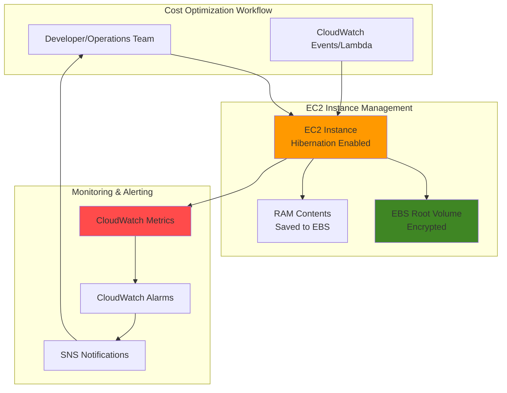

# EC2 Hibernate for Cost Optimization

## Problem

Development and staging environments often run EC2 instances that are only needed during business hours, yet remain running 24/7, generating unnecessary costs. These instances may have long startup times and complex application states that make frequent stopping and starting inefficient, leading to wasted compute resources and inflated AWS bills.

## Solution

EC2 hibernation provides a cost-effective solution by preserving the instance's in-memory state while stopping compute charges. This approach maintains application context and reduces startup time compared to traditional stop/start operations, enabling significant cost savings for intermittently used workloads while preserving operational efficiency.

## Architecture Diagram



## Prerequisites

1. AWS account with appropriate permissions for EC2, CloudWatch, and SNS
2. AWS CLI v2 installed and configured (or AWS CloudShell)
3. Understanding of EC2 instance states and EBS volume management
4. Knowledge of CloudWatch metrics and alarms
5. Estimated cost: $0.10-$0.50 per hour for test instances plus EBS storage costs

> **Note**: EC2 hibernation requires specific instance types and AMIs. For complete requirements, see the [AWS EC2 Hibernation Prerequisites](https://docs.aws.amazon.com/AWSEC2/latest/UserGuide/hibernating-prerequisites.html) documentation.

## Preparation

```bash
# Set environment variables
export AWS_REGION=$(aws configure get region)
export AWS_ACCOUNT_ID=$(aws sts get-caller-identity \
    --query Account --output text)

# Generate unique identifiers for resources
RANDOM_SUFFIX=$(aws secretsmanager get-random-password \
    --exclude-punctuation --exclude-uppercase \
    --password-length 6 --require-each-included-type \
    --output text --query RandomPassword)

# Set resource names
export KEY_PAIR_NAME="hibernate-demo-key-${RANDOM_SUFFIX}"
export INSTANCE_NAME="hibernate-demo-instance-${RANDOM_SUFFIX}"
export TOPIC_NAME="hibernate-notifications-${RANDOM_SUFFIX}"

# Create key pair for EC2 access
aws ec2 create-key-pair \
    --key-name ${KEY_PAIR_NAME} \
    --query 'KeyMaterial' \
    --output text > ${KEY_PAIR_NAME}.pem

chmod 400 ${KEY_PAIR_NAME}.pem

echo "✅ Environment prepared with key pair: ${KEY_PAIR_NAME}"
```

## Steps

1. **Launch EC2 Instance with Hibernation Enabled**:

   EC2 hibernation allows instances to preserve their in-memory state while stopping compute charges, providing significant cost savings for intermittently used workloads. When hibernation is enabled, the instance's RAM contents are saved to the encrypted EBS root volume, enabling rapid restoration of application state upon restart.

   ```bash
   # Get the latest Amazon Linux 2 AMI ID that supports hibernation
   AMI_ID=$(aws ec2 describe-images \
       --owners amazon \
       --filters "Name=name,Values=amzn2-ami-hvm-*" \
                 "Name=state,Values=available" \
                 "Name=architecture,Values=x86_64" \
       --query 'sort_by(Images, &CreationDate)[-1].ImageId' \
       --output text)

   # Launch instance with hibernation enabled
   INSTANCE_ID=$(aws ec2 run-instances \
       --image-id ${AMI_ID} \
       --instance-type m5.large \
       --key-name ${KEY_PAIR_NAME} \
       --hibernation-options Configured=true \
       --block-device-mappings '[{
           "DeviceName": "/dev/xvda",
           "Ebs": {
               "VolumeSize": 30,
               "VolumeType": "gp3",
               "Encrypted": true,
               "DeleteOnTermination": true
           }
       }]' \
       --tag-specifications "ResourceType=instance,Tags=[{Key=Name,Value=${INSTANCE_NAME}},{Key=Purpose,Value=HibernationDemo}]" \
       --query 'Instances[0].InstanceId' \
       --output text)

   echo "✅ EC2 instance launched with hibernation enabled: ${INSTANCE_ID}"
   ```

   The instance is now configured with hibernation capability and an encrypted EBS root volume. This foundation enables cost-effective pause/resume operations while maintaining application state and security best practices.

2. **Wait for Instance to be Running and Verify Hibernation Support**:

   Proper verification ensures the instance is fully operational and hibernation is correctly configured. This validation step prevents issues during hibernation operations and confirms all prerequisites are met.

   ```bash
   # Wait for instance to be running
   echo "Waiting for instance to be in running state..."
   aws ec2 wait instance-running --instance-ids ${INSTANCE_ID}

   # Verify hibernation is enabled
   HIBERNATION_ENABLED=$(aws ec2 describe-instances \
       --instance-ids ${INSTANCE_ID} \
       --query 'Reservations[0].Instances[0].HibernationOptions.Configured' \
       --output text)

   # Get instance details
   INSTANCE_STATE=$(aws ec2 describe-instances \
       --instance-ids ${INSTANCE_ID} \
       --query 'Reservations[0].Instances[0].State.Name' \
       --output text)

   echo "✅ Instance ${INSTANCE_ID} is ${INSTANCE_STATE}"
   echo "✅ Hibernation enabled: ${HIBERNATION_ENABLED}"
   ```

   The instance is now running with hibernation capabilities verified. This ensures the hibernation feature is properly configured and ready for cost optimization workflows.

3. **Create CloudWatch Metrics and Alarms for Cost Monitoring**:

   CloudWatch monitoring provides visibility into instance utilization and hibernation events, enabling data-driven cost optimization decisions. These metrics help identify usage patterns and automate hibernation scheduling based on actual workload requirements.

   ```bash
   # Create SNS topic for notifications
   TOPIC_ARN=$(aws sns create-topic \
       --name ${TOPIC_NAME} \
       --query 'TopicArn' \
       --output text)

   # Subscribe to notifications (replace with your email)
   aws sns subscribe \
       --topic-arn ${TOPIC_ARN} \
       --protocol email \
       --notification-endpoint your-email@example.com

   # Create CloudWatch alarm for CPU utilization
   aws cloudwatch put-metric-alarm \
       --alarm-name "LowCPU-${INSTANCE_NAME}" \
       --alarm-description "Alarm when CPU utilization is low" \
       --metric-name CPUUtilization \
       --namespace AWS/EC2 \
       --statistic Average \
       --period 300 \
       --threshold 10 \
       --comparison-operator LessThanThreshold \
       --evaluation-periods 6 \
       --alarm-actions ${TOPIC_ARN} \
       --dimensions Name=InstanceId,Value=${INSTANCE_ID}

   echo "✅ CloudWatch alarm created for low CPU utilization"
   echo "✅ SNS topic created: ${TOPIC_ARN}"
   ```

   Monitoring infrastructure is now established to track instance utilization and trigger notifications when hibernation might be beneficial. This automated approach enables proactive cost optimization based on actual usage patterns.

4. **Simulate Workload and Test Hibernation Process**:

   Testing hibernation functionality ensures the process works correctly in your environment and validates that application state is preserved. This verification step builds confidence in hibernation for production cost optimization scenarios.

   ```bash
   # Get instance public IP for testing
   PUBLIC_IP=$(aws ec2 describe-instances \
       --instance-ids ${INSTANCE_ID} \
       --query 'Reservations[0].Instances[0].PublicIpAddress' \
       --output text)

   echo "Instance public IP: ${PUBLIC_IP}"
   echo "You can SSH to the instance using: ssh -i ${KEY_PAIR_NAME}.pem ec2-user@${PUBLIC_IP}"

   # Create a test file to verify state preservation
   echo "Creating test file to verify hibernation state preservation..."
   
   # Note: In practice, you would SSH to the instance and create test files
   # This demonstrates the hibernation process
   
   echo "✅ Instance ready for hibernation testing"
   ```

   The instance is now ready for hibernation testing with monitoring in place. This setup demonstrates how hibernation preserves application state while reducing compute costs during idle periods.

5. **Execute Hibernation and Monitor the Process**:

   The hibernation process saves the instance's memory contents to the EBS root volume and stops compute billing while preserving application state. This operation typically takes 1-3 minutes depending on the amount of RAM being saved.

   ```bash
   # Hibernate the instance
   echo "Initiating hibernation for instance ${INSTANCE_ID}..."
   aws ec2 stop-instances \
       --instance-ids ${INSTANCE_ID} \
       --hibernate

   # Monitor hibernation progress
   echo "Monitoring hibernation process..."
   while true; do
       STATE=$(aws ec2 describe-instances \
           --instance-ids ${INSTANCE_ID} \
           --query 'Reservations[0].Instances[0].State.Name' \
           --output text)
       
       echo "Current state: ${STATE}"
       
       if [ "$STATE" = "stopped" ]; then
           echo "✅ Instance successfully hibernated"
           break
       fi
       
       sleep 10
   done

   # Verify hibernation was user-initiated
   STATE_REASON=$(aws ec2 describe-instances \
       --instance-ids ${INSTANCE_ID} \
       --query 'Reservations[0].Instances[0].StateReason.Code' \
       --output text)

   echo "✅ Hibernation state reason: ${STATE_REASON}"
   ```

   The instance is now hibernated with compute charges stopped while preserving all application state. This demonstrates the core cost optimization benefit of hibernation for intermittently used workloads.

6. **Resume Instance from Hibernation**:

   Resuming a hibernated instance restores the exact application state from before hibernation, including all processes, network connections, and memory contents. This provides faster startup times compared to traditional instance launches while maintaining operational continuity.

   ```bash
   # Resume the hibernated instance
   echo "Resuming hibernated instance ${INSTANCE_ID}..."
   aws ec2 start-instances --instance-ids ${INSTANCE_ID}

   # Wait for instance to be running
   echo "Waiting for instance to resume..."
   aws ec2 wait instance-running --instance-ids ${INSTANCE_ID}

   # Verify instance is fully operational
   INSTANCE_STATE=$(aws ec2 describe-instances \
       --instance-ids ${INSTANCE_ID} \
       --query 'Reservations[0].Instances[0].State.Name' \
       --output text)

   NEW_PUBLIC_IP=$(aws ec2 describe-instances \
       --instance-ids ${INSTANCE_ID} \
       --query 'Reservations[0].Instances[0].PublicIpAddress' \
       --output text)

   echo "✅ Instance resumed successfully: ${INSTANCE_STATE}"
   echo "✅ New public IP: ${NEW_PUBLIC_IP}"
   ```

   The instance has been successfully resumed from hibernation with all application state preserved. This completes the hibernation cycle and demonstrates the cost optimization capabilities while maintaining operational efficiency.

> **Warning**: Hibernated instances retain their Elastic IP addresses but receive new public IP addresses upon resumption. Plan your network connectivity accordingly.

## Validation & Testing

1. Verify instance hibernation capability:

   ```bash
   # Check hibernation support
   aws ec2 describe-instances \
       --instance-ids ${INSTANCE_ID} \
       --query 'Reservations[0].Instances[0].HibernationOptions.Configured'
   ```

   Expected output: `true`

2. Test hibernation state transitions:

   ```bash
   # Check hibernation state reason
   aws ec2 describe-instances \
       --instance-ids ${INSTANCE_ID} \
       --query 'Reservations[0].Instances[0].StateReason.Code'
   ```

   Expected output: `Client.UserInitiatedHibernate` (when hibernated)

3. Verify CloudWatch metrics collection:

   ```bash
   # Check CPU utilization metrics
   aws cloudwatch get-metric-statistics \
       --namespace AWS/EC2 \
       --metric-name CPUUtilization \
       --dimensions Name=InstanceId,Value=${INSTANCE_ID} \
       --start-time $(date -u -d '1 hour ago' +%Y-%m-%dT%H:%M:%S) \
       --end-time $(date -u +%Y-%m-%dT%H:%M:%S) \
       --period 300 \
       --statistics Average
   ```

4. Test alarm functionality:

   ```bash
   # Check alarm state
   aws cloudwatch describe-alarms \
       --alarm-names "LowCPU-${INSTANCE_NAME}" \
       --query 'MetricAlarms[0].StateValue'
   ```

> **Tip**: Monitor your hibernation patterns using CloudWatch Logs and set up automated hibernation schedules based on your usage patterns. See the [CloudWatch Events documentation](https://docs.aws.amazon.com/AmazonCloudWatch/latest/events/WhatIsCloudWatchEvents.html) for scheduling guidance.

## Cleanup

1. Remove CloudWatch alarms:

   ```bash
   # Delete CloudWatch alarm
   aws cloudwatch delete-alarms \
       --alarm-names "LowCPU-${INSTANCE_NAME}"
   
   echo "✅ CloudWatch alarm deleted"
   ```

2. Remove SNS topic and subscriptions:

   ```bash
   # Delete SNS topic
   aws sns delete-topic --topic-arn ${TOPIC_ARN}
   
   echo "✅ SNS topic deleted"
   ```

3. Terminate EC2 instance:

   ```bash
   # Terminate the instance
   aws ec2 terminate-instances --instance-ids ${INSTANCE_ID}
   
   echo "✅ EC2 instance terminated"
   ```

4. Remove key pair:

   ```bash
   # Delete key pair
   aws ec2 delete-key-pair --key-name ${KEY_PAIR_NAME}
   rm -f ${KEY_PAIR_NAME}.pem
   
   echo "✅ Key pair deleted"
   ```

## Discussion

EC2 hibernation provides a powerful cost optimization strategy for workloads that don't require 24/7 availability but need to maintain application state. Unlike traditional stop/start operations, hibernation preserves the complete memory footprint, enabling applications to resume exactly where they left off without lengthy initialization processes.

The cost benefits of hibernation are substantial for development, testing, and batch processing workloads. During hibernation, you only pay for EBS storage costs (typically $0.10 per GB per month for gp3 volumes) rather than compute charges that can range from $0.0464 to $3.20+ per hour depending on instance type. For a development environment used 8 hours per day, hibernation can reduce costs by approximately 67%.

Hibernation works best with workloads that have predictable usage patterns, such as development environments, batch processing jobs, and scheduled analytics tasks. The feature supports both On-Demand and Spot Instances, with Spot Instances offering additional cost savings through market-based pricing. However, hibernation requires careful consideration of the 60-day hibernation limit and compatibility with your application architecture.

Modern applications increasingly benefit from hibernation when combined with Infrastructure as Code (IaC) and automation tools. By integrating hibernation with Lambda functions, CloudWatch Events, and Systems Manager, organizations can create sophisticated cost optimization workflows that automatically hibernate instances based on utilization metrics, schedules, or business rules.

> **Note**: For production workloads, consider implementing hibernation gradually with comprehensive testing. Monitor application behavior after hibernation to ensure all services resume correctly. For more advanced hibernation strategies, see the [AWS EC2 Hibernation Best Practices](https://docs.aws.amazon.com/AWSEC2/latest/UserGuide/Hibernate.html) documentation.

## Challenge

Extend this solution by implementing these enhancements:

1. **Automated Hibernation Scheduling**: Create Lambda functions triggered by CloudWatch Events to automatically hibernate instances based on schedules or CloudWatch metrics thresholds.

2. **Cross-Region Hibernation Strategy**: Implement hibernation policies across multiple AWS regions to optimize costs for geographically distributed workloads while maintaining availability.

3. **Application-Aware Hibernation**: Develop health checks and application state validation before hibernation to ensure applications can safely resume without data loss or corruption.

4. **Cost Analysis Dashboard**: Build a CloudWatch dashboard that tracks hibernation events, cost savings, and utilization patterns to optimize hibernation strategies based on actual usage data.

5. **Spot Instance Hibernation Integration**: Combine hibernation with Spot Instances and Spot Fleet for maximum cost optimization while handling interruptions gracefully through automated hibernation workflows.

## Infrastructure Code

*Infrastructure code will be generated after recipe approval.*