# EC2 Image Building Pipelines


## Problem

Organizations struggle with maintaining consistent, secure, and up-to-date Amazon Machine Images (AMIs) across their infrastructure. Manual image creation processes are time-consuming, error-prone, and often result in configuration drift between environments. DevOps teams need automated solutions to standardize image builds, implement security hardening, and ensure compliance across their EC2 fleet while maintaining version control and testing validation.

## Solution

This recipe implements EC2 Image Builder to create automated image building pipelines that standardize AMI creation, apply security hardening, and enable consistent deployment across environments. The solution leverages components for customization, automated testing for validation, and distribution configurations for multi-region deployment while maintaining proper version control and compliance tracking.

## Architecture Diagram

```mermaid
graph TB
    subgraph "Image Builder Pipeline"
        PIPELINE[Image Pipeline]
        RECIPE[Image Recipe]
        INFRA[Infrastructure Config]
        DIST[Distribution Config]
    end
    
    subgraph "Build Components"
        COMPONENT[Build Component]
        TEST[Test Component]
        BASE[Base Image]
    end
    
    subgraph "Build Process"
        INSTANCE[Build Instance]
        SNAPSHOT[AMI Snapshot]
        TESTINST[Test Instance]
    end
    
    subgraph "Distribution"
        AMI1[AMI - Region 1]
        AMI2[AMI - Region 2]
        S3[S3 Logs]
    end
    
    subgraph "Automation"
        SCHEDULE[Cron Schedule]
        SNS[SNS Notifications]
        CW[CloudWatch Logs]
    end
    
    PIPELINE --> RECIPE
    PIPELINE --> INFRA
    PIPELINE --> DIST
    RECIPE --> COMPONENT
    RECIPE --> TEST
    RECIPE --> BASE
    INFRA --> INSTANCE
    INSTANCE --> SNAPSHOT
    SNAPSHOT --> TESTINST
    TESTINST --> AMI1
    TESTINST --> AMI2
    PIPELINE --> SCHEDULE
    INFRA --> SNS
    INFRA --> CW
    INSTANCE --> S3
    
    style PIPELINE fill:#FF9900
    style RECIPE fill:#3F8624
    style INFRA fill:#146EB4
    style DIST fill:#232F3E
```



## Prerequisites

1. AWS account with EC2 Image Builder, EC2, IAM, and S3 permissions
2. AWS CLI v2 installed and configured (or AWS CloudShell)
3. Understanding of AMI concepts and EC2 instance management
4. Knowledge of YAML syntax for component creation
5. Estimated cost: $5-15 for compute instances, storage, and data transfer during builds

> **Note**: Image Builder itself has no charges, but you pay for underlying EC2 instances, EBS storage, and AMI storage during the build process.

## Preparation

```bash
# Set environment variables
export AWS_REGION=$(aws configure get region)
export AWS_ACCOUNT_ID=$(aws sts get-caller-identity \
    --query Account --output text)

# Generate unique identifiers for resources
RANDOM_SUFFIX=$(aws secretsmanager get-random-password \
    --exclude-punctuation --exclude-uppercase \
    --password-length 6 --require-each-included-type \
    --output text --query RandomPassword)

export PIPELINE_NAME="web-server-pipeline-${RANDOM_SUFFIX}"
export RECIPE_NAME="web-server-recipe-${RANDOM_SUFFIX}"
export COMPONENT_NAME="web-server-component-${RANDOM_SUFFIX}"
export INFRASTRUCTURE_NAME="web-server-infra-${RANDOM_SUFFIX}"
export DISTRIBUTION_NAME="web-server-dist-${RANDOM_SUFFIX}"
export BUCKET_NAME="image-builder-logs-${RANDOM_SUFFIX}"

# Create S3 bucket for component storage and logs
aws s3 mb s3://${BUCKET_NAME} --region ${AWS_REGION}

# Create IAM roles for Image Builder
aws iam create-role \
    --role-name ImageBuilderInstanceRole-${RANDOM_SUFFIX} \
    --assume-role-policy-document '{
        "Version": "2012-10-17",
        "Statement": [
            {
                "Effect": "Allow",
                "Principal": {
                    "Service": "ec2.amazonaws.com"
                },
                "Action": "sts:AssumeRole"
            }
        ]
    }'

# Attach required policies to the role
aws iam attach-role-policy \
    --role-name ImageBuilderInstanceRole-${RANDOM_SUFFIX} \
    --policy-arn arn:aws:iam::aws:policy/EC2InstanceProfileForImageBuilder

aws iam attach-role-policy \
    --role-name ImageBuilderInstanceRole-${RANDOM_SUFFIX} \
    --policy-arn arn:aws:iam::aws:policy/AmazonSSMManagedInstanceCore

# Create instance profile
aws iam create-instance-profile \
    --instance-profile-name ImageBuilderInstanceProfile-${RANDOM_SUFFIX}

aws iam add-role-to-instance-profile \
    --instance-profile-name ImageBuilderInstanceProfile-${RANDOM_SUFFIX} \
    --role-name ImageBuilderInstanceRole-${RANDOM_SUFFIX}

echo "✅ Environment prepared with bucket ${BUCKET_NAME} and IAM roles"
```

## Steps

1. **Create Build Component for Web Server Setup**:

   EC2 Image Builder components are the foundational building blocks that define how your images are customized and configured. Components contain the instructions, scripts, and configurations that Image Builder applies to your base images during the build process. By creating reusable components, you establish standardized configurations that can be versioned, shared across teams, and maintained centrally, eliminating configuration drift and reducing manual errors.

   This component implements a complete web server setup with security hardening, demonstrating how Image Builder uses the Task Orchestrator and Executor (TOE) framework to manage build phases. The component follows AWS best practices by separating build, validation, and testing phases, ensuring that each configuration step is properly verified before proceeding to the next stage.

   ```bash
   # Create component definition YAML
   cat > web-server-component.yaml << 'EOF'
   name: WebServerSetup
   description: Install and configure Apache web server with security hardening
   schemaVersion: 1.0
   
   phases:
     - name: build
       steps:
         - name: UpdateSystem
           action: UpdateOS
         - name: InstallApache
           action: ExecuteBash
           inputs:
             commands:
               - yum update -y
               - yum install -y httpd
               - systemctl enable httpd
         - name: ConfigureApache
           action: ExecuteBash
           inputs:
             commands:
               - echo '<html><body><h1>Custom Web Server</h1><p>Built with EC2 Image Builder</p></body></html>' > /var/www/html/index.html
               - chown apache:apache /var/www/html/index.html
               - chmod 644 /var/www/html/index.html
         - name: SecurityHardening
           action: ExecuteBash
           inputs:
             commands:
               - sed -i 's/^#ServerTokens OS/ServerTokens Prod/' /etc/httpd/conf/httpd.conf
               - sed -i 's/^#ServerSignature On/ServerSignature Off/' /etc/httpd/conf/httpd.conf
               - systemctl start httpd
     - name: validate
       steps:
         - name: ValidateApache
           action: ExecuteBash
           inputs:
             commands:
               - systemctl is-active httpd
               - curl -f http://localhost/ || exit 1
     - name: test
       steps:
         - name: TestWebServer
           action: ExecuteBash
           inputs:
             commands:
               - systemctl status httpd
               - curl -s http://localhost/ | grep -q "Custom Web Server" || exit 1
               - netstat -tlnp | grep :80 || exit 1
   EOF
   
   # Upload component to S3
   aws s3 cp web-server-component.yaml s3://${BUCKET_NAME}/components/
   
   # Create the component
   aws imagebuilder create-component \
       --name ${COMPONENT_NAME} \
       --semantic-version "1.0.0" \
       --description "Web server setup with security hardening" \
       --platform Linux \
       --uri s3://${BUCKET_NAME}/components/web-server-component.yaml \
       --tags "Environment=Production,Purpose=WebServer"
   
   echo "✅ Created build component ${COMPONENT_NAME}"
   ```

   The component is now registered with EC2 Image Builder and ready to be used in image recipes. This component establishes a repeatable, auditable process for web server configuration that includes security hardening measures like hiding server signatures and removing unnecessary headers. The three-phase approach (build, validate, test) ensures that each configuration step is verified before the component is marked as successful, preventing failed builds from proceeding to distribution.

   > **Warning**: Component execution runs with elevated privileges on build instances. Always review component code and validate security implications before using in production environments. See [EC2 Image Builder Security Best Practices](https://docs.aws.amazon.com/imagebuilder/latest/userguide/security-best-practices.html) for additional guidance.

2. **Create Test Component for Validation**:

   Test components provide comprehensive validation of your build configurations, ensuring that images meet security, functionality, and compliance requirements before distribution. Unlike build components that modify the system, test components solely verify that configurations are correct and services are functioning as expected. This separation of concerns enables you to catch configuration errors early in the pipeline, preventing faulty images from reaching production environments.

   This test component implements a comprehensive validation suite that checks service status, configuration correctness, security posture, and content delivery. The testing framework demonstrates how Image Builder can validate both technical functionality and business requirements, ensuring that your AMIs meet organizational standards before deployment.

   ```bash
   # Create test component definition
   cat > web-server-test.yaml << 'EOF'
   name: WebServerTest
   description: Comprehensive testing of web server setup
   schemaVersion: 1.0
   
   phases:
     - name: test
       steps:
         - name: ServiceTest
           action: ExecuteBash
           inputs:
             commands:
               - echo "Testing Apache service status..."
               - systemctl is-enabled httpd
               - systemctl is-active httpd
         - name: ConfigurationTest
           action: ExecuteBash
           inputs:
             commands:
               - echo "Testing Apache configuration..."
               - httpd -t
               - grep -q "ServerTokens Prod" /etc/httpd/conf/httpd.conf || exit 1
               - grep -q "ServerSignature Off" /etc/httpd/conf/httpd.conf || exit 1
         - name: SecurityTest
           action: ExecuteBash
           inputs:
             commands:
               - echo "Testing security configurations..."
               - curl -I http://localhost/ | grep -q "Apache" && exit 1 || echo "Server signature hidden"
               - ss -tlnp | grep :80 | grep -q httpd || exit 1
         - name: ContentTest
           action: ExecuteBash
           inputs:
             commands:
               - echo "Testing web content..."
               - curl -s http://localhost/ | grep -q "Custom Web Server" || exit 1
               - test -f /var/www/html/index.html || exit 1
   EOF
   
   # Upload test component to S3
   aws s3 cp web-server-test.yaml s3://${BUCKET_NAME}/components/
   
   # Create the test component
   aws imagebuilder create-component \
       --name ${COMPONENT_NAME}-test \
       --semantic-version "1.0.0" \
       --description "Comprehensive web server testing" \
       --platform Linux \
       --uri s3://${BUCKET_NAME}/components/web-server-test.yaml \
       --tags "Environment=Production,Purpose=Testing"
   
   echo "✅ Created test component ${COMPONENT_NAME}-test"
   ```

   The test component is now integrated into the Image Builder workflow and will execute during the test phase of every build. This comprehensive testing approach ensures that images meet both functional and security requirements, providing confidence that deployed instances will operate correctly in production environments. The test results are logged and can be used for compliance reporting and continuous improvement of your image building processes.

3. **Create Image Recipe**:

   Image recipes define the complete blueprint for creating custom AMIs by combining a base image with one or more components. The recipe acts as a template that specifies which components to apply, in what order, and how they should be executed. This approach enables you to create standardized, repeatable image builds that can be versioned and maintained as code, ensuring consistency across different environments and deployments.

   The recipe combines our build and test components with a base Amazon Linux 2 image, creating a complete web server configuration that includes security hardening and comprehensive validation. By using semantic versioning, teams can track changes, roll back problematic updates, and maintain multiple versions of images for different environments or application requirements.

   ```bash
   # Get component ARNs
   BUILD_COMPONENT_ARN=$(aws imagebuilder list-components \
       --filters "name=name,values=${COMPONENT_NAME}" \
       --query 'componentVersionList[0].arn' --output text)
   
   TEST_COMPONENT_ARN=$(aws imagebuilder list-components \
       --filters "name=name,values=${COMPONENT_NAME}-test" \
       --query 'componentVersionList[0].arn' --output text)
   
   # Get latest Amazon Linux 2 AMI ARN
   BASE_IMAGE_ARN=$(aws imagebuilder list-images \
       --filters "name=name,values=Amazon Linux 2 x86" \
       --query 'imageVersionList[0].arn' --output text)
   
   # Create image recipe
   aws imagebuilder create-image-recipe \
       --name ${RECIPE_NAME} \
       --semantic-version "1.0.0" \
       --description "Web server recipe with security hardening" \
       --parent-image ${BASE_IMAGE_ARN} \
       --components "componentArn=${BUILD_COMPONENT_ARN}" \
                    "componentArn=${TEST_COMPONENT_ARN}" \
       --tags "Environment=Production,Purpose=WebServer"
   
   echo "✅ Created image recipe ${RECIPE_NAME}"
   ```

   The image recipe now serves as the definitive specification for your web server AMI, combining the base operating system with your custom components in a reproducible way. This recipe can be used across multiple pipelines, shared with other teams, and evolved over time while maintaining version control. The recipe ensures that every build produces consistent results, regardless of when or where the build is executed.

4. **Create Infrastructure Configuration**:

   Infrastructure configurations define the compute environment where Image Builder executes your image builds. This includes the instance types, networking configuration, security settings, and logging preferences that control how build instances are launched and managed. Proper infrastructure configuration ensures that builds have the necessary resources, network access, and security controls while minimizing costs and maintaining compliance.

   The configuration establishes a secure build environment using dedicated security groups, IAM roles with least-privilege permissions, and comprehensive logging to S3 and CloudWatch. SNS notifications provide real-time alerting for build status changes, enabling teams to respond quickly to build failures or security issues. The terminate-on-failure setting ensures that build instances are automatically cleaned up to prevent resource waste.

   ```bash
   # Get default VPC and subnet
   DEFAULT_VPC_ID=$(aws ec2 describe-vpcs \
       --filters "Name=isDefault,Values=true" \
       --query 'Vpcs[0].VpcId' --output text)
   
   DEFAULT_SUBNET_ID=$(aws ec2 describe-subnets \
       --filters "Name=vpc-id,Values=${DEFAULT_VPC_ID}" \
                 "Name=default-for-az,Values=true" \
       --query 'Subnets[0].SubnetId' --output text)
   
   # Create security group for Image Builder
   SECURITY_GROUP_ID=$(aws ec2 create-security-group \
       --group-name ImageBuilder-SG-${RANDOM_SUFFIX} \
       --description "Security group for Image Builder instances" \
       --vpc-id ${DEFAULT_VPC_ID} \
       --query 'GroupId' --output text)
   
   # Add outbound rules for package downloads
   aws ec2 authorize-security-group-egress \
       --group-id ${SECURITY_GROUP_ID} \
       --protocol tcp \
       --port 443 \
       --cidr 0.0.0.0/0
   
   aws ec2 authorize-security-group-egress \
       --group-id ${SECURITY_GROUP_ID} \
       --protocol tcp \
       --port 80 \
       --cidr 0.0.0.0/0
   
   # Create SNS topic for notifications
   SNS_TOPIC_ARN=$(aws sns create-topic \
       --name ImageBuilder-Notifications-${RANDOM_SUFFIX} \
       --query 'TopicArn' --output text)
   
   # Create infrastructure configuration
   aws imagebuilder create-infrastructure-configuration \
       --name ${INFRASTRUCTURE_NAME} \
       --description "Infrastructure for web server image builds" \
       --instance-profile-name ImageBuilderInstanceProfile-${RANDOM_SUFFIX} \
       --instance-types t3.medium \
       --subnet-id ${DEFAULT_SUBNET_ID} \
       --security-group-ids ${SECURITY_GROUP_ID} \
       --terminate-instance-on-failure \
       --sns-topic-arn ${SNS_TOPIC_ARN} \
       --logging s3Logs="{s3BucketName=${BUCKET_NAME},s3KeyPrefix=build-logs/}" \
       --tags "Environment=Production,Purpose=WebServer"
   
   echo "✅ Created infrastructure configuration ${INFRASTRUCTURE_NAME}"
   ```

   The infrastructure configuration now provides a secure, monitored environment for image builds with appropriate networking, security, and logging controls. This configuration ensures that builds have the necessary resources while maintaining security boundaries and providing comprehensive audit trails. The integration with SNS and CloudWatch enables automated monitoring and alerting for build operations, supporting both operational visibility and compliance requirements.

   > **Tip**: EC2 Image Builder uses AWS Systems Manager Session Manager for secure instance access, eliminating the need for SSH keys or open inbound ports. This approach follows AWS security best practices and provides comprehensive session logging. Learn more about [Session Manager](https://docs.aws.amazon.com/systems-manager/latest/userguide/session-manager.html) configuration and benefits.

5. **Create Distribution Configuration**:

   Distribution configurations control how and where your built AMIs are shared after successful creation. This includes regional distribution, cross-account sharing, and AMI naming conventions that support your organization's deployment strategies. Distribution configurations enable you to automatically deploy images to multiple regions, share them with specific accounts, and apply consistent tagging for lifecycle management and cost tracking.

   The configuration demonstrates how Image Builder can automatically distribute AMIs to multiple regions and apply dynamic naming using build metadata. The templated naming convention includes build dates and versions, enabling teams to track image lineage and implement automated deployment strategies. Proper AMI tagging facilitates cost allocation, compliance reporting, and automated lifecycle management.

   ```bash
   # Create distribution configuration for multi-region deployment
   aws imagebuilder create-distribution-configuration \
       --name ${DISTRIBUTION_NAME} \
       --description "Multi-region distribution for web server AMIs" \
       --distributions "[
           {
               \"region\": \"${AWS_REGION}\",
               \"amiDistributionConfiguration\": {
                   \"name\": \"WebServer-{{imagebuilder:buildDate}}-{{imagebuilder:buildVersion}}\",
                   \"description\": \"Custom web server AMI built with Image Builder\",
                   \"amiTags\": {
                       \"Name\": \"WebServer-AMI\",
                       \"Environment\": \"Production\",
                       \"BuildDate\": \"{{imagebuilder:buildDate}}\",
                       \"BuildVersion\": \"{{imagebuilder:buildVersion}}\",
                       \"Recipe\": \"${RECIPE_NAME}\"
                   }
               }
           }
       ]" \
       --tags "Environment=Production,Purpose=WebServer"
   
   echo "✅ Created distribution configuration ${DISTRIBUTION_NAME}"
   ```

   The distribution configuration now defines how successfully built AMIs will be distributed across your AWS infrastructure. This automated distribution eliminates manual AMI sharing processes and ensures that images are available in the correct regions with proper naming and tagging. The configuration supports multi-region deployment strategies and provides the foundation for automated application deployment workflows.

6. **Create Image Pipeline**:

   Image pipelines orchestrate the complete image building workflow by combining recipes, infrastructure configurations, and distribution settings into an automated system. Pipelines can be triggered manually, scheduled for regular execution, or activated automatically when base images or components are updated. This automation ensures that your AMIs remain current with security patches and configuration changes while maintaining consistency across environments.

   The pipeline configuration demonstrates advanced scheduling and testing capabilities, including cron-based scheduling for regular builds and conditional execution based on dependency updates. The integration of image testing with timeout controls ensures that builds are thoroughly validated before distribution, while the pipeline status management enables teams to control when automated builds should occur.

   ```bash
   # Get ARNs for pipeline creation
   RECIPE_ARN=$(aws imagebuilder list-image-recipes \
       --filters "name=name,values=${RECIPE_NAME}" \
       --query 'imageRecipeSummaryList[0].arn' --output text)
   
   INFRASTRUCTURE_ARN=$(aws imagebuilder list-infrastructure-configurations \
       --filters "name=name,values=${INFRASTRUCTURE_NAME}" \
       --query 'infrastructureConfigurationSummaryList[0].arn' --output text)
   
   DISTRIBUTION_ARN=$(aws imagebuilder list-distribution-configurations \
       --filters "name=name,values=${DISTRIBUTION_NAME}" \
       --query 'distributionConfigurationSummaryList[0].arn' --output text)
   
   # Create the pipeline
   aws imagebuilder create-image-pipeline \
       --name ${PIPELINE_NAME} \
       --description "Automated web server image building pipeline" \
       --image-recipe-arn ${RECIPE_ARN} \
       --infrastructure-configuration-arn ${INFRASTRUCTURE_ARN} \
       --distribution-configuration-arn ${DISTRIBUTION_ARN} \
       --image-tests-configuration "imageTestsEnabled=true,timeoutMinutes=90" \
       --schedule "scheduleExpression=cron(0 2 * * SUN),pipelineExecutionStartCondition=EXPRESSION_MATCH_AND_DEPENDENCY_UPDATES_AVAILABLE" \
       --status ENABLED \
       --tags "Environment=Production,Purpose=WebServer"
   
   echo "✅ Created image pipeline ${PIPELINE_NAME}"
   ```

   The image pipeline now provides a complete automation framework for AMI creation, testing, and distribution. The pipeline will automatically execute on schedule, ensuring that your images remain current with the latest security patches and configuration updates. This automation eliminates manual processes, reduces human error, and provides consistent, repeatable image builds that support your organization's deployment requirements.

7. **Trigger Manual Build**:

   Manual pipeline execution allows you to test your configuration immediately and generate the first AMI from your pipeline. This immediate execution is valuable for validating your pipeline configuration, testing new components, and providing initial images for development and testing environments. Manual builds also enable you to create images on-demand for specific requirements or emergency patches outside of regular scheduled builds.

   The build process launches a temporary EC2 instance, applies all components in sequence, executes tests, and creates the final AMI before terminating the build instance. This process typically takes 20-30 minutes depending on the complexity of your components and the testing requirements. The build ARN provides tracking for monitoring progress and accessing logs.

   ```bash
   # Start an image build manually
   BUILD_ARN=$(aws imagebuilder start-image-pipeline-execution \
       --image-pipeline-arn $(aws imagebuilder list-image-pipelines \
           --filters "name=name,values=${PIPELINE_NAME}" \
           --query 'imagePipelineList[0].arn' --output text) \
       --query 'imageBuildVersionArn' --output text)
   
   echo "✅ Started image build: ${BUILD_ARN}"
   echo "Build typically takes 20-30 minutes to complete"
   ```

   The build has been initiated and Image Builder is now launching a build instance, applying components, and executing tests. The BUILD_ARN provides a unique identifier for tracking this specific build execution and accessing detailed logs. You can monitor the progress through the AWS console or CLI, and receive notifications through the configured SNS topic when the build completes or fails.

8. **Monitor Build Progress**:

   Build monitoring provides real-time visibility into the image creation process, enabling you to track progress, identify issues, and respond to failures promptly. Image Builder provides detailed status information throughout the build lifecycle, including component execution, test results, and final AMI creation. This monitoring capability is essential for maintaining build quality and meeting service level agreements for image delivery.

   The monitoring script demonstrates how to programmatically track build progress and respond to different build states. This approach enables integration with CI/CD pipelines, automated notifications, and dashboard systems that provide operational visibility into your image building processes. The polling mechanism ensures that you receive immediate notification when builds complete or fail.

   ```bash
   # Function to check build status
   check_build_status() {
       local build_arn=$1
       aws imagebuilder get-image \
           --image-build-version-arn ${build_arn} \
           --query 'image.state.status' --output text
   }
   
   # Monitor build progress
   echo "Monitoring build progress..."
   while true; do
       STATUS=$(check_build_status ${BUILD_ARN})
       echo "Build status: ${STATUS}"
       
       if [[ "${STATUS}" == "AVAILABLE" ]]; then
           echo "✅ Build completed successfully!"
           break
       elif [[ "${STATUS}" == "FAILED" ]]; then
           echo "❌ Build failed. Check CloudWatch logs for details."
           break
       fi
       
       sleep 60
   done
   ```

   The monitoring system now provides continuous visibility into your build process, automatically detecting completion or failure states. This automated monitoring eliminates the need for manual status checking and enables immediate response to build issues. The build status information can be integrated with other systems for comprehensive operational monitoring and alerting.

## Validation & Testing

1. **Verify Pipeline Creation**:

   ```bash
   # Check pipeline details
   aws imagebuilder get-image-pipeline \
       --image-pipeline-arn $(aws imagebuilder list-image-pipelines \
           --filters "name=name,values=${PIPELINE_NAME}" \
           --query 'imagePipelineList[0].arn' --output text)
   ```

   Expected output: Pipeline configuration with ENABLED status and scheduled execution.

2. **List Generated AMIs**:

   ```bash
   # List images created by the pipeline
   aws imagebuilder list-image-pipeline-images \
       --image-pipeline-arn $(aws imagebuilder list-image-pipelines \
           --filters "name=name,values=${PIPELINE_NAME}" \
           --query 'imagePipelineList[0].arn' --output text)
   ```

   Expected output: List of images with AVAILABLE status and associated AMI IDs.

3. **Test AMI by Launching Instance**:

   ```bash
   # Get the latest AMI ID from the build
   AMI_ID=$(aws imagebuilder list-image-pipeline-images \
       --image-pipeline-arn $(aws imagebuilder list-image-pipelines \
           --filters "name=name,values=${PIPELINE_NAME}" \
           --query 'imagePipelineList[0].arn' --output text) \
       --query 'images[0].outputResources.amis[0].image' --output text)
   
   # Launch test instance
   INSTANCE_ID=$(aws ec2 run-instances \
       --image-id ${AMI_ID} \
       --instance-type t3.micro \
       --key-name your-key-pair \
       --subnet-id ${DEFAULT_SUBNET_ID} \
       --security-group-ids ${SECURITY_GROUP_ID} \
       --query 'Instances[0].InstanceId' --output text)
   
   echo "✅ Test instance launched: ${INSTANCE_ID}"
   ```

4. **Verify Component Functionality**:

   ```bash
   # Check build logs in S3
   aws s3 ls s3://${BUCKET_NAME}/build-logs/ --recursive
   
   # Download recent build log
   aws s3 cp s3://${BUCKET_NAME}/build-logs/ ./build-logs/ --recursive
   
   echo "✅ Build logs downloaded for review"
   ```

## Cleanup

1. **Delete Test Instance**:

   ```bash
   # Terminate test instance if created
   if [[ -n "${INSTANCE_ID}" ]]; then
       aws ec2 terminate-instances --instance-ids ${INSTANCE_ID}
       echo "✅ Terminated test instance"
   fi
   ```

2. **Delete Image Pipeline**:

   ```bash
   # Delete the pipeline
   aws imagebuilder delete-image-pipeline \
       --image-pipeline-arn $(aws imagebuilder list-image-pipelines \
           --filters "name=name,values=${PIPELINE_NAME}" \
           --query 'imagePipelineList[0].arn' --output text)
   
   echo "✅ Deleted image pipeline"
   ```

3. **Delete Components and Configurations**:

   ```bash
   # Delete distribution configuration
   aws imagebuilder delete-distribution-configuration \
       --distribution-configuration-arn ${DISTRIBUTION_ARN}
   
   # Delete infrastructure configuration
   aws imagebuilder delete-infrastructure-configuration \
       --infrastructure-configuration-arn ${INFRASTRUCTURE_ARN}
   
   # Delete image recipe
   aws imagebuilder delete-image-recipe \
       --image-recipe-arn ${RECIPE_ARN}
   
   # Delete components
   aws imagebuilder delete-component \
       --component-build-version-arn ${BUILD_COMPONENT_ARN}
   
   aws imagebuilder delete-component \
       --component-build-version-arn ${TEST_COMPONENT_ARN}
   
   echo "✅ Deleted Image Builder configurations"
   ```

4. **Clean Up AWS Resources**:

   ```bash
   # Delete SNS topic
   aws sns delete-topic --topic-arn ${SNS_TOPIC_ARN}
   
   # Delete security group
   aws ec2 delete-security-group --group-id ${SECURITY_GROUP_ID}
   
   # Delete IAM resources
   aws iam remove-role-from-instance-profile \
       --instance-profile-name ImageBuilderInstanceProfile-${RANDOM_SUFFIX} \
       --role-name ImageBuilderInstanceRole-${RANDOM_SUFFIX}
   
   aws iam delete-instance-profile \
       --instance-profile-name ImageBuilderInstanceProfile-${RANDOM_SUFFIX}
   
   aws iam detach-role-policy \
       --role-name ImageBuilderInstanceRole-${RANDOM_SUFFIX} \
       --policy-arn arn:aws:iam::aws:policy/EC2InstanceProfileForImageBuilder
   
   aws iam detach-role-policy \
       --role-name ImageBuilderInstanceRole-${RANDOM_SUFFIX} \
       --policy-arn arn:aws:iam::aws:policy/AmazonSSMManagedInstanceCore
   
   aws iam delete-role --role-name ImageBuilderInstanceRole-${RANDOM_SUFFIX}
   
   # Delete S3 bucket and contents
   aws s3 rm s3://${BUCKET_NAME} --recursive
   aws s3 rb s3://${BUCKET_NAME}
   
   echo "✅ Cleaned up all AWS resources"
   ```

## Discussion

EC2 Image Builder provides a powerful platform for automating AMI creation and management while maintaining consistency and security across your infrastructure. The service eliminates the manual effort traditionally required for image maintenance and enables teams to implement infrastructure as code principles for their base images. The [Image Builder User Guide](https://docs.aws.amazon.com/imagebuilder/latest/userguide/what-is-image-builder.html) provides comprehensive documentation on service capabilities and architectural patterns.

The pipeline architecture demonstrated here showcases key capabilities including component-based customization, automated testing, and multi-region distribution. Components are reusable building blocks that can be versioned and shared across different recipes, promoting standardization and reducing duplication. The separation of build and test phases ensures that images are thoroughly validated before distribution, while the automated scheduling capabilities enable regular patching and updates without manual intervention. For advanced component development, refer to the [AWSTOE Component Management Guide](https://docs.aws.amazon.com/imagebuilder/latest/userguide/toe-get-started.html).

Security considerations are paramount in image building. The recipe implements several best practices including least-privilege IAM roles, security group configurations that limit network access, and component-level security hardening. The use of Systems Manager Session Manager for instance access eliminates the need for SSH keys or direct network connectivity, while CloudWatch logging provides comprehensive audit trails for compliance requirements. The [Image Builder Security Best Practices](https://docs.aws.amazon.com/imagebuilder/latest/userguide/security-best-practices.html) documentation provides additional guidance on securing your image building workflows.

> **Tip**: Use AWS Systems Manager Parameter Store to manage configuration values and secrets in your components, enabling dynamic configuration without hardcoding sensitive information.

## Challenge

Extend this solution by implementing these enhancements:

1. **Multi-Platform Support**: Create components that work across both Linux and Windows base images, implementing platform-specific logic within the same component framework.

2. **Advanced Testing Integration**: Integrate with AWS Inspector for vulnerability scanning and implement custom test suites using AWS CodeBuild for more comprehensive validation.

3. **Cross-Account Distribution**: Configure image sharing across multiple AWS accounts and implement approval workflows for production image promotion.

4. **Compliance Automation**: Integrate with AWS Config and Security Hub to automatically validate that created images meet organizational compliance standards and security benchmarks.

5. **Cost Optimization**: Implement lifecycle policies for AMI management, automated cleanup of old images, and integration with AWS Cost Explorer for build cost tracking and optimization.

## Infrastructure Code

*Infrastructure code will be generated after recipe approval.*