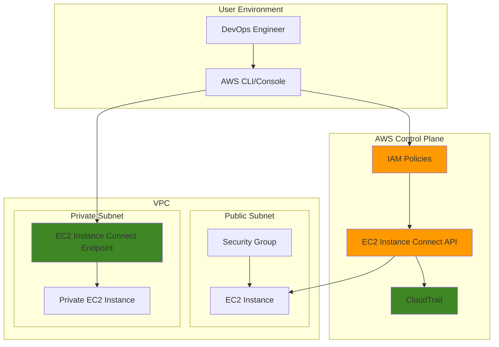

# Secure SSH Access with EC2 Instance Connect

## Problem

Enterprise IT teams struggle with secure SSH access management to EC2 instances, often relying on shared SSH keys distributed across teams or stored in insecure locations. Traditional SSH key management creates security vulnerabilities through key sprawl, lacks centralized access controls, and provides limited audit trails for compliance requirements. These challenges are compounded when managing access across multiple teams, environments, and compliance frameworks that require detailed connection logging and time-based access controls.

## Solution

AWS EC2 Instance Connect provides a secure, centralized approach to SSH access by replacing traditional SSH keys with temporary, AWS IAM-controlled credentials. This solution leverages short-lived SSH public keys (valid for 60 seconds) pushed directly to instance metadata, eliminating the need for long-term key management while providing comprehensive CloudTrail logging for all connection attempts.

## Architecture Diagram



## Prerequisites

1. AWS account with EC2 and IAM permissions for creating instances and policies
2. AWS CLI v2 installed and configured (or AWS CloudShell)
3. Basic knowledge of IAM policies, EC2 instances, and SSH connections
4. Understanding of VPC networking and security groups
5. Estimated cost: $0.50-$2.00 per hour for EC2 instances during testing

> **Note**: EC2 Instance Connect is available at no additional cost and supports most AWS regions. For complete region availability, see [AWS Regional Services](https://aws.amazon.com/about-aws/global-infrastructure/regional-product-services/).

## Preparation

```bash
# Set environment variables
export AWS_REGION=$(aws configure get region)
export AWS_ACCOUNT_ID=$(aws sts get-caller-identity \
    --query Account --output text)

# Generate unique identifiers for resources
RANDOM_SUFFIX=$(aws secretsmanager get-random-password \
    --exclude-punctuation --exclude-uppercase \
    --password-length 6 --require-each-included-type \
    --output text --query RandomPassword)

# Set resource names
export INSTANCE_NAME="ec2-connect-test-${RANDOM_SUFFIX}"
export POLICY_NAME="EC2InstanceConnectPolicy-${RANDOM_SUFFIX}"
export USER_NAME="ec2-connect-user-${RANDOM_SUFFIX}"

# Get default VPC and subnet information
export VPC_ID=$(aws ec2 describe-vpcs \
    --filters "Name=is-default,Values=true" \
    --query "Vpcs[0].VpcId" --output text)

export SUBNET_ID=$(aws ec2 describe-subnets \
    --filters "Name=vpc-id,Values=${VPC_ID}" \
        "Name=default-for-az,Values=true" \
    --query "Subnets[0].SubnetId" --output text)

echo "✅ Environment prepared with VPC: ${VPC_ID}"
```

## Steps

1. **Create IAM Policy for EC2 Instance Connect**:

   IAM policies for EC2 Instance Connect control which users can push SSH public keys to specific instances. The `ec2-instance-connect:SendSSHPublicKey` action is the core permission that enables users to upload temporary SSH keys to instance metadata. This approach eliminates the need for long-term SSH key management while providing fine-grained access control through IAM conditions.

   ```bash
   # Create IAM policy for EC2 Instance Connect access
   cat > ec2-connect-policy.json << 'EOF'
   {
       "Version": "2012-10-17",
       "Statement": [
           {
               "Effect": "Allow",
               "Action": [
                   "ec2-instance-connect:SendSSHPublicKey"
               ],
               "Resource": "*",
               "Condition": {
                   "StringEquals": {
                       "ec2:osuser": "ec2-user"
                   }
               }
           },
           {
               "Effect": "Allow",
               "Action": [
                   "ec2:DescribeInstances",
                   "ec2:DescribeInstanceConnectEndpoints"
               ],
               "Resource": "*"
           }
       ]
   }
   EOF
   
   # Create the policy
   aws iam create-policy \
       --policy-name "${POLICY_NAME}" \
       --policy-document file://ec2-connect-policy.json
   
   export POLICY_ARN="arn:aws:iam::${AWS_ACCOUNT_ID}:policy/${POLICY_NAME}"
   
   echo "✅ IAM policy created: ${POLICY_ARN}"
   ```

   The policy now grants permission to send SSH public keys to instances, but only for the `ec2-user` operating system user. This IAM policy follows the principle of least privilege by restricting access to specific OS users and requiring descriptor permissions for instance metadata retrieval.

2. **Create IAM User and Attach Policy**:

   IAM users provide programmatic access to AWS services and can be assigned specific permissions through attached policies. For EC2 Instance Connect, creating a dedicated user ensures proper access management and enables detailed audit trails. This user will demonstrate how to control SSH access through AWS Identity and Access Management rather than traditional SSH key distribution.

   ```bash
   # Create IAM user for testing
   aws iam create-user --user-name "${USER_NAME}"
   
   # Attach the policy to the user
   aws iam attach-user-policy \
       --user-name "${USER_NAME}" \
       --policy-arn "${POLICY_ARN}"
   
   # Create access keys for the user
   aws iam create-access-key \
       --user-name "${USER_NAME}" \
       --query 'AccessKey.{AccessKeyId:AccessKeyId,SecretAccessKey:SecretAccessKey}' \
       --output table
   
   echo "✅ IAM user created with EC2 Instance Connect permissions"
   ```

   The IAM user is now configured with the necessary permissions to use EC2 Instance Connect. The generated access keys enable programmatic access to the service, providing an alternative to federated authentication for testing and automation scenarios.

3. **Create Security Group for SSH Access**:

   Security groups act as virtual firewalls controlling inbound and outbound traffic to EC2 instances. They operate at the instance level and evaluate rules before traffic reaches the instance. For EC2 Instance Connect, security groups must allow SSH traffic from either the AWS service IP ranges (for console access) or your specific IP addresses (for CLI access).

   ```bash
   # Create security group
   export SG_ID=$(aws ec2 create-security-group \
       --group-name "ec2-connect-sg-${RANDOM_SUFFIX}" \
       --description "Security group for EC2 Instance Connect" \
       --vpc-id "${VPC_ID}" \
       --query 'GroupId' --output text)
   
   # Allow SSH access from anywhere (restrict as needed)
   aws ec2 authorize-security-group-ingress \
       --group-id "${SG_ID}" \
       --protocol tcp \
       --port 22 \
       --cidr 0.0.0.0/0
   
   echo "✅ Security group created: ${SG_ID}"
   ```

   The security group now allows SSH access on port 22. In production environments, you should restrict the source to specific IP ranges or use AWS-managed prefix lists for EC2 Instance Connect service IPs to enhance security and follow the principle of least privilege.

4. **Launch EC2 Instance with Instance Connect Support**:

   Amazon Linux 2023 AMIs come pre-installed with EC2 Instance Connect, enabling immediate support for temporary SSH key authentication. The service integrates with the SSH daemon through `AuthorizedKeysCommand` configuration, allowing it to retrieve public keys from instance metadata during authentication attempts.

   ```bash
   # Get latest Amazon Linux 2023 AMI ID
   export AMI_ID=$(aws ec2 describe-images \
       --owners amazon \
       --filters "Name=name,Values=al2023-ami-*" \
           "Name=architecture,Values=x86_64" \
           "Name=state,Values=available" \
       --query 'Images | sort_by(@, &CreationDate) | [-1].ImageId' \
       --output text)
   
   # Launch EC2 instance
   export INSTANCE_ID=$(aws ec2 run-instances \
       --image-id "${AMI_ID}" \
       --instance-type t2.micro \
       --security-group-ids "${SG_ID}" \
       --subnet-id "${SUBNET_ID}" \
       --associate-public-ip-address \
       --tag-specifications "ResourceType=instance,Tags=[{Key=Name,Value=${INSTANCE_NAME}}]" \
       --query 'Instances[0].InstanceId' --output text)
   
   echo "✅ EC2 instance launched: ${INSTANCE_ID}"
   ```

   The instance is now launching with EC2 Instance Connect support enabled by default. This eliminates the need for traditional SSH key pairs during instance creation, as temporary keys will be managed dynamically through the AWS service.

5. **Wait for Instance to be Running**:

   EC2 instances require initialization time to complete their boot process and become ready for SSH connections. The `wait` command ensures the instance reaches a running state before attempting connections, preventing authentication failures due to incomplete initialization.

   ```bash
   # Wait for instance to be running
   echo "Waiting for instance to be running..."
   aws ec2 wait instance-running --instance-ids "${INSTANCE_ID}"
   
   # Get instance public IP
   export INSTANCE_IP=$(aws ec2 describe-instances \
       --instance-ids "${INSTANCE_ID}" \
       --query 'Reservations[0].Instances[0].PublicIpAddress' \
       --output text)
   
   echo "✅ Instance is running with IP: ${INSTANCE_IP}"
   ```

   The instance is now fully operational and ready for EC2 Instance Connect authentication. The public IP address enables direct SSH connections from your local environment using the temporary key mechanism.

6. **Test Basic SSH Connection via Instance Connect**:

   EC2 Instance Connect offers multiple connection methods: the simplified AWS CLI command that handles key generation automatically, and the manual method where you generate and upload keys yourself. Both approaches demonstrate the temporary nature of SSH keys, with a 60-second validity period for enhanced security.

   ```bash
   # Test connection using AWS CLI v2 (recommended method)
   echo "Testing EC2 Instance Connect via AWS CLI..."
   aws ec2-instance-connect ssh --instance-id "${INSTANCE_ID}" \
       --os-user ec2-user
   
   # Alternative: Send SSH public key and connect manually
   # Generate temporary key pair
   ssh-keygen -t rsa -b 2048 -f temp-key -N "" -q
   
   # Send public key to instance
   aws ec2-instance-connect send-ssh-public-key \
       --instance-id "${INSTANCE_ID}" \
       --instance-os-user ec2-user \
       --ssh-public-key file://temp-key.pub
   
   # Connect using the private key (within 60 seconds)
   ssh -i temp-key -o ConnectTimeout=10 \
       -o StrictHostKeyChecking=no \
       ec2-user@"${INSTANCE_IP}"
   
   echo "✅ SSH connection successful"
   ```

   The connection demonstrates how EC2 Instance Connect replaces traditional SSH key management. The temporary key approach reduces security risks by eliminating long-term credential storage while maintaining full SSH functionality for administrative tasks.

7. **Create EC2 Instance Connect Endpoint for Private Instances**:

   EC2 Instance Connect Endpoints enable secure SSH access to private instances without exposing them to the internet. This managed service creates a VPC endpoint that provides encrypted tunnels to private instances, supporting zero-trust network architectures while maintaining the benefits of temporary SSH key authentication.

   ```bash
   # Create a private subnet for demonstration
   export PRIVATE_SUBNET_ID=$(aws ec2 create-subnet \
       --vpc-id "${VPC_ID}" \
       --cidr-block "172.31.64.0/24" \
       --availability-zone "${AWS_REGION}a" \
       --query 'Subnet.SubnetId' --output text)
   
   # Create EC2 Instance Connect Endpoint
   export EICE_ID=$(aws ec2 create-instance-connect-endpoint \
       --subnet-id "${PRIVATE_SUBNET_ID}" \
       --query 'InstanceConnectEndpoint.InstanceConnectEndpointId' \
       --output text)
   
   # Wait for endpoint to be available
   echo "Waiting for Instance Connect Endpoint to be ready..."
   aws ec2 wait instance-connect-endpoint-available \
       --instance-connect-endpoint-ids "${EICE_ID}"
   
   echo "✅ Instance Connect Endpoint created: ${EICE_ID}"
   ```

   The endpoint is now ready to provide secure access to private instances. This service eliminates the need for bastion hosts or VPN connections while maintaining network isolation and providing comprehensive audit logging for all connections.

8. **Launch Private Instance and Test Endpoint Access**:

   Private instances provide enhanced security by eliminating direct internet access while maintaining full functionality through VPC endpoints. EC2 Instance Connect Endpoints enable SSH access to these instances without compromising network security, supporting hybrid and multi-tier application architectures.

   ```bash
   # Launch instance in private subnet
   export PRIVATE_INSTANCE_ID=$(aws ec2 run-instances \
       --image-id "${AMI_ID}" \
       --instance-type t2.micro \
       --security-group-ids "${SG_ID}" \
       --subnet-id "${PRIVATE_SUBNET_ID}" \
       --tag-specifications "ResourceType=instance,Tags=[{Key=Name,Value=${INSTANCE_NAME}-private}]" \
       --query 'Instances[0].InstanceId' --output text)
   
   # Wait for private instance to be running
   aws ec2 wait instance-running \
       --instance-ids "${PRIVATE_INSTANCE_ID}"
   
   # Test connection to private instance via endpoint
   aws ec2-instance-connect ssh \
       --instance-id "${PRIVATE_INSTANCE_ID}" \
       --os-user ec2-user \
       --connection-type eice
   
   echo "✅ Private instance connection successful via endpoint"
   ```

   The successful connection demonstrates how EC2 Instance Connect Endpoints provide secure access to private resources without exposing them to the internet. This approach supports compliance requirements and zero-trust security models while maintaining operational efficiency.

9. **Configure Advanced IAM Policies with Resource-Level Permissions**:

   Resource-level IAM policies provide granular access control by restricting permissions to specific AWS resources. For EC2 Instance Connect, this enables precise control over which instances users can access, supporting principle of least privilege and compliance requirements for production environments.

   ```bash
   # Create more restrictive policy with resource-level permissions
   cat > ec2-connect-restrictive-policy.json << EOF
   {
       "Version": "2012-10-17",
       "Statement": [
           {
               "Effect": "Allow",
               "Action": "ec2-instance-connect:SendSSHPublicKey",
               "Resource": "arn:aws:ec2:${AWS_REGION}:${AWS_ACCOUNT_ID}:instance/${INSTANCE_ID}",
               "Condition": {
                   "StringEquals": {
                       "ec2:osuser": "ec2-user"
                   }
               }
           },
           {
               "Effect": "Allow",
               "Action": [
                   "ec2:DescribeInstances",
                   "ec2:DescribeInstanceConnectEndpoints"
               ],
               "Resource": "*"
           }
       ]
   }
   EOF
   
   # Create restrictive policy
   aws iam create-policy \
       --policy-name "${POLICY_NAME}-restrictive" \
       --policy-document file://ec2-connect-restrictive-policy.json
   
   echo "✅ Restrictive IAM policy created for specific instance"
   ```

   The resource-specific policy now limits SSH access to a single instance, demonstrating how to implement fine-grained access controls. This approach supports enterprise security requirements where different teams need access to specific instances without broader permissions.

10. **Enable CloudTrail Logging for Connection Auditing**:

    CloudTrail provides comprehensive audit logging for all AWS API calls, including EC2 Instance Connect activities. This enables security teams to monitor SSH access patterns, detect unauthorized access attempts, and maintain compliance with regulatory requirements that mandate detailed access logging.

    ```bash
    # Create CloudTrail for auditing (if not already exists)
    export TRAIL_NAME="ec2-connect-audit-${RANDOM_SUFFIX}"
    export BUCKET_NAME="ec2-connect-logs-${RANDOM_SUFFIX}-${AWS_ACCOUNT_ID}"
    
    # Create S3 bucket for CloudTrail logs
    aws s3 mb s3://"${BUCKET_NAME}" --region "${AWS_REGION}"
    
    # Add bucket policy for CloudTrail
    cat > cloudtrail-bucket-policy.json << EOF
    {
        "Version": "2012-10-17",
        "Statement": [
            {
                "Sid": "AWSCloudTrailAclCheck",
                "Effect": "Allow",
                "Principal": {"Service": "cloudtrail.amazonaws.com"},
                "Action": "s3:GetBucketAcl",
                "Resource": "arn:aws:s3:::${BUCKET_NAME}"
            },
            {
                "Sid": "AWSCloudTrailWrite",
                "Effect": "Allow",
                "Principal": {"Service": "cloudtrail.amazonaws.com"},
                "Action": "s3:PutObject",
                "Resource": "arn:aws:s3:::${BUCKET_NAME}/*",
                "Condition": {
                    "StringEquals": {
                        "s3:x-amz-acl": "bucket-owner-full-control"
                    }
                }
            }
        ]
    }
    EOF
    
    # Apply bucket policy
    aws s3api put-bucket-policy \
        --bucket "${BUCKET_NAME}" \
        --policy file://cloudtrail-bucket-policy.json
    
    # Create CloudTrail
    aws cloudtrail create-trail \
        --name "${TRAIL_NAME}" \
        --s3-bucket-name "${BUCKET_NAME}" \
        --include-global-service-events \
        --is-multi-region-trail
    
    # Start logging
    aws cloudtrail start-logging --name "${TRAIL_NAME}"
    
    echo "✅ CloudTrail enabled for connection auditing"
    ```

    CloudTrail logging is now active, capturing all EC2 Instance Connect API calls for security monitoring and compliance reporting. The logs include detailed information about connection attempts, user identities, and timing data essential for security analysis.

> **Tip**: Use AWS CLI profiles to manage multiple AWS accounts and switch between them easily with `aws configure --profile profile-name`. For detailed profile configuration, see the [AWS CLI Configuration Guide](https://docs.aws.amazon.com/cli/latest/userguide/cli-configure-profiles.html).

## Validation & Testing

1. **Verify EC2 Instance Connect is properly configured**:

   ```bash
   # Check if Instance Connect is installed on the instance
   aws ec2-instance-connect ssh --instance-id "${INSTANCE_ID}" \
       --os-user ec2-user \
       --command "sudo systemctl status ec2-instance-connect"
   ```

   Expected output: Service should be active and running.

2. **Test IAM policy restrictions**:

   ```bash
   # Test connection with correct permissions
   aws ec2-instance-connect send-ssh-public-key \
       --instance-id "${INSTANCE_ID}" \
       --instance-os-user ec2-user \
       --ssh-public-key file://temp-key.pub
   
   # Verify connection within 60 seconds
   timeout 60 ssh -i temp-key ec2-user@"${INSTANCE_IP}" \
       -o ConnectTimeout=10 -o StrictHostKeyChecking=no \
       'echo "Connection successful"'
   ```

3. **Verify CloudTrail logging**:

   ```bash
   # Check recent CloudTrail events for Instance Connect
   aws cloudtrail lookup-events \
       --lookup-attributes AttributeKey=EventName,AttributeValue=SendSSHPublicKey \
       --start-time $(date -d '1 hour ago' -u +%Y-%m-%dT%H:%M:%SZ) \
       --end-time $(date -u +%Y-%m-%dT%H:%M:%SZ)
   ```

4. **Test Instance Connect Endpoint functionality**:

   ```bash
   # Verify endpoint is accessible
   aws ec2 describe-instance-connect-endpoints \
       --instance-connect-endpoint-ids "${EICE_ID}"
   
   # Test connection to private instance
   aws ec2-instance-connect ssh \
       --instance-id "${PRIVATE_INSTANCE_ID}" \
       --os-user ec2-user \
       --connection-type eice \
       --command "hostname && whoami"
   ```

## Cleanup

1. **Terminate EC2 instances**:

   ```bash
   # Terminate both instances
   aws ec2 terminate-instances \
       --instance-ids "${INSTANCE_ID}" "${PRIVATE_INSTANCE_ID}"
   
   # Wait for termination
   aws ec2 wait instance-terminated \
       --instance-ids "${INSTANCE_ID}" "${PRIVATE_INSTANCE_ID}"
   
   echo "✅ Instances terminated"
   ```

2. **Delete Instance Connect Endpoint**:

   ```bash
   # Delete the endpoint
   aws ec2 delete-instance-connect-endpoint \
       --instance-connect-endpoint-id "${EICE_ID}"
   
   echo "✅ Instance Connect Endpoint deleted"
   ```

3. **Remove networking resources**:

   ```bash
   # Delete private subnet
   aws ec2 delete-subnet --subnet-id "${PRIVATE_SUBNET_ID}"
   
   # Delete security group
   aws ec2 delete-security-group --group-id "${SG_ID}"
   
   echo "✅ Networking resources cleaned up"
   ```

4. **Remove IAM resources**:

   ```bash
   # Detach policies from user
   aws iam detach-user-policy \
       --user-name "${USER_NAME}" \
       --policy-arn "${POLICY_ARN}"
   
   # Delete access keys (get key ID first)
   ACCESS_KEY_ID=$(aws iam list-access-keys \
       --user-name "${USER_NAME}" \
       --query 'AccessKeyMetadata[0].AccessKeyId' --output text)
   
   aws iam delete-access-key \
       --user-name "${USER_NAME}" \
       --access-key-id "${ACCESS_KEY_ID}"
   
   # Delete user
   aws iam delete-user --user-name "${USER_NAME}"
   
   # Delete policies
   aws iam delete-policy --policy-arn "${POLICY_ARN}"
   aws iam delete-policy \
       --policy-arn "arn:aws:iam::${AWS_ACCOUNT_ID}:policy/${POLICY_NAME}-restrictive"
   
   echo "✅ IAM resources cleaned up"
   ```

5. **Remove CloudTrail and S3 bucket**:

   ```bash
   # Stop CloudTrail logging
   aws cloudtrail stop-logging --name "${TRAIL_NAME}"
   
   # Delete CloudTrail
   aws cloudtrail delete-trail --name "${TRAIL_NAME}"
   
   # Delete S3 bucket contents and bucket
   aws s3 rm s3://"${BUCKET_NAME}" --recursive
   aws s3 rb s3://"${BUCKET_NAME}"
   
   # Clean up temporary files
   rm -f temp-key temp-key.pub ec2-connect-policy.json \
       ec2-connect-restrictive-policy.json cloudtrail-bucket-policy.json
   
   echo "✅ All resources cleaned up"
   ```

## Discussion

EC2 Instance Connect revolutionizes SSH access management by eliminating the traditional challenges of SSH key distribution and management. The service integrates seamlessly with AWS IAM, providing centralized access control and comprehensive audit trails through CloudTrail logging. Every connection attempt is logged with detailed information about the user, timestamp, and target instance, meeting enterprise compliance requirements. For detailed security considerations, see the [EC2 Instance Connect Security Documentation](https://docs.aws.amazon.com/AWSEC2/latest/UserGuide/connect-linux-inst-eic.html).

The key architectural benefit lies in the temporary nature of SSH keys. Unlike traditional SSH keys that remain valid indefinitely, EC2 Instance Connect generates ephemeral keys that expire after 60 seconds. This dramatically reduces the attack surface and eliminates the risk of compromised long-term credentials. The service supports both direct connections to public instances and private instance access through EC2 Instance Connect Endpoints, providing flexibility for various network architectures.

From a security perspective, EC2 Instance Connect enables fine-grained access control through IAM policies. Organizations can implement resource-level permissions, time-based access controls, and conditional access based on user attributes or network locations. The integration with AWS Identity Center (formerly SSO) allows for centralized identity management across multiple AWS accounts, simplifying access governance in enterprise environments. For more information on implementing enterprise-scale access management, see the [AWS Identity Center documentation](https://docs.aws.amazon.com/singlesignon/latest/userguide/what-is.html).

The service also addresses operational efficiency by providing multiple connection methods - AWS CLI, console-based SSH, and programmatic API access. This flexibility allows organizations to integrate EC2 Instance Connect into existing workflows and automation pipelines while maintaining security best practices. The AWS Well-Architected Framework security pillar emphasizes the importance of implementing defense in depth, and EC2 Instance Connect supports this by providing multiple layers of access control and comprehensive audit logging.

> **Warning**: EC2 Instance Connect Endpoints create network interfaces in your VPC and may incur additional charges. Monitor your AWS billing dashboard and set up cost alerts to track spending. For current pricing, see [EC2 Instance Connect Pricing](https://aws.amazon.com/ec2/pricing/on-demand/).

## Challenge

Extend this solution by implementing these enterprise-grade enhancements:

1. **Multi-Account Access Management**: Implement cross-account EC2 Instance Connect using AWS Organizations and centralized identity management with AWS Identity Center for unified access across development, staging, and production environments.

2. **Automated Compliance Reporting**: Create a Lambda function that processes CloudTrail logs to generate compliance reports showing SSH access patterns, failed connection attempts, and policy violations with automated alerting through SNS.

3. **Integration with Secrets Manager**: Enhance the solution to automatically rotate and manage SSH certificates stored in AWS Secrets Manager, implementing short-lived certificates for even more granular access control.

4. **Custom Session Recording**: Implement session recording capabilities using AWS Systems Manager Session Manager alongside Instance Connect to capture and store all SSH session activities for security auditing and compliance requirements.

5. **Advanced Network Segmentation**: Design a hub-and-spoke architecture with multiple Instance Connect Endpoints across different VPCs, implementing centralized access management for complex multi-tier applications while maintaining network isolation.

## Infrastructure Code

*Infrastructure code will be generated after recipe approval.*