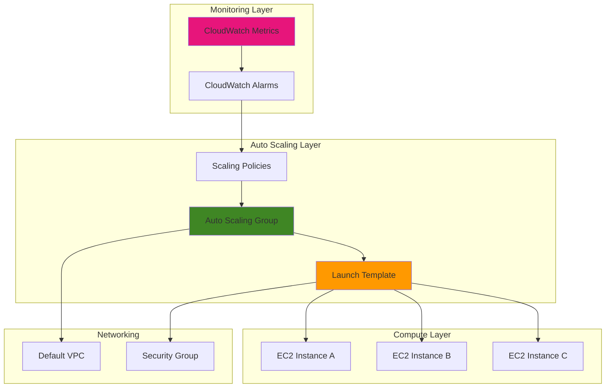

# EC2 Launch Templates with Auto Scaling

## Problem

Many applications experience unpredictable traffic patterns that require manual instance scaling to maintain performance during peak times. Manual scaling leads to either over-provisioned resources during low traffic periods, resulting in unnecessary costs, or under-provisioned resources during high demand, causing poor user experience. Traditional launch configurations lack versioning capabilities and modern EC2 features, making infrastructure management complex and error-prone.

## Solution

This recipe demonstrates how to create reusable EC2 launch templates and configure Auto Scaling groups to automatically manage instance capacity based on CloudWatch metrics. Launch templates provide versioning support and access to the latest EC2 features, while Auto Scaling automatically adjusts capacity based on demand, ensuring optimal performance and cost efficiency through automated instance management.

## Architecture Diagram



## Prerequisites

1. AWS account with IAM permissions for EC2, Auto Scaling, and CloudWatch services
2. AWS CLI v2 installed and configured with appropriate credentials
3. Basic understanding of EC2 instances and networking concepts
4. Access to the default VPC and at least two availability zones
5. Estimated cost: $5-15 for testing (depends on instance types and duration)

> **Note**: This recipe uses t2.micro instances which qualify for AWS Free Tier if available in your account.

## Preparation

```bash
# Set environment variables
export AWS_REGION=$(aws configure get region)
export AWS_ACCOUNT_ID=$(aws sts get-caller-identity \
    --query Account --output text)

# Generate unique identifiers for resources
RANDOM_SUFFIX=$(aws secretsmanager get-random-password \
    --exclude-punctuation --exclude-uppercase \
    --password-length 6 --require-each-included-type \
    --output text --query RandomPassword)

# Set resource names with unique suffix
export LAUNCH_TEMPLATE_NAME="demo-launch-template-${RANDOM_SUFFIX}"
export ASG_NAME="demo-auto-scaling-group-${RANDOM_SUFFIX}"
export SECURITY_GROUP_NAME="demo-sg-${RANDOM_SUFFIX}"

# Get the latest Amazon Linux 2 AMI ID
export AMI_ID=$(aws ec2 describe-images \
    --owners amazon \
    --filters "Name=name,Values=amzn2-ami-hvm-*-x86_64-gp2" \
    --query 'Images | sort_by(@, &CreationDate) | [-1].ImageId' \
    --output text)

# Get default VPC and subnet information
export VPC_ID=$(aws ec2 describe-vpcs \
    --filters "Name=is-default,Values=true" \
    --query 'Vpcs[0].VpcId' --output text)

export SUBNET_IDS=$(aws ec2 describe-subnets \
    --filters "Name=vpc-id,Values=${VPC_ID}" \
    --query 'Subnets[].SubnetId' --output text)

echo "✅ AWS environment configured"
echo "Region: ${AWS_REGION}"
echo "VPC ID: ${VPC_ID}"
echo "AMI ID: ${AMI_ID}"
```

## Steps

1. **Create Security Group for EC2 Instances**:

   Security groups act as virtual firewalls controlling network traffic to EC2 instances. Creating a dedicated security group for our Auto Scaling group ensures consistent network security policies across all instances while allowing necessary HTTP traffic for web applications and SSH access for management.

   ```bash
   # Create security group
   aws ec2 create-security-group \
       --group-name ${SECURITY_GROUP_NAME} \
       --description "Security group for Auto Scaling demo" \
       --vpc-id ${VPC_ID}
   
   # Get security group ID
   export SG_ID=$(aws ec2 describe-security-groups \
       --group-names ${SECURITY_GROUP_NAME} \
       --query 'SecurityGroups[0].GroupId' --output text)
   
   # Add inbound rules for HTTP and SSH
   aws ec2 authorize-security-group-ingress \
       --group-id ${SG_ID} \
       --protocol tcp --port 80 --cidr 0.0.0.0/0
   
   aws ec2 authorize-security-group-ingress \
       --group-id ${SG_ID} \
       --protocol tcp --port 22 --cidr 0.0.0.0/0
   
   echo "✅ Security group created: ${SG_ID}"
   ```

2. **Create Launch Template with Instance Configuration**:

   Launch templates define the instance configuration blueprint that Auto Scaling will use to launch new instances. Unlike launch configurations, templates support versioning and provide access to the latest EC2 features, making them the recommended approach for modern AWS infrastructure deployment.

   ```bash
   # Create launch template with UserData for web server setup
   aws ec2 create-launch-template \
       --launch-template-name ${LAUNCH_TEMPLATE_NAME} \
       --launch-template-data "{
           \"ImageId\": \"${AMI_ID}\",
           \"InstanceType\": \"t2.micro\",
           \"SecurityGroupIds\": [\"${SG_ID}\"],
           \"UserData\": \"$(echo '#!/bin/bash
yum update -y
yum install -y httpd
systemctl start httpd
systemctl enable httpd
echo "<h1>Hello from $(hostname -f)</h1>" > /var/www/html/index.html
echo "<p>Instance launched at $(date)</p>" >> /var/www/html/index.html' | base64 -w 0)\",
           \"TagSpecifications\": [{
               \"ResourceType\": \"instance\",
               \"Tags\": [{
                   \"Key\": \"Name\",
                   \"Value\": \"AutoScaling-Instance\"
               }, {
                   \"Key\": \"Environment\",
                   \"Value\": \"Demo\"
               }]
           }]
       }"
   
   # Get launch template ID
   export LT_ID=$(aws ec2 describe-launch-templates \
       --launch-template-names ${LAUNCH_TEMPLATE_NAME} \
       --query 'LaunchTemplates[0].LaunchTemplateId' \
       --output text)
   
   echo "✅ Launch template created: ${LT_ID}"
   ```

3. **Create Auto Scaling Group with Launch Template**:

   Auto Scaling groups automatically maintain the desired number of healthy instances by launching new instances when needed and terminating unhealthy ones. By distributing instances across multiple availability zones, Auto Scaling provides high availability and fault tolerance for your applications.

   ```bash
   # Create Auto Scaling group
   aws autoscaling create-auto-scaling-group \
       --auto-scaling-group-name ${ASG_NAME} \
       --launch-template "LaunchTemplateId=${LT_ID},Version=\$Latest" \
       --min-size 1 \
       --max-size 4 \
       --desired-capacity 2 \
       --vpc-zone-identifier "${SUBNET_IDS// /,}" \
       --health-check-type EC2 \
       --health-check-grace-period 300 \
       --tags "Key=Name,Value=AutoScaling-ASG,PropagateAtLaunch=false" \
              "Key=Environment,Value=Demo,PropagateAtLaunch=true"
   
   # Wait for instances to be in service
   echo "Waiting for Auto Scaling group to launch instances..."
   aws autoscaling wait instances-in-service \
       --auto-scaling-group-names ${ASG_NAME}
   
   echo "✅ Auto Scaling group created: ${ASG_NAME}"
   ```

4. **Create Target Tracking Scaling Policy**:

   Target tracking scaling policies automatically adjust the number of instances to maintain a target value for a specific CloudWatch metric. This approach provides simple, automated scaling that responds to actual application demand without requiring complex threshold-based rules.

   ```bash
   # Create target tracking scaling policy for CPU utilization
   aws autoscaling put-scaling-policy \
       --auto-scaling-group-name ${ASG_NAME} \
       --policy-name "cpu-target-tracking-policy" \
       --policy-type "TargetTrackingScaling" \
       --target-tracking-configuration '{
           "TargetValue": 70.0,
           "PredefinedMetricSpecification": {
               "PredefinedMetricType": "ASGAverageCPUUtilization"
           },
           "ScaleOutCooldown": 300,
           "ScaleInCooldown": 300
       }'
   
   echo "✅ Target tracking scaling policy created"
   ```

5. **Enable Auto Scaling Group Metrics**:

   Enabling detailed CloudWatch metrics for Auto Scaling groups provides visibility into scaling activities and instance health. These metrics help monitor the effectiveness of scaling policies and troubleshoot performance issues in your auto-scaled infrastructure.

   ```bash
   # Enable Auto Scaling group metrics
   aws autoscaling enable-metrics-collection \
       --auto-scaling-group-name ${ASG_NAME} \
       --metrics "GroupMinSize" "GroupMaxSize" "GroupDesiredCapacity" \
                "GroupInServiceInstances" "GroupTotalInstances"
   
   echo "✅ CloudWatch metrics enabled for Auto Scaling group"
   ```

6. **Verify Auto Scaling Configuration**:

   Verifying the Auto Scaling configuration ensures all components are properly configured and instances are healthy. This validation step confirms that the launch template, Auto Scaling group, and scaling policies are working correctly together.

   ```bash
   # Describe Auto Scaling group details
   aws autoscaling describe-auto-scaling-groups \
       --auto-scaling-group-names ${ASG_NAME} \
       --query 'AutoScalingGroups[0].{
           Name:AutoScalingGroupName,
           MinSize:MinSize,
           MaxSize:MaxSize,
           DesiredCapacity:DesiredCapacity,
           InstanceCount:length(Instances),
           LaunchTemplate:LaunchTemplate.LaunchTemplateName
       }' --output table
   
   # Get instance IDs for further validation
   export INSTANCE_IDS=$(aws autoscaling describe-auto-scaling-groups \
       --auto-scaling-group-names ${ASG_NAME} \
       --query 'AutoScalingGroups[0].Instances[].InstanceId' \
       --output text)
   
   echo "✅ Auto Scaling group verification complete"
   echo "Instance IDs: ${INSTANCE_IDS}"
   ```

## Validation & Testing

1. **Verify instances are running and healthy**:

   ```bash
   # Check instance status and public IP addresses
   aws ec2 describe-instances \
       --instance-ids ${INSTANCE_IDS} \
       --query 'Reservations[].Instances[].[InstanceId,State.Name,PublicIpAddress]' \
       --output table
   ```

   Expected output: All instances should show "running" state with assigned public IP addresses.

2. **Test web application on launched instances**:

   ```bash
   # Get public IP addresses of running instances
   PUBLIC_IPS=$(aws ec2 describe-instances \
       --instance-ids ${INSTANCE_IDS} \
       --query 'Reservations[].Instances[].PublicIpAddress' \
       --output text)
   
   # Test HTTP response from each instance
   for ip in ${PUBLIC_IPS}; do
       echo "Testing instance at ${ip}:"
       curl -s http://${ip} || echo "Instance not ready yet"
       echo ""
   done
   ```

   Expected output: HTML responses showing "Hello from" messages with different hostnames.

3. **Verify scaling policies are active**:

   ```bash
   # Check configured scaling policies
   aws autoscaling describe-policies \
       --auto-scaling-group-name ${ASG_NAME} \
       --query 'ScalingPolicies[].[PolicyName,PolicyType,TargetTrackingConfiguration.TargetValue]' \
       --output table
   ```

   Expected output: Target tracking policy with 70% CPU utilization target.

4. **Monitor CloudWatch metrics**:

   ```bash
   # Check Auto Scaling group desired capacity metric
   aws cloudwatch get-metric-statistics \
       --namespace AWS/AutoScaling \
       --metric-name GroupDesiredCapacity \
       --dimensions Name=AutoScalingGroupName,Value=${ASG_NAME} \
       --start-time $(date -u -d '5 minutes ago' '+%Y-%m-%dT%H:%M:%S') \
       --end-time $(date -u '+%Y-%m-%dT%H:%M:%S') \
       --period 300 \
       --statistics Average \
       --query 'Datapoints[0].Average' \
       --output text
   ```

   Expected output: Numeric value showing current desired capacity (should be 2).

## Cleanup

1. **Delete Auto Scaling Group**:

   ```bash
   # Set desired capacity to 0 and wait for instance termination
   aws autoscaling update-auto-scaling-group \
       --auto-scaling-group-name ${ASG_NAME} \
       --min-size 0 --max-size 0 --desired-capacity 0
   
   # Wait for instances to terminate
   echo "Waiting for instances to terminate..."
   aws autoscaling wait instances-terminated \
       --auto-scaling-group-names ${ASG_NAME}
   
   # Delete Auto Scaling group
   aws autoscaling delete-auto-scaling-group \
       --auto-scaling-group-name ${ASG_NAME}
   
   echo "✅ Auto Scaling group deleted"
   ```

2. **Delete Launch Template**:

   ```bash
   # Delete launch template
   aws ec2 delete-launch-template \
       --launch-template-id ${LT_ID}
   
   echo "✅ Launch template deleted: ${LT_ID}"
   ```

3. **Delete Security Group**:

   ```bash
   # Delete security group
   aws ec2 delete-security-group \
       --group-id ${SG_ID}
   
   echo "✅ Security group deleted: ${SG_ID}"
   ```

4. **Clean up environment variables**:

   ```bash
   # Unset environment variables
   unset LAUNCH_TEMPLATE_NAME ASG_NAME SECURITY_GROUP_NAME
   unset AMI_ID VPC_ID SUBNET_IDS SG_ID LT_ID INSTANCE_IDS
   
   echo "✅ Environment variables cleaned up"
   ```

## Discussion

This recipe demonstrates the power of combining EC2 Launch Templates with Auto Scaling to create resilient, cost-effective infrastructure that automatically adapts to demand. Launch templates provide several advantages over legacy launch configurations, including versioning support, access to the latest EC2 features like T3 Unlimited mode and newer instance types, and better integration with mixed instance policies following AWS Well-Architected Framework principles.

The target tracking scaling policy used in this recipe represents a significant improvement over traditional threshold-based scaling. Rather than defining specific scaling rules, target tracking automatically calculates the appropriate scaling actions to maintain your desired metric target. This approach reduces configuration complexity while providing more responsive scaling behavior that closely follows actual application demand, ensuring both performance efficiency and cost optimization.

Auto Scaling groups distribute instances across multiple Availability Zones, providing built-in high availability and fault tolerance. When combined with Elastic Load Balancing (not covered in this beginner recipe), Auto Scaling can automatically register new instances and remove unhealthy ones, creating a fully automated infrastructure that maintains application availability even during instance failures.

The CloudWatch integration enables comprehensive monitoring of your Auto Scaling activities, providing insights into scaling decisions and helping optimize your configuration over time. By analyzing metrics like GroupDesiredCapacity and scaling activity history, you can fine-tune your scaling policies to better match your application's behavior patterns while maintaining security best practices through proper IAM roles and encryption.

> **Tip**: Consider using Application Load Balancers with Auto Scaling groups in production to distribute traffic evenly across instances and enable advanced routing capabilities. See the [Elastic Load Balancing documentation](https://docs.aws.amazon.com/elasticloadbalancing/latest/userguide/) for implementation guidance.

**Sources:**
- [Auto Scaling launch templates - Amazon EC2 Auto Scaling](https://docs.aws.amazon.com/autoscaling/ec2/userguide/launch-templates.html)
- [Target tracking scaling policies for Amazon EC2 Auto Scaling](https://docs.aws.amazon.com/autoscaling/ec2/userguide/as-scaling-target-tracking.html)
- [Create Auto Scaling groups using launch templates](https://docs.aws.amazon.com/autoscaling/ec2/userguide/create-auto-scaling-groups-launch-template.html)
- [What is Amazon EC2 Auto Scaling?](https://docs.aws.amazon.com/autoscaling/ec2/userguide/what-is-amazon-ec2-auto-scaling.html)
- [Amazon CloudWatch metrics for Amazon EC2 Auto Scaling](https://docs.aws.amazon.com/autoscaling/ec2/userguide/ec2-auto-scaling-metrics.html)

## Challenge

Extend this solution by implementing these enhancements:

1. **Multi-AZ Load Balancer Integration**: Add an Application Load Balancer to distribute traffic across Auto Scaling group instances, enabling health checks and improved traffic distribution.

2. **Mixed Instance Types Policy**: Configure the Auto Scaling group to use multiple instance types and purchase options (On-Demand and Spot) to optimize costs while maintaining performance.

3. **Custom CloudWatch Metrics**: Create custom application metrics that trigger scaling based on business-specific indicators like active user sessions or queue depth rather than just CPU utilization.

4. **Launch Template Versioning**: Implement a blue-green deployment strategy using launch template versions to safely roll out application updates with automatic rollback capabilities.

5. **Scheduled Scaling Actions**: Add time-based scaling policies to handle predictable traffic patterns, such as scaling up before business hours and scaling down during nights and weekends.

## Infrastructure Code

*Infrastructure code will be generated after recipe approval.*