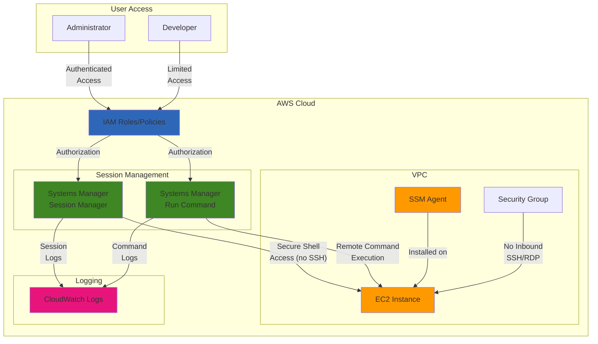

# Secure EC2 Management with Systems Manager

## Problem

Organizations need to manage their cloud servers securely while minimizing security risks. Traditional server management requires opening inbound SSH/RDP ports, managing SSH keys or passwords, and maintaining jump servers or bastion hosts. This approach increases the attack surface and creates administrative overhead as teams must track, rotate, and secure access credentials. Additionally, organizations struggle with providing controlled access to team members with different responsibility levels and maintaining audit logs of all server interactions for compliance and security.

## Solution

Implement a secure server management solution using Amazon EC2 and AWS Systems Manager that eliminates the need for inbound ports, SSH keys, or bastion hosts. This approach uses Systems Manager's Session Manager for secure shell access to EC2 instances and Run Command for remote script execution. IAM policies control access permissions, providing granular user access based on roles and responsibilities. All session activity and commands are automatically logged for audit purposes through integration with CloudWatch Logs. This solution greatly enhances security posture while simplifying administrative tasks and improving operational efficiency.

## Architecture Diagram



## Prerequisites

1. AWS account with permissions to create/manage EC2 instances, IAM roles, and Systems Manager resources
2. AWS CLI v2 installed and configured with appropriate credentials
3. Basic familiarity with EC2, IAM, and Linux/Windows server administration concepts
4. AWS Management Console access (for Session Manager plugin if not using CloudShell)
5. Estimated cost: <$5.00 for a 1-day test (t2.micro EC2 instance + Systems Manager)

> **Note**: This recipe follows AWS Well-Architected Framework security principles by eliminating inbound access ports and using IAM for access control. See [AWS Well-Architected Framework](https://docs.aws.amazon.com/wellarchitected/latest/framework/welcome.html) for additional security guidance.

## Preparation

```bash
# Set environment variables
export AWS_REGION=$(aws configure get region)
export AWS_ACCOUNT_ID=$(aws sts get-caller-identity \
    --query Account --output text)

# Generate a random suffix for resource names
RANDOM_SUFFIX=$(aws secretsmanager get-random-password \
    --exclude-punctuation --exclude-uppercase \
    --password-length 6 --require-each-included-type \
    --output text --query RandomPassword)

# Define resource names
export EC2_INSTANCE_NAME="secure-server-${RANDOM_SUFFIX}"
export IAM_ROLE_NAME="SSMInstanceRole-${RANDOM_SUFFIX}"
export IAM_PROFILE_NAME="SSMInstanceProfile-${RANDOM_SUFFIX}"

# Choose your preferred Linux distribution
read -p "Select OS (1 for Amazon Linux 2023, 2 for Ubuntu): " OS_CHOICE
if [ "$OS_CHOICE" = "1" ]; then
    # Amazon Linux 2023 AMI ID for x86_64
    export AMI_ID=$(aws ec2 describe-images \
        --owners amazon \
        --filters "Name=name,Values=al2023-ami-2023*x86_64" \
        "Name=state,Values=available" \
        --query "sort_by(Images, &CreationDate)[-1].ImageId" \
        --output text)
    export OS_TYPE="Amazon Linux 2023"
else
    # Ubuntu 22.04 LTS AMI ID for x86_64
    export AMI_ID=$(aws ec2 describe-images \
        --owners 099720109477 \
        --filters "Name=name,Values=ubuntu/images/hvm-ssd/ubuntu-jammy-22.04-amd64-*" \
        "Name=state,Values=available" \
        --query "sort_by(Images, &CreationDate)[-1].ImageId" \
        --output text)
    export OS_TYPE="Ubuntu 22.04"
fi

echo "✅ Environment preparation complete"
echo "Using ${OS_TYPE} with AMI ID: ${AMI_ID}"
echo "Region: ${AWS_REGION}"
```

## Steps

1. **Create IAM Role for EC2 with Systems Manager Access**:

   IAM roles provide secure, temporary credentials for EC2 instances to access AWS services without storing long-term access keys on the instance. This establishes the foundation for secure Systems Manager communication by granting the minimum necessary permissions through AWS managed policies.

   ```bash
   # Create IAM role with EC2 trust relationship
   # This role enables EC2 instances to authenticate with AWS services
   aws iam create-role \
       --role-name ${IAM_ROLE_NAME} \
       --assume-role-policy-document '{
           "Version": "2012-10-17",
           "Statement": [
               {
                   "Effect": "Allow",
                   "Principal": {"Service": "ec2.amazonaws.com"},
                   "Action": "sts:AssumeRole"
               }
           ]
       }'
   
   # Attach AmazonSSMManagedInstanceCore policy to the role
   # This managed policy provides the minimum permissions needed for Systems Manager
   aws iam attach-role-policy \
       --role-name ${IAM_ROLE_NAME} \
       --policy-arn arn:aws:iam::aws:policy/AmazonSSMManagedInstanceCore
   
   # Create instance profile (required to attach IAM roles to EC2 instances)
   aws iam create-instance-profile \
       --instance-profile-name ${IAM_PROFILE_NAME}
   
   # Add role to instance profile
   aws iam add-role-to-instance-profile \
       --instance-profile-name ${IAM_PROFILE_NAME} \
       --role-name ${IAM_ROLE_NAME}
   
   # Wait for profile to propagate across AWS infrastructure
   echo "Waiting for IAM instance profile to propagate..."
   sleep 10
   
   echo "✅ IAM role and instance profile created"
   ```

   The IAM role is now configured with the necessary permissions for Systems Manager operations. This security foundation enables your EC2 instance to authenticate with AWS services using temporary, rotatable credentials rather than permanent access keys.

> **Note**: The IAM instance profile is what actually gets attached to EC2 instances. An instance profile acts as a container for one IAM role, enabling applications on the instance to use the role's credentials. Learn more about [IAM roles for Amazon EC2](https://docs.aws.amazon.com/AWSEC2/latest/UserGuide/iam-roles-for-amazon-ec2.html).

2. **Launch EC2 Instance with Systems Manager Support**:

   EC2 instances with Systems Manager support eliminate the need for traditional remote access methods. By launching with the proper IAM role and restrictive security groups, we create a secure server that can only be accessed through AWS-managed channels.

   ```bash
   # Get default VPC ID (most AWS accounts have a default VPC in each region)
   VPC_ID=$(aws ec2 describe-vpcs \
       --filters "Name=isDefault,Values=true" \
       --query "Vpcs[0].VpcId" \
       --output text)
   
   # Get first subnet in the VPC (we need a subnet to launch instances)
   SUBNET_ID=$(aws ec2 describe-subnets \
       --filters "Name=vpc-id,Values=${VPC_ID}" \
       --query "Subnets[0].SubnetId" \
       --output text)
   
   # Create security group that blocks all inbound traffic
   # This demonstrates the security improvement - no SSH ports needed
   SG_ID=$(aws ec2 create-security-group \
       --group-name "SSM-SecureServer-${RANDOM_SUFFIX}" \
       --description "Security group for SSM managed instance" \
       --vpc-id ${VPC_ID} \
       --query "GroupId" \
       --output text)
   
   # Note: Default security groups allow all outbound traffic
   # Systems Manager uses outbound HTTPS (port 443) to communicate with AWS services
   
   # Launch instance with the IAM instance profile attached
   # The instance profile provides Systems Manager permissions
   INSTANCE_ID=$(aws ec2 run-instances \
       --image-id ${AMI_ID} \
       --instance-type t2.micro \
       --subnet-id ${SUBNET_ID} \
       --security-group-ids ${SG_ID} \
       --iam-instance-profile Name=${IAM_PROFILE_NAME} \
       --tag-specifications "ResourceType=instance,Tags=[{Key=Name,Value=${EC2_INSTANCE_NAME}}]" \
       --query "Instances[0].InstanceId" \
       --output text)
   
   # Wait for the instance to be running before proceeding
   echo "Waiting for instance to be in 'running' state..."
   aws ec2 wait instance-running --instance-ids ${INSTANCE_ID}
   
   echo "✅ EC2 instance launched with ID: ${INSTANCE_ID}"
   ```

   The EC2 instance is now running with Systems Manager permissions and a security group that allows no inbound traffic. This configuration demonstrates how Systems Manager eliminates the need for traditional SSH access while maintaining full management capabilities.

3. **Verify Systems Manager Connection to the Instance**:

   Systems Manager requires the SSM Agent to be running on the instance and properly registered with the service. Modern AMIs include the SSM Agent pre-installed, but registration depends on proper IAM permissions and network connectivity.

   ```bash
   # Wait for the SSM Agent to register with Systems Manager
   # The agent comes pre-installed on Amazon Linux and Ubuntu AMIs
   echo "Waiting for the instance to register with Systems Manager..."
   sleep 60
   
   # Check if instance is registered with Systems Manager
   # This verifies that the IAM permissions and network connectivity are working
   PING_STATUS=$(aws ssm describe-instance-information \
       --filters "Key=InstanceIds,Values=${INSTANCE_ID}" \
       --query "InstanceInformationList[0].PingStatus" \
       --output text)
   
   echo "Instance status in Systems Manager: ${PING_STATUS}"
   
   # If the output is "Online", the instance is successfully registered
   if [ "$PING_STATUS" = "Online" ]; then
       echo "✅ Verified EC2 instance is managed by Systems Manager"
   else
       echo "⚠️ Instance not yet online. Please wait and check connectivity."
   fi
   ```

   The instance is now registered with Systems Manager and ready for secure management. This verification step ensures that the IAM permissions, network connectivity, and SSM Agent are all functioning correctly before proceeding to access the instance.

> **Warning**: If the instance shows as "Connection Lost" or doesn't appear, check that the instance has internet connectivity and the IAM role includes the AmazonSSMManagedInstanceCore policy. The SSM agent requires outbound HTTPS (port 443) access to communicate with AWS services. For troubleshooting, see [Troubleshooting Session Manager](https://docs.aws.amazon.com/systems-manager/latest/userguide/session-manager-troubleshooting.html).

4. **Use Session Manager for Secure Shell Access**:

   Session Manager provides secure shell access to EC2 instances through a web browser or AWS CLI without requiring SSH keys or open inbound ports. This browser-based terminal provides the same functionality as SSH but with enhanced security and logging capabilities.

   ```bash
   # Start a session to the instance (this will open an interactive shell)
   # Note: This command requires the Session Manager plugin to be installed
   # In CloudShell, this plugin is pre-installed
   
   echo "To start a secure shell session to your instance, run this command:"
   echo "aws ssm start-session --target ${INSTANCE_ID}"
   
   echo ""
   echo "Alternatively, you can connect through the AWS Console:"
   echo "1. Go to the EC2 console"
   echo "2. Select the instance with name ${EC2_INSTANCE_NAME}"
   echo "3. Click 'Connect' button and select 'Session Manager'"
   echo "4. Click 'Connect'"
   
   echo "✅ Session Manager is ready to use for secure shell access"
   ```

   Session Manager is now configured and ready to provide secure shell access. This capability replaces traditional SSH access with AWS-managed secure connections that are logged and auditable.

5. **Execute Remote Commands using Run Command**:

   Run Command enables remote execution of scripts and commands across multiple instances simultaneously. This capability is essential for automation, configuration management, and operational tasks without requiring direct shell access.

   ```bash
   # Create a simple command to gather system information
   # Run Command allows you to execute scripts on multiple instances simultaneously
   CMD_ID=$(aws ssm send-command \
       --document-name "AWS-RunShellScript" \
       --document-version "1" \
       --targets "[{\"Key\":\"InstanceIds\",\"Values\":[\"${INSTANCE_ID}\"]}]" \
       --parameters "{\"commands\":[\"echo 'Hello from Systems Manager Run Command'\", \"hostname\", \"uname -a\", \"df -h\", \"free -m\"]}" \
       --timeout-seconds 600 \
       --max-concurrency "50" \
       --max-errors "0" \
       --query "Command.CommandId" \
       --output text)
   
   # Wait for command to complete
   echo "Waiting for command to complete..."
   sleep 5
   
   # Get command outputs to verify execution
   # This demonstrates how you can automate operations across your fleet
   aws ssm get-command-invocation \
       --command-id ${CMD_ID} \
       --instance-id ${INSTANCE_ID} \
       --query "StandardOutputContent" \
       --output text
   
   echo "✅ Successfully executed remote command using Run Command"
   ```

   Run Command has successfully executed commands on the remote instance, demonstrating how you can automate operations across your server fleet. This capability scales to hundreds or thousands of instances, enabling consistent operations and reducing manual effort.

6. **Deploy a Simple Web Application using Run Command**:

   Run Command excels at software deployment and configuration management. This step demonstrates how to deploy applications without requiring SSH access, showing the practical benefits of Systems Manager for operational tasks.

   ```bash
   # Use Run Command to install and configure a simple web application
   # This shows how to automate software deployment without SSH access
   DEPLOY_CMD_ID=$(aws ssm send-command \
       --document-name "AWS-RunShellScript" \
       --targets "[{\"Key\":\"InstanceIds\",\"Values\":[\"${INSTANCE_ID}\"]}]" \
       --parameters '{
           "commands": [
               "#!/bin/bash",
               "# Install web server",
               "if command -v apt-get &> /dev/null; then",
               "    # Ubuntu",
               "    apt-get update -y",
               "    apt-get install -y nginx",
               "    systemctl enable nginx",
               "    systemctl start nginx",
               "    echo \"<html><body><h1>Hello from Systems Manager</h1><p>This server is managed securely without SSH!</p></body></html>\" > /var/www/html/index.html",
               "else",
               "    # Amazon Linux",
               "    dnf update -y",
               "    dnf install -y nginx",
               "    systemctl enable nginx",
               "    systemctl start nginx",
               "    echo \"<html><body><h1>Hello from Systems Manager</h1><p>This server is managed securely without SSH!</p></body></html>\" > /usr/share/nginx/html/index.html",
               "fi",
               "echo Web server deployed successfully"
           ]
       }' \
       --timeout-seconds 600 \
       --query "Command.CommandId" \
       --output text)
   
   # Wait for command to complete
   echo "Waiting for web server deployment to complete..."
   sleep 20
   
   # Get command output to verify successful deployment
   aws ssm get-command-invocation \
       --command-id ${DEPLOY_CMD_ID} \
       --instance-id ${INSTANCE_ID} \
       --query "StandardOutputContent" \
       --output text
   
   echo "✅ Web application deployed using Run Command"
   ```

   The web application has been successfully deployed using Run Command, demonstrating how Systems Manager enables automated application deployment without traditional access methods. This approach scales efficiently across multiple instances and environments.

7. **Configure CloudWatch Log Group for Session Logging**:

   Session logging provides essential audit trails for compliance and security monitoring. By configuring CloudWatch Logs integration, all session activity is automatically captured and made available for analysis and alerting.

   ```bash
   # Create a CloudWatch Log Group for session logging
   # This enables audit trails for all session activity
   aws logs create-log-group \
       --log-group-name "/aws/ssm/sessions/${RANDOM_SUFFIX}"
   
   # Create Session Manager preferences document for CloudWatch logging
   # This configuration enables logging for all future sessions
   cat > SessionManagerRunShell.json << EOF
   {
       "schemaVersion": "1.0",
       "description": "Document to hold regional settings for Session Manager",
       "sessionType": "Standard_Stream",
       "inputs": {
           "s3BucketName": "",
           "s3KeyPrefix": "",
           "s3EncryptionEnabled": true,
           "cloudWatchLogGroupName": "/aws/ssm/sessions/${RANDOM_SUFFIX}",
           "cloudWatchEncryptionEnabled": false,
           "cloudWatchStreamingEnabled": false,
           "kmsKeyId": "",
           "runAsEnabled": false,
           "runAsDefaultUser": "",
           "idleSessionTimeout": "",
           "maxSessionDuration": "",
           "shellProfile": {
               "windows": "",
               "linux": ""
           }
       }
   }
   EOF
   
   # Update Session Manager preferences to use CloudWatch Logs
   aws ssm update-document \
       --name "SSM-SessionManagerRunShell" \
       --content "file://SessionManagerRunShell.json" \
       --document-version "\$LATEST"
   
   # Clean up temporary file
   rm SessionManagerRunShell.json
   
   echo "✅ Session logging configured to CloudWatch Logs"
   ```

   Session logging is now configured to provide comprehensive audit trails. All future session activity will be automatically logged to CloudWatch Logs, enabling compliance monitoring and security analysis.

> **Tip**: Session logging is essential for compliance and security auditing. You can also configure session logs to be stored in S3 for long-term retention and analysis. For more information, see [Logging session data using Amazon CloudWatch Logs](https://docs.aws.amazon.com/systems-manager/latest/userguide/session-manager-logging-cloudwatch-logs.html).

## Validation & Testing

1. Verify the EC2 instance is properly registered with Systems Manager:

   ```bash
   # Check instance status in Systems Manager
   aws ssm describe-instance-information \
       --filters "Key=InstanceIds,Values=${INSTANCE_ID}" \
       --query "InstanceInformationList[0].[ComputerName,PingStatus,PlatformType]" \
       --output table
   ```

   Expected output: A table showing the instance name, "Online" status, and the platform type.

2. Test the web server installation:

   ```bash
   # Get the EC2 instance's public IP address
   PUBLIC_IP=$(aws ec2 describe-instances \
       --instance-ids ${INSTANCE_ID} \
       --query "Reservations[0].Instances[0].PublicIpAddress" \
       --output text)
   
   if [ "$PUBLIC_IP" = "None" ] || [ -z "$PUBLIC_IP" ]; then
       echo "This instance doesn't have a public IP address."
       echo "The web server is running but only accessible through SSM Session Manager."
       echo "Use Session Manager to verify the web server is running:"
       echo "aws ssm start-session --target ${INSTANCE_ID}"
       echo "Then run: curl http://localhost"
   else
       echo "Public IP: $PUBLIC_IP"
       echo "To test the web server, you need to allow HTTP traffic."
       echo "Add HTTP inbound rule to security group ${SG_ID} if needed."
       
       # Note: The security group currently blocks all inbound traffic
       echo "Current security group blocks all inbound traffic for security."
       echo "This demonstrates Systems Manager's secure access without open ports."
   fi
   ```

3. Verify session logging configuration:

   ```bash
   # Check if log group was created successfully
   aws logs describe-log-groups \
       --log-group-name-prefix "/aws/ssm/sessions/${RANDOM_SUFFIX}" \
       --query "logGroups[0].logGroupName" \
       --output text
   
   echo "After starting and closing a session, you can review logs at:"
   echo "https://console.aws.amazon.com/cloudwatch/home?region=${AWS_REGION}#logsV2:log-groups/log-group/%2Faws%2Fssm%2Fsessions%2F${RANDOM_SUFFIX}"
   ```

## Cleanup

1. Remove the EC2 instance:

   ```bash
   # Terminate the EC2 instance
   aws ec2 terminate-instances \
       --instance-ids ${INSTANCE_ID}
   
   # Wait for the instance to terminate
   echo "Waiting for instance to terminate..."
   aws ec2 wait instance-terminated \
       --instance-ids ${INSTANCE_ID}
   
   echo "✅ EC2 instance terminated"
   ```

2. Delete the security group:

   ```bash
   # Delete the security group
   aws ec2 delete-security-group \
       --group-id ${SG_ID}
   
   echo "✅ Security group deleted"
   ```

3. Delete the IAM role and instance profile:

   ```bash
   # Remove role from instance profile
   aws iam remove-role-from-instance-profile \
       --instance-profile-name ${IAM_PROFILE_NAME} \
       --role-name ${IAM_ROLE_NAME}
   
   # Delete instance profile
   aws iam delete-instance-profile \
       --instance-profile-name ${IAM_PROFILE_NAME}
   
   # Detach policy from role
   aws iam detach-role-policy \
       --role-name ${IAM_ROLE_NAME} \
       --policy-arn arn:aws:iam::aws:policy/AmazonSSMManagedInstanceCore
   
   # Delete role
   aws iam delete-role \
       --role-name ${IAM_ROLE_NAME}
   
   echo "✅ IAM role and instance profile deleted"
   ```

4. Delete CloudWatch Log Group:

   ```bash
   # Delete CloudWatch Log Group
   aws logs delete-log-group \
       --log-group-name "/aws/ssm/sessions/${RANDOM_SUFFIX}"
   
   echo "✅ CloudWatch Log Group deleted"
   ```

5. Clean up local environment variables:

   ```bash
   # Clean up local environment variables
   unset AWS_REGION
   unset AWS_ACCOUNT_ID
   unset EC2_INSTANCE_NAME
   unset IAM_ROLE_NAME
   unset IAM_PROFILE_NAME
   unset AMI_ID
   unset OS_TYPE
   unset RANDOM_SUFFIX
   unset VPC_ID
   unset SUBNET_ID
   unset SG_ID
   unset INSTANCE_ID
   unset CMD_ID
   unset DEPLOY_CMD_ID
   unset PUBLIC_IP
   unset PING_STATUS
   
   echo "✅ Cleanup complete! All resources have been removed."
   ```

## Discussion

AWS Systems Manager transforms how you securely manage EC2 instances by eliminating the traditional security risks associated with direct SSH or RDP access. This approach addresses three key challenges: security, operational efficiency, and compliance, while following AWS Well-Architected Framework principles.

From a security perspective, removing the need for inbound management ports significantly reduces your attack surface. According to the Verizon Data Breach Investigations Report, 70% of breaches are perpetrated by external actors, and many of these exploits target open management ports. Systems Manager's Session Manager provides secure shell access without opening any inbound ports, while IAM policies ensure fine-grained access control. The AWS-managed infrastructure handles authentication, authorization, and encryption in transit, eliminating many common security concerns. This approach aligns with the AWS Well-Architected Framework's security pillar by implementing defense in depth and the principle of least privilege.

Operationally, Systems Manager reduces the burden of credential management and improves efficiency. Teams no longer need to generate, distribute, store, and rotate SSH keys or passwords. This streamlines the onboarding and offboarding of team members, as all access is controlled through IAM. The Run Command feature further enhances operational efficiency by allowing standardized operations across multiple instances simultaneously. This consistency reduces human error and allows for rapid response to operational needs, supporting the operational excellence pillar of the Well-Architected Framework.

Compliance and auditability are automatically addressed through Systems Manager's integration with CloudWatch Logs. Every session and command is logged, providing a complete audit trail of who accessed which resources and what actions they performed. This detailed logging meets many compliance requirements out of the box, without requiring additional tools or configurations. For organizations managing multiple environments or a large fleet of instances, Systems Manager's approach scales efficiently while maintaining centralized security controls.

> **Note**: For additional security best practices and detailed implementation guidance, refer to the [AWS Systems Manager User Guide](https://docs.aws.amazon.com/systems-manager/latest/userguide/) and the [AWS Well-Architected Security Pillar](https://docs.aws.amazon.com/wellarchitected/latest/security-pillar/welcome.html).

## Challenge

Extend this solution by implementing these enhancements:

1. Create custom IAM policies that restrict Systems Manager access to specific EC2 instances based on tags, implementing separation of duties between development, staging, and production environments.

2. Configure Systems Manager to store session logs in an S3 bucket with lifecycle policies for long-term retention and implement cross-region replication for compliance requirements.

3. Use Systems Manager Parameter Store to securely store and retrieve configuration data for your applications, replacing hardcoded sensitive values in scripts with encrypted parameters.

4. Create a Systems Manager maintenance window that automatically applies security patches to your EC2 instances on a regular schedule using the Patch Manager capability, with approval workflows for critical systems.

5. Build a custom automation document that sets up a complete application stack using Systems Manager Automation, allowing you to consistently deploy complex applications across multiple environments with error handling and rollback capabilities.

## Infrastructure Code

### Available Infrastructure as Code:

- [Infrastructure Code Overview](code/README.md) - Detailed description of all infrastructure components
- [AWS CDK (Python)](code/cdk-python/) - AWS CDK Python implementation
- [AWS CDK (TypeScript)](code/cdk-typescript/) - AWS CDK TypeScript implementation
- [CloudFormation](code/cloudformation.yaml) - AWS CloudFormation template
- [Bash CLI Scripts](code/scripts/) - Example bash scripts using AWS CLI commands to deploy infrastructure
- [Terraform](code/terraform/) - Terraform configuration files