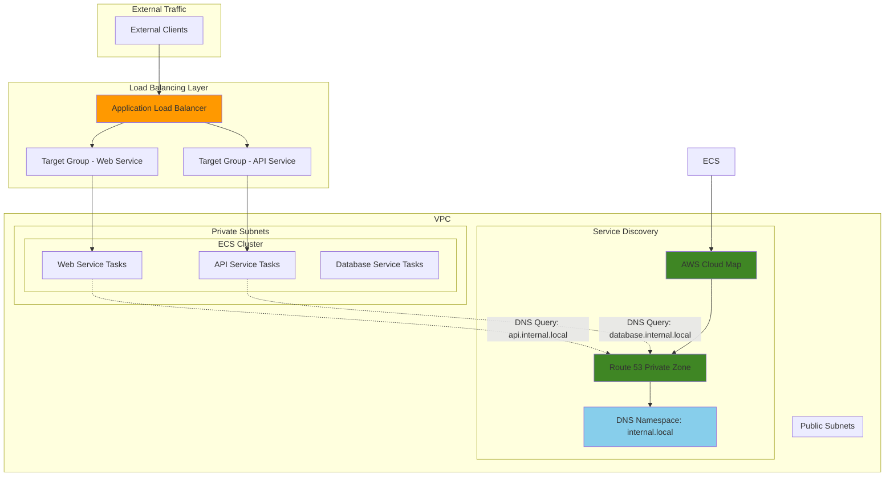

# ECS Service Discovery with Route 53


## Problem

Modern microservices architectures require seamless service-to-service communication, but traditional load balancers create bottlenecks and complex networking configurations. Development teams struggle with service discovery as microservices scale, leading to hardcoded endpoints, manual configuration management, and increased operational overhead. When services need to communicate internally while also being accessible through load balancers, the lack of automated DNS-based discovery results in brittle connections and deployment complexity.

## Solution

Implement ECS service discovery using AWS Cloud Map integration with Route 53 private hosted zones, combined with Application Load Balancer for external access. This solution provides automatic DNS registration for microservices, enabling services to discover each other using simple DNS names while maintaining external accessibility through ALB routing. The approach eliminates manual service registration, provides health checking, and scales automatically with container deployments.

## Architecture Diagram



## Prerequisites

1. AWS account with ECS, Route 53, and Elastic Load Balancing permissions
2. AWS CLI v2 installed and configured (or AWS CloudShell)
3. Basic understanding of containerization and DNS concepts
4. Existing VPC with public and private subnets across multiple AZs
5. Estimated cost: $50-100/month for ALB, ECS tasks, and Route 53 resources

> **Note**: This recipe assumes you have a VPC with proper subnet configuration. If you need to create a VPC, use the AWS VPC console or CLI first. For detailed VPC setup guidance, refer to the [VPC User Guide](https://docs.aws.amazon.com/vpc/latest/userguide/working-with-vpcs.html).

## Preparation

```bash
# Set environment variables
export AWS_REGION=$(aws configure get region)
export AWS_ACCOUNT_ID=$(aws sts get-caller-identity \
    --query Account --output text)

# Generate unique identifiers for resources
RANDOM_SUFFIX=$(aws secretsmanager get-random-password \
    --exclude-punctuation --exclude-uppercase \
    --password-length 6 --require-each-included-type \
    --output text --query RandomPassword)
export CLUSTER_NAME="microservices-cluster-${RANDOM_SUFFIX}"
export NAMESPACE_NAME="internal.local"
export ALB_NAME="microservices-alb-${RANDOM_SUFFIX}"

# Get default VPC and subnets (or specify your own)
export VPC_ID=$(aws ec2 describe-vpcs \
    --filters "Name=is-default,Values=true" \
    --query "Vpcs[0].VpcId" --output text)

export SUBNET_IDS=$(aws ec2 describe-subnets \
    --filters "Name=vpc-id,Values=${VPC_ID}" \
    --query "Subnets[*].SubnetId" --output text)

# Create ECS cluster
aws ecs create-cluster \
    --cluster-name ${CLUSTER_NAME} \
    --capacity-providers FARGATE \
    --default-capacity-provider-strategy \
    capacityProvider=FARGATE,weight=1

echo "✅ Created ECS cluster: ${CLUSTER_NAME}"
```

## Steps

1. **Create AWS Cloud Map private DNS namespace**:

   AWS Cloud Map provides service discovery capabilities by creating and managing DNS records in Route 53 private hosted zones. This establishes the foundation for microservice communication by enabling services to discover each other using simple DNS names rather than hardcoded IP addresses. The private namespace ensures that service discovery is confined to your VPC, providing security and isolation for internal microservice communication.

   ```bash
   # Create private DNS namespace for service discovery
   NAMESPACE_OPERATION=$(aws servicediscovery create-private-dns-namespace \
       --name ${NAMESPACE_NAME} \
       --vpc ${VPC_ID} \
       --description "Private DNS namespace for microservices" \
       --query "OperationId" --output text)
   
   # Wait for namespace creation to complete
   aws servicediscovery get-operation \
       --operation-id ${NAMESPACE_OPERATION} \
       --query "Operation.Status" --output text
   
   # Get the namespace ID
   export NAMESPACE_ID=$(aws servicediscovery list-namespaces \
       --query "Namespaces[?Name=='${NAMESPACE_NAME}'].Id" \
       --output text)
   
   echo "✅ Created namespace: ${NAMESPACE_NAME} (${NAMESPACE_ID})"
   ```

   The namespace is now active and ready to host service registrations. This creates a private DNS zone within your VPC that will automatically resolve service names like `api.internal.local` to the IP addresses of healthy service instances, enabling seamless microservice communication.

2. **Create Application Load Balancer and security groups**:

   Application Load Balancer (ALB) provides Layer 7 load balancing with advanced request routing capabilities, making it ideal for microservices architectures. ALB enables path-based routing, host-based routing, and SSL termination while integrating seamlessly with ECS services for automatic target registration. Security groups act as virtual firewalls, controlling inbound and outbound traffic at the instance level to ensure only authorized communication occurs.

   ```bash
   # Create security group for ALB
   export ALB_SG_ID=$(aws ec2 create-security-group \
       --group-name "alb-sg-${RANDOM_SUFFIX}" \
       --description "Security group for Application Load Balancer" \
       --vpc-id ${VPC_ID} \
       --query "GroupId" --output text)
   
   # Allow HTTP and HTTPS traffic to ALB
   aws ec2 authorize-security-group-ingress \
       --group-id ${ALB_SG_ID} \
       --protocol tcp --port 80 --cidr 0.0.0.0/0
   
   aws ec2 authorize-security-group-ingress \
       --group-id ${ALB_SG_ID} \
       --protocol tcp --port 443 --cidr 0.0.0.0/0
   
   # Create Application Load Balancer
   export ALB_ARN=$(aws elbv2 create-load-balancer \
       --name ${ALB_NAME} \
       --subnets ${SUBNET_IDS} \
       --security-groups ${ALB_SG_ID} \
       --query "LoadBalancers[0].LoadBalancerArn" --output text)
   
   echo "✅ Created ALB: ${ALB_NAME}"
   ```

   The ALB is now deployed across multiple availability zones in public subnets, providing high availability and fault tolerance. It's configured to accept HTTP and HTTPS traffic from the internet and will distribute requests to healthy ECS tasks based on the routing rules we'll define in subsequent steps.

3. **Create security group for ECS tasks**:

   ECS tasks require carefully configured security groups to enable secure communication while maintaining the principle of least privilege. The security group must allow inbound traffic from the ALB for external access and enable internal communication between microservices for service-to-service calls. This configuration ensures that services can communicate securely while remaining isolated from unauthorized access.

   ```bash
   # Create security group for ECS tasks
   export ECS_SG_ID=$(aws ec2 create-security-group \
       --group-name "ecs-tasks-sg-${RANDOM_SUFFIX}" \
       --description "Security group for ECS tasks" \
       --vpc-id ${VPC_ID} \
       --query "GroupId" --output text)
   
   # Allow traffic from ALB to ECS tasks
   aws ec2 authorize-security-group-ingress \
       --group-id ${ECS_SG_ID} \
       --protocol tcp --port 3000 \
       --source-group ${ALB_SG_ID}
   
   aws ec2 authorize-security-group-ingress \
       --group-id ${ECS_SG_ID} \
       --protocol tcp --port 8080 \
       --source-group ${ALB_SG_ID}
   
   # Allow internal communication between services
   aws ec2 authorize-security-group-ingress \
       --group-id ${ECS_SG_ID} \
       --protocol tcp --port 0-65535 \
       --source-group ${ECS_SG_ID}
   
   echo "✅ Created ECS security group: ${ECS_SG_ID}"
   ```

   The security group is configured to allow ALB traffic to reach specific container ports while enabling full internal communication between services. This setup supports both external access through the load balancer and internal service discovery communication, creating a secure foundation for microservice interactions.

4. **Create Cloud Map services for service discovery**:

   Cloud Map services define the DNS records and health checking behavior for each microservice in your architecture. Each service represents a logical grouping of tasks that provide the same functionality and can be discovered using DNS names. The MULTIVALUE routing policy distributes requests across multiple healthy instances, while custom health checks ensure that only healthy service instances receive traffic through DNS queries.

   ```bash
   # Create service discovery service for web application
   export WEB_SERVICE_ID=$(aws servicediscovery create-service \
       --name "web" \
       --namespace-id ${NAMESPACE_ID} \
       --dns-config "RoutingPolicy=MULTIVALUE,DnsRecords=[{Type=A,TTL=300}]" \
       --health-check-custom-config FailureThreshold=3 \
       --query "Service.Id" --output text)
   
   # Create service discovery service for API
   export API_SERVICE_ID=$(aws servicediscovery create-service \
       --name "api" \
       --namespace-id ${NAMESPACE_ID} \
       --dns-config "RoutingPolicy=MULTIVALUE,DnsRecords=[{Type=A,TTL=300}]" \
       --health-check-custom-config FailureThreshold=3 \
       --query "Service.Id" --output text)
   
   # Create service discovery service for database
   export DB_SERVICE_ID=$(aws servicediscovery create-service \
       --name "database" \
       --namespace-id ${NAMESPACE_ID} \
       --dns-config "RoutingPolicy=MULTIVALUE,DnsRecords=[{Type=A,TTL=300}]" \
       --health-check-custom-config FailureThreshold=3 \
       --query "Service.Id" --output text)
   
   echo "✅ Created service discovery services"
   ```

   The service discovery services are now configured to automatically register and deregister ECS tasks as they start and stop. Services can now discover each other using DNS names like `web.internal.local`, `api.internal.local`, and `database.internal.local`, with Route 53 automatically returning the IP addresses of healthy instances.

5. **Create target groups for ALB**:

   Target groups define how the ALB routes traffic to your ECS tasks and monitor their health. Using IP target type is essential for Fargate tasks since they don't have persistent EC2 instances. The health check configuration ensures that only healthy tasks receive traffic, with customizable parameters for interval, timeout, and failure thresholds that balance responsiveness with stability.

   ```bash
   # Create target group for web service
   export WEB_TG_ARN=$(aws elbv2 create-target-group \
       --name "web-tg-${RANDOM_SUFFIX}" \
       --protocol HTTP --port 3000 \
       --target-type ip --vpc-id ${VPC_ID} \
       --health-check-path "/health" \
       --health-check-interval-seconds 30 \
       --health-check-timeout-seconds 5 \
       --healthy-threshold-count 2 \
       --unhealthy-threshold-count 3 \
       --query "TargetGroups[0].TargetGroupArn" --output text)
   
   # Create target group for API service
   export API_TG_ARN=$(aws elbv2 create-target-group \
       --name "api-tg-${RANDOM_SUFFIX}" \
       --protocol HTTP --port 8080 \
       --target-type ip --vpc-id ${VPC_ID} \
       --health-check-path "/health" \
       --health-check-interval-seconds 30 \
       --health-check-timeout-seconds 5 \
       --healthy-threshold-count 2 \
       --unhealthy-threshold-count 3 \
       --query "TargetGroups[0].TargetGroupArn" --output text)
   
   echo "✅ Created target groups for ALB"
   ```

   The target groups are configured with health checks that monitor the `/health` endpoint of each service. This ensures that ALB only routes traffic to healthy instances while providing fast detection of unhealthy tasks. The IP target type enables direct communication with Fargate task IP addresses, supporting the serverless container model.

6. **Create ALB listeners with routing rules**:

   ALB listeners define how the load balancer processes incoming requests and routes them to appropriate target groups. Path-based routing enables a single ALB to serve multiple microservices by analyzing the request URL and forwarding traffic to the correct service. This approach reduces costs and simplifies networking by consolidating multiple services behind a single load balancer endpoint.

   ```bash
   # Create default listener for web service
   export WEB_LISTENER_ARN=$(aws elbv2 create-listener \
       --load-balancer-arn ${ALB_ARN} \
       --protocol HTTP --port 80 \
       --default-actions Type=forward,TargetGroupArn=${WEB_TG_ARN} \
       --query "Listeners[0].ListenerArn" --output text)
   
   # Create listener rule for API service
   aws elbv2 create-rule \
       --listener-arn ${WEB_LISTENER_ARN} \
       --priority 100 \
       --conditions Field=path-pattern,Values="/api/*" \
       --actions Type=forward,TargetGroupArn=${API_TG_ARN}
   
   echo "✅ Created ALB listeners and routing rules"
   ```

   The listener configuration creates intelligent routing where requests to `/api/*` are routed to the API service target group, while all other requests default to the web service. This enables sophisticated request routing patterns that support microservice architectures with minimal configuration complexity.

7. **Create IAM execution role for ECS tasks**:

   The ECS task execution role is crucial for Fargate tasks to access AWS services on your behalf. This role enables ECS to pull container images from ECR, send logs to CloudWatch, and retrieve secrets from Parameter Store or Secrets Manager. The execution role follows the principle of least privilege, providing only the minimum permissions necessary for task execution without compromising security.

   ```bash
   # Create execution role for ECS tasks
   cat > trust-policy.json << 'EOF'
{
  "Version": "2012-10-17",
  "Statement": [
    {
      "Effect": "Allow",
      "Principal": {
        "Service": "ecs-tasks.amazonaws.com"
      },
      "Action": "sts:AssumeRole"
    }
  ]
}
EOF
   
   aws iam create-role \
       --role-name "ecsTaskExecutionRole-${RANDOM_SUFFIX}" \
       --assume-role-policy-document file://trust-policy.json
   
   aws iam attach-role-policy \
       --role-name "ecsTaskExecutionRole-${RANDOM_SUFFIX}" \
       --policy-arn "arn:aws:iam::aws:policy/service-role/AmazonECSTaskExecutionRolePolicy"
   
   export EXECUTION_ROLE_ARN="arn:aws:iam::${AWS_ACCOUNT_ID}:role/ecsTaskExecutionRole-${RANDOM_SUFFIX}"
   
   echo "✅ Created ECS execution role"
   ```

   The execution role is now configured with the standard ECS task execution permissions, enabling tasks to access essential AWS services for container orchestration. This role provides the foundation for secure task execution while maintaining appropriate access controls for your containerized applications.

8. **Create ECS task definitions with service discovery**:

   Task definitions serve as blueprints for your containerized applications, specifying resource requirements, networking configuration, and logging settings. The `awsvpc` network mode provides each task with its own elastic network interface, enabling fine-grained security group controls and direct integration with VPC networking features. CloudWatch logging ensures comprehensive observability for troubleshooting and monitoring.

   ```bash
   # Create task definition for web service
   cat > web-task-definition.json << EOF
{
  "family": "web-service-${RANDOM_SUFFIX}",
  "networkMode": "awsvpc",
  "requiresCompatibilities": ["FARGATE"],
  "cpu": "256",
  "memory": "512",
  "executionRoleArn": "${EXECUTION_ROLE_ARN}",
  "containerDefinitions": [
    {
      "name": "web-container",
      "image": "nginx:alpine",
      "portMappings": [
        {
          "containerPort": 80,
          "hostPort": 3000,
          "protocol": "tcp"
        }
      ],
      "essential": true,
      "logConfiguration": {
        "logDriver": "awslogs",
        "options": {
          "awslogs-group": "/ecs/web-service",
          "awslogs-region": "${AWS_REGION}",
          "awslogs-stream-prefix": "ecs",
          "awslogs-create-group": "true"
        }
      }
    }
  ]
}
EOF
   
   aws ecs register-task-definition \
       --cli-input-json file://web-task-definition.json
   
   echo "✅ Registered web service task definition"
   ```

   The task definition is registered and ready to launch containers with the specified configuration. The resource allocation (256 CPU units, 512 MB memory) provides adequate resources for the nginx web server while optimizing costs. The logging configuration ensures that all container output is captured in CloudWatch for monitoring and debugging.

9. **Create API service task definition**:

   The API service task definition follows the same pattern as the web service but uses different port mappings to avoid conflicts and enable proper traffic routing. Each service maintains its own task definition family, allowing independent versioning and updates. This separation of concerns enables teams to deploy and manage different microservices independently while maintaining consistency in infrastructure patterns.

   ```bash
   # Create task definition for API service
   cat > api-task-definition.json << EOF
{
  "family": "api-service-${RANDOM_SUFFIX}",
  "networkMode": "awsvpc",
  "requiresCompatibilities": ["FARGATE"],
  "cpu": "256",
  "memory": "512",
  "executionRoleArn": "${EXECUTION_ROLE_ARN}",
  "containerDefinitions": [
    {
      "name": "api-container",
      "image": "httpd:alpine",
      "portMappings": [
        {
          "containerPort": 80,
          "hostPort": 8080,
          "protocol": "tcp"
        }
      ],
      "essential": true,
      "logConfiguration": {
        "logDriver": "awslogs",
        "options": {
          "awslogs-group": "/ecs/api-service",
          "awslogs-region": "${AWS_REGION}",
          "awslogs-stream-prefix": "ecs",
          "awslogs-create-group": "true"
        }
      }
    }
  ]
}
EOF
   
   aws ecs register-task-definition \
       --cli-input-json file://api-task-definition.json
   
   echo "✅ Registered API service task definition"
   ```

   The API service task definition is now registered with distinct logging and networking configuration. This establishes the foundation for running API containers that can be independently scaled and managed while integrating with the same service discovery and load balancing infrastructure.

10. **Create ECS services with service discovery and load balancer integration**:

    ECS services provide the orchestration layer that maintains the desired number of running tasks while integrating with both service discovery and load balancing. The service automatically registers tasks with Cloud Map for DNS-based discovery and with ALB target groups for external traffic routing. This dual registration enables both internal microservice communication and external access through a single service configuration.

    ```bash
    # Get private subnet IDs for ECS services
    export PRIVATE_SUBNET_IDS=$(aws ec2 describe-subnets \
        --filters "Name=vpc-id,Values=${VPC_ID}" \
        --query "Subnets[?MapPublicIpOnLaunch==\`false\`].SubnetId" \
        --output text)
    
    # Create web service with service discovery and ALB integration
    aws ecs create-service \
        --cluster ${CLUSTER_NAME} \
        --service-name "web-service" \
        --task-definition "web-service-${RANDOM_SUFFIX}" \
        --desired-count 2 \
        --launch-type FARGATE \
        --network-configuration "awsvpcConfiguration={subnets=[${PRIVATE_SUBNET_IDS// /,}],securityGroups=[${ECS_SG_ID}],assignPublicIp=DISABLED}" \
        --load-balancers "targetGroupArn=${WEB_TG_ARN},containerName=web-container,containerPort=80" \
        --service-registries "registryArn=arn:aws:servicediscovery:${AWS_REGION}:${AWS_ACCOUNT_ID}:service/${WEB_SERVICE_ID}"
    
    # Create API service with service discovery and ALB integration
    aws ecs create-service \
        --cluster ${CLUSTER_NAME} \
        --service-name "api-service" \
        --task-definition "api-service-${RANDOM_SUFFIX}" \
        --desired-count 2 \
        --launch-type FARGATE \
        --network-configuration "awsvpcConfiguration={subnets=[${PRIVATE_SUBNET_IDS// /,}],securityGroups=[${ECS_SG_ID}],assignPublicIp=DISABLED}" \
        --load-balancers "targetGroupArn=${API_TG_ARN},containerName=api-container,containerPort=80" \
        --service-registries "registryArn=arn:aws:servicediscovery:${AWS_REGION}:${AWS_ACCOUNT_ID}:service/${API_SERVICE_ID}"
    
    echo "✅ Created ECS services with service discovery"
    ```

    The ECS services are now running with automatic service discovery and load balancer integration. Tasks are deployed in private subnets for security, with each service maintaining the desired count of 2 instances for high availability. The integration between ECS, Cloud Map, and ALB enables seamless traffic routing for both internal and external communications.

## Validation & Testing

1. **Verify service discovery namespace and services**:

   ```bash
   # Check namespace status
   aws servicediscovery list-namespaces \
       --query "Namespaces[?Name=='${NAMESPACE_NAME}']"
   
   # List services in namespace
   aws servicediscovery list-services \
       --filters "Name=NAMESPACE_ID,Values=${NAMESPACE_ID}" \
       --query "Services[*].[Name,Id]" --output table
   ```

   Expected output: Shows namespace and registered services (web, api, database)

2. **Check ECS services and task health**:

   ```bash
   # Verify ECS services are running
   aws ecs describe-services \
       --cluster ${CLUSTER_NAME} \
       --services web-service api-service \
       --query "services[*].[serviceName,status,runningCount,desiredCount]" \
       --output table
   
   # Check task health
   aws ecs list-tasks \
       --cluster ${CLUSTER_NAME} \
       --service-name web-service \
       --query "taskArns[0]" --output text
   ```

3. **Test DNS resolution from within the VPC**:

   ```bash
   # Create a test task to verify DNS resolution
   cat > test-task-definition.json << EOF
{
  "family": "dns-test-${RANDOM_SUFFIX}",
  "networkMode": "awsvpc",
  "requiresCompatibilities": ["FARGATE"],
  "cpu": "256",
  "memory": "512",
  "executionRoleArn": "${EXECUTION_ROLE_ARN}",
  "containerDefinitions": [
    {
      "name": "test-container",
      "image": "alpine",
      "command": ["sleep", "300"],
      "essential": true
    }
  ]
}
EOF
   
   aws ecs register-task-definition \
       --cli-input-json file://test-task-definition.json
   
   # Run test task
   TASK_ARN=$(aws ecs run-task \
       --cluster ${CLUSTER_NAME} \
       --task-definition "dns-test-${RANDOM_SUFFIX}" \
       --launch-type FARGATE \
       --network-configuration "awsvpcConfiguration={subnets=[${PRIVATE_SUBNET_IDS%% *}],securityGroups=[${ECS_SG_ID}],assignPublicIp=DISABLED}" \
       --query "tasks[0].taskArn" --output text)
   
   echo "✅ Test task created: ${TASK_ARN}"
   ```

4. **Verify load balancer health**:

   ```bash
   # Get ALB DNS name
   export ALB_DNS=$(aws elbv2 describe-load-balancers \
       --load-balancer-arns ${ALB_ARN} \
       --query "LoadBalancers[0].DNSName" --output text)
   
   # Check target group health
   aws elbv2 describe-target-health \
       --target-group-arn ${WEB_TG_ARN} \
       --query "TargetHealthDescriptions[*].[Target.Id,TargetHealth.State]" \
       --output table
   
   echo "✅ Load balancer available at: http://${ALB_DNS}"
   ```

## Cleanup

1. **Delete ECS services and tasks**:

   ```bash
   # Scale down services to 0
   aws ecs update-service \
       --cluster ${CLUSTER_NAME} \
       --service web-service \
       --desired-count 0
   
   aws ecs update-service \
       --cluster ${CLUSTER_NAME} \
       --service api-service \
       --desired-count 0
   
   # Delete services
   aws ecs delete-service \
       --cluster ${CLUSTER_NAME} \
       --service web-service --force
   
   aws ecs delete-service \
       --cluster ${CLUSTER_NAME} \
       --service api-service --force
   
   echo "✅ Deleted ECS services"
   ```

2. **Remove load balancer resources**:

   ```bash
   # Delete ALB listeners
   aws elbv2 delete-listener \
       --listener-arn ${WEB_LISTENER_ARN}
   
   # Delete target groups
   aws elbv2 delete-target-group \
       --target-group-arn ${WEB_TG_ARN}
   
   aws elbv2 delete-target-group \
       --target-group-arn ${API_TG_ARN}
   
   # Delete load balancer
   aws elbv2 delete-load-balancer \
       --load-balancer-arn ${ALB_ARN}
   
   echo "✅ Deleted load balancer resources"
   ```

3. **Clean up service discovery resources**:

   ```bash
   # Delete service discovery services
   aws servicediscovery delete-service \
       --id ${WEB_SERVICE_ID}
   
   aws servicediscovery delete-service \
       --id ${API_SERVICE_ID}
   
   aws servicediscovery delete-service \
       --id ${DB_SERVICE_ID}
   
   # Delete namespace
   aws servicediscovery delete-namespace \
       --id ${NAMESPACE_ID}
   
   echo "✅ Deleted service discovery resources"
   ```

4. **Remove remaining AWS resources**:

   ```bash
   # Delete ECS cluster
   aws ecs delete-cluster \
       --cluster ${CLUSTER_NAME}
   
   # Delete security groups
   aws ec2 delete-security-group \
       --group-id ${ECS_SG_ID}
   
   aws ec2 delete-security-group \
       --group-id ${ALB_SG_ID}
   
   # Delete IAM role
   aws iam detach-role-policy \
       --role-name "ecsTaskExecutionRole-${RANDOM_SUFFIX}" \
       --policy-arn "arn:aws:iam::aws:policy/service-role/AmazonECSTaskExecutionRolePolicy"
   
   aws iam delete-role \
       --role-name "ecsTaskExecutionRole-${RANDOM_SUFFIX}"
   
   # Clean up local files
   rm -f *.json
   
   echo "✅ Cleanup completed"
   ```

## Discussion

This implementation demonstrates a robust microservices architecture pattern combining ECS service discovery with Application Load Balancer routing. AWS Cloud Map automatically creates and manages DNS records in Route 53 private hosted zones, enabling services to discover each other using familiar DNS names like `api.internal.local` or `database.internal.local`. This approach eliminates the need for hardcoded IP addresses or complex service registries.

The integration between ECS and Cloud Map provides automatic health checking and service registration. When ECS tasks start, they automatically register with Cloud Map, and when tasks stop or fail health checks, they're automatically deregistered. This ensures that DNS queries always return healthy service endpoints. The Route 53 integration provides high availability and geographic distribution capabilities for service discovery.

The Application Load Balancer integration allows external traffic to reach microservices while maintaining internal service-to-service communication through DNS. ALB provides path-based routing, SSL termination, and health checking, while Cloud Map handles internal service discovery. This dual approach supports both public-facing APIs and internal microservice communication patterns effectively.

Cost optimization considerations include using appropriate task sizing, leveraging Fargate Spot pricing for non-critical workloads, and implementing ALB request routing to minimize cross-AZ traffic. The Route 53 private hosted zone incurs minimal costs, while Cloud Map charges are based on the number of service discovery requests.

> **Warning**: Ensure your container applications implement proper health check endpoints at `/health` before deploying to production. ALB health checks depend on these endpoints to determine instance health and routing decisions.

> **Tip**: Configure CloudWatch Container Insights to monitor ECS services and correlate metrics with service discovery events for better operational visibility. See the [Container Insights documentation](https://docs.aws.amazon.com/AmazonCloudWatch/latest/monitoring/ContainerInsights.html) for setup guidance.

## Challenge

Extend this solution by implementing these enhancements:

1. **Add SSL/TLS termination** at the ALB level with ACM certificates and implement HTTP-to-HTTPS redirects for secure communication
2. **Implement service mesh integration** using AWS App Mesh to provide advanced traffic management, observability, and security between microservices
3. **Create cross-region service discovery** by replicating the Cloud Map namespace across multiple AWS regions for disaster recovery scenarios
4. **Add custom health check endpoints** for more sophisticated health monitoring and implement circuit breaker patterns using ALB health checks
5. **Implement blue-green deployment strategy** using ECS service deployment configuration with multiple target groups for zero-downtime deployments

## Infrastructure Code

*Infrastructure code will be generated after recipe approval.*