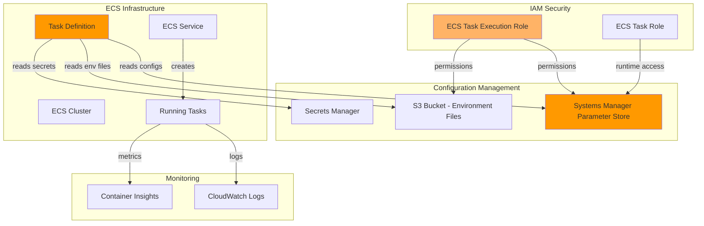

# ECS Task Environment Variable Management

## Problem

Modern containerized applications require robust configuration management to handle environment-specific settings, secrets, and runtime parameters across development, staging, and production environments. DevOps teams struggle with hardcoded configurations, plaintext secrets in container images, and managing multiple environment variables across different deployment stages, leading to security vulnerabilities, maintenance challenges, and inconsistent deployments.

## Solution

This recipe implements a comprehensive environment variable management strategy for Amazon ECS task definitions using AWS Systems Manager Parameter Store for configuration data and AWS Secrets Manager for sensitive information. The solution demonstrates multiple approaches including direct environment variables, Systems Manager Parameter Store integration, and environment files stored in S3, providing secure, scalable, and maintainable configuration management for containerized applications.

## Architecture Diagram



## Prerequisites

1. AWS account with appropriate permissions for ECS, Systems Manager, IAM, and S3
2. AWS CLI v2 installed and configured (or AWS CloudShell)
3. Basic understanding of containerization and Docker
4. Familiarity with AWS IAM policies and roles
5. Estimated cost: $5-15 for ECS tasks, Parameter Store, and S3 storage during testing

> **Note**: This recipe uses Fargate launch type which incurs compute costs. Clean up resources after testing to avoid ongoing charges.

## Preparation

```bash
# Set environment variables
export AWS_REGION=$(aws configure get region)
export AWS_ACCOUNT_ID=$(aws sts get-caller-identity \
    --query Account --output text)

# Generate unique identifiers for resources
RANDOM_SUFFIX=$(aws secretsmanager get-random-password \
    --exclude-punctuation --exclude-uppercase \
    --password-length 6 --require-each-included-type \
    --output text --query RandomPassword)

export CLUSTER_NAME="ecs-envvar-cluster-${RANDOM_SUFFIX}"
export TASK_FAMILY="envvar-demo-task"
export SERVICE_NAME="envvar-demo-service"
export S3_BUCKET="ecs-envvar-configs-${RANDOM_SUFFIX}"
export EXEC_ROLE_NAME="ecsTaskExecutionRole-${RANDOM_SUFFIX}"
export TASK_ROLE_NAME="ecsTaskRole-${RANDOM_SUFFIX}"

# Create ECS cluster
aws ecs create-cluster \
    --cluster-name ${CLUSTER_NAME} \
    --capacity-providers FARGATE \
    --default-capacity-provider-strategy \
    capacityProvider=FARGATE,weight=1

# Create S3 bucket for environment files
aws s3 mb s3://${S3_BUCKET}

echo "✅ Created ECS cluster: ${CLUSTER_NAME}"
echo "✅ Created S3 bucket: ${S3_BUCKET}"
```

## Steps

1. **Create Systems Manager Parameters for Configuration Management**:

   Amazon ECS supports multiple methods for injecting configuration data into containers, with Systems Manager Parameter Store providing the most secure and flexible approach. Parameter Store enables hierarchical organization of configuration data while supporting both plaintext and encrypted parameters, essential for maintaining security boundaries between environments and protecting sensitive information.

   ```bash
   # Create hierarchical parameters for different environments
   aws ssm put-parameter \
       --name "/myapp/dev/database/host" \
       --value "dev-database.internal.com" \
       --type "String" \
       --description "Development database host"
   
   aws ssm put-parameter \
       --name "/myapp/dev/database/port" \
       --value "5432" \
       --type "String" \
       --description "Development database port"
   
   aws ssm put-parameter \
       --name "/myapp/dev/api/debug" \
       --value "true" \
       --type "String" \
       --description "Development API debug mode"
   
   # Create secure parameters for sensitive data
   aws ssm put-parameter \
       --name "/myapp/dev/database/password" \
       --value "dev-secure-password-123" \
       --type "SecureString" \
       --description "Development database password"
   
   aws ssm put-parameter \
       --name "/myapp/dev/api/secret-key" \
       --value "dev-api-secret-key-456" \
       --type "SecureString" \
       --description "Development API secret key"
   
   echo "✅ Created Systems Manager parameters for configuration management"
   ```

   The hierarchical parameter structure `/myapp/environment/component/setting` enables logical organization and environment-specific overrides. SecureString parameters are automatically encrypted using AWS KMS, ensuring sensitive data remains protected both at rest and in transit.

2. **Create Environment Files in S3**:

   Environment files provide an efficient method for batch configuration loading, particularly useful for applications with numerous configuration variables or when migrating from traditional file-based configuration management. This approach reduces the number of individual parameter references in task definitions while maintaining version control and access security.

   ```bash
   # Create environment file for batch configuration
   cat > /tmp/app-config.env << EOF
   LOG_LEVEL=info
   MAX_CONNECTIONS=100
   TIMEOUT_SECONDS=30
   FEATURE_FLAGS=auth,logging,metrics
   APP_VERSION=1.2.3
   EOF
   
   # Upload environment file to S3
   aws s3 cp /tmp/app-config.env s3://${S3_BUCKET}/configs/
   
   # Create production-like environment file
   cat > /tmp/prod-config.env << EOF
   LOG_LEVEL=warn
   MAX_CONNECTIONS=500
   TIMEOUT_SECONDS=60
   FEATURE_FLAGS=auth,logging,metrics,cache
   APP_VERSION=1.2.3
   MONITORING_ENABLED=true
   EOF
   
   aws s3 cp /tmp/prod-config.env s3://${S3_BUCKET}/configs/
   
   echo "✅ Created and uploaded environment files to S3"
   ```

   S3-based environment files support versioning and can be managed through CI/CD pipelines, enabling automated configuration deployment and rollback capabilities for production environments.

3. **Create IAM Roles with Proper Permissions**:

   ECS task execution requires specific IAM roles to access AWS services securely. The task execution role enables ECS to pull container images and publish logs, while also providing access to Systems Manager Parameter Store and S3 for configuration data. This separation of concerns follows AWS security best practices by implementing least privilege access controls.

   ```bash
   # Create ECS task execution role trust policy
   cat > /tmp/ecs-execution-trust-policy.json << EOF
   {
       "Version": "2012-10-17",
       "Statement": [
           {
               "Effect": "Allow",
               "Principal": {
                   "Service": "ecs-tasks.amazonaws.com"
               },
               "Action": "sts:AssumeRole"
           }
       ]
   }
   EOF
   
   # Create ECS task execution role
   aws iam create-role \
       --role-name ${EXEC_ROLE_NAME} \
       --assume-role-policy-document file:///tmp/ecs-execution-trust-policy.json
   
   # Attach AWS managed policy for ECS task execution
   aws iam attach-role-policy \
       --role-name ${EXEC_ROLE_NAME} \
       --policy-arn arn:aws:iam::aws:policy/service-role/AmazonECSTaskExecutionRolePolicy
   
   # Create custom policy for Systems Manager and S3 access
   cat > /tmp/parameter-store-policy.json << EOF
   {
       "Version": "2012-10-17",
       "Statement": [
           {
               "Effect": "Allow",
               "Action": [
                   "ssm:GetParameters",
                   "ssm:GetParameter",
                   "ssm:GetParametersByPath"
               ],
               "Resource": [
                   "arn:aws:ssm:${AWS_REGION}:${AWS_ACCOUNT_ID}:parameter/myapp/*"
               ]
           },
           {
               "Effect": "Allow",
               "Action": [
                   "s3:GetObject"
               ],
               "Resource": [
                   "arn:aws:s3:::${S3_BUCKET}/configs/*"
               ]
           }
       ]
   }
   EOF
   
   # Create and attach the parameter store policy
   aws iam create-policy \
       --policy-name "ParameterStoreAccess-${RANDOM_SUFFIX}" \
       --policy-document file:///tmp/parameter-store-policy.json
   
   aws iam attach-role-policy \
       --role-name ${EXEC_ROLE_NAME} \
       --policy-arn "arn:aws:iam::${AWS_ACCOUNT_ID}:policy/ParameterStoreAccess-${RANDOM_SUFFIX}"
   
   echo "✅ Created IAM roles with Systems Manager and S3 permissions"
   ```

   The custom IAM policy restricts access to specific parameter hierarchies and S3 paths, ensuring containers can only access their designated configuration data. This granular permission model enables secure multi-tenant configurations within the same AWS account.

4. **Create ECS Task Definition with Multiple Environment Variable Sources**:

   ECS task definitions support three primary methods for injecting environment variables: direct environment variables, Systems Manager Parameter Store secrets, and environment files from S3. Each method serves different use cases and security requirements, with the ability to combine multiple approaches within a single task definition for comprehensive configuration management.

   ```bash
   # Create comprehensive task definition with multiple environment variable strategies
   cat > /tmp/task-definition.json << EOF
   {
       "family": "${TASK_FAMILY}",
       "networkMode": "awsvpc",
       "requiresCompatibilities": ["FARGATE"],
       "cpu": "256",
       "memory": "512",
       "executionRoleArn": "arn:aws:iam::${AWS_ACCOUNT_ID}:role/${EXEC_ROLE_NAME}",
       "containerDefinitions": [
           {
               "name": "app-container",
               "image": "nginx:latest",
               "essential": true,
               "portMappings": [
                   {
                       "containerPort": 80,
                       "protocol": "tcp"
                   }
               ],
               "environment": [
                   {
                       "name": "NODE_ENV",
                       "value": "development"
                   },
                   {
                       "name": "SERVICE_NAME",
                       "value": "envvar-demo-service"
                   },
                   {
                       "name": "CLUSTER_NAME",
                       "value": "${CLUSTER_NAME}"
                   }
               ],
               "secrets": [
                   {
                       "name": "DATABASE_HOST",
                       "valueFrom": "/myapp/dev/database/host"
                   },
                   {
                       "name": "DATABASE_PORT",
                       "valueFrom": "/myapp/dev/database/port"
                   },
                   {
                       "name": "DATABASE_PASSWORD",
                       "valueFrom": "/myapp/dev/database/password"
                   },
                   {
                       "name": "API_SECRET_KEY",
                       "valueFrom": "/myapp/dev/api/secret-key"
                   },
                   {
                       "name": "API_DEBUG",
                       "valueFrom": "/myapp/dev/api/debug"
                   }
               ],
               "environmentFiles": [
                   {
                       "value": "arn:aws:s3:::${S3_BUCKET}/configs/app-config.env",
                       "type": "s3"
                   }
               ],
               "logConfiguration": {
                   "logDriver": "awslogs",
                   "options": {
                       "awslogs-group": "/ecs/${TASK_FAMILY}",
                       "awslogs-region": "${AWS_REGION}",
                       "awslogs-stream-prefix": "ecs",
                       "awslogs-create-group": "true"
                   }
               }
           }
       ]
   }
   EOF
   
   # Register the task definition
   aws ecs register-task-definition \
       --cli-input-json file:///tmp/task-definition.json
   
   echo "✅ Registered ECS task definition with multiple environment variable sources"
   ```

   This task definition demonstrates the priority order for environment variable resolution: environment files are processed first, then secrets from Parameter Store, and finally direct environment variables. This hierarchy enables flexible configuration overrides while maintaining security boundaries.

5. **Create ECS Service with Environment Variable Configuration**:

   ECS services provide orchestration for running tasks with desired capacity and health monitoring. The service configuration integrates with the task definition's environment variable management, ensuring containers receive proper configuration data during startup and maintaining consistent configuration across service updates.

   ```bash
   # Get default VPC and subnets
   DEFAULT_VPC=$(aws ec2 describe-vpcs \
       --filters "Name=isDefault,Values=true" \
       --query 'Vpcs[0].VpcId' --output text)
   
   DEFAULT_SUBNET=$(aws ec2 describe-subnets \
       --filters "Name=vpc-id,Values=${DEFAULT_VPC}" \
       --query 'Subnets[0].SubnetId' --output text)
   
   DEFAULT_SG=$(aws ec2 describe-security-groups \
       --filters "Name=vpc-id,Values=${DEFAULT_VPC}" \
       "Name=group-name,Values=default" \
       --query 'SecurityGroups[0].GroupId' --output text)
   
   # Create ECS service
   aws ecs create-service \
       --cluster ${CLUSTER_NAME} \
       --service-name ${SERVICE_NAME} \
       --task-definition ${TASK_FAMILY} \
       --desired-count 1 \
       --launch-type FARGATE \
       --network-configuration "awsvpcConfiguration={subnets=[${DEFAULT_SUBNET}],securityGroups=[${DEFAULT_SG}],assignPublicIp=ENABLED}"
   
   echo "✅ Created ECS service with environment variable configuration"
   ```

   The service now manages container lifecycle with integrated configuration management, automatically injecting environment variables during task startup and maintaining consistency across deployments and scaling events.

6. **Create Alternative Task Definition with Environment Files**:

   Environment files offer an alternative configuration approach that's particularly valuable for applications with extensive configuration requirements or when migrating from traditional deployment methods. This approach centralizes configuration management in S3 while maintaining the flexibility to combine multiple environment files for different configuration domains.

   ```bash
   # Create a second task definition focusing on environment files
   cat > /tmp/task-definition-envfiles.json << EOF
   {
       "family": "${TASK_FAMILY}-envfiles",
       "networkMode": "awsvpc",
       "requiresCompatibilities": ["FARGATE"],
       "cpu": "256",
       "memory": "512",
       "executionRoleArn": "arn:aws:iam::${AWS_ACCOUNT_ID}:role/${EXEC_ROLE_NAME}",
       "containerDefinitions": [
           {
               "name": "app-container",
               "image": "nginx:latest",
               "essential": true,
               "portMappings": [
                   {
                       "containerPort": 80,
                       "protocol": "tcp"
                   }
               ],
               "environment": [
                   {
                       "name": "DEPLOYMENT_TYPE",
                       "value": "environment-files"
                   }
               ],
               "environmentFiles": [
                   {
                       "value": "arn:aws:s3:::${S3_BUCKET}/configs/app-config.env",
                       "type": "s3"
                   },
                   {
                       "value": "arn:aws:s3:::${S3_BUCKET}/configs/prod-config.env",
                       "type": "s3"
                   }
               ],
               "logConfiguration": {
                   "logDriver": "awslogs",
                   "options": {
                       "awslogs-group": "/ecs/${TASK_FAMILY}-envfiles",
                       "awslogs-region": "${AWS_REGION}",
                       "awslogs-stream-prefix": "ecs",
                       "awslogs-create-group": "true"
                   }
               }
           }
       ]
   }
   EOF
   
   # Register the environment files focused task definition
   aws ecs register-task-definition \
       --cli-input-json file:///tmp/task-definition-envfiles.json
   
   echo "✅ Created alternative task definition focused on environment files"
   ```

   Multiple environment files are processed in order, with later files overriding earlier ones for duplicate keys. This enables layered configuration strategies such as base configuration plus environment-specific overrides.

7. **Demonstrate Parameter Store Hierarchy Management**:

   Parameter Store's hierarchical structure enables sophisticated configuration management across multiple environments and application components. The hierarchy supports both environment separation and shared configuration patterns, essential for enterprise-scale application deployment strategies.

   ```bash
   # Create production parameters to demonstrate environment separation
   aws ssm put-parameter \
       --name "/myapp/prod/database/host" \
       --value "prod-database.internal.com" \
       --type "String" \
       --description "Production database host"
   
   aws ssm put-parameter \
       --name "/myapp/prod/database/port" \
       --value "5432" \
       --type "String" \
       --description "Production database port"
   
   aws ssm put-parameter \
       --name "/myapp/prod/api/debug" \
       --value "false" \
       --type "String" \
       --description "Production API debug mode"
   
   # Create parameters with different access patterns
   aws ssm put-parameter \
       --name "/myapp/shared/region" \
       --value "${AWS_REGION}" \
       --type "String" \
       --description "Shared region parameter"
   
   aws ssm put-parameter \
       --name "/myapp/shared/account-id" \
       --value "${AWS_ACCOUNT_ID}" \
       --type "String" \
       --description "Shared account ID parameter"
   
   echo "✅ Created hierarchical parameter structure for multi-environment management"
   ```

   The hierarchical structure enables environment-specific configuration while supporting shared parameters that apply across all environments. This pattern reduces configuration duplication and ensures consistency for cross-environment settings.

8. **Test Environment Variable Inheritance and Precedence**:

   Understanding environment variable precedence is crucial for production deployments where multiple configuration sources may define overlapping settings. ECS processes environment sources in a specific order, and testing this behavior ensures predictable configuration resolution in production scenarios.

   ```bash
   # Run a task to test environment variable loading
   TASK_ARN=$(aws ecs run-task \
       --cluster ${CLUSTER_NAME} \
       --task-definition ${TASK_FAMILY} \
       --launch-type FARGATE \
       --network-configuration "awsvpcConfiguration={subnets=[${DEFAULT_SUBNET}],securityGroups=[${DEFAULT_SG}],assignPublicIp=ENABLED}" \
       --query 'tasks[0].taskArn' --output text)
   
   echo "✅ Started test task: ${TASK_ARN}"
   
   # Wait for task to reach running state
   aws ecs wait tasks-running \
       --cluster ${CLUSTER_NAME} \
       --tasks ${TASK_ARN}
   
   echo "✅ Task is now running and has loaded environment variables"
   ```

   The task is now operational with fully integrated configuration management. Container applications can access environment variables through standard system calls, with ECS handling the secure retrieval and injection of configuration data during container startup.

9. **Create Advanced Environment Parameter Management**:

   Advanced parameter management involves creating helper scripts and automation for managing configuration across multiple environments. This approach scales configuration management for enterprise applications with complex deployment requirements and multiple stakeholders.

   ```bash
   # Create a script to manage environment-specific parameters
   cat > /tmp/manage-env-params.sh << 'EOF'
   #!/bin/bash
   
   ENV=$1
   ACTION=$2
   
   if [ "$ACTION" = "list" ]; then
       echo "Parameters for environment: $ENV"
       aws ssm get-parameters-by-path \
           --path "/myapp/$ENV" \
           --recursive \
           --query 'Parameters[*].[Name,Value,Type]' \
           --output table
   elif [ "$ACTION" = "create-batch" ]; then
       echo "Creating batch parameters for environment: $ENV"
       aws ssm put-parameter \
           --name "/myapp/$ENV/batch/max-jobs" \
           --value "10" \
           --type "String" \
           --description "$ENV batch max jobs"
       
       aws ssm put-parameter \
           --name "/myapp/$ENV/batch/timeout" \
           --value "3600" \
           --type "String" \
           --description "$ENV batch timeout in seconds"
   fi
   EOF
   
   chmod +x /tmp/manage-env-params.sh
   
   # Use the script to manage parameters
   /tmp/manage-env-params.sh dev list
   /tmp/manage-env-params.sh dev create-batch
   /tmp/manage-env-params.sh prod create-batch
   
   echo "✅ Implemented environment-specific parameter management"
   ```

   This automation approach enables consistent parameter management across environments while providing tools for operations teams to manage configuration changes safely and efficiently.

## Validation & Testing

1. **Verify ECS Service and Task Status**:

   ```bash
   # Check service status
   aws ecs describe-services \
       --cluster ${CLUSTER_NAME} \
       --services ${SERVICE_NAME} \
       --query 'services[0].{Name:serviceName,Status:status,Running:runningCount,Desired:desiredCount}'
   ```

   Expected output: Service should show ACTIVE status with desired count matching running count.

2. **Test Parameter Store Access**:

   ```bash
   # List all parameters created for the application
   aws ssm get-parameters-by-path \
       --path "/myapp" \
       --recursive \
       --query 'Parameters[*].Name' \
       --output table
   ```

   Expected output: Table showing all created parameters with hierarchical structure.

3. **Verify Environment File Access**:

   ```bash
   # Check S3 bucket contents
   aws s3 ls s3://${S3_BUCKET}/configs/ --recursive
   
   # Test environment file content
   aws s3 cp s3://${S3_BUCKET}/configs/app-config.env /tmp/test-config.env
   cat /tmp/test-config.env
   ```

4. **Test Task Definition Retrieval**:

   ```bash
   # Verify task definition with environment variables
   aws ecs describe-task-definition \
       --task-definition ${TASK_FAMILY} \
       --query 'taskDefinition.containerDefinitions[0].{Environment:environment,Secrets:secrets,EnvironmentFiles:environmentFiles}'
   ```

5. **Monitor Task Logs for Environment Variable Loading**:

   ```bash
   # Get log group name and check logs
   LOG_GROUP="/ecs/${TASK_FAMILY}"
   
   # List recent log streams
   aws logs describe-log-streams \
       --log-group-name ${LOG_GROUP} \
       --order-by LastEventTime \
       --descending \
       --max-items 3 \
       --query 'logStreams[*].logStreamName'
   ```

## Cleanup

1. **Stop ECS Service and Tasks**:

   ```bash
   # Update service to zero desired count
   aws ecs update-service \
       --cluster ${CLUSTER_NAME} \
       --service ${SERVICE_NAME} \
       --desired-count 0
   
   # Delete the service
   aws ecs delete-service \
       --cluster ${CLUSTER_NAME} \
       --service ${SERVICE_NAME}
   
   echo "✅ Deleted ECS service"
   ```

2. **Delete Task Definitions**:

   ```bash
   # Deregister task definitions
   aws ecs deregister-task-definition \
       --task-definition ${TASK_FAMILY}:1
   
   aws ecs deregister-task-definition \
       --task-definition ${TASK_FAMILY}-envfiles:1
   
   echo "✅ Deregistered task definitions"
   ```

3. **Delete ECS Cluster**:

   ```bash
   # Delete the cluster
   aws ecs delete-cluster \
       --cluster ${CLUSTER_NAME}
   
   echo "✅ Deleted ECS cluster"
   ```

4. **Remove Systems Manager Parameters**:

   ```bash
   # Delete all application parameters
   aws ssm delete-parameters \
       --names $(aws ssm get-parameters-by-path \
           --path "/myapp" \
           --recursive \
           --query 'Parameters[*].Name' \
           --output text)
   
   echo "✅ Deleted Systems Manager parameters"
   ```

5. **Remove S3 Bucket and IAM Resources**:

   ```bash
   # Delete S3 bucket contents and bucket
   aws s3 rm s3://${S3_BUCKET} --recursive
   aws s3 rb s3://${S3_BUCKET}
   
   # Delete IAM policy and role
   aws iam detach-role-policy \
       --role-name ${EXEC_ROLE_NAME} \
       --policy-arn arn:aws:iam::aws:policy/service-role/AmazonECSTaskExecutionRolePolicy
   
   aws iam detach-role-policy \
       --role-name ${EXEC_ROLE_NAME} \
       --policy-arn "arn:aws:iam::${AWS_ACCOUNT_ID}:policy/ParameterStoreAccess-${RANDOM_SUFFIX}"
   
   aws iam delete-policy \
       --policy-arn "arn:aws:iam::${AWS_ACCOUNT_ID}:policy/ParameterStoreAccess-${RANDOM_SUFFIX}"
   
   aws iam delete-role \
       --role-name ${EXEC_ROLE_NAME}
   
   echo "✅ Deleted S3 bucket and IAM resources"
   ```

6. **Clean Up Local Files**:

   ```bash
   # Remove temporary files
   rm -f /tmp/task-definition*.json
   rm -f /tmp/ecs-execution-trust-policy.json
   rm -f /tmp/parameter-store-policy.json
   rm -f /tmp/*-config.env
   rm -f /tmp/manage-env-params.sh
   rm -f /tmp/test-config.env
   
   echo "✅ Cleaned up temporary files"
   ```

## Discussion

This recipe demonstrates comprehensive environment variable management for Amazon ECS task definitions, showcasing three primary approaches: direct environment variables, AWS Systems Manager Parameter Store integration, and environment files stored in S3. Each approach serves different use cases in containerized application deployment strategies, with the flexibility to combine multiple methods for optimal configuration management.

The Systems Manager Parameter Store integration provides hierarchical organization of configuration data, supporting both plain text and encrypted parameters. This approach enables centralized configuration management across multiple environments while maintaining security through encryption and IAM-based access controls. The hierarchical structure (`/myapp/environment/component/parameter`) allows for logical organization and environment-specific overrides, making it ideal for complex applications with multiple deployment stages. For detailed implementation guidance, refer to the [AWS Systems Manager Parameter Store documentation](https://docs.aws.amazon.com/systems-manager/latest/userguide/systems-manager-parameter-store.html).

Environment files stored in S3 offer batch configuration loading, reducing the number of individual parameter references in task definitions. This approach is particularly useful for applications with numerous configuration variables or when migrating from traditional configuration file-based deployments. The combination of S3 versioning and IAM policies ensures configuration integrity and access control, as detailed in the [ECS environment files documentation](https://docs.aws.amazon.com/AmazonECS/latest/developerguide/use-environment-file.html).

The recipe emphasizes security best practices by using IAM roles with least privilege access, encrypting sensitive parameters, and avoiding hardcoded secrets in container images. The [ECS task execution role pattern](https://docs.aws.amazon.com/AmazonECS/latest/developerguide/task_execution_IAM_role.html) separates container runtime permissions from configuration access permissions, following AWS security recommendations. For production deployments, consider implementing parameter validation, configuration drift detection, and automated rollback mechanisms for configuration changes.

> **Warning**: Always use SecureString parameters for sensitive data like passwords and API keys to ensure encryption at rest and in transit.

> **Tip**: Implement parameter hierarchies like `/app/environment/component/setting` to organize configurations logically and enable environment-specific overrides. This pattern scales effectively for enterprise applications with complex deployment requirements.

## Challenge

Extend this solution by implementing these enhancements:

1. **Parameter Validation and Versioning**: Implement parameter validation using AWS Config rules and create a versioning strategy for parameter changes with rollback capabilities.

2. **Multi-Environment Deployment Pipeline**: Create a CI/CD pipeline that automatically promotes configuration changes through development, staging, and production environments with approval gates.

3. **Dynamic Configuration Updates**: Implement a Lambda function that monitors parameter changes and triggers ECS service updates to reload configurations without manual intervention.

4. **Configuration Drift Detection**: Build a monitoring solution using CloudWatch and Lambda to detect and alert on configuration drift between environments or unauthorized parameter changes.

5. **Advanced Secrets Management**: Integrate with AWS Secrets Manager for automatic secret rotation and implement cross-region secret replication for disaster recovery scenarios.

## Infrastructure Code

*Infrastructure code will be generated after recipe approval.*