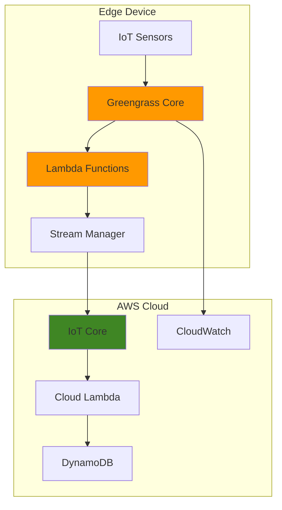

# Edge Computing with IoT Greengrass and Lambda

## Problem

Manufacturing companies struggle with latency-sensitive industrial processes that require real-time data processing and decision-making at the edge. Traditional cloud-only architectures introduce network latency that can disrupt critical operations, while complete offline systems lack the benefits of cloud analytics and remote management capabilities.

## Solution

AWS IoT Greengrass enables hybrid edge-cloud architectures by extending AWS services to edge devices, allowing local processing while maintaining cloud connectivity. This solution combines IoT Core for device management, Greengrass for edge runtime, and Lambda for local compute to create resilient, low-latency industrial applications.

## Architecture Diagram



## Prerequisites

1. AWS account with permissions for IoT Core, Greengrass, Lambda, and IAM
2. Ubuntu 18.04+ or Amazon Linux 2 device for Greengrass Core (minimum 1GB RAM, 1GB storage)
3. AWS CLI v2 installed and configured
4. Java runtime (OpenJDK 11 or Amazon Corretto 11+) installed on edge device
5. Basic knowledge of IoT concepts and Lambda functions
6. Estimated cost: $5-10 per month for testing (device messaging, Lambda execution)

> **Note**: This recipe uses AWS IoT Greengrass V2, which provides improved performance and simplified deployment compared to V1. See [AWS IoT Greengrass V2 documentation](https://docs.aws.amazon.com/greengrass/v2/developerguide/what-is-iot-greengrass.html) for detailed service information.

## Preparation

```bash
# Set environment variables
export AWS_REGION=$(aws configure get region)
export AWS_ACCOUNT_ID=$(aws sts get-caller-identity \
    --query Account --output text)

# Generate unique identifiers for resources
RANDOM_SUFFIX=$(aws secretsmanager get-random-password \
    --exclude-punctuation --exclude-uppercase \
    --password-length 6 --require-each-included-type \
    --output text --query RandomPassword)

export THING_NAME="greengrass-core-${RANDOM_SUFFIX}"
export THING_GROUP_NAME="greengrass-things-${RANDOM_SUFFIX}"
export CORE_DEVICE_NAME="greengrass-core-${RANDOM_SUFFIX}"

echo "Environment configured for Greengrass deployment"
echo "Core device name: ${CORE_DEVICE_NAME}"
```

## Steps

1. **Create IoT Thing and Certificate for Greengrass Core**:

   AWS IoT Core manages device identities through "Things" - digital representations of physical devices. Each Thing requires X.509 certificates for secure authentication, enabling encrypted communication between edge devices and AWS services. This identity foundation is essential for Greengrass security and device management.

   ```bash
   # Create IoT Thing for Greengrass Core
   aws iot create-thing --thing-name ${THING_NAME}
   
   # Create certificate and keys for device authentication
   CERT_OUTPUT=$(aws iot create-keys-and-certificate \
       --set-as-active \
       --certificate-pem-outfile "${THING_NAME}.cert.pem" \
       --public-key-outfile "${THING_NAME}.public.key" \
       --private-key-outfile "${THING_NAME}.private.key" \
       --output json)
   
   # Extract certificate ARN and ID
   CERT_ARN=$(echo $CERT_OUTPUT | jq -r '.certificateArn')
   CERT_ID=$(echo $CERT_OUTPUT | jq -r '.certificateId')
   
   echo "✅ IoT Thing created: ${THING_NAME}"
   echo "✅ Certificate created: ${CERT_ID}"
   ```

   The IoT Thing now exists with a unique identity in AWS IoT Core, and the X.509 certificate enables secure communication. This establishes the security foundation required for Greengrass Core operation and cloud connectivity.

2. **Create and Attach IoT Policy for Greengrass Permissions**:

   IoT policies define the specific AWS IoT actions that devices can perform, implementing the principle of least privilege. Greengrass Core requires comprehensive permissions for device management, message routing, and cloud synchronization to function as an edge computing platform.

   ```bash
   # Create IoT policy with Greengrass Core permissions
   cat > greengrass-policy.json << 'EOF'
   {
       "Version": "2012-10-17",
       "Statement": [
           {
               "Effect": "Allow",
               "Action": [
                   "iot:Publish",
                   "iot:Subscribe",
                   "iot:Receive",
                   "iot:Connect"
               ],
               "Resource": "*"
           },
           {
               "Effect": "Allow",
               "Action": [
                   "iot:GetThingShadow",
                   "iot:UpdateThingShadow",
                   "iot:DeleteThingShadow"
               ],
               "Resource": "*"
           },
           {
               "Effect": "Allow",
               "Action": [
                   "greengrass:*"
               ],
               "Resource": "*"
           }
       ]
   }
   EOF
   
   # Create and attach the policy
   aws iot create-policy \
       --policy-name "greengrass-policy-${RANDOM_SUFFIX}" \
       --policy-document file://greengrass-policy.json
   
   aws iot attach-policy \
       --policy-name "greengrass-policy-${RANDOM_SUFFIX}" \
       --target ${CERT_ARN}
   
   # Attach certificate to Thing
   aws iot attach-thing-principal \
       --thing-name ${THING_NAME} \
       --principal ${CERT_ARN}
   
   echo "✅ IoT policy created and attached"
   ```

   The policy is now attached to the certificate, granting the Greengrass Core the necessary permissions to communicate with AWS IoT services and manage edge computing workloads.

3. **Create Thing Group for Device Management**:

   Thing Groups enable centralized management of multiple IoT devices, allowing batch operations and hierarchical organization. For Greengrass deployments, Thing Groups facilitate component deployment and configuration management across device fleets.

   ```bash
   # Create Thing Group for Greengrass devices
   aws iot create-thing-group \
       --thing-group-name ${THING_GROUP_NAME} \
       --thing-group-properties '{
           "thingGroupDescription": "Greengrass core devices group",
           "attributePayload": {
               "attributes": {
                   "environment": "development",
                   "purpose": "edge-computing"
               }
           }
       }'
   
   # Add Thing to the group
   aws iot add-thing-to-thing-group \
       --thing-group-name ${THING_GROUP_NAME} \
       --thing-name ${THING_NAME}
   
   echo "✅ Thing Group created: ${THING_GROUP_NAME}"
   ```

   The Thing Group now provides a management layer for organizing and deploying configurations to multiple Greengrass devices, enabling scalable fleet management.

4. **Create IAM Role for Greengrass Core Device**:

   Greengrass Core requires an IAM role to access AWS services on behalf of edge applications. This role enables secure interaction with services like Lambda, IoT Core, and CloudWatch while maintaining proper access controls for edge computing workloads.

   ```bash
   # Create trust policy for Greengrass
   cat > greengrass-trust-policy.json << 'EOF'
   {
       "Version": "2012-10-17",
       "Statement": [
           {
               "Effect": "Allow",
               "Principal": {
                   "Service": "credentials.iot.amazonaws.com"
               },
               "Action": "sts:AssumeRole"
           }
       ]
   }
   EOF
   
   # Create IAM role for Greengrass Core
   aws iam create-role \
       --role-name "greengrass-core-role-${RANDOM_SUFFIX}" \
       --assume-role-policy-document file://greengrass-trust-policy.json
   
   # Attach required policies
   aws iam attach-role-policy \
       --role-name "greengrass-core-role-${RANDOM_SUFFIX}" \
       --policy-arn arn:aws:iam::aws:policy/service-role/AWSGreengrassResourceAccessRolePolicy
   
   # Create role alias for token exchange
   aws iot create-role-alias \
       --role-alias "greengrass-role-alias-${RANDOM_SUFFIX}" \
       --role-arn "arn:aws:iam::${AWS_ACCOUNT_ID}:role/greengrass-core-role-${RANDOM_SUFFIX}"
   
   echo "✅ IAM role and role alias created for Greengrass Core"
   ```

   The IAM role now provides the necessary AWS service permissions for Greengrass Core operations while maintaining security through role-based access control.

5. **Create Lambda Function for Edge Processing**:

   Lambda functions in Greengrass execute locally on edge devices, enabling real-time processing without cloud roundtrips. This serverless approach provides automatic scaling and simplified deployment while maintaining consistent programming models between edge and cloud.

   ```bash
   # Create Lambda function package
   mkdir -p lambda-edge-function
   cat > lambda-edge-function/lambda_function.py << 'EOF'
   import json
   import logging
   import time
   import os
   
   logger = logging.getLogger()
   logger.setLevel(logging.INFO)
   
   def lambda_handler(event, context):
       """
       Process sensor data at the edge
       """
       logger.info(f"Processing edge data: {event}")
       
       # Simulate sensor data processing
       processed_data = {
           "timestamp": int(time.time()),
           "device_id": event.get("device_id", "unknown"),
           "temperature": event.get("temperature", 0),
           "status": "processed_at_edge",
           "processing_time": 0.1,
           "location": os.environ.get("DEVICE_LOCATION", "edge")
       }
       
       # Basic threshold check
       if processed_data["temperature"] > 30:
           processed_data["alert"] = "High temperature detected"
       
       return {
           "statusCode": 200,
           "body": json.dumps(processed_data)
       }
   EOF
   
   # Create deployment package
   cd lambda-edge-function
   zip -r ../edge-processor.zip .
   cd ..
   
   # Create Lambda function
   aws lambda create-function \
       --function-name "edge-processor-${RANDOM_SUFFIX}" \
       --runtime python3.9 \
       --role "arn:aws:iam::${AWS_ACCOUNT_ID}:role/greengrass-core-role-${RANDOM_SUFFIX}" \
       --handler lambda_function.lambda_handler \
       --zip-file fileb://edge-processor.zip \
       --timeout 30 \
       --memory-size 128 \
       --environment "Variables={DEVICE_LOCATION=edge-device}"
   
   echo "✅ Lambda function created for edge processing"
   ```

   The Lambda function is now ready for deployment to Greengrass Core, providing local processing capabilities that can operate independently of cloud connectivity.

6. **Download and Install Greengrass Core Software**:

   The Greengrass Core software transforms edge devices into AWS-managed compute environments. The latest installation method uses the automatic provisioning installer that simplifies the setup process by creating required AWS resources automatically.

   ```bash
   # Download Greengrass Core V2 installer
   curl -s https://d2s8p88vqu9w66.cloudfront.net/releases/greengrass-nucleus-latest.zip \
       -o greengrass-nucleus-latest.zip
   
   # Extract the installer
   unzip greengrass-nucleus-latest.zip -d GreengrassInstaller
   
   # Install Greengrass Core with automatic provisioning
   sudo -E java -Droot="/greengrass/v2" \
       -Dlog.store=FILE \
       -jar ./GreengrassInstaller/lib/Greengrass.jar \
       --aws-region ${AWS_REGION} \
       --thing-name ${THING_NAME} \
       --thing-group-name ${THING_GROUP_NAME} \
       --thing-policy-name "greengrass-policy-${RANDOM_SUFFIX}" \
       --tes-role-name "greengrass-core-role-${RANDOM_SUFFIX}" \
       --tes-role-alias-name "greengrass-role-alias-${RANDOM_SUFFIX}" \
       --component-default-user ggc_user:ggc_group \
       --provision true \
       --setup-system-service true
   
   echo "✅ Greengrass Core software installed successfully"
   ```

   The Greengrass Core software is now installed and running as a system service with automatic resource provisioning, establishing secure communication with AWS IoT services.

7. **Deploy Lambda Component to Greengrass Core**:

   Component deployment distributes Lambda functions and configurations to edge devices through AWS IoT Greengrass. This managed deployment process ensures consistent application delivery and enables centralized management of edge computing workloads.

   ```bash
   # Create deployment for Lambda function component
   aws greengrassv2 create-deployment \
       --target-arn "arn:aws:iot:${AWS_REGION}:${AWS_ACCOUNT_ID}:thinggroup/${THING_GROUP_NAME}" \
       --deployment-name "edge-processor-deployment-${RANDOM_SUFFIX}" \
       --components '{
           "aws.greengrass.Nucleus": {
               "componentVersion": "2.12.0"
           },
           "aws.greengrass.Cli": {
               "componentVersion": "2.12.0"
           }
       }' \
       --deployment-policies '{
           "failureHandlingPolicy": "ROLLBACK",
           "componentUpdatePolicy": {
               "timeoutInSeconds": 60,
               "action": "NOTIFY_COMPONENTS"
           },
           "configurationValidationPolicy": {
               "timeoutInSeconds": 60
           }
       }'
   
   echo "✅ Lambda component deployment created"
   ```

   The Lambda component deployment is now queued for the Greengrass Core, enabling local execution of edge processing logic with automatic lifecycle management.

8. **Configure Stream Manager for Data Routing**:

   Stream Manager provides reliable data ingestion and routing capabilities for IoT applications. It handles data buffering, batching, and automatic retry logic, ensuring reliable data flow between edge devices and cloud services even during network interruptions.

   ```bash
   # Deploy Stream Manager component
   aws greengrassv2 create-deployment \
       --target-arn "arn:aws:iot:${AWS_REGION}:${AWS_ACCOUNT_ID}:thinggroup/${THING_GROUP_NAME}" \
       --deployment-name "stream-manager-deployment-${RANDOM_SUFFIX}" \
       --components '{
           "aws.greengrass.StreamManager": {
               "componentVersion": "2.1.7",
               "configurationUpdate": {
                   "merge": "{\"STREAM_MANAGER_STORE_ROOT_DIR\":\"/tmp\",\"STREAM_MANAGER_SERVER_PORT\":\"8088\",\"LOG_LEVEL\":\"INFO\"}"
               }
           }
       }' \
       --deployment-policies '{
           "failureHandlingPolicy": "ROLLBACK",
           "componentUpdatePolicy": {
               "timeoutInSeconds": 60,
               "action": "NOTIFY_COMPONENTS"
           },
           "configurationValidationPolicy": {
               "timeoutInSeconds": 60
           }
       }'
   
   # Wait for deployment to complete
   sleep 30
   
   echo "✅ Stream Manager configured for data routing"
   ```

   Stream Manager is now configured to handle sensor data streams with automatic cloud export, providing reliable data pipeline management for IoT applications.

> **Tip**: Monitor Stream Manager performance using CloudWatch metrics to optimize batching and export configurations. See [Stream Manager monitoring](https://docs.aws.amazon.com/greengrass/v2/developerguide/stream-manager-component.html#stream-manager-component-monitoring) for detailed guidance.

## Validation & Testing

1. **Verify Greengrass Core Installation**:

   ```bash
   # Check Greengrass Core service status
   sudo systemctl status greengrass
   
   # Verify core device registration
   aws greengrassv2 list-core-devices \
       --thing-group-arn "arn:aws:iot:${AWS_REGION}:${AWS_ACCOUNT_ID}:thinggroup/${THING_GROUP_NAME}"
   ```

   Expected output: Core device should show "HEALTHY" status

2. **Test Lambda Function Execution**:

   ```bash
   # Invoke cloud Lambda function for testing
   aws lambda invoke \
       --function-name "edge-processor-${RANDOM_SUFFIX}" \
       --payload '{"device_id": "sensor-001", "temperature": 25.5}' \
       response.json
   
   # View response
   cat response.json
   ```

   Expected output: JSON response with processed sensor data including edge processing indicators

3. **Verify Greengrass Components**:

   ```bash
   # List installed components on core device
   aws greengrassv2 list-installed-components \
       --core-device-thing-name ${THING_NAME}
   
   # Check deployment status
   aws greengrassv2 list-deployments \
       --target-arn "arn:aws:iot:${AWS_REGION}:${AWS_ACCOUNT_ID}:thinggroup/${THING_GROUP_NAME}"
   ```

   Expected output: Components should show "RUNNING" or "FINISHED" lifecycle states

4. **Verify Stream Manager Operation**:

   ```bash
   # Check Greengrass logs for Stream Manager
   sudo tail -f /greengrass/v2/logs/aws.greengrass.StreamManager.log
   
   # Verify CloudWatch log groups
   aws logs describe-log-groups \
       --log-group-name-prefix "/aws/greengrass"
   ```

   Expected output: Log entries showing successful stream processing and component startup

## Cleanup

1. **Remove Greengrass Deployments**:

   ```bash
   # List and cancel active deployments
   DEPLOYMENTS=$(aws greengrassv2 list-deployments \
       --target-arn "arn:aws:iot:${AWS_REGION}:${AWS_ACCOUNT_ID}:thinggroup/${THING_GROUP_NAME}" \
       --query 'deployments[?deploymentStatus==`ACTIVE`].deploymentId' \
       --output text)
   
   for deployment in $DEPLOYMENTS; do
       aws greengrassv2 cancel-deployment \
           --deployment-id $deployment
   done
   
   echo "✅ Deployments cancelled"
   ```

2. **Stop and Remove Greengrass Service**:

   ```bash
   # Stop Greengrass service
   sudo systemctl stop greengrass
   
   # Disable service startup
   sudo systemctl disable greengrass
   
   # Remove installation directory
   sudo rm -rf /greengrass/v2
   
   echo "✅ Greengrass service stopped and removed"
   ```

3. **Remove Lambda Function**:

   ```bash
   # Delete Lambda function
   aws lambda delete-function \
       --function-name "edge-processor-${RANDOM_SUFFIX}"
   
   echo "✅ Lambda function deleted"
   ```

4. **Remove IoT Resources**:

   ```bash
   # Detach and delete policy
   aws iot detach-policy \
       --policy-name "greengrass-policy-${RANDOM_SUFFIX}" \
       --target ${CERT_ARN}
   
   aws iot delete-policy \
       --policy-name "greengrass-policy-${RANDOM_SUFFIX}"
   
   # Detach certificate from Thing
   aws iot detach-thing-principal \
       --thing-name ${THING_NAME} \
       --principal ${CERT_ARN}
   
   # Delete certificate
   aws iot update-certificate \
       --certificate-id ${CERT_ID} --new-status INACTIVE
   
   aws iot delete-certificate \
       --certificate-id ${CERT_ID}
   
   # Remove Thing from group and delete
   aws iot remove-thing-from-thing-group \
       --thing-group-name ${THING_GROUP_NAME} \
       --thing-name ${THING_NAME}
   
   aws iot delete-thing --thing-name ${THING_NAME}
   aws iot delete-thing-group --thing-group-name ${THING_GROUP_NAME}
   
   echo "✅ IoT resources deleted"
   ```

5. **Remove IAM Resources**:

   ```bash
   # Delete role alias
   aws iot delete-role-alias \
       --role-alias "greengrass-role-alias-${RANDOM_SUFFIX}"
   
   # Detach policies and delete role
   aws iam detach-role-policy \
       --role-name "greengrass-core-role-${RANDOM_SUFFIX}" \
       --policy-arn arn:aws:iam::aws:policy/service-role/AWSGreengrassResourceAccessRolePolicy
   
   aws iam delete-role \
       --role-name "greengrass-core-role-${RANDOM_SUFFIX}"
   
   # Clean up local files
   rm -f greengrass-*.json *.pem *.key edge-processor.zip
   rm -rf lambda-edge-function GreengrassInstaller
   
   echo "✅ IAM resources and local files cleaned up"
   ```

## Discussion

AWS IoT Greengrass enables powerful edge computing scenarios by extending AWS services to edge devices. The service provides a managed runtime environment that executes Lambda functions locally while maintaining cloud connectivity for management and data synchronization. This hybrid architecture addresses the fundamental challenge of balancing real-time processing requirements with centralized management capabilities.

The architecture demonstrated here showcases key edge computing patterns including local processing, data streaming, and selective cloud synchronization. Stream Manager provides sophisticated data routing capabilities with automatic retry and buffering, ensuring reliable data flow even during network interruptions. The component-based deployment model enables consistent application delivery across device fleets while supporting diverse hardware platforms.

Security considerations are paramount in edge computing deployments. The recipe implements AWS security best practices including certificate-based device authentication, least-privilege IAM roles, and encrypted communication channels. These security measures ensure that edge devices maintain the same security posture as cloud-based applications while operating in potentially untrusted environments. The implementation follows the [AWS Well-Architected Framework](https://docs.aws.amazon.com/wellarchitected/latest/framework/welcome.html) principles for operational excellence and security.

Performance optimization becomes critical in resource-constrained edge environments. Greengrass provides configurable resource limits, component lifecycle management, and selective component deployment to optimize resource utilization. Organizations should monitor device resources and adjust component configurations based on actual workload requirements and hardware capabilities. For production deployments, consider using the automatic installation method which simplifies provisioning and reduces configuration errors.

> **Note**: The automatic provisioning installer used in this recipe significantly reduces setup complexity compared to manual provisioning methods. For production environments, consider using fleet provisioning for large-scale device deployments.

## Challenge

Extend this solution by implementing these enhancements:

1. **Multi-Sensor Data Fusion**: Create Lambda functions that aggregate data from multiple sensor types and apply machine learning models for predictive analytics using SageMaker Neo
2. **Edge-to-Edge Communication**: Implement direct device-to-device messaging using Greengrass local messaging capabilities and MQTT broker components
3. **Offline Operation Mode**: Configure local data storage using SQLite component and processing for extended offline operation with automatic synchronization upon reconnection
4. **Fleet Management Dashboard**: Build a web dashboard using IoT Device Management APIs to monitor and manage multiple Greengrass devices with real-time status updates
5. **Custom Component Development**: Create native Greengrass components for specialized hardware integration or performance-critical applications using the Greengrass Development Kit

## Infrastructure Code

### Available Infrastructure as Code:

- [Infrastructure Code Overview](code/README.md) - Detailed description of all infrastructure components
- [AWS CDK (Python)](code/cdk-python/) - AWS CDK Python implementation
- [AWS CDK (TypeScript)](code/cdk-typescript/) - AWS CDK TypeScript implementation
- [CloudFormation](code/cloudformation.yaml) - AWS CloudFormation template
- [Bash CLI Scripts](code/scripts/) - Example bash scripts using AWS CLI commands to deploy infrastructure
- [Terraform](code/terraform/) - Terraform configuration files