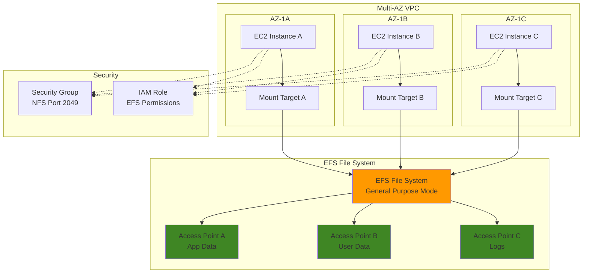

# EFS Mounting Strategies and Optimization

## Problem

Enterprise applications often require shared file systems that can be accessed simultaneously by multiple compute instances across different availability zones. Traditional network-attached storage solutions are complex to manage, don't scale automatically, and require significant upfront provisioning. Organizations struggle with implementing consistent mounting strategies that provide high availability, optimal performance, and proper security controls while maintaining cost efficiency across their distributed computing environments.

## Solution

Amazon EFS provides a fully managed, scalable, and highly available NFS file system that can be mounted across multiple EC2 instances simultaneously. This solution implements comprehensive mounting strategies using EFS performance modes, throughput configurations, and access points to optimize file system access patterns. The approach leverages mount targets in multiple availability zones, security groups for access control, and different mounting methods to achieve enterprise-grade shared storage with automatic scaling and built-in redundancy.

## Architecture Diagram



## Prerequisites

1. AWS account with permissions to create EFS, EC2, VPC, and IAM resources
2. AWS CLI v2 installed and configured (or AWS CloudShell)
3. Basic understanding of NFS, file systems, and Linux mounting concepts
4. Existing VPC with at least two subnets in different availability zones
5. SSH key pair for EC2 instance access
6. Estimated cost: $0.30/GB per month for standard storage + $0.05/GB per month for provisioned throughput

> **Note**: EFS charges are based on storage used and throughput consumed. This recipe creates resources that will incur costs if not cleaned up properly. For detailed pricing information, see the [EFS Pricing Guide](https://docs.aws.amazon.com/efs/latest/ug/how-it-works.html).

## Preparation

```bash
# Set environment variables
export AWS_REGION=$(aws configure get region)
export AWS_ACCOUNT_ID=$(aws sts get-caller-identity \
    --query Account --output text)

# Generate unique identifiers for resources
RANDOM_SUFFIX=$(aws secretsmanager get-random-password \
    --exclude-punctuation --exclude-uppercase \
    --password-length 6 --require-each-included-type \
    --output text --query RandomPassword)

export EFS_NAME="efs-demo-${RANDOM_SUFFIX}"
export VPC_NAME="efs-vpc-${RANDOM_SUFFIX}"
export INSTANCE_NAME="efs-instance-${RANDOM_SUFFIX}"

# Get default VPC ID (or create one if needed)
export VPC_ID=$(aws ec2 describe-vpcs \
    --filters "Name=is-default,Values=true" \
    --query "Vpcs[0].VpcId" --output text)

# Get subnets in different AZs
export SUBNET_IDS=$(aws ec2 describe-subnets \
    --filters "Name=vpc-id,Values=${VPC_ID}" \
    --query "Subnets[*].SubnetId" --output text)

export SUBNET_A=$(echo $SUBNET_IDS | cut -d' ' -f1)
export SUBNET_B=$(echo $SUBNET_IDS | cut -d' ' -f2)
export SUBNET_C=$(echo $SUBNET_IDS | cut -d' ' -f3)

# Get latest Amazon Linux 2023 AMI ID
export AMI_ID=$(aws ec2 describe-images \
    --owners amazon \
    --filters "Name=name,Values=al2023-ami-*-x86_64" \
              "Name=state,Values=available" \
    --query "Images | sort_by(@, &CreationDate) | [-1].ImageId" \
    --output text)

echo "✅ Environment variables configured"
echo "VPC ID: ${VPC_ID}"
echo "Subnets: ${SUBNET_A}, ${SUBNET_B}, ${SUBNET_C}"
```

## Steps

1. **Create EFS File System with General Purpose Performance Mode**:

   Amazon EFS provides a fully managed, scalable NFS file system that delivers consistent performance across multiple compute instances. The General Purpose performance mode offers the lowest latency per operation and supports up to 7,000 file operations per second, making it ideal for most use cases. Enabling encryption at rest protects your data using AWS-managed keys without impacting performance, while provisioned throughput mode ensures predictable performance regardless of stored data size. For detailed performance specifications, see the [Amazon EFS Performance Guide](https://docs.aws.amazon.com/efs/latest/ug/performance.html).

   ```bash
   # Create EFS file system with optimal settings
   export EFS_ID=$(aws efs create-file-system \
       --performance-mode generalPurpose \
       --throughput-mode provisioned \
       --provisioned-throughput-in-mibps 100 \
       --encrypted \
       --tags Key=Name,Value=${EFS_NAME} \
       --query "FileSystemId" --output text)
   
   # Wait for file system to become available
   aws efs wait file-system-available \
       --file-system-id ${EFS_ID}
   
   echo "✅ EFS file system created: ${EFS_ID}"
   ```

   The EFS file system is now provisioned with enterprise-grade durability (99.999999999% or 11 9's) and ready for multi-AZ deployment. This foundational storage layer will support concurrent access from multiple EC2 instances while automatically scaling from gigabytes to petabytes without manual intervention.

2. **Create Security Group for EFS Access**:

   Security groups act as virtual firewalls controlling network access to EFS mount targets. NFS protocol uses port 2049 for communication, and restricting access to only your VPC CIDR block follows the principle of least privilege. This network-level security ensures that only resources within your trusted network can access the file system, providing an essential security boundary for your shared storage infrastructure. For detailed security group management, see the [EFS Security Groups Guide](https://docs.aws.amazon.com/efs/latest/ug/manage-fs-access-update-mount-target-config-sg.html).

   ```bash
   # Create security group for EFS mount targets
   export SG_ID=$(aws ec2 create-security-group \
       --group-name "efs-mount-sg-${RANDOM_SUFFIX}" \
       --description "Security group for EFS mount targets" \
       --vpc-id ${VPC_ID} \
       --query "GroupId" --output text)
   
   # Get VPC CIDR block for security group rule
   VPC_CIDR=$(aws ec2 describe-vpcs \
       --vpc-ids ${VPC_ID} \
       --query "Vpcs[0].CidrBlock" --output text)
   
   # Allow NFS traffic from VPC CIDR
   aws ec2 authorize-security-group-ingress \
       --group-id ${SG_ID} \
       --protocol tcp \
       --port 2049 \
       --cidr ${VPC_CIDR}
   
   echo "✅ Security group created: ${SG_ID}"
   ```

   The security group now controls NFS access with stateful connection tracking, automatically allowing return traffic for established connections. This configuration ensures secure communication between EC2 instances and EFS mount targets while maintaining optimal network performance.

3. **Create Mount Targets in Multiple Availability Zones**:

   Mount targets provide network endpoints that enable EC2 instances to connect to your EFS file system using standard NFS protocols. Creating mount targets in multiple availability zones ensures high availability and fault tolerance - if one AZ experiences issues, instances in other AZs can continue accessing the shared file system. This multi-AZ deployment strategy is fundamental to building resilient distributed applications that require consistent data access.

   ```bash
   # Create mount target in first AZ
   export MT_A=$(aws efs create-mount-target \
       --file-system-id ${EFS_ID} \
       --subnet-id ${SUBNET_A} \
       --security-groups ${SG_ID} \
       --query "MountTargetId" --output text)
   
   # Create mount target in second AZ
   export MT_B=$(aws efs create-mount-target \
       --file-system-id ${EFS_ID} \
       --subnet-id ${SUBNET_B} \
       --security-groups ${SG_ID} \
       --query "MountTargetId" --output text)
   
   # Create mount target in third AZ (if available)
   if [ -n "${SUBNET_C}" ] && [ "${SUBNET_C}" != "None" ]; then
       export MT_C=$(aws efs create-mount-target \
           --file-system-id ${EFS_ID} \
           --subnet-id ${SUBNET_C} \
           --security-groups ${SG_ID} \
           --query "MountTargetId" --output text)
   fi
   
   # Wait for mount targets to become available
   aws efs wait mount-target-available \
       --mount-target-id ${MT_A}
   aws efs wait mount-target-available \
       --mount-target-id ${MT_B}
   
   echo "✅ Mount targets created: ${MT_A}, ${MT_B}"
   ```

   Mount targets are now established across multiple availability zones, providing redundant access paths to your file system. EFS automatically replicates data across AZs, ensuring that even if an entire AZ fails, your applications can continue operating with full data consistency and minimal latency from remaining mount targets.

4. **Create EFS Access Points for Different Use Cases**:

   EFS Access Points provide application-specific entry points into your file system with enforced user identity and path restrictions. This powerful feature enables secure multi-tenancy by ensuring different applications or users can only access their designated directories with specific POSIX permissions. Access points eliminate the need for complex directory permission management while providing granular security controls essential for enterprise environments. Learn more about access points in the [EFS Access Points Documentation](https://docs.aws.amazon.com/efs/latest/ug/efs-access-points.html).

   ```bash
   # Create access point for application data
   export AP_APP=$(aws efs create-access-point \
       --file-system-id ${EFS_ID} \
       --posix-user Uid=1000,Gid=1000 \
       --root-directory Path="/app-data",CreationInfo='{
           "OwnerUid": 1000,
           "OwnerGid": 1000,
           "Permissions": "0755"
       }' \
       --tags Key=Name,Value="app-data-access-point" \
       --query "AccessPointId" --output text)
   
   # Create access point for user data
   export AP_USER=$(aws efs create-access-point \
       --file-system-id ${EFS_ID} \
       --posix-user Uid=2000,Gid=2000 \
       --root-directory Path="/user-data",CreationInfo='{
           "OwnerUid": 2000,
           "OwnerGid": 2000,
           "Permissions": "0750"
       }' \
       --tags Key=Name,Value="user-data-access-point" \
       --query "AccessPointId" --output text)
   
   # Create access point for logs
   export AP_LOGS=$(aws efs create-access-point \
       --file-system-id ${EFS_ID} \
       --posix-user Uid=3000,Gid=3000 \
       --root-directory Path="/logs",CreationInfo='{
           "OwnerUid": 3000,
           "OwnerGid": 3000,
           "Permissions": "0755"
       }' \
       --tags Key=Name,Value="logs-access-point" \
       --query "AccessPointId" --output text)
   
   echo "✅ Access points created: ${AP_APP}, ${AP_USER}, ${AP_LOGS}"
   ```

   Three isolated access points are now configured with different security contexts, enabling secure separation of application data, user content, and system logs. Each access point enforces its own POSIX user identity and directory permissions, providing robust security boundaries that prevent unauthorized cross-access between different application components or user environments.

5. **Create IAM Role for EC2 EFS Access**:

   IAM roles provide secure, temporary credentials for EC2 instances to access EFS without embedding long-term access keys in your applications. This approach follows AWS security best practices by implementing the principle of least privilege - granting only the specific EFS permissions needed for mounting, reading, and writing files. The instance profile mechanism seamlessly delivers these credentials to your EC2 instances through the metadata service.

   ```bash
   # Create IAM role for EC2 instances
   aws iam create-role \
       --role-name "EFS-EC2-Role-${RANDOM_SUFFIX}" \
       --assume-role-policy-document '{
           "Version": "2012-10-17",
           "Statement": [
               {
                   "Effect": "Allow",
                   "Principal": {
                       "Service": "ec2.amazonaws.com"
                   },
                   "Action": "sts:AssumeRole"
               }
           ]
       }'
   
   # Create and attach EFS policy
   aws iam put-role-policy \
       --role-name "EFS-EC2-Role-${RANDOM_SUFFIX}" \
       --policy-name "EFS-Access-Policy" \
       --policy-document "{
           \"Version\": \"2012-10-17\",
           \"Statement\": [
               {
                   \"Effect\": \"Allow\",
                   \"Action\": [
                       \"elasticfilesystem:ClientMount\",
                       \"elasticfilesystem:ClientWrite\",
                       \"elasticfilesystem:ClientRootAccess\"
                   ],
                   \"Resource\": \"arn:aws:elasticfilesystem:${AWS_REGION}:${AWS_ACCOUNT_ID}:file-system/${EFS_ID}\"
               }
           ]
       }"
   
   # Create instance profile
   aws iam create-instance-profile \
       --instance-profile-name "EFS-EC2-Profile-${RANDOM_SUFFIX}"
   
   # Add role to instance profile
   aws iam add-role-to-instance-profile \
       --instance-profile-name "EFS-EC2-Profile-${RANDOM_SUFFIX}" \
       --role-name "EFS-EC2-Role-${RANDOM_SUFFIX}"
   
   # Wait for instance profile propagation
   sleep 10
   
   echo "✅ IAM role and instance profile created"
   ```

   The IAM infrastructure now enables secure, credential-free access to your EFS file system. EC2 instances using this role can mount, read, and write to EFS using automatically rotated temporary credentials, eliminating security risks associated with hardcoded access keys while maintaining full operational capabilities.

6. **Launch EC2 Instance with EFS Utils**:

   Amazon EFS Utils provides enhanced mounting capabilities including TLS encryption in transit, IAM authentication, and intelligent retry logic for improved reliability. Installing these utilities during instance launch ensures your compute environment is properly configured for secure, high-performance EFS connectivity. The t3.micro instance type offers burstable performance suitable for development and testing while maintaining cost efficiency. For installation details, see the [EFS Utils Installation Guide](https://docs.aws.amazon.com/efs/latest/ug/installing-amazon-efs-utils.html).

   ```bash
   # Create user data script for EFS utils installation
   cat > /tmp/user-data.sh << 'EOF'
#!/bin/bash
yum update -y
yum install -y amazon-efs-utils nfs-utils
mkdir -p /mnt/efs
mkdir -p /mnt/efs-app
mkdir -p /mnt/efs-user
mkdir -p /mnt/efs-logs
EOF
   
   # Launch EC2 instance
   export INSTANCE_ID=$(aws ec2 run-instances \
       --image-id ${AMI_ID} \
       --instance-type t3.micro \
       --subnet-id ${SUBNET_A} \
       --security-group-ids ${SG_ID} \
       --iam-instance-profile Name="EFS-EC2-Profile-${RANDOM_SUFFIX}" \
       --user-data file:///tmp/user-data.sh \
       --tag-specifications \
           "ResourceType=instance,Tags=[{Key=Name,Value=${INSTANCE_NAME}}]" \
       --query "Instances[0].InstanceId" --output text)
   
   # Wait for instance to be running
   aws ec2 wait instance-running --instance-ids ${INSTANCE_ID}
   
   # Wait for status checks to pass
   aws ec2 wait instance-status-ok --instance-ids ${INSTANCE_ID}
   
   echo "✅ EC2 instance launched: ${INSTANCE_ID}"
   ```

   The EC2 instance is now provisioned with EFS utilities and configured mount points for different access patterns. The user data script automatically prepares the instance for various mounting strategies, establishing the compute foundation needed to demonstrate different EFS integration approaches.

7. **Implement Standard NFS Mount Strategy**:

   Standard NFS mounting provides broad compatibility with existing applications and infrastructure while offering fine-grained control over performance parameters. The NFSv4.1 protocol delivers enhanced security features and improved performance compared to earlier versions. Optimized mount options like larger read/write buffer sizes (1MB) and appropriate timeout values ensure robust performance across varying network conditions while maintaining data consistency.

   ```bash
   # Create mount commands script
   cat > /tmp/mount-commands.sh << EOF
#!/bin/bash
# Standard NFS mount using DNS name
sudo mount -t nfs4 -o nfsvers=4.1,rsize=1048576,wsize=1048576,hard,intr,timeo=600,retrans=2 \
    ${EFS_ID}.efs.${AWS_REGION}.amazonaws.com:/ /mnt/efs
    
# Verify mount
df -h /mnt/efs
echo "✅ Standard NFS mount completed"
EOF
   
   chmod +x /tmp/mount-commands.sh
   echo "✅ Standard mount script created: /tmp/mount-commands.sh"
   ```

   The standard NFS mounting script implements production-ready parameters including hard mounts for data consistency, interrupt capability for responsive applications, and optimized buffer sizes for maximum throughput. This approach provides maximum compatibility with existing NFS-aware applications requiring minimal configuration changes.

8. **Implement EFS Utils Mount Strategy**:

   EFS Utils mounting provides enterprise-grade security through TLS 1.2 encryption in transit, protecting data as it moves between EC2 instances and EFS. This approach also enables seamless integration with IAM for authentication and automatic stunnel configuration for encrypted connections. Access point mounting creates isolated, secure entry points with enforced user contexts, eliminating the need for complex permission management while ensuring data segregation. For encryption details, see the [EFS Encryption Documentation](https://docs.aws.amazon.com/efs/latest/ug/encryption.html).

   ```bash
   # Create EFS utils mount script
   cat > /tmp/efs-utils-mount.sh << EOF
#!/bin/bash
# Mount using EFS utils with TLS encryption
sudo mount -t efs -o tls ${EFS_ID}:/ /mnt/efs
    
# Mount using access points with TLS encryption
sudo mount -t efs -o tls,accesspoint=${AP_APP} \
    ${EFS_ID}:/ /mnt/efs-app
sudo mount -t efs -o tls,accesspoint=${AP_USER} \
    ${EFS_ID}:/ /mnt/efs-user
sudo mount -t efs -o tls,accesspoint=${AP_LOGS} \
    ${EFS_ID}:/ /mnt/efs-logs
    
# Verify all mounts
df -h | grep efs
echo "✅ EFS utils mounts completed"
EOF
   
   chmod +x /tmp/efs-utils-mount.sh
   echo "✅ EFS utils mount script created: /tmp/efs-utils-mount.sh"
   ```

   The EFS Utils mounting strategy now provides encrypted data transmission and segregated access patterns through access points. Each mount point operates with its own security context and directory isolation, enabling secure multi-tenant architectures where different applications or user groups require isolated access to shared storage resources.

9. **Configure Automatic Mounting with fstab**:

   The filesystem table (fstab) configuration ensures EFS file systems mount automatically during system boot, providing consistent storage availability for production workloads. The _netdev option instructs the system to wait for network connectivity before attempting mounts, preventing boot delays. This persistent mounting strategy is essential for applications requiring guaranteed file system availability after instance restarts or maintenance windows.

   ```bash
   # Create fstab entries script
   cat > /tmp/fstab-config.sh << EOF
#!/bin/bash
# Backup original fstab
sudo cp /etc/fstab /etc/fstab.backup

# Add EFS entries to fstab for automatic mounting
echo "${EFS_ID}.efs.${AWS_REGION}.amazonaws.com:/ /mnt/efs efs defaults,_netdev,tls" | \
    sudo tee -a /etc/fstab
echo "${EFS_ID}.efs.${AWS_REGION}.amazonaws.com:/ /mnt/efs-app efs defaults,_netdev,tls,accesspoint=${AP_APP}" | \
    sudo tee -a /etc/fstab
echo "${EFS_ID}.efs.${AWS_REGION}.amazonaws.com:/ /mnt/efs-user efs defaults,_netdev,tls,accesspoint=${AP_USER}" | \
    sudo tee -a /etc/fstab
echo "${EFS_ID}.efs.${AWS_REGION}.amazonaws.com:/ /mnt/efs-logs efs defaults,_netdev,tls,accesspoint=${AP_LOGS}" | \
    sudo tee -a /etc/fstab

# Test mount all entries
sudo mount -a

echo "✅ Automatic mounting configured"
EOF
   
   chmod +x /tmp/fstab-config.sh
   echo "✅ Fstab configuration script created: /tmp/fstab-config.sh"
   ```

   Persistent mounting configuration is now established with encrypted connections and proper network dependency handling. This setup ensures reliable file system availability across instance lifecycles while maintaining security through TLS encryption and access point isolation for different application requirements.

10. **Implement Performance Monitoring Setup**:

    Performance monitoring is critical for optimizing EFS implementations and ensuring they meet application requirements. CloudWatch metrics provide insights into throughput utilization, IOPS, and client connections, enabling data-driven optimization decisions. Baseline performance testing helps establish expected performance characteristics and identify potential bottlenecks before production deployment.

    ```bash
    # Create CloudWatch monitoring script
    cat > /tmp/efs-monitoring.sh << EOF
#!/bin/bash
# Install CloudWatch agent
sudo yum install -y amazon-cloudwatch-agent

# Create EFS performance test script
cat > /tmp/efs-performance-test.sh << 'INNER_EOF'
#!/bin/bash
# Test write performance
echo "Testing write performance..."
time dd if=/dev/zero of=/mnt/efs/test-file bs=1M count=100

# Test read performance
echo "Testing read performance..."
time dd if=/mnt/efs/test-file of=/dev/null bs=1M

# Show EFS statistics
echo "EFS Mount Statistics:"
sudo nfsstat -m | grep ${EFS_ID} || echo "Mount stats not available yet"

# Show disk usage
echo "EFS Disk Usage:"
df -h /mnt/efs*

# Cleanup test file
rm -f /mnt/efs/test-file
INNER_EOF

chmod +x /tmp/efs-performance-test.sh
echo "✅ Performance monitoring setup completed"
EOF
    
    chmod +x /tmp/efs-monitoring.sh
    echo "✅ Monitoring script created: /tmp/efs-monitoring.sh"
    ```

    Performance monitoring infrastructure is now configured to provide visibility into EFS operations through CloudWatch metrics and local performance testing capabilities. This monitoring foundation enables proactive optimization and troubleshooting, ensuring your shared storage infrastructure delivers consistent performance for distributed applications.

> **Tip**: Monitor EFS CloudWatch metrics like TotalIOBytes and ClientConnections to optimize throughput mode selection and identify scaling requirements based on actual usage patterns.

## Validation & Testing

1. **Verify EFS file system and mount targets**:

   ```bash
   # Check EFS file system status
   aws efs describe-file-systems \
       --file-system-id ${EFS_ID} \
       --query "FileSystems[0].{ID:FileSystemId,State:LifeCycleState,Performance:PerformanceMode,Throughput:ThroughputMode}"
   
   # Check mount targets
   aws efs describe-mount-targets \
       --file-system-id ${EFS_ID} \
       --query "MountTargets[*].{ID:MountTargetId,State:LifeCycleState,AZ:AvailabilityZoneName}"
   ```

   Expected output: EFS file system in "available" state with mount targets in "available" state

2. **Test access point functionality**:

   ```bash
   # Describe access points
   aws efs describe-access-points \
       --file-system-id ${EFS_ID} \
       --query "AccessPoints[*].{ID:AccessPointId,Path:RootDirectory.Path,UID:PosixUser.Uid,GID:PosixUser.Gid}"
   ```

   Expected output: Three access points with different paths and POSIX user settings

3. **Verify instance connectivity and mounting**:

   ```bash
   # Check instance status
   aws ec2 describe-instances \
       --instance-ids ${INSTANCE_ID} \
       --query "Reservations[0].Instances[0].{ID:InstanceId,State:State.Name,IP:PublicIpAddress}"
   
   # Check security group rules
   aws ec2 describe-security-groups \
       --group-ids ${SG_ID} \
       --query "SecurityGroups[0].IpPermissions[*].{Protocol:IpProtocol,Port:FromPort,CIDR:IpRanges[0].CidrIp}"
   ```

   Expected output: Instance in "running" state with security group allowing NFS traffic

4. **Test mounting strategies (requires SSH access)**:

   ```bash
   # Get instance public IP for SSH access
   export INSTANCE_IP=$(aws ec2 describe-instances \
       --instance-ids ${INSTANCE_ID} \
       --query "Reservations[0].Instances[0].PublicIpAddress" \
       --output text)
   
   echo "Connect to instance to test mounting:"
   echo "ssh -i your-key.pem ec2-user@${INSTANCE_IP}"
   echo "Then run: sudo /tmp/efs-utils-mount.sh"
   ```

   Expected result: Successfully mounted EFS file systems with access point isolation

## Cleanup

1. **Terminate EC2 instance**:

   ```bash
   # Terminate the EC2 instance
   aws ec2 terminate-instances --instance-ids ${INSTANCE_ID}
   
   # Wait for termination
   aws ec2 wait instance-terminated --instance-ids ${INSTANCE_ID}
   
   echo "✅ EC2 instance terminated"
   ```

2. **Delete EFS access points**:

   ```bash
   # Delete all access points
   aws efs delete-access-point --access-point-id ${AP_APP}
   aws efs delete-access-point --access-point-id ${AP_USER}
   aws efs delete-access-point --access-point-id ${AP_LOGS}
   
   echo "✅ EFS access points deleted"
   ```

3. **Delete EFS mount targets**:

   ```bash
   # Delete mount targets
   aws efs delete-mount-target --mount-target-id ${MT_A}
   aws efs delete-mount-target --mount-target-id ${MT_B}
   if [ -n "${MT_C}" ] && [ "${MT_C}" != "None" ]; then
       aws efs delete-mount-target --mount-target-id ${MT_C}
   fi
   
   # Wait for mount targets to be deleted
   sleep 30
   
   echo "✅ EFS mount targets deleted"
   ```

4. **Delete EFS file system**:

   ```bash
   # Delete the file system
   aws efs delete-file-system --file-system-id ${EFS_ID}
   
   echo "✅ EFS file system deleted"
   ```

5. **Clean up IAM resources**:

   ```bash
   # Remove role from instance profile
   aws iam remove-role-from-instance-profile \
       --instance-profile-name "EFS-EC2-Profile-${RANDOM_SUFFIX}" \
       --role-name "EFS-EC2-Role-${RANDOM_SUFFIX}"
   
   # Delete instance profile
   aws iam delete-instance-profile \
       --instance-profile-name "EFS-EC2-Profile-${RANDOM_SUFFIX}"
   
   # Delete role policy
   aws iam delete-role-policy \
       --role-name "EFS-EC2-Role-${RANDOM_SUFFIX}" \
       --policy-name "EFS-Access-Policy"
   
   # Delete role
   aws iam delete-role --role-name "EFS-EC2-Role-${RANDOM_SUFFIX}"
   
   echo "✅ IAM resources cleaned up"
   ```

6. **Delete security group**:

   ```bash
   # Delete security group
   aws ec2 delete-security-group --group-id ${SG_ID}
   
   echo "✅ Security group deleted"
   
   # Clean up temporary files
   rm -f /tmp/user-data.sh /tmp/mount-commands.sh \
         /tmp/efs-utils-mount.sh /tmp/fstab-config.sh \
         /tmp/efs-monitoring.sh
   
   echo "✅ Cleanup completed"
   ```

## Discussion

Amazon EFS provides enterprise-grade shared file storage that automatically scales and delivers consistent performance across multiple compute instances. The mounting strategies implemented in this recipe address different use cases and performance requirements. The General Purpose performance mode offers the lowest latency for most workloads, while the provisioned throughput mode ensures consistent performance regardless of file system size. This combination makes EFS ideal for content repositories, web serving, data analytics, and application development workflows.

Access points provide a powerful mechanism for implementing fine-grained access control and directory-level permissions. Each access point can enforce specific POSIX user credentials and root directory paths, making it ideal for multi-tenant applications or scenarios where different applications need isolated access to specific portions of the file system. This approach eliminates the need for complex directory permission management while maintaining security boundaries essential for enterprise compliance requirements.

The choice between standard NFS mounting and EFS utils mounting depends on security requirements and performance optimization needs. EFS utils provides enhanced features like TLS encryption in transit, IAM authentication, and automatic retries. For production environments, using EFS utils with TLS encryption is recommended to ensure data security and optimal performance. The automatic mounting configuration through fstab ensures that file systems are available after instance reboots, which is crucial for production workloads. For comprehensive mounting guidance, see the [EFS Mounting Documentation](https://docs.aws.amazon.com/efs/latest/ug/mounting-fs.html).

Performance monitoring and optimization are critical for EFS implementations. The throughput mode selection significantly impacts performance characteristics - Bursting mode provides cost-effective performance for workloads with variable access patterns, while Provisioned mode offers consistent performance for workloads with steady-state requirements. Regular monitoring of CloudWatch metrics helps identify performance bottlenecks and optimize throughput settings based on actual usage patterns. For detailed performance guidance, see the [EFS Performance Specifications](https://docs.aws.amazon.com/efs/latest/ug/performance.html).

> **Tip**: Use EFS storage lifecycle management to automatically move files to cost-optimized storage classes based on access patterns, reducing storage costs by up to 92% for infrequently accessed files. Learn more about [EFS Lifecycle Management](https://docs.aws.amazon.com/efs/latest/ug/lifecycle-management-efs.html).

## Challenge

Extend this solution by implementing these enhancements:

1. **Multi-Region EFS Replication**: Set up cross-region replication using EFS backup and restore capabilities for disaster recovery scenarios
2. **Advanced Performance Tuning**: Implement custom mount options, kernel parameter tuning, and application-specific optimizations for high-throughput workloads
3. **EFS with Kubernetes**: Deploy EFS CSI driver in Amazon EKS clusters and create persistent volume claims for containerized applications
4. **Cost Optimization Automation**: Create Lambda functions to automatically adjust throughput modes based on CloudWatch metrics and implement lifecycle policies for file archiving
5. **Security Hardening**: Implement VPC endpoints for EFS, set up detailed CloudTrail logging, and create custom IAM policies with condition-based access controls

## Infrastructure Code

*Infrastructure code will be generated after recipe approval.*