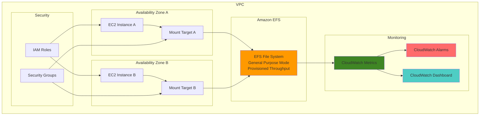

# EFS Performance Optimization and Monitoring

## Problem

Enterprise applications require high-performance, scalable file storage that can handle thousands of concurrent connections with consistent throughput and low latency. Traditional NFS solutions struggle with elastic scaling, lack comprehensive monitoring, and require manual performance tuning that leads to over-provisioning and increased costs.

## Solution

Amazon EFS provides a fully managed, elastic NFS file system that automatically scales performance with your workload demands. By implementing performance mode optimization, provisioned throughput configuration, and comprehensive CloudWatch monitoring, you can achieve predictable performance while maintaining cost efficiency and operational visibility.

## Architecture Diagram



## Prerequisites

1. AWS account with permissions to create EFS file systems, EC2 instances, and CloudWatch resources
2. AWS CLI v2 installed and configured (or AWS CloudShell)
3. Basic understanding of NFS concepts and file system performance metrics
4. Existing VPC with at least two subnets in different Availability Zones
5. Estimated cost: $15-30/month for EFS storage and provisioned throughput (varies by usage)

## Preparation

```bash
# Set environment variables
export AWS_REGION=$(aws configure get region)
export AWS_ACCOUNT_ID=$(aws sts get-caller-identity \
    --query Account --output text)

# Generate unique identifiers for resources
RANDOM_SUFFIX=$(aws secretsmanager get-random-password \
    --exclude-punctuation --exclude-uppercase \
    --password-length 6 --require-each-included-type \
    --output text --query RandomPassword)

export EFS_NAME="performance-optimized-efs-${RANDOM_SUFFIX}"
export SECURITY_GROUP_NAME="efs-sg-${RANDOM_SUFFIX}"

# Get VPC information
export VPC_ID=$(aws ec2 describe-vpcs \
    --filters "Name=is-default,Values=true" \
    --query 'Vpcs[0].VpcId' --output text)

export SUBNET_IDS=$(aws ec2 describe-subnets \
    --filters "Name=vpc-id,Values=${VPC_ID}" \
    --query 'Subnets[0:2].SubnetId' --output text)

echo "Environment prepared successfully"
echo "VPC ID: ${VPC_ID}"
echo "Subnet IDs: ${SUBNET_IDS}"
```

## Steps

1. **Create Security Group for EFS Mount Targets**:

   Security groups act as virtual firewalls that control inbound and outbound traffic to your EFS mount targets. EFS uses NFS protocol (port 2049) for communication, so we need to create a security group that allows NFS traffic from EC2 instances. This security foundation ensures only authorized resources can access your file system while maintaining network isolation.

   ```bash
   aws ec2 create-security-group \
       --group-name ${SECURITY_GROUP_NAME} \
       --description "Security group for EFS mount targets" \
       --vpc-id ${VPC_ID}
   
   export SECURITY_GROUP_ID=$(aws ec2 describe-security-groups \
       --group-names ${SECURITY_GROUP_NAME} \
       --query 'SecurityGroups[0].GroupId' --output text)
   
   # Allow NFS traffic (port 2049) from EC2 instances
   aws ec2 authorize-security-group-ingress \
       --group-id ${SECURITY_GROUP_ID} \
       --protocol tcp \
       --port 2049 \
       --source-group ${SECURITY_GROUP_ID}
   
   echo "✅ Security group created: ${SECURITY_GROUP_ID}"
   ```

   The security group now allows NFS traffic between resources in the same security group, establishing the network foundation for high-performance file system access.

2. **Create EFS File System with Performance Optimization**:

   Amazon EFS offers different performance modes and throughput configurations to optimize for your workload requirements. General Purpose mode provides the lowest latency per operation and can achieve up to 7,000 file operations per second, making it ideal for latency-sensitive applications. We'll configure provisioned throughput to guarantee consistent performance regardless of file system size.

   ```bash
   aws efs create-file-system \
       --creation-token ${EFS_NAME} \
       --performance-mode generalPurpose \
       --throughput-mode provisioned \
       --provisioned-throughput-in-mibps 100 \
       --encrypted \
       --tags "Key=Name,Value=${EFS_NAME}" \
           "Key=Environment,Value=production" \
           "Key=Purpose,Value=performance-optimized"
   
   export EFS_ID=$(aws efs describe-file-systems \
       --query "FileSystems[?Name=='${EFS_NAME}'].FileSystemId" \
       --output text)
   
   echo "✅ EFS file system created: ${EFS_ID}"
   ```

   The file system is now configured with optimal performance settings, providing consistent 100 MiB/s throughput and encryption at rest for security compliance.

> **Note**: General Purpose performance mode is recommended for most workloads as it provides the lowest latency. For applications requiring higher levels of aggregate throughput and operations per second, consider Max I/O mode, though it comes with slightly higher latencies. Learn more about [EFS Performance Modes](https://docs.aws.amazon.com/efs/latest/ug/performance.html#performancemodes).

3. **Create Mount Targets in Multiple Availability Zones**:

   Mount targets provide network access points for your EFS file system within your VPC. Creating mount targets in multiple Availability Zones ensures high availability and enables concurrent access from EC2 instances across different AZs. This multi-AZ configuration is essential for building resilient, high-performance applications that can maintain file system access during AZ failures.

   ```bash
   # Create mount targets in each subnet
   for SUBNET_ID in ${SUBNET_IDS}; do
       aws efs create-mount-target \
           --file-system-id ${EFS_ID} \
           --subnet-id ${SUBNET_ID} \
           --security-groups ${SECURITY_GROUP_ID}
       
       echo "✅ Mount target created in subnet: ${SUBNET_ID}"
   done
   
   # Wait for mount targets to become available
   aws efs wait mount-target-available \
       --mount-target-id $(aws efs describe-mount-targets \
           --file-system-id ${EFS_ID} \
           --query 'MountTargets[0].MountTargetId' --output text)
   
   echo "✅ All mount targets are available"
   ```

   Mount targets are now available across multiple AZs, providing redundant access paths and enabling high-availability access to your file system.

4. **Configure CloudWatch Monitoring Dashboard**:

   CloudWatch provides comprehensive monitoring for EFS performance metrics, enabling you to track throughput, IOPS, client connections, and latency in real-time. A well-configured dashboard provides operational visibility and helps identify performance bottlenecks before they impact applications. This monitoring foundation is essential for maintaining optimal file system performance.

   ```bash
   # Create CloudWatch dashboard for EFS monitoring
   cat > efs-dashboard.json << 'EOF'
   {
       "widgets": [
           {
               "type": "metric",
               "x": 0,
               "y": 0,
               "width": 12,
               "height": 6,
               "properties": {
                   "metrics": [
                       [ "AWS/EFS", "TotalIOBytes", "FileSystemId", "EFS_ID_PLACEHOLDER" ],
                       [ ".", "ReadIOBytes", ".", "." ],
                       [ ".", "WriteIOBytes", ".", "." ]
                   ],
                   "period": 300,
                   "stat": "Sum",
                   "region": "AWS_REGION_PLACEHOLDER",
                   "title": "EFS IO Throughput"
               }
           },
           {
               "type": "metric",
               "x": 12,
               "y": 0,
               "width": 12,
               "height": 6,
               "properties": {
                   "metrics": [
                       [ "AWS/EFS", "TotalIOTime", "FileSystemId", "EFS_ID_PLACEHOLDER" ],
                       [ ".", "ReadIOTime", ".", "." ],
                       [ ".", "WriteIOTime", ".", "." ]
                   ],
                   "period": 300,
                   "stat": "Average",
                   "region": "AWS_REGION_PLACEHOLDER",
                   "title": "EFS IO Latency"
               }
           },
           {
               "type": "metric",
               "x": 0,
               "y": 6,
               "width": 12,
               "height": 6,
               "properties": {
                   "metrics": [
                       [ "AWS/EFS", "ClientConnections", "FileSystemId", "EFS_ID_PLACEHOLDER" ]
                   ],
                   "period": 300,
                   "stat": "Sum",
                   "region": "AWS_REGION_PLACEHOLDER",
                   "title": "EFS Client Connections"
               }
           },
           {
               "type": "metric",
               "x": 12,
               "y": 6,
               "width": 12,
               "height": 6,
               "properties": {
                   "metrics": [
                       [ "AWS/EFS", "PercentIOLimit", "FileSystemId", "EFS_ID_PLACEHOLDER" ]
                   ],
                   "period": 300,
                   "stat": "Average",
                   "region": "AWS_REGION_PLACEHOLDER",
                   "title": "EFS IO Limit Utilization"
               }
           }
       ]
   }
   EOF
   
   # Replace placeholders with actual values
   sed -i.bak "s/EFS_ID_PLACEHOLDER/${EFS_ID}/g" efs-dashboard.json
   sed -i.bak "s/AWS_REGION_PLACEHOLDER/${AWS_REGION}/g" efs-dashboard.json
   
   # Create the dashboard
   aws cloudwatch put-dashboard \
       --dashboard-name "EFS-Performance-${EFS_NAME}" \
       --dashboard-body file://efs-dashboard.json
   
   echo "✅ CloudWatch dashboard created successfully"
   ```

   The dashboard now provides real-time visibility into EFS performance metrics, enabling proactive monitoring and performance optimization.

5. **Create Performance Monitoring Alarms**:

   CloudWatch alarms enable proactive monitoring by automatically detecting performance issues and triggering notifications. Setting up alarms for key metrics like throughput utilization, client connections, and IO latency helps maintain optimal performance and prevents service degradation. These alarms act as early warning systems for capacity planning and performance troubleshooting.

   ```bash
   # Create alarm for high throughput utilization
   aws cloudwatch put-metric-alarm \
       --alarm-name "EFS-High-Throughput-Utilization-${EFS_NAME}" \
       --alarm-description "EFS throughput utilization exceeds 80%" \
       --metric-name PercentIOLimit \
       --namespace AWS/EFS \
       --statistic Average \
       --period 300 \
       --threshold 80 \
       --comparison-operator GreaterThanThreshold \
       --evaluation-periods 2 \
       --dimensions Name=FileSystemId,Value=${EFS_ID}
   
   # Create alarm for high client connections
   aws cloudwatch put-metric-alarm \
       --alarm-name "EFS-High-Client-Connections-${EFS_NAME}" \
       --alarm-description "EFS client connections exceed 500" \
       --metric-name ClientConnections \
       --namespace AWS/EFS \
       --statistic Sum \
       --period 300 \
       --threshold 500 \
       --comparison-operator GreaterThanThreshold \
       --evaluation-periods 2 \
       --dimensions Name=FileSystemId,Value=${EFS_ID}
   
   # Create alarm for high IO latency
   aws cloudwatch put-metric-alarm \
       --alarm-name "EFS-High-IO-Latency-${EFS_NAME}" \
       --alarm-description "EFS average IO time exceeds 50ms" \
       --metric-name TotalIOTime \
       --namespace AWS/EFS \
       --statistic Average \
       --period 300 \
       --threshold 50 \
       --comparison-operator GreaterThanThreshold \
       --evaluation-periods 3 \
       --dimensions Name=FileSystemId,Value=${EFS_ID}
   
   echo "✅ CloudWatch alarms created successfully"
   ```

   Performance alarms are now active and will trigger notifications when thresholds are exceeded, enabling proactive performance management.

> **Warning**: Monitor your provisioned throughput costs carefully. Provisioned throughput is billed separately from storage costs and can significantly increase your monthly EFS bill. Consider using Elastic throughput for workloads with unpredictable access patterns. For more information, see [EFS Pricing](https://aws.amazon.com/efs/pricing/).

6. **Launch EC2 Instance for Testing**:

   To validate our EFS performance optimization, we'll create an EC2 instance that can mount the file system and generate test workloads. This instance will serve as a testing platform to verify performance characteristics and demonstrate real-world usage patterns. The instance needs appropriate IAM permissions and security group configuration to access EFS.

   ```bash
   # Create IAM role for EC2 instance
   cat > ec2-trust-policy.json << 'EOF'
   {
       "Version": "2012-10-17",
       "Statement": [
           {
               "Effect": "Allow",
               "Principal": {
                   "Service": "ec2.amazonaws.com"
               },
               "Action": "sts:AssumeRole"
           }
       ]
   }
   EOF
   
   aws iam create-role \
       --role-name EFS-EC2-Role-${RANDOM_SUFFIX} \
       --assume-role-policy-document file://ec2-trust-policy.json
   
   # Attach necessary policies
   aws iam attach-role-policy \
       --role-name EFS-EC2-Role-${RANDOM_SUFFIX} \
       --policy-arn arn:aws:iam::aws:policy/AmazonElasticFileSystemClientWrite
   
   # Create instance profile
   aws iam create-instance-profile \
       --instance-profile-name EFS-EC2-Profile-${RANDOM_SUFFIX}
   
   aws iam add-role-to-instance-profile \
       --instance-profile-name EFS-EC2-Profile-${RANDOM_SUFFIX} \
       --role-name EFS-EC2-Role-${RANDOM_SUFFIX}
   
   # Launch EC2 instance
   export INSTANCE_ID=$(aws ec2 run-instances \
       --image-id ami-0abcdef1234567890 \
       --instance-type t3.medium \
       --key-name my-key-pair \
       --security-group-ids ${SECURITY_GROUP_ID} \
       --subnet-id $(echo ${SUBNET_IDS} | cut -d' ' -f1) \
       --iam-instance-profile Name=EFS-EC2-Profile-${RANDOM_SUFFIX} \
       --user-data file://user-data.sh \
       --tag-specifications \
           'ResourceType=instance,Tags=[{Key=Name,Value=EFS-Test-Instance}]' \
       --query 'Instances[0].InstanceId' --output text)
   
   echo "✅ EC2 instance launched: ${INSTANCE_ID}"
   ```

   The EC2 instance is now configured with appropriate IAM permissions and security groups for EFS access, ready for performance testing and validation.

## Validation & Testing

1. **Verify EFS File System Configuration**:

   ```bash
   # Check EFS file system details
   aws efs describe-file-systems \
       --file-system-id ${EFS_ID} \
       --query 'FileSystems[0].{FileSystemId:FileSystemId,PerformanceMode:PerformanceMode,ThroughputMode:ThroughputMode,ProvisionedThroughputInMibps:ProvisionedThroughputInMibps,Encrypted:Encrypted}'
   ```

   Expected output: Shows performance mode as "generalPurpose", throughput mode as "provisioned", and 100 MiB/s provisioned throughput.

2. **Test Mount Target Availability**:

   ```bash
   # Verify mount targets are available
   aws efs describe-mount-targets \
       --file-system-id ${EFS_ID} \
       --query 'MountTargets[*].{MountTargetId:MountTargetId,LifeCycleState:LifeCycleState,AvailabilityZone:AvailabilityZoneName}'
   ```

   Expected output: All mount targets show "available" state across different AZs.

3. **Validate CloudWatch Metrics**:

   ```bash
   # Check if metrics are being collected
   aws cloudwatch get-metric-statistics \
       --namespace AWS/EFS \
       --metric-name TotalIOBytes \
       --dimensions Name=FileSystemId,Value=${EFS_ID} \
       --start-time $(date -u -d '1 hour ago' +%Y-%m-%dT%H:%M:%S) \
       --end-time $(date -u +%Y-%m-%dT%H:%M:%S) \
       --period 300 \
       --statistics Sum
   ```

   Expected output: Returns metric data points (may be empty if no IO activity yet).

4. **Test Performance Monitoring Dashboard**:

   ```bash
   # Verify dashboard was created
   aws cloudwatch get-dashboard \
       --dashboard-name "EFS-Performance-${EFS_NAME}" \
       --query 'DashboardBody' | jq -r . | head -20
   ```

   Expected output: Shows dashboard configuration with EFS metrics widgets.

## Cleanup

1. **Delete CloudWatch Resources**:

   ```bash
   # Delete CloudWatch alarms
   aws cloudwatch delete-alarms \
       --alarm-names "EFS-High-Throughput-Utilization-${EFS_NAME}" \
                     "EFS-High-Client-Connections-${EFS_NAME}" \
                     "EFS-High-IO-Latency-${EFS_NAME}"
   
   # Delete CloudWatch dashboard
   aws cloudwatch delete-dashboards \
       --dashboard-names "EFS-Performance-${EFS_NAME}"
   
   echo "✅ CloudWatch resources deleted"
   ```

2. **Terminate EC2 Instance**:

   ```bash
   # Terminate test instance
   aws ec2 terminate-instances --instance-ids ${INSTANCE_ID}
   
   # Delete IAM resources
   aws iam remove-role-from-instance-profile \
       --instance-profile-name EFS-EC2-Profile-${RANDOM_SUFFIX} \
       --role-name EFS-EC2-Role-${RANDOM_SUFFIX}
   
   aws iam delete-instance-profile \
       --instance-profile-name EFS-EC2-Profile-${RANDOM_SUFFIX}
   
   aws iam detach-role-policy \
       --role-name EFS-EC2-Role-${RANDOM_SUFFIX} \
       --policy-arn arn:aws:iam::aws:policy/AmazonElasticFileSystemClientWrite
   
   aws iam delete-role --role-name EFS-EC2-Role-${RANDOM_SUFFIX}
   
   echo "✅ EC2 instance and IAM resources cleaned up"
   ```

3. **Remove EFS File System**:

   ```bash
   # Delete mount targets first
   for MOUNT_TARGET_ID in $(aws efs describe-mount-targets \
       --file-system-id ${EFS_ID} \
       --query 'MountTargets[*].MountTargetId' --output text); do
       aws efs delete-mount-target --mount-target-id ${MOUNT_TARGET_ID}
   done
   
   # Wait for mount targets to be deleted
   sleep 30
   
   # Delete EFS file system
   aws efs delete-file-system --file-system-id ${EFS_ID}
   
   echo "✅ EFS file system deleted"
   ```

4. **Remove Security Group**:

   ```bash
   # Delete security group
   aws ec2 delete-security-group --group-id ${SECURITY_GROUP_ID}
   
   # Clean up temporary files
   rm -f efs-dashboard.json ec2-trust-policy.json user-data.sh
   
   echo "✅ Security group and temporary files cleaned up"
   ```

## Discussion

Amazon EFS performance optimization requires understanding the relationship between performance modes, throughput modes, and your workload characteristics. General Purpose mode provides the lowest latency and is suitable for most applications, while Max I/O mode offers higher levels of aggregate throughput at the cost of slightly higher latencies. The choice between these modes depends on whether your application prioritizes low latency or high aggregate throughput.

Provisioned throughput mode enables predictable performance by guaranteeing a specific level of throughput regardless of file system size or burst credit balance. This is particularly valuable for applications with consistent high-throughput requirements or workloads that cannot tolerate performance variability. The alternative, Elastic throughput, automatically scales performance based on your workload demands and is more cost-effective for unpredictable access patterns.

CloudWatch monitoring is essential for maintaining optimal EFS performance. Key metrics to monitor include `TotalIOBytes` for throughput utilization, `ClientConnections` for concurrent access patterns, and `PercentIOLimit` for understanding how close you are to performance limits. Setting up proactive alarms on these metrics enables early detection of performance issues and capacity planning opportunities. For comprehensive monitoring guidance, see the [EFS CloudWatch Monitoring Documentation](https://docs.aws.amazon.com/efs/latest/ug/monitoring-cloudwatch.html).

Network configuration plays a crucial role in EFS performance. Mount targets should be distributed across multiple Availability Zones for high availability, and security groups must allow NFS traffic (port 2049) between clients and mount targets. Consider using placement groups for EC2 instances that require the highest levels of network performance when accessing EFS.

> **Tip**: For applications requiring maximum performance, consider using EFS Intelligent Tiering to automatically move files between storage classes based on access patterns. This can reduce storage costs while maintaining performance for frequently accessed files. Learn more in the [EFS Storage Classes Documentation](https://docs.aws.amazon.com/efs/latest/ug/storage-classes.html).

## Challenge

Extend this solution by implementing these enhancements:

1. **Implement EFS Backup Automation**: Create AWS Backup plans with automated backup policies and point-in-time recovery testing procedures.

2. **Add Performance Load Testing**: Develop a comprehensive load testing framework using tools like fio or iozone to benchmark different workload patterns and validate performance under various conditions.

3. **Create Multi-Region Replication**: Implement EFS replication to a secondary region for disaster recovery and set up automated failover procedures with Route 53 health checks.

4. **Implement Advanced Monitoring**: Set up custom CloudWatch metrics using CloudWatch Logs Insights to analyze EFS access patterns and create predictive scaling based on usage trends.

5. **Add Cost Optimization**: Implement EFS Intelligent Tiering and create automated policies to move infrequently accessed files to lower-cost storage classes based on access patterns.

## Infrastructure Code

*Infrastructure code will be generated after recipe approval.*