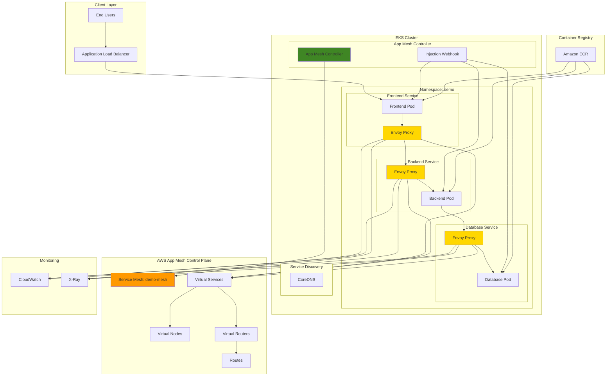

# EKS Microservices with App Mesh Service Mesh

## Problem

Modern organizations operating complex microservices architectures face significant challenges in managing service-to-service communication, observability, and traffic control. Without proper service mesh implementation, teams struggle with inconsistent networking policies, lack of end-to-end visibility across services, and difficulty implementing advanced deployment patterns like canary releases. This results in increased operational overhead, security vulnerabilities, and prolonged incident resolution times that can impact business continuity and customer satisfaction.

## Solution

AWS App Mesh provides a comprehensive service mesh solution that standardizes how microservices communicate on Amazon EKS, offering centralized traffic management, security policies, and observability. By implementing App Mesh with EKS, organizations can achieve consistent service-to-service communication through Envoy proxies, implement sophisticated traffic routing rules, and gain deep insights into application performance across their entire microservices ecosystem while maintaining application code separation from infrastructure concerns.

## Architecture Diagram



## Prerequisites

1. AWS account with EKS, App Mesh, ECR, and associated service permissions
2. AWS CLI v2 installed and configured (minimum version 2.15.0)
3. kubectl client installed and configured (version 1.28+)
4. eksctl CLI tool installed (version 0.190.0 or later)
5. Helm v3 installed for App Mesh controller deployment
6. Docker installed for container image building
7. Basic understanding of Kubernetes, service mesh concepts, and microservices architectures
8. Estimated cost: $75-125 for a 4-hour session (EKS cluster, ALB, ECR storage, extended support)

> **Warning**: AWS App Mesh will reach end of support on September 30, 2026. This recipe is provided for educational purposes and existing implementations. Consider alternative service mesh solutions like Istio, Linkerd, or Amazon ECS Service Connect for new production deployments.

## Preparation

```bash
# Set environment variables
export AWS_REGION=$(aws configure get region)
export AWS_ACCOUNT_ID=$(aws sts get-caller-identity \
    --query Account --output text)

# Generate unique identifiers for resources
RANDOM_SUFFIX=$(aws secretsmanager get-random-password \
    --exclude-punctuation --exclude-uppercase \
    --password-length 6 --require-each-included-type \
    --output text --query RandomPassword)

export CLUSTER_NAME="demo-mesh-cluster-${RANDOM_SUFFIX}"
export MESH_NAME="demo-mesh-${RANDOM_SUFFIX}"
export NAMESPACE="demo"
export ECR_REPO_PREFIX="demo-microservices-${RANDOM_SUFFIX}"

# Create ECR repositories for microservices
aws ecr create-repository \
    --repository-name "${ECR_REPO_PREFIX}/frontend" \
    --region ${AWS_REGION}

aws ecr create-repository \
    --repository-name "${ECR_REPO_PREFIX}/backend" \
    --region ${AWS_REGION}

aws ecr create-repository \
    --repository-name "${ECR_REPO_PREFIX}/database" \
    --region ${AWS_REGION}

echo "✅ ECR repositories created successfully"

# Create the EKS cluster with required configuration
eksctl create cluster \
    --name ${CLUSTER_NAME} \
    --region ${AWS_REGION} \
    --version 1.31 \
    --nodegroup-name standard-workers \
    --node-type m5.large \
    --nodes 3 \
    --nodes-min 1 \
    --nodes-max 4 \
    --managed \
    --with-oidc \
    --enable-ssm

echo "✅ EKS cluster created successfully"

# Update kubeconfig
aws eks update-kubeconfig \
    --region ${AWS_REGION} \
    --name ${CLUSTER_NAME}

echo "✅ Kubeconfig updated successfully"
```

## Steps

1. **Install AWS App Mesh Controller**:

   AWS App Mesh provides a service mesh that standardizes how microservices communicate, offering advanced traffic management, security, and observability features. The App Mesh Controller manages the lifecycle of service mesh resources in Kubernetes, translating App Mesh custom resources into actual AWS App Mesh configurations. Installing this controller is essential because it enables automatic sidecar injection and manages the integration between your EKS cluster and the AWS App Mesh control plane.

   ```bash
   # Add the EKS Helm repository
   helm repo add eks https://aws.github.io/eks-charts
   helm repo update
   
   # Install App Mesh CRDs
   kubectl apply -k \
       "https://github.com/aws/eks-charts/stable/appmesh-controller/crds?ref=master"
   
   # Create namespace for App Mesh system
   kubectl create namespace appmesh-system
   
   # Create IAM role for App Mesh controller
   eksctl create iamserviceaccount \
       --cluster=${CLUSTER_NAME} \
       --namespace=appmesh-system \
       --name=appmesh-controller \
       --attach-policy-arn=arn:aws:iam::aws:policy/AWSCloudMapFullAccess \
       --attach-policy-arn=arn:aws:iam::aws:policy/AWSAppMeshFullAccess \
       --override-existing-serviceaccounts \
       --approve
   
   # Install App Mesh controller
   helm install appmesh-controller eks/appmesh-controller \
       --namespace appmesh-system \
       --set region=${AWS_REGION} \
       --set serviceAccount.create=false \
       --set serviceAccount.name=appmesh-controller
   
   # Wait for controller to be ready
   kubectl wait --for=condition=available \
       --timeout=300s \
       deployment/appmesh-controller \
       -n appmesh-system
   
   echo "✅ App Mesh controller installed successfully"
   ```

   The App Mesh controller is now running and ready to manage service mesh resources. This establishes the control plane integration that will translate Kubernetes custom resources into AWS App Mesh configurations, enabling centralized traffic management and observability for your microservices.

   > **Tip**: Monitor the App Mesh controller logs using `kubectl logs -n appmesh-system deployment/appmesh-controller` to troubleshoot any configuration issues. See the [App Mesh Controller documentation](https://docs.aws.amazon.com/app-mesh/latest/userguide/mesh-k8s-integration.html) for advanced configuration options.

2. **Create Application Namespace and Service Mesh**:

   The service mesh acts as a dedicated infrastructure layer that handles service-to-service communication within your microservices architecture. By creating a mesh resource and labeling the namespace for automatic sidecar injection, you're establishing the foundational networking layer that will provide consistent communication policies, traffic management, and observability across all services. The namespace labeling enables the App Mesh webhook to automatically inject Envoy proxy sidecars into pods, creating the data plane for service mesh functionality.

   ```bash
   # Create application namespace
   kubectl create namespace ${NAMESPACE}
   
   # Label namespace for App Mesh injection
   kubectl label namespace ${NAMESPACE} \
       mesh=${MESH_NAME} \
       appmesh.k8s.aws/sidecarInjectorWebhook=enabled
   
   # Create App Mesh mesh resource
   cat <<EOF | kubectl apply -f -
   apiVersion: appmesh.k8s.aws/v1beta2
   kind: Mesh
   metadata:
     name: ${MESH_NAME}
     namespace: ${NAMESPACE}
   spec:
     namespaceSelector:
       matchLabels:
         mesh: ${MESH_NAME}
     egressFilter:
       type: ALLOW_ALL
   EOF
   
   # Verify mesh creation
   kubectl get mesh ${MESH_NAME} -n ${NAMESPACE}
   
   echo "✅ Service mesh created successfully"
   ```

   The service mesh is now established and the namespace is configured for automatic sidecar injection. Any pods deployed to this namespace will automatically receive Envoy proxy sidecars, creating the data plane infrastructure needed for service mesh functionality.

3. **Build and Push Container Images**:

   Container images serve as the deployment units for your microservices in the EKS cluster. Creating custom application images allows you to demonstrate realistic service-to-service communication patterns that will be managed by the service mesh. These sample applications simulate a typical three-tier architecture (frontend, backend, database) where each service communicates with others, providing clear visibility into how App Mesh manages and observes inter-service traffic through the Envoy proxies.

   ```bash
   # Get ECR login token
   aws ecr get-login-password --region ${AWS_REGION} | \
       docker login --username AWS --password-stdin \
       ${AWS_ACCOUNT_ID}.dkr.ecr.${AWS_REGION}.amazonaws.com
   
   # Create sample frontend application
   mkdir -p /tmp/demo-apps/frontend
   cat <<EOF > /tmp/demo-apps/frontend/app.py
   from flask import Flask, requests
   import os
   
   app = Flask(__name__)
   
   @app.route('/')
   def home():
       try:
           backend_url = os.getenv('BACKEND_URL', 'http://backend:8080')
           response = requests.get(f'{backend_url}/api/data')
           return f'Frontend received: {response.text}'
       except Exception as e:
           return f'Error connecting to backend: {str(e)}'
   
   if __name__ == '__main__':
       app.run(host='0.0.0.0', port=8080)
   EOF
   
   cat <<EOF > /tmp/demo-apps/frontend/requirements.txt
   Flask==3.0.3
   requests==2.32.3
   EOF
   
   cat <<EOF > /tmp/demo-apps/frontend/Dockerfile
   FROM python:3.11-slim
   WORKDIR /app
   COPY requirements.txt .
   RUN pip install -r requirements.txt
   COPY app.py .
   EXPOSE 8080
   CMD ["python", "app.py"]
   EOF
   
   # Build and push frontend image
   cd /tmp/demo-apps/frontend
   docker build -t ${ECR_REPO_PREFIX}/frontend:latest .
   docker tag ${ECR_REPO_PREFIX}/frontend:latest \
       ${AWS_ACCOUNT_ID}.dkr.ecr.${AWS_REGION}.amazonaws.com/${ECR_REPO_PREFIX}/frontend:latest
   docker push ${AWS_ACCOUNT_ID}.dkr.ecr.${AWS_REGION}.amazonaws.com/${ECR_REPO_PREFIX}/frontend:latest
   
   echo "✅ Frontend image built and pushed"
   ```

   The frontend application image is now available in ECR and ready for deployment. This containerized service will demonstrate how App Mesh manages ingress traffic and inter-service communication in a realistic microservices architecture.

4. **Create Backend and Database Services**:

   Building multiple interconnected services demonstrates the value proposition of a service mesh in managing complex microservices communication. The backend service acts as an API layer that processes business logic and communicates with the database service, while the database service provides data persistence. This multi-tier architecture showcases how App Mesh provides consistent networking, security, and observability across service boundaries without requiring changes to application code.

   ```bash
   # Create backend application
   mkdir -p /tmp/demo-apps/backend
   cat <<EOF > /tmp/demo-apps/backend/app.py
   from flask import Flask, requests
   import os
   
   app = Flask(__name__)
   
   @app.route('/api/data')
   def get_data():
       try:
           db_url = os.getenv('DATABASE_URL', 'http://database:5432')
           response = requests.get(f'{db_url}/query')
           version = os.getenv('VERSION', 'v1')
           return f'Backend {version} data: {response.text}'
       except Exception as e:
           return f'Backend error: {str(e)}'
   
   if __name__ == '__main__':
       app.run(host='0.0.0.0', port=8080)
   EOF
   
   cat <<EOF > /tmp/demo-apps/backend/requirements.txt
   Flask==3.0.3
   requests==2.32.3
   EOF
   
   cat <<EOF > /tmp/demo-apps/backend/Dockerfile
   FROM python:3.11-slim
   WORKDIR /app
   COPY requirements.txt .
   RUN pip install -r requirements.txt
   COPY app.py .
   EXPOSE 8080
   CMD ["python", "app.py"]
   EOF
   
   # Build and push backend image
   cd /tmp/demo-apps/backend
   docker build -t ${ECR_REPO_PREFIX}/backend:latest .
   docker tag ${ECR_REPO_PREFIX}/backend:latest \
       ${AWS_ACCOUNT_ID}.dkr.ecr.${AWS_REGION}.amazonaws.com/${ECR_REPO_PREFIX}/backend:latest
   docker push ${AWS_ACCOUNT_ID}.dkr.ecr.${AWS_REGION}.amazonaws.com/${ECR_REPO_PREFIX}/backend:latest
   
   # Create database service
   mkdir -p /tmp/demo-apps/database
   cat <<EOF > /tmp/demo-apps/database/app.py
   from flask import Flask
   import json
   
   app = Flask(__name__)
   
   @app.route('/query')
   def query_data():
       data = {
           'records': [
               {'id': 1, 'name': 'Product A', 'price': 29.99},
               {'id': 2, 'name': 'Product B', 'price': 39.99}
           ]
       }
       return json.dumps(data)
   
   if __name__ == '__main__':
       app.run(host='0.0.0.0', port=5432)
   EOF
   
   cat <<EOF > /tmp/demo-apps/database/requirements.txt
   Flask==3.0.3
   EOF
   
   cat <<EOF > /tmp/demo-apps/database/Dockerfile
   FROM python:3.11-slim
   WORKDIR /app
   COPY requirements.txt .
   RUN pip install -r requirements.txt
   COPY app.py .
   EXPOSE 5432
   CMD ["python", "app.py"]
   EOF
   
   # Build and push database image
   cd /tmp/demo-apps/database
   docker build -t ${ECR_REPO_PREFIX}/database:latest .
   docker tag ${ECR_REPO_PREFIX}/database:latest \
       ${AWS_ACCOUNT_ID}.dkr.ecr.${AWS_REGION}.amazonaws.com/${ECR_REPO_PREFIX}/database:latest
   docker push ${AWS_ACCOUNT_ID}.dkr.ecr.${AWS_REGION}.amazonaws.com/${ECR_REPO_PREFIX}/database:latest
   
   echo "✅ Backend and database images built and pushed"
   ```

   All microservice images are now available in ECR, providing the complete application stack needed to demonstrate service mesh capabilities. These interconnected services will showcase how App Mesh provides transparent service-to-service communication, traffic management, and observability.

5. **Deploy Virtual Nodes and Virtual Services**:

   Virtual nodes represent logical service endpoints within the mesh and define how traffic is routed to your actual Kubernetes services. Each virtual node specifies health check configurations, backend dependencies, and service discovery settings that App Mesh uses to manage traffic flow. Virtual services provide stable DNS names for service communication, abstracting the underlying infrastructure details and enabling advanced traffic management capabilities like weighted routing and canary deployments.

   ```bash
   # Create virtual nodes for each service
   cat <<EOF | kubectl apply -f -
   apiVersion: appmesh.k8s.aws/v1beta2
   kind: VirtualNode
   metadata:
     name: frontend-virtual-node
     namespace: ${NAMESPACE}
   spec:
     awsName: frontend-virtual-node
     podSelector:
       matchLabels:
         app: frontend
     listeners:
       - portMapping:
           port: 8080
           protocol: http
         healthCheck:
           healthyThreshold: 2
           intervalMillis: 5000
           path: /
           port: 8080
           protocol: http
           timeoutMillis: 2000
           unhealthyThreshold: 2
     backends:
       - virtualService:
           virtualServiceRef:
             name: backend-virtual-service
     serviceDiscovery:
       dns:
         hostname: frontend.${NAMESPACE}.svc.cluster.local
   ---
   apiVersion: appmesh.k8s.aws/v1beta2
   kind: VirtualNode
   metadata:
     name: backend-virtual-node
     namespace: ${NAMESPACE}
   spec:
     awsName: backend-virtual-node
     podSelector:
       matchLabels:
         app: backend
         version: v1
     listeners:
       - portMapping:
           port: 8080
           protocol: http
         healthCheck:
           healthyThreshold: 2
           intervalMillis: 5000
           path: /api/data
           port: 8080
           protocol: http
           timeoutMillis: 2000
           unhealthyThreshold: 2
     backends:
       - virtualService:
           virtualServiceRef:
             name: database-virtual-service
     serviceDiscovery:
       dns:
         hostname: backend.${NAMESPACE}.svc.cluster.local
   ---
   apiVersion: appmesh.k8s.aws/v1beta2
   kind: VirtualNode
   metadata:
     name: database-virtual-node
     namespace: ${NAMESPACE}
   spec:
     awsName: database-virtual-node
     podSelector:
       matchLabels:
         app: database
     listeners:
       - portMapping:
           port: 5432
           protocol: http
         healthCheck:
           healthyThreshold: 2
           intervalMillis: 5000
           path: /query
           port: 5432
           protocol: http
           timeoutMillis: 2000
           unhealthyThreshold: 2
     serviceDiscovery:
       dns:
         hostname: database.${NAMESPACE}.svc.cluster.local
   EOF
   
   echo "✅ Virtual nodes created successfully"
   ```

   Virtual nodes are now configured with health checks and service discovery settings that App Mesh will use to manage traffic routing. These configurations define how the Envoy proxies will discover and communicate with each service, establishing the foundation for reliable service mesh networking.

6. **Create Virtual Services and Routers**:

   Virtual routers enable sophisticated traffic management by defining routing rules and policies for incoming requests. The router configuration includes retry policies, timeout settings, and weighted traffic distribution that are essential for implementing resilient microservices architectures. These routing capabilities allow you to implement advanced deployment strategies like canary releases, blue-green deployments, and circuit breaker patterns without modifying application code.

   ```bash
   # Create virtual services
   cat <<EOF | kubectl apply -f -
   apiVersion: appmesh.k8s.aws/v1beta2
   kind: VirtualService
   metadata:
     name: frontend-virtual-service
     namespace: ${NAMESPACE}
   spec:
     awsName: frontend-virtual-service
     provider:
       virtualNode:
         virtualNodeRef:
           name: frontend-virtual-node
   ---
   apiVersion: appmesh.k8s.aws/v1beta2
   kind: VirtualService
   metadata:
     name: backend-virtual-service
     namespace: ${NAMESPACE}
   spec:
     awsName: backend-virtual-service
     provider:
       virtualRouter:
         virtualRouterRef:
           name: backend-virtual-router
   ---
   apiVersion: appmesh.k8s.aws/v1beta2
   kind: VirtualService
   metadata:
     name: database-virtual-service
     namespace: ${NAMESPACE}
   spec:
     awsName: database-virtual-service
     provider:
       virtualNode:
         virtualNodeRef:
           name: database-virtual-node
   EOF
   
   # Create virtual router for advanced routing
   cat <<EOF | kubectl apply -f -
   apiVersion: appmesh.k8s.aws/v1beta2
   kind: VirtualRouter
   metadata:
     name: backend-virtual-router
     namespace: ${NAMESPACE}
   spec:
     awsName: backend-virtual-router
     listeners:
       - portMapping:
           port: 8080
           protocol: http
     routes:
       - name: backend-route
         httpRoute:
           match:
             prefix: /
           action:
             weightedTargets:
               - virtualNodeRef:
                   name: backend-virtual-node
                 weight: 100
           retryPolicy:
             maxRetries: 3
             perRetryTimeout:
               unit: s
               value: 15
             httpRetryEvents:
               - server-error
               - gateway-error
             tcpRetryEvents:
               - connection-error
   EOF
   
   echo "✅ Virtual services and routers created successfully"
   ```

   The traffic management infrastructure is now in place with routing policies and retry configurations that will ensure resilient communication between services. The virtual router enables advanced deployment patterns and provides the foundation for implementing canary deployments and traffic shifting strategies.

7. **Deploy Microservices with Service Mesh Integration**:

   Deploying the actual microservices to the mesh-enabled namespace triggers automatic Envoy sidecar injection, creating the service mesh data plane. Each pod receives an Envoy proxy container that intercepts all network traffic, applying the policies and routing rules defined in the App Mesh configuration. This transparent proxy approach means your application containers remain unchanged while gaining advanced networking capabilities including load balancing, health checking, and traffic encryption.

   ```bash
   # Deploy frontend service
   cat <<EOF | kubectl apply -f -
   apiVersion: apps/v1
   kind: Deployment
   metadata:
     name: frontend
     namespace: ${NAMESPACE}
   spec:
     replicas: 2
     selector:
       matchLabels:
         app: frontend
     template:
       metadata:
         labels:
           app: frontend
       spec:
         containers:
         - name: frontend
           image: ${AWS_ACCOUNT_ID}.dkr.ecr.${AWS_REGION}.amazonaws.com/${ECR_REPO_PREFIX}/frontend:latest
           ports:
           - containerPort: 8080
           env:
           - name: BACKEND_URL
             value: "http://backend:8080"
           resources:
             requests:
               memory: "64Mi"
               cpu: "50m"
             limits:
               memory: "128Mi"
               cpu: "100m"
   ---
   apiVersion: v1
   kind: Service
   metadata:
     name: frontend
     namespace: ${NAMESPACE}
   spec:
     selector:
       app: frontend
     ports:
     - port: 8080
       targetPort: 8080
     type: ClusterIP
   EOF
   
   # Deploy backend service
   cat <<EOF | kubectl apply -f -
   apiVersion: apps/v1
   kind: Deployment
   metadata:
     name: backend
     namespace: ${NAMESPACE}
   spec:
     replicas: 3
     selector:
       matchLabels:
         app: backend
         version: v1
     template:
       metadata:
         labels:
           app: backend
           version: v1
       spec:
         containers:
         - name: backend
           image: ${AWS_ACCOUNT_ID}.dkr.ecr.${AWS_REGION}.amazonaws.com/${ECR_REPO_PREFIX}/backend:latest
           ports:
           - containerPort: 8080
           env:
           - name: DATABASE_URL
             value: "http://database:5432"
           - name: VERSION
             value: "v1"
           resources:
             requests:
               memory: "64Mi"
               cpu: "50m"
             limits:
               memory: "128Mi"
               cpu: "100m"
   ---
   apiVersion: v1
   kind: Service
   metadata:
     name: backend
     namespace: ${NAMESPACE}
   spec:
     selector:
       app: backend
     ports:
     - port: 8080
       targetPort: 8080
     type: ClusterIP
   EOF
   
   # Deploy database service
   cat <<EOF | kubectl apply -f -
   apiVersion: apps/v1
   kind: Deployment
   metadata:
     name: database
     namespace: ${NAMESPACE}
   spec:
     replicas: 1
     selector:
       matchLabels:
         app: database
     template:
       metadata:
         labels:
           app: database
       spec:
         containers:
         - name: database
           image: ${AWS_ACCOUNT_ID}.dkr.ecr.${AWS_REGION}.amazonaws.com/${ECR_REPO_PREFIX}/database:latest
           ports:
           - containerPort: 5432
           resources:
             requests:
               memory: "64Mi"
               cpu: "50m"
             limits:
               memory: "128Mi"
               cpu: "100m"
   ---
   apiVersion: v1
   kind: Service
   metadata:
     name: database
     namespace: ${NAMESPACE}
   spec:
     selector:
       app: database
     ports:
     - port: 5432
       targetPort: 5432
     type: ClusterIP
   EOF
   
   echo "✅ Microservices deployed successfully"
   ```

   The microservices are now deployed and will automatically receive Envoy sidecar containers through the mesh injection webhook. Each service is now part of the service mesh and will benefit from consistent networking policies, load balancing, and observability features without requiring application code changes.

8. **Configure Application Load Balancer**:

   The AWS Load Balancer Controller enables native integration between Kubernetes ingress resources and AWS Application Load Balancers, providing external access to your mesh-enabled applications. This integration is crucial for production deployments as it leverages AWS-native load balancing capabilities while maintaining the security and observability benefits of the service mesh for internal service communication. The ALB serves as the entry point for external traffic, which then flows through the service mesh infrastructure.

   ```bash
   # Download IAM policy for AWS Load Balancer Controller
   curl -o iam_policy.json \
       https://raw.githubusercontent.com/kubernetes-sigs/aws-load-balancer-controller/v2.8.0/docs/install/iam_policy.json
   
   # Create IAM policy
   aws iam create-policy \
       --policy-name AWSLoadBalancerControllerIAMPolicy \
       --policy-document file://iam_policy.json \
       --no-cli-pager
   
   # Create IAM role for Load Balancer Controller
   eksctl create iamserviceaccount \
       --cluster=${CLUSTER_NAME} \
       --namespace=kube-system \
       --name=aws-load-balancer-controller \
       --role-name AmazonEKSLoadBalancerControllerRole \
       --attach-policy-arn=arn:aws:iam::${AWS_ACCOUNT_ID}:policy/AWSLoadBalancerControllerIAMPolicy \
       --approve
   
   # Install AWS Load Balancer Controller
   helm repo add eks https://aws.github.io/eks-charts
   helm repo update
   
   helm install aws-load-balancer-controller \
       eks/aws-load-balancer-controller \
       -n kube-system \
       --set clusterName=${CLUSTER_NAME} \
       --set serviceAccount.create=false \
       --set serviceAccount.name=aws-load-balancer-controller
   
   # Wait for controller to be ready
   kubectl wait --for=condition=available \
       --timeout=300s \
       deployment/aws-load-balancer-controller \
       -n kube-system
   
   # Create ingress for frontend service
   cat <<EOF | kubectl apply -f -
   apiVersion: networking.k8s.io/v1
   kind: Ingress
   metadata:
     name: frontend-ingress
     namespace: ${NAMESPACE}
     annotations:
       alb.ingress.kubernetes.io/scheme: internet-facing
       alb.ingress.kubernetes.io/target-type: ip
       alb.ingress.kubernetes.io/healthcheck-path: /
   spec:
     ingressClassName: alb
     rules:
     - http:
         paths:
         - path: /
           pathType: Prefix
           backend:
             service:
               name: frontend
               port:
                 number: 8080
   EOF
   
   echo "✅ Application Load Balancer configured successfully"
   ```

   External access to the mesh-enabled application is now configured through AWS Application Load Balancer integration. This provides a production-ready entry point that leverages AWS-native load balancing while maintaining the security and observability benefits of the service mesh for internal communications.

9. **Wait for Pod Readiness and Envoy Injection**:

   Verifying successful Envoy sidecar injection is critical to ensuring the service mesh is functioning correctly. Each pod should contain two containers: your application container and the Envoy proxy sidecar. The Envoy proxy handles all network communication for the application, implementing the traffic management policies, security rules, and observability features defined in your App Mesh configuration. Proper sidecar injection indicates that your services are now part of the mesh and can benefit from its capabilities.

   ```bash
   # Wait for all pods to be ready
   kubectl wait --for=condition=ready pod \
       --all -n ${NAMESPACE} --timeout=300s
   
   # Verify Envoy sidecar injection
   kubectl get pods -n ${NAMESPACE} -o wide
   
   # Check that each pod has 2 containers (app + envoy)
   for pod in $(kubectl get pods -n ${NAMESPACE} -o name); do
       echo "Pod: $pod"
       kubectl get $pod -n ${NAMESPACE} \
           -o jsonpath='{.spec.containers[*].name}' && echo
   done
   
   echo "✅ All pods are ready with Envoy sidecars"
   ```

   Successful sidecar injection confirms that the service mesh data plane is operational. All inter-service communications will now flow through Envoy proxies, enabling advanced traffic management, security policies, and comprehensive observability across the entire microservices architecture.

10. **Enable Distributed Tracing and Monitoring**:

    Distributed tracing provides end-to-end visibility into request flows across your microservices architecture, enabling rapid troubleshooting and performance optimization. AWS X-Ray integration with App Mesh automatically generates trace data for all service-to-service communications, creating a complete picture of request latency, error rates, and service dependencies. This observability layer is essential for maintaining reliable microservices in production environments, allowing teams to quickly identify bottlenecks and optimize system performance.

    ```bash
    # Enable X-Ray tracing for App Mesh
    kubectl patch mesh ${MESH_NAME} -n ${NAMESPACE} \
        --type='merge' \
        -p='{"spec":{"meshSpec":{"tracing":{"xray":{}}}}}'
    
    # Create X-Ray daemon DaemonSet
    cat <<EOF | kubectl apply -f -
    apiVersion: apps/v1
    kind: DaemonSet
    metadata:
      name: xray-daemon
      namespace: ${NAMESPACE}
    spec:
      selector:
        matchLabels:
          app: xray-daemon
      template:
        metadata:
          labels:
            app: xray-daemon
        spec:
          containers:
          - name: xray-daemon
            image: amazon/aws-xray-daemon:3.3.8
            ports:
            - containerPort: 2000
              protocol: UDP
            resources:
              requests:
                memory: "32Mi"
                cpu: "25m"
              limits:
                memory: "64Mi"
                cpu: "50m"
    ---
    apiVersion: v1
    kind: Service
    metadata:
      name: xray-service
      namespace: ${NAMESPACE}
    spec:
      selector:
        app: xray-daemon
      ports:
      - port: 2000
        protocol: UDP
      type: ClusterIP
    EOF
    
    # Update virtual nodes to enable tracing
    kubectl patch virtualnode frontend-virtual-node -n ${NAMESPACE} \
        --type='merge' \
        -p='{"spec":{"logging":{"accessLog":{"file":{"path":"/dev/stdout"}}}}}'
    
    kubectl patch virtualnode backend-virtual-node -n ${NAMESPACE} \
        --type='merge' \
        -p='{"spec":{"logging":{"accessLog":{"file":{"path":"/dev/stdout"}}}}}'
    
    kubectl patch virtualnode database-virtual-node -n ${NAMESPACE} \
        --type='merge' \
        -p='{"spec":{"logging":{"accessLog":{"file":{"path":"/dev/stdout"}}}}}'
    
    echo "✅ Distributed tracing and monitoring enabled"
    ```

    X-Ray distributed tracing is now capturing detailed information about request flows across your microservices. This observability layer provides critical insights into service performance, error rates, and dependencies that are essential for maintaining reliable production systems.

11. **Configure Advanced Traffic Management**:

    Advanced traffic management capabilities enable sophisticated deployment strategies that are essential for modern DevOps practices. By implementing weighted routing between service versions, you can perform canary deployments that gradually shift traffic from stable versions to new releases while monitoring performance metrics. This approach minimizes deployment risk and enables rapid rollback if issues are detected, supporting continuous delivery practices that require high availability and reliability.

    ```bash
    # Create a second version of backend for canary deployment
    cat <<EOF | kubectl apply -f -
    apiVersion: apps/v1
    kind: Deployment
    metadata:
      name: backend-v2
      namespace: ${NAMESPACE}
    spec:
      replicas: 1
      selector:
        matchLabels:
          app: backend
          version: v2
      template:
        metadata:
          labels:
            app: backend
            version: v2
        spec:
          containers:
          - name: backend
            image: ${AWS_ACCOUNT_ID}.dkr.ecr.${AWS_REGION}.amazonaws.com/${ECR_REPO_PREFIX}/backend:latest
            ports:
            - containerPort: 8080
            env:
            - name: DATABASE_URL
              value: "http://database:5432"
            - name: VERSION
              value: "v2"
            resources:
              requests:
                memory: "64Mi"
                cpu: "50m"
              limits:
                memory: "128Mi"
                cpu: "100m"
    EOF
    
    # Create virtual node for backend v2
    cat <<EOF | kubectl apply -f -
    apiVersion: appmesh.k8s.aws/v1beta2
    kind: VirtualNode
    metadata:
      name: backend-v2-virtual-node
      namespace: ${NAMESPACE}
    spec:
      awsName: backend-v2-virtual-node
      podSelector:
        matchLabels:
          app: backend
          version: v2
      listeners:
        - portMapping:
            port: 8080
            protocol: http
          healthCheck:
            healthyThreshold: 2
            intervalMillis: 5000
            path: /api/data
            port: 8080
            protocol: http
            timeoutMillis: 2000
            unhealthyThreshold: 2
      backends:
        - virtualService:
            virtualServiceRef:
              name: database-virtual-service
      serviceDiscovery:
        dns:
          hostname: backend.${NAMESPACE}.svc.cluster.local
    EOF
    
    # Update virtual router for canary deployment (90% v1, 10% v2)
    cat <<EOF | kubectl apply -f -
    apiVersion: appmesh.k8s.aws/v1beta2
    kind: VirtualRouter
    metadata:
      name: backend-virtual-router
      namespace: ${NAMESPACE}
    spec:
      awsName: backend-virtual-router
      listeners:
        - portMapping:
            port: 8080
            protocol: http
      routes:
        - name: backend-route
          httpRoute:
            match:
              prefix: /
            action:
              weightedTargets:
                - virtualNodeRef:
                    name: backend-virtual-node
                  weight: 90
                - virtualNodeRef:
                    name: backend-v2-virtual-node
                  weight: 10
            retryPolicy:
              maxRetries: 3
              perRetryTimeout:
                unit: s
                value: 15
              httpRetryEvents:
                - server-error
                - gateway-error
              tcpRetryEvents:
                - connection-error
    EOF
    
    echo "✅ Advanced traffic management configured with canary deployment"
    ```

    The canary deployment configuration demonstrates App Mesh's sophisticated traffic management capabilities. With 90% of traffic routed to the stable version and 10% to the new version, you can safely test new releases while minimizing risk and monitoring performance metrics to ensure system reliability.

    > **Note**: Canary deployments should be combined with comprehensive monitoring and automated rollback mechanisms. Use CloudWatch metrics and X-Ray traces to monitor error rates and latency before gradually increasing traffic to new versions.

12. **Final Verification and Testing**:

    Comprehensive testing validates that all service mesh components are functioning correctly and that the system is ready for production workloads. This includes verifying external access through the load balancer, confirming proper traffic distribution across service versions, and ensuring that all mesh resources are in the expected state. End-to-end testing demonstrates the complete functionality of your service mesh implementation and provides confidence in the system's reliability and performance.

    ```bash
    # Get the load balancer URL
    ALB_URL=$(kubectl get ingress frontend-ingress -n ${NAMESPACE} \
        -o jsonpath='{.status.loadBalancer.ingress[0].hostname}')
    
    # Wait for load balancer to be ready
    echo "Waiting for load balancer to be ready..."
    while [ -z "$ALB_URL" ]; do
        sleep 10
        ALB_URL=$(kubectl get ingress frontend-ingress -n ${NAMESPACE} \
            -o jsonpath='{.status.loadBalancer.ingress[0].hostname}')
    done
    
    echo "Application URL: http://${ALB_URL}"
    
    # Test the application
    for i in {1..10}; do
        curl -s "http://${ALB_URL}" && echo
        sleep 1
    done
    
    # Check App Mesh resources
    kubectl get mesh,virtualnode,virtualservice,virtualrouter \
        -n ${NAMESPACE}
    
    # Check pod status and sidecar injection
    kubectl get pods -n ${NAMESPACE} \
        -o custom-columns=NAME:.metadata.name,READY:.status.containerStatuses[*].ready
    
    echo "✅ Service mesh deployment completed successfully"
    ```

    The complete service mesh implementation is now operational with external access, traffic management, and observability features fully configured. Your microservices architecture now benefits from centralized networking policies, advanced deployment capabilities, and comprehensive monitoring that enables reliable production operations.

## Validation & Testing

1. Verify all App Mesh resources are active:

   ```bash
   # Check mesh status
   kubectl describe mesh ${MESH_NAME} -n ${NAMESPACE}
   ```

   Expected output: Status should show `ACTIVE`

2. Test service-to-service communication:

   ```bash
   # Test direct service calls
   kubectl exec -n ${NAMESPACE} deployment/frontend -- \
       curl -s http://backend:8080/api/data
   ```

   Expected output: Backend should return database query results

3. Verify Envoy proxy integration:

   ```bash
   # Check Envoy admin interface
   kubectl port-forward -n ${NAMESPACE} \
       deployment/frontend 9901:9901 &
   
   # Access Envoy admin (in another terminal)
   curl -s http://localhost:9901/stats | grep -i mesh
   
   # Stop port-forward
   pkill -f "port-forward.*9901"
   ```

4. Test canary deployment traffic distribution:

   ```bash
   # Make multiple requests to observe traffic distribution
   for i in {1..50}; do
       curl -s "http://${ALB_URL}" | grep -o "Backend.*" && echo
   done
   ```

   Expected output: Should show approximately 90% v1 and 10% v2 responses

5. Verify distributed tracing:

   ```bash
   # Check X-Ray traces in AWS Console
   aws xray get-trace-summaries \
       --time-range-type TimeRangeByStartTime \
       --start-time $(date -u -d '5 minutes ago' +%Y-%m-%dT%H:%M:%S) \
       --end-time $(date -u +%Y-%m-%dT%H:%M:%S) \
       --region ${AWS_REGION}
   ```

## Cleanup

1. Remove Application Load Balancer and ingress:

   ```bash
   # Delete ingress
   kubectl delete ingress frontend-ingress -n ${NAMESPACE}
   
   # Uninstall AWS Load Balancer Controller
   helm uninstall aws-load-balancer-controller -n kube-system
   
   # Delete IAM policy
   aws iam delete-policy \
       --policy-arn arn:aws:iam::${AWS_ACCOUNT_ID}:policy/AWSLoadBalancerControllerIAMPolicy
   
   echo "✅ Load balancer resources removed"
   ```

2. Remove X-Ray daemon and tracing:

   ```bash
   # Delete X-Ray daemon
   kubectl delete daemonset xray-daemon -n ${NAMESPACE}
   kubectl delete service xray-service -n ${NAMESPACE}
   
   echo "✅ X-Ray daemon removed"
   ```

3. Remove microservices and App Mesh resources:

   ```bash
   # Delete applications
   kubectl delete deployment frontend backend backend-v2 database -n ${NAMESPACE}
   kubectl delete service frontend backend database -n ${NAMESPACE}
   
   # Delete App Mesh resources
   kubectl delete virtualnode,virtualservice,virtualrouter,mesh --all -n ${NAMESPACE}
   
   echo "✅ Applications and App Mesh resources removed"
   ```

4. Remove App Mesh controller and namespace:

   ```bash
   # Uninstall App Mesh controller
   helm uninstall appmesh-controller -n appmesh-system
   
   # Delete namespaces
   kubectl delete namespace ${NAMESPACE} appmesh-system
   
   echo "✅ App Mesh controller and namespaces removed"
   ```

5. Remove EKS cluster and ECR repositories:

   ```bash
   # Delete EKS cluster
   eksctl delete cluster --name ${CLUSTER_NAME} --region ${AWS_REGION}
   
   # Delete ECR repositories
   aws ecr delete-repository \
       --repository-name "${ECR_REPO_PREFIX}/frontend" \
       --force --region ${AWS_REGION}
   aws ecr delete-repository \
       --repository-name "${ECR_REPO_PREFIX}/backend" \
       --force --region ${AWS_REGION}
   aws ecr delete-repository \
       --repository-name "${ECR_REPO_PREFIX}/database" \
       --force --region ${AWS_REGION}
   
   # Clean up temporary files
   rm -rf /tmp/demo-apps
   rm -f iam_policy.json
   
   echo "✅ All resources have been cleaned up"
   ```

## Discussion

AWS App Mesh provides a comprehensive service mesh solution that addresses the complex challenges of microservices communication in production environments. By implementing App Mesh with Amazon EKS, organizations can achieve several critical architectural benefits that directly impact operational efficiency and application reliability.

The Envoy proxy integration serves as the foundation of App Mesh's capabilities, providing transparent service-to-service communication without requiring application code changes. This sidecar pattern ensures that all network traffic between services is managed consistently, enabling advanced features like automatic retries, circuit breakers, and load balancing. The proxy's integration with AWS services provides native support for distributed tracing through X-Ray, comprehensive metrics through CloudWatch, and centralized logging capabilities that align with the AWS Well-Architected Framework's operational excellence pillar.

Traffic management capabilities in App Mesh enable sophisticated deployment strategies essential for modern DevOps practices. The virtual router and weighted routing features demonstrated in this recipe allow for seamless canary deployments, blue-green deployments, and A/B testing scenarios. Organizations can gradually shift traffic between service versions, monitor performance metrics, and roll back changes if issues arise, all without service disruption. This level of control is particularly valuable for high-availability applications where downtime has significant business impact and supports the reliability pillar of well-architected systems.

The observability features provided by App Mesh integration significantly reduce mean time to resolution (MTTR) for production incidents. Distributed tracing capabilities allow teams to track requests across multiple services, identify bottlenecks, and understand service dependencies. Combined with centralized logging and metrics collection, teams gain comprehensive visibility into application behavior, enabling proactive monitoring and rapid issue diagnosis. For detailed implementation guidance, refer to the [AWS App Mesh User Guide](https://docs.aws.amazon.com/app-mesh/latest/userguide/what-is-app-mesh.html), [EKS User Guide](https://docs.aws.amazon.com/eks/latest/userguide/getting-started.html), and [AWS Well-Architected Framework](https://docs.aws.amazon.com/wellarchitected/latest/framework/welcome.html).

> **Warning**: AWS App Mesh will reach end of support on September 30, 2026. Organizations should plan migration to alternative service mesh solutions such as Istio, Linkerd, or Amazon ECS Service Connect for new deployments. Consider this timeline when making architectural decisions for production workloads.

## Challenge

Extend this solution by implementing these enhancements:

1. **Implement mutual TLS (mTLS) authentication** between services using AWS Certificate Manager Private CA integration, enabling zero-trust security between microservices with automatic certificate rotation and validation.

2. **Add comprehensive monitoring and alerting** by integrating CloudWatch Container Insights, creating custom dashboards for service mesh metrics, and implementing automated alerting for service failures and performance degradation using CloudWatch Alarms.

3. **Implement circuit breaker patterns** using App Mesh timeout and retry policies, creating resilient service communication that fails fast and provides graceful degradation during service outages with proper fallback mechanisms.

4. **Create a multi-environment deployment pipeline** using AWS CodePipeline and CodeDeploy, implementing automated testing, canary analysis, and rollback capabilities for service mesh deployments across development, staging, and production environments.

5. **Integrate with AWS App Runner or Lambda** for serverless components, creating a hybrid architecture that combines containerized microservices with serverless functions while maintaining consistent service mesh communication patterns and observability.

## Infrastructure Code

### Available Infrastructure as Code:

- [Infrastructure Code Overview](code/README.md) - Detailed description of all infrastructure components
- [AWS CDK (Python)](code/cdk-python/) - AWS CDK Python implementation
- [AWS CDK (TypeScript)](code/cdk-typescript/) - AWS CDK TypeScript implementation
- [CloudFormation](code/cloudformation.yaml) - AWS CloudFormation template
- [Bash CLI Scripts](code/scripts/) - Example bash scripts using AWS CLI commands to deploy infrastructure
- [Terraform](code/terraform/) - Terraform configuration files