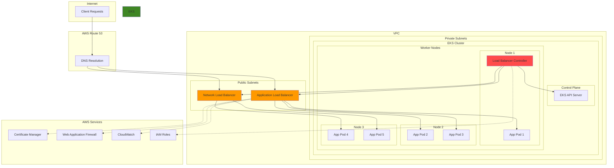

# EKS Ingress with AWS Load Balancer Controller

## Problem

Organizations running containerized applications on Kubernetes face complex challenges when managing external traffic routing, load balancing, and SSL termination. Traditional ingress controllers require manual configuration of AWS load balancers, lack integration with AWS services like WAF and ACM, and provide limited visibility into application performance. Without proper ingress management, teams struggle with inconsistent routing rules, security vulnerabilities, and inability to leverage AWS-native features for high availability and scalability.

## Solution

The AWS Load Balancer Controller automates the provisioning and management of AWS Application Load Balancers (ALB) and Network Load Balancers (NLB) for Kubernetes ingress resources. This solution provides native AWS integration, automatic SSL certificate management, advanced routing capabilities, and seamless integration with AWS security services like WAF and Shield Advanced.

## Architecture Diagram



## Prerequisites

1. AWS account with appropriate permissions for EKS, ALB, NLB, IAM, and Route 53
2. AWS CLI v2 installed and configured (or AWS CloudShell)
3. kubectl (version 1.21 or later) installed and configured
4. Helm 3.x installed
5. eksctl installed (optional, for cluster creation)
6. Basic knowledge of Kubernetes concepts and AWS networking
7. Existing VPC with proper subnet tagging or ability to create new VPC
8. Estimated cost: $100-200/month for EKS cluster, ALB/NLB, and associated resources

> **Note**: This recipe assumes you have an existing EKS cluster. If you need to create one, add approximately 1 hour for cluster setup.

## Preparation

```bash
# Set environment variables
export AWS_REGION=$(aws configure get region)
export AWS_ACCOUNT_ID=$(aws sts get-caller-identity \
    --query Account --output text)

# Generate unique identifiers for resources
RANDOM_SUFFIX=$(aws secretsmanager get-random-password \
    --exclude-punctuation --exclude-uppercase \
    --password-length 6 --require-each-included-type \
    --output text --query RandomPassword)

export CLUSTER_NAME="eks-ingress-demo-${RANDOM_SUFFIX}"
export DOMAIN_NAME="demo-${RANDOM_SUFFIX}.example.com"
export NAMESPACE="ingress-demo"

# Create EKS cluster (if you don't have one)
eksctl create cluster \
    --name $CLUSTER_NAME \
    --region $AWS_REGION \
    --nodes 3 \
    --node-type t3.medium \
    --managed \
    --version 1.28

# Update kubeconfig
aws eks update-kubeconfig \
    --region $AWS_REGION \
    --name $CLUSTER_NAME

# Verify cluster connectivity
kubectl get nodes

# Create namespace for demo applications
kubectl create namespace $NAMESPACE
```

## Steps

1. **Create IAM Service Account for AWS Load Balancer Controller**:

   IAM Roles for Service Accounts (IRSA) enables secure, fine-grained permissions for Kubernetes service accounts by mapping them to AWS IAM roles. This eliminates the need for hardcoded credentials and follows the principle of least privilege access. The AWS Load Balancer Controller requires specific IAM permissions to create and manage ALBs and NLBs on your behalf.

   ```bash
   # Create IAM OIDC identity provider for the cluster
   eksctl utils associate-iam-oidc-provider \
       --region $AWS_REGION \
       --cluster $CLUSTER_NAME \
       --approve
   
   # Download the IAM policy document
   curl -o iam-policy.json https://raw.githubusercontent.com/\
kubernetes-sigs/aws-load-balancer-controller/v2.7.2/docs/install/iam_policy.json
   
   # Create the IAM policy
   POLICY_ARN=$(aws iam create-policy \
       --policy-name AWSLoadBalancerControllerIAMPolicy \
       --policy-document file://iam-policy.json \
       --query 'Policy.Arn' --output text)
   
   echo "✅ Created IAM policy: $POLICY_ARN"
   ```

   The OIDC identity provider enables secure token exchange between Kubernetes and AWS IAM, while the IAM policy grants the controller permissions to manage Elastic Load Balancing resources. This foundation ensures the controller can automatically provision and configure load balancers based on your ingress specifications.

2. **Create Service Account with IAM Role**:

   The service account acts as the identity for the AWS Load Balancer Controller pods, enabling them to assume the IAM role and interact with AWS APIs. This step combines Kubernetes RBAC with AWS IAM to create a secure, least-privilege access model that eliminates the need for storing AWS credentials as secrets.

   ```bash
   # Create service account with IAM role
   eksctl create iamserviceaccount \
       --cluster=$CLUSTER_NAME \
       --namespace=kube-system \
       --name=aws-load-balancer-controller \
       --role-name=AmazonEKSLoadBalancerControllerRole \
       --attach-policy-arn=$POLICY_ARN \
       --approve
   
   # Verify the service account
   kubectl get serviceaccount aws-load-balancer-controller \
       -n kube-system -o yaml
   
   echo "✅ Created service account with IAM role"
   ```

   The service account is now configured with the necessary IAM permissions to manage AWS load balancers. This security model ensures that only the controller pods can perform load balancer operations, maintaining strict access controls while enabling automated infrastructure management.

3. **Install AWS Load Balancer Controller using Helm**:

   The AWS Load Balancer Controller is a Kubernetes controller that watches for ingress resources and automatically provisions AWS Application Load Balancers (ALB) and Network Load Balancers (NLB). Installing it via Helm ensures proper configuration and enables easy upgrades. The controller provides superior integration with AWS services compared to traditional ingress controllers, offering native support for AWS Certificate Manager, WAF, and advanced routing capabilities.

   ```bash
   # Add the EKS Helm repository
   helm repo add eks https://aws.github.io/eks-charts
   helm repo update
   
   # Install the AWS Load Balancer Controller
   helm install aws-load-balancer-controller eks/aws-load-balancer-controller \
       -n kube-system \
       --set clusterName=$CLUSTER_NAME \
       --set serviceAccount.create=false \
       --set serviceAccount.name=aws-load-balancer-controller \
       --set region=$AWS_REGION \
       --set vpcId=$(aws eks describe-cluster --name $CLUSTER_NAME \
           --query 'cluster.resourcesVpcConfig.vpcId' --output text)
   
   # Wait for controller to be ready
   kubectl wait --for=condition=ready pod \
       -l app.kubernetes.io/name=aws-load-balancer-controller \
       -n kube-system --timeout=300s
   
   echo "✅ AWS Load Balancer Controller installed successfully"
   ```

   The controller is now running in your cluster and ready to respond to ingress resources. It will automatically create and configure AWS load balancers based on your ingress specifications, providing seamless integration between Kubernetes networking and AWS load balancing services. Learn more about the controller's capabilities in the [AWS Load Balancer Controller documentation](https://docs.aws.amazon.com/eks/latest/userguide/aws-load-balancer-controller.html).

4. **Deploy Sample Applications for Testing**:

   Before configuring ingress resources, we need target applications to demonstrate various traffic routing scenarios. These sample applications represent different versions of a service, enabling us to showcase advanced routing capabilities like weighted traffic distribution, canary deployments, and A/B testing patterns that are essential for modern application deployment strategies.

   ```bash
   # Create first sample application
   kubectl apply -f - <<EOF
   apiVersion: apps/v1
   kind: Deployment
   metadata:
     namespace: $NAMESPACE
     name: sample-app-v1
   spec:
     replicas: 3
     selector:
       matchLabels:
         app: sample-app
         version: v1
     template:
       metadata:
         labels:
           app: sample-app
           version: v1
       spec:
         containers:
         - name: app
           image: nginx:1.21
           ports:
           - containerPort: 80
           env:
           - name: VERSION
             value: "v1"
   ---
   apiVersion: v1
   kind: Service
   metadata:
     namespace: $NAMESPACE
     name: sample-app-v1
   spec:
     selector:
       app: sample-app
       version: v1
     ports:
     - port: 80
       targetPort: 80
     type: ClusterIP
   EOF
   
   # Create second sample application
   kubectl apply -f - <<EOF
   apiVersion: apps/v1
   kind: Deployment
   metadata:
     namespace: $NAMESPACE
     name: sample-app-v2
   spec:
     replicas: 2
     selector:
       matchLabels:
         app: sample-app
         version: v2
     template:
       metadata:
         labels:
           app: sample-app
           version: v2
       spec:
         containers:
         - name: app
           image: nginx:1.21
           ports:
           - containerPort: 80
           env:
           - name: VERSION
             value: "v2"
   ---
   apiVersion: v1
   kind: Service
   metadata:
     namespace: $NAMESPACE
     name: sample-app-v2
   spec:
     selector:
       app: sample-app
       version: v2
     ports:
     - port: 80
       targetPort: 80
     type: ClusterIP
   EOF
   
   echo "✅ Sample applications deployed"
   ```

   The applications are now deployed with ClusterIP services, making them accessible within the cluster but not externally. This setup provides the foundation for demonstrating how the AWS Load Balancer Controller bridges internal Kubernetes services with external AWS load balancers, enabling secure and scalable application exposure.

5. **Create Basic Application Load Balancer Ingress**:

   Application Load Balancers (ALB) operate at Layer 7 of the OSI model, providing advanced HTTP/HTTPS routing capabilities including host-based routing, path-based routing, and integration with AWS services. Creating an ingress resource automatically triggers the AWS Load Balancer Controller to provision an ALB with the specified configuration, eliminating manual infrastructure management while ensuring optimal integration with your Kubernetes workloads.

   ```bash
   # Create basic ALB ingress
   kubectl apply -f - <<EOF
   apiVersion: networking.k8s.io/v1
   kind: Ingress
   metadata:
     namespace: $NAMESPACE
     name: sample-app-basic-alb
     annotations:
       alb.ingress.kubernetes.io/scheme: internet-facing
       alb.ingress.kubernetes.io/target-type: ip
       alb.ingress.kubernetes.io/healthcheck-path: /
       alb.ingress.kubernetes.io/healthcheck-interval-seconds: '10'
       alb.ingress.kubernetes.io/healthcheck-timeout-seconds: '5'
       alb.ingress.kubernetes.io/healthy-threshold-count: '2'
       alb.ingress.kubernetes.io/unhealthy-threshold-count: '3'
       alb.ingress.kubernetes.io/tags: Environment=demo,Team=platform
   spec:
     ingressClassName: alb
     rules:
     - host: basic.$DOMAIN_NAME
       http:
         paths:
         - path: /
           pathType: Prefix
           backend:
             service:
               name: sample-app-v1
               port:
                 number: 80
   EOF
   
   echo "✅ Basic ALB ingress created"
   ```

   The ALB is now being provisioned with optimized health checks and proper target group configuration. The `target-type: ip` annotation ensures direct routing to pod IPs rather than node ports, improving performance and reducing latency. Learn more about ALB configuration in the [Application Load Balancer documentation](https://docs.aws.amazon.com/elasticloadbalancing/latest/application/introduction.html).

6. **Create Advanced ALB Ingress with SSL and WAF**:

   SSL/TLS termination at the load balancer level provides superior security and performance compared to pod-level encryption. AWS Certificate Manager (ACM) automatically handles certificate provisioning, renewal, and validation, eliminating the operational overhead of manual certificate management. This configuration demonstrates path-based routing, where different URL paths route to different backend services, enabling microservices architectures and API versioning strategies.

   ```bash
   # Request SSL certificate (for demo purposes, using self-signed)
   # In production, use ACM to create or import certificates
   CERT_ARN=$(aws acm request-certificate \
       --domain-name "*.example.com" \
       --validation-method DNS \
       --subject-alternative-names "example.com" \
       --query 'CertificateArn' --output text)
   
   # Create advanced ALB ingress with SSL
   kubectl apply -f - <<EOF
   apiVersion: networking.k8s.io/v1
   kind: Ingress
   metadata:
     namespace: $NAMESPACE
     name: sample-app-advanced-alb
     annotations:
       alb.ingress.kubernetes.io/scheme: internet-facing
       alb.ingress.kubernetes.io/target-type: ip
       alb.ingress.kubernetes.io/listen-ports: '[{"HTTP": 80}, {"HTTPS": 443}]'
       alb.ingress.kubernetes.io/ssl-redirect: '443'
       alb.ingress.kubernetes.io/certificate-arn: $CERT_ARN
       alb.ingress.kubernetes.io/ssl-policy: ELBSecurityPolicy-TLS-1-2-2019-07
       alb.ingress.kubernetes.io/load-balancer-attributes: access_logs.s3.enabled=false,idle_timeout.timeout_seconds=60
       alb.ingress.kubernetes.io/target-group-attributes: deregistration_delay.timeout_seconds=30,stickiness.enabled=false
       alb.ingress.kubernetes.io/healthcheck-path: /
       alb.ingress.kubernetes.io/healthcheck-protocol: HTTP
       alb.ingress.kubernetes.io/group.name: advanced-ingress
       alb.ingress.kubernetes.io/group.order: '1'
   spec:
     ingressClassName: alb
     rules:
     - host: advanced.$DOMAIN_NAME
       http:
         paths:
         - path: /v1
           pathType: Prefix
           backend:
             service:
               name: sample-app-v1
               port:
                 number: 80
         - path: /v2
           pathType: Prefix
           backend:
             service:
               name: sample-app-v2
               port:
                 number: 80
   EOF
   
   echo "✅ Advanced ALB ingress with SSL created"
   ```

   The advanced ingress configuration now provides encrypted communication, automatic HTTP to HTTPS redirection, and path-based routing to different service versions. This setup enables secure API versioning and supports gradual migration strategies. Learn more about SSL/TLS configuration in the [AWS Certificate Manager documentation](https://docs.aws.amazon.com/acm/latest/userguide/acm-overview.html).

7. **Create Weighted Traffic Routing Ingress**:

   Weighted traffic routing enables sophisticated deployment strategies like canary releases, blue-green deployments, and A/B testing. By distributing traffic based on configurable weights, you can gradually roll out new application versions while monitoring performance and user experience. This approach minimizes risk by allowing incremental traffic shifts and quick rollbacks if issues are detected.

   ```bash
   # Create weighted routing ingress
   kubectl apply -f - <<EOF
   apiVersion: networking.k8s.io/v1
   kind: Ingress
   metadata:
     namespace: $NAMESPACE
     name: sample-app-weighted-routing
     annotations:
       alb.ingress.kubernetes.io/scheme: internet-facing
       alb.ingress.kubernetes.io/target-type: ip
       alb.ingress.kubernetes.io/group.name: weighted-routing
       alb.ingress.kubernetes.io/actions.weighted-routing: |
         {
           "type": "forward",
           "forwardConfig": {
             "targetGroups": [
               {
                 "serviceName": "sample-app-v1",
                 "servicePort": "80",
                 "weight": 70
               },
               {
                 "serviceName": "sample-app-v2",
                 "servicePort": "80",
                 "weight": 30
               }
             ]
           }
         }
   spec:
     ingressClassName: alb
     rules:
     - host: weighted.$DOMAIN_NAME
       http:
         paths:
         - path: /
           pathType: Prefix
           backend:
             service:
               name: weighted-routing
               port:
                 name: use-annotation
   EOF
   
   echo "✅ Weighted routing ingress created"
   ```

   The weighted routing configuration now directs 70% of traffic to v1 and 30% to v2, enabling controlled exposure of new features. This pattern is essential for modern deployment strategies and risk mitigation. Learn more about weighted routing in the [Route 53 weighted routing documentation](https://docs.aws.amazon.com/Route53/latest/DeveloperGuide/routing-policy-weighted.html).

8. **Create Network Load Balancer Service**:

   Network Load Balancers (NLB) operate at Layer 4 (TCP/UDP) and provide ultra-low latency, high throughput, and the ability to handle millions of requests per second. Unlike ALBs, NLBs preserve the client IP address and are ideal for TCP-based applications, gaming applications, or when you need static IP addresses. NLBs are also required for applications that need to support non-HTTP protocols or when you need to maintain session affinity at the network level.

   ```bash
   # Create NLB service for TCP traffic
   kubectl apply -f - <<EOF
   apiVersion: v1
   kind: Service
   metadata:
     namespace: $NAMESPACE
     name: sample-app-nlb
     annotations:
       service.beta.kubernetes.io/aws-load-balancer-type: nlb
       service.beta.kubernetes.io/aws-load-balancer-scheme: internet-facing
       service.beta.kubernetes.io/aws-load-balancer-backend-protocol: tcp
       service.beta.kubernetes.io/aws-load-balancer-target-type: ip
       service.beta.kubernetes.io/aws-load-balancer-attributes: load_balancing.cross_zone.enabled=true
       service.beta.kubernetes.io/aws-load-balancer-healthcheck-protocol: HTTP
       service.beta.kubernetes.io/aws-load-balancer-healthcheck-path: /
       service.beta.kubernetes.io/aws-load-balancer-healthcheck-interval: '10'
       service.beta.kubernetes.io/aws-load-balancer-healthcheck-timeout: '5'
       service.beta.kubernetes.io/aws-load-balancer-healthcheck-healthy-threshold: '2'
       service.beta.kubernetes.io/aws-load-balancer-healthcheck-unhealthy-threshold: '3'
   spec:
     selector:
       app: sample-app
       version: v1
     ports:
     - port: 80
       targetPort: 80
       protocol: TCP
     type: LoadBalancer
   EOF
   
   echo "✅ NLB service created"
   ```

   The NLB provides high-performance TCP load balancing with cross-zone load balancing enabled for optimal traffic distribution. This configuration is essential for applications requiring ultra-low latency or when you need to preserve client IP addresses for security or compliance requirements.

9. **Create IngressClass for Custom Configuration**:

   IngressClasses provide a way to define reusable ingress configurations and enable multi-tenant environments where different teams can have different ingress controllers or configurations. IngressClassParams allow you to set default values for all ingresses using that class, reducing configuration repetition and ensuring consistency across your applications. This approach is particularly valuable in enterprise environments where governance and standardization are critical.

   ```bash
   # Create custom IngressClass
   kubectl apply -f - <<EOF
   apiVersion: networking.k8s.io/v1
   kind: IngressClass
   metadata:
     name: custom-alb
     annotations:
       ingressclass.kubernetes.io/is-default-class: "false"
   spec:
     controller: ingress.k8s.aws/alb
     parameters:
       apiVersion: elbv2.k8s.aws/v1beta1
       kind: IngressClassParams
       name: custom-alb-params
   ---
   apiVersion: elbv2.k8s.aws/v1beta1
   kind: IngressClassParams
   metadata:
     name: custom-alb-params
   spec:
     scheme: internet-facing
     targetType: ip
     tags:
       Environment: demo
       Team: platform
       ManagedBy: aws-load-balancer-controller
   EOF
   
   echo "✅ Custom IngressClass created"
   ```

   The custom IngressClass now provides standardized configurations for all ingresses that reference it, ensuring consistent tagging, target types, and scheme settings. This approach simplifies ingress management and enables centralized policy enforcement across your cluster. Learn more about IngressClass configuration in the [EKS documentation](https://docs.aws.amazon.com/eks/latest/userguide/alb-ingress.html).

10. **Create Ingress with Custom Actions and Conditions**:

    Advanced routing actions and conditions enable sophisticated traffic management patterns including user-agent based redirects, geographic routing, and custom rate limiting. These capabilities allow you to implement complex business logic at the load balancer level, reducing the need for application-level filtering and improving performance. This approach is particularly valuable for mobile applications, API management, and security enforcement.

    ```bash
    # Create ingress with custom routing conditions
    kubectl apply -f - <<EOF
    apiVersion: networking.k8s.io/v1
    kind: Ingress
    metadata:
      namespace: $NAMESPACE
      name: sample-app-conditional-routing
      annotations:
        alb.ingress.kubernetes.io/scheme: internet-facing
        alb.ingress.kubernetes.io/target-type: ip
        alb.ingress.kubernetes.io/actions.mobile-redirect: |
          {
            "type": "redirect",
            "redirectConfig": {
              "host": "mobile.example.com",
              "path": "/#{path}",
              "port": "443",
              "protocol": "HTTPS",
              "statusCode": "HTTP_302"
            }
          }
        alb.ingress.kubernetes.io/conditions.mobile-redirect: |
          [
            {
              "field": "http-header",
              "httpHeaderConfig": {
                "httpHeaderName": "User-Agent",
                "values": ["*Mobile*", "*Android*", "*iPhone*"]
              }
            }
          ]
        alb.ingress.kubernetes.io/actions.api-rate-limit: |
          {
            "type": "fixed-response",
            "fixedResponseConfig": {
              "contentType": "text/plain",
              "statusCode": "429",
              "messageBody": "Too Many Requests"
            }
          }
        alb.ingress.kubernetes.io/conditions.api-rate-limit: |
          [
            {
              "field": "path-pattern",
              "pathPatternConfig": {
                "values": ["/api/*"]
              }
            },
            {
              "field": "source-ip",
              "sourceIpConfig": {
                "values": ["10.0.0.0/8"]
              }
            }
          ]
    spec:
      ingressClassName: alb
      rules:
      - host: conditional.$DOMAIN_NAME
        http:
          paths:
          - path: /mobile
            pathType: Prefix
            backend:
              service:
                name: mobile-redirect
                port:
                  name: use-annotation
          - path: /api/blocked
            pathType: Prefix
            backend:
              service:
                name: api-rate-limit
                port:
                  name: use-annotation
          - path: /
            pathType: Prefix
            backend:
              service:
                name: sample-app-v1
                port:
                  number: 80
    EOF
    
    echo "✅ Conditional routing ingress created"
    ```

    The conditional routing configuration demonstrates powerful traffic management capabilities, including mobile user redirection and IP-based rate limiting. This approach enables sophisticated security policies and user experience optimizations directly at the load balancer level, reducing application complexity and improving performance.

11. **Configure Ingress Group for Multiple Ingresses**:

    Ingress groups enable multiple ingress resources to share a single Application Load Balancer, significantly reducing costs and simplifying management. This approach is particularly valuable in multi-tenant environments or when you have multiple microservices that need external access. By sharing ALBs, you can reduce the number of load balancers while maintaining independent ingress configurations for different applications or teams.

    ```bash
    # Create multiple ingresses sharing the same ALB
    kubectl apply -f - <<EOF
    apiVersion: networking.k8s.io/v1
    kind: Ingress
    metadata:
      namespace: $NAMESPACE
      name: shared-alb-app1
      annotations:
        alb.ingress.kubernetes.io/scheme: internet-facing
        alb.ingress.kubernetes.io/target-type: ip
        alb.ingress.kubernetes.io/group.name: shared-alb
        alb.ingress.kubernetes.io/group.order: '1'
    spec:
      ingressClassName: alb
      rules:
      - host: app1.$DOMAIN_NAME
        http:
          paths:
          - path: /
            pathType: Prefix
            backend:
              service:
                name: sample-app-v1
                port:
                  number: 80
    ---
    apiVersion: networking.k8s.io/v1
    kind: Ingress
    metadata:
      namespace: $NAMESPACE
      name: shared-alb-app2
      annotations:
        alb.ingress.kubernetes.io/scheme: internet-facing
        alb.ingress.kubernetes.io/target-type: ip
        alb.ingress.kubernetes.io/group.name: shared-alb
        alb.ingress.kubernetes.io/group.order: '2'
    spec:
      ingressClassName: alb
      rules:
      - host: app2.$DOMAIN_NAME
        http:
          paths:
          - path: /
            pathType: Prefix
            backend:
              service:
                name: sample-app-v2
                port:
                  number: 80
    EOF
    
    echo "✅ Shared ALB ingress group created"
    ```

    The ingress group configuration reduces infrastructure costs by consolidating multiple applications onto a single ALB while maintaining independent routing rules. The `group.order` annotation ensures predictable rule evaluation order, preventing conflicts between different ingress resources.

12. **Enable Monitoring and Logging**:

    Access logs provide detailed information about requests made to your load balancer, including client IP addresses, request paths, response codes, and processing times. This data is essential for security analysis, performance monitoring, and troubleshooting. Storing access logs in S3 enables integration with analytics tools like Amazon Athena, CloudWatch Logs Insights, and third-party SIEM systems for comprehensive observability.

    ```bash
    # Create S3 bucket for access logs
    S3_BUCKET="alb-access-logs-${RANDOM_SUFFIX}"
    aws s3 mb s3://$S3_BUCKET --region $AWS_REGION
    
    # Create ingress with access logging enabled
    kubectl apply -f - <<EOF
    apiVersion: networking.k8s.io/v1
    kind: Ingress
    metadata:
      namespace: $NAMESPACE
      name: sample-app-logging
      annotations:
        alb.ingress.kubernetes.io/scheme: internet-facing
        alb.ingress.kubernetes.io/target-type: ip
        alb.ingress.kubernetes.io/load-balancer-attributes: |
          access_logs.s3.enabled=true,
          access_logs.s3.bucket=$S3_BUCKET,
          access_logs.s3.prefix=alb-logs
    spec:
      ingressClassName: alb
      rules:
      - host: logging.$DOMAIN_NAME
        http:
          paths:
          - path: /
            pathType: Prefix
            backend:
              service:
                name: sample-app-v1
                port:
                  number: 80
    EOF
    
    echo "✅ Ingress with logging enabled created"
    ```

    The access logging configuration enables comprehensive request tracking and analysis. This observability foundation supports security monitoring, performance optimization, and compliance requirements. The S3 storage approach provides cost-effective, scalable log retention with flexible analytics capabilities.

## Validation & Testing

1. **Verify AWS Load Balancer Controller Installation**:

   ```bash
   # Check controller deployment status
   kubectl get deployment -n kube-system aws-load-balancer-controller
   
   # Check controller logs
   kubectl logs -n kube-system \
       deployment/aws-load-balancer-controller --tail=50
   ```

   Expected output: Controller should be running with 2/2 ready replicas

2. **Verify ALB and NLB Creation**:

   ```bash
   # List all load balancers
   aws elbv2 describe-load-balancers \
       --query 'LoadBalancers[?contains(LoadBalancerName, `k8s-`)].{Name:LoadBalancerName,DNS:DNSName,Scheme:Scheme,Type:Type}' \
       --output table
   
   # Get ingress details
   kubectl get ingress -n $NAMESPACE -o wide
   
   # Get service details
   kubectl get service -n $NAMESPACE -o wide
   ```

3. **Test HTTP/HTTPS Connectivity**:

   ```bash
   # Get ALB DNS names
   ALB_DNS=$(kubectl get ingress sample-app-basic-alb -n $NAMESPACE \
       -o jsonpath='{.status.loadBalancer.ingress[0].hostname}')
   
   # Test basic connectivity
   curl -H "Host: basic.$DOMAIN_NAME" http://$ALB_DNS/
   
   # Test weighted routing
   WEIGHTED_DNS=$(kubectl get ingress sample-app-weighted-routing -n $NAMESPACE \
       -o jsonpath='{.status.loadBalancer.ingress[0].hostname}')
   
   for i in {1..10}; do
       curl -s -H "Host: weighted.$DOMAIN_NAME" http://$WEIGHTED_DNS/ | head -1
   done
   ```

4. **Test Target Group Health**:

   ```bash
   # Get target group ARNs
   aws elbv2 describe-target-groups \
       --query 'TargetGroups[?contains(TargetGroupName, `k8s-`)].{Name:TargetGroupName,ARN:TargetGroupArn}' \
       --output table
   
   # Check target health for a specific target group
   TG_ARN=$(aws elbv2 describe-target-groups \
       --query 'TargetGroups[?contains(TargetGroupName, `k8s-`)].TargetGroupArn' \
       --output text | head -1)
   
   aws elbv2 describe-target-health \
       --target-group-arn $TG_ARN \
       --query 'TargetHealthDescriptions[*].{Target:Target.Id,Port:Target.Port,Health:TargetHealth.State}' \
       --output table
   ```

5. **Verify Ingress Controller Metrics**:

   ```bash
   # Check controller metrics (if metrics server is enabled)
   kubectl top pods -n kube-system \
       -l app.kubernetes.io/name=aws-load-balancer-controller
   
   # Check ingress status
   kubectl describe ingress -n $NAMESPACE
   ```

## Cleanup

1. **Delete Ingress Resources**:

   ```bash
   # Delete all ingresses
   kubectl delete ingress --all -n $NAMESPACE
   
   # Wait for ALBs to be deleted
   sleep 60
   
   echo "✅ Deleted all ingresses"
   ```

2. **Delete Service Resources**:

   ```bash
   # Delete NLB service
   kubectl delete service sample-app-nlb -n $NAMESPACE
   
   # Delete other services
   kubectl delete service sample-app-v1 sample-app-v2 -n $NAMESPACE
   
   echo "✅ Deleted services"
   ```

3. **Delete Applications and Namespace**:

   ```bash
   # Delete deployments
   kubectl delete deployment --all -n $NAMESPACE
   
   # Delete namespace
   kubectl delete namespace $NAMESPACE
   
   echo "✅ Deleted applications and namespace"
   ```

4. **Uninstall AWS Load Balancer Controller**:

   ```bash
   # Uninstall using Helm
   helm uninstall aws-load-balancer-controller -n kube-system
   
   # Delete service account
   eksctl delete iamserviceaccount \
       --cluster=$CLUSTER_NAME \
       --namespace=kube-system \
       --name=aws-load-balancer-controller
   
   echo "✅ Uninstalled AWS Load Balancer Controller"
   ```

5. **Delete IAM Policy and S3 Bucket**:

   ```bash
   # Delete IAM policy
   aws iam delete-policy \
       --policy-arn $POLICY_ARN
   
   # Delete S3 bucket (if created)
   aws s3 rb s3://$S3_BUCKET --force
   
   echo "✅ Deleted IAM policy and S3 bucket"
   ```

6. **Delete EKS Cluster (Optional)**:

   ```bash
   # Delete cluster if created for this demo
   eksctl delete cluster --name $CLUSTER_NAME --region $AWS_REGION
   
   echo "✅ Deleted EKS cluster"
   ```

## Discussion

The AWS Load Balancer Controller represents a significant advancement in Kubernetes ingress management on AWS, providing native integration with AWS services that traditional ingress controllers cannot match. This controller automatically provisions and configures Application Load Balancers (ALB) for HTTP/HTTPS traffic and Network Load Balancers (NLB) for TCP/UDP traffic, eliminating the manual overhead of load balancer management.

The architecture supports advanced traffic routing patterns through ingress annotations, enabling sophisticated scenarios like weighted routing for canary deployments, conditional routing based on headers or source IP, and custom actions for redirects or fixed responses. The controller's integration with AWS Certificate Manager (ACM) automates SSL/TLS certificate management, while integration with AWS WAF provides application-layer security without additional infrastructure complexity.

Performance and scalability benefits include automatic target group management with health checks, cross-zone load balancing, and the ability to share load balancers across multiple ingresses through ingress groups. The controller also provides extensive monitoring capabilities through CloudWatch metrics and access logs, enabling comprehensive observability into application traffic patterns and performance characteristics.

Security features include integration with AWS Shield for DDoS protection, support for mutual TLS authentication, and the ability to configure security groups and NACLs for network-level security. The controller's IAM integration ensures least-privilege access through service accounts and IRSA (IAM Roles for Service Accounts), maintaining security best practices throughout the deployment.

> **Tip**: Use ingress groups to share ALBs across multiple ingresses, reducing costs and simplifying management while maintaining routing flexibility.

## Challenge

Extend this solution by implementing these enhancements:

1. **Implement Blue/Green Deployments**: Create a sophisticated traffic shifting mechanism using weighted routing that gradually moves traffic from blue to green environments with automated rollback capabilities based on CloudWatch alarms.

2. **Add Multi-Region Ingress**: Deploy the same ingress configuration across multiple AWS regions with Route 53 health checks and failover routing to create a globally distributed application with automatic failover.

3. **Integrate with Service Mesh**: Combine the AWS Load Balancer Controller with AWS App Mesh to create a complete traffic management solution that handles both north-south (ingress) and east-west (service-to-service) traffic with advanced observability.

4. **Implement Advanced Authentication**: Configure OAuth 2.0/OIDC authentication at the ALB level using Amazon Cognito or external identity providers, with fine-grained authorization rules based on user attributes and JWT claims.

5. **Create Cost Optimization Automation**: Develop Lambda functions that automatically analyze ALB usage patterns and right-size capacity units, consolidate underutilized load balancers, and implement scheduled scaling for predictable traffic patterns.

## Infrastructure Code

*Infrastructure code will be generated after recipe approval.*