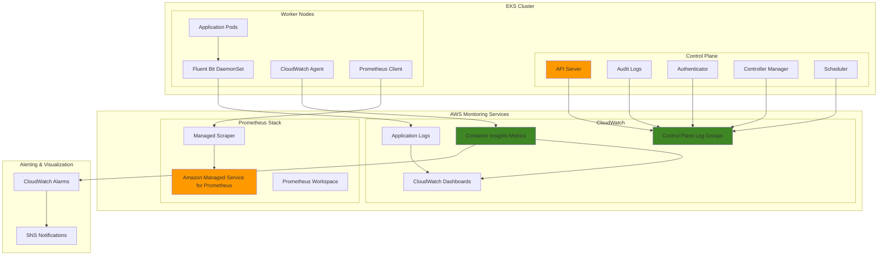

# EKS Logging and Monitoring with Prometheus

## Problem

Enterprise Kubernetes environments running on Amazon EKS require comprehensive observability to ensure application performance, security compliance, and operational visibility. DevOps teams struggle to establish unified logging and monitoring solutions that capture control plane logs, application logs, and infrastructure metrics in a centralized, queryable format. Without proper observability, teams face challenges in troubleshooting issues, identifying performance bottlenecks, and maintaining security postures across their containerized workloads.

## Solution

This recipe implements a comprehensive observability stack for Amazon EKS that combines AWS CloudWatch for centralized logging and Container Insights for infrastructure monitoring with Amazon Managed Service for Prometheus for application metrics collection. The solution enables control plane logging, deploys Fluent Bit for log aggregation, configures Container Insights for enhanced observability, and sets up managed Prometheus scrapers for time-series metrics monitoring.

## Architecture Diagram



## Prerequisites

1. AWS account with appropriate permissions for EKS, CloudWatch, and Prometheus services
2. AWS CLI v2 installed and configured (minimum version 2.15.0)
3. kubectl installed and configured for EKS cluster access (version 1.30+)
4. Basic knowledge of Kubernetes, logging, and monitoring concepts
5. Estimated cost: $75-150/month for small clusters (varies by log volume and metrics retention)

> **Note**: This recipe requires elevated permissions to create IAM roles, EKS clusters, and configure logging services. Ensure your AWS credentials have the necessary permissions outlined in the [EKS service IAM role requirements](https://docs.aws.amazon.com/eks/latest/userguide/service_IAM_role.html).

## Preparation

```bash
# Set environment variables
export AWS_REGION=$(aws configure get region)
export AWS_ACCOUNT_ID=$(aws sts get-caller-identity \
    --query Account --output text)

# Generate unique identifiers for resources
RANDOM_SUFFIX=$(aws secretsmanager get-random-password \
    --exclude-punctuation --exclude-uppercase \
    --password-length 6 --require-each-included-type \
    --output text --query RandomPassword)

export CLUSTER_NAME="eks-observability-cluster-${RANDOM_SUFFIX}"
export NODEGROUP_NAME="eks-observability-nodegroup-${RANDOM_SUFFIX}"
export PROMETHEUS_WORKSPACE_NAME="eks-prometheus-workspace-${RANDOM_SUFFIX}"

# Create VPC and subnet configuration
export VPC_ID=$(aws ec2 create-vpc \
    --cidr-block 10.0.0.0/16 \
    --query 'Vpc.VpcId' --output text)

aws ec2 create-tags \
    --resources $VPC_ID \
    --tags Key=Name,Value=${CLUSTER_NAME}-vpc

aws ec2 modify-vpc-attribute \
    --vpc-id $VPC_ID \
    --enable-dns-hostnames

# Create subnets in different AZs
export SUBNET_1=$(aws ec2 create-subnet \
    --vpc-id $VPC_ID \
    --cidr-block 10.0.1.0/24 \
    --availability-zone ${AWS_REGION}a \
    --query 'Subnet.SubnetId' --output text)

export SUBNET_2=$(aws ec2 create-subnet \
    --vpc-id $VPC_ID \
    --cidr-block 10.0.2.0/24 \
    --availability-zone ${AWS_REGION}b \
    --query 'Subnet.SubnetId' --output text)

aws ec2 create-tags \
    --resources $SUBNET_1 $SUBNET_2 \
    --tags Key=Name,Value=${CLUSTER_NAME}-subnet

# Create and attach internet gateway
export IGW_ID=$(aws ec2 create-internet-gateway \
    --query 'InternetGateway.InternetGatewayId' --output text)

aws ec2 attach-internet-gateway \
    --internet-gateway-id $IGW_ID \
    --vpc-id $VPC_ID

# Create route table and associate with subnets
export ROUTE_TABLE_ID=$(aws ec2 create-route-table \
    --vpc-id $VPC_ID \
    --query 'RouteTable.RouteTableId' --output text)

aws ec2 create-route \
    --route-table-id $ROUTE_TABLE_ID \
    --destination-cidr-block 0.0.0.0/0 \
    --gateway-id $IGW_ID

aws ec2 associate-route-table \
    --route-table-id $ROUTE_TABLE_ID \
    --subnet-id $SUBNET_1

aws ec2 associate-route-table \
    --route-table-id $ROUTE_TABLE_ID \
    --subnet-id $SUBNET_2

# Modify subnet attributes for public access
aws ec2 modify-subnet-attribute \
    --subnet-id $SUBNET_1 \
    --map-public-ip-on-launch

aws ec2 modify-subnet-attribute \
    --subnet-id $SUBNET_2 \
    --map-public-ip-on-launch

echo "✅ VPC and networking setup completed"
echo "VPC ID: $VPC_ID"
echo "Subnet IDs: $SUBNET_1, $SUBNET_2"
```

## Steps

1. **Create EKS Cluster Service Role**:

   IAM service roles enable AWS services to securely perform actions using temporary credentials following the principle of least privilege. EKS requires a service role to manage cluster infrastructure including EC2 instances, security groups, and elastic network interfaces on your behalf.

   ```bash
   # Create IAM role for EKS cluster service
   cat > eks-cluster-role-trust-policy.json << EOF
   {
     "Version": "2012-10-17",
     "Statement": [
       {
         "Effect": "Allow",
         "Principal": {
           "Service": "eks.amazonaws.com"
         },
         "Action": "sts:AssumeRole"
       }
     ]
   }
   EOF
   
   export CLUSTER_ROLE_ARN=$(aws iam create-role \
       --role-name ${CLUSTER_NAME}-service-role \
       --assume-role-policy-document file://eks-cluster-role-trust-policy.json \
       --query 'Role.Arn' --output text)
   
   # Attach required policies
   aws iam attach-role-policy \
       --role-name ${CLUSTER_NAME}-service-role \
       --policy-arn arn:aws:iam::aws:policy/AmazonEKSClusterPolicy
   
   echo "✅ EKS Cluster Service Role created: $CLUSTER_ROLE_ARN"
   ```

   The service role provides EKS with permissions to create and manage AWS resources including load balancers, security groups, and EC2 instances required for cluster operations while maintaining secure, temporary credential access.

2. **Create EKS Cluster with Comprehensive Logging**:

   EKS control plane logging captures detailed audit trails of all API server activities, authentication events, and cluster operations. This logging is essential for security compliance, troubleshooting, and understanding cluster behavior patterns.

   ```bash
   # Create EKS cluster with all control plane logging enabled
   aws eks create-cluster \
       --name $CLUSTER_NAME \
       --version 1.31 \
       --role-arn $CLUSTER_ROLE_ARN \
       --resources-vpc-config subnetIds=$SUBNET_1,$SUBNET_2 \
       --logging '{"clusterLogging":[{"types":["api","audit","authenticator","controllerManager","scheduler"],"enabled":true}]}'
   
   # Wait for cluster to become active
   echo "Waiting for EKS cluster to become active..."
   aws eks wait cluster-active --name $CLUSTER_NAME
   
   # Update kubectl configuration
   aws eks update-kubeconfig --name $CLUSTER_NAME
   
   echo "✅ EKS cluster created with comprehensive logging enabled"
   ```

   The EKS cluster now automatically sends all control plane logs to CloudWatch Logs, providing security teams with detailed audit trails for compliance and operations teams with troubleshooting data.

3. **Create Node Group IAM Role and Deploy Worker Nodes**:

   Worker nodes require specific IAM permissions to join the cluster, pull container images from ECR, and interact with AWS services. The managed node group provides automatic patching and scaling capabilities.

   ```bash
   # Create IAM role for worker nodes
   cat > node-group-role-trust-policy.json << EOF
   {
     "Version": "2012-10-17",
     "Statement": [
       {
         "Effect": "Allow",
         "Principal": {
           "Service": "ec2.amazonaws.com"
         },
         "Action": "sts:AssumeRole"
       }
     ]
   }
   EOF
   
   export NODE_ROLE_ARN=$(aws iam create-role \
       --role-name ${CLUSTER_NAME}-node-role \
       --assume-role-policy-document file://node-group-role-trust-policy.json \
       --query 'Role.Arn' --output text)
   
   # Attach required policies for worker nodes
   aws iam attach-role-policy \
       --role-name ${CLUSTER_NAME}-node-role \
       --policy-arn arn:aws:iam::aws:policy/AmazonEKSWorkerNodePolicy
   
   aws iam attach-role-policy \
       --role-name ${CLUSTER_NAME}-node-role \
       --policy-arn arn:aws:iam::aws:policy/AmazonEKS_CNI_Policy
   
   aws iam attach-role-policy \
       --role-name ${CLUSTER_NAME}-node-role \
       --policy-arn arn:aws:iam::aws:policy/AmazonEC2ContainerRegistryReadOnly
   
   # Create managed node group
   aws eks create-nodegroup \
       --cluster-name $CLUSTER_NAME \
       --nodegroup-name $NODEGROUP_NAME \
       --node-role $NODE_ROLE_ARN \
       --subnets $SUBNET_1 $SUBNET_2 \
       --instance-types t3.medium \
       --scaling-config minSize=2,maxSize=4,desiredSize=2 \
       --ami-type AL2023_x86_64_STANDARD
   
   # Wait for node group to become active
   echo "Waiting for node group to become active..."
   aws eks wait nodegroup-active \
       --cluster-name $CLUSTER_NAME \
       --nodegroup-name $NODEGROUP_NAME
   
   echo "✅ EKS node group created and ready"
   ```

   The worker nodes are now active with Amazon Linux 2023 AMI and have the necessary permissions to run container workloads, pull images, and communicate with the cluster control plane.

4. **Create OIDC Identity Provider for Service Accounts**:

   IAM roles for service accounts (IRSA) enables secure authentication between Kubernetes service accounts and AWS services without storing long-term credentials in the cluster.

   ```bash
   # Create OIDC identity provider for the cluster
   export OIDC_ISSUER=$(aws eks describe-cluster \
       --name $CLUSTER_NAME \
       --query 'cluster.identity.oidc.issuer' \
       --output text | sed 's|https://||')
   
   # Check if OIDC provider already exists
   if ! aws iam list-open-id-connect-providers \
       --query "OpenIDConnectProviderList[?ends_with(Arn, '$OIDC_ISSUER')]" \
       --output text | grep -q $OIDC_ISSUER; then
       
       # Get the certificate thumbprint
       THUMBPRINT=$(echo | openssl s_client -servername oidc.eks.${AWS_REGION}.amazonaws.com -showcerts -connect oidc.eks.${AWS_REGION}.amazonaws.com:443 2>&- | tac | sed -n '/-----END CERTIFICATE-----/,/-----BEGIN CERTIFICATE-----/p; /-----BEGIN CERTIFICATE-----/q' | tac | openssl x509 -fingerprint -noout | sed 's/.*=//; s/://g')
       
       # Create OIDC identity provider
       aws iam create-open-id-connect-provider \
           --url https://${OIDC_ISSUER} \
           --client-id-list sts.amazonaws.com \
           --thumbprint-list ${THUMBPRINT}
   fi
   
   echo "✅ OIDC identity provider configured"
   ```

   The OIDC identity provider enables secure, temporary credential delegation between Kubernetes service accounts and AWS IAM roles, eliminating the need for long-term AWS credentials in pods.

5. **Deploy Fluent Bit for Log Collection**:

   Fluent Bit efficiently collects, parses, and forwards container logs to CloudWatch Logs with minimal resource overhead. It runs as a DaemonSet to ensure comprehensive log collection from all containers.

   ```bash
   # Create namespace for Amazon CloudWatch
   kubectl create namespace amazon-cloudwatch
   
   # Create service account for Fluent Bit
   cat > fluent-bit-service-account.yaml << EOF
   apiVersion: v1
   kind: ServiceAccount
   metadata:
     name: fluent-bit
     namespace: amazon-cloudwatch
   EOF
   
   kubectl apply -f fluent-bit-service-account.yaml
   
   # Create IAM role for Fluent Bit
   cat > fluent-bit-role-trust-policy.json << EOF
   {
     "Version": "2012-10-17",
     "Statement": [
       {
         "Effect": "Allow",
         "Principal": {
           "Federated": "arn:aws:iam::${AWS_ACCOUNT_ID}:oidc-provider/${OIDC_ISSUER}"
         },
         "Action": "sts:AssumeRoleWithWebIdentity",
         "Condition": {
           "StringEquals": {
             "${OIDC_ISSUER}:sub": "system:serviceaccount:amazon-cloudwatch:fluent-bit",
             "${OIDC_ISSUER}:aud": "sts.amazonaws.com"
           }
         }
       }
     ]
   }
   EOF
   
   export FLUENT_BIT_ROLE_ARN=$(aws iam create-role \
       --role-name ${CLUSTER_NAME}-fluent-bit-role \
       --assume-role-policy-document file://fluent-bit-role-trust-policy.json \
       --query 'Role.Arn' --output text)
   
   # Attach CloudWatch Logs policy
   aws iam attach-role-policy \
       --role-name ${CLUSTER_NAME}-fluent-bit-role \
       --policy-arn arn:aws:iam::aws:policy/CloudWatchLogsFullAccess
   
   # Annotate service account with IAM role
   kubectl annotate serviceaccount fluent-bit \
       -n amazon-cloudwatch \
       eks.amazonaws.com/role-arn=$FLUENT_BIT_ROLE_ARN
   
   # Deploy Fluent Bit using the official AWS manifest
   kubectl apply -f https://raw.githubusercontent.com/aws-samples/amazon-cloudwatch-container-insights/latest/k8s-deployment-manifest-templates/deployment-mode/daemonset/container-insights-monitoring/fluent-bit/fluent-bit.yaml
   
   echo "✅ Fluent Bit deployed for log collection"
   ```

   Fluent Bit is now collecting logs from all containers and forwarding them to CloudWatch Logs with automatic log group creation and Kubernetes metadata enrichment.

6. **Deploy CloudWatch Agent for Container Insights**:

   The CloudWatch agent collects detailed performance metrics from containers and infrastructure, providing insights into CPU, memory, disk, and network utilization patterns for capacity planning and performance optimization.

   ```bash
   # Create service account for CloudWatch agent
   cat > cloudwatch-agent-service-account.yaml << EOF
   apiVersion: v1
   kind: ServiceAccount
   metadata:
     name: cloudwatch-agent
     namespace: amazon-cloudwatch
   EOF
   
   kubectl apply -f cloudwatch-agent-service-account.yaml
   
   # Create IAM role for CloudWatch agent
   cat > cloudwatch-agent-role-trust-policy.json << EOF
   {
     "Version": "2012-10-17",
     "Statement": [
       {
         "Effect": "Allow",
         "Principal": {
           "Federated": "arn:aws:iam::${AWS_ACCOUNT_ID}:oidc-provider/${OIDC_ISSUER}"
         },
         "Action": "sts:AssumeRoleWithWebIdentity",
         "Condition": {
           "StringEquals": {
             "${OIDC_ISSUER}:sub": "system:serviceaccount:amazon-cloudwatch:cloudwatch-agent",
             "${OIDC_ISSUER}:aud": "sts.amazonaws.com"
           }
         }
       }
     ]
   }
   EOF
   
   export CLOUDWATCH_AGENT_ROLE_ARN=$(aws iam create-role \
       --role-name ${CLUSTER_NAME}-cloudwatch-agent-role \
       --assume-role-policy-document file://cloudwatch-agent-role-trust-policy.json \
       --query 'Role.Arn' --output text)
   
   # Attach CloudWatch agent policy
   aws iam attach-role-policy \
       --role-name ${CLUSTER_NAME}-cloudwatch-agent-role \
       --policy-arn arn:aws:iam::aws:policy/CloudWatchAgentServerPolicy
   
   # Annotate service account with IAM role
   kubectl annotate serviceaccount cloudwatch-agent \
       -n amazon-cloudwatch \
       eks.amazonaws.com/role-arn=$CLOUDWATCH_AGENT_ROLE_ARN
   
   # Deploy CloudWatch agent using the official AWS manifest
   kubectl apply -f https://raw.githubusercontent.com/aws-samples/amazon-cloudwatch-container-insights/latest/k8s-deployment-manifest-templates/deployment-mode/daemonset/container-insights-monitoring/cloudwatch-namespace.yaml
   
   kubectl apply -f https://raw.githubusercontent.com/aws-samples/amazon-cloudwatch-container-insights/latest/k8s-deployment-manifest-templates/deployment-mode/daemonset/container-insights-monitoring/cwagent/cwagent-serviceaccount.yaml
   
   # Set cluster name in the configmap
   curl https://raw.githubusercontent.com/aws-samples/amazon-cloudwatch-container-insights/latest/k8s-deployment-manifest-templates/deployment-mode/daemonset/container-insights-monitoring/cwagent/cwagent-configmap.yaml | \
   sed "s/{{cluster_name}}/${CLUSTER_NAME}/;s/{{region_name}}/${AWS_REGION}/" | \
   kubectl apply -f -
   
   kubectl apply -f https://raw.githubusercontent.com/aws-samples/amazon-cloudwatch-container-insights/latest/k8s-deployment-manifest-templates/deployment-mode/daemonset/container-insights-monitoring/cwagent/cwagent-daemonset.yaml
   
   echo "✅ CloudWatch agent deployed for Container Insights"
   ```

   Container Insights metrics collection is now active, providing comprehensive performance data for monitoring dashboards and alerting systems.

7. **Create Amazon Managed Service for Prometheus Workspace**:

   Amazon Managed Service for Prometheus provides fully managed, highly available Prometheus-compatible monitoring with automatic scaling, patching, and backup without operational overhead.

   ```bash
   # Create Prometheus workspace
   export PROMETHEUS_WORKSPACE_ID=$(aws amp create-workspace \
       --alias $PROMETHEUS_WORKSPACE_NAME \
       --query 'workspaceId' --output text)
   
   echo "Waiting for Prometheus workspace to become active..."
   aws amp wait workspace-active --workspace-id $PROMETHEUS_WORKSPACE_ID
   
   echo "✅ Prometheus workspace created: $PROMETHEUS_WORKSPACE_ID"
   echo "Workspace endpoint: https://aps-workspaces.${AWS_REGION}.amazonaws.com/workspaces/${PROMETHEUS_WORKSPACE_ID}/"
   ```

   The Prometheus workspace is ready to receive time-series metrics with enterprise-grade reliability, security, and automatic management by AWS.

8. **Deploy Prometheus Scraper Configuration**:

   The managed Prometheus scraper automatically discovers and collects metrics from EKS clusters using Kubernetes service discovery, eliminating the need to manage Prometheus server infrastructure.

   ```bash
   # Create scraper configuration
   cat > prometheus-scraper-config.yaml << EOF
   global:
     scrape_interval: 30s
     evaluation_interval: 30s
   
   scrape_configs:
   - job_name: 'kubernetes-apiservers'
     kubernetes_sd_configs:
     - role: endpoints
       namespaces:
         names:
         - default
     scheme: https
     tls_config:
       ca_file: /var/run/secrets/kubernetes.io/serviceaccount/ca.crt
       insecure_skip_verify: true
     bearer_token_file: /var/run/secrets/kubernetes.io/serviceaccount/token
     relabel_configs:
     - source_labels: [__meta_kubernetes_namespace, __meta_kubernetes_service_name, __meta_kubernetes_endpoint_port_name]
       action: keep
       regex: default;kubernetes;https
   
   - job_name: 'kubernetes-nodes'
     kubernetes_sd_configs:
     - role: node
     scheme: https
     tls_config:
       ca_file: /var/run/secrets/kubernetes.io/serviceaccount/ca.crt
       insecure_skip_verify: true
     bearer_token_file: /var/run/secrets/kubernetes.io/serviceaccount/token
     relabel_configs:
     - action: labelmap
       regex: __meta_kubernetes_node_label_(.+)
     - target_label: __address__
       replacement: kubernetes.default.svc:443
     - source_labels: [__meta_kubernetes_node_name]
       regex: (.+)
       target_label: __metrics_path__
       replacement: /api/v1/nodes/\${1}/proxy/metrics
   
   - job_name: 'kubernetes-cadvisor'
     kubernetes_sd_configs:
     - role: node
     scheme: https
     tls_config:
       ca_file: /var/run/secrets/kubernetes.io/serviceaccount/ca.crt
       insecure_skip_verify: true
     bearer_token_file: /var/run/secrets/kubernetes.io/serviceaccount/token
     relabel_configs:
     - action: labelmap
       regex: __meta_kubernetes_node_label_(.+)
     - target_label: __address__
       replacement: kubernetes.default.svc:443
     - source_labels: [__meta_kubernetes_node_name]
       regex: (.+)
       target_label: __metrics_path__
       replacement: /api/v1/nodes/\${1}/proxy/metrics/cadvisor
   EOF
   
   # Create Prometheus scraper
   export SCRAPER_ID=$(aws amp create-scraper \
       --alias ${CLUSTER_NAME}-prometheus-scraper \
       --scrape-configuration 'configurationBlob=file://prometheus-scraper-config.yaml' \
       --source 'eksConfiguration={clusterArn=arn:aws:eks:'${AWS_REGION}':'${AWS_ACCOUNT_ID}':cluster/'${CLUSTER_NAME}',subnetIds=['${SUBNET_1}','${SUBNET_2}']}' \
       --destination 'ampConfiguration={workspaceArn=arn:aws:aps:'${AWS_REGION}':'${AWS_ACCOUNT_ID}':workspace/'${PROMETHEUS_WORKSPACE_ID}'}' \
       --query 'scraperId' --output text)
   
   echo "✅ Prometheus scraper created: $SCRAPER_ID"
   ```

   The Prometheus scraper is actively collecting metrics from the Kubernetes API server, nodes, and cAdvisor, providing comprehensive infrastructure and container metrics.

9. **Create CloudWatch Dashboards**:

   CloudWatch dashboards provide centralized visualization combining Container Insights data with control plane logs for comprehensive operational visibility and rapid issue identification.

   ```bash
   # Create comprehensive CloudWatch dashboard
   cat > cloudwatch-dashboard.json << EOF
   {
     "widgets": [
       {
         "type": "metric",
         "x": 0,
         "y": 0,
         "width": 12,
         "height": 6,
         "properties": {
           "metrics": [
             [ "ContainerInsights", "cluster_node_count", "ClusterName", "${CLUSTER_NAME}" ],
             [ ".", "cluster_node_running_count", ".", "." ],
             [ ".", "cluster_node_failed_count", ".", "." ]
           ],
           "view": "timeSeries",
           "stacked": false,
           "region": "${AWS_REGION}",
           "title": "EKS Cluster Node Status",
           "period": 300
         }
       },
       {
         "type": "metric",
         "x": 12,
         "y": 0,
         "width": 12,
         "height": 6,
         "properties": {
           "metrics": [
             [ "ContainerInsights", "pod_running", "ClusterName", "${CLUSTER_NAME}" ],
             [ ".", "pod_pending", ".", "." ],
             [ ".", "pod_failed", ".", "." ]
           ],
           "view": "timeSeries",
           "stacked": false,
           "region": "${AWS_REGION}",
           "title": "EKS Cluster Pod Status",
           "period": 300
         }
       },
       {
         "type": "metric",
         "x": 0,
         "y": 6,
         "width": 12,
         "height": 6,
         "properties": {
           "metrics": [
             [ "ContainerInsights", "node_cpu_utilization", "ClusterName", "${CLUSTER_NAME}" ],
             [ ".", "node_memory_utilization", ".", "." ],
             [ ".", "node_filesystem_utilization", ".", "." ]
           ],
           "view": "timeSeries",
           "stacked": false,
           "region": "${AWS_REGION}",
           "title": "Node Resource Utilization",
           "period": 300
         }
       },
       {
         "type": "log",
         "x": 12,
         "y": 6,
         "width": 12,
         "height": 6,
         "properties": {
           "query": "SOURCE '/aws/eks/${CLUSTER_NAME}/cluster' | fields @timestamp, @message\\n| filter @message like /ERROR/\\n| sort @timestamp desc\\n| limit 20",
           "region": "${AWS_REGION}",
           "title": "EKS Control Plane Errors",
           "view": "table"
         }
       }
     ]
   }
   EOF
   
   aws cloudwatch put-dashboard \
       --dashboard-name "${CLUSTER_NAME}-observability" \
       --dashboard-body file://cloudwatch-dashboard.json
   
   echo "✅ CloudWatch dashboard created"
   echo "Dashboard URL: https://${AWS_REGION}.console.aws.amazon.com/cloudwatch/home?region=${AWS_REGION}#dashboards:name=${CLUSTER_NAME}-observability"
   ```

   The CloudWatch dashboard provides real-time visibility into cluster health, resource utilization, and control plane errors for rapid operational issue identification.

10. **Deploy Sample Application with Prometheus Metrics**:

    A sample application demonstrates how to expose custom metrics that are automatically discovered and scraped by the Prometheus scraper for application-level observability.

    ```bash
    # Deploy sample application with Prometheus metrics
    cat > sample-app-with-metrics.yaml << EOF
    apiVersion: apps/v1
    kind: Deployment
    metadata:
      name: sample-app
      namespace: default
    spec:
      replicas: 2
      selector:
        matchLabels:
          app: sample-app
      template:
        metadata:
          labels:
            app: sample-app
          annotations:
            prometheus.io/scrape: "true"
            prometheus.io/port: "8080"
            prometheus.io/path: "/metrics"
        spec:
          containers:
          - name: sample-app
            image: prom/node-exporter:latest
            ports:
            - containerPort: 9100
              name: metrics
            resources:
              requests:
                cpu: 100m
                memory: 128Mi
              limits:
                cpu: 200m
                memory: 256Mi
    ---
    apiVersion: v1
    kind: Service
    metadata:
      name: sample-app-service
      namespace: default
      annotations:
        prometheus.io/scrape: "true"
        prometheus.io/port: "9100"
    spec:
      selector:
        app: sample-app
      ports:
      - name: metrics
        port: 9100
        targetPort: 9100
      type: ClusterIP
    EOF
    
    kubectl apply -f sample-app-with-metrics.yaml
    
    echo "✅ Sample application with Prometheus metrics deployed"
    ```

    The sample application exposes node exporter metrics that are automatically discovered and scraped by the Prometheus scraper, demonstrating application-specific monitoring capabilities.

11. **Configure CloudWatch Alarms**:

    CloudWatch alarms provide automated alerting based on metric thresholds, enabling proactive responses to performance issues and capacity constraints before they impact end users.

    ```bash
    # Create SNS topic for alerts
    export SNS_TOPIC_ARN=$(aws sns create-topic \
        --name ${CLUSTER_NAME}-alerts \
        --query 'TopicArn' --output text)
    
    # Create CloudWatch alarms for key metrics
    aws cloudwatch put-metric-alarm \
        --alarm-name "${CLUSTER_NAME}-high-cpu-utilization" \
        --alarm-description "High CPU utilization in EKS cluster" \
        --metric-name node_cpu_utilization \
        --namespace ContainerInsights \
        --statistic Average \
        --period 300 \
        --threshold 80 \
        --comparison-operator GreaterThanThreshold \
        --evaluation-periods 2 \
        --alarm-actions $SNS_TOPIC_ARN \
        --dimensions Name=ClusterName,Value=${CLUSTER_NAME}
    
    aws cloudwatch put-metric-alarm \
        --alarm-name "${CLUSTER_NAME}-high-memory-utilization" \
        --alarm-description "High memory utilization in EKS cluster" \
        --metric-name node_memory_utilization \
        --namespace ContainerInsights \
        --statistic Average \
        --period 300 \
        --threshold 80 \
        --comparison-operator GreaterThanThreshold \
        --evaluation-periods 2 \
        --alarm-actions $SNS_TOPIC_ARN \
        --dimensions Name=ClusterName,Value=${CLUSTER_NAME}
    
    aws cloudwatch put-metric-alarm \
        --alarm-name "${CLUSTER_NAME}-high-failed-pods" \
        --alarm-description "High number of failed pods in EKS cluster" \
        --metric-name pod_failed \
        --namespace ContainerInsights \
        --statistic Average \
        --period 300 \
        --threshold 5 \
        --comparison-operator GreaterThanThreshold \
        --evaluation-periods 1 \
        --alarm-actions $SNS_TOPIC_ARN \
        --dimensions Name=ClusterName,Value=${CLUSTER_NAME}
    
    echo "✅ CloudWatch alarms configured for key metrics"
    echo "SNS Topic ARN: $SNS_TOPIC_ARN"
    ```

    CloudWatch alarms monitor critical cluster metrics and trigger SNS notifications when thresholds are exceeded, enabling proactive incident response and optimal cluster performance maintenance.

## Validation & Testing

1. **Verify EKS Cluster Status**:

   ```bash
   # Check cluster status
   aws eks describe-cluster --name $CLUSTER_NAME \
       --query 'cluster.status' --output text
   
   # Verify control plane logging is enabled
   aws eks describe-cluster --name $CLUSTER_NAME \
       --query 'cluster.logging' --output json
   ```

   Expected output: Cluster status should be "ACTIVE" and logging should show all log types enabled.

2. **Test Kubernetes Connectivity**:

   ```bash
   # Test kubectl connectivity
   kubectl get nodes
   kubectl get pods --all-namespaces
   
   # Check monitoring pods
   kubectl get pods -n amazon-cloudwatch
   ```

   Expected output: All nodes should show "Ready" status, and monitoring pods should be running.

3. **Verify CloudWatch Logs**:

   ```bash
   # Check if log groups are created
   aws logs describe-log-groups \
       --log-group-name-prefix "/aws/eks/${CLUSTER_NAME}" \
       --query 'logGroups[].logGroupName' --output table
   
   # Check application logs
   aws logs describe-log-groups \
       --log-group-name-prefix "/aws/containerinsights/${CLUSTER_NAME}" \
       --query 'logGroups[].logGroupName' --output table
   ```

   Expected output: Should show control plane log groups and Container Insights log groups.

4. **Test Prometheus Metrics Collection**:

   ```bash
   # Check Prometheus workspace status
   aws amp describe-workspace --workspace-id $PROMETHEUS_WORKSPACE_ID \
       --query 'workspace.status' --output text
   
   # Verify scraper status
   aws amp describe-scraper --scraper-id $SCRAPER_ID \
       --query 'scraper.status' --output text
   ```

   Expected output: Workspace should be "ACTIVE" and scraper should be "ACTIVE".

5. **Verify Container Insights Metrics**:

   ```bash
   # Check Container Insights metrics
   aws cloudwatch get-metric-statistics \
       --namespace ContainerInsights \
       --metric-name cluster_node_count \
       --dimensions Name=ClusterName,Value=${CLUSTER_NAME} \
       --statistics Average \
       --start-time $(date -d '1 hour ago' -u +%Y-%m-%dT%H:%M:%S) \
       --end-time $(date -u +%Y-%m-%dT%H:%M:%S) \
       --period 300
   ```

   Expected output: Should return metric data points for cluster node count.

## Cleanup

1. **Delete CloudWatch Alarms and SNS Topic**:

   ```bash
   # Delete all alarms for the cluster
   aws cloudwatch delete-alarms \
       --alarm-names "${CLUSTER_NAME}-high-cpu-utilization" \
       "${CLUSTER_NAME}-high-memory-utilization" \
       "${CLUSTER_NAME}-high-failed-pods"
   
   # Delete SNS topic
   aws sns delete-topic --topic-arn $SNS_TOPIC_ARN
   
   echo "✅ CloudWatch alarms and SNS topic deleted"
   ```

2. **Delete CloudWatch Dashboard**:

   ```bash
   # Delete the dashboard
   aws cloudwatch delete-dashboards \
       --dashboard-names "${CLUSTER_NAME}-observability"
   
   echo "✅ CloudWatch dashboard deleted"
   ```

3. **Delete Prometheus Resources**:

   ```bash
   # Delete Prometheus scraper
   aws amp delete-scraper --scraper-id $SCRAPER_ID
   
   # Delete Prometheus workspace
   aws amp delete-workspace --workspace-id $PROMETHEUS_WORKSPACE_ID
   
   echo "✅ Prometheus resources deleted"
   ```

4. **Delete Kubernetes Resources**:

   ```bash
   # Delete sample application
   kubectl delete -f sample-app-with-metrics.yaml
   
   # Delete monitoring namespace (this removes all resources)
   kubectl delete namespace amazon-cloudwatch
   
   echo "✅ Kubernetes resources deleted"
   ```

5. **Delete EKS Cluster and Node Group**:

   ```bash
   # Delete node group
   aws eks delete-nodegroup \
       --cluster-name $CLUSTER_NAME \
       --nodegroup-name $NODEGROUP_NAME
   
   # Wait for node group deletion
   aws eks wait nodegroup-deleted \
       --cluster-name $CLUSTER_NAME \
       --nodegroup-name $NODEGROUP_NAME
   
   # Delete cluster
   aws eks delete-cluster --name $CLUSTER_NAME
   
   # Wait for cluster deletion
   aws eks wait cluster-deleted --name $CLUSTER_NAME
   
   echo "✅ EKS cluster and node group deleted"
   ```

6. **Delete IAM Roles**:

   ```bash
   # Detach and delete cluster service role
   aws iam detach-role-policy \
       --role-name ${CLUSTER_NAME}-service-role \
       --policy-arn arn:aws:iam::aws:policy/AmazonEKSClusterPolicy
   
   aws iam delete-role --role-name ${CLUSTER_NAME}-service-role
   
   # Detach and delete node group role
   aws iam detach-role-policy \
       --role-name ${CLUSTER_NAME}-node-role \
       --policy-arn arn:aws:iam::aws:policy/AmazonEKSWorkerNodePolicy
   
   aws iam detach-role-policy \
       --role-name ${CLUSTER_NAME}-node-role \
       --policy-arn arn:aws:iam::aws:policy/AmazonEKS_CNI_Policy
   
   aws iam detach-role-policy \
       --role-name ${CLUSTER_NAME}-node-role \
       --policy-arn arn:aws:iam::aws:policy/AmazonEC2ContainerRegistryReadOnly
   
   aws iam delete-role --role-name ${CLUSTER_NAME}-node-role
   
   # Delete Fluent Bit role
   aws iam detach-role-policy \
       --role-name ${CLUSTER_NAME}-fluent-bit-role \
       --policy-arn arn:aws:iam::aws:policy/CloudWatchLogsFullAccess
   
   aws iam delete-role --role-name ${CLUSTER_NAME}-fluent-bit-role
   
   # Delete CloudWatch agent role
   aws iam detach-role-policy \
       --role-name ${CLUSTER_NAME}-cloudwatch-agent-role \
       --policy-arn arn:aws:iam::aws:policy/CloudWatchAgentServerPolicy
   
   aws iam delete-role --role-name ${CLUSTER_NAME}-cloudwatch-agent-role
   
   echo "✅ IAM roles deleted"
   ```

7. **Delete VPC and Networking Resources**:

   ```bash
   # Delete route table associations and routes
   ASSOCIATION_IDS=$(aws ec2 describe-route-tables \
       --route-table-ids $ROUTE_TABLE_ID \
       --query 'RouteTables[0].Associations[?Main==`false`].RouteTableAssociationId' \
       --output text)
   
   for ASSOC_ID in $ASSOCIATION_IDS; do
       aws ec2 disassociate-route-table --association-id $ASSOC_ID
   done
   
   # Delete route table
   aws ec2 delete-route-table --route-table-id $ROUTE_TABLE_ID
   
   # Detach and delete internet gateway
   aws ec2 detach-internet-gateway \
       --internet-gateway-id $IGW_ID \
       --vpc-id $VPC_ID
   
   aws ec2 delete-internet-gateway --internet-gateway-id $IGW_ID
   
   # Delete subnets
   aws ec2 delete-subnet --subnet-id $SUBNET_1
   aws ec2 delete-subnet --subnet-id $SUBNET_2
   
   # Delete VPC
   aws ec2 delete-vpc --vpc-id $VPC_ID
   
   # Clean up configuration files
   rm -f eks-cluster-role-trust-policy.json
   rm -f node-group-role-trust-policy.json
   rm -f fluent-bit-role-trust-policy.json
   rm -f cloudwatch-agent-role-trust-policy.json
   rm -f fluent-bit-service-account.yaml
   rm -f cloudwatch-agent-service-account.yaml
   rm -f prometheus-scraper-config.yaml
   rm -f cloudwatch-dashboard.json
   rm -f sample-app-with-metrics.yaml
   
   echo "✅ VPC and networking resources deleted"
   ```

## Discussion

This comprehensive observability solution for Amazon EKS demonstrates enterprise-grade logging and monitoring using AWS native services following the [AWS Well-Architected Framework](https://docs.aws.amazon.com/wellarchitected/latest/framework/welcome.html). The architecture combines multiple data collection methods to provide complete visibility into cluster operations, application performance, and infrastructure health.

The solution leverages [EKS control plane logging](https://docs.aws.amazon.com/eks/latest/userguide/control-plane-logs.html) to capture all API server activities, audit events, and authentication attempts. This provides security teams with detailed audit trails for compliance requirements while enabling operations teams to troubleshoot cluster issues. [Fluent Bit integration](https://docs.aws.amazon.com/AmazonCloudWatch/latest/monitoring/Container-Insights-setup-logs-FluentBit.html) acts as a lightweight log processor that efficiently collects and forwards container logs to CloudWatch Logs, while [Container Insights](https://docs.aws.amazon.com/AmazonCloudWatch/latest/monitoring/ContainerInsights.html) provides deep visibility into cluster resource utilization and performance metrics.

[Amazon Managed Service for Prometheus](https://docs.aws.amazon.com/prometheus/latest/userguide/what-is-Amazon-Managed-Service-Prometheus.html) offers a fully managed solution for collecting and storing time-series metrics from Kubernetes workloads. Unlike self-managed Prometheus installations, the managed service handles scaling, availability, and maintenance automatically while providing enterprise-grade reliability and security. The integration with EKS through managed collectors simplifies configuration and reduces operational overhead.

The observability stack includes pre-configured dashboards and alerts that provide immediate operational value. CloudWatch Logs Insights enables powerful log analysis capabilities, while the combination of CloudWatch metrics and Prometheus data provides comprehensive monitoring coverage. This dual approach ensures teams can leverage both AWS native tooling and open-source monitoring standards.

> **Warning**: Monitor your log volumes and metrics retention policies carefully, as CloudWatch Logs and Container Insights can generate significant costs with high-volume applications. Implement log filtering and metric aggregation strategies to optimize costs. Review the [CloudWatch pricing documentation](https://aws.amazon.com/cloudwatch/pricing/) for cost optimization guidance.

> **Tip**: Use CloudWatch Logs Insights for ad-hoc analysis and create custom metrics for business-specific KPIs. Consider integrating with Amazon Managed Grafana for advanced visualization capabilities. Regularly review [IAM security best practices](https://docs.aws.amazon.com/IAM/latest/UserGuide/best-practices.html) to ensure your monitoring infrastructure follows the principle of least privilege.

## Challenge

Extend this observability solution by implementing these advanced monitoring capabilities:

1. **Implement distributed tracing** with AWS X-Ray to track request flows across microservices, integrating with existing logging infrastructure for correlated observability and end-to-end transaction monitoring.

2. **Deploy Amazon Managed Grafana** to create custom dashboards combining CloudWatch metrics with Prometheus data, providing unified visualization and advanced alerting capabilities for both infrastructure and application metrics.

3. **Configure advanced alerting** with multi-dimensional CloudWatch alarms and Prometheus AlertManager rules, implementing escalation policies with AWS Systems Manager Incident Manager for critical incidents.

4. **Implement log anomaly detection** using CloudWatch Logs Insights and Amazon OpenSearch Service with machine learning to automatically identify unusual patterns in application logs and system events.

5. **Create automated remediation workflows** using AWS Lambda and Step Functions triggered by CloudWatch alarms, implementing self-healing capabilities for common cluster issues like pod restarts and resource scaling.

## Infrastructure Code

*Infrastructure code will be generated after recipe approval.*