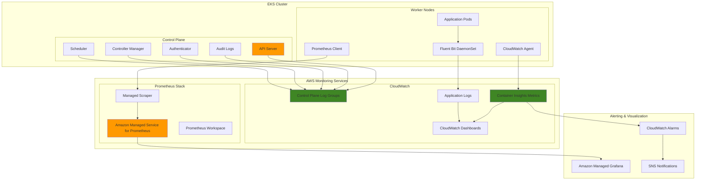

# EKS Logging and Monitoring with Prometheus

## Problem

Enterprise Kubernetes environments running on Amazon EKS require comprehensive observability to ensure application performance, security compliance, and operational visibility. DevOps teams struggle to establish unified logging and monitoring solutions that capture control plane logs, application logs, and infrastructure metrics in a centralized, queryable format. Without proper observability, teams face challenges in troubleshooting issues, identifying performance bottlenecks, and maintaining security postures across their containerized workloads.

## Solution

This recipe implements a comprehensive observability stack for Amazon EKS that combines AWS CloudWatch for centralized logging and Container Insights for infrastructure monitoring with Prometheus for application metrics collection. The solution enables control plane logging, deploys Fluent Bit for log aggregation, configures Container Insights for enhanced observability, and sets up Prometheus with AWS Managed Service for time-series metrics monitoring.

## Architecture Diagram



## Prerequisites

1. AWS account with appropriate permissions for EKS, CloudWatch, and Prometheus services
2. AWS CLI v2 installed and configured (minimum version 2.0.0)
3. kubectl installed and configured for EKS cluster access
4. eksctl installed for EKS cluster management (optional but recommended)
5. Basic knowledge of Kubernetes, logging, and monitoring concepts
6. Estimated cost: $50-100/month for small clusters (varies by log volume and metrics retention)

> **Note**: This recipe requires elevated permissions to create IAM roles, EKS clusters, and configure logging services. Ensure your AWS credentials have the necessary permissions outlined in the [IAM best practices guide](https://docs.aws.amazon.com/IAM/latest/UserGuide/best-practices.html).

## Preparation

```bash
# Set environment variables
export AWS_REGION=$(aws configure get region)
export AWS_ACCOUNT_ID=$(aws sts get-caller-identity \
    --query Account --output text)

# Generate unique identifiers for resources
RANDOM_SUFFIX=$(aws secretsmanager get-random-password \
    --exclude-punctuation --exclude-uppercase \
    --password-length 6 --require-each-included-type \
    --output text --query RandomPassword)

export CLUSTER_NAME="eks-observability-cluster-${RANDOM_SUFFIX}"
export NODEGROUP_NAME="eks-observability-nodegroup-${RANDOM_SUFFIX}"
export PROMETHEUS_WORKSPACE_NAME="eks-prometheus-workspace-${RANDOM_SUFFIX}"

# Create VPC and subnet configuration
export VPC_ID=$(aws ec2 create-vpc \
    --cidr-block 10.0.0.0/16 \
    --query 'Vpc.VpcId' --output text)

aws ec2 create-tags \
    --resources $VPC_ID \
    --tags Key=Name,Value=${CLUSTER_NAME}-vpc

aws ec2 modify-vpc-attribute \
    --vpc-id $VPC_ID \
    --enable-dns-hostnames

# Create subnets in different AZs
export SUBNET_1=$(aws ec2 create-subnet \
    --vpc-id $VPC_ID \
    --cidr-block 10.0.1.0/24 \
    --availability-zone ${AWS_REGION}a \
    --query 'Subnet.SubnetId' --output text)

export SUBNET_2=$(aws ec2 create-subnet \
    --vpc-id $VPC_ID \
    --cidr-block 10.0.2.0/24 \
    --availability-zone ${AWS_REGION}b \
    --query 'Subnet.SubnetId' --output text)

aws ec2 create-tags \
    --resources $SUBNET_1 $SUBNET_2 \
    --tags Key=Name,Value=${CLUSTER_NAME}-subnet

# Create and attach internet gateway
export IGW_ID=$(aws ec2 create-internet-gateway \
    --query 'InternetGateway.InternetGatewayId' --output text)

aws ec2 attach-internet-gateway \
    --internet-gateway-id $IGW_ID \
    --vpc-id $VPC_ID

# Create route table and associate with subnets
export ROUTE_TABLE_ID=$(aws ec2 create-route-table \
    --vpc-id $VPC_ID \
    --query 'RouteTable.RouteTableId' --output text)

aws ec2 create-route \
    --route-table-id $ROUTE_TABLE_ID \
    --destination-cidr-block 0.0.0.0/0 \
    --gateway-id $IGW_ID

aws ec2 associate-route-table \
    --route-table-id $ROUTE_TABLE_ID \
    --subnet-id $SUBNET_1

aws ec2 associate-route-table \
    --route-table-id $ROUTE_TABLE_ID \
    --subnet-id $SUBNET_2

# Modify subnet attributes for public access
aws ec2 modify-subnet-attribute \
    --subnet-id $SUBNET_1 \
    --map-public-ip-on-launch

aws ec2 modify-subnet-attribute \
    --subnet-id $SUBNET_2 \
    --map-public-ip-on-launch

echo "✅ VPC and networking setup completed"
echo "VPC ID: $VPC_ID"
echo "Subnet IDs: $SUBNET_1, $SUBNET_2"
```

## Steps

1. **Create EKS Cluster Service Role**:

   IAM service roles enable AWS services to securely perform actions on your behalf using temporary credentials. Unlike IAM users, service roles don't have permanent credentials and are assumed by trusted entities when needed. This follows the principle of least privilege by granting only the minimum permissions required for EKS to manage your cluster infrastructure.

   ```bash
   # Create IAM role for EKS cluster service
   cat > eks-cluster-role-trust-policy.json << EOF
   {
     "Version": "2012-10-17",
     "Statement": [
       {
         "Effect": "Allow",
         "Principal": {
           "Service": "eks.amazonaws.com"
         },
         "Action": "sts:AssumeRole"
       }
     ]
   }
   EOF
   
   export CLUSTER_ROLE_ARN=$(aws iam create-role \
       --role-name ${CLUSTER_NAME}-service-role \
       --assume-role-policy-document file://eks-cluster-role-trust-policy.json \
       --query 'Role.Arn' --output text)
   
   # Attach required policies
   aws iam attach-role-policy \
       --role-name ${CLUSTER_NAME}-service-role \
       --policy-arn arn:aws:iam::aws:policy/AmazonEKSClusterPolicy
   
   echo "✅ EKS Cluster Service Role created: $CLUSTER_ROLE_ARN"
   ```

   The service role is now established with appropriate permissions to manage the EKS control plane. This role enables EKS to create and manage AWS resources on your behalf, including EC2 instances, security groups, and network interfaces required for cluster operations.

2. **Create EKS Cluster with Comprehensive Logging**:

   EKS control plane logging provides detailed audit trails of all API server activities, authentication events, and cluster operations. Enabling comprehensive logging is essential for security compliance, troubleshooting, and understanding cluster behavior. The logging data is automatically sent to CloudWatch Logs for centralized analysis.

   ```bash
   # Create EKS cluster with all control plane logging enabled
   aws eks create-cluster \
       --name $CLUSTER_NAME \
       --version 1.28 \
       --role-arn $CLUSTER_ROLE_ARN \
       --resources-vpc-config subnetIds=$SUBNET_1,$SUBNET_2 \
       --logging '{"clusterLogging":[{"types":["api","audit","authenticator","controllerManager","scheduler"],"enabled":true}]}'
   
   # Wait for cluster to become active
   echo "Waiting for EKS cluster to become active..."
   aws eks wait cluster-active --name $CLUSTER_NAME
   
   # Update kubectl configuration
   aws eks update-kubeconfig --name $CLUSTER_NAME
   
   echo "✅ EKS cluster created with comprehensive logging enabled"
   ```

   The EKS cluster is now operational with full control plane logging enabled. All API server requests, audit events, authentication attempts, and controller manager activities are being captured and sent to CloudWatch Logs. This provides the foundation for security monitoring and compliance reporting.

3. **Create Node Group IAM Role and Deploy Worker Nodes**:

   Worker nodes require specific IAM permissions to join the cluster, pull container images, and interact with AWS services. The node group IAM role provides these permissions while maintaining security best practices through service-linked roles and managed policies.

   ```bash
   # Create IAM role for worker nodes
   cat > node-group-role-trust-policy.json << EOF
   {
     "Version": "2012-10-17",
     "Statement": [
       {
         "Effect": "Allow",
         "Principal": {
           "Service": "ec2.amazonaws.com"
         },
         "Action": "sts:AssumeRole"
       }
     ]
   }
   EOF
   
   export NODE_ROLE_ARN=$(aws iam create-role \
       --role-name ${CLUSTER_NAME}-node-role \
       --assume-role-policy-document file://node-group-role-trust-policy.json \
       --query 'Role.Arn' --output text)
   
   # Attach required policies for worker nodes
   aws iam attach-role-policy \
       --role-name ${CLUSTER_NAME}-node-role \
       --policy-arn arn:aws:iam::aws:policy/AmazonEKSWorkerNodePolicy
   
   aws iam attach-role-policy \
       --role-name ${CLUSTER_NAME}-node-role \
       --policy-arn arn:aws:iam::aws:policy/AmazonEKS_CNI_Policy
   
   aws iam attach-role-policy \
       --role-name ${CLUSTER_NAME}-node-role \
       --policy-arn arn:aws:iam::aws:policy/AmazonEC2ContainerRegistryReadOnly
   
   # Create managed node group
   aws eks create-nodegroup \
       --cluster-name $CLUSTER_NAME \
       --nodegroup-name $NODEGROUP_NAME \
       --node-role $NODE_ROLE_ARN \
       --subnets $SUBNET_1 $SUBNET_2 \
       --instance-types t3.medium \
       --scaling-config minSize=2,maxSize=4,desiredSize=2 \
       --ami-type AL2_x86_64
   
   # Wait for node group to become active
   echo "Waiting for node group to become active..."
   aws eks wait nodegroup-active \
       --cluster-name $CLUSTER_NAME \
       --nodegroup-name $NODEGROUP_NAME
   
   echo "✅ EKS node group created and ready"
   ```

   The worker node group is now active and ready to run workloads. The nodes have the necessary permissions to join the cluster, pull container images from ECR, and interact with other AWS services. This provides the compute foundation for running monitoring and logging agents.

4. **Deploy CloudWatch Container Insights**:

   Container Insights provides performance monitoring and log collection for containerized applications. It collects metrics at the cluster, node, pod, and container level, providing comprehensive visibility into resource utilization and application performance patterns.

   ```bash
   # Create namespace for Amazon CloudWatch
   kubectl create namespace amazon-cloudwatch
   
   # Create service account for CloudWatch agent
   cat > cloudwatch-agent-service-account.yaml << EOF
   apiVersion: v1
   kind: ServiceAccount
   metadata:
     name: cloudwatch-agent
     namespace: amazon-cloudwatch
   EOF
   
   kubectl apply -f cloudwatch-agent-service-account.yaml
   
   # Create IAM role for CloudWatch agent
   cat > cloudwatch-agent-role-trust-policy.json << EOF
   {
     "Version": "2012-10-17",
     "Statement": [
       {
         "Effect": "Allow",
         "Principal": {
           "Federated": "arn:aws:iam::${AWS_ACCOUNT_ID}:oidc-provider/$(aws eks describe-cluster --name $CLUSTER_NAME --query 'cluster.identity.oidc.issuer' --output text | sed 's|https://||')"
         },
         "Action": "sts:AssumeRoleWithWebIdentity",
         "Condition": {
           "StringEquals": {
             "$(aws eks describe-cluster --name $CLUSTER_NAME --query 'cluster.identity.oidc.issuer' --output text | sed 's|https://||'):sub": "system:serviceaccount:amazon-cloudwatch:cloudwatch-agent"
           }
         }
       }
     ]
   }
   EOF
   
   export CLOUDWATCH_AGENT_ROLE_ARN=$(aws iam create-role \
       --role-name ${CLUSTER_NAME}-cloudwatch-agent-role \
       --assume-role-policy-document file://cloudwatch-agent-role-trust-policy.json \
       --query 'Role.Arn' --output text)
   
   # Attach CloudWatch agent policy
   aws iam attach-role-policy \
       --role-name ${CLUSTER_NAME}-cloudwatch-agent-role \
       --policy-arn arn:aws:iam::aws:policy/CloudWatchAgentServerPolicy
   
   # Annotate service account with IAM role
   kubectl annotate serviceaccount cloudwatch-agent \
       -n amazon-cloudwatch \
       eks.amazonaws.com/role-arn=$CLOUDWATCH_AGENT_ROLE_ARN
   
   echo "✅ CloudWatch agent service account and IAM role configured"
   ```

   The CloudWatch agent infrastructure is now configured with proper IAM permissions using IAM roles for service accounts (IRSA). This enables secure, temporary credential delegation without storing long-term credentials in the cluster, following security best practices for Kubernetes workloads.

5. **Deploy Fluent Bit for Log Collection**:

   Fluent Bit is a lightweight, high-performance log processor that efficiently collects, parses, and forwards container logs to CloudWatch Logs. It runs as a DaemonSet on each worker node to ensure comprehensive log collection from all containers while maintaining minimal resource overhead.

   ```bash
   # Create ConfigMap for Fluent Bit configuration
   cat > fluent-bit-config.yaml << EOF
   apiVersion: v1
   kind: ConfigMap
   metadata:
     name: fluent-bit-config
     namespace: amazon-cloudwatch
   data:
     fluent-bit.conf: |
       [SERVICE]
           Flush                     5
           Grace                     30
           Log_Level                 info
           Daemon                    off
           Parsers_File              parsers.conf
           HTTP_Server               On
           HTTP_Listen               0.0.0.0
           HTTP_Port                 2020
           storage.path              /var/fluent-bit/state/flb-storage/
           storage.sync              normal
           storage.checksum          off
           storage.backlog.mem_limit 5M
       
       [INPUT]
           Name                tail
           Tag                 application.*
           Exclude_Path        /var/log/containers/cloudwatch-agent*, /var/log/containers/fluent-bit*, /var/log/containers/aws-node*, /var/log/containers/kube-proxy*
           Path                /var/log/containers/*.log
           multiline.parser    docker, cri
           DB                  /var/fluent-bit/state/flb_container.db
           Mem_Buf_Limit       50MB
           Skip_Long_Lines     On
           Refresh_Interval    10
           Rotate_Wait         30
           storage.type        filesystem
           Read_from_Head      Off
       
       [INPUT]
           Name                tail
           Tag                 dataplane.systemd.*
           Path                /var/log/journal
           multiline.parser    docker, cri
           DB                  /var/fluent-bit/state/flb_journal.db
           Mem_Buf_Limit       25MB
           Skip_Long_Lines     On
           Refresh_Interval    10
           Read_from_Head      Off
       
       [FILTER]
           Name                kubernetes
           Match               application.*
           Kube_URL            https://kubernetes.default.svc:443
           Kube_Tag_Prefix     application.var.log.containers.
           Merge_Log           On
           Merge_Log_Key       log_processed
           K8S-Logging.Parser  On
           K8S-Logging.Exclude Off
           Labels              Off
           Annotations         Off
           Use_Kubelet         On
           Kubelet_Port        10250
           Buffer_Size         0
       
       [OUTPUT]
           Name                cloudwatch_logs
           Match               application.*
           region              ${AWS_REGION}
           log_group_name      /aws/containerinsights/${CLUSTER_NAME}/application
           log_stream_prefix   \${kubernetes_namespace_name}-
           auto_create_group   On
           extra_user_agent    container-insights
       
       [OUTPUT]
           Name                cloudwatch_logs
           Match               dataplane.systemd.*
           region              ${AWS_REGION}
           log_group_name      /aws/containerinsights/${CLUSTER_NAME}/dataplane
           log_stream_prefix   \${hostname}-
           auto_create_group   On
           extra_user_agent    container-insights
     
     parsers.conf: |
       [PARSER]
           Name                docker
           Format              json
           Time_Key            time
           Time_Format         %Y-%m-%dT%H:%M:%S.%L
           Time_Keep           On
   
       [PARSER]
           Name                cri
           Format              regex
           Regex               ^(?<time>[^ ]+) (?<stream>stdout|stderr) (?<logtag>[^ ]*) (?<message>.*)$
           Time_Key            time
           Time_Format         %Y-%m-%dT%H:%M:%S.%L%z
   EOF
   
   kubectl apply -f fluent-bit-config.yaml
   
   # Deploy Fluent Bit DaemonSet
   cat > fluent-bit-daemonset.yaml << EOF
   apiVersion: apps/v1
   kind: DaemonSet
   metadata:
     name: fluent-bit
     namespace: amazon-cloudwatch
   spec:
     selector:
       matchLabels:
         name: fluent-bit
     template:
       metadata:
         labels:
           name: fluent-bit
       spec:
         serviceAccountName: cloudwatch-agent
         containers:
         - name: fluent-bit
           image: amazon/aws-for-fluent-bit:stable
           imagePullPolicy: Always
           env:
           - name: AWS_REGION
             value: "${AWS_REGION}"
           - name: CLUSTER_NAME
             value: "${CLUSTER_NAME}"
           - name: HTTP_SERVER
             value: "On"
           - name: HTTP_PORT
             value: "2020"
           - name: READ_FROM_HEAD
             value: "Off"
           - name: READ_FROM_TAIL
             value: "On"
           - name: HOST_NAME
             valueFrom:
               fieldRef:
                 fieldPath: spec.nodeName
           - name: HOSTNAME
             valueFrom:
               fieldRef:
                 apiVersion: v1
                 fieldPath: metadata.name
           resources:
             limits:
               memory: 200Mi
             requests:
               cpu: 500m
               memory: 100Mi
           volumeMounts:
           - name: fluentbitstate
             mountPath: /var/fluent-bit/state
           - name: varlog
             mountPath: /var/log
             readOnly: true
           - name: varlibdockercontainers
             mountPath: /var/lib/docker/containers
             readOnly: true
           - name: fluent-bit-config
             mountPath: /fluent-bit/etc/
           - name: runlogjournal
             mountPath: /run/log/journal
             readOnly: true
           - name: dmesg
             mountPath: /var/log/dmesg
             readOnly: true
         terminationGracePeriodSeconds: 10
         volumes:
         - name: fluentbitstate
           hostPath:
             path: /var/fluent-bit/state
         - name: varlog
           hostPath:
             path: /var/log
         - name: varlibdockercontainers
           hostPath:
             path: /var/lib/docker/containers
         - name: fluent-bit-config
           configMap:
             name: fluent-bit-config
         - name: runlogjournal
           hostPath:
             path: /run/log/journal
         - name: dmesg
           hostPath:
             path: /var/log/dmesg
         tolerations:
         - key: node-role.kubernetes.io/master
           operator: Exists
           effect: NoSchedule
         - operator: "Exists"
           effect: "NoExecute"
         - operator: "Exists"
           effect: "NoSchedule"
   EOF
   
   kubectl apply -f fluent-bit-daemonset.yaml
   
   echo "✅ Fluent Bit deployed for log collection"
   ```

   Fluent Bit is now collecting logs from all containers and systemd services, parsing them with appropriate metadata, and forwarding them to CloudWatch Logs. This provides centralized log aggregation with automatic log group creation and Kubernetes metadata enrichment for efficient log analysis.

6. **Deploy CloudWatch Agent for Container Insights**:

   The CloudWatch agent collects detailed performance metrics from containers and the underlying infrastructure. It provides insights into CPU, memory, disk, and network utilization patterns, enabling proactive monitoring and capacity planning for your EKS workloads.

   ```bash
   # Deploy CloudWatch agent for Container Insights
   cat > cwagent-config.yaml << EOF
   apiVersion: v1
   kind: ConfigMap
   metadata:
     name: cwagentconfig
     namespace: amazon-cloudwatch
   data:
     cwagentconfig.json: |
       {
         "metrics": {
           "namespace": "ContainerInsights",
           "metrics_collected": {
             "cpu": {
               "measurement": [
                 "cpu_usage_idle",
                 "cpu_usage_iowait",
                 "cpu_usage_user",
                 "cpu_usage_system"
               ],
               "metrics_collection_interval": 60,
               "resources": [
                 "*"
               ],
               "totalcpu": false
             },
             "disk": {
               "measurement": [
                 "used_percent"
               ],
               "metrics_collection_interval": 60,
               "resources": [
                 "*"
               ]
             },
             "diskio": {
               "measurement": [
                 "io_time",
                 "read_bytes",
                 "write_bytes",
                 "reads",
                 "writes"
               ],
               "metrics_collection_interval": 60,
               "resources": [
                 "*"
               ]
             },
             "mem": {
               "measurement": [
                 "mem_used_percent"
               ],
               "metrics_collection_interval": 60
             },
             "netstat": {
               "measurement": [
                 "tcp_established",
                 "tcp_time_wait"
               ],
               "metrics_collection_interval": 60
             },
             "swap": {
               "measurement": [
                 "swap_used_percent"
               ],
               "metrics_collection_interval": 60
             }
           }
         }
       }
   EOF
   
   kubectl apply -f cwagent-config.yaml
   
   # Deploy CloudWatch agent DaemonSet
   cat > cwagent-daemonset.yaml << EOF
   apiVersion: apps/v1
   kind: DaemonSet
   metadata:
     name: cloudwatch-agent
     namespace: amazon-cloudwatch
   spec:
     selector:
       matchLabels:
         name: cloudwatch-agent
     template:
       metadata:
         labels:
           name: cloudwatch-agent
       spec:
         serviceAccountName: cloudwatch-agent
         containers:
         - name: cloudwatch-agent
           image: amazon/cloudwatch-agent:1.300026.2b361
           ports:
           - containerPort: 8125
             hostPort: 8125
             protocol: UDP
           resources:
             limits:
               cpu: 200m
               memory: 200Mi
             requests:
               cpu: 200m
               memory: 200Mi
           env:
           - name: HOST_IP
             valueFrom:
               fieldRef:
                 fieldPath: status.hostIP
           - name: HOST_NAME
             valueFrom:
               fieldRef:
                 fieldPath: spec.nodeName
           - name: K8S_NAMESPACE
             valueFrom:
               fieldRef:
                 fieldPath: metadata.namespace
           volumeMounts:
           - name: cwagentconfig
             mountPath: /etc/cwagentconfig
           - name: rootfs
             mountPath: /rootfs
             readOnly: true
           - name: dockersock
             mountPath: /var/run/docker.sock
             readOnly: true
           - name: varlibdocker
             mountPath: /var/lib/docker
             readOnly: true
           - name: containerdsock
             mountPath: /run/containerd/containerd.sock
             readOnly: true
           - name: sys
             mountPath: /sys
             readOnly: true
           - name: devdisk
             mountPath: /dev/disk
             readOnly: true
         volumes:
         - name: cwagentconfig
           configMap:
             name: cwagentconfig
         - name: rootfs
           hostPath:
             path: /
         - name: dockersock
           hostPath:
             path: /var/run/docker.sock
         - name: varlibdocker
           hostPath:
             path: /var/lib/docker
         - name: containerdsock
           hostPath:
             path: /run/containerd/containerd.sock
         - name: sys
           hostPath:
             path: /sys
         - name: devdisk
           hostPath:
             path: /dev/disk/
         terminationGracePeriodSeconds: 60
         tolerations:
         - operator: "Exists"
           effect: "NoSchedule"
         - operator: "Exists"
           effect: "NoExecute"
   EOF
   
   kubectl apply -f cwagent-daemonset.yaml
   
   echo "✅ CloudWatch agent deployed for Container Insights"
   ```

   Container Insights metrics collection is now active across all worker nodes. The CloudWatch agent is collecting comprehensive performance data including CPU, memory, disk, and network metrics, providing the foundation for monitoring dashboards and automated alerting.

7. **Create Amazon Managed Service for Prometheus Workspace**:

   Amazon Managed Service for Prometheus provides a fully managed, highly available Prometheus-compatible monitoring service. It eliminates the operational overhead of managing Prometheus infrastructure while providing seamless integration with EKS clusters for metrics collection and storage.

   ```bash
   # Create Prometheus workspace
   export PROMETHEUS_WORKSPACE_ID=$(aws amp create-workspace \
       --alias $PROMETHEUS_WORKSPACE_NAME \
       --query 'workspaceId' --output text)
   
   echo "Waiting for Prometheus workspace to become active..."
   aws amp wait workspace-active --workspace-id $PROMETHEUS_WORKSPACE_ID
   
   # Create IAM role for Prometheus scraper
   cat > prometheus-scraper-role-trust-policy.json << EOF
   {
     "Version": "2012-10-17",
     "Statement": [
       {
         "Effect": "Allow",
         "Principal": {
           "Service": "aps.amazonaws.com"
         },
         "Action": "sts:AssumeRole"
       }
     ]
   }
   EOF
   
   export PROMETHEUS_SCRAPER_ROLE_ARN=$(aws iam create-role \
       --role-name ${CLUSTER_NAME}-prometheus-scraper-role \
       --assume-role-policy-document file://prometheus-scraper-role-trust-policy.json \
       --query 'Role.Arn' --output text)
   
   # Attach Prometheus scraper policy
   aws iam attach-role-policy \
       --role-name ${CLUSTER_NAME}-prometheus-scraper-role \
       --policy-arn arn:aws:iam::aws:policy/AmazonPrometheusRemoteWriteAccess
   
   echo "✅ Prometheus workspace created: $PROMETHEUS_WORKSPACE_ID"
   ```

   The Amazon Managed Service for Prometheus workspace is now available and ready to receive metrics data. This provides a scalable, secure foundation for time-series metrics storage with automatic backup, patching, and version upgrades managed by AWS.

8. **Deploy Prometheus Scraper Configuration**:

   The managed Prometheus scraper automatically discovers and collects metrics from your EKS cluster using standard Prometheus service discovery mechanisms. It collects metrics from the Kubernetes API server, kubelet, and any applications exposing Prometheus metrics endpoints.

   ```bash
   # Create scraper configuration
   cat > prometheus-scraper-config.yaml << EOF
   global:
     scrape_interval: 15s
     evaluation_interval: 15s
   
   scrape_configs:
   - job_name: 'kubernetes-apiservers'
     kubernetes_sd_configs:
     - role: endpoints
       namespaces:
         names:
         - default
     scheme: https
     tls_config:
       ca_file: /var/run/secrets/kubernetes.io/serviceaccount/ca.crt
       insecure_skip_verify: true
     bearer_token_file: /var/run/secrets/kubernetes.io/serviceaccount/token
     relabel_configs:
     - source_labels: [__meta_kubernetes_namespace, __meta_kubernetes_service_name, __meta_kubernetes_endpoint_port_name]
       action: keep
       regex: default;kubernetes;https
   
   - job_name: 'kubernetes-nodes'
     kubernetes_sd_configs:
     - role: node
     scheme: https
     tls_config:
       ca_file: /var/run/secrets/kubernetes.io/serviceaccount/ca.crt
       insecure_skip_verify: true
     bearer_token_file: /var/run/secrets/kubernetes.io/serviceaccount/token
     relabel_configs:
     - action: labelmap
       regex: __meta_kubernetes_node_label_(.+)
     - target_label: __address__
       replacement: kubernetes.default.svc:443
     - source_labels: [__meta_kubernetes_node_name]
       regex: (.+)
       target_label: __metrics_path__
       replacement: /api/v1/nodes/\${1}/proxy/metrics
   
   - job_name: 'kubernetes-pods'
     kubernetes_sd_configs:
     - role: pod
     relabel_configs:
     - source_labels: [__meta_kubernetes_pod_annotation_prometheus_io_scrape]
       action: keep
       regex: true
     - source_labels: [__meta_kubernetes_pod_annotation_prometheus_io_path]
       action: replace
       target_label: __metrics_path__
       regex: (.+)
     - source_labels: [__address__, __meta_kubernetes_pod_annotation_prometheus_io_port]
       action: replace
       regex: ([^:]+)(?::\d+)?;(\d+)
       replacement: \$1:\$2
       target_label: __address__
     - action: labelmap
       regex: __meta_kubernetes_pod_label_(.+)
     - source_labels: [__meta_kubernetes_namespace]
       action: replace
       target_label: kubernetes_namespace
     - source_labels: [__meta_kubernetes_pod_name]
       action: replace
       target_label: kubernetes_pod_name
   
   - job_name: 'kubernetes-service-endpoints'
     kubernetes_sd_configs:
     - role: endpoints
     relabel_configs:
     - source_labels: [__meta_kubernetes_service_annotation_prometheus_io_scrape]
       action: keep
       regex: true
     - source_labels: [__meta_kubernetes_service_annotation_prometheus_io_scheme]
       action: replace
       target_label: __scheme__
       regex: (https?)
     - source_labels: [__meta_kubernetes_service_annotation_prometheus_io_path]
       action: replace
       target_label: __metrics_path__
       regex: (.+)
     - source_labels: [__address__, __meta_kubernetes_service_annotation_prometheus_io_port]
       action: replace
       target_label: __address__
       regex: ([^:]+)(?::\d+)?;(\d+)
       replacement: \$1:\$2
     - action: labelmap
       regex: __meta_kubernetes_service_label_(.+)
     - source_labels: [__meta_kubernetes_namespace]
       action: replace
       target_label: kubernetes_namespace
     - source_labels: [__meta_kubernetes_service_name]
       action: replace
       target_label: kubernetes_name
   EOF
   
   # Create Prometheus scraper
   export SCRAPER_ID=$(aws amp create-scraper \
       --alias ${CLUSTER_NAME}-prometheus-scraper \
       --scrape-configuration 'configurationBlob=file://prometheus-scraper-config.yaml' \
       --source 'eksConfiguration={clusterArn=arn:aws:eks:'${AWS_REGION}':'${AWS_ACCOUNT_ID}':cluster/'${CLUSTER_NAME}',subnetIds=['${SUBNET_1}','${SUBNET_2}']}' \
       --destination 'ampConfiguration={workspaceArn=arn:aws:aps:'${AWS_REGION}':'${AWS_ACCOUNT_ID}':workspace/'${PROMETHEUS_WORKSPACE_ID}'}' \
       --query 'scraperId' --output text)
   
   echo "✅ Prometheus scraper created: $SCRAPER_ID"
   ```

   The Prometheus scraper is now actively collecting metrics from your EKS cluster. It automatically discovers targets using Kubernetes service discovery and scrapes metrics from the API server, nodes, and any services or pods with proper Prometheus annotations. This provides comprehensive metrics coverage for both infrastructure and application monitoring.

9. **Create CloudWatch Dashboards**:

   CloudWatch dashboards provide centralized visualization of your EKS cluster metrics, combining Container Insights data with control plane logs for comprehensive operational visibility. These dashboards enable quick identification of performance issues and cluster health trends.

   ```bash
   # Create comprehensive CloudWatch dashboard
   cat > cloudwatch-dashboard.json << EOF
   {
     "widgets": [
       {
         "type": "metric",
         "x": 0,
         "y": 0,
         "width": 12,
         "height": 6,
         "properties": {
           "metrics": [
             [ "ContainerInsights", "cluster_node_count", "ClusterName", "${CLUSTER_NAME}" ],
             [ ".", "cluster_node_running_count", ".", "." ],
             [ ".", "cluster_node_failed_count", ".", "." ]
           ],
           "view": "timeSeries",
           "stacked": false,
           "region": "${AWS_REGION}",
           "title": "EKS Cluster Node Status",
           "period": 300
         }
       },
       {
         "type": "metric",
         "x": 12,
         "y": 0,
         "width": 12,
         "height": 6,
         "properties": {
           "metrics": [
             [ "ContainerInsights", "cluster_running_count", "ClusterName", "${CLUSTER_NAME}" ],
             [ ".", "cluster_pending_count", ".", "." ],
             [ ".", "cluster_failed_count", ".", "." ]
           ],
           "view": "timeSeries",
           "stacked": false,
           "region": "${AWS_REGION}",
           "title": "EKS Cluster Pod Status",
           "period": 300
         }
       },
       {
         "type": "metric",
         "x": 0,
         "y": 6,
         "width": 12,
         "height": 6,
         "properties": {
           "metrics": [
             [ "ContainerInsights", "node_cpu_utilization", "ClusterName", "${CLUSTER_NAME}" ],
             [ ".", "node_memory_utilization", ".", "." ],
             [ ".", "node_filesystem_utilization", ".", "." ]
           ],
           "view": "timeSeries",
           "stacked": false,
           "region": "${AWS_REGION}",
           "title": "Node Resource Utilization",
           "period": 300
         }
       },
       {
         "type": "log",
         "x": 12,
         "y": 6,
         "width": 12,
         "height": 6,
         "properties": {
           "query": "SOURCE '/aws/eks/${CLUSTER_NAME}/cluster' | fields @timestamp, @message\n| filter @message like /ERROR/\n| sort @timestamp desc\n| limit 20",
           "region": "${AWS_REGION}",
           "title": "EKS Control Plane Errors",
           "view": "table"
         }
       }
     ]
   }
   EOF
   
   aws cloudwatch put-dashboard \
       --dashboard-name "${CLUSTER_NAME}-observability" \
       --dashboard-body file://cloudwatch-dashboard.json
   
   echo "✅ CloudWatch dashboard created"
   ```

   The CloudWatch dashboard is now available and displaying real-time metrics from your EKS cluster. It provides immediate visibility into node health, pod status, resource utilization, and control plane errors, enabling rapid identification and resolution of operational issues.

10. **Deploy Sample Application with Prometheus Metrics**:

    A sample application with Prometheus metrics endpoints demonstrates how applications can expose custom metrics for monitoring. This enables application-level observability beyond infrastructure metrics, providing insights into business logic and application performance.

    ```bash
    # Deploy sample application with Prometheus metrics
    cat > sample-app-with-metrics.yaml << EOF
    apiVersion: apps/v1
    kind: Deployment
    metadata:
      name: sample-app
      namespace: default
    spec:
      replicas: 2
      selector:
        matchLabels:
          app: sample-app
      template:
        metadata:
          labels:
            app: sample-app
          annotations:
            prometheus.io/scrape: "true"
            prometheus.io/port: "8080"
            prometheus.io/path: "/metrics"
        spec:
          containers:
          - name: sample-app
            image: nginx:1.21
            ports:
            - containerPort: 80
            - containerPort: 8080
            resources:
              requests:
                cpu: 100m
                memory: 128Mi
              limits:
                cpu: 200m
                memory: 256Mi
            env:
            - name: PROMETHEUS_ENABLED
              value: "true"
    ---
    apiVersion: v1
    kind: Service
    metadata:
      name: sample-app-service
      namespace: default
      annotations:
        prometheus.io/scrape: "true"
        prometheus.io/port: "8080"
    spec:
      selector:
        app: sample-app
      ports:
      - name: http
        port: 80
        targetPort: 80
      - name: metrics
        port: 8080
        targetPort: 8080
      type: ClusterIP
    EOF
    
    kubectl apply -f sample-app-with-metrics.yaml
    
    echo "✅ Sample application with Prometheus metrics deployed"
    ```

    The sample application is now running with Prometheus metrics annotations. This demonstrates how applications can expose metrics endpoints that are automatically discovered and scraped by the Prometheus scraper, providing application-specific monitoring capabilities.

11. **Configure CloudWatch Alarms**:

    CloudWatch alarms provide automated alerting based on metric thresholds, enabling proactive responses to performance issues and capacity constraints. These alarms form the foundation of an effective monitoring strategy by alerting operations teams before issues impact end users.

    ```bash
    # Create CloudWatch alarms for key metrics
    aws cloudwatch put-metric-alarm \
        --alarm-name "${CLUSTER_NAME}-high-cpu-utilization" \
        --alarm-description "High CPU utilization in EKS cluster" \
        --metric-name node_cpu_utilization \
        --namespace ContainerInsights \
        --statistic Average \
        --period 300 \
        --threshold 80 \
        --comparison-operator GreaterThanThreshold \
        --evaluation-periods 2 \
        --alarm-actions arn:aws:sns:${AWS_REGION}:${AWS_ACCOUNT_ID}:${CLUSTER_NAME}-alerts \
        --dimensions Name=ClusterName,Value=${CLUSTER_NAME}
    
    aws cloudwatch put-metric-alarm \
        --alarm-name "${CLUSTER_NAME}-high-memory-utilization" \
        --alarm-description "High memory utilization in EKS cluster" \
        --metric-name node_memory_utilization \
        --namespace ContainerInsights \
        --statistic Average \
        --period 300 \
        --threshold 80 \
        --comparison-operator GreaterThanThreshold \
        --evaluation-periods 2 \
        --alarm-actions arn:aws:sns:${AWS_REGION}:${AWS_ACCOUNT_ID}:${CLUSTER_NAME}-alerts \
        --dimensions Name=ClusterName,Value=${CLUSTER_NAME}
    
    aws cloudwatch put-metric-alarm \
        --alarm-name "${CLUSTER_NAME}-high-pod-count" \
        --alarm-description "High number of failed pods in EKS cluster" \
        --metric-name cluster_failed_count \
        --namespace ContainerInsights \
        --statistic Average \
        --period 300 \
        --threshold 5 \
        --comparison-operator GreaterThanThreshold \
        --evaluation-periods 1 \
        --alarm-actions arn:aws:sns:${AWS_REGION}:${AWS_ACCOUNT_ID}:${CLUSTER_NAME}-alerts \
        --dimensions Name=ClusterName,Value=${CLUSTER_NAME}
    
    echo "✅ CloudWatch alarms configured for key metrics"
    ```

    CloudWatch alarms are now monitoring critical cluster metrics and will trigger notifications when thresholds are exceeded. This enables proactive incident response and helps maintain optimal cluster performance by alerting on resource constraints and application failures.

12. **Create CloudWatch Log Insights Queries**:

    CloudWatch Logs Insights provides powerful query capabilities for analyzing log data from your EKS cluster. Pre-configured queries enable rapid troubleshooting by surfacing common issues such as authentication failures, errors, and security events.

    ```bash
    # Create saved queries for CloudWatch Logs Insights
    cat > log-insights-queries.json << EOF
    [
      {
        "queryName": "EKS-Control-Plane-Errors",
        "query": "fields @timestamp, @message\n| filter @message like /ERROR/\n| sort @timestamp desc\n| limit 50",
        "logGroups": ["/aws/eks/${CLUSTER_NAME}/cluster"]
      },
      {
        "queryName": "EKS-Authentication-Failures",
        "query": "fields @timestamp, @message\n| filter @message like /authentication failed/\n| sort @timestamp desc\n| limit 50",
        "logGroups": ["/aws/eks/${CLUSTER_NAME}/cluster"]
      },
      {
        "queryName": "Application-Pod-Errors",
        "query": "fields @timestamp, kubernetes.namespace_name, kubernetes.pod_name, @message\n| filter @message like /ERROR/\n| sort @timestamp desc\n| limit 50",
        "logGroups": ["/aws/containerinsights/${CLUSTER_NAME}/application"]
      }
    ]
    EOF
    
    echo "✅ CloudWatch Log Insights queries saved"
    echo "Use these queries in CloudWatch Logs Insights console for troubleshooting"
    ```

    CloudWatch Logs Insights queries are now available for rapid troubleshooting and analysis. These pre-configured queries help identify control plane errors, authentication failures, and application issues, enabling faster incident resolution and cluster diagnostics.

## Validation & Testing

1. **Verify EKS Cluster Status**:

   ```bash
   # Check cluster status
   aws eks describe-cluster --name $CLUSTER_NAME \
       --query 'cluster.status' --output text
   
   # Verify control plane logging is enabled
   aws eks describe-cluster --name $CLUSTER_NAME \
       --query 'cluster.logging' --output json
   ```

   Expected output: Cluster status should be "ACTIVE" and logging should show all log types enabled.

2. **Test Kubernetes Connectivity**:

   ```bash
   # Test kubectl connectivity
   kubectl get nodes
   kubectl get pods --all-namespaces
   
   # Check Fluent Bit pods
   kubectl get pods -n amazon-cloudwatch
   ```

   Expected output: All nodes should show "Ready" status, and Fluent Bit pods should be running.

3. **Verify CloudWatch Logs**:

   ```bash
   # Check if log groups are created
   aws logs describe-log-groups \
       --log-group-name-prefix "/aws/eks/${CLUSTER_NAME}" \
       --query 'logGroups[].logGroupName' --output table
   
   # Check application logs
   aws logs describe-log-groups \
       --log-group-name-prefix "/aws/containerinsights/${CLUSTER_NAME}" \
       --query 'logGroups[].logGroupName' --output table
   ```

   Expected output: Should show control plane log groups and Container Insights log groups.

4. **Test Prometheus Metrics Collection**:

   ```bash
   # Check Prometheus workspace status
   aws amp describe-workspace --workspace-id $PROMETHEUS_WORKSPACE_ID \
       --query 'workspace.status' --output text
   
   # Verify scraper status
   aws amp describe-scraper --scraper-id $SCRAPER_ID \
       --query 'scraper.status' --output text
   ```

   Expected output: Workspace should be "ACTIVE" and scraper should be "ACTIVE".

5. **Verify Container Insights Metrics**:

   ```bash
   # Check Container Insights metrics
   aws cloudwatch get-metric-statistics \
       --namespace ContainerInsights \
       --metric-name cluster_node_count \
       --dimensions Name=ClusterName,Value=${CLUSTER_NAME} \
       --statistics Average \
       --start-time $(date -d '1 hour ago' -u +%Y-%m-%dT%H:%M:%S) \
       --end-time $(date -u +%Y-%m-%dT%H:%M:%S) \
       --period 300
   ```

   Expected output: Should return metric data points for cluster node count.

## Cleanup

1. **Delete CloudWatch Alarms**:

   ```bash
   # Delete all alarms for the cluster
   aws cloudwatch delete-alarms \
       --alarm-names "${CLUSTER_NAME}-high-cpu-utilization" \
       "${CLUSTER_NAME}-high-memory-utilization" \
       "${CLUSTER_NAME}-high-pod-count"
   
   echo "✅ CloudWatch alarms deleted"
   ```

2. **Delete CloudWatch Dashboard**:

   ```bash
   # Delete the dashboard
   aws cloudwatch delete-dashboards \
       --dashboard-names "${CLUSTER_NAME}-observability"
   
   echo "✅ CloudWatch dashboard deleted"
   ```

3. **Delete Prometheus Resources**:

   ```bash
   # Delete Prometheus scraper
   aws amp delete-scraper --scraper-id $SCRAPER_ID
   
   # Delete Prometheus workspace
   aws amp delete-workspace --workspace-id $PROMETHEUS_WORKSPACE_ID
   
   echo "✅ Prometheus resources deleted"
   ```

4. **Delete Kubernetes Resources**:

   ```bash
   # Delete sample application
   kubectl delete -f sample-app-with-metrics.yaml
   
   # Delete CloudWatch agent and Fluent Bit
   kubectl delete -f cwagent-daemonset.yaml
   kubectl delete -f fluent-bit-daemonset.yaml
   kubectl delete -f cwagent-config.yaml
   kubectl delete -f fluent-bit-config.yaml
   
   # Delete namespace
   kubectl delete namespace amazon-cloudwatch
   
   echo "✅ Kubernetes resources deleted"
   ```

5. **Delete EKS Cluster and Node Group**:

   ```bash
   # Delete node group
   aws eks delete-nodegroup \
       --cluster-name $CLUSTER_NAME \
       --nodegroup-name $NODEGROUP_NAME
   
   # Wait for node group deletion
   aws eks wait nodegroup-deleted \
       --cluster-name $CLUSTER_NAME \
       --nodegroup-name $NODEGROUP_NAME
   
   # Delete cluster
   aws eks delete-cluster --name $CLUSTER_NAME
   
   # Wait for cluster deletion
   aws eks wait cluster-deleted --name $CLUSTER_NAME
   
   echo "✅ EKS cluster and node group deleted"
   ```

6. **Delete IAM Roles**:

   ```bash
   # Detach and delete cluster service role
   aws iam detach-role-policy \
       --role-name ${CLUSTER_NAME}-service-role \
       --policy-arn arn:aws:iam::aws:policy/AmazonEKSClusterPolicy
   
   aws iam delete-role --role-name ${CLUSTER_NAME}-service-role
   
   # Detach and delete node group role
   aws iam detach-role-policy \
       --role-name ${CLUSTER_NAME}-node-role \
       --policy-arn arn:aws:iam::aws:policy/AmazonEKSWorkerNodePolicy
   
   aws iam detach-role-policy \
       --role-name ${CLUSTER_NAME}-node-role \
       --policy-arn arn:aws:iam::aws:policy/AmazonEKS_CNI_Policy
   
   aws iam detach-role-policy \
       --role-name ${CLUSTER_NAME}-node-role \
       --policy-arn arn:aws:iam::aws:policy/AmazonEC2ContainerRegistryReadOnly
   
   aws iam delete-role --role-name ${CLUSTER_NAME}-node-role
   
   # Delete CloudWatch agent role
   aws iam detach-role-policy \
       --role-name ${CLUSTER_NAME}-cloudwatch-agent-role \
       --policy-arn arn:aws:iam::aws:policy/CloudWatchAgentServerPolicy
   
   aws iam delete-role --role-name ${CLUSTER_NAME}-cloudwatch-agent-role
   
   # Delete Prometheus scraper role
   aws iam detach-role-policy \
       --role-name ${CLUSTER_NAME}-prometheus-scraper-role \
       --policy-arn arn:aws:iam::aws:policy/AmazonPrometheusRemoteWriteAccess
   
   aws iam delete-role --role-name ${CLUSTER_NAME}-prometheus-scraper-role
   
   echo "✅ IAM roles deleted"
   ```

7. **Delete VPC and Networking Resources**:

   ```bash
   # Delete route table associations
   aws ec2 disassociate-route-table \
       --association-id $(aws ec2 describe-route-tables \
           --route-table-ids $ROUTE_TABLE_ID \
           --query 'RouteTables[0].Associations[0].RouteTableAssociationId' \
           --output text)
   
   aws ec2 disassociate-route-table \
       --association-id $(aws ec2 describe-route-tables \
           --route-table-ids $ROUTE_TABLE_ID \
           --query 'RouteTables[0].Associations[1].RouteTableAssociationId' \
           --output text)
   
   # Delete route table
   aws ec2 delete-route-table --route-table-id $ROUTE_TABLE_ID
   
   # Detach and delete internet gateway
   aws ec2 detach-internet-gateway \
       --internet-gateway-id $IGW_ID \
       --vpc-id $VPC_ID
   
   aws ec2 delete-internet-gateway --internet-gateway-id $IGW_ID
   
   # Delete subnets
   aws ec2 delete-subnet --subnet-id $SUBNET_1
   aws ec2 delete-subnet --subnet-id $SUBNET_2
   
   # Delete VPC
   aws ec2 delete-vpc --vpc-id $VPC_ID
   
   # Clean up configuration files
   rm -f eks-cluster-role-trust-policy.json
   rm -f node-group-role-trust-policy.json
   rm -f cloudwatch-agent-role-trust-policy.json
   rm -f prometheus-scraper-role-trust-policy.json
   rm -f fluent-bit-config.yaml
   rm -f fluent-bit-daemonset.yaml
   rm -f cwagent-config.yaml
   rm -f cwagent-daemonset.yaml
   rm -f prometheus-scraper-config.yaml
   rm -f cloudwatch-dashboard.json
   rm -f sample-app-with-metrics.yaml
   rm -f log-insights-queries.json
   
   echo "✅ VPC and networking resources deleted"
   ```

## Discussion

This comprehensive observability solution for Amazon EKS demonstrates how to implement enterprise-grade logging and monitoring using AWS native services. The architecture combines multiple data collection methods to provide complete visibility into cluster operations, application performance, and infrastructure health.

The solution leverages [EKS control plane logging](https://docs.aws.amazon.com/eks/latest/userguide/control-plane-logs.html) to capture all API server activities, audit events, and authentication attempts. This provides security teams with detailed trails of all cluster operations and helps with compliance requirements. Fluent Bit acts as a lightweight log processor that efficiently collects and forwards container logs to CloudWatch Logs, while [Container Insights](https://docs.aws.amazon.com/AmazonCloudWatch/latest/monitoring/ContainerInsights.html) provides deep visibility into cluster resource utilization and performance metrics.

[Amazon Managed Service for Prometheus](https://docs.aws.amazon.com/prometheus/latest/userguide/what-is-Amazon-Managed-Service-Prometheus.html) offers a fully managed solution for collecting and storing time-series metrics from Kubernetes workloads. Unlike self-managed Prometheus installations, the managed service handles scaling, availability, and maintenance automatically. The integration with EKS through managed scrapers simplifies configuration while providing enterprise-grade reliability and security.

The observability stack includes pre-configured dashboards and alerts that provide immediate value for operations teams. CloudWatch Logs Insights enables powerful log analysis capabilities, while the combination of CloudWatch metrics and Prometheus data provides comprehensive monitoring coverage. This dual approach ensures that teams can leverage both AWS native tooling and open-source monitoring standards.

> **Warning**: Monitor your log volumes and metrics retention policies carefully, as CloudWatch Logs and Container Insights can generate significant costs with high-volume applications. Consider implementing log filtering and metric aggregation strategies to optimize costs while maintaining observability.

> **Tip**: Use CloudWatch Logs Insights for ad-hoc analysis and create custom metrics for business-specific KPIs. Consider integrating with [Amazon Managed Grafana](https://aws.amazon.com/grafana/) for advanced visualization and alerting capabilities. Review the [IAM security best practices](https://docs.aws.amazon.com/IAM/latest/UserGuide/best-practices.html) regularly to ensure your monitoring infrastructure follows the principle of least privilege.

## Challenge

Extend this observability solution by implementing these advanced monitoring capabilities:

1. **Implement distributed tracing** with AWS X-Ray to track request flows across microservices, integrating with the existing logging infrastructure for correlated observability.

2. **Deploy Amazon Managed Grafana** to create custom dashboards that combine CloudWatch metrics with Prometheus data, providing unified visualization for both infrastructure and application metrics.

3. **Configure advanced alerting** with multi-dimensional CloudWatch alarms and Prometheus AlertManager rules, implementing escalation policies and PagerDuty integration for critical incidents.

4. **Implement log anomaly detection** using CloudWatch Logs Insights and Amazon OpenSearch Service to automatically identify unusual patterns in application logs and system events.

5. **Create automated remediation workflows** using AWS Lambda and Step Functions triggered by CloudWatch alarms, implementing self-healing capabilities for common cluster issues.

## Infrastructure Code

*Infrastructure code will be generated after recipe approval.*