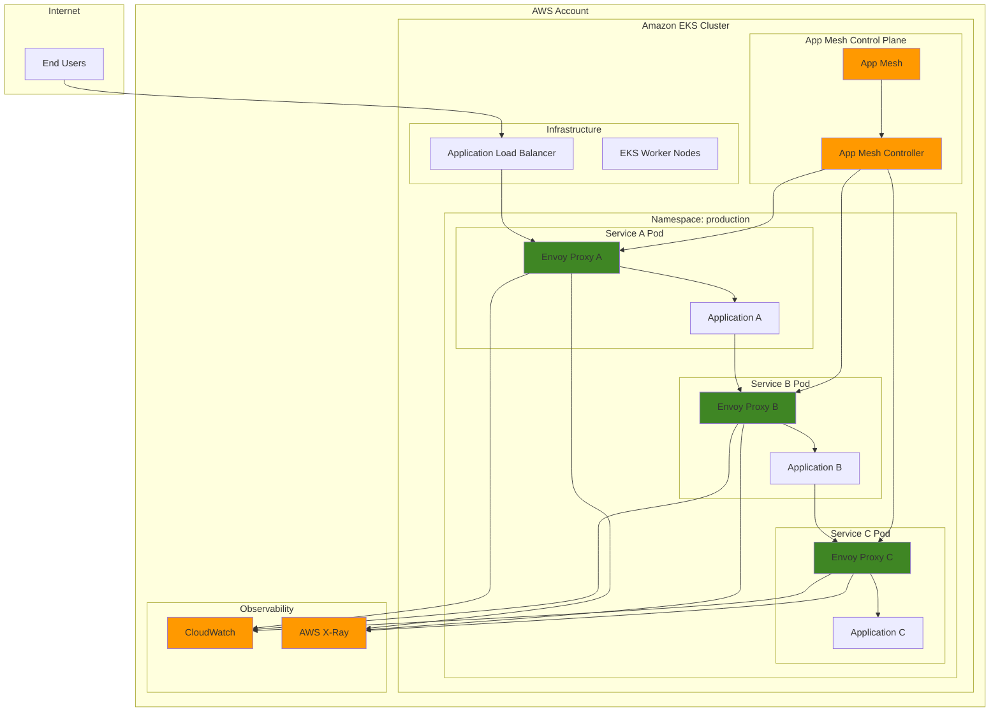

# EKS Microservices with App Mesh Integration

## Problem

Enterprise organizations with distributed microservices face increasing complexity in managing service-to-service communication, observability, and security. Traditional monolithic applications decomposed into dozens of microservices create operational challenges including network latency issues, service discovery complexity, and lack of visibility into traffic patterns and failures. Without proper service mesh infrastructure, teams struggle to implement consistent security policies, traffic management, and observability across their microservices architecture.

## Solution

AWS App Mesh provides a comprehensive service mesh solution that simplifies microservices communication by deploying Envoy proxy sidecars alongside application containers. When integrated with Amazon EKS, App Mesh automatically handles service discovery, load balancing, traffic routing, and provides detailed observability metrics. This approach enables teams to implement sophisticated traffic management policies, security controls, and monitoring capabilities without modifying application code.

## Architecture Diagram



## Prerequisites

1. AWS account with appropriate permissions for EKS, App Mesh, IAM, and CloudWatch
2. AWS CLI v2 installed and configured (minimum version 2.15.0)
3. kubectl client installed and configured (version 1.28+)
4. eksctl CLI tool installed (version 0.170.0 or later)
5. Helm v3 installed (version 3.8 or later)
6. Docker installed for building container images
7. Basic understanding of Kubernetes concepts and microservices architecture
8. Estimated cost: $150-200 for 4 hours of testing (EKS cluster $0.10/hour, EC2 instances $0.50-1.00/hour depending on instance types)

> **Warning**: App Mesh will reach end of support on September 30, 2026. AWS recommends migrating to Amazon ECS Service Connect for container workloads or evaluating third-party service mesh solutions like Istio for Kubernetes environments. Plan your migration strategy accordingly to avoid service disruption.

> **Note**: This recipe creates an EKS cluster with managed node groups and deploys multiple microservices with App Mesh, which will incur charges for compute resources, load balancers, and data transfer. See the [EKS pricing documentation](https://aws.amazon.com/eks/pricing/) for detailed cost information.

> **Tip**: Monitor service mesh performance using CloudWatch Container Insights and set up automated scaling policies based on application metrics rather than just CPU utilization. This provides more accurate scaling decisions for microservices workloads.

## Preparation

```bash
# Set environment variables
export AWS_REGION=$(aws configure get region)
export AWS_ACCOUNT_ID=$(aws sts get-caller-identity \
    --query Account --output text)
export CLUSTER_NAME="microservices-mesh-cluster"
export APP_MESH_NAME="microservices-mesh"

# Generate unique identifiers for resources
RANDOM_SUFFIX=$(aws secretsmanager get-random-password \
    --exclude-punctuation --exclude-uppercase \
    --password-length 6 --require-each-included-type \
    --output text --query RandomPassword)

export NAMESPACE="production"
export ECR_REPO_PREFIX="microservices-demo"

# Create ECR repositories for microservices
aws ecr create-repository \
    --repository-name ${ECR_REPO_PREFIX}-service-a \
    --region ${AWS_REGION}

aws ecr create-repository \
    --repository-name ${ECR_REPO_PREFIX}-service-b \
    --region ${AWS_REGION}

aws ecr create-repository \
    --repository-name ${ECR_REPO_PREFIX}-service-c \
    --region ${AWS_REGION}

echo "✅ ECR repositories created successfully"
```

## Steps

1. **Create EKS Cluster with App Mesh Support**:

   Amazon EKS provides a managed Kubernetes control plane that eliminates the complexity of managing Kubernetes masters. The cluster configuration includes IAM policies specifically for App Mesh integration, enabling the service mesh to manage network traffic and observability. Using managed node groups ensures high availability and automatic scaling while pre-configuring the necessary permissions for container registry access, logging, and service mesh operations.

   ```bash
   # Create EKS cluster configuration file
   cat > cluster-config.yaml << EOF
   apiVersion: eksctl.io/v1alpha5
   kind: ClusterConfig
   
   metadata:
     name: ${CLUSTER_NAME}
     region: ${AWS_REGION}
     version: "1.30"
   
   managedNodeGroups:
     - name: microservices-nodes
       instanceType: t3.medium
       minSize: 3
       maxSize: 6
       desiredCapacity: 3
       volumeSize: 20
       ssh:
         allow: false
       iam:
         withAddonPolicies:
           imageBuilder: true
           autoScaler: true
           cloudWatch: true
           appMesh: true
   
   addons:
     - name: aws-ebs-csi-driver
     - name: coredns
     - name: kube-proxy
     - name: vpc-cni
   EOF
   
   # Create the EKS cluster
   eksctl create cluster -f cluster-config.yaml
   
   echo "✅ EKS cluster created successfully"
   ```

   The EKS cluster is now operational with the App Mesh IAM policies attached to worker nodes. This foundation enables automatic sidecar injection and service mesh management capabilities. The cluster includes essential add-ons like the EBS CSI driver for persistent storage and the VPC CNI for advanced networking features required by service mesh communications.

2. **Install App Mesh Controller and CRDs**:

   The App Mesh controller acts as the bridge between Kubernetes resources and AWS App Mesh services. Custom Resource Definitions (CRDs) extend Kubernetes APIs to include App Mesh-specific resources like Virtual Nodes and Virtual Services. The controller uses IAM Service Accounts for Web Identity (IRSA) to securely access AWS APIs without storing long-term credentials in the cluster.

   ```bash
   # Add EKS charts repository
   helm repo add eks https://aws.github.io/eks-charts
   helm repo update
   
   # Install App Mesh CRDs
   kubectl apply -k \
     "https://github.com/aws/eks-charts/stable/appmesh-controller/crds?ref=master"
   
   # Create namespace for App Mesh controller
   kubectl create namespace appmesh-system
   
   # Create service account for App Mesh controller
   eksctl create iamserviceaccount \
     --cluster=${CLUSTER_NAME} \
     --namespace=appmesh-system \
     --name=appmesh-controller \
     --attach-policy-arn=arn:aws:iam::aws:policy/AWSCloudMapFullAccess \
     --attach-policy-arn=arn:aws:iam::aws:policy/AWSAppMeshFullAccess \
     --override-existing-serviceaccounts \
     --approve
   
   # Install App Mesh controller
   helm upgrade -i appmesh-controller eks/appmesh-controller \
     --namespace appmesh-system \
     --set region=${AWS_REGION} \
     --set serviceAccount.create=false \
     --set serviceAccount.name=appmesh-controller
   
   echo "✅ App Mesh controller installed successfully"
   ```

   The App Mesh controller is now watching for CRD changes and can automatically provision AWS resources. The IRSA configuration enables secure, token-based authentication to AWS services, following [AWS IAM best practices](https://docs.aws.amazon.com/IAM/latest/UserGuide/best-practices.html) by avoiding static credentials. This setup allows the controller to manage service mesh resources dynamically as applications are deployed.

3. **Create App Mesh and Namespace**:

   Creating a dedicated namespace with App Mesh labels enables automatic sidecar injection for all pods deployed within it. The namespace selector in the mesh configuration determines which Kubernetes namespaces participate in the service mesh. This approach provides clear boundaries for service mesh functionality while allowing gradual adoption across different application tiers.

   ```bash
   # Create production namespace
   kubectl create namespace ${NAMESPACE}
   
   # Label namespace for App Mesh injection
   kubectl label namespace ${NAMESPACE} \
     mesh=${APP_MESH_NAME} \
     appmesh.k8s.aws/sidecarInjectorWebhook=enabled
   
   # Create App Mesh resource
   cat > app-mesh.yaml << EOF
   apiVersion: appmesh.k8s.aws/v1beta2
   kind: Mesh
   metadata:
     name: ${APP_MESH_NAME}
   spec:
     namespaceSelector:
       matchLabels:
         mesh: ${APP_MESH_NAME}
   EOF
   
   kubectl apply -f app-mesh.yaml
   
   echo "✅ App Mesh and namespace created successfully"
   ```

   The service mesh is now established and ready to manage microservices communication. The labeled namespace will automatically inject Envoy proxy sidecars into new pods, enabling transparent traffic management. This configuration creates the logical boundary where service mesh policies and observability features will be applied.

4. **Build and Push Sample Microservices**:

   These sample applications demonstrate common microservices patterns including service-to-service communication and external API calls. Service A acts as the frontend entry point, Service B handles business logic and orchestration, while Service C represents a backend data service. The applications use standard HTTP endpoints that will be enhanced with service mesh capabilities like retry policies, circuit breakers, and observability.

   ```bash
   # Create sample microservice applications
   mkdir -p microservices-demo && cd microservices-demo
   
   # Service A - Frontend service
   cat > service-a.py << 'EOF'
   from flask import Flask, jsonify
   import requests
   import os
   
   app = Flask(__name__)
   
   @app.route('/')
   def hello():
       return jsonify({"service": "A", "message": "Hello from Service A"})
   
   @app.route('/call-b')
   def call_b():
       try:
           response = requests.get('http://service-b:5000/')
           return jsonify({"service": "A", "called": "B", "response": response.json()})
       except Exception as e:
           return jsonify({"service": "A", "error": str(e)})
   
   if __name__ == '__main__':
       app.run(host='0.0.0.0', port=5000)
   EOF
   
   # Create Dockerfile for Service A
   cat > Dockerfile-service-a << 'EOF'
   FROM python:3.11-slim
   WORKDIR /app
   COPY service-a.py .
   RUN pip install flask requests
   EXPOSE 5000
   CMD ["python", "service-a.py"]
   EOF
   
   # Service B - Backend service
   cat > service-b.py << 'EOF'
   from flask import Flask, jsonify
   import requests
   import os
   
   app = Flask(__name__)
   
   @app.route('/')
   def hello():
       return jsonify({"service": "B", "message": "Hello from Service B"})
   
   @app.route('/call-c')
   def call_c():
       try:
           response = requests.get('http://service-c:5000/')
           return jsonify({"service": "B", "called": "C", "response": response.json()})
       except Exception as e:
           return jsonify({"service": "B", "error": str(e)})
   
   if __name__ == '__main__':
       app.run(host='0.0.0.0', port=5000)
   EOF
   
   # Create Dockerfile for Service B
   cat > Dockerfile-service-b << 'EOF'
   FROM python:3.11-slim
   WORKDIR /app
   COPY service-b.py .
   RUN pip install flask requests
   EXPOSE 5000
   CMD ["python", "service-b.py"]
   EOF
   
   # Service C - Database service
   cat > service-c.py << 'EOF'
   from flask import Flask, jsonify
   import time
   
   app = Flask(__name__)
   
   @app.route('/')
   def hello():
       return jsonify({"service": "C", "message": "Hello from Service C", "timestamp": time.time()})
   
   if __name__ == '__main__':
       app.run(host='0.0.0.0', port=5000)
   EOF
   
   # Create Dockerfile for Service C
   cat > Dockerfile-service-c << 'EOF'
   FROM python:3.11-slim
   WORKDIR /app
   COPY service-c.py .
   RUN pip install flask
   EXPOSE 5000
   CMD ["python", "service-c.py"]
   EOF
   
   echo "✅ Sample microservices created successfully"
   ```

   The microservices are structured to showcase service mesh benefits through their communication patterns. Each service exposes health check endpoints that App Mesh will use for health monitoring and traffic routing decisions. The chain of dependencies (A→B→C) allows us to observe distributed tracing and traffic flow through the service mesh.

5. **Build and Push Container Images**:

   Amazon ECR provides secure, private container image storage with integration to IAM for access control. The build process creates optimized container images using minimal base images to reduce attack surface. Each service gets its own repository following container security best practices for isolation and access management.

   ```bash
   # Login to ECR
   aws ecr get-login-password --region ${AWS_REGION} | \
     docker login --username AWS --password-stdin \
     ${AWS_ACCOUNT_ID}.dkr.ecr.${AWS_REGION}.amazonaws.com
   
   # Build and push Service A
   docker build -t ${ECR_REPO_PREFIX}-service-a:latest \
     -f Dockerfile-service-a .
   docker tag ${ECR_REPO_PREFIX}-service-a:latest \
     ${AWS_ACCOUNT_ID}.dkr.ecr.${AWS_REGION}.amazonaws.com/${ECR_REPO_PREFIX}-service-a:latest
   docker push \
     ${AWS_ACCOUNT_ID}.dkr.ecr.${AWS_REGION}.amazonaws.com/${ECR_REPO_PREFIX}-service-a:latest
   
   # Build and push Service B
   docker build -t ${ECR_REPO_PREFIX}-service-b:latest \
     -f Dockerfile-service-b .
   docker tag ${ECR_REPO_PREFIX}-service-b:latest \
     ${AWS_ACCOUNT_ID}.dkr.ecr.${AWS_REGION}.amazonaws.com/${ECR_REPO_PREFIX}-service-b:latest
   docker push \
     ${AWS_ACCOUNT_ID}.dkr.ecr.${AWS_REGION}.amazonaws.com/${ECR_REPO_PREFIX}-service-b:latest
   
   # Build and push Service C
   docker build -t ${ECR_REPO_PREFIX}-service-c:latest \
     -f Dockerfile-service-c .
   docker tag ${ECR_REPO_PREFIX}-service-c:latest \
     ${AWS_ACCOUNT_ID}.dkr.ecr.${AWS_REGION}.amazonaws.com/${ECR_REPO_PREFIX}-service-c:latest
   docker push \
     ${AWS_ACCOUNT_ID}.dkr.ecr.${AWS_REGION}.amazonaws.com/${ECR_REPO_PREFIX}-service-c:latest
   
   echo "✅ Container images built and pushed successfully"
   ```

   The container images are now available in ECR and ready for deployment to the EKS cluster. ECR automatically scans images for vulnerabilities and provides lifecycle policies for cost optimization. The images will be pulled by Kubernetes using the IAM permissions configured in the node groups, ensuring secure access to the private registry.

6. **Deploy Virtual Nodes and Virtual Services**:

   Virtual Nodes define the logical representation of each microservice within the service mesh, specifying health check configurations, backend dependencies, and service discovery settings. The health check configuration ensures that only healthy instances receive traffic, while backend specifications define which services can communicate with each other. This creates the service mesh topology that mirrors your application architecture.

   ```bash
   # Create Virtual Node for Service A
   cat > virtual-node-service-a.yaml << EOF
   apiVersion: appmesh.k8s.aws/v1beta2
   kind: VirtualNode
   metadata:
     name: service-a
     namespace: ${NAMESPACE}
   spec:
     podSelector:
       matchLabels:
         app: service-a
     listeners:
       - portMapping:
           port: 5000
           protocol: http
         healthCheck:
           protocol: http
           path: '/'
           healthyThreshold: 2
           unhealthyThreshold: 2
           timeoutMillis: 2000
           intervalMillis: 5000
     backends:
       - virtualService:
           virtualServiceRef:
             name: service-b
     serviceDiscovery:
       dns:
         hostname: service-a.${NAMESPACE}.svc.cluster.local
   EOF
   
   # Create Virtual Node for Service B
   cat > virtual-node-service-b.yaml << EOF
   apiVersion: appmesh.k8s.aws/v1beta2
   kind: VirtualNode
   metadata:
     name: service-b
     namespace: ${NAMESPACE}
   spec:
     podSelector:
       matchLabels:
         app: service-b
     listeners:
       - portMapping:
           port: 5000
           protocol: http
         healthCheck:
           protocol: http
           path: '/'
           healthyThreshold: 2
           unhealthyThreshold: 2
           timeoutMillis: 2000
           intervalMillis: 5000
     backends:
       - virtualService:
           virtualServiceRef:
             name: service-c
     serviceDiscovery:
       dns:
         hostname: service-b.${NAMESPACE}.svc.cluster.local
   EOF
   
   # Create Virtual Node for Service C
   cat > virtual-node-service-c.yaml << EOF
   apiVersion: appmesh.k8s.aws/v1beta2
   kind: VirtualNode
   metadata:
     name: service-c
     namespace: ${NAMESPACE}
   spec:
     podSelector:
       matchLabels:
         app: service-c
     listeners:
       - portMapping:
           port: 5000
           protocol: http
         healthCheck:
           protocol: http
           path: '/'
           healthyThreshold: 2
           unhealthyThreshold: 2
           timeoutMillis: 2000
           intervalMillis: 5000
     serviceDiscovery:
       dns:
         hostname: service-c.${NAMESPACE}.svc.cluster.local
   EOF
   
   # Apply Virtual Nodes
   kubectl apply -f virtual-node-service-a.yaml
   kubectl apply -f virtual-node-service-b.yaml
   kubectl apply -f virtual-node-service-c.yaml
   
   echo "✅ Virtual nodes created successfully"
   ```

   The Virtual Nodes establish the service mesh data plane configuration, defining how Envoy proxies should handle traffic for each service. Health checks will continuously monitor service availability, automatically removing unhealthy instances from load balancing. The backend relationships create secure communication channels between services within the mesh.

7. **Create Virtual Services and Routes**:

   Virtual Services provide stable DNS names for service discovery within the mesh, decoupling service consumers from the underlying infrastructure. They act as the interface layer that defines how traffic should be routed to backend services. This abstraction enables advanced traffic management features like weighted routing, retry policies, and circuit breakers without modifying application code.

   ```bash
   # Create Virtual Service for Service A
   cat > virtual-service-a.yaml << EOF
   apiVersion: appmesh.k8s.aws/v1beta2
   kind: VirtualService
   metadata:
     name: service-a
     namespace: ${NAMESPACE}
   spec:
     awsName: service-a.${NAMESPACE}.svc.cluster.local
     provider:
       virtualNode:
         virtualNodeRef:
           name: service-a
   EOF
   
   # Create Virtual Service for Service B
   cat > virtual-service-b.yaml << EOF
   apiVersion: appmesh.k8s.aws/v1beta2
   kind: VirtualService
   metadata:
     name: service-b
     namespace: ${NAMESPACE}
   spec:
     awsName: service-b.${NAMESPACE}.svc.cluster.local
     provider:
       virtualNode:
         virtualNodeRef:
           name: service-b
   EOF
   
   # Create Virtual Service for Service C
   cat > virtual-service-c.yaml << EOF
   apiVersion: appmesh.k8s.aws/v1beta2
   kind: VirtualService
   metadata:
     name: service-c
     namespace: ${NAMESPACE}
   spec:
     awsName: service-c.${NAMESPACE}.svc.cluster.local
     provider:
       virtualNode:
         virtualNodeRef:
           name: service-c
   EOF
   
   # Apply Virtual Services
   kubectl apply -f virtual-service-a.yaml
   kubectl apply -f virtual-service-b.yaml
   kubectl apply -f virtual-service-c.yaml
   
   echo "✅ Virtual services created successfully"
   ```

   The Virtual Services now provide stable endpoints for inter-service communication, regardless of the underlying pod IP addresses. This enables Kubernetes' dynamic scheduling while maintaining reliable service discovery. The DNS-based service discovery integrates seamlessly with Kubernetes native networking.

8. **Deploy Microservices with App Mesh Integration**:

   Deploying applications into the mesh-enabled namespace automatically triggers sidecar injection, where the App Mesh controller adds Envoy proxy containers to each pod. The sidecar pattern ensures that all network traffic flows through the proxy, enabling traffic management, security policies, and observability without application changes. Multiple replicas provide high availability and demonstrate load balancing within the service mesh.

   ```bash
   # Deploy Service A
   cat > service-a-deployment.yaml << EOF
   apiVersion: apps/v1
   kind: Deployment
   metadata:
     name: service-a
     namespace: ${NAMESPACE}
   spec:
     replicas: 2
     selector:
       matchLabels:
         app: service-a
     template:
       metadata:
         labels:
           app: service-a
       spec:
         containers:
         - name: service-a
           image: ${AWS_ACCOUNT_ID}.dkr.ecr.${AWS_REGION}.amazonaws.com/${ECR_REPO_PREFIX}-service-a:latest
           ports:
           - containerPort: 5000
           env:
           - name: SERVICE_NAME
             value: "service-a"
   ---
   apiVersion: v1
   kind: Service
   metadata:
     name: service-a
     namespace: ${NAMESPACE}
   spec:
     selector:
       app: service-a
     ports:
     - port: 5000
       targetPort: 5000
   EOF
   
   # Deploy Service B
   cat > service-b-deployment.yaml << EOF
   apiVersion: apps/v1
   kind: Deployment
   metadata:
     name: service-b
     namespace: ${NAMESPACE}
   spec:
     replicas: 2
     selector:
       matchLabels:
         app: service-b
     template:
       metadata:
         labels:
           app: service-b
       spec:
         containers:
         - name: service-b
           image: ${AWS_ACCOUNT_ID}.dkr.ecr.${AWS_REGION}.amazonaws.com/${ECR_REPO_PREFIX}-service-b:latest
           ports:
           - containerPort: 5000
           env:
           - name: SERVICE_NAME
             value: "service-b"
   ---
   apiVersion: v1
   kind: Service
   metadata:
     name: service-b
     namespace: ${NAMESPACE}
   spec:
     selector:
       app: service-b
     ports:
     - port: 5000
       targetPort: 5000
   EOF
   
   # Deploy Service C
   cat > service-c-deployment.yaml << EOF
   apiVersion: apps/v1
   kind: Deployment
   metadata:
     name: service-c
     namespace: ${NAMESPACE}
   spec:
     replicas: 2
     selector:
       matchLabels:
         app: service-c
     template:
       metadata:
         labels:
           app: service-c
       spec:
         containers:
         - name: service-c
           image: ${AWS_ACCOUNT_ID}.dkr.ecr.${AWS_REGION}.amazonaws.com/${ECR_REPO_PREFIX}-service-c:latest
           ports:
           - containerPort: 5000
           env:
           - name: SERVICE_NAME
             value: "service-c"
   ---
   apiVersion: v1
   kind: Service
   metadata:
     name: service-c
     namespace: ${NAMESPACE}
   spec:
     selector:
       app: service-c
     ports:
     - port: 5000
       targetPort: 5000
   EOF
   
   # Apply deployments
   kubectl apply -f service-a-deployment.yaml
   kubectl apply -f service-b-deployment.yaml
   kubectl apply -f service-c-deployment.yaml
   
   # Wait for deployments to be ready
   kubectl wait --for=condition=available --timeout=300s \
     deployment/service-a -n ${NAMESPACE}
   kubectl wait --for=condition=available --timeout=300s \
     deployment/service-b -n ${NAMESPACE}
   kubectl wait --for=condition=available --timeout=300s \
     deployment/service-c -n ${NAMESPACE}
   
   echo "✅ Microservices deployed successfully"
   ```

   Each microservice pod now runs with an Envoy sidecar proxy that handles all inbound and outbound traffic. The service mesh data plane is fully operational, with automatic service discovery, load balancing, and health checking. The deployment ensures high availability through multiple replicas while the service mesh provides resilience through retry policies and circuit breakers.

9. **Create Application Load Balancer Ingress**:

   The AWS Load Balancer Controller enables native integration between Kubernetes Ingress resources and AWS Application Load Balancers. This provides internet-facing access to the service mesh while maintaining security through targeted routing. The ALB integrates with AWS WAF, Shield, and Certificate Manager for comprehensive web application protection.

   ```bash
   # Download AWS Load Balancer Controller IAM policy
   curl -O https://raw.githubusercontent.com/kubernetes-sigs/aws-load-balancer-controller/v2.7.2/docs/install/iam_policy.json
   
   aws iam create-policy \
     --policy-name AWSLoadBalancerControllerIAMPolicy \
     --policy-document file://iam_policy.json
   
   eksctl create iamserviceaccount \
     --cluster=${CLUSTER_NAME} \
     --namespace=kube-system \
     --name=aws-load-balancer-controller \
     --attach-policy-arn=arn:aws:iam::${AWS_ACCOUNT_ID}:policy/AWSLoadBalancerControllerIAMPolicy \
     --override-existing-serviceaccounts \
     --approve
   
   # Install AWS Load Balancer Controller using Helm
   helm repo add eks https://aws.github.io/eks-charts
   helm repo update
   helm install aws-load-balancer-controller eks/aws-load-balancer-controller \
     -n kube-system \
     --set clusterName=${CLUSTER_NAME} \
     --set serviceAccount.create=false \
     --set serviceAccount.name=aws-load-balancer-controller
   
   # Create Ingress for Service A
   cat > service-a-ingress.yaml << EOF
   apiVersion: networking.k8s.io/v1
   kind: Ingress
   metadata:
     name: service-a-ingress
     namespace: ${NAMESPACE}
     annotations:
       alb.ingress.kubernetes.io/scheme: internet-facing
       alb.ingress.kubernetes.io/target-type: ip
   spec:
     ingressClassName: alb
     rules:
     - http:
         paths:
         - path: /
           pathType: Prefix
           backend:
             service:
               name: service-a
               port:
                 number: 5000
   EOF
   
   kubectl apply -f service-a-ingress.yaml
   
   echo "✅ Application Load Balancer configured successfully"
   ```

   External traffic can now reach the service mesh through the ALB, which distributes requests to the frontend service. The load balancer provides SSL termination, health checks, and integration with AWS security services. This creates a secure entry point into the service mesh while maintaining observability for external traffic patterns.

10. **Configure CloudWatch Observability**:

    Comprehensive observability combines infrastructure metrics, application logs, and distributed tracing to provide complete visibility into service mesh behavior. CloudWatch Container Insights automatically collects performance metrics and logs from all containers, while X-Ray provides distributed tracing across service boundaries. This observability stack enables proactive monitoring, troubleshooting, and performance optimization.

    ```bash
    # Enable CloudWatch Container Insights
    curl -O https://raw.githubusercontent.com/aws-samples/amazon-cloudwatch-container-insights/latest/k8s-deployment-manifest-templates/deployment-mode/daemonset/container-insights-monitoring/quickstart/cwagent-fluentd-quickstart.yaml
    
    # Replace cluster name in the file
    sed -i.bak "s/{{cluster_name}}/${CLUSTER_NAME}/g" \
      cwagent-fluentd-quickstart.yaml
    sed -i.bak "s/{{region_name}}/${AWS_REGION}/g" \
      cwagent-fluentd-quickstart.yaml
    
    kubectl apply -f cwagent-fluentd-quickstart.yaml
    
    # Create IAM role for X-Ray daemon
    eksctl create iamserviceaccount \
      --cluster=${CLUSTER_NAME} \
      --namespace=${NAMESPACE} \
      --name=xray-daemon \
      --attach-policy-arn=arn:aws:iam::aws:policy/AWSXRayDaemonWriteAccess \
      --override-existing-serviceaccounts \
      --approve
    
    # Enable X-Ray tracing for App Mesh
    cat > xray-daemon.yaml << EOF
    apiVersion: v1
    kind: Service
    metadata:
      name: xray-service
      namespace: ${NAMESPACE}
    spec:
      selector:
        app: xray-daemon
      ports:
      - name: xray-udp
        port: 2000
        protocol: UDP
        targetPort: 2000
      - name: xray-tcp
        port: 2000
        protocol: TCP
        targetPort: 2000
    ---
    apiVersion: apps/v1
    kind: DaemonSet
    metadata:
      name: xray-daemon
      namespace: ${NAMESPACE}
    spec:
      selector:
        matchLabels:
          app: xray-daemon
      template:
        metadata:
          labels:
            app: xray-daemon
        spec:
          serviceAccountName: xray-daemon
          containers:
          - name: xray-daemon
            image: public.ecr.aws/xray/aws-xray-daemon:latest
            command:
            - /xray
            - -o
            - -b
            - xray-service:2000
            resources:
              limits:
                memory: 32Mi
              requests:
                cpu: 10m
                memory: 32Mi
            ports:
            - name: xray-udp
              containerPort: 2000
              protocol: UDP
            - name: xray-tcp
              containerPort: 2000
              protocol: TCP
    EOF
    
    kubectl apply -f xray-daemon.yaml
    
    echo "✅ CloudWatch and X-Ray observability configured successfully"
    ```

    The observability stack now provides end-to-end visibility into application performance and infrastructure health. Envoy proxies automatically generate telemetry data that flows to CloudWatch and X-Ray, enabling correlation between infrastructure metrics and application traces. This comprehensive monitoring enables teams to quickly identify and resolve performance issues across the distributed system.

## Validation & Testing

1. **Verify App Mesh Resources**:

   Validating the App Mesh control plane ensures that all service mesh components are functioning correctly and ready to manage traffic. These commands check the status of Custom Resource Definitions and their corresponding AWS resources to confirm proper integration between Kubernetes and the AWS App Mesh service.

   ```bash
   # Check App Mesh controller status
   kubectl get pods -n appmesh-system
   
   # Verify virtual nodes are created
   kubectl get virtualnodes -n ${NAMESPACE}
   
   # Check virtual services
   kubectl get virtualservices -n ${NAMESPACE}
   
   # Verify mesh status
   kubectl get mesh
   ```

   Expected output: All App Mesh resources should be in "Active" or "Ready" state.

2. **Test Service Communication**:

   Testing end-to-end service communication verifies that the service mesh is properly routing traffic between microservices. The load balancer provides external access while internal service calls demonstrate the mesh's ability to handle service-to-service communication with automatic load balancing and health checking.

   ```bash
   # Get the Load Balancer URL
   LOAD_BALANCER_URL=$(kubectl get ingress service-a-ingress -n ${NAMESPACE} \
     -o jsonpath='{.status.loadBalancer.ingress[0].hostname}')
   
   # Wait for Load Balancer to be ready
   echo "Waiting for Load Balancer to be ready..."
   while [ -z "$LOAD_BALANCER_URL" ]; do
     sleep 10
     LOAD_BALANCER_URL=$(kubectl get ingress service-a-ingress -n ${NAMESPACE} \
       -o jsonpath='{.status.loadBalancer.ingress[0].hostname}')
   done
   
   # Test direct service call
   curl -s http://${LOAD_BALANCER_URL}/ | jq .
   
   # Test service chain communication
   curl -s http://${LOAD_BALANCER_URL}/call-b | jq .
   ```

3. **Verify Envoy Sidecar Injection**:

   Confirming sidecar injection validates that each application pod includes the Envoy proxy container required for service mesh functionality. The proxy statistics provide insight into traffic patterns, connection counts, and health status of upstream services within the mesh.

   ```bash
   # Check that pods have Envoy sidecars
   kubectl get pods -n ${NAMESPACE} \
     -o jsonpath='{range .items[*]}{.metadata.name}{"\t"}{.spec.containers[*].name}{"\n"}{end}'
   
   # Check Envoy proxy stats
   kubectl exec -it \
     $(kubectl get pods -n ${NAMESPACE} -l app=service-a \
       -o jsonpath='{.items[0].metadata.name}') \
     -c envoy -- curl -s localhost:9901/stats | \
     grep -E "cluster.*upstream.*cx_total"
   ```

4. **Test Traffic Management**:

   ```bash
   # Generate traffic to test load balancing
   for i in {1..10}; do
     curl -s http://${LOAD_BALANCER_URL}/ | jq -r '.message'
   done
   
   # Test circuit breaker by generating failures
   for i in {1..20}; do
     curl -s http://${LOAD_BALANCER_URL}/call-b | jq -r '.service'
   done
   ```

5. **Validate Observability**:

   ```bash
   # Check CloudWatch metrics
   aws cloudwatch get-metric-statistics \
     --namespace AWS/ContainerInsights \
     --metric-name pod_cpu_utilization \
     --dimensions Name=ClusterName,Value=${CLUSTER_NAME} \
     --start-time $(date -u -d '1 hour ago' +%Y-%m-%dT%H:%M:%S) \
     --end-time $(date -u +%Y-%m-%dT%H:%M:%S) \
     --period 300 \
     --statistics Average
   
   # Check X-Ray traces
   aws xray get-trace-summaries \
     --time-range-type TimeRangeByStartTime \
     --start-time $(date -u -d '1 hour ago' +%Y-%m-%dT%H:%M:%S) \
     --end-time $(date -u +%Y-%m-%dT%H:%M:%S)
   ```

## Cleanup

1. **Remove Application Resources**:

   Starting cleanup with application resources prevents orphaned load balancers and ingress controllers that could continue incurring charges. Removing deployments first ensures graceful shutdown of application pods and their associated Envoy sidecars.

   ```bash
   # Delete microservice deployments
   kubectl delete -f service-a-deployment.yaml
   kubectl delete -f service-b-deployment.yaml
   kubectl delete -f service-c-deployment.yaml
   
   # Delete ingress
   kubectl delete -f service-a-ingress.yaml
   
   echo "✅ Application resources deleted"
   ```

2. **Remove App Mesh Resources**:

   Deleting App Mesh resources in the correct order prevents dependency conflicts and ensures clean removal of both Kubernetes CRDs and corresponding AWS resources. Virtual Services must be removed before Virtual Nodes to avoid referential integrity issues.

   ```bash
   # Delete virtual services
   kubectl delete -f virtual-service-a.yaml
   kubectl delete -f virtual-service-b.yaml
   kubectl delete -f virtual-service-c.yaml
   
   # Delete virtual nodes
   kubectl delete -f virtual-node-service-a.yaml
   kubectl delete -f virtual-node-service-b.yaml
   kubectl delete -f virtual-node-service-c.yaml
   
   # Delete mesh
   kubectl delete -f app-mesh.yaml
   
   echo "✅ App Mesh resources deleted"
   ```

3. **Remove Observability Components**:

   Removing observability components stops metric collection and log forwarding, preventing unnecessary data ingestion charges. The service account cleanup ensures no orphaned permissions remain that could pose security risks.

   ```bash
   # Delete X-Ray daemon
   kubectl delete -f xray-daemon.yaml
   
   # Delete CloudWatch agent
   kubectl delete -f cwagent-fluentd-quickstart.yaml
   
   echo "✅ Observability components deleted"
   ```

4. **Remove App Mesh Controller**:

   ```bash
   # Uninstall App Mesh controller
   helm uninstall appmesh-controller -n appmesh-system
   
   # Delete App Mesh CRDs
   kubectl delete -k \
     "https://github.com/aws/eks-charts/stable/appmesh-controller/crds?ref=master"
   
   # Delete namespace
   kubectl delete namespace appmesh-system
   
   echo "✅ App Mesh controller removed"
   ```

5. **Delete EKS Cluster**:

   ```bash
   # Delete AWS Load Balancer Controller
   helm uninstall aws-load-balancer-controller -n kube-system
   
   # Delete IAM policies
   aws iam delete-policy \
     --policy-arn arn:aws:iam::${AWS_ACCOUNT_ID}:policy/AWSLoadBalancerControllerIAMPolicy
   
   # Delete EKS cluster
   eksctl delete cluster --name ${CLUSTER_NAME}
   
   echo "✅ EKS cluster deleted"
   ```

6. **Remove ECR Repositories**:

   ```bash
   # Delete ECR repositories
   aws ecr delete-repository \
     --repository-name ${ECR_REPO_PREFIX}-service-a \
     --force
   
   aws ecr delete-repository \
     --repository-name ${ECR_REPO_PREFIX}-service-b \
     --force
   
   aws ecr delete-repository \
     --repository-name ${ECR_REPO_PREFIX}-service-c \
     --force
   
   # Clean up local files
   cd .. && rm -rf microservices-demo
   rm -f cluster-config.yaml iam_policy.json
   
   echo "✅ ECR repositories and local files cleaned up"
   ```

## Discussion

AWS App Mesh provides a powerful service mesh solution that addresses the complexity of microservices communication without requiring application code changes. By deploying Envoy proxy sidecars alongside each microservice, App Mesh creates a dedicated infrastructure layer that handles service discovery, load balancing, traffic routing, and observability. This approach follows the sidecar pattern, where the proxy container shares the same network namespace as the application container, enabling transparent interception of all network traffic.

The integration with Amazon EKS leverages Kubernetes Custom Resource Definitions (CRDs) to manage App Mesh resources declaratively. The App Mesh controller watches for changes to these CRDs and automatically configures the corresponding App Mesh resources through the AWS API. This native Kubernetes integration allows teams to manage their service mesh configuration using familiar kubectl commands and GitOps workflows. The controller also handles the automatic injection of Envoy sidecar containers into pods based on namespace labels, reducing operational overhead.

Service mesh architecture provides several key benefits for microservices deployments following the [AWS Well-Architected Framework](https://docs.aws.amazon.com/wellarchitected/latest/framework/welcome.html). Traffic management capabilities include sophisticated routing rules, circuit breakers, retries, and timeouts that improve application resilience. Security features like mutual TLS (mTLS) encryption and fine-grained access policies help secure service-to-service communication. Observability improvements include distributed tracing, metrics collection, and traffic visualization that provide deep insights into application behavior. These capabilities are particularly valuable in complex microservices environments where traditional networking approaches become unwieldy.

The observability stack combining CloudWatch Container Insights and AWS X-Ray provides comprehensive monitoring for containerized applications. Container Insights collects and aggregates container metrics, logs, and performance data, while X-Ray enables distributed tracing across service boundaries. This combination allows teams to correlate application performance issues with infrastructure metrics, enabling faster troubleshooting and root cause analysis. The service mesh proxy automatically generates telemetry data, providing visibility into request patterns, error rates, and latency distributions without requiring application instrumentation. For detailed monitoring guidance, refer to the [CloudWatch Container Insights documentation](https://docs.aws.amazon.com/AmazonCloudWatch/latest/monitoring/ContainerInsights.html).

> **Note**: Consider migrating to alternatives like Istio or Amazon ECS Service Connect before App Mesh reaches end of support in September 2026. This timeline allows for gradual migration planning and testing.

## Challenge

Extend this solution by implementing these enhancements:

1. **Implement Advanced Traffic Management**: Configure weighted routing to implement canary deployments, allowing gradual rollout of new service versions with traffic splitting between versions.

2. **Add Security Policies**: Implement mutual TLS (mTLS) encryption between services and configure fine-grained access controls to restrict which services can communicate with each other.

3. **Enhanced Observability**: Integrate with AWS Distro for OpenTelemetry (ADOT) to collect custom metrics and traces, and create CloudWatch dashboards for service performance monitoring.

4. **Multi-Region Service Mesh**: Deploy the service mesh across multiple AWS regions with cross-region service discovery and traffic routing for disaster recovery scenarios.

5. **Advanced Circuit Breaker Configuration**: Implement sophisticated circuit breaker patterns with different failure thresholds and recovery strategies for different types of backend services.

## Infrastructure Code

### Available Infrastructure as Code:

- [Infrastructure Code Overview](code/README.md) - Detailed description of all infrastructure components
- [AWS CDK (Python)](code/cdk-python/) - AWS CDK Python implementation
- [AWS CDK (TypeScript)](code/cdk-typescript/) - AWS CDK TypeScript implementation
- [CloudFormation](code/cloudformation.yaml) - AWS CloudFormation template
- [Bash CLI Scripts](code/scripts/) - Example bash scripts using AWS CLI commands to deploy infrastructure
- [Terraform](code/terraform/) - Terraform configuration files