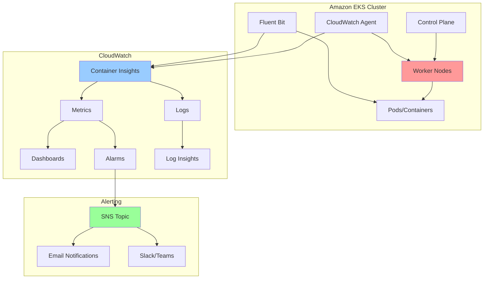

# EKS Monitoring with CloudWatch Container Insights

## Problem

You have containerized workloads running on Amazon EKS in production, but lack comprehensive visibility into cluster health, resource utilization, and application performance. Without proper monitoring, performance issues or resource constraints can go unnoticed until they cause service disruptions or affect user experience. Manual monitoring is time-consuming and unreliable, especially outside business hours. Small teams particularly need automated monitoring solutions that alert them when metrics exceed predefined thresholds, helping to maintain service reliability while minimizing operational overhead.

## Solution

Implement comprehensive monitoring and alerting for your Amazon EKS cluster using CloudWatch Container Insights with enhanced observability. This solution provides detailed infrastructure telemetry, application logs, and proactive alerting through Amazon SNS to ensure operational visibility and timely incident response.

## Architecture Diagram



## Prerequisites

1. Running Amazon EKS cluster (version 1.21 or later)
2. kubectl configured with cluster access
3. Containerized applications deployed on the cluster  
4. AWS CLI v2 installed and configured
5. eksctl tool installed for IRSA operations
6. Basic understanding of Kubernetes concepts
7. IAM permissions for CloudWatch, SNS, and EKS operations
8. Estimated cost: $10-30/month for monitoring infrastructure (varies by cluster size)

> **Note**: This recipe follows AWS Well-Architected Framework principles for observability and operational excellence. Review [AWS Well-Architected Framework](https://docs.aws.amazon.com/wellarchitected/latest/framework/welcome.html) for additional guidance.

## Preparation

Amazon EKS requires proper configuration and credentials to enable comprehensive monitoring. Setting up these environment variables ensures consistent resource naming and proper regional configuration for all monitoring components.

```bash
# Set AWS environment variables
export AWS_REGION=$(aws configure get region)
export AWS_ACCOUNT_ID=$(aws sts get-caller-identity \
    --query Account --output text)

# Set your cluster name (replace with your actual cluster name)  
export CLUSTER_NAME=your-eks-cluster-name

# Generate unique identifier for resources
RANDOM_SUFFIX=$(aws secretsmanager get-random-password \
    --exclude-punctuation --exclude-uppercase \
    --password-length 6 --require-each-included-type \
    --output text --query RandomPassword)

# Create SNS topic for monitoring alerts
TOPIC_ARN=$(aws sns create-topic \
    --name eks-monitoring-alerts-${RANDOM_SUFFIX} \
    --query TopicArn --output text)

echo "✅ Environment configured with topic: $TOPIC_ARN"
```

## Steps

1. **Verify EKS cluster access and enable control plane logging**:

   [Amazon EKS control plane logging](https://docs.aws.amazon.com/eks/latest/userguide/control-plane-logs.html) captures detailed diagnostic information about cluster operations, API calls, and authentication events, which is essential for troubleshooting complex issues and maintaining security compliance.

   ```bash
   # Verify connectivity to your EKS cluster
   kubectl get nodes
   
   # Enable comprehensive logging for the EKS control plane
   aws eks update-cluster-config \
       --region $AWS_REGION \
       --name $CLUSTER_NAME \
       --logging '{"enable":["api","audit","authenticator", \
       "controllerManager","scheduler"]}'
   
   echo "✅ Control plane logging enabled"
   ```

   Control plane logging provides comprehensive visibility into cluster operations, enabling faster troubleshooting and security analysis.

2. **Create CloudWatch namespace and service account with IRSA**:

   [IAM Roles for Service Accounts (IRSA)](https://docs.aws.amazon.com/eks/latest/userguide/iam-roles-for-service-accounts.html) enables secure AWS service access from Kubernetes pods without storing long-lived credentials. This security mechanism uses temporary, automatically rotated credentials that follow the principle of least privilege.

   ```bash
   # Create the dedicated namespace for CloudWatch monitoring components
   kubectl apply -f https://raw.githubusercontent.com/aws-samples/ \
   amazon-cloudwatch-container-insights/latest/k8s-deployment- \
   manifest-templates/deployment-mode/daemonset/container- \
   insights-monitoring/cloudwatch-namespace.yaml
   
   # Create service account with IAM role for CloudWatch agent
   eksctl create iamserviceaccount \
       --name cloudwatch-agent \
       --namespace amazon-cloudwatch \
       --cluster $CLUSTER_NAME \
       --region $AWS_REGION \
       --attach-policy-arn arn:aws:iam::aws:policy/CloudWatchAgentServerPolicy \
       --approve \
       --override-existing-serviceaccounts
   
   echo "✅ CloudWatch namespace and IRSA configured"
   ```

   The service account is now configured with secure AWS access, enabling the CloudWatch agent to collect and send metrics without exposing permanent credentials in your cluster.

3. **Deploy the CloudWatch agent as a DaemonSet**:

   Kubernetes DaemonSets ensure that monitoring agents run on every worker node in your cluster, providing complete coverage for metrics collection. This deployment pattern is essential for infrastructure monitoring as it guarantees no node goes unmonitored.

   ```bash
   # Deploy CloudWatch agent to collect metrics from all nodes
   curl -s https://raw.githubusercontent.com/aws-samples/ \
   amazon-cloudwatch-container-insights/latest/k8s-deployment- \
   manifest-templates/deployment-mode/daemonset/container- \
   insights-monitoring/cwagent/cwagent-daemonset.yaml | \
   sed "s/{{cluster_name}}/$CLUSTER_NAME/;s/{{region_name}}/$AWS_REGION/" | \
   kubectl apply -f -
   
   echo "✅ CloudWatch agent deployed"
   ```

   The CloudWatch agent is now deployed across all worker nodes, collecting detailed metrics about CPU, memory, disk, and network utilization at both the node and container levels.

4. **Deploy Fluent Bit for log collection**:

   Fluent Bit is a lightweight, high-performance log processor that efficiently collects, processes, and forwards container logs from all pods in your cluster. Its low resource footprint makes it ideal for production environments where resource efficiency is critical.

   ```bash
   # Deploy Fluent Bit to collect and forward container logs
   curl -s https://raw.githubusercontent.com/aws-samples/ \
   amazon-cloudwatch-container-insights/latest/k8s-deployment- \
   manifest-templates/deployment-mode/daemonset/container- \
   insights-monitoring/fluent-bit/fluent-bit.yaml | \
   sed "s/{{cluster_name}}/$CLUSTER_NAME/;s/{{region_name}}/$AWS_REGION/;s/{{http_server_toggle}}/On/;s/{{http_server_port}}/2020/;s/{{read_from_head}}/Off/;s/{{read_from_tail}}/On/" | \
   kubectl apply -f -
   
   echo "✅ Fluent Bit deployed for log collection"
   ```

   Fluent Bit is now collecting and forwarding container logs to CloudWatch Logs, enabling centralized log analysis and correlation with performance metrics.

5. **Subscribe to SNS topic for alert notifications**:

   [Amazon SNS email subscriptions](https://docs.aws.amazon.com/sns/latest/dg/sns-email-notifications.html) provide immediate notification delivery to your operations team, ensuring critical alerts are received even when team members are away from monitoring dashboards.

   ```bash
   # Subscribe to receive email notifications (replace with your email)
   aws sns subscribe --topic-arn $TOPIC_ARN \
       --protocol email \
       --notification-endpoint your-email@example.com
   
   echo "✅ SNS subscription created (check email to confirm)"
   ```

   Email subscription enables immediate alert delivery, ensuring your team can respond promptly to monitoring events.

6. **Create CloudWatch alarm for high CPU utilization**:

   [CloudWatch alarms](https://docs.aws.amazon.com/AmazonCloudWatch/latest/monitoring/AlarmThatSendsEmail.html) provide automated monitoring that triggers notifications when resource utilization exceeds defined thresholds. High CPU utilization can indicate resource constraints, inefficient applications, or potential scaling needs.

   ```bash
   # Create alarm for cluster-wide high CPU usage
   aws cloudwatch put-metric-alarm \
       --alarm-name "EKS-${CLUSTER_NAME}-HighCPU" \
       --alarm-description "EKS cluster high CPU utilization" \
       --metric-name node_cpu_utilization \
       --namespace ContainerInsights \
       --statistic Average \
       --period 300 \
       --threshold 80 \
       --comparison-operator GreaterThanThreshold \
       --dimensions Name=ClusterName,Value=$CLUSTER_NAME \
       --evaluation-periods 2 \
       --alarm-actions $TOPIC_ARN \
       --treat-missing-data notBreaching
   
   echo "✅ CPU utilization alarm created"
   ```

   The CPU alarm will notify your team when average utilization exceeds 80% for two consecutive 5-minute periods, enabling proactive response to resource constraints.

7. **Create CloudWatch alarm for high memory utilization**:

   Memory exhaustion in Kubernetes clusters can lead to pod evictions, application crashes, and service instability. Monitoring memory utilization helps prevent these issues by alerting before critical thresholds are reached.

   ```bash
   # Create alarm for cluster-wide high memory usage
   aws cloudwatch put-metric-alarm \
       --alarm-name "EKS-${CLUSTER_NAME}-HighMemory" \
       --alarm-description "EKS cluster high memory utilization" \
       --metric-name node_memory_utilization \
       --namespace ContainerInsights \
       --statistic Average \
       --period 300 \
       --threshold 85 \
       --comparison-operator GreaterThanThreshold \
       --dimensions Name=ClusterName,Value=$CLUSTER_NAME \
       --evaluation-periods 2 \
       --alarm-actions $TOPIC_ARN \
       --treat-missing-data notBreaching
   
   echo "✅ Memory utilization alarm created"
   ```

   The memory alarm provides early warning when utilization exceeds 85%, allowing time to scale resources or investigate memory-intensive workloads.

8. **Create CloudWatch alarm for failed worker nodes**:

   Failed worker nodes often indicate infrastructure issues, configuration problems, or resource constraints. Immediate notification of node failures enables rapid response to prevent service degradation and maintain application availability.

   ```bash
   # Create alarm for failed worker nodes
   aws cloudwatch put-metric-alarm \
       --alarm-name "EKS-${CLUSTER_NAME}-FailedNodes" \
       --alarm-description "EKS cluster has failed worker nodes" \
       --metric-name cluster_failed_node_count \
       --namespace ContainerInsights \
       --statistic Maximum \
       --period 300 \
       --threshold 1 \
       --comparison-operator GreaterThanOrEqualToThreshold \
       --dimensions Name=ClusterName,Value=$CLUSTER_NAME \
       --evaluation-periods 1 \
       --alarm-actions $TOPIC_ARN \
       --treat-missing-data notBreaching
   
   echo "✅ Failed nodes alarm created"
   ```

   The failed nodes alarm immediately notifies your team when any worker node enters a failed state, enabling rapid investigation and remediation.

> **Tip**: IRSA provides secure, temporary credentials to Kubernetes pods, eliminating the need to store long-lived AWS credentials and following AWS security best practices for cloud-native applications.

## Validation & Testing

1. Verify that Container Insights is collecting metrics:

   ```bash
   # Check that CloudWatch is receiving metrics from your cluster
   aws cloudwatch list-metrics \
       --namespace ContainerInsights \
       --dimensions Name=ClusterName,Value=$CLUSTER_NAME
   ```

   You should see multiple metrics like `node_cpu_utilization`, `node_memory_utilization`, and `cluster_node_count`.

2. Check that the CloudWatch agent pods are running:

   ```bash
   # Verify all monitoring components are deployed and healthy
   kubectl get pods -n amazon-cloudwatch
   ```

   Expected output should show `cloudwatch-agent` and `fluent-bit` pods in `Running` status.

3. Access the Container Insights dashboard in the AWS Console:
   - Navigate to CloudWatch > Insights > Container Insights
   - Select your cluster name  
   - Verify that metrics and performance data are being displayed

4. Test alerting by generating high CPU load (optional):

   ```bash
   # Deploy a temporary stress test to validate alarm functionality
   kubectl run cpu-stress --image=progrium/stress \
       -- stress --cpu 2 --timeout 300s
   ```

5. Query application logs using CloudWatch Logs Insights:

   ```bash
   # Query recent application logs to verify log collection
   aws logs start-query \
       --log-group-name "/aws/containerinsights/$CLUSTER_NAME/application" \
       --start-time $(date -d '1 hour ago' +%s) \
       --end-time $(date +%s) \
       --query-string 'fields @timestamp, kubernetes.pod_name, log | limit 100'
   ```

> **Warning**: The CPU stress test in step 4 may trigger your high CPU alarm. This is expected behavior for testing purposes.

## Cleanup

1. Remove test workloads (if created):

   ```bash
   kubectl delete pod cpu-stress --ignore-not-found
   
   echo "✅ Test workloads removed"
   ```

2. Delete CloudWatch alarms:

   ```bash
   aws cloudwatch delete-alarms \
       --alarm-names "EKS-${CLUSTER_NAME}-HighCPU" \
       "EKS-${CLUSTER_NAME}-HighMemory" \
       "EKS-${CLUSTER_NAME}-FailedNodes"
   
   echo "✅ CloudWatch alarms deleted"
   ```

3. Remove Fluent Bit and CloudWatch agent:

   ```bash
   # Remove Fluent Bit
   curl -s https://raw.githubusercontent.com/aws-samples/ \
   amazon-cloudwatch-container-insights/latest/k8s-deployment- \
   manifest-templates/deployment-mode/daemonset/container- \
   insights-monitoring/fluent-bit/fluent-bit.yaml | \
   kubectl delete -f -
    
   # Remove CloudWatch agent
   curl -s https://raw.githubusercontent.com/aws-samples/ \
   amazon-cloudwatch-container-insights/latest/k8s-deployment- \
   manifest-templates/deployment-mode/daemonset/container- \
   insights-monitoring/cwagent/cwagent-daemonset.yaml | \
   kubectl delete -f -
   
   echo "✅ Monitoring agents removed"
   ```

4. Delete the IRSA service account:

   ```bash
   eksctl delete iamserviceaccount \
       --name cloudwatch-agent \
       --namespace amazon-cloudwatch \
       --cluster $CLUSTER_NAME \
       --region $AWS_REGION
   
   echo "✅ IRSA service account deleted"
   ```

5. Delete the CloudWatch namespace:

   ```bash
   kubectl delete namespace amazon-cloudwatch
   
   echo "✅ CloudWatch namespace deleted"
   ```

6. Remove the SNS topic:

   ```bash
   aws sns delete-topic --topic-arn $TOPIC_ARN
   
   echo "✅ SNS topic deleted"
   ```

## Discussion

[Container Insights with enhanced observability](https://docs.aws.amazon.com/AmazonCloudWatch/latest/monitoring/container-insights-detailed-metrics.html) for Amazon EKS provides comprehensive monitoring capabilities that go far beyond basic cluster metrics. This solution collects detailed infrastructure telemetry, application logs, and control plane metrics, giving you complete visibility into your Kubernetes environment. The enhanced observability feature provides granular health, performance, and status metrics down to the container level, including important control plane metrics that help you understand the overall health of your EKS cluster's management components.

[CloudWatch alarms](https://docs.aws.amazon.com/AmazonCloudWatch/latest/monitoring/AlarmThatSendsEmail.html) enable proactive monitoring by automatically notifying you when resource utilization exceeds defined thresholds or when cluster components fail. The integration with Amazon SNS allows you to route these alerts to multiple channels, including email, Slack, PagerDuty, or any HTTP endpoint, ensuring your operations team can respond quickly to potential issues. The three alarms created in this recipe cover the most critical scenarios: high CPU utilization, high memory utilization, and failed worker nodes, which represent the majority of infrastructure-related incidents in Kubernetes environments.

For additional insights, you can leverage CloudWatch Logs Insights to perform complex queries across your application and system logs, helping you correlate metrics with log data for faster root cause analysis. The solution also supports cross-account observability, allowing you to centralize monitoring across multiple AWS accounts from a single monitoring account. Consider implementing custom metrics using the [CloudWatch embedded metric format (EMF)](https://docs.aws.amazon.com/AmazonCloudWatch/latest/monitoring/CloudWatch_Embedded_Metric_Format.html) in your applications to track business-specific KPIs alongside infrastructure metrics.

This monitoring foundation provides the observability needed to maintain high availability, optimize performance, and ensure compliance with AWS Well-Architected Framework principles in production Kubernetes environments. The implementation follows security best practices through IRSA and provides cost-effective monitoring by leveraging AWS managed services.

> **Note**: This configuration follows AWS Well-Architected Framework principles for operational excellence and observability. Regular review of alarm thresholds and monitoring coverage ensures continued effectiveness.

## Challenge

Extend this solution by implementing these enhancements:

1. **Enhanced Alerting**: Create composite alarms that combine multiple metrics (e.g., high CPU AND high memory) to reduce false positives and implement more intelligent alerting rules using [CloudWatch composite alarms](https://docs.aws.amazon.com/AmazonCloudWatch/latest/monitoring/Create_Composite_Alarm.html).

2. **Custom Dashboard**: Build a custom CloudWatch dashboard that combines EKS metrics with application-specific metrics, including widgets for pod restart counts, ingress traffic patterns, and application response times.

3. **Log-Based Metrics**: Implement custom metrics from application logs using [CloudWatch Logs metric filters](https://docs.aws.amazon.com/AmazonCloudWatch/latest/logs/MonitoringLogData.html) to track business KPIs and application errors.

4. **Cross-Account Monitoring**: Configure [CloudWatch cross-account observability](https://docs.aws.amazon.com/AmazonCloudWatch/latest/monitoring/CloudWatch-Unified-Cross-Account.html) to centralize monitoring across multiple AWS accounts from a single monitoring account.

5. **Automated Remediation**: Integrate with AWS Systems Manager to create automated responses to common issues, such as restarting failed pods or scaling node groups when resource utilization is high.

## Infrastructure Code

*Infrastructure code will be generated after recipe approval.*