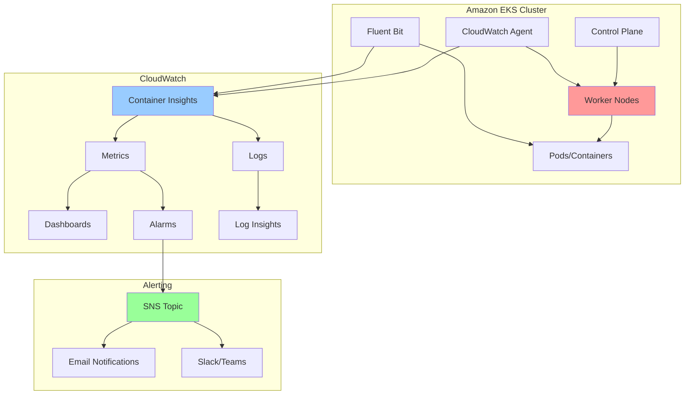

# EKS Monitoring with CloudWatch Container Insights

## Problem

You have containerized workloads running on Amazon EKS in production, but lack comprehensive visibility into cluster health, resource utilization, and application performance. Without proper monitoring, performance issues or resource constraints can go unnoticed until they cause service disruptions or affect user experience. Manual monitoring is time-consuming and unreliable, especially outside business hours. Small teams particularly need automated monitoring solutions that alert them when metrics exceed predefined thresholds, helping to maintain service reliability while minimizing operational overhead.

## Solution

Implement comprehensive monitoring and alerting for your Amazon EKS cluster using CloudWatch Container Insights with enhanced observability. This solution provides detailed infrastructure telemetry, application logs, and proactive alerting through Amazon SNS to ensure operational visibility and timely incident response.

## Architecture Diagram



## Prerequisites

- Running Amazon EKS cluster (version 1.21 or later)
- kubectl configured with cluster access
- Containerized applications deployed on the cluster
- AWS CLI v2 installed and configured
- Basic understanding of Kubernetes concepts
- IAM permissions for CloudWatch, SNS, and EKS operations

## Preparation

Amazon EKS requires proper configuration and credentials to enable comprehensive monitoring. Setting up these environment variables ensures consistent resource naming and proper regional configuration for all monitoring components.

1. **Set required environment variables:**

```bash
export CLUSTER_NAME=your-eks-cluster-name
export AWS_REGION=us-west-2
export AWS_ACCOUNT_ID=$(aws sts get-caller-identity \
	--query Account --output text)
```

These variables will be used throughout the implementation to ensure consistent naming and proper regional deployment of monitoring resources.

2. **Verify EKS cluster access:**

Cluster connectivity validation ensures your kubectl configuration is properly set up to communicate with the EKS control plane, which is essential for deploying monitoring components.

```bash
# Verify connectivity to your EKS cluster
# This command should return a list of worker nodes
kubectl get nodes
```

Successful execution confirms that kubectl is correctly configured and can communicate with your EKS cluster's API server.

3. **Create an SNS topic for alerts:**

[Amazon SNS](https://docs.aws.amazon.com/sns/latest/dg/sns-create-topic.html) provides a fully managed pub/sub messaging service that enables real-time alert delivery to multiple endpoints, ensuring your team receives immediate notifications when monitoring thresholds are exceeded.

```bash
# Create SNS topic for monitoring alerts
# This will be used to send notifications when alarms are triggered
TOPIC_ARN=$(aws sns create-topic \
	--name eks-monitoring-alerts \
	--query TopicArn --output text)
```

The topic is now ready to receive alarm notifications and distribute them to subscribed endpoints, enabling automated incident response workflows.

4. **Subscribe your email to the SNS topic:**

[Email subscriptions](https://docs.aws.amazon.com/sns/latest/dg/sns-email-notifications.html) provide immediate notification delivery to your operations team, ensuring critical alerts are received even when team members are away from monitoring dashboards.

```bash
# Subscribe to receive email notifications
# Replace with your actual email address
aws sns subscribe --topic-arn $TOPIC_ARN \
	--protocol email \
	--notification-endpoint your-email@example.com
```

Email subscription enables immediate alert delivery, ensuring your team can respond promptly to monitoring events regardless of their current activity.

> **Note**: Check your email and confirm the SNS subscription to receive alerts.

## Steps

1. **Enable Container Insights with enhanced observability on your EKS cluster:**

[Container Insights with enhanced observability](https://docs.aws.amazon.com/AmazonCloudWatch/latest/monitoring/container-insights-detailed-metrics.html) provides comprehensive monitoring capabilities that extend beyond basic metrics to include control plane logging, detailed performance metrics, and application-level observability. This foundation enables complete visibility into your EKS cluster's health and performance.

```bash
# Enable comprehensive logging for the EKS control plane
# This provides detailed audit and diagnostic information
aws eks update-cluster-config \
	--region $AWS_REGION \
	--name $CLUSTER_NAME \
	--logging '{"enable":["api","audit","authenticator", \
	"controllerManager","scheduler"]}'
```

Control plane logging captures detailed diagnostic information about cluster operations, API calls, and authentication events, which is essential for troubleshooting complex issues and maintaining security compliance.

2. **Create the CloudWatch namespace and service account:**

Kubernetes namespaces provide logical isolation and resource organization, enabling clear separation between monitoring infrastructure and application workloads. This separation improves security, resource management, and operational clarity.

```bash
# Create the dedicated namespace for CloudWatch monitoring components
# This separates monitoring infrastructure from application workloads
kubectl apply -f https://raw.githubusercontent.com/aws-samples/amazon-cloudwatch-container-insights/latest/k8s-deployment-manifest-templates/deployment-mode/daemonset/container-insights-monitoring/cloudwatch-namespace.yaml
```

The dedicated namespace ensures monitoring components are properly isolated and can be managed independently from your application workloads.

3. **Create the CloudWatch service account with IRSA (IAM Roles for Service Accounts):**

[IAM Roles for Service Accounts (IRSA)](https://docs.aws.amazon.com/eks/latest/userguide/iam-roles-for-service-accounts.html) enables secure AWS service access from Kubernetes pods without storing long-lived credentials. This security mechanism uses temporary, automatically rotated credentials that follow the principle of least privilege.

```bash
# Create service account with IAM role for CloudWatch agent
# IRSA provides secure access to AWS services without storing credentials
eksctl create iamserviceaccount \
	--name cloudwatch-agent \
	--namespace amazon-cloudwatch \
	--cluster $CLUSTER_NAME \
	--region $AWS_REGION \
	--attach-policy-arn arn:aws:iam::aws:policy/CloudWatchAgentServerPolicy \
	--approve \
	--override-existing-serviceaccounts
```

The service account is now configured with secure AWS access, enabling the CloudWatch agent to collect and send metrics without exposing permanent credentials in your cluster.

> **Tip**: IRSA provides secure, temporary credentials to Kubernetes pods, eliminating the need to store long-lived AWS credentials and following security best practices for cloud-native applications.

4. **Deploy the CloudWatch agent as a DaemonSet:**

Kubernetes DaemonSets ensure that monitoring agents run on every worker node in your cluster, providing complete coverage for metrics collection. This deployment pattern is essential for infrastructure monitoring as it guarantees no node goes unmonitored.

```bash
# Deploy CloudWatch agent to collect metrics from all nodes
# The DaemonSet ensures one agent pod runs on every worker node
curl -s https://raw.githubusercontent.com/aws-samples/amazon-cloudwatch-container-insights/latest/k8s-deployment-manifest-templates/deployment-mode/daemonset/container-insights-monitoring/cwagent/cwagent-daemonset.yaml | \
sed "s/{{cluster_name}}/$CLUSTER_NAME/;s/{{region_name}}/$AWS_REGION/" | \
kubectl apply -f -
```

The CloudWatch agent is now deployed across all worker nodes, collecting detailed metrics about CPU, memory, disk, and network utilization at both the node and container levels.

5. **Deploy Fluent Bit for log collection:**

Fluent Bit is a lightweight, high-performance log processor that efficiently collects, processes, and forwards container logs from all pods in your cluster. Its low resource footprint makes it ideal for production environments where resource efficiency is critical.

```bash
# Deploy Fluent Bit to collect and forward container logs
# This lightweight log processor efficiently handles high-volume log streams
curl -s https://raw.githubusercontent.com/aws-samples/amazon-cloudwatch-container-insights/latest/k8s-deployment-manifest-templates/deployment-mode/daemonset/container-insights-monitoring/fluent-bit/fluent-bit.yaml | \
sed "s/{{cluster_name}}/$CLUSTER_NAME/;s/{{region_name}}/$AWS_REGION/;s/{{http_server_toggle}}/On/;s/{{http_server_port}}/2020/;s/{{read_from_head}}/Off/;s/{{read_from_tail}}/On/" | \
kubectl apply -f -
```

Fluent Bit is now collecting and forwarding container logs to CloudWatch Logs, enabling centralized log analysis and correlation with performance metrics.

6. **Create a CloudWatch alarm for high CPU utilization:**

[CloudWatch alarms](https://docs.aws.amazon.com/AmazonCloudWatch/latest/monitoring/Best-Practice-Alarms.html) provide automated monitoring that triggers notifications when resource utilization exceeds defined thresholds. High CPU utilization can indicate resource constraints, inefficient applications, or potential scaling needs.

```bash
# Create alarm for cluster-wide high CPU usage
# This helps identify resource constraints that could impact performance
aws cloudwatch put-metric-alarm \
	--alarm-name "EKS-${CLUSTER_NAME}-HighCPU" \
	--alarm-description "EKS cluster high CPU utilization" \
	--metric-name node_cpu_utilization \
	--namespace ContainerInsights \
	--statistic Average \
	--period 300 \
	--threshold 80 \
	--comparison-operator GreaterThanThreshold \
	--dimensions Name=ClusterName,Value=$CLUSTER_NAME \
	--evaluation-periods 2 \
	--alarm-actions $TOPIC_ARN \
	--treat-missing-data notBreaching
```

The CPU alarm will notify your team when average utilization exceeds 80% for two consecutive 5-minute periods, enabling proactive response to resource constraints before they impact application performance.

7. **Create a CloudWatch alarm for high memory utilization:**

Memory exhaustion in Kubernetes clusters can lead to pod evictions, application crashes, and service instability. Monitoring memory utilization helps prevent these issues by alerting before critical thresholds are reached.

```bash
# Create alarm for cluster-wide high memory usage
# Memory exhaustion can cause pod evictions and application instability
aws cloudwatch put-metric-alarm \
	--alarm-name "EKS-${CLUSTER_NAME}-HighMemory" \
	--alarm-description "EKS cluster high memory utilization" \
	--metric-name node_memory_utilization \
	--namespace ContainerInsights \
	--statistic Average \
	--period 300 \
	--threshold 85 \
	--comparison-operator GreaterThanThreshold \
	--dimensions Name=ClusterName,Value=$CLUSTER_NAME \
	--evaluation-periods 2 \
	--alarm-actions $TOPIC_ARN \
	--treat-missing-data notBreaching
```

The memory alarm provides early warning when utilization exceeds 85%, allowing time to scale resources or investigate memory-intensive workloads before they cause service disruptions.

8. **Create a CloudWatch alarm for failed pods:**

Failed pods often indicate application issues, configuration problems, or resource constraints. Immediate notification of pod failures enables rapid response to prevent service degradation and maintain application availability.

```bash
# Create alarm for failed or crashing pods
# This helps detect application issues and deployment problems quickly
aws cloudwatch put-metric-alarm \
	--alarm-name "EKS-${CLUSTER_NAME}-FailedPods" \
	--alarm-description "EKS cluster has failed pods" \
	--metric-name cluster_failed_node_count \
	--namespace ContainerInsights \
	--statistic Maximum \
	--period 300 \
	--threshold 1 \
	--comparison-operator GreaterThanOrEqualToThreshold \
	--dimensions Name=ClusterName,Value=$CLUSTER_NAME \
	--evaluation-periods 1 \
	--alarm-actions $TOPIC_ARN \
	--treat-missing-data notBreaching
```

The failed pods alarm immediately notifies your team when any pod enters a failed state, enabling rapid investigation and remediation of application issues.

## Validation & Testing

1. Verify that Container Insights is collecting metrics:

```bash
# Check that CloudWatch is receiving metrics from your cluster
# This confirms the monitoring infrastructure is working correctly
aws cloudwatch list-metrics \
	--namespace ContainerInsights \
	--dimensions Name=ClusterName,Value=$CLUSTER_NAME
```

You should see multiple metrics like `node_cpu_utilization`, `node_memory_utilization`, and `pod_cpu_utilization`.

2. Check that the CloudWatch agent pods are running:

```bash
# Verify all monitoring components are deployed and healthy
# All pods should show "Running" status
kubectl get pods -n amazon-cloudwatch
```

Expected output should show `cloudwatch-agent` and `fluent-bit` pods in `Running` status.

3. Access the Container Insights dashboard in the AWS Console:
   - Navigate to CloudWatch > Insights > Container Insights
   - Select your cluster name
   - Verify that metrics and performance data are being displayed

4. Test alerting by generating high CPU load (optional):

```bash
# Deploy a temporary stress test to validate alarm functionality
# This creates a high CPU load to test your monitoring alarms
kubectl run cpu-stress --image=progrium/stress \
	-- stress --cpu 2 --timeout 300s
```

5. Query application logs using CloudWatch Logs Insights:

```bash
# Query recent application logs to verify log collection
# This demonstrates how to search and analyze container logs
aws logs start-query \
	--log-group-name "/aws/containerinsights/$CLUSTER_NAME/application" \
	--start-time $(date -d '1 hour ago' +%s) \
	--end-time $(date +%s) \
	--query-string 'fields @timestamp, kubernetes.pod_name, log | limit 100'
```

> **Warning**: The CPU stress test in step 4 may trigger your high CPU alarm. This is expected behavior for testing purposes.

## Cleanup

1. Remove test workloads (if created):

```bash
kubectl delete pod cpu-stress --ignore-not-found
```

2. Delete CloudWatch alarms:

```bash
aws cloudwatch delete-alarms \
	--alarm-names "EKS-${CLUSTER_NAME}-HighCPU" \
	"EKS-${CLUSTER_NAME}-HighMemory" \
	"EKS-${CLUSTER_NAME}-FailedPods"
```

3. Remove Fluent Bit and CloudWatch agent:

```bash
kubectl delete -f https://raw.githubusercontent.com/aws-samples/amazon-cloudwatch-container-insights/latest/k8s-deployment-manifest-templates/deployment-mode/daemonset/container-insights-monitoring/fluent-bit/fluent-bit.yaml

kubectl delete -f https://raw.githubusercontent.com/aws-samples/amazon-cloudwatch-container-insights/latest/k8s-deployment-manifest-templates/deployment-mode/daemonset/container-insights-monitoring/cwagent/cwagent-daemonset.yaml
```

4. Delete the CloudWatch namespace:

```bash
kubectl delete namespace amazon-cloudwatch
```

5. Remove the SNS topic:

```bash
aws sns delete-topic --topic-arn $TOPIC_ARN
```

6. Delete the IRSA service account:

```bash
eksctl delete iamserviceaccount \
	--name cloudwatch-agent \
	--namespace amazon-cloudwatch \
	--cluster $CLUSTER_NAME \
	--region $AWS_REGION
```

## Discussion

[Container Insights with enhanced observability](https://docs.aws.amazon.com/AmazonCloudWatch/latest/monitoring/container-insights-detailed-metrics.html) for Amazon EKS provides comprehensive monitoring capabilities that go far beyond basic cluster metrics. This solution collects detailed infrastructure telemetry, application logs, and control plane metrics, giving you complete visibility into your Kubernetes environment. The enhanced observability feature provides granular health, performance, and status metrics down to the container level, including important control plane metrics that help you understand the overall health of your EKS cluster's management components.

[CloudWatch alarms](https://docs.aws.amazon.com/AmazonCloudWatch/latest/monitoring/Best-Practice-Alarms.html) enable proactive monitoring by automatically notifying you when resource utilization exceeds defined thresholds or when cluster components fail. The integration with Amazon SNS allows you to route these alerts to multiple channels, including email, Slack, PagerDuty, or any HTTP endpoint, ensuring your operations team can respond quickly to potential issues. The three alarms created in this recipe cover the most critical scenarios: high CPU utilization, high memory utilization, and node failures, which represent the majority of infrastructure-related incidents in Kubernetes environments.

For additional insights, you can leverage CloudWatch Logs Insights to perform complex queries across your application and system logs, helping you correlate metrics with log data for faster root cause analysis. The solution also supports cross-account observability, allowing you to centralize monitoring across multiple AWS accounts from a single monitoring account. Consider implementing custom metrics using the CloudWatch embedded metric format (EMF) in your applications to track business-specific KPIs alongside infrastructure metrics.

This monitoring foundation provides the observability needed to maintain high availability, optimize performance, and ensure compliance with operational requirements in production Kubernetes environments.

## Challenge

1. **Enhanced Alerting**: Extend the monitoring solution by creating composite alarms that combine multiple metrics (e.g., high CPU AND high memory) to reduce false positives and create more intelligent alerting rules.

2. **Custom Dashboard**: Create a custom CloudWatch dashboard that combines EKS metrics with application-specific metrics, and configure it to display key performance indicators (KPIs) relevant to your specific workloads. Include widgets for pod restart counts, ingress traffic patterns, and application response times.

## Infrastructure Code

*Infrastructure code will be generated after recipe approval.*