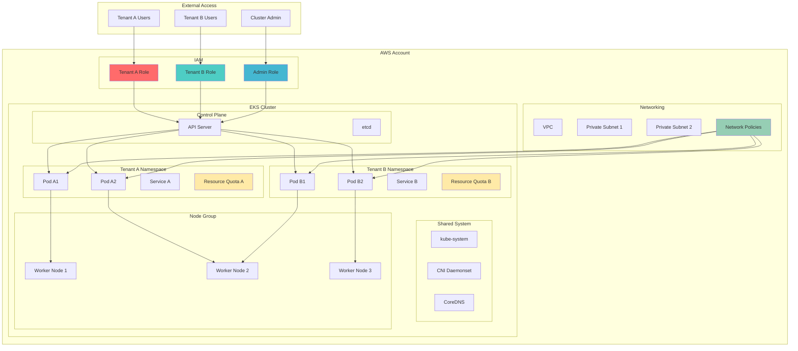

# EKS Multi-Tenant Security with Namespaces

## Problem

Organizations running multiple teams, applications, or customers on shared EKS clusters face significant security challenges including resource access control, network isolation, and preventing tenants from accessing each other's data or compute resources. Traditional single-tenant approaches result in expensive cluster proliferation and complex management overhead, while inadequate isolation can lead to data breaches, compliance violations, and performance degradation from resource contention.

## Solution

This recipe implements soft multi-tenancy using Kubernetes native constructs including namespaces, RBAC, network policies, and resource quotas to create logical isolation between tenants while maintaining cost efficiency through shared infrastructure. By combining AWS IAM with Kubernetes RBAC, implementing network segmentation, and enforcing resource constraints, organizations can achieve secure multi-tenant environments that balance isolation requirements with operational efficiency.

## Architecture Diagram



## Prerequisites

1. AWS account with appropriate permissions for EKS, IAM, and VPC management
2. AWS CLI v2 installed and configured (or AWS CloudShell)
3. kubectl command-line tool installed and configured
4. Basic understanding of Kubernetes concepts (pods, namespaces, services)
5. Familiarity with RBAC and IAM principles
6. An existing EKS cluster with authentication mode set to API or API_AND_CONFIG_MAP
7. Estimated cost: $0.10/hour for EKS cluster + $0.05/hour per worker node + minimal charges for IAM operations

> **Note**: This recipe assumes you have an existing EKS cluster with access entries enabled. If you need to create one or change the authentication mode, refer to the [AWS EKS User Guide](https://docs.aws.amazon.com/eks/latest/userguide/getting-started.html) for cluster creation steps.

## Preparation

```bash
# Set environment variables
export AWS_REGION=$(aws configure get region)
export AWS_ACCOUNT_ID=$(aws sts get-caller-identity \
    --query Account --output text)
export CLUSTER_NAME="my-multi-tenant-cluster"

# Generate unique identifiers for tenants
export TENANT_A_NAME="tenant-alpha"
export TENANT_B_NAME="tenant-beta"

# Verify EKS cluster exists and is accessible
aws eks describe-cluster --name ${CLUSTER_NAME} \
    --query 'cluster.status' --output text

# Update kubeconfig for cluster access
aws eks update-kubeconfig --name ${CLUSTER_NAME} \
    --region ${AWS_REGION}

# Verify kubectl connectivity
kubectl cluster-info

echo "✅ Environment prepared successfully"
```

## Steps

1. **Create Tenant Namespaces with Labels**:

   Namespaces provide the fundamental isolation boundary for multi-tenant Kubernetes clusters. Each namespace acts as a virtual cluster within the physical cluster, enabling resource scoping and access control. By creating dedicated namespaces for each tenant, we establish the foundation for implementing RBAC, network policies, and resource quotas that ensure tenant isolation.

   ```bash
   # Create namespace for Tenant A
   kubectl create namespace ${TENANT_A_NAME}
   
   # Create namespace for Tenant B
   kubectl create namespace ${TENANT_B_NAME}
   
   # Add labels for tenant identification and policy application
   kubectl label namespace ${TENANT_A_NAME} \
       tenant=alpha \
       isolation=enabled \
       environment=production
   
   kubectl label namespace ${TENANT_B_NAME} \
       tenant=beta \
       isolation=enabled \
       environment=production
   
   # Label kube-system namespace for network policy compatibility
   kubectl label namespace kube-system name=kube-system
   
   echo "✅ Tenant namespaces created with identification labels"
   ```

   The namespaces are now established as isolated environments where each tenant's resources will be deployed. The labels enable policy-based management and facilitate automated governance through tools like OPA Gatekeeper or Kyverno.

2. **Create IAM Roles for Tenant Access**:

   IAM roles provide the AWS-level authentication and authorization that integrates with Kubernetes RBAC. Each tenant role follows the principle of least privilege, granting only the minimum permissions necessary for cluster access. This dual-layer security model (AWS IAM + Kubernetes RBAC) ensures that tenant access is controlled at both the AWS API level and the Kubernetes API level.

   ```bash
   # Create trust policy for tenant roles
   cat > tenant-trust-policy.json << EOF
   {
       "Version": "2012-10-17",
       "Statement": [
           {
               "Effect": "Allow",
               "Principal": {
                   "AWS": "arn:aws:iam::${AWS_ACCOUNT_ID}:root"
               },
               "Action": "sts:AssumeRole"
           }
       ]
   }
   EOF
   
   # Create IAM role for Tenant A
   aws iam create-role \
       --role-name ${TENANT_A_NAME}-eks-role \
       --assume-role-policy-document file://tenant-trust-policy.json
   
   # Create IAM role for Tenant B
   aws iam create-role \
       --role-name ${TENANT_B_NAME}-eks-role \
       --assume-role-policy-document file://tenant-trust-policy.json
   
   # Wait for role propagation
   sleep 10
   
   # Clean up temporary file
   rm tenant-trust-policy.json
   
   echo "✅ IAM roles created for tenant access"
   ```

   The IAM roles are now ready to be mapped to Kubernetes RBAC permissions. These roles serve as the bridge between AWS identity management and Kubernetes cluster access, enabling centralized user management through AWS IAM while maintaining granular permissions through Kubernetes RBAC.

3. **Create Kubernetes RBAC Resources**:

   Kubernetes RBAC (Role-Based Access Control) provides fine-grained authorization within the cluster. By creating tenant-specific roles and role bindings, we ensure that each tenant can only access resources within their designated namespace. This prevents cross-tenant data access and maintains clear security boundaries within the shared cluster infrastructure.

   ```bash
   # Create RBAC role for Tenant A with namespace-scoped permissions
   cat > tenant-a-rbac.yaml << EOF
   apiVersion: rbac.authorization.k8s.io/v1
   kind: Role
   metadata:
     namespace: ${TENANT_A_NAME}
     name: ${TENANT_A_NAME}-role
   rules:
   - apiGroups: [""]
     resources: ["pods", "services", "configmaps", "secrets", "persistentvolumeclaims"]
     verbs: ["get", "list", "watch", "create", "update", "patch", "delete"]
   - apiGroups: [""]
     resources: ["pods/log", "pods/status", "pods/exec"]
     verbs: ["get", "list", "create"]
   - apiGroups: ["apps"]
     resources: ["deployments", "replicasets", "daemonsets", "statefulsets"]
     verbs: ["get", "list", "watch", "create", "update", "patch", "delete"]
   - apiGroups: ["networking.k8s.io"]
     resources: ["ingresses", "networkpolicies"]
     verbs: ["get", "list", "watch", "create", "update", "patch", "delete"]
   ---
   apiVersion: rbac.authorization.k8s.io/v1
   kind: RoleBinding
   metadata:
     name: ${TENANT_A_NAME}-binding
     namespace: ${TENANT_A_NAME}
   subjects:
   - kind: User
     name: ${TENANT_A_NAME}-user
     apiGroup: rbac.authorization.k8s.io
   roleRef:
     kind: Role
     name: ${TENANT_A_NAME}-role
     apiGroup: rbac.authorization.k8s.io
   EOF
   
   # Create RBAC role for Tenant B with identical permissions
   cat > tenant-b-rbac.yaml << EOF
   apiVersion: rbac.authorization.k8s.io/v1
   kind: Role
   metadata:
     namespace: ${TENANT_B_NAME}
     name: ${TENANT_B_NAME}-role
   rules:
   - apiGroups: [""]
     resources: ["pods", "services", "configmaps", "secrets", "persistentvolumeclaims"]
     verbs: ["get", "list", "watch", "create", "update", "patch", "delete"]
   - apiGroups: [""]
     resources: ["pods/log", "pods/status", "pods/exec"]
     verbs: ["get", "list", "create"]
   - apiGroups: ["apps"]
     resources: ["deployments", "replicasets", "daemonsets", "statefulsets"]
     verbs: ["get", "list", "watch", "create", "update", "patch", "delete"]
   - apiGroups: ["networking.k8s.io"]
     resources: ["ingresses", "networkpolicies"]
     verbs: ["get", "list", "watch", "create", "update", "patch", "delete"]
   ---
   apiVersion: rbac.authorization.k8s.io/v1
   kind: RoleBinding
   metadata:
     name: ${TENANT_B_NAME}-binding
     namespace: ${TENANT_B_NAME}
   subjects:
   - kind: User
     name: ${TENANT_B_NAME}-user
     apiGroup: rbac.authorization.k8s.io
   roleRef:
     kind: Role
     name: ${TENANT_B_NAME}-role
     apiGroup: rbac.authorization.k8s.io
   EOF
   
   # Apply RBAC configurations
   kubectl apply -f tenant-a-rbac.yaml
   kubectl apply -f tenant-b-rbac.yaml
   
   echo "✅ RBAC roles and bindings created for tenant isolation"
   ```

   The RBAC system now enforces namespace-level isolation, ensuring that tenant users can only manipulate resources within their designated namespaces. This fine-grained authorization layer works in conjunction with IAM roles to provide comprehensive access control.

4. **Configure EKS Access Entries for IAM-to-RBAC Mapping**:

   EKS access entries provide a modern, scalable approach to mapping AWS IAM identities to Kubernetes RBAC permissions. This integration eliminates the need for manual ConfigMap management while providing better auditing and security through native AWS controls. Access entries enable seamless authentication flow from AWS IAM to Kubernetes RBAC.

   ```bash
   # Create access entry for Tenant A
   aws eks create-access-entry \
       --cluster-name ${CLUSTER_NAME} \
       --principal-arn arn:aws:iam::${AWS_ACCOUNT_ID}:role/${TENANT_A_NAME}-eks-role \
       --type STANDARD \
       --username ${TENANT_A_NAME}-user
   
   # Create access entry for Tenant B
   aws eks create-access-entry \
       --cluster-name ${CLUSTER_NAME} \
       --principal-arn arn:aws:iam::${AWS_ACCOUNT_ID}:role/${TENANT_B_NAME}-eks-role \
       --type STANDARD \
       --username ${TENANT_B_NAME}-user
   
   # Wait for access entries to propagate
   sleep 15
   
   echo "✅ Access entries configured for IAM-to-RBAC mapping"
   ```

   The access entries now bridge AWS IAM authentication with Kubernetes RBAC authorization. When users assume their respective IAM roles, they automatically receive the corresponding Kubernetes permissions defined in the RBAC role bindings.

5. **Implement Network Policies for Tenant Isolation**:

   Network policies provide crucial network-level isolation between tenants by controlling traffic flow at the pod level. By default, Kubernetes allows all pod-to-pod communication, which violates multi-tenant security principles. Network policies create firewall-like rules that prevent cross-tenant communication while allowing necessary system traffic.

   ```bash
   # Create network policy for Tenant A namespace
   cat > tenant-a-network-policy.yaml << EOF
   apiVersion: networking.k8s.io/v1
   kind: NetworkPolicy
   metadata:
     name: ${TENANT_A_NAME}-isolation
     namespace: ${TENANT_A_NAME}
   spec:
     podSelector: {}
     policyTypes:
     - Ingress
     - Egress
     ingress:
     - from:
       - namespaceSelector:
           matchLabels:
             tenant: alpha
     - from:
       - namespaceSelector:
           matchLabels:
             name: kube-system
     egress:
     - to:
       - namespaceSelector:
           matchLabels:
             tenant: alpha
     - to:
       - namespaceSelector:
           matchLabels:
             name: kube-system
     - to: []
       ports:
       - protocol: TCP
         port: 53
       - protocol: UDP
         port: 53
     - to: []
       ports:
       - protocol: TCP
         port: 443
       - protocol: TCP
         port: 80
   EOF
   
   # Create network policy for Tenant B namespace
   cat > tenant-b-network-policy.yaml << EOF
   apiVersion: networking.k8s.io/v1
   kind: NetworkPolicy
   metadata:
     name: ${TENANT_B_NAME}-isolation
     namespace: ${TENANT_B_NAME}
   spec:
     podSelector: {}
     policyTypes:
     - Ingress
     - Egress
     ingress:
     - from:
       - namespaceSelector:
           matchLabels:
             tenant: beta
     - from:
       - namespaceSelector:
           matchLabels:
             name: kube-system
     egress:
     - to:
       - namespaceSelector:
           matchLabels:
             tenant: beta
     - to:
       - namespaceSelector:
           matchLabels:
             name: kube-system
     - to: []
       ports:
       - protocol: TCP
         port: 53
       - protocol: UDP
         port: 53
     - to: []
       ports:
       - protocol: TCP
         port: 443
       - protocol: TCP
         port: 80
   EOF
   
   # Apply network policies
   kubectl apply -f tenant-a-network-policy.yaml
   kubectl apply -f tenant-b-network-policy.yaml
   
   echo "✅ Network policies implemented for tenant isolation"
   ```

   Network isolation is now enforced at the pod level, preventing cross-tenant communication while maintaining essential cluster connectivity. The policies allow DNS resolution, system namespace access, and external HTTP/HTTPS traffic while blocking unauthorized inter-tenant traffic.

> **Warning**: Network policies require a compatible CNI plugin such as Calico, Cilium, or the AWS VPC CNI with network policy support. Ensure your EKS cluster has [network policy enforcement enabled](https://aws.amazon.com/blogs/containers/amazon-vpc-cni-now-supports-kubernetes-network-policies/) before implementing these policies.

6. **Configure Resource Quotas and Limits**:

   Resource quotas prevent resource exhaustion and ensure fair resource distribution among tenants. By implementing compute and storage limits, we protect the cluster from resource starvation scenarios while guaranteeing minimum resource availability for each tenant. This is essential for maintaining SLA commitments and preventing noisy neighbor problems.

   ```bash
   # Create resource quota for Tenant A
   cat > tenant-a-quota.yaml << EOF
   apiVersion: v1
   kind: ResourceQuota
   metadata:
     name: ${TENANT_A_NAME}-quota
     namespace: ${TENANT_A_NAME}
   spec:
     hard:
       requests.cpu: "2"
       requests.memory: 4Gi
       limits.cpu: "4"
       limits.memory: 8Gi
       pods: "10"
       services: "5"
       secrets: "10"
       configmaps: "10"
       persistentvolumeclaims: "4"
   ---
   apiVersion: v1
   kind: LimitRange
   metadata:
     name: ${TENANT_A_NAME}-limits
     namespace: ${TENANT_A_NAME}
   spec:
     limits:
     - default:
         cpu: 200m
         memory: 256Mi
       defaultRequest:
         cpu: 100m
         memory: 128Mi
       type: Container
     - max:
         cpu: 500m
         memory: 512Mi
       min:
         cpu: 50m
         memory: 64Mi
       type: Container
   EOF
   
   # Create resource quota for Tenant B
   cat > tenant-b-quota.yaml << EOF
   apiVersion: v1
   kind: ResourceQuota
   metadata:
     name: ${TENANT_B_NAME}-quota
     namespace: ${TENANT_B_NAME}
   spec:
     hard:
       requests.cpu: "2"
       requests.memory: 4Gi
       limits.cpu: "4"
       limits.memory: 8Gi
       pods: "10"
       services: "5"
       secrets: "10"
       configmaps: "10"
       persistentvolumeclaims: "4"
   ---
   apiVersion: v1
   kind: LimitRange
   metadata:
     name: ${TENANT_B_NAME}-limits
     namespace: ${TENANT_B_NAME}
   spec:
     limits:
     - default:
         cpu: 200m
         memory: 256Mi
       defaultRequest:
         cpu: 100m
         memory: 128Mi
       type: Container
     - max:
         cpu: 500m
         memory: 512Mi
       min:
         cpu: 50m
         memory: 64Mi
       type: Container
   EOF
   
   # Apply resource quotas and limits
   kubectl apply -f tenant-a-quota.yaml
   kubectl apply -f tenant-b-quota.yaml
   
   echo "✅ Resource quotas and limits configured for fair resource allocation"
   ```

   Resource governance is now in place, ensuring that each tenant has guaranteed minimum resources while preventing any single tenant from consuming excessive cluster resources. This maintains cluster stability and performance predictability.

7. **Deploy Sample Applications for Testing**:

   Sample applications demonstrate the multi-tenant isolation in action and provide concrete examples of how workloads operate within the secured environment. These test deployments validate that the isolation mechanisms work correctly while providing a foundation for further testing and validation.

   ```bash
   # Deploy sample application for Tenant A
   cat > tenant-a-app.yaml << EOF
   apiVersion: apps/v1
   kind: Deployment
   metadata:
     name: ${TENANT_A_NAME}-app
     namespace: ${TENANT_A_NAME}
   spec:
     replicas: 2
     selector:
       matchLabels:
         app: ${TENANT_A_NAME}-app
     template:
       metadata:
         labels:
           app: ${TENANT_A_NAME}-app
       spec:
         containers:
         - name: app
           image: nginx:1.24
           ports:
           - containerPort: 80
           resources:
             requests:
               cpu: 100m
               memory: 128Mi
             limits:
               cpu: 200m
               memory: 256Mi
           livenessProbe:
             httpGet:
               path: /
               port: 80
             initialDelaySeconds: 30
             periodSeconds: 10
           readinessProbe:
             httpGet:
               path: /
               port: 80
             initialDelaySeconds: 5
             periodSeconds: 5
   ---
   apiVersion: v1
   kind: Service
   metadata:
     name: ${TENANT_A_NAME}-service
     namespace: ${TENANT_A_NAME}
   spec:
     selector:
       app: ${TENANT_A_NAME}-app
     ports:
     - port: 80
       targetPort: 80
   EOF
   
   # Deploy sample application for Tenant B
   cat > tenant-b-app.yaml << EOF
   apiVersion: apps/v1
   kind: Deployment
   metadata:
     name: ${TENANT_B_NAME}-app
     namespace: ${TENANT_B_NAME}
   spec:
     replicas: 2
     selector:
       matchLabels:
         app: ${TENANT_B_NAME}-app
     template:
       metadata:
         labels:
           app: ${TENANT_B_NAME}-app
       spec:
         containers:
         - name: app
           image: httpd:2.4
           ports:
           - containerPort: 80
           resources:
             requests:
               cpu: 100m
               memory: 128Mi
             limits:
               cpu: 200m
               memory: 256Mi
           livenessProbe:
             httpGet:
               path: /
               port: 80
             initialDelaySeconds: 30
             periodSeconds: 10
           readinessProbe:
             httpGet:
               path: /
               port: 80
             initialDelaySeconds: 5
             periodSeconds: 5
   ---
   apiVersion: v1
   kind: Service
   metadata:
     name: ${TENANT_B_NAME}-service
     namespace: ${TENANT_B_NAME}
   spec:
     selector:
       app: ${TENANT_B_NAME}-app
     ports:
     - port: 80
       targetPort: 80
   EOF
   
   # Deploy applications
   kubectl apply -f tenant-a-app.yaml
   kubectl apply -f tenant-b-app.yaml
   
   # Wait for deployments to be ready
   kubectl wait --for=condition=available --timeout=300s \
       deployment/${TENANT_A_NAME}-app -n ${TENANT_A_NAME}
   kubectl wait --for=condition=available --timeout=300s \
       deployment/${TENANT_B_NAME}-app -n ${TENANT_B_NAME}
   
   echo "✅ Sample applications deployed for isolation testing"
   ```

   The sample applications are now running in their respective isolated namespaces, providing a practical environment for testing and validating the multi-tenant security configuration.

## Validation & Testing

1. **Verify Namespace Isolation**:

   ```bash
   # Check namespace creation and labels
   kubectl get namespaces --show-labels | \
       grep -E "(tenant-alpha|tenant-beta)"
   
   # Verify pods are running in correct namespaces
   kubectl get pods -n ${TENANT_A_NAME}
   kubectl get pods -n ${TENANT_B_NAME}
   ```

   Expected output: Namespaces should show appropriate labels and pods should be running only in their designated namespaces.

2. **Test RBAC Permissions**:

   ```bash
   # Test cross-namespace access restrictions
   kubectl auth can-i get pods --as=${TENANT_A_NAME}-user \
       -n ${TENANT_B_NAME}
   kubectl auth can-i get pods --as=${TENANT_B_NAME}-user \
       -n ${TENANT_A_NAME}
   
   # Test allowed namespace access
   kubectl auth can-i get pods --as=${TENANT_A_NAME}-user \
       -n ${TENANT_A_NAME}
   kubectl auth can-i create deployments --as=${TENANT_A_NAME}-user \
       -n ${TENANT_A_NAME}
   ```

   Expected output: Cross-namespace access should be denied (no), while same-namespace access should be allowed (yes).

3. **Validate Network Policy Enforcement**:

   ```bash
   # Test network connectivity between tenants (should fail)
   kubectl exec -n ${TENANT_A_NAME} \
       $(kubectl get pods -n ${TENANT_A_NAME} -o jsonpath='{.items[0].metadata.name}') \
       -- timeout 5 curl -s ${TENANT_B_NAME}-service.${TENANT_B_NAME}.svc.cluster.local
   
   # Test internal connectivity (should succeed)
   kubectl exec -n ${TENANT_A_NAME} \
       $(kubectl get pods -n ${TENANT_A_NAME} -o jsonpath='{.items[0].metadata.name}') \
       -- timeout 5 curl -s ${TENANT_A_NAME}-service.${TENANT_A_NAME}.svc.cluster.local
   
   # Test external connectivity (should succeed)
   kubectl exec -n ${TENANT_A_NAME} \
       $(kubectl get pods -n ${TENANT_A_NAME} -o jsonpath='{.items[0].metadata.name}') \
       -- timeout 5 curl -s https://httpbin.org/get
   ```

   Expected output: Cross-tenant network access should timeout or fail, while intra-tenant and external access should succeed.

4. **Verify Resource Quotas**:

   ```bash
   # Check resource quota usage
   kubectl describe quota ${TENANT_A_NAME}-quota -n ${TENANT_A_NAME}
   kubectl describe quota ${TENANT_B_NAME}-quota -n ${TENANT_B_NAME}
   
   # Check limit ranges
   kubectl describe limitrange ${TENANT_A_NAME}-limits -n ${TENANT_A_NAME}
   
   # Verify pod resource constraints
   kubectl get pods -n ${TENANT_A_NAME} -o yaml | \
       grep -A 4 -B 2 resources:
   ```

   Expected output: Resource quotas should show current usage and limits, with containers having appropriate resource constraints.

## Cleanup

1. **Remove Sample Applications**:

   ```bash
   # Delete sample applications
   kubectl delete -f tenant-a-app.yaml
   kubectl delete -f tenant-b-app.yaml
   
   echo "✅ Sample applications deleted"
   ```

2. **Remove Resource Quotas and Network Policies**:

   ```bash
   # Delete resource quotas and limit ranges
   kubectl delete -f tenant-a-quota.yaml
   kubectl delete -f tenant-b-quota.yaml
   
   # Delete network policies
   kubectl delete -f tenant-a-network-policy.yaml
   kubectl delete -f tenant-b-network-policy.yaml
   
   echo "✅ Resource quotas and network policies deleted"
   ```

3. **Remove RBAC Resources**:

   ```bash
   # Delete RBAC configurations
   kubectl delete -f tenant-a-rbac.yaml
   kubectl delete -f tenant-b-rbac.yaml
   
   echo "✅ RBAC resources deleted"
   ```

4. **Remove EKS Access Entries**:

   ```bash
   # Delete access entries
   aws eks delete-access-entry \
       --cluster-name ${CLUSTER_NAME} \
       --principal-arn arn:aws:iam::${AWS_ACCOUNT_ID}:role/${TENANT_A_NAME}-eks-role
   
   aws eks delete-access-entry \
       --cluster-name ${CLUSTER_NAME} \
       --principal-arn arn:aws:iam::${AWS_ACCOUNT_ID}:role/${TENANT_B_NAME}-eks-role
   
   echo "✅ Access entries deleted"
   ```

5. **Remove IAM Roles and Namespaces**:

   ```bash
   # Delete IAM roles
   aws iam delete-role --role-name ${TENANT_A_NAME}-eks-role
   aws iam delete-role --role-name ${TENANT_B_NAME}-eks-role
   
   # Delete namespaces (this will cascade delete all resources)
   kubectl delete namespace ${TENANT_A_NAME}
   kubectl delete namespace ${TENANT_B_NAME}
   
   # Clean up temporary files
   rm -f tenant-*-*.yaml
   
   echo "✅ IAM roles and namespaces deleted"
   ```

## Discussion

Multi-tenant security in Kubernetes requires a layered approach that combines multiple isolation mechanisms to achieve comprehensive security. The implementation presented here demonstrates "soft multi-tenancy" using native Kubernetes constructs, which provides logical isolation while maintaining cost efficiency through shared infrastructure. This approach is particularly suitable for enterprise environments with semi-trusted tenants or SaaS applications requiring moderate isolation levels.

The integration of AWS IAM with Kubernetes RBAC creates a robust authentication and authorization framework. AWS IAM handles identity management and cluster-level authentication, while Kubernetes RBAC provides fine-grained authorization within the cluster. This dual-layer security model ensures that access control is enforced at both the AWS API level and the Kubernetes API level, reducing the risk of privilege escalation and unauthorized access. The modern EKS access entries feature provides better auditability and eliminates the complexity of managing the aws-auth ConfigMap.

Network policies provide crucial network-level isolation by implementing microsegmentation within the cluster. Unlike traditional network security that relies on perimeter defenses, network policies create pod-level firewall rules that prevent lateral movement between tenant workloads. This is essential for compliance requirements and defense-in-depth strategies, particularly in environments handling sensitive data or regulated workloads. The policies implemented here follow a default-deny approach with explicit allow rules for necessary communication.

Resource quotas and limit ranges ensure fair resource distribution and prevent resource starvation scenarios. By implementing both namespace-level quotas and pod-level limits, administrators can guarantee minimum resource availability for each tenant while preventing any single tenant from consuming excessive cluster resources. This resource governance is critical for maintaining SLA commitments and ensuring predictable performance across all tenants. The limit ranges also provide default resource requests and limits for containers that don't specify them.

> **Tip**: For enhanced security in highly regulated environments, consider implementing additional controls such as Pod Security Standards, OPA Gatekeeper policies, or container image scanning. Review the [AWS EKS Security Best Practices Guide](https://docs.aws.amazon.com/eks/latest/best-practices/security.html) for comprehensive security recommendations.

## Challenge

Extend this multi-tenant security implementation with these advanced enhancements:

1. **Implement Pod Security Standards** to enforce security policies at the pod level, including security contexts, privilege restrictions, and capability controls for enhanced container security.

2. **Deploy OPA Gatekeeper** with custom policies to enforce organizational security standards, validate resource configurations, and automatically inject security controls based on namespace labels.

3. **Configure node-level tenant isolation** using node affinity, taints, and tolerations to ensure tenant workloads run on dedicated nodes for stronger isolation boundaries.

4. **Implement secret management** with AWS Secrets Manager integration using the Secret Store CSI Driver to provide secure credential management for tenant applications without storing secrets in etcd.

5. **Add monitoring and alerting** using CloudWatch Container Insights and Prometheus to detect policy violations, resource limit breaches, and potential security incidents across tenant namespaces.

## Infrastructure Code

*Infrastructure code will be generated after recipe approval.*