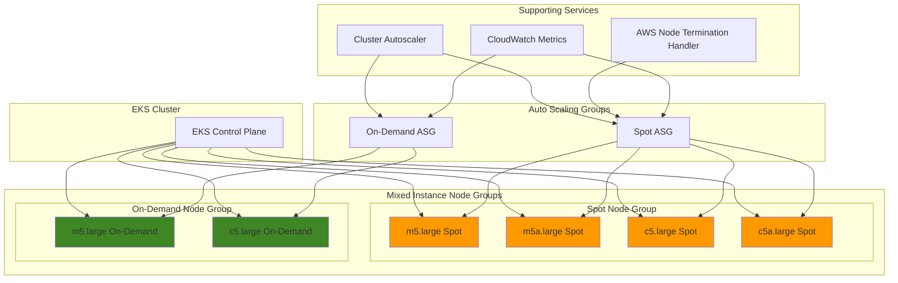

# Cost-Optimized EKS Node Groups with Spot and Mixed Instances

## Problem

Organizations running Kubernetes workloads on Amazon EKS face escalating compute costs, especially when using On-Demand instances for non-critical workloads. Development teams often over-provision infrastructure to handle peak workloads, leading to significant waste during off-peak hours. Additionally, relying on a single instance type creates potential bottlenecks when specific instance families experience capacity constraints or price fluctuations.

## Solution

This recipe demonstrates how to create cost-optimized EKS node groups using EC2 Spot instances and mixed instance types. By leveraging Spot instances, you can achieve up to 90% cost savings compared to On-Demand instances, while mixed instance types provide flexibility and resilience against capacity constraints. The solution includes proper interruption handling, instance diversification strategies, and automated scaling configurations.

## Architecture Diagram



## Prerequisites

1. AWS account with EKS and EC2 permissions for managing clusters and node groups
2. AWS CLI v2 installed and configured (or AWS CloudShell)
3. kubectl CLI tool installed and configured
4. Basic understanding of Kubernetes node management and EC2 instance types
5. Existing EKS cluster (version 1.24 or higher recommended)
6. Estimated cost: $50-200/month depending on node group sizes and usage patterns

> **Note**: Spot instances can be interrupted with 2-minute notice, making them suitable for fault-tolerant workloads but not for critical production systems requiring guaranteed availability.

## Preparation

```bash
# Set environment variables
export AWS_REGION=$(aws configure get region)
export AWS_ACCOUNT_ID=$(aws sts get-caller-identity \
    --query Account --output text)

# Generate unique identifier for resources
RANDOM_SUFFIX=$(aws secretsmanager get-random-password \
    --exclude-punctuation --exclude-uppercase \
    --password-length 6 --require-each-included-type \
    --output text --query RandomPassword 2>/dev/null || \
    echo $(date +%s | tail -c 6))

# Set cluster and node group names (update CLUSTER_NAME to existing cluster)
export CLUSTER_NAME="your-existing-cluster-name"
export SPOT_NODE_GROUP_NAME="spot-mixed-nodegroup"
export ONDEMAND_NODE_GROUP_NAME="ondemand-backup-nodegroup"

# Create IAM role for EKS node groups
cat > node-group-trust-policy.json << EOF
{
  "Version": "2012-10-17",
  "Statement": [
    {
      "Effect": "Allow",
      "Principal": {
        "Service": "ec2.amazonaws.com"
      },
      "Action": "sts:AssumeRole"
    }
  ]
}
EOF

# Create the node group IAM role
aws iam create-role \
    --role-name "EKSNodeGroupRole-${RANDOM_SUFFIX}" \
    --assume-role-policy-document file://node-group-trust-policy.json

# Attach required policies to the node group role
aws iam attach-role-policy \
    --role-name "EKSNodeGroupRole-${RANDOM_SUFFIX}" \
    --policy-arn arn:aws:iam::aws:policy/AmazonEKSWorkerNodePolicy

aws iam attach-role-policy \
    --role-name "EKSNodeGroupRole-${RANDOM_SUFFIX}" \
    --policy-arn arn:aws:iam::aws:policy/AmazonEKS_CNI_Policy

aws iam attach-role-policy \
    --role-name "EKSNodeGroupRole-${RANDOM_SUFFIX}" \
    --policy-arn arn:aws:iam::aws:policy/AmazonEC2ContainerRegistryReadOnly

# Store the role ARN for later use
export NODE_GROUP_ROLE_ARN=$(aws iam get-role \
    --role-name "EKSNodeGroupRole-${RANDOM_SUFFIX}" \
    --query Role.Arn --output text)

echo "✅ Node group IAM role created: ${NODE_GROUP_ROLE_ARN}"

# Get VPC and subnet information from existing cluster
export VPC_ID=$(aws eks describe-cluster \
    --name ${CLUSTER_NAME} \
    --query cluster.resourcesVpcConfig.vpcId \
    --output text 2>/dev/null || echo "")

if [ -z "$VPC_ID" ]; then
    echo "⚠️  Please set CLUSTER_NAME to an existing EKS cluster"
    echo "Available clusters:"
    aws eks list-clusters --query clusters --output table
    exit 1
fi

# Get private subnets for the node groups
export PRIVATE_SUBNET_IDS=$(aws eks describe-cluster \
    --name ${CLUSTER_NAME} \
    --query 'cluster.resourcesVpcConfig.subnetIds' \
    --output text | tr '\t' ' ')

echo "✅ Using VPC: ${VPC_ID}"
echo "✅ Using subnets: ${PRIVATE_SUBNET_IDS}"

# Clean up temporary files
rm -f node-group-trust-policy.json
```

## Steps

1. **Create Spot Instance Node Group with Mixed Instance Types**:

   Amazon EKS managed node groups simplify the provisioning and lifecycle management of worker nodes by automatically handling patching, node health, and scaling operations. When configured with [Spot instances](https://docs.aws.amazon.com/eks/latest/userguide/managed-node-groups.html), these node groups can deliver up to 90% cost savings compared to On-Demand instances while maintaining high availability through intelligent instance diversification. Mixed instance types spread capacity requests across multiple instance families, reducing the risk of simultaneous interruptions and improving overall cluster resilience.

   ```bash
   # Create spot node group with diverse instance types for cost optimization
   aws eks create-nodegroup \
       --cluster-name ${CLUSTER_NAME} \
       --nodegroup-name ${SPOT_NODE_GROUP_NAME} \
       --node-role ${NODE_GROUP_ROLE_ARN} \
       --subnets ${PRIVATE_SUBNET_IDS} \
       --scaling-config minSize=2,maxSize=10,desiredSize=4 \
       --capacity-type SPOT \
       --instance-types m5.large m5a.large c5.large c5a.large \
           m5.xlarge c5.xlarge \
       --ami-type AL2_x86_64 \
       --disk-size 30 \
       --update-config maxUnavailable=1 \
       --labels 'node-type=spot,cost-optimization=enabled' \
       --tags 'Environment=production,NodeType=spot,CostOptimization=enabled'
   
   echo "✅ Spot node group creation initiated"
   ```

   The node group is now being created with six different instance types from the M5, M5A, and C5 families, providing optimal balance between compute performance and cost efficiency. This diversification strategy follows AWS best practices for [choosing instance types](https://docs.aws.amazon.com/eks/latest/userguide/choosing-instance-type.html) and maximizes the probability of successful Spot instance fulfillment across multiple availability zones.

2. **Create On-Demand Backup Node Group**:

   On-Demand instances provide guaranteed capacity with predictable pricing, making them essential for critical workloads that require consistent availability. In a hybrid architecture, On-Demand nodes serve as a reliability foundation while Spot instances handle fault-tolerant workloads. This smaller node group acts as a safety net, ensuring that essential system components like logging agents, monitoring tools, and critical applications can maintain operations even during widespread Spot interruptions.

   ```bash
   # Create smaller on-demand node group for critical workloads
   aws eks create-nodegroup \
       --cluster-name ${CLUSTER_NAME} \
       --nodegroup-name ${ONDEMAND_NODE_GROUP_NAME} \
       --node-role ${NODE_GROUP_ROLE_ARN} \
       --subnets ${PRIVATE_SUBNET_IDS} \
       --scaling-config minSize=1,maxSize=3,desiredSize=2 \
       --capacity-type ON_DEMAND \
       --instance-types m5.large c5.large \
       --ami-type AL2_x86_64 \
       --disk-size 30 \
       --update-config maxUnavailable=1 \
       --labels 'node-type=on-demand,workload-type=critical' \
       --tags 'Environment=production,NodeType=on-demand,WorkloadType=critical'
   
   echo "✅ On-demand node group creation initiated"
   ```

   The On-Demand node group is configured with a smaller capacity (1-3 instances) to minimize costs while providing sufficient resilience for critical workloads. The strategic use of fewer instance types (m5.large and c5.large) simplifies capacity planning while maintaining the performance characteristics needed for reliable operation.

3. **Wait for Node Groups to Become Active**:

   Node group creation is an asynchronous process that involves provisioning EC2 instances, configuring the Kubernetes kubelet, and joining nodes to the cluster. The AWS CLI wait command provides a reliable way to ensure node groups reach the ACTIVE state before proceeding with cluster configuration. This synchronization is critical because subsequent steps depend on nodes being fully operational and ready to accept workloads.

   ```bash
   # Wait for spot node group to be active
   echo "Waiting for spot node group to become active..."
   aws eks wait nodegroup-active \
       --cluster-name ${CLUSTER_NAME} \
       --nodegroup-name ${SPOT_NODE_GROUP_NAME}
   
   echo "✅ Spot node group is now active"
   
   # Wait for on-demand node group to be active
   echo "Waiting for on-demand node group to become active..."
   aws eks wait nodegroup-active \
       --cluster-name ${CLUSTER_NAME} \
       --nodegroup-name ${ONDEMAND_NODE_GROUP_NAME}
   
   echo "✅ On-demand node group is now active"
   ```

   Both node groups are now operational with their respective EC2 instances joined to the cluster and ready to schedule pods. The managed node groups automatically handle the complex bootstrap process, including configuring the kubelet, setting up networking, and establishing secure communication with the EKS control plane.

4. **Install AWS Node Termination Handler**:

   The AWS Node Termination Handler is a critical component for Spot instance management that monitors EC2 instance metadata and CloudWatch events to detect impending interruptions. When a Spot interruption notice is received, the handler automatically cordons the node, drains running pods, and ensures graceful workload migration to healthy nodes. This automated response prevents service disruptions and maintains application availability during capacity changes.

   ```bash
   # Install AWS Node Termination Handler to gracefully handle spot interruptions
   kubectl apply -f https://github.com/aws/aws-node-termination-handler/releases/download/v1.25.2/all-resources.yaml
   
   # Verify the installation
   kubectl get daemonset aws-node-termination-handler \
       --namespace kube-system
   
   echo "✅ AWS Node Termination Handler installed"
   ```

   The Node Termination Handler is now deployed as a DaemonSet, ensuring every node in the cluster has a monitoring agent that can respond to termination events. This proactive approach to instance lifecycle management is essential for maintaining service reliability in Spot-based architectures and aligns with AWS best practices for fault-tolerant workload design.

5. **Configure Node Taints for Spot Instances**:

   Kubernetes taints and tolerations provide a powerful mechanism to control pod scheduling and prevent inappropriate workload placement. By applying taints to Spot nodes, we ensure that only pods with matching tolerations can be scheduled on these potentially interruptible instances. This selective scheduling prevents critical workloads from being placed on Spot instances while allowing fault-tolerant applications to leverage the cost savings. The NoSchedule effect means that pods without the proper toleration will not be scheduled on these nodes.

   ```bash
   # Get spot instance node names
   SPOT_NODES=$(kubectl get nodes -l node-type=spot \
       --no-headers -o custom-columns=NAME:.metadata.name)
   
   # Apply taints to spot nodes to prevent scheduling of critical workloads
   for node in $SPOT_NODES; do
       kubectl taint nodes $node \
           node-type=spot:NoSchedule --overwrite
       echo "✅ Tainted spot node: $node"
   done
   
   # Verify taints were applied
   kubectl get nodes -l node-type=spot \
       -o custom-columns=NAME:.metadata.name,TAINTS:.spec.taints
   ```

   Spot nodes are now protected with taints that prevent scheduling of workloads without explicit tolerations. This configuration creates a clear separation between reliable On-Demand capacity for critical services and cost-optimized Spot capacity for resilient workloads, as described in AWS [node taint documentation](https://docs.aws.amazon.com/eks/latest/userguide/node-taints-managed-node-groups.html).

6. **Create Pod Disruption Budget for Spot Workloads**:

   Pod Disruption Budgets (PDBs) provide a safety mechanism that ensures minimum availability during voluntary disruptions such as node maintenance, updates, or planned scaling events. For Spot workloads, PDBs are particularly important because they prevent too many replicas from being terminated simultaneously during node interruptions. By specifying minAvailable: 1, we guarantee that at least one pod instance remains running during disruption events, maintaining service continuity.

   ```bash
   # Create a pod disruption budget to ensure availability during spot interruptions
   cat > spot-pdb.yaml << EOF
   apiVersion: policy/v1
   kind: PodDisruptionBudget
   metadata:
     name: spot-workload-pdb
   spec:
     minAvailable: 1
     selector:
       matchLabels:
         workload-type: spot-tolerant
   EOF
   
   kubectl apply -f spot-pdb.yaml
   
   echo "✅ Pod disruption budget created for spot workloads"
   ```

   The Pod Disruption Budget is now active and will influence how the cluster handles disruptions to spot-tolerant workloads. This policy ensures that operational procedures like cluster autoscaling, node upgrades, and spot interruption handling respect application availability requirements while maintaining cost optimization benefits.

7. **Deploy Test Application with Spot Tolerance**:

   This demonstration application showcases how to configure workloads for optimal Spot instance utilization through tolerations and node selectors. The toleration allows the pods to be scheduled on tainted Spot nodes, while the nodeSelector ensures they prefer Spot instances for maximum cost savings. The application uses 6 replicas to demonstrate distribution across multiple nodes and provide redundancy against individual node interruptions. Resource requests and limits are carefully configured to enable efficient bin-packing and predictable scaling behavior.

   ```bash
   # Create a sample application that can run on spot instances
   cat > spot-demo-app.yaml << EOF
   apiVersion: apps/v1
   kind: Deployment
   metadata:
     name: spot-demo-app
   spec:
     replicas: 6
     selector:
       matchLabels:
         app: spot-demo-app
         workload-type: spot-tolerant
     template:
       metadata:
         labels:
           app: spot-demo-app
           workload-type: spot-tolerant
       spec:
         tolerations:
         - key: node-type
           operator: Equal
           value: spot
           effect: NoSchedule
         nodeSelector:
           node-type: spot
         containers:
         - name: nginx
           image: nginx:latest
           resources:
             requests:
               cpu: 100m
               memory: 128Mi
             limits:
               cpu: 200m
               memory: 256Mi
           ports:
           - containerPort: 80
   ---
   apiVersion: v1
   kind: Service
   metadata:
     name: spot-demo-service
   spec:
     selector:
       app: spot-demo-app
     ports:
     - protocol: TCP
       port: 80
       targetPort: 80
     type: ClusterIP
   EOF
   
   kubectl apply -f spot-demo-app.yaml
   
   echo "✅ Spot-tolerant demo application deployed"
   ```

   The application is now running exclusively on Spot instances, demonstrating the proper configuration patterns for cost-optimized workloads. The Pod Disruption Budget created earlier will protect against simultaneous termination of all replicas during node interruptions, while the tolerations ensure the application can leverage the significant cost savings of Spot capacity.

8. **Create IAM Role for Cluster Autoscaler**:

   The Cluster Autoscaler requires specific IAM permissions to manage Auto Scaling Groups and EC2 instances on behalf of the EKS cluster. These permissions follow the principle of least privilege, granting only the minimum access needed for autoscaling operations. IAM Roles for Service Accounts (IRSA) provides secure, temporary credentials without embedding long-term access keys in pod configurations. This approach aligns with AWS security best practices for [EKS autoscaling](https://docs.aws.amazon.com/eks/latest/userguide/autoscaling.html).

   ```bash
   # Create cluster autoscaler IAM policy
   cat > cluster-autoscaler-policy.json << EOF
   {
       "Version": "2012-10-17",
       "Statement": [
           {
               "Effect": "Allow",
               "Action": [
                   "autoscaling:DescribeAutoScalingGroups",
                   "autoscaling:DescribeAutoScalingInstances",
                   "autoscaling:DescribeLaunchConfigurations",
                   "autoscaling:DescribeTags",
                   "autoscaling:SetDesiredCapacity",
                   "autoscaling:TerminateInstanceInAutoScalingGroup",
                   "ec2:DescribeLaunchTemplateVersions"
               ],
               "Resource": "*"
           }
       ]
   }
   EOF
   
   # Create IAM policy for cluster autoscaler
   aws iam create-policy \
       --policy-name "ClusterAutoscalerPolicy-${RANDOM_SUFFIX}" \
       --policy-document file://cluster-autoscaler-policy.json
   
   # Create trust policy for IRSA
   cat > autoscaler-trust-policy.json << EOF
   {
     "Version": "2012-10-17",
     "Statement": [
       {
         "Effect": "Allow",
         "Principal": {
           "Federated": "arn:aws:iam::${AWS_ACCOUNT_ID}:oidc-provider/$(aws eks describe-cluster --name ${CLUSTER_NAME} --query cluster.identity.oidc.issuer --output text | sed 's|https://||')"
         },
         "Action": "sts:AssumeRoleWithWebIdentity",
         "Condition": {
           "StringEquals": {
             "$(aws eks describe-cluster --name ${CLUSTER_NAME} --query cluster.identity.oidc.issuer --output text | sed 's|https://||'):sub": "system:serviceaccount:kube-system:cluster-autoscaler",
             "$(aws eks describe-cluster --name ${CLUSTER_NAME} --query cluster.identity.oidc.issuer --output text | sed 's|https://||'):aud": "sts.amazonaws.com"
           }
         }
       }
     ]
   }
   EOF
   
   # Create IAM role for cluster autoscaler
   aws iam create-role \
       --role-name "ClusterAutoscalerRole-${RANDOM_SUFFIX}" \
       --assume-role-policy-document file://autoscaler-trust-policy.json
   
   # Attach policy to role
   aws iam attach-role-policy \
       --role-name "ClusterAutoscalerRole-${RANDOM_SUFFIX}" \
       --policy-arn arn:aws:iam::${AWS_ACCOUNT_ID}:policy/ClusterAutoscalerPolicy-${RANDOM_SUFFIX}
   
   echo "✅ Cluster autoscaler IAM role created"
   ```

   The IAM role and policy are now configured to enable secure autoscaling operations using temporary credentials through IRSA. This setup follows AWS security best practices and ensures the Cluster Autoscaler can manage node groups without permanent access keys.

9. **Deploy Cluster Autoscaler**:

   The Cluster Autoscaler deployment uses the `least-waste` expander strategy, which selects node groups that minimize resource waste after pod scheduling. This optimization is particularly valuable for mixed instance types because it can intelligently choose the most cost-effective instance family for current workload patterns. The auto-discovery feature automatically detects node groups tagged for autoscaling, eliminating the need for manual configuration. This approach follows [Cluster Autoscaler best practices](https://docs.aws.amazon.com/eks/latest/best-practices/cas.html) for optimal resource utilization and cost management.

   ```bash
   # Create service account for cluster autoscaler
   kubectl create serviceaccount cluster-autoscaler \
       --namespace kube-system
   
   # Annotate service account with IAM role
   kubectl annotate serviceaccount cluster-autoscaler \
       --namespace kube-system \
       eks.amazonaws.com/role-arn=arn:aws:iam::${AWS_ACCOUNT_ID}:role/ClusterAutoscalerRole-${RANDOM_SUFFIX}
   
   # Deploy cluster autoscaler
   kubectl apply -f https://raw.githubusercontent.com/kubernetes/autoscaler/master/cluster-autoscaler/cloudprovider/aws/examples/cluster-autoscaler-autodiscover.yaml
   
   # Patch the deployment to use the correct cluster name and configurations
   kubectl patch deployment cluster-autoscaler \
       --namespace kube-system \
       --patch '{"spec":{"template":{"spec":{"containers":[{"name":"cluster-autoscaler","command":["./cluster-autoscaler","--v=4","--stderrthreshold=info","--cloud-provider=aws","--skip-nodes-with-local-storage=false","--expander=least-waste","--node-group-auto-discovery=asg:tag=k8s.io/cluster-autoscaler/enabled,k8s.io/cluster-autoscaler/'${CLUSTER_NAME}'"]}]}}}}'
   
   # Verify cluster autoscaler is running
   kubectl get pods -n kube-system -l app=cluster-autoscaler
   
   echo "✅ Cluster autoscaler deployed and configured"
   ```

   The Cluster Autoscaler is now actively monitoring pod scheduling and will automatically scale node groups up when resources are needed and scale down when nodes are underutilized, optimizing both cost and performance.

10. **Configure Cost Monitoring and Alerts**:

    Effective cost monitoring enables proactive management of Spot instance economics and operational health. CloudWatch alarms provide early warning when interruption rates exceed normal thresholds, indicating potential issues with instance type selection or market conditions. This visibility helps optimize instance diversification strategies and maintain application availability.

    ```bash
    # Create CloudWatch log group for monitoring
    aws logs create-log-group \
        --log-group-name "/aws/eks/${CLUSTER_NAME}/spot-monitoring" \
        --region ${AWS_REGION}
    
    # Create CloudWatch alarm for high spot interruption rate
    aws cloudwatch put-metric-alarm \
        --alarm-name "EKS-${CLUSTER_NAME}-HighSpotInterruptions" \
        --alarm-description "High spot instance interruption rate detected" \
        --metric-name SpotInstanceTerminating \
        --namespace AWS/EC2 \
        --statistic Sum \
        --period 300 \
        --threshold 3 \
        --comparison-operator GreaterThanThreshold \
        --evaluation-periods 2
    
    echo "✅ Cost monitoring and alerts configured"
    ```

    The monitoring infrastructure now tracks Spot interruption patterns and provides visibility into instance lifecycle events, enabling proactive adjustments to instance type strategies.

> **Warning**: Configure appropriate SNS topics for alarm notifications to receive alerts about Spot interruptions and operational events.

## Validation & Testing

1. **Verify Node Groups Are Active**:

   ```bash
   # Check node group status
   aws eks describe-nodegroup \
       --cluster-name ${CLUSTER_NAME} \
       --nodegroup-name ${SPOT_NODE_GROUP_NAME} \
       --query 'nodegroup.status' --output text
   
   aws eks describe-nodegroup \
       --cluster-name ${CLUSTER_NAME} \
       --nodegroup-name ${ONDEMAND_NODE_GROUP_NAME} \
       --query 'nodegroup.status' --output text
   ```

   Expected output: `ACTIVE` for both node groups

2. **Verify Mixed Instance Types Are Running**:

   ```bash
   # Check instance types in use
   kubectl get nodes -o wide \
       --show-labels | grep -E "(m5|c5)"
   
   # Check spot vs on-demand distribution
   kubectl get nodes -l node-type=spot \
       --no-headers | wc -l
   
   kubectl get nodes -l node-type=on-demand \
       --no-headers | wc -l
   ```

3. **Test Spot Instance Tolerance**:

   ```bash
   # Verify demo application is running on spot instances
   kubectl get pods -o wide -l app=spot-demo-app
   
   # Check pod distribution across instance types
   kubectl get pods -o wide -l workload-type=spot-tolerant
   ```

4. **Test Node Termination Handler**:

   ```bash
   # Check node termination handler pods
   kubectl get pods -n kube-system \
       -l app.kubernetes.io/name=aws-node-termination-handler
   
   # Check logs for proper configuration
   kubectl logs -n kube-system \
       -l app.kubernetes.io/name=aws-node-termination-handler --tail=50
   ```

5. **Verify Cluster Autoscaler Configuration**:

   ```bash
   # Check cluster autoscaler is running
   kubectl get deployment cluster-autoscaler -n kube-system
   
   # Check autoscaler logs
   kubectl logs -n kube-system deployment/cluster-autoscaler --tail=50
   ```

## Cleanup

1. **Remove Test Applications**:

   ```bash
   # Delete demo application
   kubectl delete -f spot-demo-app.yaml
   
   # Remove pod disruption budget
   kubectl delete -f spot-pdb.yaml
   
   echo "✅ Test applications removed"
   ```

2. **Remove Node Groups**:

   ```bash
   # Delete spot node group
   aws eks delete-nodegroup \
       --cluster-name ${CLUSTER_NAME} \
       --nodegroup-name ${SPOT_NODE_GROUP_NAME}
   
   # Delete on-demand node group
   aws eks delete-nodegroup \
       --cluster-name ${CLUSTER_NAME} \
       --nodegroup-name ${ONDEMAND_NODE_GROUP_NAME}
   
   echo "✅ Node group deletion initiated"
   ```

3. **Wait for Node Groups to Be Deleted**:

   ```bash
   # Wait for spot node group deletion
   aws eks wait nodegroup-deleted \
       --cluster-name ${CLUSTER_NAME} \
       --nodegroup-name ${SPOT_NODE_GROUP_NAME}
   
   # Wait for on-demand node group deletion
   aws eks wait nodegroup-deleted \
       --cluster-name ${CLUSTER_NAME} \
       --nodegroup-name ${ONDEMAND_NODE_GROUP_NAME}
   
   echo "✅ Node groups deleted"
   ```

4. **Remove IAM Roles and Policies**:

   ```bash
   # Detach policies from node group role
   aws iam detach-role-policy \
       --role-name "EKSNodeGroupRole-${RANDOM_SUFFIX}" \
       --policy-arn arn:aws:iam::aws:policy/AmazonEKSWorkerNodePolicy
   
   aws iam detach-role-policy \
       --role-name "EKSNodeGroupRole-${RANDOM_SUFFIX}" \
       --policy-arn arn:aws:iam::aws:policy/AmazonEKS_CNI_Policy
   
   aws iam detach-role-policy \
       --role-name "EKSNodeGroupRole-${RANDOM_SUFFIX}" \
       --policy-arn arn:aws:iam::aws:policy/AmazonEC2ContainerRegistryReadOnly
   
   # Delete IAM roles
   aws iam delete-role \
       --role-name "EKSNodeGroupRole-${RANDOM_SUFFIX}"
   
   aws iam detach-role-policy \
       --role-name "ClusterAutoscalerRole-${RANDOM_SUFFIX}" \
       --policy-arn arn:aws:iam::${AWS_ACCOUNT_ID}:policy/ClusterAutoscalerPolicy-${RANDOM_SUFFIX}
   
   aws iam delete-role \
       --role-name "ClusterAutoscalerRole-${RANDOM_SUFFIX}"
   
   # Delete cluster autoscaler policy
   aws iam delete-policy \
       --policy-arn arn:aws:iam::${AWS_ACCOUNT_ID}:policy/ClusterAutoscalerPolicy-${RANDOM_SUFFIX}
   
   echo "✅ IAM roles and policies removed"
   ```

5. **Remove Kubernetes Components**:

   ```bash
   # Remove AWS node termination handler
   kubectl delete -f https://github.com/aws/aws-node-termination-handler/releases/download/v1.25.2/all-resources.yaml
   
   # Remove cluster autoscaler
   kubectl delete -f https://raw.githubusercontent.com/kubernetes/autoscaler/master/cluster-autoscaler/cloudprovider/aws/examples/cluster-autoscaler-autodiscover.yaml
   
   echo "✅ Kubernetes components removed"
   ```

6. **Clean Up Local Files**:

   ```bash
   # Remove temporary files
   rm -f spot-demo-app.yaml spot-pdb.yaml \
       cluster-autoscaler-policy.json autoscaler-trust-policy.json
   
   # Clear environment variables
   unset CLUSTER_NAME SPOT_NODE_GROUP_NAME ONDEMAND_NODE_GROUP_NAME
   unset NODE_GROUP_ROLE_ARN VPC_ID PRIVATE_SUBNET_IDS RANDOM_SUFFIX
   
   echo "✅ Local cleanup completed"
   ```

## Discussion

This recipe demonstrates a comprehensive approach to cost optimization in Amazon EKS by leveraging EC2 Spot instances and mixed instance types. The key architectural decision is to create separate node groups for different workload types, allowing for fine-grained control over cost and availability trade-offs as outlined in the [EKS managed node groups documentation](https://docs.aws.amazon.com/eks/latest/userguide/managed-node-groups.html).

The mixed instance type strategy provides several critical benefits. First, it increases the likelihood of successful Spot instance fulfillment by spreading requests across multiple instance families (m5, m5a, c5, c5a). Second, it reduces the risk of simultaneous interruptions affecting all nodes, as different instance types typically have different interruption patterns based on supply and demand dynamics. The AWS Node Termination Handler ensures graceful handling of Spot interruptions by draining nodes before termination, preventing abrupt workload failures.

The combination of Spot instances for fault-tolerant workloads and On-Demand instances for critical systems creates a balanced approach to cost optimization. Organizations can achieve significant cost savings (up to 90% on compute costs) while maintaining reliability for essential services. The Cluster Autoscaler automatically adjusts node group sizes based on workload demands, ensuring optimal resource utilization without manual intervention. This architecture follows AWS best practices for [mixed instance Auto Scaling groups](https://docs.aws.amazon.com/autoscaling/ec2/userguide/ec2-auto-scaling-mixed-instances-groups.html) and the [Cluster Autoscaler best practices guide](https://docs.aws.amazon.com/eks/latest/best-practices/cas.html).

> **Tip**: Consider using the `capacity-optimized` allocation strategy for Spot instances to maximize availability and reduce interruption frequency by selecting instances from pools with optimal capacity. This strategy is recommended in the [AWS EC2 Spot best practices guide](https://docs.aws.amazon.com/AWSEC2/latest/UserGuide/spot-best-practices.html) for production workloads.

## Challenge

Extend this solution by implementing these enhancements:

1. **Implement Advanced Spot Fleet Management**: Create a custom controller that monitors Spot instance pricing and automatically adjusts instance type preferences based on current market conditions and availability zones.

2. **Add Workload-Aware Scheduling**: Implement Pod Priority Classes and custom schedulers that automatically place workloads on the most cost-effective nodes based on workload characteristics and SLA requirements.

3. **Create Cost Optimization Dashboard**: Build a comprehensive monitoring solution using CloudWatch and Grafana that tracks real-time cost savings, interruption rates, and resource utilization across different instance types.

4. **Implement Predictive Scaling**: Integrate with AWS Forecast or custom ML models to predict workload patterns and pre-scale node groups before demand spikes, optimizing both cost and performance.

5. **Add Multi-AZ Spot Optimization**: Enhance the solution to dynamically distribute Spot instances across multiple availability zones based on current pricing and capacity, maximizing cost savings and availability.

## Infrastructure Code

*Infrastructure code will be generated after recipe approval.*