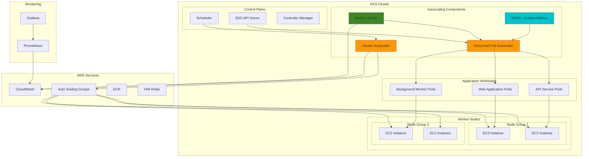

# EKS Workload Auto Scaling

## Problem

Enterprise applications running on Kubernetes often experience unpredictable traffic patterns and resource demands that can lead to performance issues, cost inefficiencies, and service disruptions. Manual scaling of pods and cluster nodes is reactive, time-consuming, and prone to human error. Without proper autoscaling mechanisms, organizations either over-provision resources (increasing costs) or under-provision (causing performance degradation and potential downtime), while also struggling to maintain optimal resource utilization across multiple workloads with varying scaling requirements.

## Solution

This recipe implements a comprehensive autoscaling solution for Amazon EKS that combines Horizontal Pod Autoscaler (HPA) for application-level scaling with Cluster Autoscaler for infrastructure-level scaling. The solution automatically adjusts pod replicas based on CPU, memory, and custom metrics, while dynamically scaling the underlying EC2 nodes to meet resource demands. This approach ensures optimal resource utilization, cost efficiency, and application performance by leveraging Kubernetes-native scaling mechanisms integrated with AWS services.

## Architecture Diagram



## Prerequisites

1. AWS account with appropriate permissions for EKS, EC2, IAM, and CloudWatch
2. AWS CLI v2 installed and configured (or AWS CloudShell)
3. kubectl client configured to communicate with your EKS cluster
4. eksctl CLI tool installed for EKS cluster management
5. Helm v3 installed for package management
6. Basic understanding of Kubernetes concepts (pods, deployments, services)
7. Familiarity with HPA and cluster autoscaling concepts
8. Estimated cost: $150-300/month for cluster resources during testing

> **Note**: This recipe creates multiple EC2 instances and EKS resources that incur charges. Monitor your AWS costs and clean up resources when not needed. For detailed cost information, see the [Amazon EKS pricing documentation](https://docs.aws.amazon.com/eks/latest/userguide/eks-pricing.html).

## Preparation

```bash
# Set environment variables
export AWS_REGION=$(aws configure get region)
export AWS_ACCOUNT_ID=$(aws sts get-caller-identity \
    --query Account --output text)
export CLUSTER_NAME="eks-autoscaling-demo"
export NODEGROUP_NAME="autoscaling-nodes"

# Generate unique suffix for resources
export RANDOM_SUFFIX=$(aws secretsmanager get-random-password \
    --exclude-punctuation --exclude-uppercase \
    --password-length 6 --require-each-included-type \
    --output text --query RandomPassword)

# Set cluster and resource names
export CLUSTER_FULL_NAME="${CLUSTER_NAME}-${RANDOM_SUFFIX}"
export SERVICE_ACCOUNT_NAME="cluster-autoscaler"
export NAMESPACE="kube-system"

echo "✅ Environment prepared with cluster name: ${CLUSTER_FULL_NAME}"
```

## Steps

1. **Create EKS Cluster with Multiple Node Groups**:

   Amazon EKS provides a managed Kubernetes control plane that eliminates the operational burden of managing master nodes while providing enterprise-grade security, scalability, and availability. Creating multiple node groups with different instance types enables workload-specific optimization and cost-effective resource allocation. The general-purpose node group handles standard workloads while the compute-optimized group serves CPU-intensive applications, allowing the Cluster Autoscaler to scale each group independently based on workload demands.

   ```bash
   # Create cluster configuration file
   cat > cluster-config.yaml << EOF
   apiVersion: eksctl.io/v1alpha5
   kind: ClusterConfig
   
   metadata:
     name: ${CLUSTER_FULL_NAME}
     region: ${AWS_REGION}
     version: "1.30"
   
   managedNodeGroups:
     - name: general-purpose
       instanceTypes: ["m5.large", "m5.xlarge"]
       desiredCapacity: 2
       minSize: 1
       maxSize: 10
       volumeSize: 20
       ssh:
         allow: false
       labels:
         workload-type: "general"
       tags:
         k8s.io/cluster-autoscaler/enabled: "true"
         k8s.io/cluster-autoscaler/${CLUSTER_FULL_NAME}: "owned"
     
     - name: compute-optimized
       instanceTypes: ["c5.large", "c5.xlarge"]
       desiredCapacity: 1
       minSize: 0
       maxSize: 5
       volumeSize: 20
       ssh:
         allow: false
       labels:
         workload-type: "compute"
       tags:
         k8s.io/cluster-autoscaler/enabled: "true"
         k8s.io/cluster-autoscaler/${CLUSTER_FULL_NAME}: "owned"
   
   addons:
     - name: vpc-cni
       version: latest
     - name: coredns
       version: latest
     - name: kube-proxy
       version: latest
     - name: aws-ebs-csi-driver
       version: latest
   
   iam:
     withOIDC: true
     serviceAccounts:
       - metadata:
           name: ${SERVICE_ACCOUNT_NAME}
           namespace: ${NAMESPACE}
         wellKnownPolicies:
           autoScaler: true
   EOF
   
   # Create the EKS cluster
   eksctl create cluster -f cluster-config.yaml
   
   echo "✅ EKS cluster created successfully"
   ```

   The EKS cluster is now operational with OIDC identity provider configured for service account authentication and multiple node groups ready for autoscaling. The cluster-autoscaler tags enable automatic discovery and management of Auto Scaling Groups, while the mixed instance types provide flexibility for different workload requirements. This foundation supports both horizontal pod scaling and dynamic node provisioning essential for responsive autoscaling operations.

2. **Install and Configure Metrics Server**:

   The Kubernetes Metrics Server serves as the foundation for resource-based autoscaling by collecting and aggregating CPU and memory utilization data from kubelets on each node. Without Metrics Server, Horizontal Pod Autoscaler cannot access the resource metrics needed to make scaling decisions. This lightweight component efficiently exposes container resource metrics through the Kubernetes API, enabling HPA to monitor application performance in real-time and trigger scaling events when resource thresholds are exceeded.

   ```bash
   # Deploy Metrics Server
   kubectl apply -f https://github.com/kubernetes-sigs/metrics-server/releases/latest/download/components.yaml
   
   # Wait for metrics server to be ready
   kubectl wait --for=condition=ready pod \
       -l k8s-app=metrics-server \
       -n kube-system --timeout=300s
   
   # Verify metrics server is working
   kubectl top nodes
   
   echo "✅ Metrics Server deployed and verified"
   ```

   Metrics Server is now actively collecting resource utilization data from all nodes and pods in the cluster. The successful `kubectl top nodes` command confirms that metrics are being properly aggregated and exposed through the Kubernetes API. This establishes the data foundation that HPA requires to make intelligent scaling decisions based on actual resource consumption rather than static configurations.

   > **Warning**: HPA requires resource requests to be defined for target containers to calculate utilization percentages. Without resource requests, HPA cannot determine scaling targets. See the [Amazon EKS HPA documentation](https://docs.aws.amazon.com/eks/latest/userguide/horizontal-pod-autoscaler.html) for detailed configuration requirements.

3. **Deploy Cluster Autoscaler**:

   Cluster Autoscaler bridges the gap between application demand and infrastructure capacity by automatically adjusting the number of worker nodes in response to pod scheduling requirements. When pods cannot be scheduled due to insufficient resources, Cluster Autoscaler provisions additional EC2 instances. Conversely, when nodes are underutilized, it safely drains and terminates instances to optimize costs. This infrastructure-level autoscaling complements HPA's pod-level scaling, ensuring the cluster always has adequate compute capacity without manual intervention.

   ```bash
   # Get the cluster autoscaler YAML
   curl -o cluster-autoscaler-autodiscover.yaml \
     https://raw.githubusercontent.com/kubernetes/autoscaler/master/cluster-autoscaler/cloudprovider/aws/examples/cluster-autoscaler-autodiscover.yaml
   
   # Update the cluster autoscaler configuration
   sed -i.bak "s/<YOUR CLUSTER NAME>/${CLUSTER_FULL_NAME}/g" \
       cluster-autoscaler-autodiscover.yaml
   
   # Apply the cluster autoscaler
   kubectl apply -f cluster-autoscaler-autodiscover.yaml
   
   # Get the IAM role ARN created by eksctl
   CA_ROLE_ARN=$(aws iam list-roles \
       --query "Roles[?contains(RoleName,'${CLUSTER_FULL_NAME}') && contains(RoleName,'cluster-autoscaler')].Arn" \
       --output text)
   
   # Add cluster autoscaler annotations
   kubectl annotate serviceaccount cluster-autoscaler \
     -n kube-system \
     eks.amazonaws.com/role-arn=${CA_ROLE_ARN}
   
   # Restart cluster autoscaler to pick up the annotation
   kubectl rollout restart deployment cluster-autoscaler \
       -n kube-system
   
   echo "✅ Cluster Autoscaler deployed successfully"
   ```

   Cluster Autoscaler is now monitoring the cluster for unschedulable pods and underutilized nodes. The service account annotation enables secure access to AWS Auto Scaling Groups using IAM roles for service accounts (IRSA), eliminating the need for hardcoded credentials. The auto-discovery configuration allows Cluster Autoscaler to dynamically find and manage all node groups tagged appropriately, providing seamless infrastructure scaling as workload demands change.

4. **Install KEDA for Advanced Scaling**:

   KEDA (Kubernetes Event Driven Autoscaler) extends Kubernetes autoscaling capabilities beyond CPU and memory metrics to include event-driven and custom metrics from external systems. This enables applications to scale based on business-relevant metrics such as message queue depth, database connections, or custom application metrics from Prometheus, CloudWatch, or other monitoring systems. KEDA transforms external events into Kubernetes scaling signals, enabling more sophisticated scaling policies that reflect actual application performance and user demand patterns.

   ```bash
   # Add KEDA Helm repository
   helm repo add kedacore https://kedacore.github.io/charts
   helm repo update
   
   # Install KEDA
   helm install keda kedacore/keda \
     --namespace keda-system \
     --create-namespace \
     --set prometheus.metricServer.enabled=true \
     --set prometheus.operator.enabled=true
   
   # Wait for KEDA to be ready
   kubectl wait --for=condition=ready pod \
       -l app.kubernetes.io/name=keda \
       -n keda-system --timeout=300s
   
   echo "✅ KEDA installed successfully"
   ```

   KEDA is now deployed with Prometheus integration enabled, expanding the cluster's autoscaling capabilities beyond traditional resource metrics. The KEDA operator continuously monitors external event sources and automatically creates HPA objects based on custom scaling rules. This enables event-driven autoscaling that responds to application-specific signals, providing more intelligent scaling decisions that align with actual business requirements and user demand patterns.

5. **Deploy Sample Applications with HPA Configuration**:

   Horizontal Pod Autoscaler automatically adjusts the number of pod replicas based on observed CPU, memory, or custom metrics, ensuring applications maintain optimal performance under varying load conditions. The HPA configuration includes advanced scaling behaviors with stabilization windows and percentage-based policies that prevent rapid scaling oscillations. Resource requests and limits are crucial for HPA functionality, as they establish the baseline for calculating utilization percentages and ensure predictable resource allocation during scaling events.

   ```bash
   # Create namespace for applications
   kubectl create namespace demo-apps
   
   # Deploy CPU-intensive application
   cat > cpu-app.yaml << EOF
   apiVersion: apps/v1
   kind: Deployment
   metadata:
     name: cpu-demo
     namespace: demo-apps
   spec:
     replicas: 2
     selector:
       matchLabels:
         app: cpu-demo
     template:
       metadata:
         labels:
           app: cpu-demo
       spec:
         containers:
         - name: cpu-demo
           image: registry.k8s.io/hpa-example
           ports:
           - containerPort: 80
           resources:
             requests:
               cpu: 100m
               memory: 128Mi
             limits:
               cpu: 500m
               memory: 256Mi
   ---
   apiVersion: v1
   kind: Service
   metadata:
     name: cpu-demo-service
     namespace: demo-apps
   spec:
     selector:
       app: cpu-demo
     ports:
     - port: 80
       targetPort: 80
   ---
   apiVersion: autoscaling/v2
   kind: HorizontalPodAutoscaler
   metadata:
     name: cpu-demo-hpa
     namespace: demo-apps
   spec:
     scaleTargetRef:
       apiVersion: apps/v1
       kind: Deployment
       name: cpu-demo
     minReplicas: 2
     maxReplicas: 20
     metrics:
     - type: Resource
       resource:
         name: cpu
         target:
           type: Utilization
           averageUtilization: 50
     - type: Resource
       resource:
         name: memory
         target:
           type: Utilization
           averageUtilization: 70
     behavior:
       scaleDown:
         stabilizationWindowSeconds: 300
         policies:
         - type: Percent
           value: 50
           periodSeconds: 60
       scaleUp:
         stabilizationWindowSeconds: 60
         policies:
         - type: Percent
           value: 100
           periodSeconds: 60
   EOF
   
   kubectl apply -f cpu-app.yaml
   
   echo "✅ CPU-intensive application deployed with HPA"
   ```

   The CPU-intensive application is now operational with sophisticated HPA scaling policies that monitor both CPU and memory utilization. The stabilization windows prevent thrashing by requiring sustained metric changes before triggering scaling actions, while the percentage-based scaling policies enable rapid scale-up (100% increase per minute) for responsiveness and gradual scale-down (50% decrease per minute) for stability. This configuration ensures the application can handle traffic spikes efficiently while maintaining cost effectiveness during low-demand periods.

6. **Deploy Memory-Intensive Application**:

   Memory-based scaling addresses workloads where memory consumption is the primary constraint rather than CPU usage. This application demonstrates HPA's ability to scale based on memory utilization patterns, which is particularly important for data processing applications, caches, and in-memory databases. The memory-focused HPA configuration uses an 80% utilization threshold, providing sufficient headroom to prevent out-of-memory conditions while ensuring efficient resource utilization across the scaled replica set.

   ```bash
   # Deploy memory-intensive application
   cat > memory-app.yaml << EOF
   apiVersion: apps/v1
   kind: Deployment
   metadata:
     name: memory-demo
     namespace: demo-apps
   spec:
     replicas: 1
     selector:
       matchLabels:
         app: memory-demo
     template:
       metadata:
         labels:
           app: memory-demo
       spec:
         containers:
         - name: memory-demo
           image: nginx:1.25
           ports:
           - containerPort: 80
           resources:
             requests:
               cpu: 50m
               memory: 256Mi
             limits:
               cpu: 200m
               memory: 512Mi
   ---
   apiVersion: v1
   kind: Service
   metadata:
     name: memory-demo-service
     namespace: demo-apps
   spec:
     selector:
       app: memory-demo
     ports:
     - port: 80
       targetPort: 80
   ---
   apiVersion: autoscaling/v2
   kind: HorizontalPodAutoscaler
   metadata:
     name: memory-demo-hpa
     namespace: demo-apps
   spec:
     scaleTargetRef:
       apiVersion: apps/v1
       kind: Deployment
       name: memory-demo
     minReplicas: 1
     maxReplicas: 10
     metrics:
     - type: Resource
       resource:
         name: memory
         target:
           type: Utilization
           averageUtilization: 80
     behavior:
       scaleDown:
         stabilizationWindowSeconds: 300
       scaleUp:
         stabilizationWindowSeconds: 30
   EOF
   
   kubectl apply -f memory-app.yaml
   
   echo "✅ Memory-intensive application deployed with HPA"
   ```

   The memory-focused application is now deployed with HPA policies optimized for memory-constrained workloads. The shorter scale-up stabilization window (30 seconds) enables rapid response to memory pressure, while the longer scale-down window (300 seconds) prevents premature removal of replicas during temporary memory spikes. This configuration is particularly effective for applications with unpredictable memory allocation patterns or workloads that experience gradual memory growth over time.

7. **Set Up Monitoring and Observability**:

   Comprehensive monitoring is essential for understanding autoscaling behavior, identifying optimization opportunities, and troubleshooting scaling issues. Prometheus provides metrics collection and storage for cluster-wide resource utilization, scaling events, and application performance indicators. Grafana enables visualization of autoscaling patterns, helping operators understand when and why scaling decisions occur. This observability foundation supports data-driven optimization of scaling policies and provides the insights needed to maintain optimal cluster performance and cost efficiency.

   ```bash
   # Create monitoring namespace
   kubectl create namespace monitoring
   
   # Deploy Prometheus for metrics collection
   helm repo add prometheus-community \
       https://prometheus-community.github.io/helm-charts
   helm repo update
   
   # Install Prometheus
   helm install prometheus prometheus-community/prometheus \
     --namespace monitoring \
     --set server.persistentVolume.size=20Gi \
     --set server.retention=7d \
     --set alertmanager.persistentVolume.size=10Gi
   
   # Install Grafana for visualization
   helm repo add grafana https://grafana.github.io/helm-charts
   helm install grafana grafana/grafana \
     --namespace monitoring \
     --set persistence.enabled=true \
     --set persistence.size=10Gi \
     --set adminPassword=admin123
   
   # Wait for monitoring stack to be ready
   kubectl wait --for=condition=ready pod \
       -l app=prometheus -n monitoring --timeout=300s
   kubectl wait --for=condition=ready pod \
       -l app.kubernetes.io/name=grafana \
       -n monitoring --timeout=300s
   
   echo "✅ Monitoring stack deployed successfully"
   ```

   The monitoring infrastructure is now operational, providing comprehensive visibility into cluster autoscaling behavior and application performance. Prometheus is actively collecting metrics from all cluster components, including HPA decisions, Cluster Autoscaler events, and KEDA scaling triggers. Grafana provides rich visualization capabilities for analyzing scaling patterns, resource utilization trends, and the correlation between application load and scaling decisions. This observability stack enables proactive optimization of autoscaling policies and supports root cause analysis of performance issues.

8. **Configure Custom Metrics with KEDA**:

   KEDA's ScaledObject enables event-driven autoscaling based on custom metrics that reflect actual business demand rather than just infrastructure utilization. This configuration demonstrates scaling based on Prometheus metrics, allowing applications to respond to application-specific signals such as request rates, queue depths, or custom business metrics. This approach provides more intelligent scaling decisions that align with user experience and business requirements, often resulting in better performance and cost optimization compared to resource-based scaling alone.

   ```bash
   # Deploy application with custom metrics scaling
   cat > custom-metrics-app.yaml << EOF
   apiVersion: apps/v1
   kind: Deployment
   metadata:
     name: custom-metrics-demo
     namespace: demo-apps
   spec:
     replicas: 1
     selector:
       matchLabels:
         app: custom-metrics-demo
     template:
       metadata:
         labels:
           app: custom-metrics-demo
       spec:
         containers:
         - name: custom-metrics-demo
           image: nginx:1.25
           ports:
           - containerPort: 80
           resources:
             requests:
               cpu: 100m
               memory: 128Mi
             limits:
               cpu: 300m
               memory: 256Mi
   ---
   apiVersion: v1
   kind: Service
   metadata:
     name: custom-metrics-demo-service
     namespace: demo-apps
   spec:
     selector:
       app: custom-metrics-demo
     ports:
     - port: 80
       targetPort: 80
   ---
   apiVersion: keda.sh/v1alpha1
   kind: ScaledObject
   metadata:
     name: custom-metrics-scaler
     namespace: demo-apps
   spec:
     scaleTargetRef:
       name: custom-metrics-demo
     minReplicaCount: 1
     maxReplicaCount: 15
     triggers:
     - type: prometheus
       metadata:
         serverAddress: http://prometheus-server.monitoring.svc.cluster.local:80
         metricName: http_requests_per_second
         threshold: '30'
         query: rate(http_requests_total[1m])
   EOF
   
   kubectl apply -f custom-metrics-app.yaml
   
   echo "✅ Custom metrics application deployed with KEDA"
   ```

   The KEDA ScaledObject is now monitoring Prometheus metrics to drive intelligent scaling decisions based on actual application performance indicators. When HTTP request rates exceed 30 requests per second, KEDA will automatically scale the deployment up to handle increased load. This event-driven approach enables proactive scaling that anticipates user demand rather than reacting to resource exhaustion, resulting in better user experience and more efficient resource utilization patterns.

9. **Configure Cluster Autoscaler Advanced Settings**:

   Advanced Cluster Autoscaler configuration optimizes scaling behavior for production environments by implementing intelligent node selection, timing controls, and resource thresholds. The "least-waste" expander minimizes resource fragmentation by selecting node groups that best match pending pod requirements. Scale-down delays prevent unnecessary node churning, while the utilization threshold ensures nodes are only removed when genuinely underutilized, balancing cost optimization with operational stability and performance requirements.

   ```bash
   # Update cluster autoscaler with advanced configuration
   kubectl patch deployment cluster-autoscaler \
     -n kube-system \
     -p '{"spec":{"template":{"spec":{"containers":[{"name":"cluster-autoscaler","command":["./cluster-autoscaler","--v=4","--stderrthreshold=info","--cloud-provider=aws","--skip-nodes-with-local-storage=false","--expander=least-waste","--node-group-auto-discovery=asg:tag=k8s.io/cluster-autoscaler/enabled,k8s.io/cluster-autoscaler/'"${CLUSTER_FULL_NAME}"'","--balance-similar-node-groups","--skip-nodes-with-system-pods=false","--scale-down-delay-after-add=10m","--scale-down-unneeded-time=10m","--scale-down-delay-after-delete=10s","--scale-down-utilization-threshold=0.5"]}]}}}}'
   
   # Add resource limits to cluster autoscaler
   kubectl patch deployment cluster-autoscaler \
     -n kube-system \
     -p '{"spec":{"template":{"spec":{"containers":[{"name":"cluster-autoscaler","resources":{"limits":{"cpu":"100m","memory":"300Mi"},"requests":{"cpu":"100m","memory":"300Mi"}}}]}}}}'
   
   echo "✅ Cluster Autoscaler configured with advanced settings"
   ```

   Cluster Autoscaler is now optimized for production workloads with intelligent scaling behaviors that minimize costs while maintaining performance. The 10-minute scale-down delays provide sufficient time for workload patterns to stabilize, preventing rapid node additions and removals that could disrupt applications. Resource limits ensure Cluster Autoscaler itself operates efficiently without consuming excessive cluster resources, while the enhanced logging and node balancing features provide operational visibility and optimal resource distribution across availability zones.

10. **Create Load Testing Configuration**:

    Load testing validates autoscaling functionality by generating controlled traffic patterns that trigger scaling events across different applications and metrics. This automated load generator creates consistent demand that exercises HPA scaling based on CPU utilization, memory pressure, and custom metrics through KEDA. The continuous load pattern enables observation of scaling behaviors, timing characteristics, and the interaction between different autoscaling mechanisms under realistic conditions.

    ```bash
    # Create load testing deployment
    cat > load-test.yaml << EOF
    apiVersion: apps/v1
    kind: Deployment
    metadata:
      name: load-generator
      namespace: demo-apps
    spec:
      replicas: 1
      selector:
        matchLabels:
          app: load-generator
      template:
        metadata:
          labels:
            app: load-generator
        spec:
          containers:
          - name: load-generator
            image: busybox:1.36
            command:
            - /bin/sh
            - -c
            - |
              while true; do
                echo "Starting load test..."
                for i in \$(seq 1 1000); do
                  wget -q -O- http://cpu-demo-service.demo-apps.svc.cluster.local/ &
                  wget -q -O- http://memory-demo-service.demo-apps.svc.cluster.local/ &
                  wget -q -O- http://custom-metrics-demo-service.demo-apps.svc.cluster.local/ &
                done
                wait
                echo "Load test completed, sleeping for 30 seconds..."
                sleep 30
              done
            resources:
              requests:
                cpu: 50m
                memory: 64Mi
              limits:
                cpu: 200m
                memory: 128Mi
    EOF
    
    kubectl apply -f load-test.yaml
    
    echo "✅ Load testing configuration created"
    ```

    The load generator is now actively creating traffic across all demo applications, providing consistent stimulus for autoscaling validation. The concurrent requests target CPU-intensive, memory-intensive, and custom-metrics applications simultaneously, enabling comprehensive testing of different scaling triggers and their interactions. This controlled load pattern helps validate that scaling policies respond appropriately to demand changes and that the overall autoscaling ecosystem functions cohesively under realistic traffic conditions.

11. **Configure Pod Disruption Budgets**:

    Pod Disruption Budgets (PDBs) ensure application availability during voluntary disruptions such as node draining, cluster upgrades, or Cluster Autoscaler scale-down operations. By guaranteeing that a minimum number of replicas remain available during disruptions, PDBs prevent complete service outages while allowing necessary cluster maintenance and optimization activities. This configuration is critical in autoscaling environments where nodes are frequently added and removed based on demand fluctuations.

    ```bash
    # Create Pod Disruption Budgets for applications
    cat > pod-disruption-budgets.yaml << EOF
    apiVersion: policy/v1
    kind: PodDisruptionBudget
    metadata:
      name: cpu-demo-pdb
      namespace: demo-apps
    spec:
      minAvailable: 1
      selector:
        matchLabels:
          app: cpu-demo
    ---
    apiVersion: policy/v1
    kind: PodDisruptionBudget
    metadata:
      name: memory-demo-pdb
      namespace: demo-apps
    spec:
      minAvailable: 1
      selector:
        matchLabels:
          app: memory-demo
    ---
    apiVersion: policy/v1
    kind: PodDisruptionBudget
    metadata:
      name: custom-metrics-demo-pdb
      namespace: demo-apps
    spec:
      minAvailable: 1
      selector:
        matchLabels:
          app: custom-metrics-demo
    EOF
    
    kubectl apply -f pod-disruption-budgets.yaml
    
    echo "✅ Pod Disruption Budgets configured"
    ```

    Pod Disruption Budgets are now protecting application availability during cluster scaling events and maintenance operations. Each application is guaranteed to maintain at least one replica during voluntary disruptions, ensuring continuous service availability even as Cluster Autoscaler removes underutilized nodes. This configuration balances operational efficiency with service reliability, allowing automated cluster optimization while maintaining the availability guarantees required for production workloads.

12. **Configure Vertical Pod Autoscaler (Optional)**:

    Vertical Pod Autoscaler (VPA) complements horizontal scaling by automatically adjusting CPU and memory requests and limits for individual pods based on historical usage patterns and current demand. While HPA adds more replicas to handle increased load, VPA optimizes the resource allocation of existing pods to prevent over-provisioning or under-provisioning. This right-sizing capability is particularly valuable for applications with predictable resource patterns or when minimizing the number of replicas while maximizing individual pod efficiency.

    ```bash
    # Install VPA if additional optimization is needed
    git clone https://github.com/kubernetes/autoscaler.git
    cd autoscaler/vertical-pod-autoscaler/
    
    # Deploy VPA
    ./hack/vpa-up.sh
    
    # Create VPA configuration for one of the applications
    cat > vpa-config.yaml << EOF
    apiVersion: autoscaling.k8s.io/v1
    kind: VerticalPodAutoscaler
    metadata:
      name: cpu-demo-vpa
      namespace: demo-apps
    spec:
      targetRef:
        apiVersion: apps/v1
        kind: Deployment
        name: cpu-demo
      updatePolicy:
        updateMode: "Auto"
      resourcePolicy:
        containerPolicies:
        - containerName: cpu-demo
          maxAllowed:
            cpu: 1
            memory: 1Gi
          minAllowed:
            cpu: 100m
            memory: 128Mi
    EOF
    
    kubectl apply -f vpa-config.yaml
    cd ../../../
    
    echo "✅ Vertical Pod Autoscaler configured (optional)"
    ```

    VPA is now monitoring resource usage patterns and will automatically adjust pod resource requests and limits to optimize efficiency. The "Auto" update mode enables VPA to restart pods with updated resource configurations when significant deviations from optimal settings are detected. This creates a comprehensive autoscaling ecosystem where HPA handles replica scaling, Cluster Autoscaler manages node capacity, and VPA optimizes individual pod resource allocation for maximum efficiency and cost effectiveness.

## Validation & Testing

1. **Verify Cluster Autoscaler is Running**:

   ```bash
   # Check cluster autoscaler status
   kubectl get pods -n kube-system -l app=cluster-autoscaler
   
   # Check cluster autoscaler logs
   kubectl logs -n kube-system -l app=cluster-autoscaler --tail=50
   ```

   Expected output: Pod should be in Running state with logs showing successful initialization.

2. **Test HPA Scaling Behavior**:

   ```bash
   # Check HPA status
   kubectl get hpa -n demo-apps
   
   # Monitor HPA scaling decisions
   kubectl describe hpa cpu-demo-hpa -n demo-apps
   
   # Watch pods scale up under load
   kubectl get pods -n demo-apps -w
   ```

3. **Test Cluster Autoscaler Node Scaling**:

   ```bash
   # Check current node count
   kubectl get nodes --show-labels
   
   # Create a deployment that requires more nodes
   cat > node-scale-test.yaml << EOF
   apiVersion: apps/v1
   kind: Deployment
   metadata:
     name: node-scale-test
     namespace: demo-apps
   spec:
     replicas: 20
     selector:
       matchLabels:
         app: node-scale-test
     template:
       metadata:
         labels:
           app: node-scale-test
       spec:
         containers:
         - name: node-scale-test
           image: nginx:1.25
           resources:
             requests:
               cpu: 500m
               memory: 512Mi
   EOF
   
   kubectl apply -f node-scale-test.yaml
   
   # Watch for new nodes being added
   kubectl get nodes -w
   ```

4. **Monitor Metrics and Scaling Events**:

   ```bash
   # Check metrics server data
   kubectl top pods -n demo-apps
   kubectl top nodes
   
   # View scaling events
   kubectl get events --sort-by=.metadata.creationTimestamp -n demo-apps
   
   # Check KEDA scaling objects
   kubectl get scaledobjects -n demo-apps
   ```

5. **Test Custom Metrics Scaling with KEDA**:

   ```bash
   # Generate custom metrics load
   kubectl run metrics-generator --image=busybox:1.36 -n demo-apps \
       -- /bin/sh -c "while true; do wget -q -O- http://custom-metrics-demo-service/; sleep 1; done"
   
   # Monitor KEDA scaling
   kubectl describe scaledobject custom-metrics-scaler -n demo-apps
   ```

## Cleanup

1. **Delete Test Applications**:

   ```bash
   # Remove test deployments
   kubectl delete deployment node-scale-test -n demo-apps
   kubectl delete deployment load-generator -n demo-apps
   kubectl delete pod metrics-generator -n demo-apps
   
   echo "✅ Test applications deleted"
   ```

2. **Remove Application Deployments**:

   ```bash
   # Delete demo applications
   kubectl delete -f cpu-app.yaml
   kubectl delete -f memory-app.yaml
   kubectl delete -f custom-metrics-app.yaml
   kubectl delete -f pod-disruption-budgets.yaml
   
   echo "✅ Demo applications deleted"
   ```

3. **Uninstall Helm Charts**:

   ```bash
   # Remove monitoring stack
   helm uninstall prometheus -n monitoring
   helm uninstall grafana -n monitoring
   
   # Remove KEDA
   helm uninstall keda -n keda-system
   
   echo "✅ Helm charts uninstalled"
   ```

4. **Remove Kubernetes Resources**:

   ```bash
   # Delete namespaces
   kubectl delete namespace demo-apps
   kubectl delete namespace monitoring
   kubectl delete namespace keda-system
   
   # Remove cluster autoscaler
   kubectl delete -f cluster-autoscaler-autodiscover.yaml
   
   echo "✅ Kubernetes resources deleted"
   ```

5. **Delete EKS Cluster**:

   ```bash
   # Delete the entire EKS cluster
   eksctl delete cluster --name ${CLUSTER_FULL_NAME} --region ${AWS_REGION}
   
   # Clean up local files
   rm -f cluster-config.yaml
   rm -f cluster-autoscaler-autodiscover.yaml
   rm -f cpu-app.yaml
   rm -f memory-app.yaml
   rm -f custom-metrics-app.yaml
   rm -f pod-disruption-budgets.yaml
   rm -f load-test.yaml
   rm -f node-scale-test.yaml
   rm -f vpa-config.yaml
   rm -rf autoscaler/
   
   echo "✅ EKS cluster and local files deleted"
   ```

## Discussion

This comprehensive autoscaling solution for Amazon EKS demonstrates the power of combining multiple autoscaling mechanisms to achieve optimal resource utilization and cost efficiency. The Horizontal Pod Autoscaler handles application-level scaling based on resource utilization metrics, while the Cluster Autoscaler manages infrastructure-level scaling by adding or removing EC2 instances based on pod scheduling requirements. This follows the AWS Well-Architected Framework's Performance Efficiency pillar by automating scaling decisions and optimizing resource usage based on actual demand.

The integration of KEDA extends the scaling capabilities beyond basic CPU and memory metrics to include custom metrics from external systems like Prometheus, CloudWatch, or message queues. This enables more sophisticated scaling policies that reflect real application performance rather than just infrastructure utilization. The configuration includes advanced HPA behaviors with stabilization windows and scaling policies that prevent rapid oscillations and ensure smooth scaling transitions, adhering to the Reliability pillar by maintaining consistent performance during scaling events.

The solution addresses common enterprise challenges including cost optimization through right-sizing (Cost Optimization pillar), performance assurance through proactive scaling, and operational efficiency through automation (Operational Excellence pillar). The Pod Disruption Budgets ensure application availability during scaling events, while the monitoring stack provides visibility into scaling decisions and system performance. The multi-node group configuration with different instance types allows for workload-specific optimizations and cost-effective resource allocation across different compute patterns.

> **Tip**: Configure cluster autoscaler with appropriate scale-down delays to prevent unnecessary node churning, and use node affinity rules to ensure critical workloads are placed on stable nodes. For comprehensive best practices, refer to the [AWS EKS Cluster Autoscaling best practices](https://docs.aws.amazon.com/eks/latest/best-practices/cluster-autoscaling.html).

## Challenge

Extend this autoscaling solution by implementing these advanced enhancements:

1. **Implement predictive scaling** using CloudWatch predictive scaling policies and machine learning models to anticipate traffic patterns and pre-scale resources before demand spikes occur.

2. **Add multi-zone and multi-region scaling** with cross-zone pod affinity rules, zone-aware cluster autoscaler configuration, and disaster recovery failover mechanisms for high availability.

3. **Create custom metrics pipelines** by integrating with external systems like Amazon SQS, Amazon RDS, or custom application metrics to enable business-logic-driven scaling decisions based on queue depths, active connections, or transaction rates.

4. **Implement cost-optimized scaling** with Spot Instance integration, mixed instance types, and intelligent placement strategies that balance cost savings with performance requirements across different workload types.

5. **Build advanced monitoring and alerting** with custom Grafana dashboards, automated incident response workflows, and integration with AWS Systems Manager for automated remediation of scaling failures.

## Infrastructure Code

### Available Infrastructure as Code:

- [Infrastructure Code Overview](code/README.md) - Detailed description of all infrastructure components
- [AWS CDK (Python)](code/cdk-python/) - AWS CDK Python implementation
- [AWS CDK (TypeScript)](code/cdk-typescript/) - AWS CDK TypeScript implementation
- [CloudFormation](code/cloudformation.yaml) - AWS CloudFormation template
- [Bash CLI Scripts](code/scripts/) - Example bash scripts using AWS CLI commands to deploy infrastructure
- [Terraform](code/terraform/) - Terraform configuration files