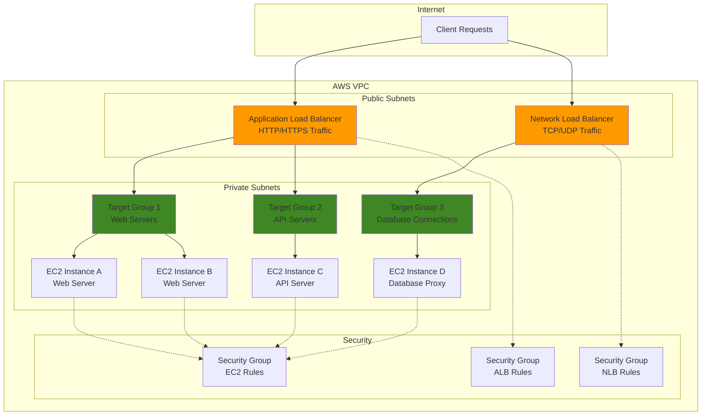

# Elastic Load Balancing with ALB and NLB

## Problem

Organizations running web applications often face challenges with traffic distribution, high availability, and performance optimization. Single points of failure lead to service outages, while uneven traffic distribution causes some servers to be overwhelmed while others remain underutilized. Without proper load balancing, applications cannot scale effectively or maintain consistent performance during traffic spikes.

## Solution

AWS Elastic Load Balancing provides intelligent traffic distribution across multiple targets using Application Load Balancers (ALB) for HTTP/HTTPS traffic and Network Load Balancers (NLB) for high-performance TCP/UDP traffic. This solution implements both load balancer types to demonstrate different use cases, ensuring high availability, fault tolerance, and optimal resource utilization across multiple EC2 instances.

## Architecture Diagram



## Prerequisites

1. AWS account with permissions for EC2, ELB, VPC, and IAM services
2. AWS CLI v2 installed and configured (or AWS CloudShell)
3. Basic understanding of networking concepts and load balancing principles
4. Existing VPC with public and private subnets across multiple availability zones
5. Estimated cost: $50-100/month for load balancers and EC2 instances during testing

## Preparation

```bash
# Set environment variables
export AWS_REGION=$(aws configure get region)
export AWS_ACCOUNT_ID=$(aws sts get-caller-identity \
    --query Account --output text)

# Generate unique identifiers for resources
RANDOM_SUFFIX=$(aws secretsmanager get-random-password \
    --exclude-punctuation --exclude-uppercase \
    --password-length 6 --require-each-included-type \
    --output text --query RandomPassword)

export PROJECT_NAME="elb-demo-${RANDOM_SUFFIX}"
export VPC_NAME="${PROJECT_NAME}-vpc"
export ALB_NAME="${PROJECT_NAME}-alb"
export NLB_NAME="${PROJECT_NAME}-nlb"

echo "Project: ${PROJECT_NAME}"
echo "Region: ${AWS_REGION}"

# Get default VPC for this demo (or create one if needed)
export VPC_ID=$(aws ec2 describe-vpcs \
    --filters "Name=is-default,Values=true" \
    --query "Vpcs[0].VpcId" --output text)

echo "Using VPC: ${VPC_ID}"

# Get subnet IDs for load balancer placement
export SUBNET_IDS=$(aws ec2 describe-subnets \
    --filters "Name=vpc-id,Values=${VPC_ID}" \
    --query "Subnets[*].SubnetId" --output text | tr '\t' ',')

echo "Available subnets: ${SUBNET_IDS}"
```

## Steps

1. **Create Security Groups for Load Balancers and EC2 Instances**:

   Security groups act as virtual firewalls controlling traffic flow at the instance and load balancer level. Properly configured security groups ensure that only legitimate traffic reaches your applications while blocking unauthorized access attempts. This multi-layered security approach follows AWS best practices for defense in depth. For detailed information about security group configuration, see the [Amazon EC2 Security Groups documentation](https://docs.aws.amazon.com/AWSEC2/latest/UserGuide/ec2-security-groups.html).

   ```bash
   # Create security group for Application Load Balancer
   ALB_SG_ID=$(aws ec2 create-security-group \
       --group-name "${PROJECT_NAME}-alb-sg" \
       --description "Security group for Application Load Balancer" \
       --vpc-id ${VPC_ID} \
       --query GroupId --output text)

   # Allow HTTP and HTTPS traffic to ALB
   aws ec2 authorize-security-group-ingress \
       --group-id ${ALB_SG_ID} \
       --protocol tcp --port 80 --cidr 0.0.0.0/0

   aws ec2 authorize-security-group-ingress \
       --group-id ${ALB_SG_ID} \
       --protocol tcp --port 443 --cidr 0.0.0.0/0

   echo "✅ ALB Security Group created: ${ALB_SG_ID}"
   ```

   The ALB security group now controls internet-facing traffic, allowing standard web protocols while maintaining security boundaries. This configuration enables global access to your web applications while preparing for backend instance protection.

2. **Create Network Load Balancer Security Group**:

   Network Load Balancers operate at Layer 4 and preserve client IP addresses, requiring different security considerations than Application Load Balancers. NLBs typically handle high-performance scenarios where connection-level load balancing is preferred over application-level routing. For comprehensive information about Network Load Balancer configuration, see the [Network Load Balancers documentation](https://docs.aws.amazon.com/elasticloadbalancing/latest/network/network-load-balancers.html).

   ```bash
   # Create security group for Network Load Balancer
   NLB_SG_ID=$(aws ec2 create-security-group \
       --group-name "${PROJECT_NAME}-nlb-sg" \
       --description "Security group for Network Load Balancer" \
       --vpc-id ${VPC_ID} \
       --query GroupId --output text)

   # Allow TCP traffic on port 80 for NLB
   aws ec2 authorize-security-group-ingress \
       --group-id ${NLB_SG_ID} \
       --protocol tcp --port 80 --cidr 0.0.0.0/0

   echo "✅ NLB Security Group created: ${NLB_SG_ID}"
   ```

   The NLB security group is configured for high-performance TCP connections, enabling ultra-low latency communication essential for applications requiring real-time responsiveness or handling millions of requests per second.

3. **Create EC2 Instance Security Group**:

   EC2 security groups implement the principle of least privilege by allowing only necessary traffic from trusted sources. By restricting access to load balancer security groups, we ensure that EC2 instances cannot be accessed directly from the internet, significantly reducing the attack surface.

   ```bash
   # Create security group for EC2 instances
   EC2_SG_ID=$(aws ec2 create-security-group \
       --group-name "${PROJECT_NAME}-ec2-sg" \
       --description "Security group for EC2 instances behind load balancers" \
       --vpc-id ${VPC_ID} \
       --query GroupId --output text)

   # Allow traffic from ALB security group
   aws ec2 authorize-security-group-ingress \
       --group-id ${EC2_SG_ID} \
       --protocol tcp --port 80 \
       --source-group ${ALB_SG_ID}

   # Allow traffic from NLB security group
   aws ec2 authorize-security-group-ingress \
       --group-id ${EC2_SG_ID} \
       --protocol tcp --port 80 \
       --source-group ${NLB_SG_ID}

   # Allow SSH access for management (optional)
   aws ec2 authorize-security-group-ingress \
       --group-id ${EC2_SG_ID} \
       --protocol tcp --port 22 --cidr 0.0.0.0/0

   echo "✅ EC2 Security Group created: ${EC2_SG_ID}"
   ```

   The EC2 security group now implements proper network segmentation, ensuring instances only accept traffic from authorized load balancers while maintaining administrative access for management purposes.

4. **Launch EC2 Instances for Testing**:

   EC2 instances serve as the compute foundation for our load balancing demonstration. Multiple instances across different availability zones provide the redundancy and scale that load balancers distribute traffic across. Each instance will run a simple web server to demonstrate load balancing behavior.

   ```bash
   # Get the latest Amazon Linux 2 AMI ID
   AMI_ID=$(aws ec2 describe-images \
       --owners amazon \
       --filters "Name=name,Values=amzn2-ami-hvm-*-x86_64-gp2" \
       --query "Images|sort_by(@, &CreationDate)[-1].ImageId" \
       --output text)

   # Create user data script for web server setup
   cat > user-data.sh << 'EOF'
#!/bin/bash
yum update -y
yum install -y httpd
systemctl start httpd
systemctl enable httpd
echo "<h1>Hello from $(hostname -f)</h1>" > /var/www/html/index.html
echo "<p>Instance ID: $(curl -s http://169.254.169.254/latest/meta-data/instance-id)</p>" >> /var/www/html/index.html
echo "<p>Availability Zone: $(curl -s http://169.254.169.254/latest/meta-data/placement/availability-zone)</p>" >> /var/www/html/index.html
EOF

   # Launch first EC2 instance
   INSTANCE_1=$(aws ec2 run-instances \
       --image-id ${AMI_ID} \
       --count 1 \
       --instance-type t3.micro \
       --security-group-ids ${EC2_SG_ID} \
       --user-data file://user-data.sh \
       --tag-specifications "ResourceType=instance,Tags=[{Key=Name,Value=${PROJECT_NAME}-web-1}]" \
       --query "Instances[0].InstanceId" --output text)

   # Launch second EC2 instance
   INSTANCE_2=$(aws ec2 run-instances \
       --image-id ${AMI_ID} \
       --count 1 \
       --instance-type t3.micro \
       --security-group-ids ${EC2_SG_ID} \
       --user-data file://user-data.sh \
       --tag-specifications "ResourceType=instance,Tags=[{Key=Name,Value=${PROJECT_NAME}-web-2}]" \
       --query "Instances[0].InstanceId" --output text)

   echo "✅ EC2 instances launching: ${INSTANCE_1}, ${INSTANCE_2}"

   # Wait for instances to be running
   aws ec2 wait instance-running --instance-ids ${INSTANCE_1} ${INSTANCE_2}
   echo "✅ EC2 instances are running and ready"
   ```

   The EC2 instances are now running with web servers configured to display unique identification information, enabling us to verify load balancing behavior and traffic distribution across multiple targets.

5. **Create Target Groups for Load Balancers**:

   Target groups define the destinations for load balancer traffic and include health check configurations that determine target availability. Proper target group configuration ensures traffic only reaches healthy instances while providing automatic failover capabilities when targets become unavailable. For detailed guidance on target group health checks, see the [Target Groups Health Checks documentation](https://docs.aws.amazon.com/elasticloadbalancing/latest/application/target-group-health-checks.html).

   ```bash
   # Create target group for Application Load Balancer
   ALB_TG_ARN=$(aws elbv2 create-target-group \
       --name "${PROJECT_NAME}-alb-tg" \
       --protocol HTTP \
       --port 80 \
       --vpc-id ${VPC_ID} \
       --health-check-path "/" \
       --health-check-interval-seconds 30 \
       --health-check-timeout-seconds 5 \
       --healthy-threshold-count 2 \
       --unhealthy-threshold-count 5 \
       --query "TargetGroups[0].TargetGroupArn" --output text)

   # Create target group for Network Load Balancer
   NLB_TG_ARN=$(aws elbv2 create-target-group \
       --name "${PROJECT_NAME}-nlb-tg" \
       --protocol TCP \
       --port 80 \
       --vpc-id ${VPC_ID} \
       --health-check-protocol HTTP \
       --health-check-path "/" \
       --health-check-interval-seconds 30 \
       --health-check-timeout-seconds 6 \
       --healthy-threshold-count 2 \
       --unhealthy-threshold-count 2 \
       --query "TargetGroups[0].TargetGroupArn" --output text)

   echo "✅ Target groups created:"
   echo "  ALB Target Group: ${ALB_TG_ARN}"
   echo "  NLB Target Group: ${NLB_TG_ARN}"
   ```

   Target groups are now configured with appropriate health checks that automatically monitor instance health and remove unhealthy targets from service, ensuring high availability and reliability for your applications.

6. **Register EC2 Instances with Target Groups**:

   Registering instances with target groups establishes the connection between load balancers and compute resources. This process enables automatic traffic distribution and health monitoring, with load balancers only sending traffic to instances that pass health checks.

   ```bash
   # Register instances with ALB target group
   aws elbv2 register-targets \
       --target-group-arn ${ALB_TG_ARN} \
       --targets Id=${INSTANCE_1} Id=${INSTANCE_2}

   # Register instances with NLB target group
   aws elbv2 register-targets \
       --target-group-arn ${NLB_TG_ARN} \
       --targets Id=${INSTANCE_1} Id=${INSTANCE_2}

   echo "✅ Instances registered with target groups"

   # Wait for targets to become healthy
   echo "Waiting for targets to pass health checks..."
   aws elbv2 wait target-in-service \
       --target-group-arn ${ALB_TG_ARN}

   aws elbv2 wait target-in-service \
       --target-group-arn ${NLB_TG_ARN}

   echo "✅ All targets are healthy and ready to receive traffic"
   ```

   The instances are now actively serving traffic through both target groups, with health checks confirming their availability and readiness to handle client requests.

7. **Create Application Load Balancer**:

   Application Load Balancers operate at Layer 7 (application layer) and provide advanced routing capabilities based on content, headers, and HTTP methods. ALBs are ideal for web applications requiring sophisticated traffic management, SSL termination, and application-level health checks. For comprehensive information about Application Load Balancer features, see the [Application Load Balancer documentation](https://docs.aws.amazon.com/elasticloadbalancing/latest/application/introduction.html).

   ```bash
   # Create Application Load Balancer
   ALB_ARN=$(aws elbv2 create-load-balancer \
       --name ${ALB_NAME} \
       --subnets $(echo ${SUBNET_IDS} | tr ',' ' ') \
       --security-groups ${ALB_SG_ID} \
       --scheme internet-facing \
       --type application \
       --ip-address-type ipv4 \
       --query "LoadBalancers[0].LoadBalancerArn" --output text)

   # Get ALB DNS name
   ALB_DNS=$(aws elbv2 describe-load-balancers \
       --load-balancer-arns ${ALB_ARN} \
       --query "LoadBalancers[0].DNSName" --output text)

   echo "✅ Application Load Balancer created:"
   echo "  ARN: ${ALB_ARN}"
   echo "  DNS: ${ALB_DNS}"
   ```

   The Application Load Balancer is now provisioned and accessible via its DNS name, ready to receive HTTP/HTTPS traffic and distribute it intelligently across registered targets based on application-layer information.

8. **Create Network Load Balancer**:

   Network Load Balancers operate at Layer 4 (transport layer) and provide ultra-high performance for TCP/UDP traffic. NLBs maintain client IP addresses and offer extreme low latency, making them ideal for gaming, IoT, or any application requiring high-performance network connections.

   ```bash
   # Create Network Load Balancer
   NLB_ARN=$(aws elbv2 create-load-balancer \
       --name ${NLB_NAME} \
       --subnets $(echo ${SUBNET_IDS} | tr ',' ' ') \
       --scheme internet-facing \
       --type network \
       --ip-address-type ipv4 \
       --query "LoadBalancers[0].LoadBalancerArn" --output text)

   # Get NLB DNS name
   NLB_DNS=$(aws elbv2 describe-load-balancers \
       --load-balancer-arns ${NLB_ARN} \
       --query "LoadBalancers[0].DNSName" --output text)

   echo "✅ Network Load Balancer created:"
   echo "  ARN: ${NLB_ARN}"
   echo "  DNS: ${NLB_DNS}"
   ```

   The Network Load Balancer is now operational and capable of handling millions of requests per second with ultra-low latency, preserving client IP addresses for applications that require this information.

9. **Configure Load Balancer Listeners**:

   Listeners define how load balancers process incoming requests and determine which target groups receive traffic. Configuring listeners establishes the routing rules that direct client requests to appropriate backend services based on protocol, port, and content.

   ```bash
   # Create listener for Application Load Balancer
   ALB_LISTENER_ARN=$(aws elbv2 create-listener \
       --load-balancer-arn ${ALB_ARN} \
       --protocol HTTP \
       --port 80 \
       --default-actions Type=forward,TargetGroupArn=${ALB_TG_ARN} \
       --query "Listeners[0].ListenerArn" --output text)

   # Create listener for Network Load Balancer
   NLB_LISTENER_ARN=$(aws elbv2 create-listener \
       --load-balancer-arn ${NLB_ARN} \
       --protocol TCP \
       --port 80 \
       --default-actions Type=forward,TargetGroupArn=${NLB_TG_ARN} \
       --query "Listeners[0].ListenerArn" --output text)

   echo "✅ Load balancer listeners configured:"
   echo "  ALB Listener: ${ALB_LISTENER_ARN}"
   echo "  NLB Listener: ${NLB_LISTENER_ARN}"
   ```

   Listeners are now actively processing incoming requests and forwarding them to healthy targets, enabling complete traffic distribution functionality for both load balancer types.

10. **Configure Target Group Attributes for Optimization**:

    Target group attributes control advanced load balancing behaviors including connection draining, sticky sessions, and load balancing algorithms. Proper configuration optimizes performance and ensures graceful handling of instance updates and maintenance.

    ```bash
    # Configure ALB target group attributes
    aws elbv2 modify-target-group-attributes \
        --target-group-arn ${ALB_TG_ARN} \
        --attributes \
        Key=deregistration_delay.timeout_seconds,Value=30 \
        Key=stickiness.enabled,Value=true \
        Key=stickiness.type,Value=lb_cookie \
        Key=stickiness.lb_cookie.duration_seconds,Value=86400

    # Configure NLB target group attributes
    aws elbv2 modify-target-group-attributes \
        --target-group-arn ${NLB_TG_ARN} \
        --attributes \
        Key=deregistration_delay.timeout_seconds,Value=30 \
        Key=preserve_client_ip.enabled,Value=true

    echo "✅ Target group attributes optimized for performance"
    ```

    Target groups are now optimized with session stickiness for ALB (maintaining user sessions) and client IP preservation for NLB, along with reduced deregistration delays for faster deployments.

> **Note**: Application Load Balancers provide Layer 7 routing capabilities including path-based and host-based routing, while Network Load Balancers offer Layer 4 performance with ultra-low latency. Choose ALB for web applications and NLB for high-performance TCP/UDP workloads.

> **Warning**: Load balancers incur hourly charges plus data processing fees. Monitor your AWS bill and clean up resources when testing is complete to avoid unexpected costs.

> **Tip**: Use ALB for SSL termination and advanced routing rules, while NLB is ideal for preserving source IP addresses and handling extreme performance requirements. Consider using both types for different application tiers.

## Validation & Testing

1. **Verify Load Balancer Status and Health**:

   ```bash
   # Check ALB status
   aws elbv2 describe-load-balancers \
       --load-balancer-arns ${ALB_ARN} \
       --query "LoadBalancers[0].State"

   # Check NLB status
   aws elbv2 describe-load-balancers \
       --load-balancer-arns ${NLB_ARN} \
       --query "LoadBalancers[0].State"
   ```

   Expected output: Both load balancers should show `"Code": "active"` status.

2. **Verify Target Health Status**:

   ```bash
   # Check ALB target health
   aws elbv2 describe-target-health \
       --target-group-arn ${ALB_TG_ARN}

   # Check NLB target health
   aws elbv2 describe-target-health \
       --target-group-arn ${NLB_TG_ARN}
   ```

   Expected output: All targets should show `"TargetHealth": {"State": "healthy"}`.

3. **Test Application Load Balancer Traffic Distribution**:

   ```bash
   # Test ALB multiple times to see load distribution
   echo "Testing ALB traffic distribution:"
   for i in {1..5}; do
       echo "Request $i:"
       curl -s http://${ALB_DNS} | grep "Instance ID"
       sleep 1
   done
   ```

   Expected output: Requests should be distributed across different instance IDs.

4. **Test Network Load Balancer Performance**:

   ```bash
   # Test NLB response
   echo "Testing NLB connectivity:"
   curl -s http://${NLB_DNS} | head -n 3
   ```

   Expected output: Should display the web page content from one of the instances.

5. **Verify Security Group Rules**:

   ```bash
   # Verify ALB security group allows HTTP traffic
   aws ec2 describe-security-groups \
       --group-ids ${ALB_SG_ID} \
       --query "SecurityGroups[0].IpPermissions"

   # Verify EC2 instances only accept traffic from load balancers
   aws ec2 describe-security-groups \
       --group-ids ${EC2_SG_ID} \
       --query "SecurityGroups[0].IpPermissions"
   ```

## Cleanup

1. **Delete Load Balancer Listeners**:

   ```bash
   # Delete ALB listener
   aws elbv2 delete-listener --listener-arn ${ALB_LISTENER_ARN}

   # Delete NLB listener
   aws elbv2 delete-listener --listener-arn ${NLB_LISTENER_ARN}

   echo "✅ Load balancer listeners deleted"
   ```

2. **Delete Load Balancers**:

   ```bash
   # Delete Application Load Balancer
   aws elbv2 delete-load-balancer --load-balancer-arn ${ALB_ARN}

   # Delete Network Load Balancer
   aws elbv2 delete-load-balancer --load-balancer-arn ${NLB_ARN}

   echo "✅ Load balancers deleted"

   # Wait for load balancers to be fully deleted
   sleep 60
   ```

3. **Delete Target Groups**:

   ```bash
   # Delete ALB target group
   aws elbv2 delete-target-group --target-group-arn ${ALB_TG_ARN}

   # Delete NLB target group
   aws elbv2 delete-target-group --target-group-arn ${NLB_TG_ARN}

   echo "✅ Target groups deleted"
   ```

4. **Terminate EC2 Instances**:

   ```bash
   # Terminate EC2 instances
   aws ec2 terminate-instances --instance-ids ${INSTANCE_1} ${INSTANCE_2}

   # Wait for instances to terminate
   aws ec2 wait instance-terminated --instance-ids ${INSTANCE_1} ${INSTANCE_2}

   echo "✅ EC2 instances terminated"
   ```

5. **Delete Security Groups**:

   ```bash
   # Delete security groups (in reverse order of dependencies)
   aws ec2 delete-security-group --group-id ${EC2_SG_ID}
   aws ec2 delete-security-group --group-id ${ALB_SG_ID}
   aws ec2 delete-security-group --group-id ${NLB_SG_ID}

   echo "✅ Security groups deleted"
   ```

6. **Clean Up Local Files**:

   ```bash
   # Remove temporary files
   rm -f user-data.sh

   echo "✅ Local files cleaned up"
   echo "✅ All resources have been successfully removed"
   ```

## Discussion

AWS Elastic Load Balancing provides critical infrastructure for building highly available, scalable applications. Application Load Balancers excel at Layer 7 routing, offering sophisticated request routing based on HTTP headers, paths, and query parameters. This makes them ideal for microservices architectures where different services need to handle specific URL patterns or API versions. ALBs also provide native SSL/TLS termination, reducing computational overhead on backend instances while simplifying certificate management.

Network Load Balancers operate at Layer 4, focusing on ultra-high performance and preserving client IP addresses. This makes them essential for applications requiring extreme low latency, such as gaming servers, real-time financial trading systems, or IoT data collection platforms. NLBs can handle millions of requests per second while maintaining microsecond-level latency, capabilities that Application Load Balancers cannot match due to their additional processing overhead.

Target groups serve as the bridge between load balancers and compute resources, providing crucial health checking capabilities that ensure traffic only reaches healthy instances. The health check configuration significantly impacts application availability - aggressive health checks provide faster failure detection but may cause unnecessary instance cycling, while conservative settings provide stability but slower recovery. Understanding these trade-offs is essential for optimizing application resilience.

Security group architecture demonstrates AWS's defense-in-depth approach, where load balancers accept internet traffic while EC2 instances only accept traffic from authorized load balancers. This network segmentation significantly reduces attack surfaces and follows security best practices. Combined with AWS Shield and Web Application Firewall integration, this architecture provides comprehensive protection against both network and application-layer attacks.

> **Tip**: Use CloudWatch metrics to monitor load balancer performance, target response times, and error rates. Set up CloudWatch alarms for automated scaling decisions and proactive issue detection. For detailed information about load balancer metrics, see the [Application Load Balancer CloudWatch Metrics](https://docs.aws.amazon.com/elasticloadbalancing/latest/application/load-balancer-cloudwatch-metrics.html) and [Network Load Balancer CloudWatch Metrics](https://docs.aws.amazon.com/elasticloadbalancing/latest/network/load-balancer-cloudwatch-metrics.html) documentation.

## Challenge

Extend this solution by implementing these enhancements:

1. **SSL/TLS Termination**: Configure HTTPS listeners with AWS Certificate Manager certificates for secure communications and implement HTTP to HTTPS redirects
2. **Advanced Routing Rules**: Create path-based routing rules that direct `/api/*` requests to API servers and `/web/*` requests to web servers using different target groups
3. **Auto Scaling Integration**: Implement Auto Scaling Groups that automatically add or remove EC2 instances based on CloudWatch metrics from the load balancers
4. **Multi-Region Setup**: Deploy identical load balancer configurations across multiple AWS regions with Route 53 health checks for global load balancing and disaster recovery
5. **WAF Integration**: Add AWS Web Application Firewall rules to protect against common web exploits and implement rate limiting for DDoS protection

## Infrastructure Code

*Infrastructure code will be generated after recipe approval.*