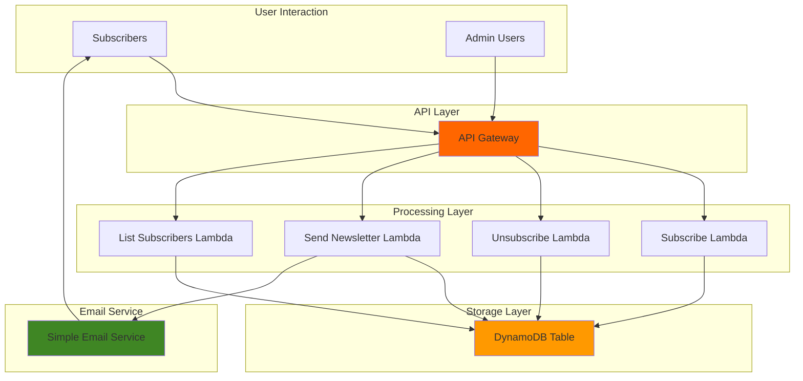

# Email List Management with SES and DynamoDB

## Problem

Modern businesses need efficient ways to manage email subscribers and send newsletters, but maintaining email infrastructure is complex and costly. Small to medium organizations struggle with building reliable email systems that can handle subscriber management, bounce handling, and campaign delivery while remaining cost-effective and scalable. Without proper email list management, businesses lose potential customers and fail to maintain engagement with their audience.

## Solution

Build a serverless email list management system using Amazon SES for reliable email delivery, DynamoDB for scalable subscriber storage, and Lambda functions for automated subscription management. This solution provides a complete email marketing foundation with CRUD operations for subscribers, automated newsletter sending, and built-in AWS security and monitoring capabilities.

## Architecture Diagram



## Prerequisites

1. AWS account with appropriate permissions for SES, DynamoDB, Lambda, and IAM
2. AWS CLI installed and configured (or AWS CloudShell)
3. Basic understanding of serverless architecture and email marketing concepts
4. A verified email address in Amazon SES for sending emails
5. Estimated cost: $0.10-$2.00 per month for low-volume usage (AWS Free Tier eligible)

> **Note**: Amazon SES requires email address verification before sending emails. Plan to verify your sender email during the setup process.

## Preparation

```bash
# Set environment variables
export AWS_REGION=$(aws configure get region)
export AWS_ACCOUNT_ID=$(aws sts get-caller-identity \
    --query Account --output text)

# Generate unique identifiers for resources
RANDOM_SUFFIX=$(aws secretsmanager get-random-password \
    --exclude-punctuation --exclude-uppercase \
    --password-length 6 --require-each-included-type \
    --output text --query RandomPassword)

# Set resource names
export TABLE_NAME="email-subscribers-${RANDOM_SUFFIX}"
export LAMBDA_ROLE_NAME="EmailListLambdaRole-${RANDOM_SUFFIX}"
export SENDER_EMAIL="your-verified-email@example.com"

# Verify SES is available in your region
aws ses describe-account-configuration >/dev/null 2>&1 || echo "⚠️ SES may not be available in ${AWS_REGION}"

echo "✅ AWS environment configured"
echo "📧 Remember to replace SENDER_EMAIL with your verified SES email"
```

## Steps

1. **Create DynamoDB Table for Subscriber Management**:

   DynamoDB provides the scalable NoSQL database foundation for our email list management system. The table design uses email as the partition key for fast lookups and includes subscriber metadata like subscription date and status. Using on-demand billing mode eliminates capacity planning while automatically scaling to handle growing subscriber lists with consistent single-digit millisecond performance.

   ```bash
   # Create DynamoDB table for subscribers with on-demand billing
   aws dynamodb create-table \
       --table-name ${TABLE_NAME} \
       --attribute-definitions \
           AttributeName=email,AttributeType=S \
       --key-schema \
           AttributeName=email,KeyType=HASH \
       --billing-mode PAY_PER_REQUEST \
       --tags Key=Purpose,Value=EmailListManagement
   
   # Wait for table to become active
   aws dynamodb wait table-exists --table-name ${TABLE_NAME}
   
   echo "✅ DynamoDB table ${TABLE_NAME} created successfully"
   ```

   The table is now ready to store subscriber information with email addresses as unique identifiers. On-demand billing provides cost-effective scaling that charges only for actual read and write requests, making it ideal for variable email marketing workloads.

2. **Verify Email Address in Amazon SES**:

   Amazon SES requires sender email verification to prevent spam and ensure deliverability. This step establishes your sending identity and enables the email service to authenticate your messages. SES provides enterprise-grade email infrastructure with built-in bounce and complaint handling, making it ideal for newsletter and marketing communications.

   ```bash
   # Verify sender email address in SES
   aws ses verify-email-identity --email-address ${SENDER_EMAIL}
   
   echo "✅ Email verification request sent to ${SENDER_EMAIL}"
   echo "📧 Check your inbox and click the verification link"
   
   # Check verification status (optional)
   aws ses get-identity-verification-attributes \
       --identities ${SENDER_EMAIL}
   ```

   You must click the verification link in your email before proceeding. This one-time verification enables SES to send emails from your address while maintaining high deliverability rates and compliance with email service provider requirements.

> **Warning**: New SES accounts start in sandbox mode, which only allows sending to verified addresses. For production use, request removal from sandbox mode through the AWS console to enable sending to any email address.

3. **Create IAM Role for Lambda Functions**:

   The IAM role provides Lambda functions with the necessary permissions to interact with DynamoDB and SES while following the principle of least privilege. This security approach ensures functions can only access required AWS services, reducing potential security risks while enabling full functionality for subscriber management and email sending operations.

   ```bash
   # Create trust policy for Lambda service
   cat > lambda-trust-policy.json << EOF
   {
       "Version": "2012-10-17",
       "Statement": [
           {
               "Effect": "Allow",
               "Principal": {
                   "Service": "lambda.amazonaws.com"
               },
               "Action": "sts:AssumeRole"
           }
       ]
   }
   EOF
   
   # Create IAM role for Lambda functions
   aws iam create-role \
       --role-name ${LAMBDA_ROLE_NAME} \
       --assume-role-policy-document file://lambda-trust-policy.json
   
   # Create permission policy for DynamoDB and SES access
   cat > lambda-permissions-policy.json << EOF
   {
       "Version": "2012-10-17",
       "Statement": [
           {
               "Effect": "Allow",
               "Action": [
                   "dynamodb:PutItem",
                   "dynamodb:GetItem",
                   "dynamodb:UpdateItem",
                   "dynamodb:DeleteItem",
                   "dynamodb:Scan"
               ],
               "Resource": "arn:aws:dynamodb:${AWS_REGION}:${AWS_ACCOUNT_ID}:table/${TABLE_NAME}"
           },
           {
               "Effect": "Allow",
               "Action": [
                   "ses:SendEmail",
                   "ses:SendRawEmail"
               ],
               "Resource": "*"
           },
           {
               "Effect": "Allow",
               "Action": [
                   "logs:CreateLogGroup",
                   "logs:CreateLogStream",
                   "logs:PutLogEvents"
               ],
               "Resource": "arn:aws:logs:*:*:*"
           }
       ]
   }
   EOF
   
   # Attach custom policy to role
   aws iam put-role-policy \
       --role-name ${LAMBDA_ROLE_NAME} \
       --policy-name EmailListManagementPolicy \
       --policy-document file://lambda-permissions-policy.json
   
   echo "✅ IAM role ${LAMBDA_ROLE_NAME} created with DynamoDB and SES permissions"
   ```

   The role now provides secure access to required AWS services while maintaining security best practices through specific resource restrictions and minimal permissions.

4. **Create Subscribe Lambda Function**:

   The subscribe function handles new subscriber registrations by validating email addresses and storing subscriber information in DynamoDB. This serverless approach automatically scales to handle subscription spikes while providing cost-effective processing that only charges for actual usage. The function includes duplicate prevention and basic email validation for data integrity.

   ```bash
   # Create Python code for subscribe function
   cat > subscribe_function.py << 'EOF'
   import json
   import boto3
   import datetime
   import os
   from botocore.exceptions import ClientError
   
   dynamodb = boto3.resource('dynamodb')
   table = dynamodb.Table(os.environ['TABLE_NAME'])
   
   def lambda_handler(event, context):
       try:
           body = json.loads(event['body']) if 'body' in event else event
           email = body.get('email', '').lower().strip()
           name = body.get('name', 'Subscriber')
           
           if not email or '@' not in email:
               return {
                   'statusCode': 400,
                   'body': json.dumps({'error': 'Valid email required'})
               }
           
           # Add subscriber to DynamoDB
           response = table.put_item(
               Item={
                   'email': email,
                   'name': name,
                   'subscribed_date': datetime.datetime.now().isoformat(),
                   'status': 'active'
               },
               ConditionExpression='attribute_not_exists(email)'
           )
           
           return {
               'statusCode': 200,
               'body': json.dumps({
                   'message': f'Successfully subscribed {email}',
                   'email': email
               })
           }
           
       except ClientError as e:
           if e.response['Error']['Code'] == 'ConditionalCheckFailedException':
               return {
                   'statusCode': 409,
                   'body': json.dumps({'error': 'Email already subscribed'})
               }
           raise e
       except Exception as e:
           print(f"Error: {str(e)}")
           return {
               'statusCode': 500,
               'body': json.dumps({'error': 'Internal server error'})
           }
   EOF
   
   # Note: Function now uses environment variables
   
   # Create deployment package
   zip subscribe_function.zip subscribe_function.py
   
   # Create Lambda function
   aws lambda create-function \
       --function-name "email-subscribe-${RANDOM_SUFFIX}" \
       --runtime python3.12 \
       --role "arn:aws:iam::${AWS_ACCOUNT_ID}:role/${LAMBDA_ROLE_NAME}" \
       --handler subscribe_function.lambda_handler \
       --zip-file fileb://subscribe_function.zip \
       --timeout 30 \
       --memory-size 256 \
       --environment Variables="{TABLE_NAME=${TABLE_NAME}}"
   
   export SUBSCRIBE_FUNCTION_NAME="email-subscribe-${RANDOM_SUFFIX}"
   
   echo "✅ Subscribe Lambda function created successfully"
   ```

   The subscribe function is now ready to handle new subscriber registrations with proper error handling, validation, and duplicate prevention mechanisms built-in.

5. **Create Send Newsletter Lambda Function**:

   The newsletter function retrieves all active subscribers from DynamoDB and sends personalized emails using Amazon SES. This design separates email sending from subscriber management, enabling efficient bulk operations while maintaining personalization capabilities. The function includes error handling for failed deliveries and respects SES sending limits.

   ```bash
   # Create Python code for newsletter function
   cat > newsletter_function.py << 'EOF'
   import json
   import boto3
   import os
   from botocore.exceptions import ClientError
   
   dynamodb = boto3.resource('dynamodb')
   ses = boto3.client('ses')
   table = dynamodb.Table(os.environ['TABLE_NAME'])
   
   def lambda_handler(event, context):
       try:
           body = json.loads(event['body']) if 'body' in event else event
           subject = body.get('subject', 'Newsletter Update')
           message = body.get('message', 'Thank you for subscribing!')
           sender_email = os.environ['SENDER_EMAIL']
           
           # Get all active subscribers with pagination support
           subscribers = []
           response = table.scan(
               FilterExpression='#status = :status',
               ExpressionAttributeNames={'#status': 'status'},
               ExpressionAttributeValues={':status': 'active'}
           )
           subscribers.extend(response['Items'])
           
           # Handle pagination for large subscriber lists
           while 'LastEvaluatedKey' in response:
               response = table.scan(
                   FilterExpression='#status = :status',
                   ExpressionAttributeNames={'#status': 'status'},
                   ExpressionAttributeValues={':status': 'active'},
                   ExclusiveStartKey=response['LastEvaluatedKey']
               )
               subscribers.extend(response['Items'])
           sent_count = 0
           failed_count = 0
           
           for subscriber in subscribers:
               try:
                   # Send personalized email
                   ses.send_email(
                       Source=sender_email,
                       Destination={'ToAddresses': [subscriber['email']]},
                       Message={
                           'Subject': {'Data': subject},
                           'Body': {
                               'Text': {
                                   'Data': f"Hello {subscriber['name']},\n\n{message}\n\nBest regards,\nYour Newsletter Team"
                               },
                               'Html': {
                                   'Data': f"""
                                   <html>
                                   <body>
                                   <h2>Hello {subscriber['name']},</h2>
                                   <p>{message}</p>
                                   <p>Best regards,<br>Your Newsletter Team</p>
                                   </body>
                                   </html>
                                   """
                               }
                           }
                       }
                   )
                   sent_count += 1
               except ClientError as e:
                   print(f"Failed to send to {subscriber['email']}: {e}")
                   failed_count += 1
           
           return {
               'statusCode': 200,
               'body': json.dumps({
                   'message': f'Newsletter sent to {sent_count} subscribers',
                   'sent_count': sent_count,
                   'failed_count': failed_count,
                   'total_subscribers': len(subscribers)
               })
           }
           
       except Exception as e:
           print(f"Error: {str(e)}")
           return {
               'statusCode': 500,
               'body': json.dumps({'error': 'Failed to send newsletter'})
           }
   EOF
   
   # Note: Function now uses environment variables
   
   # Create deployment package
   zip newsletter_function.zip newsletter_function.py
   
   # Create Lambda function
   aws lambda create-function \
       --function-name "email-newsletter-${RANDOM_SUFFIX}" \
       --runtime python3.12 \
       --role "arn:aws:iam::${AWS_ACCOUNT_ID}:role/${LAMBDA_ROLE_NAME}" \
       --handler newsletter_function.lambda_handler \
       --zip-file fileb://newsletter_function.zip \
       --timeout 300 \
       --memory-size 512 \
       --environment Variables="{TABLE_NAME=${TABLE_NAME},SENDER_EMAIL=${SENDER_EMAIL}}"
   
   export NEWSLETTER_FUNCTION_NAME="email-newsletter-${RANDOM_SUFFIX}"
   
   echo "✅ Newsletter Lambda function created successfully"
   ```

   The newsletter function now provides bulk email sending capabilities with personalization, error handling, delivery tracking, and pagination support for large subscriber lists.

6. **Create List Subscribers Lambda Function**:

   The list function provides administrative capabilities to view all subscribers, their status, and subscription dates. This read-only function enables subscriber analytics and list management without exposing sensitive modification capabilities. The function supports pagination for large subscriber lists and includes filtering options for different subscriber states.

   ```bash
   # Create Python code for list subscribers function
   cat > list_function.py << 'EOF'
   import json
   import boto3
   import os
   from decimal import Decimal
   
   dynamodb = boto3.resource('dynamodb')
   table = dynamodb.Table(os.environ['TABLE_NAME'])
   
   def decimal_default(obj):
       if isinstance(obj, Decimal):
           return float(obj)
       raise TypeError
   
   def lambda_handler(event, context):
       try:
           # Scan table for all subscribers with pagination support
           subscribers = []
           response = table.scan()
           subscribers.extend(response['Items'])
           
           # Handle pagination for large subscriber lists
           while 'LastEvaluatedKey' in response:
               response = table.scan(
                   ExclusiveStartKey=response['LastEvaluatedKey']
               )
               subscribers.extend(response['Items'])
           
           # Convert Decimal types for JSON serialization
           for subscriber in subscribers:
               for key, value in subscriber.items():
                   if isinstance(value, Decimal):
                       subscriber[key] = float(value)
           
           return {
               'statusCode': 200,
               'body': json.dumps({
                   'subscribers': subscribers,
                   'total_count': len(subscribers)
               }, default=decimal_default)
           }
           
       except Exception as e:
           print(f"Error: {str(e)}")
           return {
               'statusCode': 500,
               'body': json.dumps({'error': 'Failed to retrieve subscribers'})
           }
   EOF
   
   # Note: Function now uses environment variables
   
   # Create deployment package
   zip list_function.zip list_function.py
   
   # Create Lambda function
   aws lambda create-function \
       --function-name "email-list-${RANDOM_SUFFIX}" \
       --runtime python3.12 \
       --role "arn:aws:iam::${AWS_ACCOUNT_ID}:role/${LAMBDA_ROLE_NAME}" \
       --handler list_function.lambda_handler \
       --zip-file fileb://list_function.zip \
       --timeout 30 \
       --memory-size 256 \
       --environment Variables="{TABLE_NAME=${TABLE_NAME}}"
   
   export LIST_FUNCTION_NAME="email-list-${RANDOM_SUFFIX}"
   
   echo "✅ List subscribers Lambda function created successfully"
   ```

   The list function provides essential administrative functionality for subscriber management and analytics while maintaining security through proper IAM role restrictions and handling large subscriber lists through pagination.

## Validation & Testing

1. **Test Subscriber Registration**:

   ```bash
   # Test subscribe function with sample data
   aws lambda invoke \
       --function-name ${SUBSCRIBE_FUNCTION_NAME} \
       --payload '{"email":"test@example.com","name":"Test User"}' \
       subscribe_response.json
   
   cat subscribe_response.json
   ```

   Expected output: `{"statusCode": 200, "body": "{\"message\": \"Successfully subscribed test@example.com\", \"email\": \"test@example.com\"}"}`

2. **Verify Subscriber in DynamoDB**:

   ```bash
   # Check if subscriber was added to DynamoDB
   aws dynamodb get-item \
       --table-name ${TABLE_NAME} \
       --key '{"email":{"S":"test@example.com"}}' \
       --output table
   ```

   Expected output: Subscriber details including email, name, subscription date, and active status.

3. **Test Newsletter Sending**:

   ```bash
   # Send test newsletter
   aws lambda invoke \
       --function-name ${NEWSLETTER_FUNCTION_NAME} \
       --payload '{"subject":"Welcome Newsletter","message":"Thank you for joining our community!"}' \
       newsletter_response.json
   
   cat newsletter_response.json
   ```

   Expected output: Confirmation of emails sent with subscriber count and delivery statistics.

4. **Test Subscriber List Retrieval**:

   ```bash
   # List all subscribers
   aws lambda invoke \
       --function-name ${LIST_FUNCTION_NAME} \
       --payload '{}' \
       list_response.json
   
   cat list_response.json
   ```

   Expected output: Array of all subscribers with their details and total count.

## Cleanup

1. **Delete Lambda Functions**:

   ```bash
   # Delete all Lambda functions
   aws lambda delete-function --function-name ${SUBSCRIBE_FUNCTION_NAME}
   aws lambda delete-function --function-name ${NEWSLETTER_FUNCTION_NAME}
   aws lambda delete-function --function-name ${LIST_FUNCTION_NAME}
   
   echo "✅ Lambda functions deleted"
   ```

2. **Delete IAM Role and Policies**:

   ```bash
   # Delete IAM role policy
   aws iam delete-role-policy \
       --role-name ${LAMBDA_ROLE_NAME} \
       --policy-name EmailListManagementPolicy
   
   # Delete IAM role
   aws iam delete-role --role-name ${LAMBDA_ROLE_NAME}
   
   echo "✅ IAM role and policies deleted"
   ```

3. **Delete DynamoDB Table**:

   ```bash
   # Delete DynamoDB table
   aws dynamodb delete-table --table-name ${TABLE_NAME}
   
   # Wait for table deletion
   aws dynamodb wait table-not-exists --table-name ${TABLE_NAME}
   
   echo "✅ DynamoDB table deleted"
   ```

4. **Clean Up Local Files**:

   ```bash
   # Remove local files
   rm -f subscribe_function.py subscribe_function.zip
   rm -f newsletter_function.py newsletter_function.zip
   rm -f list_function.py list_function.zip
   rm -f lambda-trust-policy.json lambda-permissions-policy.json
   rm -f *_response.json
   
   echo "✅ Local files cleaned up"
   ```

## Discussion

This serverless email list management system demonstrates the power of combining AWS managed services to create scalable, cost-effective solutions. Amazon SES provides enterprise-grade email delivery infrastructure with built-in bounce handling, complaint management, and deliverability optimization. The service maintains high delivery rates through authentication protocols like SPF, DKIM, and DMARC while handling the complexities of email service provider relationships. For detailed SES best practices, see the [Amazon SES Developer Guide](https://docs.aws.amazon.com/ses/latest/dg/).

DynamoDB serves as the foundation for subscriber data storage, offering consistent single-digit millisecond latency at any scale. The NoSQL design with email as the partition key enables efficient subscriber lookups and updates while supporting complex queries through secondary indexes when needed. Using on-demand billing mode eliminates capacity planning overhead while providing automatic scaling based on actual usage patterns. For more information on DynamoDB capacity modes, see the [DynamoDB Developer Guide](https://docs.aws.amazon.com/amazondynamodb/latest/developerguide/on-demand-capacity-mode.html).

Lambda functions orchestrate the business logic with automatic scaling and pay-per-execution pricing. Using Python 3.12 runtime provides the latest language features and improved performance characteristics while maintaining compatibility with Boto3. This serverless approach handles traffic spikes efficiently, scaling from zero to thousands of concurrent executions without capacity planning. The event-driven architecture enables easy integration with other AWS services and supports real-time processing of subscriber interactions.

The architecture follows AWS Well-Architected Framework principles through security (IAM roles with least privilege), reliability (managed services with built-in redundancy), performance (optimized for low latency), cost optimization (serverless pay-per-use), and operational excellence (comprehensive logging and monitoring). This foundation supports enterprise-scale email marketing while maintaining simplicity for smaller organizations.

> **Tip**: Consider implementing API Gateway with authentication for production deployments to provide secure web-based access to your email list management functions. This adds a REST API layer that can integrate with web applications and mobile apps.

## Challenge

Extend this solution by implementing these enhancements:

1. **Add Unsubscribe Functionality**: Create a Lambda function and email template with unsubscribe links that update subscriber status to 'inactive' in DynamoDB while maintaining compliance with email marketing regulations.

2. **Implement Email Templates**: Use SES templates for consistent branding and create a template management system with Lambda functions to handle multiple newsletter formats and personalization variables.

3. **Add Bounce and Complaint Handling**: Configure SES to publish bounce and complaint notifications to SNS, then create Lambda functions to automatically update subscriber status and maintain list hygiene.

4. **Create Analytics Dashboard**: Build a QuickSight dashboard connected to DynamoDB to visualize subscriber growth, email campaign performance, and engagement metrics with automated reporting.

5. **Add Subscription Confirmation**: Implement double opt-in functionality with email verification links using SES and Lambda to ensure subscriber consent and improve deliverability rates.

## Infrastructure Code

### Available Infrastructure as Code:

- [Infrastructure Code Overview](code/README.md) - Detailed description of all infrastructure components
- [AWS CDK (Python)](code/cdk-python/) - AWS CDK Python implementation
- [AWS CDK (TypeScript)](code/cdk-typescript/) - AWS CDK TypeScript implementation
- [CloudFormation](code/cloudformation.yaml) - AWS CloudFormation template
- [Bash CLI Scripts](code/scripts/) - Example bash scripts using AWS CLI commands to deploy infrastructure
- [Terraform](code/terraform/) - Terraform configuration files