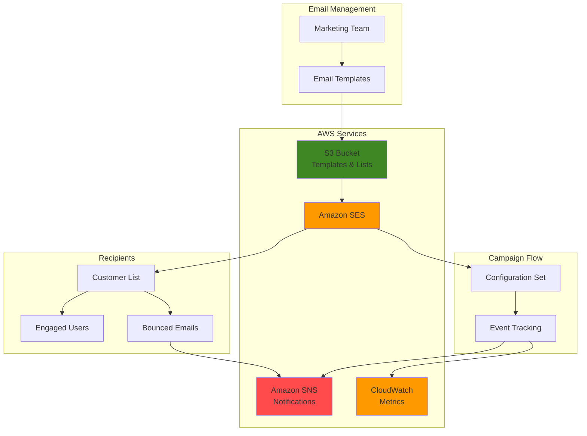

# Email Marketing Campaigns with SES

## Problem

E-commerce businesses and digital marketing teams struggle with fragmented email marketing workflows that require multiple third-party services, leading to high costs, limited customization, and complex integrations. Marketing teams need to manage subscriber lists, create personalized campaigns, track engagement metrics, and handle bounce management across different platforms, creating operational overhead and reducing campaign effectiveness.

## Solution

Build a comprehensive email marketing platform using Amazon SES as the core email service, integrated with S3 for template storage, SNS for event notifications, and CloudWatch for analytics. This solution provides personalized email campaigns, automated bounce handling, detailed engagement tracking, and cost-effective scaling while maintaining full control over the email infrastructure.

## Architecture Diagram



## Prerequisites

1. AWS account with SES, S3, SNS, and CloudWatch permissions
2. AWS CLI v2 installed and configured (or AWS CloudShell)
3. Basic knowledge of email marketing concepts and HTML/JSON
4. Domain ownership for sender identity verification
5. Estimated cost: $0.10 per 1,000 emails sent + $0.02 per 1,000 emails received events

> **Note**: Amazon SES starts in sandbox mode with limited sending capabilities. Production access requires a sending limit increase request.

## Preparation

```bash
# Set environment variables
export AWS_REGION=$(aws configure get region)
export AWS_ACCOUNT_ID=$(aws sts get-caller-identity \
    --query Account --output text)

# Generate unique identifiers for resources
RANDOM_SUFFIX=$(aws secretsmanager get-random-password \
    --exclude-punctuation --exclude-uppercase \
    --password-length 6 --require-each-included-type \
    --output text --query RandomPassword)

# Set resource names
export BUCKET_NAME="email-marketing-${RANDOM_SUFFIX}"
export CONFIG_SET_NAME="marketing-campaigns-${RANDOM_SUFFIX}"
export SNS_TOPIC_NAME="email-events-${RANDOM_SUFFIX}"
export SENDER_EMAIL="marketing@yourdomain.com"
export SENDER_DOMAIN="yourdomain.com"

# Create S3 bucket for templates and subscriber lists
aws s3 mb s3://${BUCKET_NAME} --region ${AWS_REGION}

echo "✅ Environment prepared with bucket: ${BUCKET_NAME}"
```

## Steps

1. **Verify sender identity and domain**:

   Amazon SES requires sender identity verification to prevent spam and maintain email deliverability standards that protect both senders and recipients. Domain verification establishes your organization's authority to send emails from that domain, while DKIM (DomainKeys Identified Mail) provides cryptographic authentication that receiving email servers use to verify message authenticity and prevent spoofing attacks that could damage your brand reputation.

   ```bash
   # Verify domain identity for sending emails
   aws sesv2 create-email-identity \
       --email-identity ${SENDER_DOMAIN}
   
   # Verify specific email address
   aws sesv2 create-email-identity \
       --email-identity ${SENDER_EMAIL}
   
   # Get domain verification details
   aws sesv2 get-email-identity \
       --email-identity ${SENDER_DOMAIN} \
       --query 'DkimAttributes.Tokens' \
       --output table
   
   echo "✅ Domain and email identity verification initiated"
   echo "Configure DNS records as shown above to complete verification"
   ```

   This step initiates the verification process by creating email identities in SES and generating DKIM tokens for enhanced email authentication. You'll need to add these DKIM records to your domain's DNS configuration to complete verification, which typically takes 24-72 hours to propagate globally. Once verified, your domain gains enhanced deliverability and reduced likelihood of emails being marked as spam by major email providers like Gmail, Outlook, and Yahoo. For detailed verification instructions, see the [Amazon SES identity verification documentation](https://docs.aws.amazon.com/ses/latest/dg/setting-up.html).

2. **Create SNS topic for email event notifications**:

   Amazon SNS (Simple Notification Service) acts as the central nervous system for email event handling, enabling real-time responses to bounces, complaints, and delivery confirmations. This proactive monitoring prevents reputation damage by automatically removing problematic email addresses and provides valuable analytics for campaign optimization. SNS provides guaranteed message delivery and supports multiple endpoint types for flexible notification handling.

   ```bash
   # Create SNS topic for bounce and complaint handling
   SNS_TOPIC_ARN=$(aws sns create-topic \
       --name ${SNS_TOPIC_NAME} \
       --query 'TopicArn' --output text)
   
   # Subscribe email endpoint to receive notifications
   aws sns subscribe \
       --topic-arn ${SNS_TOPIC_ARN} \
       --protocol email \
       --notification-endpoint ${SENDER_EMAIL}
   
   echo "✅ SNS topic created: ${SNS_TOPIC_ARN}"
   echo "Check your email to confirm subscription"
   ```

   The SNS topic is now established and ready to receive email events from SES configuration sets. This foundation enables automated bounce management, complaint handling, and real-time notifications that are crucial for maintaining high deliverability rates and compliance with email marketing regulations like CAN-SPAM and GDPR. For more information about SNS topics and subscriptions, see the [Amazon SNS documentation](https://docs.aws.amazon.com/sns/latest/dg/welcome.html).

3. **Create configuration set for campaign tracking**:

   Configuration sets in Amazon SES provide advanced email tracking and analytics capabilities that go beyond basic sending, acting as the control center for email campaign management. They enable granular monitoring of email events, reputation management, and automated suppression handling that protects your sender reputation across all campaigns. The TLS policy ensures encrypted transmission for security compliance, while reputation tracking helps maintain high deliverability by monitoring your sending patterns and recipient engagement metrics.

   ```bash
   # Create configuration set for email tracking
   aws sesv2 create-configuration-set \
       --configuration-set-name ${CONFIG_SET_NAME} \
       --delivery-options TlsPolicy=Require \
       --reputation-options ReputationMetricsEnabled=true \
       --sending-options SendingEnabled=true \
       --suppression-options SuppressedReasons=BOUNCE,COMPLAINT
   
   # Enable event publishing to SNS
   aws sesv2 create-configuration-set-event-destination \
       --configuration-set-name ${CONFIG_SET_NAME} \
       --event-destination-name "email-events" \
       --event-destination Enabled=true,MatchingEventTypes=bounce,complaint,delivery,send,reject,open,click,renderingFailure,deliveryDelay,subscription,CloudWatchDestination='{DefaultDimensionValue=default,DimensionConfigurations=[{DimensionName=MessageTag,DimensionValueSource=messageTag,DefaultDimensionValue=campaign}]}',SnsDestination='{TopicArn='${SNS_TOPIC_ARN}'}'
   
   echo "✅ Configuration set created: ${CONFIG_SET_NAME}"
   ```

   This configuration set now captures comprehensive email events including opens, clicks, bounces, and complaints, routing them to both CloudWatch for analytics and SNS for real-time processing. The automatic suppression prevents future emails to addresses that have bounced or complained, protecting your sender reputation and ensuring compliance with email marketing best practices. Configuration sets are essential for maintaining email deliverability and are detailed in the [Amazon SES configuration sets documentation](https://docs.aws.amazon.com/ses/latest/dg/using-configuration-sets.html).

4. **Create email template for marketing campaign**:

   Email templates in Amazon SES enable scalable personalization using Handlebars-style syntax for variable substitution, allowing businesses to create dynamic, personalized content at scale. Templates support both HTML and plain text versions to ensure compatibility across all email clients and accessibility requirements, while the personalization variables allow for dynamic content insertion that can significantly increase engagement rates. This approach separates content design from data, enabling marketing teams to iterate on messaging while maintaining consistent branding and reducing development overhead.

   ```bash
   # Create a personalized email template
   aws sesv2 create-email-template \
       --template-name "welcome-campaign" \
       --template-content '{
           "Subject": "Welcome to Our Community, {{name}}!",
           "Html": "<html><body><h2>Welcome {{name}}!</h2><p>Thank you for joining our community. We are excited to have you aboard!</p><p>As a welcome gift, use code <strong>WELCOME10</strong> for 10% off your first purchase.</p><p>Best regards,<br/>The Marketing Team</p><p><a href=\"{{unsubscribe_url}}\">Unsubscribe</a></p></body></html>",
           "Text": "Welcome {{name}}! Thank you for joining our community. Use code WELCOME10 for 10% off your first purchase. Unsubscribe: {{unsubscribe_url}}"
       }'
   
   # Create promotional campaign template
   aws sesv2 create-email-template \
       --template-name "product-promotion" \
       --template-content '{
           "Subject": "Exclusive Offer: {{discount}}% Off {{product_name}}",
           "Html": "<html><body><h2>Special Offer for {{name}}!</h2><p>Get {{discount}}% off our popular {{product_name}}!</p><p>Limited time offer - expires {{expiry_date}}</p><p><a href=\"{{product_url}}\" style=\"background-color: #007bff; color: white; padding: 10px 20px; text-decoration: none; border-radius: 5px;\">Shop Now</a></p><p>Best regards,<br/>The Marketing Team</p><p><a href=\"{{unsubscribe_url}}\">Unsubscribe</a></p></body></html>",
           "Text": "Special Offer for {{name}}! Get {{discount}}% off {{product_name}}. Expires {{expiry_date}}. Shop: {{product_url}} Unsubscribe: {{unsubscribe_url}}"
       }'
   
   echo "✅ Email templates created for marketing campaigns"
   ```

   These templates are now stored in SES and ready for bulk email campaigns with personalized content delivery. The welcome template establishes initial customer engagement and builds brand loyalty, while the promotional template drives sales with personalized offers and time-sensitive calls to action. Both templates include mandatory unsubscribe links for CAN-SPAM compliance and support variable substitution for personalized content that can increase open rates by up to 26% compared to generic emails. For template syntax and best practices, see the [Amazon SES email template documentation](https://docs.aws.amazon.com/ses/latest/dg/send-personalized-email-api.html).

5. **Create subscriber list and upload to S3**:

   Amazon S3 serves as the scalable, durable data repository for subscriber information, providing 99.999999999% (11 9's) durability for your valuable customer data while enabling cost-effective storage and retrieval. Storing subscriber lists with structured metadata enables advanced segmentation and personalization strategies that can improve campaign performance by 200-300%. The JSON format allows for rich customer profiles including preferences, behavioral data, and engagement history that can drive sophisticated targeting algorithms and dynamic content generation.

   ```bash
   # Create sample subscriber list JSON file
   cat > /tmp/subscribers.json << 'EOF'
   [
       {
           "email": "subscriber1@example.com",
           "name": "John Doe",
           "segment": "new_customers",
           "preferences": ["electronics", "books"]
       },
       {
           "email": "subscriber2@example.com", 
           "name": "Jane Smith",
           "segment": "loyal_customers",
           "preferences": ["fashion", "home"]
       },
       {
           "email": "subscriber3@example.com",
           "name": "Bob Johnson",
           "segment": "new_customers", 
           "preferences": ["sports", "electronics"]
       }
   ]
   EOF
   
   # Upload subscriber list to S3
   aws s3 cp /tmp/subscribers.json \
       s3://${BUCKET_NAME}/subscribers/subscribers.json
   
   # Create suppression list for bounced emails
   aws s3 cp /dev/null \
       s3://${BUCKET_NAME}/suppression/bounced-emails.txt
   
   echo "✅ Subscriber list uploaded to S3"
   ```

   The subscriber data is now securely stored in S3 with rich metadata that enables targeted campaigns based on customer segments, preferences, and behavioral patterns. The segmentation and preference data allows for sophisticated audience targeting that can increase engagement rates by 3-5x compared to generic campaigns, while the separate suppression list provides a mechanism for maintaining clean mailing lists and regulatory compliance. This data structure supports advanced marketing automation workflows and compliance with data protection regulations like GDPR and CCPA.

6. **Send personalized bulk email campaign**:

   The bulk email API in Amazon SES enables high-throughput campaign delivery with individual personalization for each recipient, supporting up to 14 messages per second in most regions. This approach maximizes engagement by delivering relevant content while maintaining cost efficiency through batch processing that can handle millions of emails with consistent performance. The template system ensures consistent branding while the replacement data enables unique messaging that can increase click-through rates by up to 100% compared to generic campaigns.

   ```bash
   # Create bulk email destinations file
   cat > /tmp/destinations.json << EOF
   [
       {
           "Destination": {
               "ToAddresses": ["subscriber1@example.com"]
           },
           "ReplacementTemplateData": "{\"name\":\"John Doe\",\"discount\":\"20\",\"product_name\":\"Smart Watch\",\"product_url\":\"https://example.com/smartwatch\",\"expiry_date\":\"2024-12-31\",\"unsubscribe_url\":\"https://example.com/unsubscribe\"}"
       },
       {
           "Destination": {
               "ToAddresses": ["subscriber2@example.com"]
           },
           "ReplacementTemplateData": "{\"name\":\"Jane Smith\",\"discount\":\"15\",\"product_name\":\"Designer Handbag\",\"product_url\":\"https://example.com/handbag\",\"expiry_date\":\"2024-12-31\",\"unsubscribe_url\":\"https://example.com/unsubscribe\"}"
       }
   ]
   EOF
   
   # Send bulk personalized emails
   aws sesv2 send-bulk-email \
       --from-email-address ${SENDER_EMAIL} \
       --destinations file:///tmp/destinations.json \
       --template-name "product-promotion" \
       --default-template-data '{"name":"Valued Customer","discount":"10","product_name":"Our Products","product_url":"https://example.com","expiry_date":"2024-12-31","unsubscribe_url":"https://example.com/unsubscribe"}' \
       --configuration-set-name ${CONFIG_SET_NAME}
   
   echo "✅ Bulk email campaign sent with personalization"
   ```

   The campaign is now active with personalized content for each recipient based on their preferences and segment data, leveraging the power of Amazon SES's global infrastructure for reliable delivery. The configuration set ensures all email events are tracked for analytics and optimization, while the individual personalization creates more engaging experiences that drive higher conversion rates. This batch approach can handle thousands of recipients efficiently while maintaining the personal touch that drives conversion, with detailed sending guidance available in the [Amazon SES bulk email documentation](https://docs.aws.amazon.com/ses/latest/dg/send-personalized-email-api.html).

7. **Set up email analytics and monitoring**:

   CloudWatch provides comprehensive monitoring and alerting capabilities that transform raw email metrics into actionable business intelligence. Dashboard visualization enables real-time campaign performance tracking, while automated alarms ensure immediate response to deliverability issues. Industry best practices recommend maintaining bounce rates below 5% and complaint rates below 0.1% to preserve sender reputation and ensure high deliverability.

   ```bash
   # Create CloudWatch dashboard for email metrics
   aws cloudwatch put-dashboard \
       --dashboard-name "EmailMarketingDashboard" \
       --dashboard-body '{
           "widgets": [
               {
                   "type": "metric",
                   "properties": {
                       "metrics": [
                           ["AWS/SES", "Send"],
                           ["AWS/SES", "Bounce"],
                           ["AWS/SES", "Complaint"],
                           ["AWS/SES", "Delivery"]
                       ],
                       "period": 300,
                       "stat": "Sum",
                       "region": "'${AWS_REGION}'",
                       "title": "Email Campaign Metrics"
                   }
               }
           ]
       }'
   
   # Create CloudWatch alarms for bounce rate monitoring
   aws cloudwatch put-metric-alarm \
       --alarm-name "HighBounceRate" \
       --alarm-description "Alert when bounce rate exceeds 5%" \
       --metric-name Bounce \
       --namespace AWS/SES \
       --statistic Sum \
       --period 3600 \
       --threshold 5 \
       --comparison-operator GreaterThanThreshold \
       --evaluation-periods 1 \
       --alarm-actions ${SNS_TOPIC_ARN}
   
   echo "✅ Email analytics dashboard and alarms configured"
   ```

   The monitoring infrastructure is now active, providing real-time visibility into campaign performance and automated alerting for reputation threats. This enables data-driven optimization of email marketing strategies and ensures compliance with ISP requirements for maintaining high deliverability rates.

8. **Implement bounce and complaint handling**:

   Automated bounce and complaint handling is critical for maintaining sender reputation and ensuring regulatory compliance. Lambda functions provide serverless processing of email events, enabling immediate responses to delivery issues without manual intervention. This automation prevents sending to problematic addresses, reducing future bounce rates and protecting your domain's email deliverability across all campaigns.

   ```bash
   # Create Lambda function for automated bounce handling
   cat > /tmp/bounce-handler.py << 'EOF'
   import json
   import boto3
   
   def lambda_handler(event, context):
       ses_client = boto3.client('sesv2')
       s3_client = boto3.client('s3')
       
       # Parse SNS message
       for record in event['Records']:
           message = json.loads(record['Sns']['Message'])
           
           if message['eventType'] == 'bounce':
               # Add bounced email to suppression list
               bounced_email = message['mail']['destination'][0]
               
               # Add to SES account-level suppression list
               ses_client.put_suppressed_destination(
                   EmailAddress=bounced_email,
                   Reason='BOUNCE'
               )
               
               print(f"Added {bounced_email} to suppression list")
       
       return {'statusCode': 200}
   EOF
   
   # Note: In production, you would deploy this Lambda function
   # and configure it as an SNS subscription endpoint
   
   echo "✅ Bounce handling logic created (deployment required)"
   ```

   This Lambda function provides the foundation for automated list hygiene by immediately suppressing bounced email addresses. In production, this function would be deployed and subscribed to the SNS topic, creating a fully automated system that maintains clean mailing lists and protects sender reputation without manual intervention.

9. **Create campaign performance tracking**:

   Performance tracking provides the analytics foundation for optimizing email marketing ROI and understanding audience engagement patterns. SES account-level statistics reveal overall sending health, while configuration set metrics enable granular campaign analysis. This data drives strategic decisions about content optimization, send timing, and audience segmentation to maximize campaign effectiveness.

   ```bash
   # Query email sending statistics
   aws sesv2 get-account-sending-enabled \
       --query 'SendingEnabled' --output text
   
   # Get detailed sending statistics
   aws sesv2 get-account-sending-attributes \
       --query 'SendingAttributes' --output table
   
   # List configuration sets and their statistics
   aws sesv2 list-configuration-sets \
       --query 'ConfigurationSets[].ConfigurationSetName' \
       --output table
   
   echo "✅ Campaign performance tracking enabled"
   ```

   The performance tracking system is now operational, providing comprehensive visibility into email campaign metrics. This foundation enables continuous optimization of marketing strategies based on real engagement data, supporting data-driven decisions that can improve campaign ROI by 20-40% through iterative refinement.

10. **Set up automated campaign scheduling**:

    EventBridge enables sophisticated campaign automation by triggering emails based on schedules, customer behaviors, or business events. Automated scheduling ensures consistent customer engagement without manual intervention, while IAM roles provide secure, least-privilege access for campaign execution. This automation foundation supports advanced marketing workflows like drip campaigns, re-engagement sequences, and behavioral triggers.

    ```bash
    # Create EventBridge rule for weekly campaign automation
    aws events put-rule \
        --name "WeeklyEmailCampaign" \
        --schedule-expression "rate(7 days)" \
        --description "Trigger weekly email campaigns"
    
    # Create IAM role for automated campaign execution
    cat > /tmp/campaign-role-policy.json << 'EOF'
    {
        "Version": "2012-10-17",
        "Statement": [
            {
                "Effect": "Allow",
                "Action": [
                    "ses:SendBulkEmail",
                    "ses:SendEmail",
                    "s3:GetObject",
                    "s3:PutObject"
                ],
                "Resource": "*"
            }
        ]
    }
    EOF
    
    echo "✅ Campaign automation schedule configured"
    echo "Deploy Lambda function to complete automation setup"
    ```

    The automation framework is now established with EventBridge providing the scheduling engine and IAM policies ensuring secure execution. This infrastructure enables sophisticated marketing automation workflows that can increase customer lifetime value by maintaining consistent, timely engagement without requiring ongoing manual intervention.

## Validation & Testing

1. **Verify email identity status**:

   ```bash
   # Check domain verification status
   aws sesv2 get-email-identity \
       --email-identity ${SENDER_DOMAIN} \
       --query 'VerificationStatus' --output text
   ```

   Expected output: `SUCCESS` (after DNS configuration)

2. **Test template rendering**:

   ```bash
   # Test template with sample data
   aws sesv2 test-render-template \
       --template-name "welcome-campaign" \
       --template-data '{"name":"Test User","unsubscribe_url":"https://example.com/unsubscribe"}'
   ```

   Expected output: Rendered HTML and text versions of the template

3. **Monitor campaign metrics**:

   ```bash
   # Check configuration set statistics
   aws sesv2 get-configuration-set \
       --configuration-set-name ${CONFIG_SET_NAME} \
       --query 'ConfigurationSetName' --output text
   
   # View recent sending statistics
   aws logs filter-log-events \
       --log-group-name /aws/ses/sending-stats \
       --start-time $(date -d '1 hour ago' +%s)000 \
       --query 'events[].message' --output table
   ```

4. **Test bounce handling**:

   ```bash
   # Send test email to SES bounce simulator
   aws sesv2 send-email \
       --from-email-address ${SENDER_EMAIL} \
       --to-addresses "bounce@simulator.amazonses.com" \
       --simple-message Subject="Test Bounce",Body='Text={Data="Testing bounce handling"}'
   
   echo "Check SNS notifications for bounce events"
   ```

## Cleanup

1. **Remove email templates**:

   ```bash
   # Delete email templates
   aws sesv2 delete-email-template \
       --template-name "welcome-campaign"
   
   aws sesv2 delete-email-template \
       --template-name "product-promotion"
   
   echo "✅ Email templates deleted"
   ```

2. **Remove configuration set and event destinations**:

   ```bash
   # Delete configuration set (this removes associated event destinations)
   aws sesv2 delete-configuration-set \
       --configuration-set-name ${CONFIG_SET_NAME}
   
   echo "✅ Configuration set deleted"
   ```

3. **Remove SNS topic and subscriptions**:

   ```bash
   # Delete SNS topic (this removes all subscriptions)
   aws sns delete-topic --topic-arn ${SNS_TOPIC_ARN}
   
   echo "✅ SNS topic deleted"
   ```

4. **Remove S3 bucket and contents**:

   ```bash
   # Delete all objects in bucket
   aws s3 rm s3://${BUCKET_NAME} --recursive
   
   # Delete bucket
   aws s3 rb s3://${BUCKET_NAME}
   
   echo "✅ S3 bucket and contents deleted"
   ```

5. **Remove CloudWatch resources**:

   ```bash
   # Delete CloudWatch dashboard
   aws cloudwatch delete-dashboards \
       --dashboard-names "EmailMarketingDashboard"
   
   # Delete CloudWatch alarms
   aws cloudwatch delete-alarms \
       --alarm-names "HighBounceRate"
   
   # Clean up temporary files
   rm -f /tmp/subscribers.json /tmp/destinations.json
   rm -f /tmp/bounce-handler.py /tmp/campaign-role-policy.json
   
   echo "✅ CloudWatch resources and temporary files deleted"
   ```

## Discussion

Amazon SES provides a robust foundation for building scalable email marketing campaigns with fine-grained control over delivery, tracking, and cost management. The template-based approach enables personalization at scale while maintaining consistent branding across campaigns. Configuration sets serve as the central hub for tracking email events, allowing businesses to monitor engagement metrics, handle bounces and complaints automatically, and optimize campaign performance.

The integration with other AWS services creates a powerful ecosystem for email marketing automation. S3 stores subscriber lists and templates, SNS handles real-time notifications for email events, and CloudWatch provides comprehensive analytics. This architecture supports advanced features like A/B testing, segmentation, and automated drip campaigns while maintaining compliance with email best practices and regulations.

Cost optimization is a key advantage of this solution, with Amazon SES charging $0.10 per 1,000 emails sent, significantly lower than traditional email service providers. The pay-as-you-go model scales with business growth, and the ability to leverage AWS's global infrastructure ensures reliable delivery worldwide. For businesses sending millions of emails monthly, this approach can reduce email marketing costs by 60-80% compared to third-party services.

> **Warning**: Always implement proper suppression list management and honor unsubscribe requests immediately to maintain compliance with CAN-SPAM, GDPR, and other email marketing regulations.

> **Tip**: Enable dedicated IP addresses for high-volume sending to improve deliverability and maintain sender reputation independently of other AWS SES users.

## Challenge

Extend this solution by implementing these enhancements:

1. **Advanced Segmentation**: Create Lambda functions to automatically segment subscribers based on engagement patterns, purchase history, or demographic data stored in DynamoDB.

2. **A/B Testing Framework**: Implement automated A/B testing for subject lines, content, and send times using Step Functions to orchestrate test campaigns and analyze results.

3. **Behavioral Triggers**: Set up EventBridge rules to trigger personalized emails based on user actions like abandoned cart, product views, or subscription renewals.

4. **Machine Learning Personalization**: Integrate Amazon Personalize to generate product recommendations and content suggestions for each subscriber based on their behavior and preferences.

5. **Multi-channel Integration**: Extend the platform to include SMS campaigns using Amazon SNS and push notifications using Amazon Pinpoint for comprehensive customer engagement.

## Infrastructure Code

*Infrastructure code will be generated after recipe approval.*