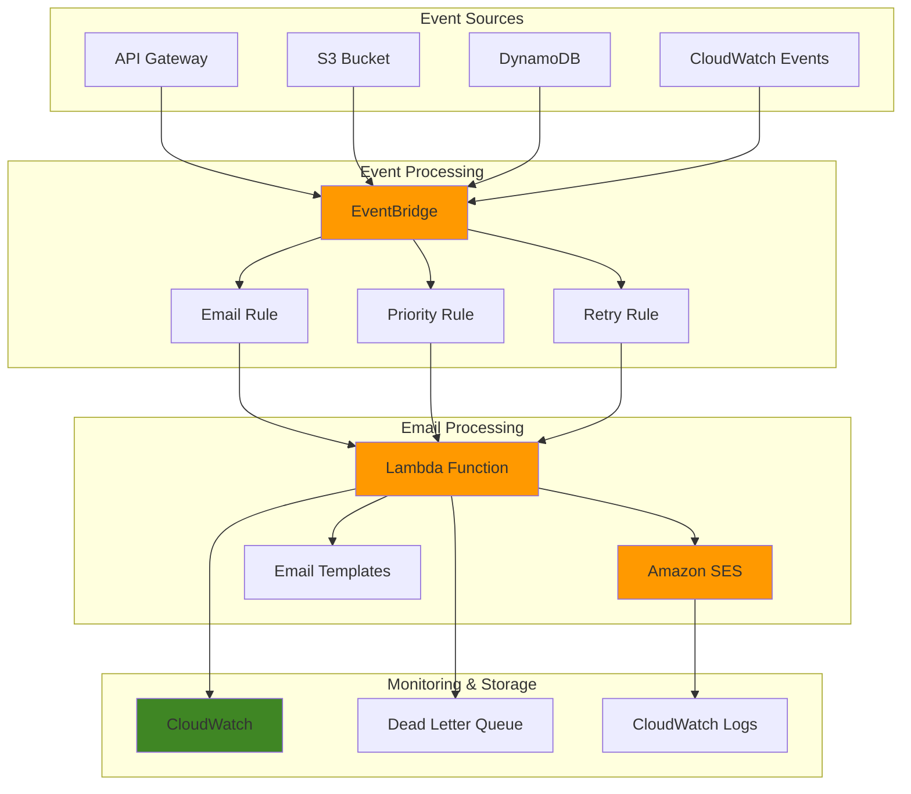

# Email Notification Automation with SES

## Problem

Organizations struggle with managing scattered email notifications across multiple business processes, leading to inconsistent messaging, delayed responses, and poor customer experience. Manual email management systems cannot scale effectively with growing business demands, resulting in missed opportunities and reduced operational efficiency. Current solutions often require complex integrations, lack proper event handling, and fail to provide the flexibility needed for personalized customer communications.

## Solution

This solution creates a scalable, event-driven email automation system using Amazon SES for reliable email delivery, AWS Lambda for serverless processing logic, and Amazon EventBridge for intelligent event orchestration. The architecture enables automatic email notifications triggered by business events, supports personalized messaging through templates, and provides comprehensive monitoring and error handling capabilities.

## Architecture Diagram



## Prerequisites

1. AWS account with appropriate permissions for SES, Lambda, EventBridge, and CloudWatch
2. AWS CLI v2 installed and configured (or AWS CloudShell)
3. Basic understanding of serverless architecture and event-driven patterns
4. Knowledge of JSON structure and AWS IAM permissions
5. Estimated cost: $5-15 per month for development/testing workloads

> **Note**: This solution follows AWS Well-Architected Framework principles for serverless applications. See the [AWS Well-Architected Framework](https://docs.aws.amazon.com/wellarchitected/latest/framework/welcome.html) for additional guidance.

## Preparation

```bash
# Set environment variables
export AWS_REGION=$(aws configure get region)
export AWS_ACCOUNT_ID=$(aws sts get-caller-identity \
    --query Account --output text)

# Generate unique identifiers for resources
RANDOM_SUFFIX=$(aws secretsmanager get-random-password \
    --exclude-punctuation --exclude-uppercase \
    --password-length 6 --require-each-included-type \
    --output text --query RandomPassword)

# Set project-specific variables
export PROJECT_NAME="email-automation-${RANDOM_SUFFIX}"
export EMAIL_SENDER="your-email@example.com"
export EMAIL_RECIPIENT="test-recipient@example.com"

# Create S3 bucket for Lambda deployment packages
aws s3 mb s3://lambda-deployment-${PROJECT_NAME} \
    --region ${AWS_REGION}

echo "✅ AWS environment configured with project: ${PROJECT_NAME}"
```

## Steps

1. **Verify and Configure Amazon SES**:

   Amazon SES provides highly scalable email delivery capabilities with built-in deliverability optimization and security features. Before sending emails, we need to verify email addresses and configure SES for our use case. This step establishes the email delivery foundation that will handle all outgoing notifications with enterprise-grade reliability.

   ```bash
   # Verify sender email address
   aws ses verify-email-identity \
       --email-address ${EMAIL_SENDER} \
       --region ${AWS_REGION}
   
   # Verify recipient email address (for testing)
   aws ses verify-email-identity \
       --email-address ${EMAIL_RECIPIENT} \
       --region ${AWS_REGION}
   
   # Wait for verification to propagate
   echo "⏳ Waiting for email verification to propagate..."
   sleep 30
   
   # Check verification status
   aws ses get-identity-verification-attributes \
       --identities ${EMAIL_SENDER} ${EMAIL_RECIPIENT} \
       --region ${AWS_REGION}
   
   echo "✅ SES email addresses verification initiated"
   ```

   Email verification is now in progress. Check your email inbox for verification messages and click the verification links before proceeding to the next step.

2. **Create IAM Role for Lambda Function**:

   AWS Lambda requires specific IAM permissions to interact with SES, EventBridge, and CloudWatch services. This role follows the principle of least privilege while enabling the Lambda function to send emails, write logs, and handle event processing securely.

   ```bash
   # Create trust policy for Lambda
   cat > lambda-trust-policy.json << 'EOF'
   {
     "Version": "2012-10-17",
     "Statement": [
       {
         "Effect": "Allow",
         "Principal": {
           "Service": "lambda.amazonaws.com"
         },
         "Action": "sts:AssumeRole"
       }
     ]
   }
   EOF
   
   # Create IAM role
   aws iam create-role \
       --role-name ${PROJECT_NAME}-lambda-role \
       --assume-role-policy-document file://lambda-trust-policy.json
   
   # Attach basic Lambda execution policy
   aws iam attach-role-policy \
       --role-name ${PROJECT_NAME}-lambda-role \
       --policy-arn arn:aws:iam::aws:policy/service-role/AWSLambdaBasicExecutionRole
   
   # Create and attach SES permissions policy
   cat > ses-permissions-policy.json << 'EOF'
   {
     "Version": "2012-10-17",
     "Statement": [
       {
         "Effect": "Allow",
         "Action": [
           "ses:SendEmail",
           "ses:SendRawEmail",
           "ses:SendTemplatedEmail"
         ],
         "Resource": "*"
       }
     ]
   }
   EOF
   
   aws iam create-policy \
       --policy-name ${PROJECT_NAME}-ses-policy \
       --policy-document file://ses-permissions-policy.json
   
   aws iam attach-role-policy \
       --role-name ${PROJECT_NAME}-lambda-role \
       --policy-arn arn:aws:iam::${AWS_ACCOUNT_ID}:policy/${PROJECT_NAME}-ses-policy
   
   # Wait for IAM role to propagate
   echo "⏳ Waiting for IAM role to propagate..."
   sleep 10
   
   echo "✅ IAM role created with appropriate permissions"
   ```

   The Lambda execution role is now configured with the necessary permissions to send emails through SES while maintaining security best practices.

3. **Create Email Template in SES**:

   SES templates enable personalized email content with dynamic variables, supporting both HTML and text formats. Templates improve performance by reducing payload size and enable consistent branding across all automated emails while supporting advanced personalization features.

   ```bash
   # Create email template for notifications
   cat > email-template.json << 'EOF'
   {
     "TemplateName": "NotificationTemplate",
     "SubjectPart": "{{subject}}",
     "HtmlPart": "<html><body><h2>{{title}}</h2><p>{{message}}</p><p>Timestamp: {{timestamp}}</p><p>Event Source: {{source}}</p></body></html>",
     "TextPart": "{{title}}\n\n{{message}}\n\nTimestamp: {{timestamp}}\nEvent Source: {{source}}"
   }
   EOF
   
   # Create the template in SES (using v1 API)
   aws ses create-template \
       --template file://email-template.json \
       --region ${AWS_REGION}
   
   # Wait for template to propagate
   echo "⏳ Waiting for email template to propagate..."
   sleep 10
   
   # Verify template creation
   aws ses get-template \
       --template-name NotificationTemplate \
       --region ${AWS_REGION}
   
   echo "✅ Email template created successfully"
   ```

   The email template is now available for use with personalized content variables that will be populated dynamically based on incoming events.

4. **Create Lambda Function for Email Processing**:

   AWS Lambda provides serverless compute that automatically scales based on incoming events from EventBridge. This function processes events, formats email content, and sends notifications through SES with comprehensive error handling and logging capabilities.

   ```bash
   # Create Lambda function code
   cat > email_processor.py << 'EOF'
   import json
   import boto3
   import logging
   from datetime import datetime
   
   # Configure logging
   logger = logging.getLogger()
   logger.setLevel(logging.INFO)
   
   # Initialize AWS clients
   ses_client = boto3.client('ses')
   
   def lambda_handler(event, context):
       try:
           logger.info(f"Processing event: {json.dumps(event)}")
           
           # Extract event details
           event_detail = event.get('detail', {})
           event_source = event.get('source', 'unknown')
           event_type = event.get('detail-type', 'Unknown Event')
           
           # Extract email configuration from event
           email_config = event_detail.get('emailConfig', {})
           recipient = email_config.get('recipient', 'default-recipient@example.com')
           subject = email_config.get('subject', f'Notification: {event_type}')
           message = event_detail.get('message', 'No message provided')
           title = event_detail.get('title', event_type)
           
           # Prepare template data
           template_data = {
               'subject': subject,
               'title': title,
               'message': message,
               'timestamp': datetime.now().isoformat(),
               'source': event_source
           }
           
           # Send templated email
           response = ses_client.send_templated_email(
               Source='your-email@example.com',  # Replace with your verified sender
               Destination={'ToAddresses': [recipient]},
               Template='NotificationTemplate',
               TemplateData=json.dumps(template_data)
           )
           
           logger.info(f"Email sent successfully: {response['MessageId']}")
           
           return {
               'statusCode': 200,
               'body': json.dumps({
                   'message': 'Email sent successfully',
                   'messageId': response['MessageId'],
                   'recipient': recipient
               })
           }
           
       except Exception as e:
           logger.error(f"Error processing email: {str(e)}")
           # Re-raise to trigger EventBridge retry mechanism
           raise e
   EOF
   
   # Update the Lambda function with verified sender email
   sed -i "s/your-email@example.com/${EMAIL_SENDER}/g" email_processor.py
   
   # Create deployment package
   zip function.zip email_processor.py
   
   # Upload to S3
   aws s3 cp function.zip s3://lambda-deployment-${PROJECT_NAME}/
   
   # Create Lambda function
   aws lambda create-function \
       --function-name ${PROJECT_NAME}-email-processor \
       --runtime python3.9 \
       --role arn:aws:iam::${AWS_ACCOUNT_ID}:role/${PROJECT_NAME}-lambda-role \
       --handler email_processor.lambda_handler \
       --code S3Bucket=lambda-deployment-${PROJECT_NAME},S3Key=function.zip \
       --timeout 30 \
       --memory-size 256 \
       --description "Email notification processor for event-driven system"
   
   # Wait for Lambda function to be ready
   echo "⏳ Waiting for Lambda function to be ready..."
   aws lambda wait function-active \
       --function-name ${PROJECT_NAME}-email-processor
   
   echo "✅ Lambda function created successfully"
   ```

   The Lambda function is now deployed and ready to process events from EventBridge, sending personalized emails through SES with proper error handling and monitoring.

5. **Create EventBridge Custom Bus and Rules**:

   EventBridge provides serverless event routing that decouples event producers from consumers, enabling flexible and scalable event-driven architectures. Custom event buses provide namespace isolation and better event organization for complex systems.

   ```bash
   # Create custom event bus
   aws events create-event-bus \
       --name ${PROJECT_NAME}-event-bus
   
   # Create EventBridge rule for email notifications
   aws events put-rule \
       --event-bus-name ${PROJECT_NAME}-event-bus \
       --name ${PROJECT_NAME}-email-rule \
       --event-pattern '{
         "source": ["custom.application"],
         "detail-type": ["Email Notification Request"]
       }' \
       --state ENABLED \
       --description "Route email notification requests to Lambda processor"
   
   # Add Lambda function as target
   aws events put-targets \
       --event-bus-name ${PROJECT_NAME}-event-bus \
       --rule ${PROJECT_NAME}-email-rule \
       --targets "Id"="1","Arn"="arn:aws:lambda:${AWS_REGION}:${AWS_ACCOUNT_ID}:function:${PROJECT_NAME}-email-processor"
   
   # Grant EventBridge permission to invoke Lambda
   aws lambda add-permission \
       --function-name ${PROJECT_NAME}-email-processor \
       --statement-id eventbridge-invoke-${RANDOM_SUFFIX} \
       --action lambda:InvokeFunction \
       --principal events.amazonaws.com \
       --source-arn arn:aws:events:${AWS_REGION}:${AWS_ACCOUNT_ID}:rule/${PROJECT_NAME}-event-bus/${PROJECT_NAME}-email-rule
   
   echo "✅ EventBridge bus and rules configured"
   ```

   EventBridge is now configured to route email notification events to the Lambda function, enabling scalable event-driven email processing.

6. **Create Additional Event Rules for Different Scenarios**:

   Event-driven architectures benefit from multiple event patterns that handle different business scenarios. This step creates additional rules for priority notifications, scheduled emails, and error handling to demonstrate the flexibility of the system.

   ```bash
   # Create rule for priority notifications
   aws events put-rule \
       --event-bus-name ${PROJECT_NAME}-event-bus \
       --name ${PROJECT_NAME}-priority-rule \
       --event-pattern '{
         "source": ["custom.application"],
         "detail-type": ["Priority Alert"],
         "detail": {
           "priority": ["high", "critical"]
         }
       }' \
       --state ENABLED \
       --description "Handle high priority alerts"
   
   # Add Lambda target for priority rule
   aws events put-targets \
       --event-bus-name ${PROJECT_NAME}-event-bus \
       --rule ${PROJECT_NAME}-priority-rule \
       --targets "Id"="1","Arn"="arn:aws:lambda:${AWS_REGION}:${AWS_ACCOUNT_ID}:function:${PROJECT_NAME}-email-processor"
   
   # Grant permission for priority rule
   aws lambda add-permission \
       --function-name ${PROJECT_NAME}-email-processor \
       --statement-id priority-invoke-${RANDOM_SUFFIX} \
       --action lambda:InvokeFunction \
       --principal events.amazonaws.com \
       --source-arn arn:aws:events:${AWS_REGION}:${AWS_ACCOUNT_ID}:rule/${PROJECT_NAME}-event-bus/${PROJECT_NAME}-priority-rule
   
   # Create scheduled rule for daily reports
   aws events put-rule \
       --name ${PROJECT_NAME}-daily-report \
       --schedule-expression "cron(0 9 * * ? *)" \
       --state ENABLED \
       --description "Send daily email reports"
   
   # Add Lambda target for scheduled rule
   aws events put-targets \
       --rule ${PROJECT_NAME}-daily-report \
       --targets "Id"="1","Arn"="arn:aws:lambda:${AWS_REGION}:${AWS_ACCOUNT_ID}:function:${PROJECT_NAME}-email-processor"
   
   # Grant permission for scheduled rule
   aws lambda add-permission \
       --function-name ${PROJECT_NAME}-email-processor \
       --statement-id scheduled-invoke-${RANDOM_SUFFIX} \
       --action lambda:InvokeFunction \
       --principal events.amazonaws.com \
       --source-arn arn:aws:events:${AWS_REGION}:${AWS_ACCOUNT_ID}:rule/${PROJECT_NAME}-daily-report
   
   echo "✅ Additional event rules created for different scenarios"
   ```

   Multiple event rules are now configured to handle various business scenarios, demonstrating the flexibility and scalability of event-driven architecture.

7. **Configure CloudWatch Monitoring and Alarms**:

   CloudWatch provides comprehensive monitoring, logging, and alerting capabilities essential for production event-driven systems. This monitoring setup enables proactive issue detection and performance optimization for the email automation system.

   ```bash
   # Create CloudWatch alarm for Lambda errors
   aws cloudwatch put-metric-alarm \
       --alarm-name "${PROJECT_NAME}-lambda-errors" \
       --alarm-description "Monitor Lambda function errors" \
       --metric-name Errors \
       --namespace AWS/Lambda \
       --statistic Sum \
       --period 300 \
       --threshold 1 \
       --comparison-operator GreaterThanOrEqualToThreshold \
       --evaluation-periods 1 \
       --dimensions Name=FunctionName,Value=${PROJECT_NAME}-email-processor
   
   # Create CloudWatch alarm for SES bounces
   aws cloudwatch put-metric-alarm \
       --alarm-name "${PROJECT_NAME}-ses-bounces" \
       --alarm-description "Monitor SES bounce rate" \
       --metric-name Bounce \
       --namespace AWS/SES \
       --statistic Sum \
       --period 300 \
       --threshold 5 \
       --comparison-operator GreaterThanOrEqualToThreshold \
       --evaluation-periods 2
   
   # Wait for Lambda log group to be created
   echo "⏳ Waiting for Lambda log group to be created..."
   sleep 30
   
   # Create custom metric filter for Lambda logs
   aws logs put-metric-filter \
       --log-group-name /aws/lambda/${PROJECT_NAME}-email-processor \
       --filter-name EmailProcessingErrors \
       --filter-pattern "ERROR" \
       --metric-transformations \
           metricName=EmailProcessingErrors,metricNamespace=CustomMetrics,metricValue=1
   
   echo "✅ CloudWatch monitoring and alarms configured"
   ```

   Comprehensive monitoring is now in place to track system health, performance metrics, and error conditions across all components.

8. **Test the Email Automation System**:

   Testing validates the complete event-driven workflow from event publishing through EventBridge to email delivery via SES. This step ensures all components work together correctly and provides examples of different event patterns.

   ```bash
   # Test basic email notification
   aws events put-events \
       --entries '[
         {
           "Source": "custom.application",
           "DetailType": "Email Notification Request",
           "Detail": "{\"emailConfig\":{\"recipient\":\"'${EMAIL_RECIPIENT}'\",\"subject\":\"Test Notification\"},\"title\":\"System Alert\",\"message\":\"This is a test notification from the automated email system.\"}",
           "EventBusName": "'${PROJECT_NAME}'-event-bus"
         }
       ]'
   
   # Wait for event processing
   echo "⏳ Waiting for event processing..."
   sleep 15
   
   # Test priority alert
   aws events put-events \
       --entries '[
         {
           "Source": "custom.application",
           "DetailType": "Priority Alert",
           "Detail": "{\"priority\":\"high\",\"emailConfig\":{\"recipient\":\"'${EMAIL_RECIPIENT}'\",\"subject\":\"High Priority Alert\"},\"title\":\"Critical System Issue\",\"message\":\"Immediate attention required for system component failure.\"}",
           "EventBusName": "'${PROJECT_NAME}'-event-bus"
         }
       ]'
   
   # Wait for additional event processing
   echo "⏳ Waiting for additional event processing..."
   sleep 15
   
   # Check Lambda function logs
   aws logs describe-log-streams \
       --log-group-name /aws/lambda/${PROJECT_NAME}-email-processor \
       --order-by LastEventTime \
       --descending \
       --max-items 1
   
   echo "✅ Test events sent successfully"
   ```

   Test events have been published to EventBridge and should trigger email notifications. Check your email inbox and CloudWatch logs for processing results.

## Validation & Testing

1. **Verify email delivery and content**:

   ```bash
   # Check SES sending statistics
   aws ses get-send-statistics --region ${AWS_REGION}
   
   # Check Lambda function invocations
   aws lambda get-function \
       --function-name ${PROJECT_NAME}-email-processor \
       --query 'Configuration.LastModified'
   ```

   Expected output: Statistics showing successful email sends and recent Lambda function activity.

2. **Test error handling and monitoring**:

   ```bash
   # Send invalid event to test error handling
   aws events put-events \
       --entries '[
         {
           "Source": "custom.application",
           "DetailType": "Email Notification Request",
           "Detail": "{\"invalidField\":\"test\"}",
           "EventBusName": "'${PROJECT_NAME}'-event-bus"
         }
       ]'
   
   # Wait for error processing
   echo "⏳ Waiting for error processing..."
   sleep 15
   
   # Check CloudWatch logs for error handling
   aws logs filter-log-events \
       --log-group-name /aws/lambda/${PROJECT_NAME}-email-processor \
       --filter-pattern "ERROR" \
       --max-items 5
   ```

   Expected output: Error logs showing proper exception handling and logging.

3. **Validate EventBridge rule matching**:

   ```bash
   # Check EventBridge rule invocations
   aws cloudwatch get-metric-statistics \
       --namespace AWS/Events \
       --metric-name InvocationsCount \
       --dimensions Name=RuleName,Value=${PROJECT_NAME}-email-rule \
       --start-time $(date -d '1 hour ago' --iso-8601) \
       --end-time $(date --iso-8601) \
       --period 300 \
       --statistics Sum
   ```

   Expected output: Metrics showing EventBridge rule invocations and successful event processing.

## Cleanup

1. **Remove Lambda function and related resources**:

   ```bash
   # Delete Lambda function
   aws lambda delete-function \
       --function-name ${PROJECT_NAME}-email-processor
   
   # Delete IAM role and policies
   aws iam detach-role-policy \
       --role-name ${PROJECT_NAME}-lambda-role \
       --policy-arn arn:aws:iam::aws:policy/service-role/AWSLambdaBasicExecutionRole
   
   aws iam detach-role-policy \
       --role-name ${PROJECT_NAME}-lambda-role \
       --policy-arn arn:aws:iam::${AWS_ACCOUNT_ID}:policy/${PROJECT_NAME}-ses-policy
   
   aws iam delete-policy \
       --policy-arn arn:aws:iam::${AWS_ACCOUNT_ID}:policy/${PROJECT_NAME}-ses-policy
   
   aws iam delete-role \
       --role-name ${PROJECT_NAME}-lambda-role
   
   echo "✅ Lambda function and IAM resources deleted"
   ```

2. **Remove EventBridge resources**:

   ```bash
   # Delete EventBridge rules
   aws events remove-targets \
       --event-bus-name ${PROJECT_NAME}-event-bus \
       --rule ${PROJECT_NAME}-email-rule \
       --ids 1
   
   aws events remove-targets \
       --event-bus-name ${PROJECT_NAME}-event-bus \
       --rule ${PROJECT_NAME}-priority-rule \
       --ids 1
   
   aws events remove-targets \
       --rule ${PROJECT_NAME}-daily-report \
       --ids 1
   
   aws events delete-rule \
       --event-bus-name ${PROJECT_NAME}-event-bus \
       --name ${PROJECT_NAME}-email-rule
   
   aws events delete-rule \
       --event-bus-name ${PROJECT_NAME}-event-bus \
       --name ${PROJECT_NAME}-priority-rule
   
   aws events delete-rule \
       --name ${PROJECT_NAME}-daily-report
   
   # Delete custom event bus
   aws events delete-event-bus \
       --name ${PROJECT_NAME}-event-bus
   
   echo "✅ EventBridge resources deleted"
   ```

3. **Remove SES and CloudWatch resources**:

   ```bash
   # Delete SES email template
   aws ses delete-template \
       --template-name NotificationTemplate \
       --region ${AWS_REGION}
   
   # Delete CloudWatch alarms
   aws cloudwatch delete-alarms \
       --alarm-names "${PROJECT_NAME}-lambda-errors" \
         "${PROJECT_NAME}-ses-bounces"
   
   # Delete CloudWatch log group
   aws logs delete-log-group \
       --log-group-name /aws/lambda/${PROJECT_NAME}-email-processor
   
   # Delete S3 bucket
   aws s3 rm s3://lambda-deployment-${PROJECT_NAME} --recursive
   aws s3 rb s3://lambda-deployment-${PROJECT_NAME}
   
   # Clean up local files
   rm -f lambda-trust-policy.json ses-permissions-policy.json \
         email-template.json email_processor.py function.zip
   
   echo "✅ All resources cleaned up successfully"
   ```

## Discussion

This event-driven email automation system demonstrates the power of serverless architecture for scalable communication workflows. By combining Amazon SES, AWS Lambda, and Amazon EventBridge, we've created a loosely coupled system that can handle varying loads while maintaining high availability and cost efficiency. The architecture follows AWS Well-Architected Framework principles, particularly in the areas of operational excellence, security, and performance efficiency.

The use of EventBridge as the central event router provides several key advantages. First, it decouples event producers from consumers, allowing multiple systems to publish events without knowing about downstream processors. Second, it enables flexible event filtering and routing based on content, source, or other attributes. Third, it provides built-in retry mechanisms and dead letter queue support for handling failures gracefully. This design pattern is particularly valuable for microservices architectures where different services need to communicate asynchronously.

Amazon SES integration provides enterprise-grade email delivery capabilities with features like bounce and complaint handling, reputation management, and sending statistics. The template-based approach enables consistent branding and personalization while reducing payload sizes and improving performance. SES also provides built-in security features like DKIM signing and SPF validation, which are essential for maintaining email deliverability in production environments.

The serverless nature of this solution offers significant operational benefits. Lambda functions automatically scale based on demand, eliminating the need for capacity planning and server management. CloudWatch provides comprehensive monitoring and logging capabilities that enable proactive issue detection and performance optimization. The pay-per-use pricing model ensures cost efficiency, especially for workloads with unpredictable or variable traffic patterns.

> **Tip**: For production deployments, consider implementing additional features like email throttling, recipient list management, and advanced template personalization using SES configuration sets and custom tracking domains.

For more information about implementing event-driven architectures with AWS services, see the [AWS Lambda Event-Driven Architecture Guide](https://docs.aws.amazon.com/lambda/latest/dg/concepts-event-driven-architectures.html), [Amazon EventBridge User Guide](https://docs.aws.amazon.com/eventbridge/latest/userguide/eb-what-is.html), [Amazon SES Developer Guide](https://docs.aws.amazon.com/ses/latest/dg/Welcome.html), [SES EventBridge Integration Documentation](https://docs.aws.amazon.com/ses/latest/dg/monitoring-eventbridge.html), and [AWS Well-Architected Serverless Applications Lens](https://docs.aws.amazon.com/wellarchitected/latest/serverless-applications-lens/welcome.html).

## Challenge

Extend this solution by implementing these enhancements:

1. **Advanced Template Management**: Create a template management system that supports A/B testing, version control, and dynamic template selection based on recipient preferences or event types.

2. **Multi-Channel Notifications**: Extend the system to support SMS, push notifications, and Slack integrations alongside email, using Amazon SNS and additional Lambda functions with unified event routing.

3. **Recipient Segmentation and Personalization**: Implement advanced recipient segmentation using DynamoDB and Lambda, enabling personalized content delivery based on user behavior, preferences, and demographics.

4. **Email Campaign Analytics**: Build a comprehensive analytics dashboard using Amazon QuickSight that tracks email performance, engagement metrics, and campaign effectiveness with real-time reporting capabilities.

5. **Advanced Error Handling and Retry Logic**: Implement sophisticated error handling with exponential backoff, dead letter queues, and automatic retry mechanisms using Step Functions for complex workflow orchestration.

## Infrastructure Code

*Infrastructure code will be generated after recipe approval.*