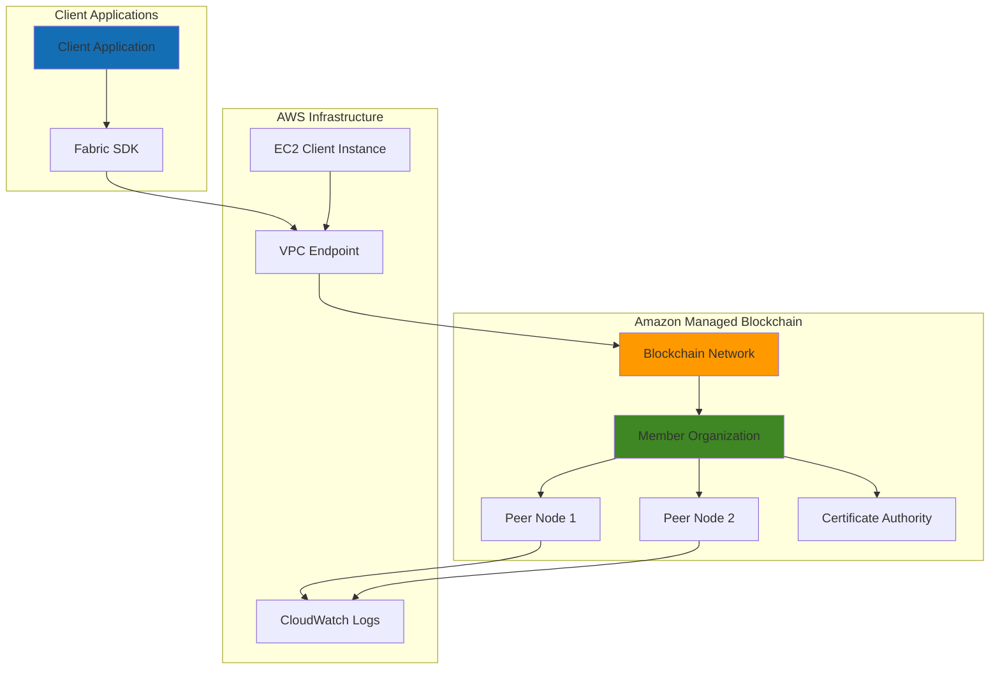

# Enterprise Blockchain Network

## Problem

Enterprise organizations need immutable audit trails and secure multi-party data sharing across business networks, but implementing blockchain infrastructure requires significant expertise in cryptography, consensus mechanisms, and distributed systems. Traditional blockchain deployments demand extensive operational overhead for node management, certificate authorities, and network governance, making it challenging for businesses to focus on application development rather than infrastructure maintenance.

## Solution

Amazon Managed Blockchain eliminates infrastructure complexity by providing a fully managed Hyperledger Fabric network with automated node provisioning, certificate management, and consensus mechanisms. This solution demonstrates how to create a blockchain network, deploy smart contracts (chaincode), and build client applications that interact with the distributed ledger for secure, tamper-proof business transactions.

## Architecture Diagram



## Prerequisites

1. AWS account with permissions for Managed Blockchain, VPC, EC2, and IAM
2. AWS CLI v2 installed and configured (or AWS CloudShell)
3. Basic understanding of blockchain concepts and Hyperledger Fabric
4. Node.js 16+ and npm for client application development
5. Understanding of smart contract development principles
6. Estimated cost: $50-100 for 4-hour session (includes compute and blockchain network costs)

> **Note**: Amazon Managed Blockchain charges based on peer nodes, storage, and data transfer. Review [pricing details](https://aws.amazon.com/managed-blockchain/pricing/) before proceeding.

## Preparation

```bash
# Set environment variables
export AWS_REGION=$(aws configure get region)
export AWS_ACCOUNT_ID=$(aws sts get-caller-identity \
    --query Account --output text)

# Generate unique identifiers for resources
RANDOM_SUFFIX=$(aws secretsmanager get-random-password \
    --exclude-punctuation --exclude-uppercase \
    --password-length 6 --require-each-included-type \
    --output text --query RandomPassword)

export NETWORK_NAME="fabric-network-${RANDOM_SUFFIX}"
export MEMBER_NAME="member-org-${RANDOM_SUFFIX}"
export VPC_ENDPOINT_NAME="blockchain-vpc-endpoint-${RANDOM_SUFFIX}"

# Create VPC for blockchain client access
aws ec2 create-vpc \
    --cidr-block 10.0.0.0/16 \
    --tag-specifications "ResourceType=vpc,Tags=[{Key=Name,Value=blockchain-vpc-${RANDOM_SUFFIX}}]"

VPC_ID=$(aws ec2 describe-vpcs \
    --filters "Name=tag:Name,Values=blockchain-vpc-${RANDOM_SUFFIX}" \
    --query 'Vpcs[0].VpcId' --output text)

export VPC_ID

echo "✅ VPC created: ${VPC_ID}"

# Create subnet for client instances
aws ec2 create-subnet \
    --vpc-id ${VPC_ID} \
    --cidr-block 10.0.1.0/24 \
    --availability-zone ${AWS_REGION}a \
    --tag-specifications "ResourceType=subnet,Tags=[{Key=Name,Value=blockchain-subnet-${RANDOM_SUFFIX}}]"

SUBNET_ID=$(aws ec2 describe-subnets \
    --filters "Name=tag:Name,Values=blockchain-subnet-${RANDOM_SUFFIX}" \
    --query 'Subnets[0].SubnetId' --output text)

export SUBNET_ID

echo "✅ Subnet created: ${SUBNET_ID}"
```

## Steps

1. **Create Hyperledger Fabric Network**:

   Amazon Managed Blockchain abstracts the complexity of blockchain network setup by automatically provisioning orderer nodes, configuring consensus mechanisms, and establishing the foundational network infrastructure. Creating a network establishes the distributed ledger framework that multiple organizations can join to participate in secure, decentralized transactions.

   ```bash
   # Create the blockchain network with Hyperledger Fabric
   aws managedblockchain create-network \
       --name ${NETWORK_NAME} \
       --description "Enterprise blockchain network for secure transactions" \
       --framework HYPERLEDGER_FABRIC \
       --framework-version 2.2 \
       --framework-configuration '{
           "NetworkFabricConfiguration": {
               "Edition": "STARTER"
           }
       }' \
       --voting-policy '{
           "ApprovalThresholdPolicy": {
               "ThresholdPercentage": 50,
               "ProposalDurationInHours": 24,
               "ThresholdComparator": "GREATER_THAN"
           }
       }' \
       --member-configuration '{
           "Name": "'${MEMBER_NAME}'",
           "Description": "Founding member organization",
           "MemberFrameworkConfiguration": {
               "MemberFabricConfiguration": {
                   "AdminUsername": "admin",
                   "AdminPassword": "TempPassword123!"
               }
           }
       }'
   
   echo "✅ Blockchain network creation initiated"
   ```

   The network is now being provisioned with automated certificate authority setup and consensus configuration. This establishes the foundation for a permissioned blockchain where only authorized members can participate in transaction validation and ledger maintenance.

2. **Wait for Network Creation and Retrieve Network ID**:

   Blockchain networks require careful orchestration of cryptographic components, peer-to-peer connections, and consensus mechanisms. The provisioning process typically takes 10-15 minutes as AWS configures the distributed infrastructure and security certificates required for network operations.

   ```bash
   # Wait for network to become available
   echo "Waiting for network creation (this may take 10-15 minutes)..."
   
   while true; do
       NETWORK_STATUS=$(aws managedblockchain list-networks \
           --query "Networks[?Name=='${NETWORK_NAME}'].Status" \
           --output text)
       
       if [ "$NETWORK_STATUS" = "AVAILABLE" ]; then
           echo "✅ Network is now available"
           break
       elif [ "$NETWORK_STATUS" = "CREATE_FAILED" ]; then
           echo "❌ Network creation failed"
           exit 1
       else
           echo "Network status: ${NETWORK_STATUS}. Waiting..."
           sleep 60
       fi
   done
   
   # Get the network ID
   NETWORK_ID=$(aws managedblockchain list-networks \
       --query "Networks[?Name=='${NETWORK_NAME}'].Id" \
       --output text)
   
   export NETWORK_ID
   echo "✅ Network ID: ${NETWORK_ID}"
   ```

   The network is now operational with a fully configured Hyperledger Fabric infrastructure. This includes the orderer service for transaction ordering, certificate authorities for identity management, and the foundation for deploying peer nodes that will host smart contracts and maintain the distributed ledger.

3. **Retrieve Member ID and Create Peer Node**:

   Peer nodes are the workhorses of a Hyperledger Fabric network, responsible for maintaining ledger state, executing smart contracts (chaincode), and participating in transaction endorsement. Each peer maintains a local copy of the blockchain and validates transactions according to network policies before committing them to the immutable ledger.

   ```bash
   # Get the member ID for our organization
   MEMBER_ID=$(aws managedblockchain list-members \
       --network-id ${NETWORK_ID} \
       --query "Members[?Name=='${MEMBER_NAME}'].Id" \
       --output text)
   
   export MEMBER_ID
   echo "Member ID: ${MEMBER_ID}"
   
   # Create a peer node for transaction processing
   aws managedblockchain create-node \
       --network-id ${NETWORK_ID} \
       --member-id ${MEMBER_ID} \
       --node-configuration '{
           "InstanceType": "bc.t3.small",
           "AvailabilityZone": "'${AWS_REGION}a'"
       }'
   
   echo "✅ Peer node creation initiated"
   ```

   The peer node is being provisioned with dedicated compute resources for blockchain operations. This node will participate in the consensus process, execute smart contract logic, and maintain synchronized copies of the distributed ledger across the network.

4. **Wait for Peer Node Availability**:

   ```bash
   # Wait for node to become available
   echo "Waiting for peer node creation (this may take 5-10 minutes)..."
   
   while true; do
       NODE_STATUS=$(aws managedblockchain list-nodes \
           --network-id ${NETWORK_ID} \
           --member-id ${MEMBER_ID} \
           --query "Nodes[0].Status" \
           --output text)
       
       if [ "$NODE_STATUS" = "AVAILABLE" ]; then
           echo "✅ Peer node is now available"
           break
       elif [ "$NODE_STATUS" = "CREATE_FAILED" ]; then
           echo "❌ Node creation failed"
           exit 1
       else
           echo "Node status: ${NODE_STATUS}. Waiting..."
           sleep 30
       fi
   done
   
   # Get the node ID
   NODE_ID=$(aws managedblockchain list-nodes \
       --network-id ${NETWORK_ID} \
       --member-id ${MEMBER_ID} \
       --query "Nodes[0].Id" \
       --output text)
   
   export NODE_ID
   echo "✅ Node ID: ${NODE_ID}"
   ```

5. **Create VPC Endpoint for Blockchain Access**:

   VPC endpoints enable secure, private connectivity between your AWS resources and Managed Blockchain without traversing the public internet. This private network path ensures blockchain communications remain within the AWS backbone, providing enhanced security and performance for sensitive blockchain operations.

   ```bash
   # Create VPC endpoint for secure blockchain access
   aws managedblockchain create-accessor \
       --accessor-type BILLING_TOKEN \
       --client-request-token $(uuidgen)
   
   # Get accessor details
   ACCESSOR_ID=$(aws managedblockchain list-accessors \
       --query "Accessors[0].Id" \
       --output text)
   
   # Create VPC endpoint
   aws ec2 create-vpc-endpoint \
       --vpc-id ${VPC_ID} \
       --service-name com.amazonaws.${AWS_REGION}.managedblockchain.${NETWORK_ID} \
       --vpc-endpoint-type Interface \
       --subnet-ids ${SUBNET_ID} \
       --tag-specifications "ResourceType=vpc-endpoint,Tags=[{Key=Name,Value=${VPC_ENDPOINT_NAME}}]"
   
   VPC_ENDPOINT_ID=$(aws ec2 describe-vpc-endpoints \
       --filters "Name=tag:Name,Values=${VPC_ENDPOINT_NAME}" \
       --query 'VpcEndpoints[0].VpcEndpointId' \
       --output text)
   
   export VPC_ENDPOINT_ID
   
   echo "✅ VPC endpoint created: ${VPC_ENDPOINT_ID}"
   ```

   The VPC endpoint now provides a secure communication channel to your blockchain network. This private connectivity ensures that sensitive blockchain transactions and smart contract interactions remain isolated from public internet traffic.

6. **Launch Client EC2 Instance**:

   A dedicated client instance provides a controlled environment for blockchain application development and testing. This instance will host the Hyperledger Fabric SDK, smart contract development tools, and client applications that interact with the blockchain network through secure API calls.

   ```bash
   # Create security group for blockchain client
   aws ec2 create-security-group \
       --group-name blockchain-client-sg-${RANDOM_SUFFIX} \
       --description "Security group for blockchain client instance" \
       --vpc-id ${VPC_ID}
   
   SG_ID=$(aws ec2 describe-security-groups \
       --filters "Name=group-name,Values=blockchain-client-sg-${RANDOM_SUFFIX}" \
       --query 'SecurityGroups[0].GroupId' \
       --output text)
   
   # Allow SSH access (adjust source IP as needed)
   aws ec2 authorize-security-group-ingress \
       --group-id ${SG_ID} \
       --protocol tcp \
       --port 22 \
       --cidr 0.0.0.0/0
   
   # Launch EC2 instance for blockchain client
   aws ec2 run-instances \
       --image-id ami-0abcdef1234567890 \
       --count 1 \
       --instance-type t3.medium \
       --key-name your-key-pair \
       --security-group-ids ${SG_ID} \
       --subnet-id ${SUBNET_ID} \
       --tag-specifications "ResourceType=instance,Tags=[{Key=Name,Value=blockchain-client-${RANDOM_SUFFIX}}]" \
       --user-data '#!/bin/bash
       yum update -y
       curl -o- https://raw.githubusercontent.com/nvm-sh/nvm/v0.39.0/install.sh | bash
       export NVM_DIR="$HOME/.nvm"
       [ -s "$NVM_DIR/nvm.sh" ] && \. "$NVM_DIR/nvm.sh"
       nvm install 18
       nvm use 18
       npm install -g yarn'
   
   echo "✅ Client instance launched"
   ```

7. **Install and Configure Hyperledger Fabric SDK**:

   The Hyperledger Fabric SDK provides the necessary libraries and tools for applications to interact with blockchain networks. This includes certificate management, transaction submission, and smart contract invocation capabilities that enable seamless integration between traditional applications and blockchain infrastructure.

   ```bash
   # Create sample client application directory structure
   mkdir -p ~/fabric-client-app
   cd ~/fabric-client-app
   
   # Initialize Node.js project
   cat > package.json << 'EOF'
   {
     "name": "fabric-blockchain-client",
     "version": "1.0.0",
     "description": "Sample Hyperledger Fabric client for Amazon Managed Blockchain",
     "main": "app.js",
     "dependencies": {
       "fabric-network": "^2.2.20",
       "fabric-client": "^1.4.22",
       "fabric-ca-client": "^2.2.20"
     }
   }
   EOF
   
   # Install dependencies
   npm install
   
   echo "✅ Fabric SDK installed and configured"
   ```

8. **Create Sample Smart Contract (Chaincode)**:

   Smart contracts (chaincode in Hyperledger Fabric) contain the business logic that governs how data is stored, modified, and accessed on the blockchain. These contracts ensure that all network participants follow the same rules for transaction validation and state changes, creating trustless business agreements enforced by cryptographic consensus.

   ```bash
   # Create chaincode directory
   mkdir -p ~/fabric-client-app/chaincode
   
   # Create sample chaincode for asset management
   cat > ~/fabric-client-app/chaincode/asset-contract.js << 'EOF'
   'use strict';
   
   const { Contract } = require('fabric-contract-api');
   
   class AssetContract extends Contract {
   
       async initLedger(ctx) {
           const assets = [
               {
                   ID: 'asset1',
                   Owner: 'Alice',
                   Value: 100,
                   Timestamp: new Date().toISOString()
               }
           ];
   
           for (const asset of assets) {
               await ctx.stub.putState(asset.ID, Buffer.from(JSON.stringify(asset)));
           }
       }
   
       async createAsset(ctx, id, owner, value) {
           const asset = {
               ID: id,
               Owner: owner,
               Value: parseInt(value),
               Timestamp: new Date().toISOString()
           };
           
           await ctx.stub.putState(id, Buffer.from(JSON.stringify(asset)));
           return JSON.stringify(asset);
       }
   
       async readAsset(ctx, id) {
           const assetJSON = await ctx.stub.getState(id);
           if (!assetJSON || assetJSON.length === 0) {
               throw new Error(`Asset ${id} does not exist`);
           }
           return assetJSON.toString();
       }
   
       async getAllAssets(ctx) {
           const allResults = [];
           const iterator = await ctx.stub.getStateByRange('', '');
           let result = await iterator.next();
           
           while (!result.done) {
               const strValue = Buffer.from(result.value.value).toString('utf8');
               let record;
               try {
                   record = JSON.parse(strValue);
               } catch (err) {
                   record = strValue;
               }
               allResults.push({ Key: result.value.key, Record: record });
               result = await iterator.next();
           }
           
           return JSON.stringify(allResults);
       }
   }
   
   module.exports = AssetContract;
   EOF
   
   echo "✅ Sample smart contract created"
   ```

   The smart contract now provides a foundation for asset management on the blockchain. This contract enables creating, reading, and querying digital assets with immutable audit trails and cryptographic verification of all state changes.

> **Warning**: Smart contracts are immutable once deployed. Thoroughly test contract logic in development environments before deploying to production networks.

## Validation & Testing

1. Verify blockchain network is operational:

   ```bash
   # Check network status
   aws managedblockchain get-network \
       --network-id ${NETWORK_ID} \
       --query 'Network.Status'
   ```

   Expected output: `"AVAILABLE"`

2. Verify peer node is running:

   ```bash
   # Check node status and endpoints
   aws managedblockchain get-node \
       --network-id ${NETWORK_ID} \
       --member-id ${MEMBER_ID} \
       --node-id ${NODE_ID} \
       --query 'Node.[Status,FrameworkAttributes.Fabric.PeerEndpoint]'
   ```

   Expected output: Status should be `"AVAILABLE"` with a peer endpoint URL.

3. Test VPC endpoint connectivity:

   ```bash
   # Verify VPC endpoint is available
   aws ec2 describe-vpc-endpoints \
       --vpc-endpoint-ids ${VPC_ENDPOINT_ID} \
       --query 'VpcEndpoints[0].State'
   ```

   Expected output: `"Available"`

4. Validate client application setup:

   ```bash
   # Check Node.js and npm installation
   node --version && npm --version
   
   # Verify Fabric SDK installation
   npm list fabric-network
   ```

   Expected output: Node.js version 16+ and fabric-network package listed.

## Cleanup

1. Delete the blockchain network:

   ```bash
   # Delete peer node first
   aws managedblockchain delete-node \
       --network-id ${NETWORK_ID} \
       --member-id ${MEMBER_ID} \
       --node-id ${NODE_ID}
   
   echo "✅ Node deletion initiated"
   
   # Wait for node deletion
   while true; do
       NODE_EXISTS=$(aws managedblockchain list-nodes \
           --network-id ${NETWORK_ID} \
           --member-id ${MEMBER_ID} \
           --query 'length(Nodes)' \
           --output text 2>/dev/null || echo "0")
       
       if [ "$NODE_EXISTS" = "0" ]; then
           echo "✅ Node deleted successfully"
           break
       else
           echo "Waiting for node deletion..."
           sleep 30
       fi
   done
   ```

2. Delete member and network:

   ```bash
   # Delete member from network
   aws managedblockchain delete-member \
       --network-id ${NETWORK_ID} \
       --member-id ${MEMBER_ID}
   
   echo "✅ Member deletion initiated"
   
   # Wait for member deletion
   sleep 60
   
   # Delete the network
   aws managedblockchain delete-network \
       --network-id ${NETWORK_ID}
   
   echo "✅ Network deletion initiated"
   ```

3. Clean up VPC resources:

   ```bash
   # Delete VPC endpoint
   aws ec2 delete-vpc-endpoint \
       --vpc-endpoint-id ${VPC_ENDPOINT_ID}
   
   # Terminate EC2 instance
   INSTANCE_ID=$(aws ec2 describe-instances \
       --filters "Name=tag:Name,Values=blockchain-client-${RANDOM_SUFFIX}" \
       --query 'Reservations[0].Instances[0].InstanceId' \
       --output text)
   
   if [ "$INSTANCE_ID" != "None" ]; then
       aws ec2 terminate-instances --instance-ids ${INSTANCE_ID}
   fi
   
   # Delete security group
   aws ec2 delete-security-group --group-id ${SG_ID}
   
   # Delete subnet
   aws ec2 delete-subnet --subnet-id ${SUBNET_ID}
   
   # Delete VPC
   aws ec2 delete-vpc --vpc-id ${VPC_ID}
   
   echo "✅ All resources cleaned up"
   ```

## Discussion

Amazon Managed Blockchain transforms enterprise blockchain adoption by eliminating the operational complexity traditionally associated with distributed ledger infrastructure. Unlike self-managed blockchain deployments that require expertise in cryptographic protocols, consensus algorithms, and peer-to-peer networking, Managed Blockchain provides a fully managed service that handles certificate authorities, node provisioning, and network governance automatically. This abstraction allows development teams to focus on business logic and application development rather than blockchain infrastructure management.

Hyperledger Fabric's permissioned network model makes it particularly suitable for enterprise use cases requiring privacy, regulatory compliance, and controlled access. The modular architecture supports pluggable consensus mechanisms, configurable membership policies, and fine-grained access controls that align with enterprise security requirements. Smart contracts (chaincode) execute in isolated containers, providing deterministic transaction processing while maintaining network security and performance isolation between different business applications.

The integration with AWS services creates powerful hybrid architectures where blockchain provides immutable audit trails and multi-party consensus while traditional cloud services handle user interfaces, analytics, and integration with existing enterprise systems. VPC endpoints ensure that sensitive blockchain communications remain within AWS's private network backbone, addressing security concerns that often arise with public blockchain networks.

> **Tip**: Consider implementing multiple peer nodes across different availability zones for production deployments to ensure high availability and disaster recovery capabilities. See [Hyperledger Fabric documentation](https://hyperledger-fabric.readthedocs.io/) for advanced configuration patterns.

## Challenge

Extend this solution by implementing these enhancements:

1. **Multi-Organization Network**: Add additional member organizations to create a consortium blockchain with cross-organizational transaction flows and shared smart contracts.

2. **Advanced Chaincode Development**: Implement complex business logic with private data collections, state-based endorsement policies, and event emission for real-time application integration.

3. **Client Application Development**: Build a full-stack web application using React/Angular frontend with REST APIs that interact with the blockchain through the Fabric SDK.

4. **Integration with AWS Services**: Connect the blockchain to Lambda functions, API Gateway, and DynamoDB to create hybrid architectures that combine blockchain immutability with traditional cloud scalability.

5. **Production Monitoring**: Implement comprehensive monitoring using CloudWatch metrics, distributed tracing with X-Ray, and automated alerting for network health and transaction throughput.

## Infrastructure Code

*Infrastructure code will be generated after recipe approval.*