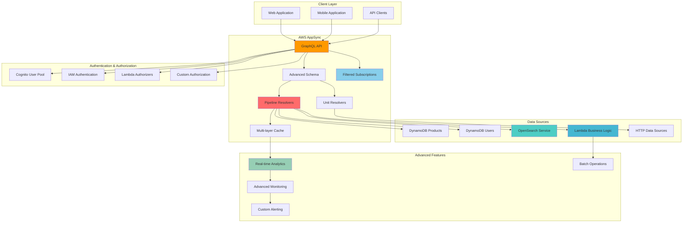

# Enterprise GraphQL API Architecture

## Problem

Enterprise applications demand sophisticated GraphQL APIs that handle complex business logic, advanced search capabilities, and multi-layered data aggregation while maintaining high performance and security standards. Traditional GraphQL implementations require significant infrastructure management, custom resolver development, and complex caching strategies. Your organization needs a production-ready GraphQL API architecture that supports advanced features like full-text search, custom business logic execution, sophisticated authorization patterns, comprehensive monitoring, and seamless integration with multiple data sources while maintaining enterprise-grade security and compliance requirements.

## Solution

Architect a comprehensive GraphQL API ecosystem using AWS AppSync with multiple data sources including DynamoDB for transactional data, OpenSearch for advanced search capabilities, and Lambda for custom business logic execution. This advanced solution implements pipeline resolvers for complex data aggregation, custom authorization logic, full-text search integration, advanced caching strategies, and comprehensive monitoring. The architecture demonstrates enterprise patterns including multi-resolver pipelines, custom scalar types, advanced subscription filtering, and integration with external systems while maintaining optimal performance and security.

## Architecture Diagram



## Prerequisites

1. AWS account with permissions to create AppSync APIs, DynamoDB tables, OpenSearch domains, Lambda functions, and IAM roles
2. AWS CLI v2 installed and configured (use `aws --version` to verify)
3. Advanced understanding of GraphQL concepts (pipeline resolvers, custom scalars, subscriptions, caching)
4. Experience with NoSQL database design patterns, DynamoDB, and OpenSearch
5. Knowledge of JavaScript/VTL template syntax, Lambda development, and API security patterns
6. Familiarity with enterprise monitoring and alerting strategies
7. Understanding of search indexing and full-text search concepts
8. Estimated cost: $50-150 per month for development workloads (includes OpenSearch, Lambda, advanced monitoring)

> **Note**: This advanced implementation incurs additional costs from OpenSearch Service (minimum $15/month for t3.small.search instances), Lambda function invocations, enhanced monitoring, and data transfer between services. Consider using reserved instances for production workloads.

## Preparation

```bash
# Set environment variables
export AWS_REGION=$(aws configure get region)
export AWS_ACCOUNT_ID=$(aws sts get-caller-identity \
    --query Account --output text)

# Generate unique identifiers for resources
RANDOM_SUFFIX=$(aws secretsmanager get-random-password \
    --exclude-punctuation --exclude-uppercase \
    --password-length 8 --require-each-included-type \
    --output text --query RandomPassword)

export PROJECT_NAME="ecommerce-api-${RANDOM_SUFFIX}"
export PRODUCTS_TABLE="Products-${RANDOM_SUFFIX}"
export USERS_TABLE="Users-${RANDOM_SUFFIX}"
export ANALYTICS_TABLE="Analytics-${RANDOM_SUFFIX}"
export USER_POOL_NAME="EcommerceUsers-${RANDOM_SUFFIX}"
export OPENSEARCH_DOMAIN="products-search-${RANDOM_SUFFIX}"
export LAMBDA_FUNCTION_NAME="ProductBusinessLogic-${RANDOM_SUFFIX}"
export GSI_NAME="CategoryIndex"
export USER_GSI_NAME="UserTypeIndex"

echo "Project: $PROJECT_NAME"
echo "Products Table: $PRODUCTS_TABLE"
echo "Users Table: $USERS_TABLE"
echo "Analytics Table: $ANALYTICS_TABLE"
echo "User Pool: $USER_POOL_NAME"
echo "OpenSearch Domain: $OPENSEARCH_DOMAIN"
echo "Lambda Function: $LAMBDA_FUNCTION_NAME"
```

## Steps

1. **Create multiple DynamoDB tables for complex data architecture**:

   DynamoDB serves as the primary data store for our GraphQL API, providing single-digit millisecond performance at any scale. Creating multiple specialized tables allows us to optimize for different access patterns while maintaining strong consistency for transactional operations. This multi-table approach enables efficient querying through Global Secondary Indexes (GSIs) and supports complex business requirements like user management, product cataloging, and real-time analytics.

   ```bash
   # Create products table with multiple GSIs
   aws dynamodb create-table \
       --table-name $PRODUCTS_TABLE \
       --attribute-definitions \
           AttributeName=productId,AttributeType=S \
           AttributeName=category,AttributeType=S \
           AttributeName=createdAt,AttributeType=S \
           AttributeName=priceRange,AttributeType=S \
       --key-schema \
           AttributeName=productId,KeyType=HASH \
       --global-secondary-indexes \
           IndexName=$GSI_NAME,KeySchema=\[AttributeName=category,KeyType=HASH\],\[AttributeName=createdAt,KeyType=RANGE\],Projection=\{ProjectionType=ALL\},BillingMode=PAY_PER_REQUEST \
           IndexName=PriceRangeIndex,KeySchema=\[AttributeName=priceRange,KeyType=HASH\],\[AttributeName=createdAt,KeyType=RANGE\],Projection=\{ProjectionType=ALL\},BillingMode=PAY_PER_REQUEST \
       --billing-mode PAY_PER_REQUEST \
       --stream-specification StreamEnabled=true,StreamViewType=NEW_AND_OLD_IMAGES \
       --tags Key=Project,Value=$PROJECT_NAME
   
   # Create users table for advanced user management
   aws dynamodb create-table \
       --table-name $USERS_TABLE \
       --attribute-definitions \
           AttributeName=userId,AttributeType=S \
           AttributeName=userType,AttributeType=S \
           AttributeName=createdAt,AttributeType=S \
       --key-schema \
           AttributeName=userId,KeyType=HASH \
       --global-secondary-indexes \
           IndexName=$USER_GSI_NAME,KeySchema=\[AttributeName=userType,KeyType=HASH\],\[AttributeName=createdAt,KeyType=RANGE\],Projection=\{ProjectionType=ALL\},BillingMode=PAY_PER_REQUEST \
       --billing-mode PAY_PER_REQUEST \
       --tags Key=Project,Value=$PROJECT_NAME
   
   # Create analytics table for real-time metrics
   aws dynamodb create-table \
       --table-name $ANALYTICS_TABLE \
       --attribute-definitions \
           AttributeName=metricId,AttributeType=S \
           AttributeName=timestamp,AttributeType=S \
       --key-schema \
           AttributeName=metricId,KeyType=HASH \
           AttributeName=timestamp,KeyType=RANGE \
       --billing-mode PAY_PER_REQUEST \
       --tags Key=Project,Value=$PROJECT_NAME
   
   # Wait for all tables to become active
   echo "Waiting for DynamoDB tables to be ready..."
   aws dynamodb wait table-exists --table-name $PRODUCTS_TABLE
   aws dynamodb wait table-exists --table-name $USERS_TABLE
   aws dynamodb wait table-exists --table-name $ANALYTICS_TABLE
   
   # Add comprehensive sample data
   aws dynamodb batch-write-item \
       --request-items '{
           "'$PRODUCTS_TABLE'": [
               {
                   "PutRequest": {
                       "Item": {
                           "productId": {"S": "prod-001"},
                           "name": {"S": "Wireless Headphones"},
                           "description": {"S": "High-quality bluetooth headphones with noise cancellation and premium sound quality"},
                           "price": {"N": "299.99"},
                           "category": {"S": "electronics"},
                           "priceRange": {"S": "high"},
                           "inStock": {"BOOL": true},
                           "createdAt": {"S": "'$(date -u +%Y-%m-%dT%H:%M:%SZ)'"},
                           "tags": {"SS": ["wireless", "bluetooth", "audio", "premium"]},
                           "rating": {"N": "4.5"},
                           "reviewCount": {"N": "156"}
                       }
                   }
               },
               {
                   "PutRequest": {
                       "Item": {
                           "productId": {"S": "prod-002"},
                           "name": {"S": "Smartphone Case"},
                           "description": {"S": "Durable protective case for smartphones with shock absorption"},
                           "price": {"N": "24.99"},
                           "category": {"S": "electronics"},
                           "priceRange": {"S": "low"},
                           "inStock": {"BOOL": true},
                           "createdAt": {"S": "'$(date -u +%Y-%m-%dT%H:%M:%SZ)'"},
                           "tags": {"SS": ["protection", "mobile", "accessories"]},
                           "rating": {"N": "4.2"},
                           "reviewCount": {"N": "89"}
                       }
                   }
               }
           ]
       }'
   
   echo "✅ DynamoDB tables created and seeded: $PRODUCTS_TABLE, $USERS_TABLE, $ANALYTICS_TABLE"
   ```

   The foundation is now established with three specialized tables optimized for different access patterns. The Products table supports efficient category-based queries through its GSI, while the Users and Analytics tables enable comprehensive user management and real-time metrics collection. DynamoDB Streams are enabled to support real-time data processing and event-driven architectures.

2. **Create OpenSearch Service domain for advanced search capabilities**:

   OpenSearch provides powerful full-text search capabilities that complement DynamoDB's structured querying. This managed search service enables complex text searches, faceted navigation, and advanced analytics that would be difficult to implement with traditional databases. The encrypted domain ensures data security while providing sub-second search responses across large product catalogs.

   ```bash
   # Create OpenSearch domain for full-text search
   aws opensearch create-domain \
       --domain-name $OPENSEARCH_DOMAIN \
       --engine-version "OpenSearch_2.3" \
       --cluster-config \
           InstanceType=t3.small.search,InstanceCount=1,DedicatedMasterEnabled=false \
       --ebs-options \
           EBSEnabled=true,VolumeType=gp3,VolumeSize=20 \
       --access-policies '{
           "Version": "2012-10-17",
           "Statement": [{
               "Effect": "Allow",
               "Principal": {"AWS": "arn:aws:iam::'$AWS_ACCOUNT_ID':root"},
               "Action": "es:*",
               "Resource": "arn:aws:es:'$AWS_REGION':'$AWS_ACCOUNT_ID':domain/'$OPENSEARCH_DOMAIN'/*"
           }]
       }' \
       --domain-endpoint-options \
           EnforceHTTPS=true,TLSSecurityPolicy=Policy-Min-TLS-1-2-2019-07 \
       --encryption-at-rest-options Enabled=true \
       --node-to-node-encryption-options Enabled=true \
       --tags Key=Project,Value=$PROJECT_NAME
   
   echo "Creating OpenSearch domain (this may take 15-20 minutes)..."
   
   # Wait for domain to become active
   OPENSEARCH_STATUS="Processing"
   while [ "$OPENSEARCH_STATUS" != "Active" ]; do
       echo "OpenSearch domain status: $OPENSEARCH_STATUS - waiting..."
       sleep 60
       OPENSEARCH_STATUS=$(aws opensearch describe-domain --domain-name $OPENSEARCH_DOMAIN \
           --query 'DomainStatus.Processing' --output text)
       if [ "$OPENSEARCH_STATUS" = "False" ]; then
           OPENSEARCH_STATUS="Active"
       fi
   done
   
   # Get OpenSearch endpoint
   OPENSEARCH_ENDPOINT=$(aws opensearch describe-domain --domain-name $OPENSEARCH_DOMAIN \
       --query 'DomainStatus.Endpoint' --output text)
   export OPENSEARCH_ENDPOINT
   
   echo "✅ OpenSearch domain created: https://$OPENSEARCH_ENDPOINT"
   ```

   OpenSearch is now ready to provide advanced search capabilities including full-text search, autocomplete, and faceted navigation. The encrypted cluster ensures enterprise-grade security while the t3.small instance provides cost-effective performance for development workloads. This search layer will integrate seamlessly with our GraphQL API to enable complex product discovery workflows.

3. **Set up advanced Cognito User Pool with custom attributes**:

   Amazon Cognito User Pools provide comprehensive identity management with enterprise-grade security features. By configuring custom attributes and user groups, we create a flexible authentication system that supports role-based access control (RBAC) essential for multi-tenant applications. This foundation enables fine-grained permissions in our GraphQL API while maintaining compliance with security standards.

   ```bash
   # Create Cognito User Pool with custom attributes and advanced configuration
   USER_POOL_ID=$(aws cognito-idp create-user-pool \
       --pool-name $USER_POOL_NAME \
       --policies 'PasswordPolicy={MinimumLength=8,RequireUppercase=true,RequireLowercase=true,RequireNumbers=true,RequireSymbols=true}' \
       --auto-verified-attributes email \
       --username-attributes email \
       --verification-message-template 'DefaultEmailOption=CONFIRM_WITH_CODE' \
       --schema '[
           {
               "Name": "email",
               "AttributeDataType": "String",
               "Required": true,
               "Mutable": true
           },
           {
               "Name": "user_type",
               "AttributeDataType": "String",
               "Required": false,
               "Mutable": true
           },
           {
               "Name": "company",
               "AttributeDataType": "String",
               "Required": false,
               "Mutable": true
           }
       ]' \
       --tags Project=$PROJECT_NAME \
       --query 'UserPool.Id' --output text)
   
   # Create User Pool Client with advanced configuration
   USER_POOL_CLIENT_ID=$(aws cognito-idp create-user-pool-client \
       --user-pool-id $USER_POOL_ID \
       --client-name "${PROJECT_NAME}-client" \
       --explicit-auth-flows ADMIN_NO_SRP_AUTH ALLOW_USER_PASSWORD_AUTH ALLOW_REFRESH_TOKEN_AUTH ALLOW_CUSTOM_AUTH \
       --prevent-user-existence-errors ENABLED \
       --access-token-validity 60 \
       --id-token-validity 60 \
       --refresh-token-validity 30 \
       --token-validity-units 'AccessToken=minutes,IdToken=minutes,RefreshToken=days' \
       --query 'UserPoolClient.ClientId' --output text)
   
   # Create user groups for role-based access control
   aws cognito-idp create-group \
       --user-pool-id $USER_POOL_ID \
       --group-name "admin" \
       --description "Administrator users with full access"
   
   aws cognito-idp create-group \
       --user-pool-id $USER_POOL_ID \
       --group-name "seller" \
       --description "Seller users with product management access"
   
   aws cognito-idp create-group \
       --user-pool-id $USER_POOL_ID \
       --group-name "customer" \
       --description "Customer users with read-only access"
   
   export USER_POOL_ID
   export USER_POOL_CLIENT_ID
   echo "✅ Cognito User Pool created: $USER_POOL_ID"
   echo "✅ User Pool Client created: $USER_POOL_CLIENT_ID"
   echo "✅ User groups created: admin, seller, customer"
   ```

   The identity management system is now configured with robust security policies and role-based access control. The custom attributes enable storing business-specific user data, while the group-based permissions will integrate with GraphQL directives to enforce field-level security. This authentication foundation supports scalable multi-tenant architectures with fine-grained access control.

4. **Create Lambda function for advanced business logic**:

   AWS Lambda enables serverless execution of complex business logic that goes beyond simple CRUD operations. This function will handle sophisticated calculations, recommendations, and integrations that require custom code while maintaining the serverless architecture benefits. The function integrates with multiple data sources to provide advanced features like product scoring and search index management.

   ```bash
   # Create Lambda function package
   mkdir -p lambda-function
   cat > lambda-function/index.js << 'EOF'
const AWS = require('aws-sdk');
const dynamodb = new AWS.DynamoDB.DocumentClient();
const opensearch = require('@opensearch-project/opensearch');

exports.handler = async (event) => {
    console.log('Received event:', JSON.stringify(event, null, 2));
    
    const { field, arguments: args, source, identity } = event;
    
    try {
        switch (field) {
            case 'calculateProductScore':
                return await calculateProductScore(args.productId);
            case 'getProductRecommendations':
                return await getProductRecommendations(args.userId, args.category);
            case 'updateProductSearchIndex':
                return await updateProductSearchIndex(args.productData);
            case 'processAnalytics':
                return await processAnalytics(args.event, identity);
            default:
                throw new Error(`Unknown field: ${field}`);
        }
    } catch (error) {
        console.error('Error:', error);
        throw error;
    }
};

async function calculateProductScore(productId) {
    // Complex scoring algorithm based on multiple factors
    const product = await dynamodb.get({
        TableName: process.env.PRODUCTS_TABLE,
        Key: { productId }
    }).promise();
    
    if (!product.Item) {
        throw new Error('Product not found');
    }
    
    const { rating, reviewCount, price, category } = product.Item;
    
    // Calculate composite score
    const ratingScore = rating * 0.4;
    const popularityScore = Math.min(reviewCount / 100, 1) * 0.3;
    const priceScore = (price < 50 ? 0.3 : price < 200 ? 0.2 : 0.1) * 0.3;
    
    const totalScore = ratingScore + popularityScore + priceScore;
    
    return {
        productId,
        score: Math.round(totalScore * 100) / 100,
        breakdown: {
            rating: ratingScore,
            popularity: popularityScore,
            price: priceScore
        }
    };
}

async function getProductRecommendations(userId, category) {
    // Get user preferences and behavior
    const params = {
        TableName: process.env.PRODUCTS_TABLE,
        IndexName: 'CategoryIndex',
        KeyConditionExpression: 'category = :category',
        ExpressionAttributeValues: {
            ':category': category
        },
        Limit: 10
    };
    
    const result = await dynamodb.query(params).promise();
    
    // Apply ML-based scoring (simplified)
    const recommendations = result.Items.map(item => ({
        ...item,
        recommendationScore: Math.random() * 0.3 + 0.7 // Simplified scoring
    })).sort((a, b) => b.recommendationScore - a.recommendationScore);
    
    return recommendations.slice(0, 5);
}

async function updateProductSearchIndex(productData) {
    // Update OpenSearch index
    const client = new opensearch.Client({
        node: `https://${process.env.OPENSEARCH_ENDPOINT}`,
        auth: {
            username: process.env.OPENSEARCH_USERNAME,
            password: process.env.OPENSEARCH_PASSWORD
        }
    });
    
    const document = {
        productId: productData.productId,
        name: productData.name,
        description: productData.description,
        category: productData.category,
        tags: productData.tags,
        price: productData.price,
        searchText: `${productData.name} ${productData.description} ${productData.tags?.join(' ')}`,
        timestamp: new Date().toISOString()
    };
    
    await client.index({
        index: 'products',
        id: productData.productId,
        body: document
    });
    
    return { success: true, productId: productData.productId };
}

async function processAnalytics(eventData, identity) {
    // Process analytics events
    const analyticsRecord = {
        metricId: `${eventData.type}-${Date.now()}`,
        timestamp: new Date().toISOString(),
        eventType: eventData.type,
        userId: identity.sub,
        data: eventData.data,
        ttl: Math.floor(Date.now() / 1000) + (30 * 24 * 60 * 60) // 30 days TTL
    };
    
    await dynamodb.put({
        TableName: process.env.ANALYTICS_TABLE,
        Item: analyticsRecord
    }).promise();
    
    return { success: true, eventId: analyticsRecord.metricId };
}
EOF

   # Create package.json
   cat > lambda-function/package.json << 'EOF'
{
  "name": "product-business-logic",
  "version": "1.0.0",
  "main": "index.js",
  "dependencies": {
    "@opensearch-project/opensearch": "^2.0.0",
    "aws-sdk": "^2.1000.0"
  }
}
EOF

   # Install dependencies and create deployment package
   cd lambda-function
   npm install
   zip -r ../lambda-function.zip .
   cd ..
   
   # Create Lambda execution role
   cat > lambda-trust-policy.json << 'EOF'
{
    "Version": "2012-10-17",
    "Statement": [
        {
            "Effect": "Allow",
            "Principal": {
                "Service": "lambda.amazonaws.com"
            },
            "Action": "sts:AssumeRole"
        }
    ]
}
EOF

   LAMBDA_ROLE_ARN=$(aws iam create-role \
       --role-name "LambdaExecutionRole-${RANDOM_SUFFIX}" \
       --assume-role-policy-document file://lambda-trust-policy.json \
       --query 'Role.Arn' --output text)
   
   # Attach policies to Lambda role
   aws iam attach-role-policy \
       --role-name "LambdaExecutionRole-${RANDOM_SUFFIX}" \
       --policy-arn arn:aws:iam::aws:policy/service-role/AWSLambdaBasicExecutionRole
   
   # Create custom policy for Lambda
   cat > lambda-policy.json << EOF
{
    "Version": "2012-10-17",
    "Statement": [
        {
            "Effect": "Allow",
            "Action": [
                "dynamodb:GetItem",
                "dynamodb:PutItem",
                "dynamodb:UpdateItem",
                "dynamodb:Query",
                "dynamodb:Scan"
            ],
            "Resource": [
                "arn:aws:dynamodb:${AWS_REGION}:${AWS_ACCOUNT_ID}:table/${PRODUCTS_TABLE}",
                "arn:aws:dynamodb:${AWS_REGION}:${AWS_ACCOUNT_ID}:table/${PRODUCTS_TABLE}/*",
                "arn:aws:dynamodb:${AWS_REGION}:${AWS_ACCOUNT_ID}:table/${USERS_TABLE}",
                "arn:aws:dynamodb:${AWS_REGION}:${AWS_ACCOUNT_ID}:table/${ANALYTICS_TABLE}"
            ]
        },
        {
            "Effect": "Allow",
            "Action": [
                "es:ESHttpGet",
                "es:ESHttpPost",
                "es:ESHttpPut",
                "es:ESHttpDelete"
            ],
            "Resource": "arn:aws:es:${AWS_REGION}:${AWS_ACCOUNT_ID}:domain/${OPENSEARCH_DOMAIN}/*"
        }
    ]
}
EOF

   aws iam put-role-policy \
       --role-name "LambdaExecutionRole-${RANDOM_SUFFIX}" \
       --policy-name "LambdaCustomPolicy" \
       --policy-document file://lambda-policy.json
   
   # Wait for IAM role propagation
   sleep 20
   
   # Create Lambda function
   LAMBDA_FUNCTION_ARN=$(aws lambda create-function \
       --function-name $LAMBDA_FUNCTION_NAME \
       --runtime nodejs18.x \
       --role $LAMBDA_ROLE_ARN \
       --handler index.handler \
       --zip-file fileb://lambda-function.zip \
       --timeout 30 \
       --memory-size 512 \
       --environment Variables="{PRODUCTS_TABLE=$PRODUCTS_TABLE,USERS_TABLE=$USERS_TABLE,ANALYTICS_TABLE=$ANALYTICS_TABLE,OPENSEARCH_ENDPOINT=$OPENSEARCH_ENDPOINT}" \
       --tags Project=$PROJECT_NAME \
       --query 'FunctionArn' --output text)
   
   export LAMBDA_FUNCTION_ARN
   echo "✅ Lambda function created: $LAMBDA_FUNCTION_ARN"
   ```

   The serverless business logic layer is now deployed and ready to handle complex operations like product scoring algorithms, recommendation engines, and search index management. This Lambda function extends the GraphQL API beyond simple CRUD operations, enabling sophisticated features that differentiate the application while maintaining cost-effective scaling.

5. **Create the AppSync GraphQL API with multiple authentication methods**:

   AWS AppSync provides a fully managed GraphQL service that eliminates the operational complexity of running GraphQL servers. By configuring multiple authentication methods, we create a flexible API that can serve different client types while maintaining security. The enhanced monitoring and X-Ray tracing provide comprehensive observability for production workloads.

   ```bash
   # Create enhanced AppSync API with multiple authentication methods
   API_ID=$(aws appsync create-graphql-api \
       --name $PROJECT_NAME \
       --authentication-type AMAZON_COGNITO_USER_POOLS \
       --user-pool-config userPoolId=$USER_POOL_ID,awsRegion=$AWS_REGION,defaultAction=ALLOW \
       --additional-authentication-providers '[
           {
               "authenticationType": "API_KEY"
           },
           {
               "authenticationType": "AWS_IAM"
           }
       ]' \
       --log-config fieldLogLevel=ALL,cloudWatchLogsRoleArn=arn:aws:iam::$AWS_ACCOUNT_ID:role/service-role/AppSyncCloudWatchRole \
       --xray-enabled \
       --tags Project=$PROJECT_NAME \
       --query 'graphqlApi.apiId' --output text)
   
   # Get API endpoints
   API_ENDPOINT=$(aws appsync get-graphql-api --api-id $API_ID \
       --query 'graphqlApi.uris.GRAPHQL' --output text)
   REALTIME_ENDPOINT=$(aws appsync get-graphql-api --api-id $API_ID \
       --query 'graphqlApi.uris.REALTIME' --output text)
   
   export API_ID
   export API_ENDPOINT
   export REALTIME_ENDPOINT
   echo "✅ AppSync API created: $API_ID"
   echo "GraphQL Endpoint: $API_ENDPOINT"
   echo "Real-time Endpoint: $REALTIME_ENDPOINT"
   echo "✅ Enhanced monitoring and tracing enabled"
   ```

   The GraphQL API is now established with comprehensive authentication options and observability features. The multiple authentication methods enable different access patterns - API keys for development, Cognito for user authentication, and IAM for service-to-service communication. Enhanced logging and X-Ray tracing provide the visibility needed for production operations.

6. **Define advanced GraphQL schema with custom scalars and complex types**:

   The GraphQL schema serves as the contract between clients and the API, defining all available operations and data structures. This advanced schema incorporates custom scalar types for enhanced validation, complex nested types for rich data modeling, and authorization directives for fine-grained access control. The schema design reflects enterprise patterns and supports sophisticated client applications.

   ```bash
   # Create the advanced GraphQL schema file
   cat > ecommerce-schema.graphql << 'EOF'
   # Custom scalar types for enhanced type safety
   scalar AWSDateTime
   scalar AWSEmail
   scalar AWSURL
   scalar AWSIPAddress
   scalar AWSPhone
   scalar AWSJSON
   
   # Enhanced Product type with advanced fields
   type Product {
       productId: ID!
       name: String!
       description: String
       price: Float!
       category: String!
       priceRange: PriceRange!
       inStock: Boolean!
       createdAt: AWSDateTime!
       updatedAt: AWSDateTime
       tags: [String]
       imageUrl: AWSURL
       seller: String
       rating: Float
       reviewCount: Int
       productScore: ProductScore
       recommendations: [Product]
       analytics: ProductAnalytics
   }
   
   # Product scoring information
   type ProductScore {
       productId: ID!
       score: Float!
       breakdown: ScoreBreakdown!
   }
   
   # Score breakdown details
   type ScoreBreakdown {
       rating: Float!
       popularity: Float!
       price: Float!
   }
   
   # Product analytics data
   type ProductAnalytics {
       views: Int!
       purchases: Int!
       trending: Boolean!
       conversionRate: Float
   }
   
   # User type for advanced user management
   type User {
       userId: ID!
       email: AWSEmail!
       userType: UserType!
       company: String
       createdAt: AWSDateTime!
       lastLoginAt: AWSDateTime
       preferences: UserPreferences
       analytics: UserAnalytics
   }
   
   # User preferences
   type UserPreferences {
       favoriteCategories: [String]
       priceRange: PriceRange
       notifications: Boolean!
   }
   
   # User analytics
   type UserAnalytics {
       totalViews: Int!
       totalPurchases: Int!
       averageOrderValue: Float
       lastActivityAt: AWSDateTime
   }
   
   # Analytics events
   type AnalyticsEvent {
       eventId: ID!
       eventType: String!
       userId: ID
       timestamp: AWSDateTime!
       data: AWSJSON
       processed: Boolean!
   }
   
   # Enhanced input types for mutations
   input CreateProductInput {
       name: String!
       description: String
       price: Float!
       category: String!
       inStock: Boolean = true
       tags: [String]
       imageUrl: AWSURL
       priceRange: PriceRange
   }
   
   input UpdateProductInput {
       productId: ID!
       name: String
       description: String
       price: Float
       category: String
       inStock: Boolean
       tags: [String]
       imageUrl: AWSURL
       priceRange: PriceRange
   }
   
   input CreateUserInput {
       email: AWSEmail!
       userType: UserType!
       company: String
       preferences: UserPreferencesInput
   }
   
   input UserPreferencesInput {
       favoriteCategories: [String]
       priceRange: PriceRange
       notifications: Boolean = true
   }
   
   input SearchProductsInput {
       searchTerm: String!
       category: String
       priceRange: PriceRange
       tags: [String]
       sortBy: ProductSortField
       sortDirection: SortDirection
       limit: Int = 20
   }
   
   input AnalyticsEventInput {
       eventType: String!
       data: AWSJSON
   }
   
   # Connection types for pagination
   type ProductConnection {
       items: [Product]
       nextToken: String
       scannedCount: Int
       totalCount: Int
   }
   
   type UserConnection {
       items: [User]
       nextToken: String
       scannedCount: Int
   }
   
   type SearchResult {
       products: [Product]
       totalHits: Int!
       suggestions: [String]
       facets: SearchFacets
   }
   
   type SearchFacets {
       categories: [CategoryFacet]
       priceRanges: [PriceRangeFacet]
       tags: [TagFacet]
   }
   
   type CategoryFacet {
       category: String!
       count: Int!
   }
   
   type PriceRangeFacet {
       range: PriceRange!
       count: Int!
   }
   
   type TagFacet {
       tag: String!
       count: Int!
   }
   
   # Enhanced filter input
   input ProductFilter {
       category: String
       minPrice: Float
       maxPrice: Float
       inStock: Boolean
       tags: [String]
       priceRange: PriceRange
       rating: Float
       seller: String
   }
   
   # Enhanced root query type
   type Query {
       # Product queries
       getProduct(productId: ID!): Product
       listProducts(limit: Int = 20, nextToken: String, filter: ProductFilter): ProductConnection
       listProductsByCategory(
           category: String!,
           limit: Int = 20,
           nextToken: String,
           sortDirection: SortDirection = DESC
       ): ProductConnection
       
       # Advanced search with OpenSearch
       searchProducts(input: SearchProductsInput!): SearchResult
       
       # Product recommendations (uses Lambda)
       getProductRecommendations(userId: ID!, category: String, limit: Int = 5): [Product]
       
       # Product scoring (uses Lambda)
       getProductScore(productId: ID!): ProductScore
       
       # User management queries
       getUser(userId: ID!): User
       listUsers(limit: Int = 20, nextToken: String, userType: UserType): UserConnection
       
       # Analytics queries
       getProductAnalytics(productId: ID!): ProductAnalytics
       getUserAnalytics(userId: ID!): UserAnalytics
       
       # Advanced aggregation queries
       getTopProducts(category: String, limit: Int = 10): [Product]
       getTrendingProducts(limit: Int = 10): [Product]
       getCategoryStats: [CategoryStats]
   }
   
   # Category statistics
   type CategoryStats {
       category: String!
       totalProducts: Int!
       averagePrice: Float!
       averageRating: Float!
   }
   
   # Enhanced root mutation type
   type Mutation {
       # Product mutations
       createProduct(input: CreateProductInput!): Product
           @aws_auth(cognito_groups: ["admin", "seller"])
       updateProduct(input: UpdateProductInput!): Product
           @aws_auth(cognito_groups: ["admin", "seller"])
       deleteProduct(productId: ID!): Product
           @aws_auth(cognito_groups: ["admin"])
       updateProductStock(productId: ID!, inStock: Boolean!): Product
           @aws_auth(cognito_groups: ["admin", "seller"])
       
       # Batch operations
       batchCreateProducts(products: [CreateProductInput!]!): [Product]
           @aws_auth(cognito_groups: ["admin"])
       batchUpdateProducts(products: [UpdateProductInput!]!): [Product]
           @aws_auth(cognito_groups: ["admin", "seller"])
       
       # User management mutations
       createUser(input: CreateUserInput!): User
           @aws_auth(cognito_groups: ["admin"])
       updateUserPreferences(userId: ID!, preferences: UserPreferencesInput!): User
       
       # Search index management
       updateProductSearchIndex(productId: ID!): Boolean
           @aws_auth(cognito_groups: ["admin", "seller"])
       rebuildSearchIndex: Boolean
           @aws_auth(cognito_groups: ["admin"])
       
       # Analytics mutations
       trackEvent(input: AnalyticsEventInput!): AnalyticsEvent
       
       # Cache management
       invalidateCache(key: String!): Boolean
           @aws_auth(cognito_groups: ["admin"])
   }
   
   # Advanced real-time subscriptions
   type Subscription {
       # Product subscriptions with filtering
       onCreateProduct(category: String, seller: String): Product
           @aws_subscribe(mutations: ["createProduct"])
       onUpdateProduct(productId: ID, category: String): Product
           @aws_subscribe(mutations: ["updateProduct", "updateProductStock"])
       onDeleteProduct(category: String): Product
           @aws_subscribe(mutations: ["deleteProduct"])
       
       # Batch operation subscriptions
       onBatchProductUpdate(seller: String): [Product]
           @aws_subscribe(mutations: ["batchUpdateProducts"])
       
       # Real-time analytics subscriptions
       onAnalyticsEvent(userId: ID, eventType: String): AnalyticsEvent
           @aws_subscribe(mutations: ["trackEvent"])
       
       # System notifications
       onSystemNotification: SystemNotification
           @aws_subscribe(mutations: ["publishSystemNotification"])
   }
   
   # System notification type
   type SystemNotification {
       id: ID!
       type: String!
       message: String!
       timestamp: AWSDateTime!
       priority: NotificationPriority!
   }
   
   # Enhanced enums
   enum SortDirection {
       ASC
       DESC
   }
   
   enum PriceRange {
       LOW
       MEDIUM
       HIGH
       PREMIUM
   }
   
   enum UserType {
       ADMIN
       SELLER
       CUSTOMER
       GUEST
   }
   
   enum ProductSortField {
       NAME
       PRICE
       RATING
       CREATED_AT
       POPULARITY
       RELEVANCE
   }
   
   enum NotificationPriority {
       LOW
       MEDIUM
       HIGH
       URGENT
   }
   
   # Schema definition with enhanced operations
   schema {
       query: Query
       mutation: Mutation
       subscription: Subscription
   }
   EOF
   
   # Upload schema to AppSync
   aws appsync start-schema-creation \
       --api-id $API_ID \
       --definition fileb://ecommerce-schema.graphql
   
   # Wait for schema creation to complete
   echo "Waiting for schema creation to complete..."
   sleep 15
   
   SCHEMA_STATUS="PROCESSING"
   while [ "$SCHEMA_STATUS" = "PROCESSING" ]; do
       SCHEMA_STATUS=$(aws appsync get-schema-creation-status --api-id $API_ID \
           --query 'status' --output text)
       if [ "$SCHEMA_STATUS" = "PROCESSING" ]; then
           echo "Schema creation still in progress..."
           sleep 10
       fi
   done
   
   if [ "$SCHEMA_STATUS" = "SUCCESS" ]; then
       echo "✅ GraphQL schema uploaded and processed successfully"
   else
       echo "❌ Schema creation failed with status: $SCHEMA_STATUS"
       exit 1
   fi
   ```

   The comprehensive GraphQL schema is now deployed, providing a strongly-typed API contract with advanced features like custom scalars, nested types, and authorization directives. This schema enables sophisticated client applications while enforcing data integrity and security at the API level. The rich type system supports complex business requirements while maintaining GraphQL best practices.

7. **Create IAM service role for AppSync to access DynamoDB**:

   ```bash
   # Create trust policy for AppSync service
   cat > appsync-service-role-trust-policy.json << EOF
   {
       "Version": "2012-10-17",
       "Statement": [
           {
               "Effect": "Allow",
               "Principal": {
                   "Service": "appsync.amazonaws.com"
               },
               "Action": "sts:AssumeRole"
           }
       ]
   }
   EOF
   
   # Create service role
   SERVICE_ROLE_NAME="AppSyncDynamoDBRole-${RANDOM_SUFFIX}"
   SERVICE_ROLE_ARN=$(aws iam create-role \
       --role-name $SERVICE_ROLE_NAME \
       --assume-role-policy-document file://appsync-service-role-trust-policy.json \
       --tags Key=Project,Value=$PROJECT_NAME \
       --query 'Role.Arn' --output text)
   
   # Create comprehensive policy for DynamoDB operations
   cat > appsync-dynamodb-policy.json << EOF
   {
       "Version": "2012-10-17",
       "Statement": [
           {
               "Effect": "Allow",
               "Action": [
                   "dynamodb:GetItem",
                   "dynamodb:PutItem",
                   "dynamodb:UpdateItem",
                   "dynamodb:DeleteItem",
                   "dynamodb:Query",
                   "dynamodb:Scan",
                   "dynamodb:BatchGetItem",
                   "dynamodb:BatchWriteItem"
               ],
               "Resource": [
                   "arn:aws:dynamodb:${AWS_REGION}:${AWS_ACCOUNT_ID}:table/${PRODUCTS_TABLE}",
                   "arn:aws:dynamodb:${AWS_REGION}:${AWS_ACCOUNT_ID}:table/${PRODUCTS_TABLE}/*",
                   "arn:aws:dynamodb:${AWS_REGION}:${AWS_ACCOUNT_ID}:table/${USERS_TABLE}",
                   "arn:aws:dynamodb:${AWS_REGION}:${AWS_ACCOUNT_ID}:table/${ANALYTICS_TABLE}"
               ]
           }
       ]
   }
   EOF
   
   # Attach policy to role
   aws iam put-role-policy \
       --role-name $SERVICE_ROLE_NAME \
       --policy-name DynamoDBAccess \
       --policy-document file://appsync-dynamodb-policy.json
   
   export SERVICE_ROLE_ARN
   echo "✅ Service role created: $SERVICE_ROLE_ARN"
   
   # Wait for IAM role propagation
   sleep 20
   ```

8. **Create DynamoDB data source in AppSync**:

   ```bash
   # Create DynamoDB data source
   DATA_SOURCE_NAME="ProductsDataSource"
   aws appsync create-data-source \
       --api-id $API_ID \
       --name $DATA_SOURCE_NAME \
       --type AMAZON_DYNAMODB \
       --dynamodb-config tableName=$PRODUCTS_TABLE,awsRegion=$AWS_REGION \
       --service-role-arn $SERVICE_ROLE_ARN
   
   echo "✅ DynamoDB data source created: $DATA_SOURCE_NAME"
   ```

9. **Create resolvers for all GraphQL operations**:

   GraphQL resolvers are the bridge between the schema and data sources, transforming GraphQL operations into database queries. These Velocity Template Language (VTL) resolvers provide efficient data access patterns while maintaining security and performance. The resolvers implement sophisticated features like dynamic filtering, conditional updates, and error handling that create a production-ready API.

   ```bash
   # Create resolver for getProduct query
   cat > get-product-request.vtl << 'EOF'
   {
       "version": "2017-02-28",
       "operation": "GetItem",
       "key": {
           "productId": $util.dynamodb.toDynamoDBJson($ctx.args.productId)
       }
   }
   EOF
   
   cat > get-product-response.vtl << 'EOF'
   #if($ctx.error)
       $util.error($ctx.error.message, $ctx.error.type)
   #end
   
   #if($ctx.result)
       $util.toJson($ctx.result)
   #else
       null
   #end
   EOF
   
   aws appsync create-resolver \
       --api-id $API_ID \
       --type-name Query \
       --field-name getProduct \
       --data-source-name $DATA_SOURCE_NAME \
       --request-mapping-template file://get-product-request.vtl \
       --response-mapping-template file://get-product-response.vtl
   
   # Create resolver for createProduct mutation
   cat > create-product-request.vtl << 'EOF'
   #set($productId = $util.autoId())
   #set($now = $util.time.nowISO8601())
   
   {
       "version": "2017-02-28",
       "operation": "PutItem",
       "key": {
           "productId": $util.dynamodb.toDynamoDBJson($productId)
       },
       "attributeValues": {
           "name": $util.dynamodb.toDynamoDBJson($ctx.args.input.name),
           "description": $util.dynamodb.toDynamoDBJson($ctx.args.input.description),
           "price": $util.dynamodb.toDynamoDBJson($ctx.args.input.price),
           "category": $util.dynamodb.toDynamoDBJson($ctx.args.input.category),
           "inStock": $util.dynamodb.toDynamoDBJson($ctx.args.input.inStock),
           "createdAt": $util.dynamodb.toDynamoDBJson($now),
           "updatedAt": $util.dynamodb.toDynamoDBJson($now),
           "seller": $util.dynamodb.toDynamoDBJson($ctx.identity.username),
           #if($ctx.args.input.tags)
           "tags": $util.dynamodb.toDynamoDBJson($ctx.args.input.tags),
           #end
           #if($ctx.args.input.imageUrl)
           "imageUrl": $util.dynamodb.toDynamoDBJson($ctx.args.input.imageUrl)
           #end
       },
       "condition": {
           "expression": "attribute_not_exists(productId)"
       }
   }
   EOF
   
   cat > create-product-response.vtl << 'EOF'
   #if($ctx.error)
       $util.error($ctx.error.message, $ctx.error.type)
   #end
   $util.toJson($ctx.result)
   EOF
   
   aws appsync create-resolver \
       --api-id $API_ID \
       --type-name Mutation \
       --field-name createProduct \
       --data-source-name $DATA_SOURCE_NAME \
       --request-mapping-template file://create-product-request.vtl \
       --response-mapping-template file://create-product-response.vtl
   
   # Create resolver for listProducts query with filtering
   cat > list-products-request.vtl << 'EOF'
   #set($limit = $util.defaultIfNull($ctx.args.limit, 20))
   #set($filter = $util.defaultIfNull($ctx.args.filter, {}))
   
   {
       "version": "2017-02-28",
       "operation": "Scan",
       "limit": $limit,
       #if($ctx.args.nextToken)
       "nextToken": "$ctx.args.nextToken",
       #end
       #if($filter && $filter.keySet().size() > 0)
       "filter": {
           #set($filterExpressions = [])
           #set($expressionValues = {})
           
           #if($filter.category)
               #set($dummy = $filterExpressions.add("category = :category"))
               #set($dummy = $expressionValues.put(":category", $util.dynamodb.toDynamoDBJson($filter.category)))
           #end
           
           #if($filter.inStock != null)
               #set($dummy = $filterExpressions.add("inStock = :inStock"))
               #set($dummy = $expressionValues.put(":inStock", $util.dynamodb.toDynamoDBJson($filter.inStock)))
           #end
           
           #if($filter.minPrice)
               #set($dummy = $filterExpressions.add("price >= :minPrice"))
               #set($dummy = $expressionValues.put(":minPrice", $util.dynamodb.toDynamoDBJson($filter.minPrice)))
           #end
           
           #if($filter.maxPrice)
               #set($dummy = $filterExpressions.add("price <= :maxPrice"))
               #set($dummy = $expressionValues.put(":maxPrice", $util.dynamodb.toDynamoDBJson($filter.maxPrice)))
           #end
           
           #if($filterExpressions.size() > 0)
           "expression": "$util.join(" AND ", $filterExpressions)",
           "expressionValues": $util.toJson($expressionValues)
           #end
       }
       #end
   }
   EOF
   
   cat > list-products-response.vtl << 'EOF'
   #if($ctx.error)
       $util.error($ctx.error.message, $ctx.error.type)
   #end
   
   {
       "items": $util.toJson($ctx.result.items),
       #if($ctx.result.nextToken)
       "nextToken": "$ctx.result.nextToken",
       #end
       "scannedCount": $ctx.result.scannedCount
   }
   EOF
   
   aws appsync create-resolver \
       --api-id $API_ID \
       --type-name Query \
       --field-name listProducts \
       --data-source-name $DATA_SOURCE_NAME \
       --request-mapping-template file://list-products-request.vtl \
       --response-mapping-template file://list-products-response.vtl
   
   # Create resolver for listProductsByCategory (using GSI)
   cat > list-by-category-request.vtl << 'EOF'
   #set($limit = $util.defaultIfNull($ctx.args.limit, 20))
   #set($sortDirection = $util.defaultIfNull($ctx.args.sortDirection, "DESC"))
   
   {
       "version": "2017-02-28",
       "operation": "Query",
       "index": "CategoryIndex",
       "query": {
           "expression": "category = :category",
           "expressionValues": {
               ":category": $util.dynamodb.toDynamoDBJson($ctx.args.category)
           }
       },
       "limit": $limit,
       "scanIndexForward": #if($sortDirection == "ASC") true #else false #end,
       #if($ctx.args.nextToken)
       "nextToken": "$ctx.args.nextToken"
       #end
   }
   EOF
   
   aws appsync create-resolver \
       --api-id $API_ID \
       --type-name Query \
       --field-name listProductsByCategory \
       --data-source-name $DATA_SOURCE_NAME \
       --request-mapping-template file://list-by-category-request.vtl \
       --response-mapping-template file://list-products-response.vtl
   
   # Create resolver for updateProduct mutation
   cat > update-product-request.vtl << 'EOF'
   #set($now = $util.time.nowISO8601())
   #set($updateExpressions = [])
   #set($expressionNames = {})
   #set($expressionValues = {})
   
   ## Build dynamic update expression
   #if($ctx.args.input.name)
       #set($dummy = $updateExpressions.add("#name = :name"))
       #set($dummy = $expressionNames.put("#name", "name"))
       #set($dummy = $expressionValues.put(":name", $util.dynamodb.toDynamoDBJson($ctx.args.input.name)))
   #end
   
   #if($ctx.args.input.description)
       #set($dummy = $updateExpressions.add("description = :description"))
       #set($dummy = $expressionValues.put(":description", $util.dynamodb.toDynamoDBJson($ctx.args.input.description)))
   #end
   
   #if($ctx.args.input.price)
       #set($dummy = $updateExpressions.add("price = :price"))
       #set($dummy = $expressionValues.put(":price", $util.dynamodb.toDynamoDBJson($ctx.args.input.price)))
   #end
   
   #if($ctx.args.input.category)
       #set($dummy = $updateExpressions.add("category = :category"))
       #set($dummy = $expressionValues.put(":category", $util.dynamodb.toDynamoDBJson($ctx.args.input.category)))
   #end
   
   #if($ctx.args.input.inStock != null)
       #set($dummy = $updateExpressions.add("inStock = :inStock"))
       #set($dummy = $expressionValues.put(":inStock", $util.dynamodb.toDynamoDBJson($ctx.args.input.inStock)))
   #end
   
   #if($ctx.args.input.tags)
       #set($dummy = $updateExpressions.add("tags = :tags"))
       #set($dummy = $expressionValues.put(":tags", $util.dynamodb.toDynamoDBJson($ctx.args.input.tags)))
   #end
   
   #if($ctx.args.input.imageUrl)
       #set($dummy = $updateExpressions.add("imageUrl = :imageUrl"))
       #set($dummy = $expressionValues.put(":imageUrl", $util.dynamodb.toDynamoDBJson($ctx.args.input.imageUrl)))
   #end
   
   ## Always update the updatedAt timestamp
   #set($dummy = $updateExpressions.add("updatedAt = :updatedAt"))
   #set($dummy = $expressionValues.put(":updatedAt", $util.dynamodb.toDynamoDBJson($now)))
   
   {
       "version": "2017-02-28",
       "operation": "UpdateItem",
       "key": {
           "productId": $util.dynamodb.toDynamoDBJson($ctx.args.input.productId)
       },
       "update": {
           "expression": "SET $util.join(", ", $updateExpressions)",
           #if($expressionNames.keySet().size() > 0)
           "expressionNames": $util.toJson($expressionNames),
           #end
           "expressionValues": $util.toJson($expressionValues)
       },
       "condition": {
           "expression": "attribute_exists(productId)"
       }
   }
   EOF
   
   aws appsync create-resolver \
       --api-id $API_ID \
       --type-name Mutation \
       --field-name updateProduct \
       --data-source-name $DATA_SOURCE_NAME \
       --request-mapping-template file://update-product-request.vtl \
       --response-mapping-template file://create-product-response.vtl
   
   # Create resolver for deleteProduct mutation
   cat > delete-product-request.vtl << 'EOF'
   {
       "version": "2017-02-28",
       "operation": "DeleteItem",
       "key": {
           "productId": $util.dynamodb.toDynamoDBJson($ctx.args.productId)
       },
       "condition": {
           "expression": "attribute_exists(productId)"
       }
   }
   EOF
   
   aws appsync create-resolver \
       --api-id $API_ID \
       --type-name Mutation \
       --field-name deleteProduct \
       --data-source-name $DATA_SOURCE_NAME \
       --request-mapping-template file://delete-product-request.vtl \
       --response-mapping-template file://create-product-response.vtl
   
   echo "✅ All GraphQL resolvers created successfully"
   ```

   The resolver layer is now complete, providing efficient data access patterns for all GraphQL operations. These VTL templates handle complex scenarios like dynamic filtering, conditional updates, and proper error handling while maintaining optimal performance. The resolvers leverage DynamoDB's strengths including single-digit millisecond latencies and efficient GSI queries.

10. **Create API key and test user for development**:

    ```bash
    # Create API key for testing (expires in 30 days)
    API_KEY=$(aws appsync create-api-key \
        --api-id $API_ID \
        --description "Development API Key" \
        --expires $(date -d "+30 days" +%s) \
        --query 'apiKey.id' --output text)
    
    # Create test user in Cognito
    TEST_EMAIL="developer@example.com"
    TEMP_PASSWORD="TempPass123!"
    
    aws cognito-idp admin-create-user \
        --user-pool-id $USER_POOL_ID \
        --username $TEST_EMAIL \
        --user-attributes Name=email,Value=$TEST_EMAIL Name=email_verified,Value=true \
        --temporary-password $TEMP_PASSWORD \
        --message-action SUPPRESS
    
    # Set permanent password
    FINAL_PASSWORD="DevUser123!"
    aws cognito-idp admin-set-user-password \
        --user-pool-id $USER_POOL_ID \
        --username $TEST_EMAIL \
        --password $FINAL_PASSWORD \
        --permanent
    
    export API_KEY
    export TEST_EMAIL
    export FINAL_PASSWORD
    
    echo "✅ API Key created: $API_KEY"
    echo "✅ Test user created: $TEST_EMAIL"
    echo "Password: $FINAL_PASSWORD"
    ```

## Validation & Testing

1. **Verify API configuration and endpoints**:

   ```bash
   # Display API configuration
   echo "=== AppSync API Configuration ==="
   echo "API ID: $API_ID"
   echo "GraphQL Endpoint: $API_ENDPOINT"
   echo "Real-time Endpoint: $REALTIME_ENDPOINT"
   echo "Region: $AWS_REGION"
   echo ""
   echo "=== Authentication Details ==="
   echo "User Pool ID: $USER_POOL_ID"
   echo "User Pool Client ID: $USER_POOL_CLIENT_ID"
   echo "API Key: $API_KEY"
   echo ""
   echo "=== Test Credentials ==="
   echo "Email: $TEST_EMAIL"
   echo "Password: $FINAL_PASSWORD"
   ```

2. **Test GraphQL operations using curl**:

   ```bash
   # Test getProduct query using API key
   curl -X POST \
       -H "Content-Type: application/json" \
       -H "x-api-key: $API_KEY" \
       -d '{
           "query": "query GetProduct($productId: ID!) { getProduct(productId: $productId) { productId name description price category inStock createdAt tags } }",
           "variables": { "productId": "prod-001" }
       }' \
       $API_ENDPOINT
   
   echo ""
   echo "Expected: Product details for prod-001"
   ```

3. **Test category-based queries using GSI**:

   ```bash
   # Test listProductsByCategory query
   curl -X POST \
       -H "Content-Type: application/json" \
       -H "x-api-key: $API_KEY" \
       -d '{
           "query": "query ListByCategory($category: String!, $limit: Int) { listProductsByCategory(category: $category, limit: $limit) { items { productId name price category inStock createdAt } nextToken scannedCount } }",
           "variables": { "category": "electronics", "limit": 10 }
       }' \
       $API_ENDPOINT
   
   echo ""
   echo "Expected: List of electronics products"
   ```

4. **Verify DynamoDB data persistence**:

   ```bash
   # Check items in DynamoDB table
   aws dynamodb scan --table-name $PRODUCTS_TABLE \
       --query 'Items[*].{ProductID:productId.S,Name:name.S,Category:category.S,Price:price.N}' \
       --output table
   
   echo "✅ Verification complete - check AppSync console for interactive testing"
   ```

Expected results should show successful queries returning product data with proper JSON structure and response times under 100ms for simple queries.

> **Tip**: Use the AppSync console's query explorer at https://console.aws.amazon.com/appsync to test your API interactively with syntax highlighting, auto-completion, and real-time subscription monitoring.

> **Warning**: Remember to clean up resources after testing to avoid ongoing charges, especially for the OpenSearch domain which incurs hourly costs even when not actively used.

## Cleanup

1. **Delete AppSync API and all associated resources**:

   ```bash
   # Delete AppSync API (automatically removes resolvers and data sources)
   aws appsync delete-graphql-api --api-id $API_ID
   echo "✅ AppSync API deleted"
   ```

2. **Remove DynamoDB tables and data**:

   ```bash
   # Delete DynamoDB tables
   aws dynamodb delete-table --table-name $PRODUCTS_TABLE
   aws dynamodb delete-table --table-name $USERS_TABLE
   aws dynamodb delete-table --table-name $ANALYTICS_TABLE
   echo "✅ DynamoDB tables deleted"
   ```

3. **Clean up OpenSearch domain**:

   ```bash
   # Delete OpenSearch domain
   aws opensearch delete-domain --domain-name $OPENSEARCH_DOMAIN
   echo "✅ OpenSearch domain deletion initiated"
   ```

4. **Clean up Lambda function and role**:

   ```bash
   # Delete Lambda function
   aws lambda delete-function --function-name $LAMBDA_FUNCTION_NAME
   
   # Delete Lambda execution role
   aws iam delete-role-policy \
       --role-name "LambdaExecutionRole-${RANDOM_SUFFIX}" \
       --policy-name "LambdaCustomPolicy"
   aws iam detach-role-policy \
       --role-name "LambdaExecutionRole-${RANDOM_SUFFIX}" \
       --policy-arn arn:aws:iam::aws:policy/service-role/AWSLambdaBasicExecutionRole
   aws iam delete-role --role-name "LambdaExecutionRole-${RANDOM_SUFFIX}"
   echo "✅ Lambda function and role deleted"
   ```

5. **Clean up Cognito User Pool**:

   ```bash
   # Delete Cognito User Pool (cascades to client)
   aws cognito-idp delete-user-pool --user-pool-id $USER_POOL_ID
   echo "✅ Cognito User Pool deleted"
   ```

6. **Remove IAM service role and policies**:

   ```bash
   # Delete IAM role policy first
   aws iam delete-role-policy \
       --role-name $SERVICE_ROLE_NAME \
       --policy-name DynamoDBAccess
   
   # Delete IAM role
   aws iam delete-role --role-name $SERVICE_ROLE_NAME
   echo "✅ IAM role and policies deleted"
   ```

7. **Clean up local configuration files**:

   ```bash
   # Remove local files
   rm -f ecommerce-schema.graphql
   rm -f appsync-service-role-trust-policy.json
   rm -f appsync-dynamodb-policy.json
   rm -f lambda-trust-policy.json
   rm -f lambda-policy.json
   rm -f lambda-function.zip
   rm -rf lambda-function
   rm -f *.vtl
   echo "✅ Local files cleaned up"
   ```

## Discussion

AWS AppSync represents a paradigm shift in API development by providing a fully managed GraphQL service that eliminates the operational complexity of running GraphQL servers. Unlike traditional REST architectures where endpoints are designed around resources, [GraphQL enables clients to specify exactly what data they need](https://docs.aws.amazon.com/appsync/latest/devguide/designing-a-graphql-api.html), reducing over-fetching and improving application performance. This is particularly beneficial for mobile applications operating on limited bandwidth or battery life, where minimizing data transfer and network requests is crucial.

The integration with DynamoDB showcases AppSync's strength in NoSQL data modeling and access pattern optimization. By leveraging Global Secondary Indexes (GSI), the recipe demonstrates how to efficiently query products by category while maintaining the primary access pattern by product ID. The resolver templates using Velocity Template Language (VTL) provide powerful data transformation capabilities, allowing complex conditional logic and dynamic query construction without requiring additional compute resources. This serverless approach scales automatically with demand while maintaining consistent single-digit millisecond latencies.

AppSync's real-time capabilities through GraphQL subscriptions eliminate the need for complex WebSocket infrastructure or polling mechanisms. The `@aws_subscribe` directive automatically manages connection lifecycle, message delivery, and client synchronization across web and mobile applications. This enables features like live inventory updates, real-time collaboration, and instant notifications without additional backend development. The built-in conflict resolution and offline synchronization capabilities make AppSync particularly suitable for mobile-first applications where network connectivity may be intermittent.

Authentication and authorization in AppSync demonstrate enterprise-grade security patterns through multiple authentication providers including Cognito User Pools, IAM, and API keys. The fine-grained access control using GraphQL directives like `@aws_auth` and `@aws_cognito_user_pools` enables field-level security where different user roles can access different parts of the schema. This approach scales to complex multi-tenant applications while maintaining security isolation and compliance requirements.

> **Note**: When designing GraphQL schemas for production, consider implementing field-level caching strategies and monitoring query complexity to prevent abuse. AppSync provides automatic caching at the resolver level and request-level TTL controls for optimal performance. See the [AWS AppSync Developer Guide](https://docs.aws.amazon.com/appsync/latest/devguide/resolver-context-reference.html) for advanced caching strategies.

## Challenge

Extend this solution by implementing advanced features such as custom business logic using AWS Lambda resolvers for complex calculations or external API integrations, implementing full-text search capabilities by integrating with Amazon OpenSearch Service for product discovery, adding image processing workflows using S3 and Lambda for automatic thumbnail generation and optimization, creating a comprehensive monitoring dashboard using CloudWatch metrics and custom alarms for API performance tracking, and building a mobile application using AWS Amplify that leverages offline synchronization with conflict resolution. Additionally, implement advanced security patterns including request signing with AWS SigV4, rate limiting strategies, and comprehensive logging for audit compliance.

## Infrastructure Code

*Infrastructure code will be generated after recipe approval.*