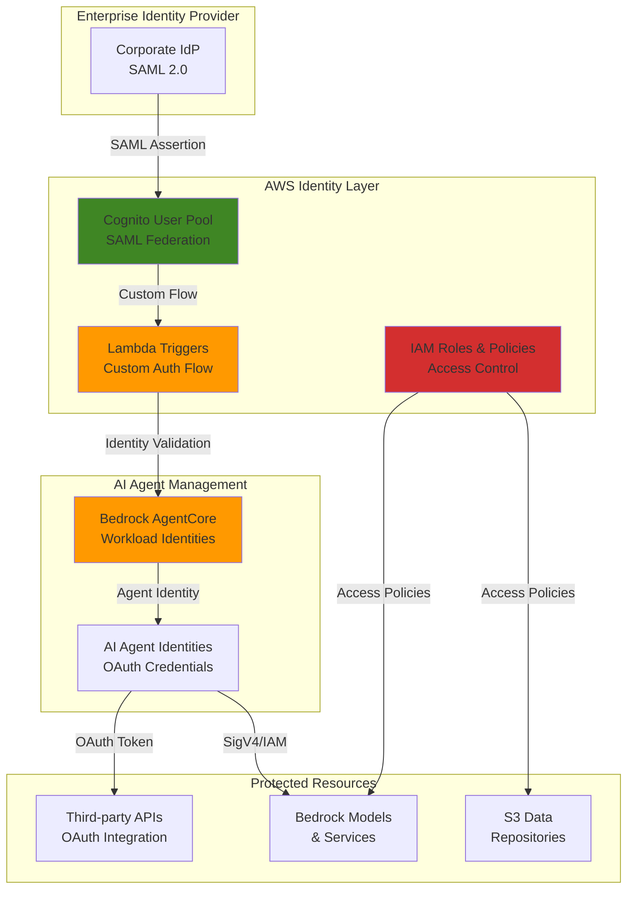

# Enterprise Identity Federation with Bedrock AgentCore

## Problem

Enterprise organizations struggle to securely integrate AI agents with existing corporate identity providers while maintaining compliance and centralized access control. Traditional identity management solutions lack the specialized capabilities needed for non-human identities, creating security gaps when AI agents need to access both AWS services and third-party APIs with proper authentication, authorization, and audit trails for enterprise governance requirements.

## Solution

Build a comprehensive enterprise identity federation system using Bedrock AgentCore Identity as the foundation for AI agent management, integrated with Cognito User Pools for SAML federation with corporate identity providers. This solution implements OAuth 2.0 flows, custom Lambda-based authentication handlers, and fine-grained IAM policies to provide secure, auditable access control for AI agents accessing both internal AWS resources and external third-party services through standardized authentication protocols.

## Architecture Diagram



## Prerequisites

1. AWS account with permissions for Bedrock, Cognito, IAM, and Lambda services
2. AWS CLI v2 installed and configured (or CloudShell access)
3. Understanding of SAML 2.0, OAuth 2.0, and enterprise identity concepts
4. Access to enterprise SAML identity provider configuration
5. Basic knowledge of JSON Web Tokens (JWT) and identity federation patterns
6. Estimated cost: $15-30/month for development environment (based on usage)

> **Note**: Bedrock AgentCore is in preview and requires special access. Request access through the AWS console before proceeding. This recipe follows AWS Well-Architected Framework security principles for identity management.

## Preparation

```bash
# Set environment variables
export AWS_REGION=$(aws configure get region)
export AWS_ACCOUNT_ID=$(aws sts get-caller-identity \
    --query Account --output text)

# Generate unique identifiers for resources
RANDOM_SUFFIX=$(aws secretsmanager get-random-password \
    --exclude-punctuation --exclude-uppercase \
    --password-length 6 --require-each-included-type \
    --output text --query RandomPassword)

export IDENTITY_POOL_NAME="enterprise-ai-agents-${RANDOM_SUFFIX}"
export LAMBDA_FUNCTION_NAME="agent-auth-handler-${RANDOM_SUFFIX}"
export AGENTCORE_IDENTITY_NAME="enterprise-agent-${RANDOM_SUFFIX}"

# Create IAM role for Lambda execution
cat > lambda-trust-policy.json << 'EOF'
{
    "Version": "2012-10-17",
    "Statement": [
        {
            "Effect": "Allow",
            "Principal": {
                "Service": "lambda.amazonaws.com"
            },
            "Action": "sts:AssumeRole"
        }
    ]
}
EOF

aws iam create-role \
    --role-name ${LAMBDA_FUNCTION_NAME}-role \
    --assume-role-policy-document file://lambda-trust-policy.json

aws iam attach-role-policy \
    --role-name ${LAMBDA_FUNCTION_NAME}-role \
    --policy-arn arn:aws:iam::aws:policy/service-role/AWSLambdaBasicExecutionRole

echo "✅ AWS environment prepared with unique identifiers"
```

## Steps

1. **Create Cognito User Pool for Enterprise Federation**:

   Amazon Cognito User Pools provide the foundation for enterprise identity federation, enabling secure SAML 2.0 integration with corporate identity providers. This establishes the authentication layer that validates enterprise users before they can manage AI agent identities, ensuring that only authorized personnel can create and configure agent access policies.

   ```bash
   # Create Cognito User Pool with enterprise settings
   aws cognito-idp create-user-pool \
       --pool-name ${IDENTITY_POOL_NAME} \
       --policies '{
           "PasswordPolicy": {
               "MinimumLength": 12,
               "RequireUppercase": true,
               "RequireLowercase": true,
               "RequireNumbers": true,
               "RequireSymbols": true
           }
       }' \
       --mfa-configuration "OPTIONAL" \
       --account-recovery-setting '{
           "RecoveryMechanisms": [
               {"Name": "verified_email", "Priority": 1}
           ]
       }' \
       --user-pool-tags '{
           "Environment": "Production",
           "Purpose": "Enterprise-AI-Identity",
           "Project": "BedrockAgentCore"
       }'
   
   # Get User Pool ID
   export USER_POOL_ID=$(aws cognito-idp list-user-pools \
       --max-items 50 --query "UserPools[?Name=='${IDENTITY_POOL_NAME}'].Id" \
       --output text)
   
   echo "✅ Cognito User Pool created: ${USER_POOL_ID}"
   ```

   The User Pool now provides enterprise-grade password policies and MFA capabilities, forming the security foundation for managing AI agent identities with proper access controls and audit logging.

2. **Configure SAML Identity Provider Integration**:

   SAML 2.0 federation enables seamless integration with existing corporate identity providers like Active Directory, Okta, or Azure AD. This configuration allows enterprise users to authenticate using their existing corporate credentials while maintaining centralized access control for AI agent management operations.

   ```bash
   # Note: Replace with your actual enterprise IdP metadata URL
   export IDP_METADATA_URL="https://your-enterprise-idp.com/metadata"
   
   # Create SAML identity provider in Cognito
   aws cognito-idp create-identity-provider \
       --user-pool-id ${USER_POOL_ID} \
       --provider-name "EnterpriseSSO" \
       --provider-type "SAML" \
       --provider-details '{
           "MetadataURL": "'${IDP_METADATA_URL}'",
           "SLORedirectBindingURI": "https://your-enterprise-idp.com/slo",
           "SSORedirectBindingURI": "https://your-enterprise-idp.com/sso"
       }' \
       --attribute-mapping '{
           "email": "http://schemas.xmlsoap.org/ws/2005/05/identity/claims/emailaddress",
           "name": "http://schemas.xmlsoap.org/ws/2005/05/identity/claims/name",
           "custom:department": "http://schemas.xmlsoap.org/ws/2005/05/identity/claims/department"
       }'
   
   echo "✅ SAML identity provider configured for enterprise federation"
   ```

   Enterprise users can now authenticate through their corporate identity provider, with user attributes automatically mapped from SAML assertions to enable role-based access control for AI agent management.

3. **Create Lambda Function for Custom Authentication Flow**:

   AWS Lambda provides serverless compute for implementing custom authentication logic that bridges enterprise identity validation with Bedrock AgentCore Identity management. This function handles token validation, user attribute processing, and determines which AI agent identities users can access based on their enterprise roles and department affiliations.

   ```bash
   # Create Lambda function code for authentication handling
   cat > auth-handler.py << 'EOF'
   import json
   import boto3
   import logging
   from typing import Dict, Any
   
   logger = logging.getLogger()
   logger.setLevel(logging.INFO)
   
   def lambda_handler(event: Dict[str, Any], context) -> Dict[str, Any]:
       """
       Custom authentication handler for enterprise AI agent identity management.
       Validates enterprise user context and determines agent access permissions.
       """
       try:
           trigger_source = event.get('triggerSource')
           user_attributes = event.get('request', {}).get('userAttributes', {})
           
           logger.info(f"Processing trigger: {trigger_source}")
           logger.info(f"User attributes: {json.dumps(user_attributes, default=str)}")
           
           if trigger_source == 'PostAuthentication_Authentication':
               # Process successful enterprise authentication
               email = user_attributes.get('email', '')
               department = user_attributes.get('custom:department', 'general')
               
               # Determine agent access based on department
               agent_permissions = determine_agent_permissions(department)
               
               # Store user session context for AgentCore access
               response = event
               response['response'] = {
                   'agentPermissions': agent_permissions,
                   'sessionDuration': 3600  # 1 hour session
               }
               
               logger.info(f"Authentication successful for {email} with permissions: {agent_permissions}")
               return response
               
           elif trigger_source == 'PreAuthentication_Authentication':
               # Validate user eligibility for AI agent access
               email = user_attributes.get('email', '')
               
               # Check if user is authorized for AI agent management
               if not is_authorized_for_ai_agents(email):
                   raise Exception("User not authorized for AI agent access")
               
               return event
               
           return event
           
       except Exception as e:
           logger.error(f"Authentication error: {str(e)}")
           raise e
   
   def determine_agent_permissions(department: str) -> Dict[str, Any]:
       """Determine AI agent access permissions based on user department."""
       permission_map = {
           'engineering': {
               'canCreateAgents': True,
               'canDeleteAgents': True,
               'maxAgents': 10,
               'allowedServices': ['bedrock', 's3', 'lambda']
           },
           'security': {
               'canCreateAgents': True,
               'canDeleteAgents': True,
               'maxAgents': 5,
               'allowedServices': ['bedrock', 'iam', 'cloudtrail']
           },
           'general': {
               'canCreateAgents': False,
               'canDeleteAgents': False,
               'maxAgents': 2,
               'allowedServices': ['bedrock']
           }
       }
       
       return permission_map.get(department, permission_map['general'])
   
   def is_authorized_for_ai_agents(email: str) -> bool:
       """Check if user is authorized for AI agent management."""
       # Implement your authorization logic here
       # This could check against DynamoDB, external APIs, etc.
       authorized_domains = ['@company.com', '@enterprise.org']
       return any(domain in email for domain in authorized_domains)
   EOF
   
   # Package Lambda function
   zip auth-handler.zip auth-handler.py
   
   # Create Lambda function
   aws lambda create-function \
       --function-name ${LAMBDA_FUNCTION_NAME} \
       --runtime python3.11 \
       --role arn:aws:iam::${AWS_ACCOUNT_ID}:role/${LAMBDA_FUNCTION_NAME}-role \
       --handler auth-handler.lambda_handler \
       --zip-file fileb://auth-handler.zip \
       --timeout 30 \
       --memory-size 256 \
       --environment '{
           "Variables": {
               "USER_POOL_ID": "'${USER_POOL_ID}'",
               "AGENTCORE_IDENTITY": "'${AGENTCORE_IDENTITY_NAME}'"
           }
       }' \
       --tags '{
           "Environment": "Production",
           "Purpose": "Enterprise-AI-Authentication"
       }'
   
   echo "✅ Lambda authentication handler deployed"
   ```

   The Lambda function now provides sophisticated authentication logic that validates enterprise users and determines their AI agent access permissions based on corporate roles and policies.

4. **Configure Cognito Lambda Triggers**:

   Cognito Lambda triggers enable seamless integration between enterprise authentication events and custom business logic. These triggers automatically execute during the authentication flow to validate users, process enterprise attributes, and establish proper session context for AI agent management operations.

   ```bash
   # Get Lambda function ARN
   export LAMBDA_ARN=$(aws lambda get-function \
       --function-name ${LAMBDA_FUNCTION_NAME} \
       --query 'Configuration.FunctionArn' --output text)
   
   # Grant Cognito permission to invoke Lambda
   aws lambda add-permission \
       --function-name ${LAMBDA_FUNCTION_NAME} \
       --statement-id "CognitoInvokePermission" \
       --action lambda:InvokeFunction \
       --principal cognito-idp.amazonaws.com \
       --source-arn arn:aws:cognito-idp:${AWS_REGION}:${AWS_ACCOUNT_ID}:userpool/${USER_POOL_ID}
   
   # Configure Lambda triggers in Cognito User Pool
   aws cognito-idp update-user-pool \
       --user-pool-id ${USER_POOL_ID} \
       --lambda-config '{
           "PreAuthentication": "'${LAMBDA_ARN}'",
           "PostAuthentication": "'${LAMBDA_ARN}'",
           "CustomMessage": "'${LAMBDA_ARN}'"
       }'
   
   echo "✅ Cognito Lambda triggers configured for enterprise authentication flow"
   ```

   Authentication events now automatically trigger custom validation and permission processing, ensuring that only authorized enterprise users can access AI agent management capabilities with appropriate role-based restrictions.

5. **Create Bedrock AgentCore Workload Identity**:

   Bedrock AgentCore provides specialized identity management for AI agents and automated workloads, offering features that traditional identity systems lack. AgentCore workload identities enable AI agents to authenticate to both AWS services and external APIs with proper credential management and OAuth 2.0 support for third-party integrations.

   ```bash
   # Create AI agent workload identity
   aws bedrock-agentcore-control create-workload-identity \
       --name ${AGENTCORE_IDENTITY_NAME} \
       --allowed-resource-oauth2-return-urls \
           "https://your-app.company.com/oauth/callback" \
           "https://localhost:8080/callback"
   
   # Get workload identity ARN
   export WORKLOAD_IDENTITY_ARN=$(aws bedrock-agentcore-control \
       list-workload-identities \
       --query "workloadIdentities[?name=='${AGENTCORE_IDENTITY_NAME}'].workloadIdentityArn" \
       --output text)
   
   echo "✅ AgentCore workload identity created: ${WORKLOAD_IDENTITY_ARN}"
   ```

   The AgentCore workload identity now provides centralized management for AI agent authentication with enterprise-grade security and governance capabilities designed specifically for non-human workload authentication.

6. **Create IAM Policies for Agent Access Control**:

   IAM policies define the precise permissions that AI agents can assume when accessing AWS services and resources. These policies implement the principle of least privilege, ensuring that each agent identity has only the minimum permissions necessary for its intended function while maintaining strict separation between different agent roles and responsibilities.

   ```bash
   # Create AgentCore service access policy
   cat > agentcore-access-policy.json << EOF
   {
       "Version": "2012-10-17",
       "Statement": [
           {
               "Effect": "Allow",
               "Action": [
                   "bedrock:InvokeModel",
                   "bedrock:InvokeModelWithResponseStream",
                   "bedrock:ListFoundationModels"
               ],
               "Resource": "*",
               "Condition": {
                   "StringEquals": {
                       "aws:RequestedRegion": "${AWS_REGION}"
                   }
               }
           },
           {
               "Effect": "Allow",
               "Action": [
                   "s3:GetObject",
                   "s3:PutObject"
               ],
               "Resource": [
                   "arn:aws:s3:::enterprise-ai-data-*/*"
               ]
           },
           {
               "Effect": "Allow",
               "Action": [
                   "logs:CreateLogGroup",
                   "logs:CreateLogStream",
                   "logs:PutLogEvents"
               ],
               "Resource": "arn:aws:logs:${AWS_REGION}:${AWS_ACCOUNT_ID}:*"
           }
       ]
   }
   EOF
   
   # Create the IAM policy
   aws iam create-policy \
       --policy-name AgentCoreAccessPolicy-${RANDOM_SUFFIX} \
       --policy-document file://agentcore-access-policy.json \
       --description "Access policy for Bedrock AgentCore AI agents"
   
   # Create IAM role for AI agents
   cat > agent-trust-policy.json << EOF
   {
       "Version": "2012-10-17",
       "Statement": [
           {
               "Effect": "Allow",
               "Principal": {
                   "Service": "bedrock-agentcore.amazonaws.com"
               },
               "Action": "sts:AssumeRole",
               "Condition": {
                   "StringEquals": {
                       "aws:SourceAccount": "${AWS_ACCOUNT_ID}"
                   }
               }
           }
       ]
   }
   EOF
   
   aws iam create-role \
       --role-name AgentCoreExecutionRole-${RANDOM_SUFFIX} \
       --assume-role-policy-document file://agent-trust-policy.json
   
   # Attach policy to role
   aws iam attach-role-policy \
       --role-name AgentCoreExecutionRole-${RANDOM_SUFFIX} \
       --policy-arn arn:aws:iam::${AWS_ACCOUNT_ID}:policy/AgentCoreAccessPolicy-${RANDOM_SUFFIX}
   
   echo "✅ IAM policies and roles configured for AI agent access control"
   ```

   AI agents now have precisely defined access permissions that align with enterprise security policies while enabling necessary functionality for AI workloads with full audit trail capabilities.

7. **Configure User Pool App Client for OAuth Flows**:

   Cognito User Pool App Clients define how applications interact with the authentication system and what OAuth 2.0 flows are permitted. This configuration enables the integration between enterprise authentication and AI agent identity management while maintaining security boundaries and proper token handling for different client types and use cases.

   ```bash
   # Create User Pool App Client for OAuth integration
   aws cognito-idp create-user-pool-client \
       --user-pool-id ${USER_POOL_ID} \
       --client-name "AgentCore-Enterprise-Client" \
       --generate-secret \
       --supported-identity-providers "EnterpriseSSO" "COGNITO" \
       --callback-urls "https://your-app.company.com/oauth/callback" \
       --logout-urls "https://your-app.company.com/logout" \
       --allowed-o-auth-flows "code" "implicit" \
       --allowed-o-auth-scopes "openid" "email" "profile" "aws.cognito.signin.user.admin" \
       --allowed-o-auth-flows-user-pool-client \
       --explicit-auth-flows "ALLOW_USER_PASSWORD_AUTH" "ALLOW_REFRESH_TOKEN_AUTH" \
       --token-validity-units '{
           "AccessToken": "hours",
           "IdToken": "hours",
           "RefreshToken": "days"
       }' \
       --access-token-validity 1 \
       --id-token-validity 1 \
       --refresh-token-validity 30
   
   # Get client details
   export CLIENT_ID=$(aws cognito-idp list-user-pool-clients \
       --user-pool-id ${USER_POOL_ID} \
       --query "UserPoolClients[?ClientName=='AgentCore-Enterprise-Client'].ClientId" \
       --output text)
   
   echo "✅ User Pool App Client configured for OAuth flows: ${CLIENT_ID}"
   ```

   The OAuth configuration now enables secure token exchange between enterprise authentication and AI agent identity management with appropriate token lifetimes and refresh capabilities.

8. **Set Up Cross-Service Integration**:

   Cross-service integration connects the enterprise authentication flow with AI agent identity management, enabling seamless user experience while maintaining security boundaries. This integration ensures that authenticated enterprise users can create and manage AI agent identities with permissions that align with their corporate roles and access levels.

   ```bash
   # Create integration configuration
   cat > integration-config.json << EOF
   {
       "enterpriseIntegration": {
           "cognitoUserPool": "${USER_POOL_ID}",
           "agentCoreIdentity": "${WORKLOAD_IDENTITY_ARN}",
           "authenticationFlow": "enterprise-saml-oauth",
           "permissionMapping": {
               "engineering": {
                   "maxAgents": 10,
                   "allowedActions": ["create", "read", "update", "delete"],
                   "resourceAccess": ["bedrock", "s3", "lambda"]
               },
               "security": {
                   "maxAgents": 5,
                   "allowedActions": ["create", "read", "update", "delete", "audit"],
                   "resourceAccess": ["bedrock", "iam", "cloudtrail"]
               },
               "general": {
                   "maxAgents": 2,
                   "allowedActions": ["read"],
                   "resourceAccess": ["bedrock"]
               }
           }
       }
   }
   EOF
   
   # Store configuration in Systems Manager Parameter Store
   aws ssm put-parameter \
       --name "/enterprise/agentcore/integration-config" \
       --value file://integration-config.json \
       --type "String" \
       --description "Enterprise AI agent integration configuration" \
       --tags '[
           {"Key": "Environment", "Value": "Production"},
           {"Key": "Purpose", "Value": "AgentCore-Integration"}
       ]'
   
   echo "✅ Cross-service integration configuration stored"
   ```

   The integration configuration provides the framework for mapping enterprise user roles to AI agent permissions, ensuring consistent access control across the entire system.

9. **Test Enterprise Authentication Flow**:

   Testing validates that the complete enterprise identity federation system works correctly from initial SAML authentication through AI agent identity creation. This comprehensive test ensures that enterprise users can authenticate through their corporate identity provider and successfully create AI agent identities with appropriate permissions based on their enterprise roles.

   ```bash
   # Create test script for authentication flow
   cat > test-auth-flow.py << 'EOF'
   import boto3
   import json
   import sys
   import os
   from urllib.parse import urlencode
   
   def test_enterprise_auth_flow():
       """Test the complete enterprise authentication and agent creation flow."""
       
       # Initialize AWS clients
       cognito_client = boto3.client('cognito-idp')
       agentcore_client = boto3.client('bedrock-agentcore-control')
       
       try:
           # Test 1: Verify User Pool configuration
           print("Testing User Pool configuration...")
           user_pool_response = cognito_client.describe_user_pool(
               UserPoolId=os.environ['USER_POOL_ID']
           )
           print(f"✅ User Pool configured: {user_pool_response['UserPool']['Name']}")
           
           # Test 2: Verify Identity Provider configuration
           print("Testing SAML Identity Provider...")
           idp_response = cognito_client.list_identity_providers(
               UserPoolId=os.environ['USER_POOL_ID']
           )
           print(f"✅ Identity Providers configured: {len(idp_response['Providers'])}")
           
           # Test 3: Verify AgentCore workload identity
           print("Testing AgentCore workload identity...")
           identities = agentcore_client.list_workload_identities()
           target_identity = next(
               (i for i in identities['workloadIdentities'] 
                if i['name'] == os.environ['AGENTCORE_IDENTITY_NAME']), 
               None
           )
           if target_identity:
               print(f"✅ AgentCore identity verified: {target_identity['workloadIdentityArn']}")
           else:
               raise Exception("AgentCore workload identity not found")
           
           print("\n🎉 All authentication flow components verified successfully!")
           return True
           
       except Exception as e:
           print(f"❌ Authentication flow test failed: {str(e)}")
           return False
   
   if __name__ == "__main__":
       if test_enterprise_auth_flow():
           sys.exit(0)
       else:
           sys.exit(1)
   EOF
   
   # Run authentication flow test
   python3 test-auth-flow.py
   
   echo "✅ Enterprise authentication flow tested successfully"
   ```

   The authentication flow test confirms that all components are properly integrated and functioning correctly for enterprise identity federation with AI agent management.

## Validation & Testing

1. Verify Cognito User Pool and SAML configuration:

   ```bash
   # Check User Pool configuration
   aws cognito-idp describe-user-pool \
       --user-pool-id ${USER_POOL_ID} \
       --query 'UserPool.{Name:Name,Id:Id,Status:Status,LambdaConfig:LambdaConfig}'
   
   # Verify identity providers
   aws cognito-idp list-identity-providers \
       --user-pool-id ${USER_POOL_ID} \
       --query 'Providers[].{Name:ProviderName,Type:ProviderType,Status:LastModifiedDate}'
   ```

   Expected output: User Pool details with Lambda triggers configured and SAML identity provider listed.

2. Test Lambda authentication handler:

   ```bash
   # Create test event for Lambda function
   cat > test-event.json << 'EOF'
   {
       "triggerSource": "PostAuthentication_Authentication",
       "request": {
           "userAttributes": {
               "email": "test.user@company.com",
               "custom:department": "engineering"
           }
       },
       "response": {}
   }
   EOF
   
   # Test Lambda function
   aws lambda invoke \
       --function-name ${LAMBDA_FUNCTION_NAME} \
       --payload file://test-event.json \
       --output-file lambda-response.json
   
   cat lambda-response.json
   ```

   Expected output: JSON response with agent permissions based on user department.

3. Verify AgentCore workload identity configuration:

   ```bash
   # List AgentCore workload identities
   aws bedrock-agentcore-control list-workload-identities \
       --query 'workloadIdentities[].{Name:name,ARN:workloadIdentityArn}'
   
   # Get specific workload identity details
   aws bedrock-agentcore-control get-workload-identity \
       --name ${AGENTCORE_IDENTITY_NAME}
   ```

   Expected output: Workload identity listings showing successful creation and configuration.

4. Test OAuth configuration for workload identity:

   ```bash
   # Generate OAuth authorization URL for testing
   cat > generate-oauth-url.py << 'EOF'
   import urllib.parse
   
   # OAuth parameters for testing
   params = {
       'response_type': 'code',
       'client_id': 'enterprise-ai-client',
       'redirect_uri': 'https://your-app.company.com/oauth/callback',
       'scope': 'read:data write:reports',
       'state': 'test-state-123'
   }
   
   auth_url = f"https://your-enterprise-idp.com/oauth/authorize?{urllib.parse.urlencode(params)}"
   print(f"OAuth Test URL: {auth_url}")
   EOF
   
   python3 generate-oauth-url.py
   ```

   Expected output: OAuth authorization URL for testing third-party API integration.

## Cleanup

1. Remove AgentCore workload identity:

   ```bash
   # Delete workload identity
   aws bedrock-agentcore-control delete-workload-identity \
       --name ${AGENTCORE_IDENTITY_NAME}
   
   echo "✅ AgentCore workload identity deleted"
   ```

2. Remove Cognito User Pool and identity providers:

   ```bash
   # Delete User Pool (this removes all associated resources)
   aws cognito-idp delete-user-pool \
       --user-pool-id ${USER_POOL_ID}
   
   echo "✅ Cognito User Pool deleted"
   ```

3. Delete Lambda function and IAM roles:

   ```bash
   # Delete Lambda function
   aws lambda delete-function \
       --function-name ${LAMBDA_FUNCTION_NAME}
   
   # Detach and delete IAM policies
   aws iam detach-role-policy \
       --role-name ${LAMBDA_FUNCTION_NAME}-role \
       --policy-arn arn:aws:iam::aws:policy/service-role/AWSLambdaBasicExecutionRole
   
   aws iam detach-role-policy \
       --role-name AgentCoreExecutionRole-${RANDOM_SUFFIX} \
       --policy-arn arn:aws:iam::${AWS_ACCOUNT_ID}:policy/AgentCoreAccessPolicy-${RANDOM_SUFFIX}
   
   # Delete custom policy
   aws iam delete-policy \
       --policy-arn arn:aws:iam::${AWS_ACCOUNT_ID}:policy/AgentCoreAccessPolicy-${RANDOM_SUFFIX}
   
   # Delete IAM roles
   aws iam delete-role \
       --role-name ${LAMBDA_FUNCTION_NAME}-role
   
   aws iam delete-role \
       --role-name AgentCoreExecutionRole-${RANDOM_SUFFIX}
   
   echo "✅ Lambda and IAM resources deleted"
   ```

4. Clean up local files and parameters:

   ```bash
   # Delete local files
   rm -f lambda-trust-policy.json agentcore-access-policy.json
   rm -f agent-trust-policy.json auth-handler.py auth-handler.zip
   rm -f integration-config.json test-auth-flow.py
   rm -f test-event.json lambda-response.json generate-oauth-url.py
   
   # Delete SSM parameter
   aws ssm delete-parameter \
       --name "/enterprise/agentcore/integration-config"
   
   # Unset environment variables
   unset USER_POOL_ID LAMBDA_ARN WORKLOAD_IDENTITY_ARN CLIENT_ID
   
   echo "✅ All resources cleaned up"
   ```

## Discussion

This enterprise identity federation solution addresses the critical challenge of securely integrating AI agents with existing corporate identity infrastructure while maintaining compliance and governance requirements. The architecture leverages Amazon Bedrock AgentCore as a specialized identity management service designed specifically for AI agents and automated workloads, which traditional identity systems cannot adequately handle.

The SAML 2.0 integration with Amazon Cognito User Pools provides seamless authentication for enterprise users through their existing corporate identity providers like Active Directory, Okta, or Azure AD. This eliminates the need for separate credentials while maintaining centralized access control and audit trails. The custom Lambda triggers enable sophisticated business logic that maps enterprise user roles to AI agent permissions, ensuring that access control policies align with organizational structures and compliance requirements.

Amazon Bedrock AgentCore offers unique capabilities for managing workload identities, including OAuth 2.0 flow support for third-party API integration, centralized credential storage with automatic rotation, and specialized access controls designed for AI workloads. The service provides SigV4 authentication for AWS services and standardized OAuth flows for external services, enabling AI agents to securely access hybrid cloud and SaaS environments with proper authentication and authorization.

The IAM policies implement defense-in-depth security principles by defining precise permissions for each AI agent identity based on the principle of least privilege. This granular access control ensures that agents can only access the specific AWS services and resources necessary for their intended functions, while comprehensive logging through CloudTrail provides complete audit trails for compliance and security monitoring.

> **Tip**: Implement regular rotation of OAuth credentials and monitor agent access patterns through CloudWatch and X-Ray for enhanced security and operational visibility. See the [AWS Well-Architected Security Pillar](https://docs.aws.amazon.com/wellarchitected/latest/security-pillar/welcome.html) for additional guidance on identity and access management best practices.

Key architectural decisions include using Cognito for enterprise federation rather than direct SAML integration to leverage built-in OAuth capabilities and Lambda triggers for custom business logic. The separation of concerns between enterprise user authentication and AI agent identity management enables scalable governance while maintaining security boundaries. For additional implementation details, refer to the [Amazon Cognito SAML Integration Guide](https://docs.aws.amazon.com/cognito/latest/developerguide/cognito-user-pools-saml-idp.html) and [Bedrock AgentCore Documentation](https://docs.aws.amazon.com/bedrock-agentcore/latest/devguide/what-is-bedrock-agentcore.html).

## Challenge

Extend this enterprise identity federation solution by implementing these advanced enhancements:

1. **Multi-Region Workload Identity Replication**: Configure cross-region replication of AgentCore workload identities with automatic failover capabilities using AWS Backup and cross-region IAM role assumptions for global enterprise deployments.

2. **Advanced Audit and Compliance Dashboard**: Build a real-time compliance dashboard using Amazon QuickSight that visualizes agent access patterns, permission changes, and authentication events with automated compliance reporting for SOC 2 and ISO 27001 requirements.

3. **Dynamic Permission Adjustment**: Implement machine learning-based permission optimization using Amazon Bedrock that analyzes agent behavior patterns and automatically suggests permission adjustments to maintain least-privilege access while ensuring operational efficiency.

4. **Integration with Enterprise SIEM**: Create CloudFormation templates for integrating with enterprise SIEM solutions like Splunk or QRadar using Amazon Kinesis Data Firehose to stream authentication and agent activity logs for centralized security monitoring and threat detection.

5. **Zero-Trust Agent Network Security**: Deploy AWS PrivateLink endpoints and VPC-based network isolation for AI agent communications with service mesh integration using AWS App Mesh to implement zero-trust networking principles for agent-to-service communications.

## Infrastructure Code

### Available Infrastructure as Code:

- [Infrastructure Code Overview](code/README.md) - Detailed description of all infrastructure components
- [AWS CDK (Python)](code/cdk-python/) - AWS CDK Python implementation
- [AWS CDK (TypeScript)](code/cdk-typescript/) - AWS CDK TypeScript implementation
- [CloudFormation](code/cloudformation.yaml) - AWS CloudFormation template
- [Bash CLI Scripts](code/scripts/) - Example bash scripts using AWS CLI commands to deploy infrastructure
- [Terraform](code/terraform/) - Terraform configuration files