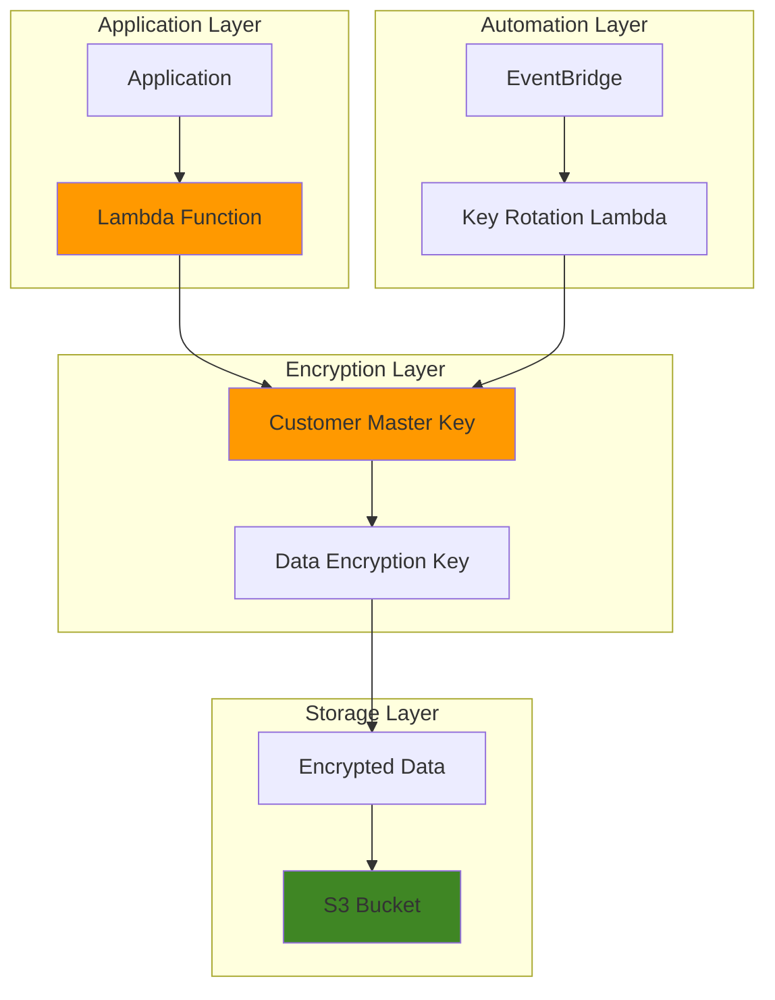

# Enterprise KMS Envelope Encryption

## Problem

Enterprise organizations handling sensitive data face stringent encryption requirements that must balance security with operational efficiency. Traditional single-key encryption approaches create performance bottlenecks when encrypting large datasets and pose significant risks if keys are compromised. Manual key rotation processes introduce human error and compliance gaps that can expose organizations to data breaches and regulatory violations.

## Solution

AWS KMS envelope encryption provides a two-tier encryption architecture that combines the security of customer master keys (CMKs) with the performance benefits of data encryption keys (DEKs). This solution implements automated key rotation using Lambda functions and EventBridge, ensuring continuous compliance while maintaining high-performance encryption operations for large-scale data processing workloads.

## Architecture Diagram



## Prerequisites

1. AWS account with IAM permissions for KMS, S3, Lambda, and EventBridge
2. AWS CLI v2 installed and configured (or AWS CloudShell access)
3. Basic understanding of encryption concepts and AWS KMS service
4. Familiarity with Lambda function development and IAM role management
5. Estimated cost: $15-25/month for KMS operations, Lambda executions, and S3 storage

> **Note**: KMS charges $1/month per CMK and $0.03 per 10,000 API requests. Lambda and S3 costs depend on usage patterns.

## Preparation

```bash
# Set environment variables for consistent resource naming
export AWS_REGION=$(aws configure get region)
export AWS_ACCOUNT_ID=$(aws sts get-caller-identity \
    --query Account --output text)

# Generate unique identifiers for resources
RANDOM_SUFFIX=$(aws secretsmanager get-random-password \
    --exclude-punctuation --exclude-uppercase \
    --password-length 6 --require-each-included-type \
    --output text --query RandomPassword)

export KMS_KEY_ALIAS="enterprise-encryption-${RANDOM_SUFFIX}"
export S3_BUCKET_NAME="enterprise-encrypted-data-${RANDOM_SUFFIX}"
export LAMBDA_FUNCTION_NAME="kms-key-rotator-${RANDOM_SUFFIX}"

echo "✅ Environment variables configured"
echo "KMS Key Alias: $KMS_KEY_ALIAS"
echo "S3 Bucket: $S3_BUCKET_NAME"
echo "Lambda Function: $LAMBDA_FUNCTION_NAME"
```

## Steps

1. **Create Enterprise Customer Master Key with Rotation Enabled**:

   AWS KMS Customer Master Keys serve as the root of trust for enterprise encryption operations. Enabling automatic key rotation provides cryptographic best practices by generating new key material annually while maintaining transparent access to existing encrypted data. This foundational security control ensures long-term data protection without operational disruption and follows AWS security best practices outlined in the [AWS KMS Developer Guide](https://docs.aws.amazon.com/kms/latest/developerguide/concepts.html).

   ```bash
   # Create CMK with automatic rotation enabled
   CMK_ID=$(aws kms create-key \
       --description "Enterprise envelope encryption master key" \
       --key-usage ENCRYPT_DECRYPT \
       --key-spec SYMMETRIC_DEFAULT \
       --enable-key-rotation \
       --query KeyMetadata.KeyId --output text)
   
   # Create human-readable alias for the key
   aws kms create-alias \
       --alias-name "alias/${KMS_KEY_ALIAS}" \
       --target-key-id $CMK_ID
   
   echo "✅ CMK created with ID: $CMK_ID"
   echo "✅ Key alias configured: alias/${KMS_KEY_ALIAS}"
   ```

   The CMK is now established as your enterprise encryption foundation with automatic annual rotation. This security architecture ensures that even if key material is compromised, the exposure window is limited to a maximum of one year, following AWS [key rotation best practices](https://docs.aws.amazon.com/kms/latest/developerguide/rotate-keys.html).

2. **Create S3 Bucket with KMS Encryption Configuration**:

   S3 server-side encryption with KMS integration provides transparent encryption for data at rest while maintaining full compatibility with existing applications. Configuring bucket-level encryption ensures all objects are automatically encrypted using your enterprise CMK, creating a seamless security layer that follows AWS best practices for [S3 default encryption](https://docs.aws.amazon.com/AmazonS3/latest/userguide/default-bucket-encryption.html).

   ```bash
   # Create S3 bucket with versioning for data protection
   aws s3 mb s3://${S3_BUCKET_NAME} --region ${AWS_REGION}
   
   aws s3api put-bucket-versioning \
       --bucket ${S3_BUCKET_NAME} \
       --versioning-configuration Status=Enabled
   
   # Configure bucket encryption with enterprise CMK
   aws s3api put-bucket-encryption \
       --bucket ${S3_BUCKET_NAME} \
       --server-side-encryption-configuration '{
           "Rules": [{
               "ApplyServerSideEncryptionByDefault": {
                   "SSEAlgorithm": "aws:kms",
                   "KMSMasterKeyID": "alias/'${KMS_KEY_ALIAS}'"
               },
               "BucketKeyEnabled": true
           }]
       }'
   
   echo "✅ S3 bucket created with KMS encryption: ${S3_BUCKET_NAME}"
   ```

   The bucket now automatically encrypts all objects using your enterprise CMK. Bucket Key optimization reduces KMS API calls by up to 99% for high object creation rates, significantly reducing costs while maintaining the same security posture.

3. **Create IAM Role for Lambda Key Management Function**:

   The Lambda execution role requires precise permissions to manage KMS keys, monitor rotation status, and log operational activities. Following the principle of least privilege ensures the function can perform necessary operations without excessive access to AWS resources, aligning with [AWS Lambda security best practices](https://docs.aws.amazon.com/lambda/latest/dg/lambda-intro-execution-role.html).

   ```bash
   # Create trust policy for Lambda service
   cat > lambda-trust-policy.json << 'EOF'
   {
       "Version": "2012-10-17",
       "Statement": [
           {
               "Effect": "Allow",
               "Principal": {
                   "Service": "lambda.amazonaws.com"
               },
               "Action": "sts:AssumeRole"
           }
       ]
   }
   EOF
   
   # Create IAM role for Lambda function
   aws iam create-role \
       --role-name ${LAMBDA_FUNCTION_NAME}-role \
       --assume-role-policy-document file://lambda-trust-policy.json
   
   # Attach basic Lambda execution permissions
   aws iam attach-role-policy \
       --role-name ${LAMBDA_FUNCTION_NAME}-role \
       --policy-arn arn:aws:iam::aws:policy/service-role/AWSLambdaBasicExecutionRole
   
   echo "✅ Lambda IAM role created"
   ```

4. **Create Custom IAM Policy for KMS Operations**:

   Granular KMS permissions enable the Lambda function to monitor key rotation status and trigger manual rotations when necessary. This custom policy ensures secure key management operations while preventing unauthorized access to encryption keys, following AWS IAM security best practices.

   ```bash
   # Create custom KMS policy for key management
   cat > kms-management-policy.json << EOF
   {
       "Version": "2012-10-17",
       "Statement": [
           {
               "Effect": "Allow",
               "Action": [
                   "kms:DescribeKey",
                   "kms:GetKeyRotationStatus",
                   "kms:EnableKeyRotation",
                   "kms:ListKeys",
                   "kms:ListAliases"
               ],
               "Resource": "*"
           },
           {
               "Effect": "Allow",
               "Action": [
                   "logs:CreateLogGroup",
                   "logs:CreateLogStream",
                   "logs:PutLogEvents"
               ],
               "Resource": "arn:aws:logs:${AWS_REGION}:${AWS_ACCOUNT_ID}:*"
           }
       ]
   }
   EOF
   
   # Create and attach the custom policy
   aws iam create-policy \
       --policy-name ${LAMBDA_FUNCTION_NAME}-kms-policy \
       --policy-document file://kms-management-policy.json
   
   aws iam attach-role-policy \
       --role-name ${LAMBDA_FUNCTION_NAME}-role \
       --policy-arn arn:aws:iam::${AWS_ACCOUNT_ID}:policy/${LAMBDA_FUNCTION_NAME}-kms-policy
   
   echo "✅ KMS management policy created and attached"
   ```

5. **Develop Lambda Function for Key Rotation Monitoring**:

   The Lambda function implements intelligent key rotation monitoring by checking rotation status and ensuring compliance with enterprise security policies. This automated approach eliminates manual oversight requirements while providing audit trails for compliance reporting and security operations.

   ```bash
   # Create Lambda function code for key rotation monitoring
   cat > key_rotation_monitor.py << 'EOF'
   import json
   import boto3
   import logging
   from datetime import datetime
   
   logger = logging.getLogger()
   logger.setLevel(logging.INFO)
   
   def lambda_handler(event, context):
       kms_client = boto3.client('kms')
       
       try:
           # List all customer-managed keys
           paginator = kms_client.get_paginator('list_keys')
           
           rotation_status = []
           
           for page in paginator.paginate():
               for key in page['Keys']:
                   key_id = key['KeyId']
                   
                   # Get key details
                   key_details = kms_client.describe_key(KeyId=key_id)
                   
                   # Skip AWS-managed keys
                   if key_details['KeyMetadata']['KeyManager'] == 'AWS':
                       continue
                   
                   # Check rotation status
                   rotation_enabled = kms_client.get_key_rotation_status(
                       KeyId=key_id
                   )['KeyRotationEnabled']
                   
                   key_info = {
                       'KeyId': key_id,
                       'KeyArn': key_details['KeyMetadata']['Arn'],
                       'RotationEnabled': rotation_enabled,
                       'KeyState': key_details['KeyMetadata']['KeyState'],
                       'CreationDate': key_details['KeyMetadata']['CreationDate'].isoformat()
                   }
                   
                   rotation_status.append(key_info)
                   
                   # Log key rotation status
                   logger.info(f"Key {key_id}: Rotation {'enabled' if rotation_enabled else 'disabled'}")
                   
                   # Enable rotation if disabled (optional automation)
                   if not rotation_enabled and key_details['KeyMetadata']['KeyState'] == 'Enabled':
                       logger.warning(f"Enabling rotation for key {key_id}")
                       kms_client.enable_key_rotation(KeyId=key_id)
           
           return {
               'statusCode': 200,
               'body': json.dumps({
                   'message': 'Key rotation monitoring completed',
                   'keysChecked': len(rotation_status),
                   'timestamp': datetime.now().isoformat()
               })
           }
           
       except Exception as e:
           logger.error(f"Error monitoring key rotation: {str(e)}")
           return {
               'statusCode': 500,
               'body': json.dumps({'error': str(e)})
           }
   EOF
   
   # Package Lambda function
   zip -r key-rotation-monitor.zip key_rotation_monitor.py
   
   echo "✅ Lambda function code created and packaged"
   ```

6. **Deploy Lambda Function with Monitoring Configuration**:

   Deploying the Lambda function establishes automated key rotation monitoring with appropriate timeout and memory configurations. CloudWatch integration provides comprehensive logging and monitoring capabilities for enterprise security operations, using the latest Python runtime for optimal performance and security.

   ```bash
   # Deploy Lambda function
   LAMBDA_ARN=$(aws lambda create-function \
       --function-name ${LAMBDA_FUNCTION_NAME} \
       --runtime python3.12 \
       --role arn:aws:iam::${AWS_ACCOUNT_ID}:role/${LAMBDA_FUNCTION_NAME}-role \
       --handler key_rotation_monitor.lambda_handler \
       --zip-file fileb://key-rotation-monitor.zip \
       --timeout 60 \
       --memory-size 128 \
       --query FunctionArn --output text)
   
   # Configure CloudWatch log retention
   aws logs create-log-group \
       --log-group-name /aws/lambda/${LAMBDA_FUNCTION_NAME} \
       --region ${AWS_REGION} 2>/dev/null || true
   
   aws logs put-retention-policy \
       --log-group-name /aws/lambda/${LAMBDA_FUNCTION_NAME} \
       --retention-in-days 30
   
   echo "✅ Lambda function deployed: ${LAMBDA_ARN}"
   ```

7. **Create EventBridge Rule for Automated Execution**:

   EventBridge (the evolution of CloudWatch Events) enables scheduled execution of key rotation monitoring, ensuring continuous compliance with enterprise security policies. The weekly schedule provides regular oversight while minimizing operational overhead and AWS costs, following modern AWS event-driven architecture patterns.

   ```bash
   # Create EventBridge rule for weekly execution
   aws events put-rule \
       --name ${LAMBDA_FUNCTION_NAME}-schedule \
       --schedule-expression "rate(7 days)" \
       --description "Weekly KMS key rotation monitoring" \
       --state ENABLED
   
   # Add Lambda function as target
   aws events put-targets \
       --rule ${LAMBDA_FUNCTION_NAME}-schedule \
       --targets "Id"="1","Arn"="${LAMBDA_ARN}"
   
   # Grant EventBridge permission to invoke Lambda
   aws lambda add-permission \
       --function-name ${LAMBDA_FUNCTION_NAME} \
       --statement-id allow-eventbridge \
       --action lambda:InvokeFunction \
       --principal events.amazonaws.com \
       --source-arn arn:aws:events:${AWS_REGION}:${AWS_ACCOUNT_ID}:rule/${LAMBDA_FUNCTION_NAME}-schedule
   
   echo "✅ EventBridge rule configured for weekly monitoring"
   ```

8. **Implement Envelope Encryption Demonstration**:

   Demonstrating envelope encryption showcases the performance and security benefits of the two-tier encryption architecture. This practical example illustrates how applications can leverage KMS for secure, high-performance encryption of large datasets while maintaining compliance with enterprise security requirements.

   ```bash
   # Create sample data for encryption demonstration
   echo "Sensitive enterprise data requiring encryption" > sample-data.txt
   echo "Additional confidential information" >> sample-data.txt
   echo "Financial records and customer data" >> sample-data.txt
   
   # Generate data encryption key (DEK) using CMK
   aws kms generate-data-key \
       --key-id alias/${KMS_KEY_ALIAS} \
       --key-spec AES_256 \
       --query 'Plaintext' --output text | base64 -d > data-key.bin
   
   # Store encrypted DEK (this would typically be stored with the encrypted data)
   aws kms generate-data-key \
       --key-id alias/${KMS_KEY_ALIAS} \
       --key-spec AES_256 \
       --query 'CiphertextBlob' --output text > encrypted-data-key.txt
   
   # Upload sample data with server-side encryption
   aws s3 cp sample-data.txt s3://${S3_BUCKET_NAME}/secure-data.txt \
       --server-side-encryption aws:kms \
       --ssekms-key-id alias/${KMS_KEY_ALIAS}
   
   echo "✅ Envelope encryption demonstration completed"
   echo "✅ Sample data encrypted and stored in S3"
   ```

> **Warning**: In production environments, never store plaintext data encryption keys on disk. Use secure memory handling and immediate key destruction after encryption operations.

## Validation & Testing

1. Verify CMK creation and rotation status:

   ```bash
   # Check key rotation status
   aws kms get-key-rotation-status \
       --key-id alias/${KMS_KEY_ALIAS}
   
   # Verify key details
   aws kms describe-key \
       --key-id alias/${KMS_KEY_ALIAS} \
       --query 'KeyMetadata.[KeyId,KeyState,KeyUsage]' \
       --output table
   ```

   Expected output: `KeyRotationEnabled` should be `true`, `KeyState` should be `Enabled`

2. Test Lambda function execution:

   ```bash
   # Invoke Lambda function manually
   aws lambda invoke \
       --function-name ${LAMBDA_FUNCTION_NAME} \
       --payload '{}' \
       response.json
   
   # Check function response
   cat response.json
   ```

   Expected output: JSON response with `statusCode: 200` and successful monitoring message

3. Verify S3 encryption configuration:

   ```bash
   # Check bucket encryption settings
   aws s3api get-bucket-encryption \
       --bucket ${S3_BUCKET_NAME}
   
   # Verify object encryption
   aws s3api head-object \
       --bucket ${S3_BUCKET_NAME} \
       --key secure-data.txt \
       --query '[ServerSideEncryption,SSEKMSKeyId]' \
       --output table
   ```

4. Test EventBridge rule:

   ```bash
   # Check Events rule status
   aws events describe-rule \
       --name ${LAMBDA_FUNCTION_NAME}-schedule \
       --query '[State,ScheduleExpression]' \
       --output table
   ```

## Cleanup

1. Remove EventBridge rule and targets:

   ```bash
   # Remove Lambda permission for EventBridge
   aws lambda remove-permission \
       --function-name ${LAMBDA_FUNCTION_NAME} \
       --statement-id allow-eventbridge
   
   # Remove targets and rule
   aws events remove-targets \
       --rule ${LAMBDA_FUNCTION_NAME}-schedule \
       --ids "1"
   
   aws events delete-rule \
       --name ${LAMBDA_FUNCTION_NAME}-schedule
   
   echo "✅ EventBridge rule removed"
   ```

2. Delete Lambda function and IAM resources:

   ```bash
   # Delete Lambda function
   aws lambda delete-function \
       --function-name ${LAMBDA_FUNCTION_NAME}
   
   # Delete CloudWatch log group
   aws logs delete-log-group \
       --log-group-name /aws/lambda/${LAMBDA_FUNCTION_NAME}
   
   # Delete IAM policy and role
   aws iam detach-role-policy \
       --role-name ${LAMBDA_FUNCTION_NAME}-role \
       --policy-arn arn:aws:iam::${AWS_ACCOUNT_ID}:policy/${LAMBDA_FUNCTION_NAME}-kms-policy
   
   aws iam detach-role-policy \
       --role-name ${LAMBDA_FUNCTION_NAME}-role \
       --policy-arn arn:aws:iam::aws:policy/service-role/AWSLambdaBasicExecutionRole
   
   aws iam delete-policy \
       --policy-arn arn:aws:iam::${AWS_ACCOUNT_ID}:policy/${LAMBDA_FUNCTION_NAME}-kms-policy
   
   aws iam delete-role \
       --role-name ${LAMBDA_FUNCTION_NAME}-role
   
   echo "✅ Lambda function and IAM resources deleted"
   ```

3. Remove S3 bucket and contents:

   ```bash
   # Delete all objects in bucket
   aws s3 rm s3://${S3_BUCKET_NAME} --recursive
   
   # Delete bucket
   aws s3 rb s3://${S3_BUCKET_NAME}
   
   echo "✅ S3 bucket and contents removed"
   ```

4. Schedule KMS key deletion:

   ```bash
   # Schedule key deletion (7-day waiting period)
   aws kms schedule-key-deletion \
       --key-id alias/${KMS_KEY_ALIAS} \
       --pending-window-in-days 7
   
   # Delete key alias
   aws kms delete-alias \
       --alias-name alias/${KMS_KEY_ALIAS}
   
   echo "✅ KMS key scheduled for deletion in 7 days"
   echo "✅ Key alias removed"
   ```

5. Clean up local files:

   ```bash
   # Remove temporary files
   rm -f lambda-trust-policy.json
   rm -f kms-management-policy.json
   rm -f key_rotation_monitor.py
   rm -f key-rotation-monitor.zip
   rm -f sample-data.txt
   rm -f data-key.bin
   rm -f encrypted-data-key.txt
   rm -f response.json
   
   echo "✅ Local files cleaned up"
   ```

## Discussion

Enterprise envelope encryption with AWS KMS represents a sophisticated approach to balancing security requirements with operational performance needs. This architecture leverages the cryptographic strength of hardware security modules (HSMs) in AWS KMS while avoiding the performance bottlenecks associated with encrypting large datasets directly with customer master keys.

The envelope encryption pattern uses a two-tier approach: customer master keys (CMKs) encrypt small data encryption keys (DEKs), which in turn encrypt the actual data. This design provides several critical advantages for enterprise environments. First, it enables high-performance encryption of large datasets since DEKs can be cached and reused for multiple encryption operations. Second, it centralizes key management while distributing encryption operations, reducing KMS API costs by up to 99% and improving application performance.

Automated key rotation represents a fundamental security control that addresses the cryptographic principle of limiting key exposure over time. AWS KMS automatic rotation generates new cryptographic material annually while maintaining seamless access to previously encrypted data through transparent key versioning. The Lambda-based monitoring system extends this capability by providing audit trails, compliance reporting, and the ability to implement custom rotation policies that exceed AWS default settings, following the [AWS KMS best practices guide](https://docs.aws.amazon.com/prescriptive-guidance/latest/aws-kms-best-practices/data-protection-key-rotation.html).

The integration with S3 server-side encryption demonstrates how envelope encryption scales across AWS services while maintaining consistent security postures. Bucket Key optimization further reduces KMS API calls for workloads with high object creation rates, making enterprise-scale encryption economically viable without compromising security effectiveness. EventBridge integration modernizes the scheduling approach by replacing the legacy CloudWatch Events service with the more capable and feature-rich EventBridge platform.

> **Tip**: Consider implementing CloudTrail logging for all KMS operations to maintain comprehensive audit trails. See [AWS CloudTrail Documentation](https://docs.aws.amazon.com/cloudtrail/) for detailed guidance on security event monitoring. Additionally, review the [AWS Well-Architected Security Pillar](https://docs.aws.amazon.com/wellarchitected/latest/security-pillar/welcome.html) for comprehensive security architecture guidance.

## Challenge

Extend this solution by implementing these enterprise enhancements:

1. **Multi-Region Key Replication**: Configure KMS multi-region keys to enable cross-region disaster recovery and reduce latency for global applications using the [AWS KMS multi-region keys feature](https://docs.aws.amazon.com/kms/latest/developerguide/multi-region-keys-overview.html)
2. **Custom Key Store Integration**: Implement AWS CloudHSM integration for regulatory environments requiring dedicated hardware security modules and enhanced key material control
3. **Advanced Monitoring Dashboard**: Create CloudWatch dashboards with custom metrics for key usage patterns, rotation compliance, and cost optimization using CloudWatch Insights queries
4. **Automated Compliance Reporting**: Develop Step Functions workflows that generate automated compliance reports for SOC 2, HIPAA, or PCI DSS requirements with EventBridge integration
5. **Zero-Trust Key Access**: Implement attribute-based access control (ABAC) with fine-grained key usage policies based on user attributes, resource tags, and request context using AWS IAM Access Analyzer

## Infrastructure Code

*Infrastructure code will be generated after recipe approval.*