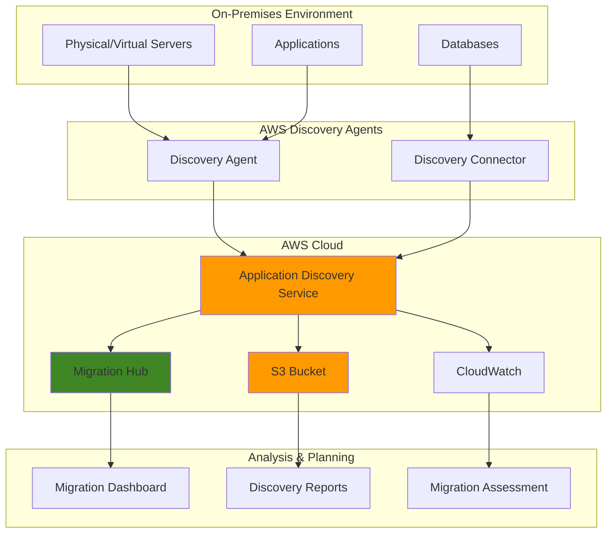

# Enterprise Migration Assessment and Planning

## Problem

Enterprise organizations planning cloud migrations struggle with incomplete visibility into their on-premises infrastructure dependencies, application relationships, and resource utilization patterns. Without comprehensive discovery data, migration planning becomes error-prone, leading to unexpected downtime, missed dependencies, and cost overruns that can derail entire digital transformation initiatives.

## Solution

AWS Application Discovery Service provides automated discovery and mapping of on-premises applications, servers, and network dependencies through lightweight agents and agentless discovery methods. Combined with AWS Migration Hub, this solution creates a centralized dashboard for tracking discovery progress, analyzing migration readiness, and planning phased migration strategies based on real infrastructure data.

## Architecture Diagram



## Prerequisites

1. AWS account with Administrator access or permissions for Application Discovery Service, Migration Hub, S3, and CloudWatch
2. AWS CLI v2 installed and configured (or AWS CloudShell)
3. On-premises servers running Windows Server 2008 R2+ or Linux (RHEL 6+, CentOS 6+, Ubuntu 12+)
4. Network connectivity from on-premises to AWS (ports 443 HTTPS outbound)
5. Basic understanding of enterprise infrastructure discovery and migration planning
6. Estimated cost: $0.10-$0.50 per server per day for discovery (varies by data collection frequency)

> **Note**: Application Discovery Service requires selecting a Migration Hub home region before deployment. This cannot be changed without contacting AWS Support.

## Preparation

```bash
# Set environment variables
export AWS_REGION=$(aws configure get region)
export AWS_ACCOUNT_ID=$(aws sts get-caller-identity \
    --query Account --output text)

# Generate unique identifiers for resources
RANDOM_SUFFIX=$(aws secretsmanager get-random-password \
    --exclude-punctuation --exclude-uppercase \
    --password-length 6 --require-each-included-type \
    --output text --query RandomPassword)

export MIGRATION_PROJECT_NAME="enterprise-migration-${RANDOM_SUFFIX}"
export S3_BUCKET_NAME="migration-discovery-${RANDOM_SUFFIX}"

# Create S3 bucket for discovery data export
aws s3 mb s3://${S3_BUCKET_NAME} --region ${AWS_REGION}

# Enable versioning for data integrity
aws s3api put-bucket-versioning \
    --bucket ${S3_BUCKET_NAME} \
    --versioning-configuration Status=Enabled

# Enable S3 bucket encryption
aws s3api put-bucket-encryption \
    --bucket ${S3_BUCKET_NAME} \
    --server-side-encryption-configuration \
    'Rules=[{ApplyServerSideEncryptionByDefault:{SSEAlgorithm:AES256}}]'

echo "✅ S3 bucket created for discovery data: ${S3_BUCKET_NAME}"
```

## Steps

1. **Configure Migration Hub Home Region**:

   AWS Migration Hub requires a designated home region where all migration tracking data is centralized. This foundational step establishes the regional endpoint for all migration tools and ensures consistent data aggregation across your enterprise migration program. The home region setting affects all subsequent Application Discovery Service operations and cannot be changed without AWS Support assistance.

   ```bash
   # Set Migration Hub home region (required first step)
   aws migrationhub-config create-home-region-control \
       --home-region ${AWS_REGION} \
       --target aws:${AWS_ACCOUNT_ID}:account
   
   # Verify home region configuration
   aws migrationhub-config get-home-region
   
   echo "✅ Migration Hub home region configured: ${AWS_REGION}"
   ```

   Your Migration Hub home region is now set, providing the foundation for centralized migration tracking across all AWS migration tools and enabling consistent data collection and reporting.

2. **Enable Application Discovery Service**:

   Application Discovery Service serves as the central collection point for infrastructure data from your on-premises environment. The service must be explicitly started to begin accepting data from deployed agents and connectors. This establishes the secure communication channel between your on-premises infrastructure and AWS discovery services, following the architecture described in the [AWS Application Discovery Service User Guide](https://docs.aws.amazon.com/application-discovery/latest/userguide/what-is-appdiscovery.html).

   ```bash
   # Start Application Discovery Service data collection
   aws discovery start-data-collection-by-agent-ids \
       --agent-ids
   
   # Verify service status
   aws discovery describe-configurations \
       --configuration-type SERVER \
       --max-results 1
   
   echo "✅ Application Discovery Service enabled and ready for data collection"
   ```

   The Application Discovery Service is now active and configured to receive discovery data. This establishes the AWS-side infrastructure needed to collect, process, and analyze data from your on-premises environment for comprehensive migration planning.

3. **Generate Discovery Agent Installation Package**:

   The Discovery Agent provides deep visibility into server performance, processes, and network connections by running as a lightweight service on each server. The agent connects securely to your Migration Hub home region and transmits data using TLS encryption. Installation requires root/administrator privileges and supports automatic updates when new versions become available.

   ```bash
   # Generate agent installation configuration
   cat > agent-config.json << EOF
   {
       "region": "${AWS_REGION}",
       "enableSSL": true,
       "collectionConfiguration": {
           "collectProcesses": true,
           "collectNetworkConnections": true,
           "collectPerformanceData": true
       }
   }
   EOF
   
   # Display agent download locations
   echo "✅ Agent configuration created"
   echo "Windows Agent: https://aws-discovery-agent.s3.amazonaws.com/windows/latest/AWSApplicationDiscoveryAgentInstaller.exe"
   echo "Linux Agent: https://aws-discovery-agent.s3.amazonaws.com/linux/latest/aws-discovery-agent.tar.gz"
   echo "Configuration file: agent-config.json"
   ```

   The installation package is configured with your AWS credentials and collection preferences. Deploy this agent to representative servers across your infrastructure to begin comprehensive data collection including system specifications, performance metrics, and network dependencies.

4. **Configure Discovery Connector for VMware Environments**:

   Discovery Connector provides agentless discovery for VMware vSphere environments, collecting data through vCenter APIs without requiring individual server access. This approach is ideal for environments with strict change control processes or when agent installation is not feasible across all servers. The connector deploys as a virtual appliance (OVA) within your VMware infrastructure.

   ```bash
   # Create connector configuration for VMware deployment
   cat > connector-config.json << EOF
   {
       "connectorName": "enterprise-connector-${RANDOM_SUFFIX}",
       "awsRegion": "${AWS_REGION}",
       "vCenterDetails": {
           "hostname": "vcenter.example.com",
           "username": "discovery-user",
           "enableSSL": true
       },
       "dataCollectionPreferences": {
           "collectVMMetrics": true,
           "collectNetworkInfo": true,
           "collectPerformanceData": true
       }
   }
   EOF
   
   echo "✅ Discovery Connector configuration prepared"
   echo "Download OVA: https://aws-discovery-connector.s3.amazonaws.com/VMware/latest/AWS-Discovery-Connector.ova"
   echo "Configuration file: connector-config.json"
   ```

   Deploy the Discovery Connector OVA to your VMware environment and configure it with the generated settings. This enables comprehensive discovery of your virtualized infrastructure without individual server modifications, providing inventory data and performance metrics for migration planning.

> **Warning**: Ensure proper vCenter permissions for the discovery user account. The account needs read-only access to virtual machines, hosts, and performance data as specified in the [vCenter permissions documentation](https://docs.aws.amazon.com/application-discovery/latest/userguide/agentless-collector.html).

5. **Start Continuous Data Export to S3**:

   Continuous data export enables automated, ongoing transfer of discovery data to S3 for long-term storage, advanced analytics, and integration with third-party migration tools. This process ensures data availability for detailed analysis while providing backup copies of your discovery information. The export includes server configurations, performance metrics, and network connection data.

   ```bash
   # Start continuous export to S3
   EXPORT_ID=$(aws discovery start-continuous-export \
       --s3-bucket ${S3_BUCKET_NAME} \
       --s3-prefix "discovery-data/" \
       --data-source AGENT \
       --query 'exportId' --output text)
   
   # Verify export configuration
   aws discovery describe-continuous-exports \
       --export-ids ${EXPORT_ID}
   
   echo "✅ Continuous data export started with ID: ${EXPORT_ID}"
   ```

   Continuous data export is now active and will automatically transfer discovery data to S3 as it's collected. This ensures real-time availability of infrastructure data for analysis tools and provides automated backup of your discovery information.

6. **Monitor Discovery Agent Health**:

   Regular monitoring of agent health ensures consistent data collection across your environment. Agents ping the Application Discovery Service every 15 minutes and report their status. Monitoring agent health helps identify connectivity issues, configuration problems, or servers that may have been decommissioned during the discovery period.

   ```bash
   # Create CloudWatch log group for discovery monitoring
   aws logs create-log-group \
       --log-group-name "/aws/discovery/${MIGRATION_PROJECT_NAME}"
   
   # Check current agent status
   aws discovery describe-agents \
       --query 'agentsInfo[*].[agentId,health,version,lastHealthPingTime]' \
       --output table
   
   # Set up CloudWatch alarm for agent health monitoring
   aws cloudwatch put-metric-alarm \
       --alarm-name "discovery-agent-health" \
       --alarm-description "Monitor discovery agent health" \
       --metric-name "AgentHealth" \
       --namespace "AWS/ApplicationDiscovery" \
       --statistic "Sum" \
       --period 900 \
       --threshold 1 \
       --comparison-operator "LessThanThreshold" \
       --evaluation-periods 2
   
   echo "✅ Discovery monitoring configured - agents will report every 15 minutes"
   ```

   Discovery monitoring is now active with CloudWatch integration. Agents will report their health status every 15 minutes, and you'll receive alerts if agents stop communicating, ensuring consistent data collection throughout your discovery period.

7. **Export Historical Discovery Data**:

   On-demand data exports provide point-in-time snapshots of discovery data in CSV format for detailed analysis and reporting. Regular exports ensure data availability for migration planning tools and provide historical baselines for capacity planning and trend analysis. Exports can be filtered by agent, time period, or configuration type.

   ```bash
   # Export current discovery data
   SNAPSHOT_EXPORT_ID=$(aws discovery start-export-task \
       --export-data-format CSV \
       --s3-bucket ${S3_BUCKET_NAME} \
       --s3-prefix "exports/$(date +%Y-%m-%d)/" \
       --query 'exportId' --output text)
   
   # Monitor export progress
   aws discovery describe-export-tasks \
       --export-ids ${SNAPSHOT_EXPORT_ID} \
       --query 'exportsInfo[0].[exportStatus,recordsCount,s3Bucket]'
   
   # Schedule weekly exports using EventBridge
   aws events put-rule \
       --name "weekly-discovery-export-${RANDOM_SUFFIX}" \
       --schedule-expression "rate(7 days)" \
       --state ENABLED \
       --description "Weekly discovery data export"
   
   echo "✅ Discovery data export initiated with ID: ${SNAPSHOT_EXPORT_ID}"
   ```

   Discovery data export is now configured with both on-demand and scheduled capabilities. Weekly automated exports ensure continuous availability of up-to-date infrastructure data for migration planning activities and provide historical trend data for capacity analysis.

8. **Set Up Migration Wave Planning Framework**:

   Migration waves organize servers and applications into logical groupings based on dependencies, business priorities, and technical complexity. This structured approach reduces migration risk by ensuring dependent systems migrate together and enables parallel migration streams to accelerate delivery timelines. The framework follows [AWS migration best practices](https://docs.aws.amazon.com/prescriptive-guidance/latest/migration-tools/discovery.html) for systematic enterprise migrations.

   ```bash
   # Create migration wave planning structure
   cat > migration-waves.json << EOF
   {
       "migrationProgram": {
           "name": "${MIGRATION_PROJECT_NAME}",
           "totalServers": 0,
           "estimatedTimelineMonths": 12
       },
       "waves": [
           {
               "waveNumber": 1,
               "name": "Pilot Wave - Low Risk Applications",
               "description": "Standalone applications with minimal dependencies for migration process validation",
               "priority": "HIGH",
               "targetMigrationDate": "2025-Q2",
               "estimatedServers": 10,
               "riskLevel": "LOW"
           },
           {
               "waveNumber": 2,
               "name": "Business Applications Wave",
               "description": "Core business applications with managed dependencies",
               "priority": "HIGH",
               "targetMigrationDate": "2025-Q3",
               "estimatedServers": 50,
               "riskLevel": "MEDIUM"
           },
           {
               "waveNumber": 3,
               "name": "Legacy Systems Wave",
               "description": "Complex legacy systems requiring refactoring or replacement",
               "priority": "MEDIUM",
               "targetMigrationDate": "2025-Q4",
               "estimatedServers": 30,
               "riskLevel": "HIGH"
           }
       ]
   }
   EOF
   
   # Upload wave planning to S3 for team collaboration
   aws s3 cp migration-waves.json \
       s3://${S3_BUCKET_NAME}/planning/migration-waves.json
   
   # Create wave planning dashboard structure
   aws s3 cp migration-waves.json \
       s3://${S3_BUCKET_NAME}/dashboard/wave-planning.json
   
   echo "✅ Migration wave planning framework created and uploaded to S3"
   ```

   The migration wave structure provides a framework for organizing your migration approach based on risk, dependencies, and business priorities. Use discovery data to assign servers and applications to appropriate waves, ensuring systematic migration execution with minimized business disruption.

> **Tip**: Start with a small pilot wave of 5-10 low-risk servers to validate your migration processes and tooling before progressing to larger, more complex waves. This approach follows AWS migration methodology for risk mitigation.

## Validation & Testing

1. **Verify Agent Health and Data Collection**:

   ```bash
   # Check agent status across all deployed agents
   aws discovery describe-agents \
       --query 'agentsInfo[*].[agentId,health,collectionStatus,lastHealthPingTime]' \
       --output table
   ```

   Expected output: All agents should show "HEALTHY" status with recent ping times (within last 15 minutes).

2. **Validate Discovery Data Quality**:

   ```bash
   # Review collected server data
   aws discovery list-configurations \
       --configuration-type SERVER \
       --query 'configurations[*].[configurationId,serverType,osName,osVersion]' \
       --output table
   
   # Check network connection data
   aws discovery list-configurations \
       --configuration-type NETWORK_CONNECTION \
       --max-results 10 \
       --query 'configurations[*].[sourceServer,destinationServer,destinationPort]'
   ```

   Expected output: Server listings with accurate OS information and network connection data showing application communication patterns.

3. **Test Continuous Export Functionality**:

   ```bash
   # Verify continuous export status
   aws discovery describe-continuous-exports \
       --export-ids ${EXPORT_ID} \
       --query 'descriptions[0].[status,dataSource,s3Bucket]'
   
   # List exported files in S3
   aws s3 ls s3://${S3_BUCKET_NAME}/discovery-data/ --recursive \
       --human-readable --summarize
   ```

   Expected output: Export status "ACTIVE" with data files appearing in S3 containing server, application, and network data.

4. **Validate Migration Hub Integration**:

   ```bash
   # Check Migration Hub home region configuration
   aws migrationhub-config get-home-region
   
   # Verify discovery service integration
   aws discovery describe-configurations \
       --configuration-type SERVER \
       --max-results 5 \
       --query 'configurations[0].keys(@)'
   ```

   Expected output: Home region confirmation and server configuration data indicating successful service integration.

## Cleanup

1. **Stop Data Collection**:

   ```bash
   # Stop continuous export
   aws discovery stop-continuous-export \
       --export-id ${EXPORT_ID}
   
   # Stop agent data collection
   AGENT_IDS=$(aws discovery describe-agents \
       --query 'agentsInfo[*].agentId' --output text)
   
   if [ ! -z "$AGENT_IDS" ]; then
       aws discovery stop-data-collection-by-agent-ids \
           --agent-ids ${AGENT_IDS}
   fi
   
   echo "✅ Data collection stopped"
   ```

2. **Remove Discovery Agents** (if desired):

   ```bash
   # Uninstall agents from servers (run on each server)
   echo "Windows: Run 'msiexec /x AWSApplicationDiscoveryAgent /quiet'"
   echo "Linux: Run 'sudo /opt/aws/discovery/uninstall'"
   
   echo "✅ Agent removal instructions provided"
   ```

3. **Clean Up AWS Resources**:

   ```bash
   # Delete S3 bucket contents and bucket
   aws s3 rm s3://${S3_BUCKET_NAME} --recursive
   aws s3 rb s3://${S3_BUCKET_NAME}
   
   # Delete CloudWatch log group
   aws logs delete-log-group \
       --log-group-name "/aws/discovery/${MIGRATION_PROJECT_NAME}"
   
   # Remove EventBridge rule
   aws events delete-rule \
       --name "weekly-discovery-export-${RANDOM_SUFFIX}"
   
   # Remove CloudWatch alarm
   aws cloudwatch delete-alarms \
       --alarm-names "discovery-agent-health"
   
   echo "✅ AWS resources cleaned up"
   ```

## Discussion

AWS Application Discovery Service addresses the critical challenge of infrastructure visibility that enterprise organizations face when planning cloud migrations. The service provides two complementary discovery methods: Discovery Agents for detailed server-level data collection and Discovery Connectors for agentless VMware environment discovery. This dual approach ensures comprehensive coverage across diverse infrastructure landscapes while accommodating different organizational policies regarding software installation and change management processes.

The collected data enables data-driven migration decisions by revealing application dependencies, performance patterns, and resource utilization that are often undocumented in enterprise environments. Understanding these relationships is crucial for planning migration waves that minimize downtime and avoid breaking critical business processes. The integration with Migration Hub provides centralized visibility for migration managers and enables tracking progress across multiple migration tools and project phases, following AWS Well-Architected Framework principles for operational excellence.

Security considerations are paramount in enterprise environments, and Application Discovery Service addresses these through encrypted data transmission using TLS, comprehensive IAM-based access controls, and configurable data retention policies. The service collects metadata about applications and infrastructure without accessing actual business data, maintaining security boundaries while providing necessary migration planning information. Organizations can configure data collection scope to exclude sensitive systems or limit data types collected based on compliance requirements, supporting frameworks like SOC 2, HIPAA, and PCI DSS.

Cost optimization opportunities emerge from the detailed utilization data collected during the discovery period. Organizations frequently discover over-provisioned servers, unused applications, and opportunities for workload consolidation that can significantly reduce migration scope and ongoing cloud costs. The performance data enables accurate right-sizing decisions, ensuring migrated workloads run efficiently in AWS without over-provisioning resources. This aligns with [AWS Cost Optimization best practices](https://docs.aws.amazon.com/wellarchitected/latest/cost-optimization-pillar/welcome.html) and [right-sizing guidance](https://docs.aws.amazon.com/cost-management/latest/userguide/ce-rightsizing.html) for migration planning and ongoing cost management.

> **Note**: For comprehensive discovery, maintain data collection for at least two weeks to capture weekly usage patterns and periodic workloads. Extended collection periods provide better insights into utilization trends. See the [AWS Application Discovery Service User Guide](https://docs.aws.amazon.com/application-discovery/latest/userguide/) for detailed configuration options.

## Challenge

Extend this solution by implementing these enhancements:

1. **Automated Migration Readiness Assessment**: Develop Lambda functions that analyze discovery data to automatically score applications for cloud readiness and recommend appropriate migration strategies (rehost, replatform, refactor) based on dependency complexity and resource utilization patterns.

2. **Cost Estimation Integration**: Connect discovery data with AWS Pricing APIs and AWS Cost Explorer to generate detailed cost estimates for different migration scenarios and EC2 instance types based on actual utilization patterns and regional pricing variations.

3. **Dependency Mapping Visualization**: Create a web-based dashboard using Amazon QuickSight or AWS Application Composer that visualizes application dependencies and helps identify migration wave boundaries based on communication patterns and business criticality.

4. **Automated Compliance Reporting**: Build compliance reports using AWS Config and Security Hub that map discovered applications to regulatory requirements (SOX, HIPAA, PCI DSS) and identify any compliance gaps that need addressing during migration planning.

5. **Infrastructure as Code Generation**: Develop automation using AWS CDK or CloudFormation that translates discovery data into infrastructure templates for rapid environment provisioning, including networking, security groups, and load balancer configurations based on discovered dependencies.

## Infrastructure Code

*Infrastructure code will be generated after recipe approval.*